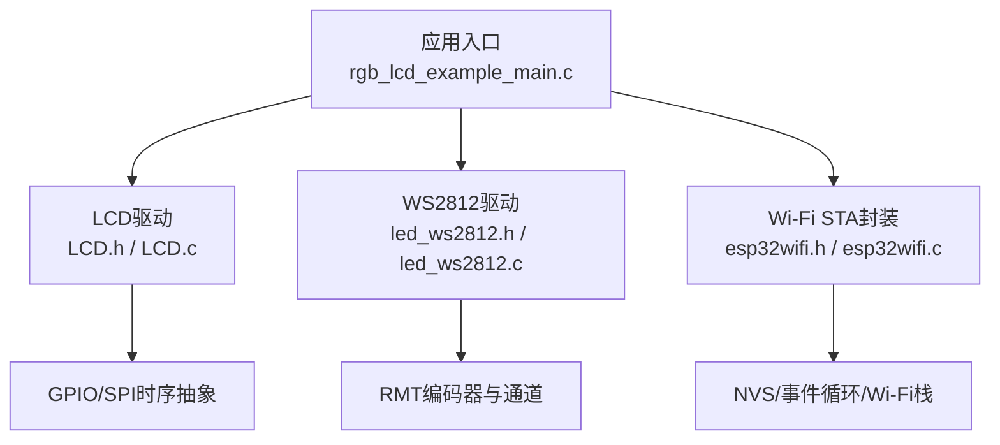
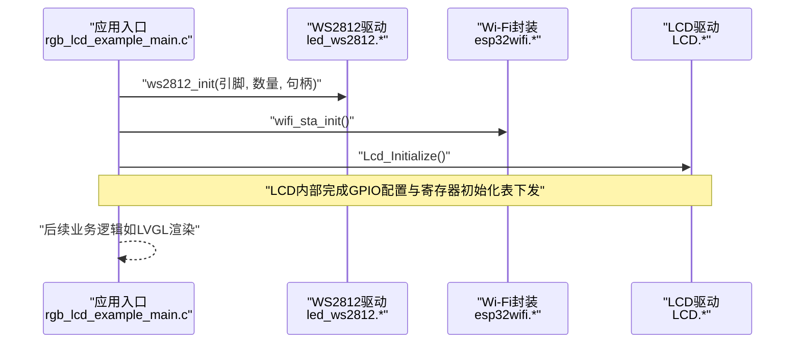
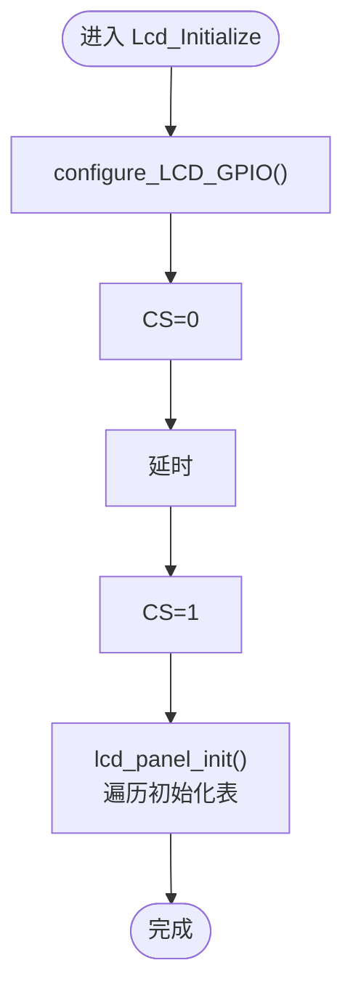
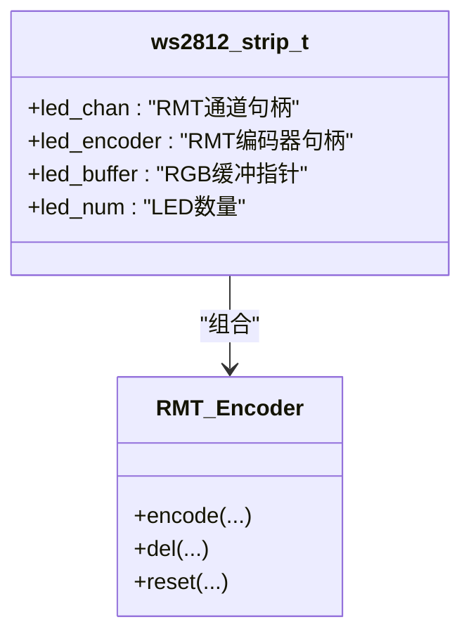
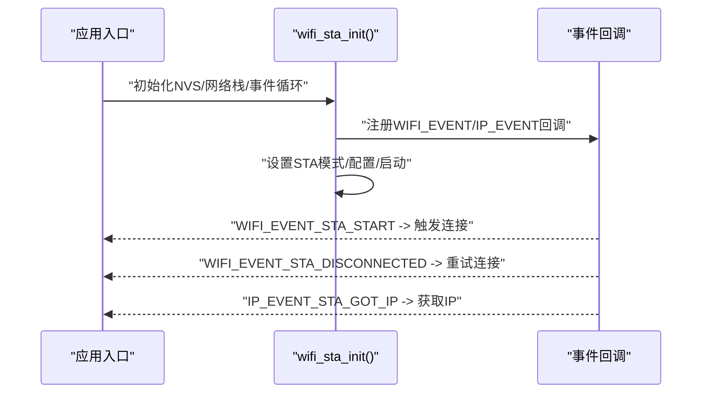
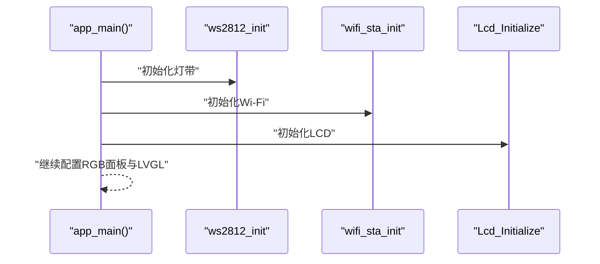
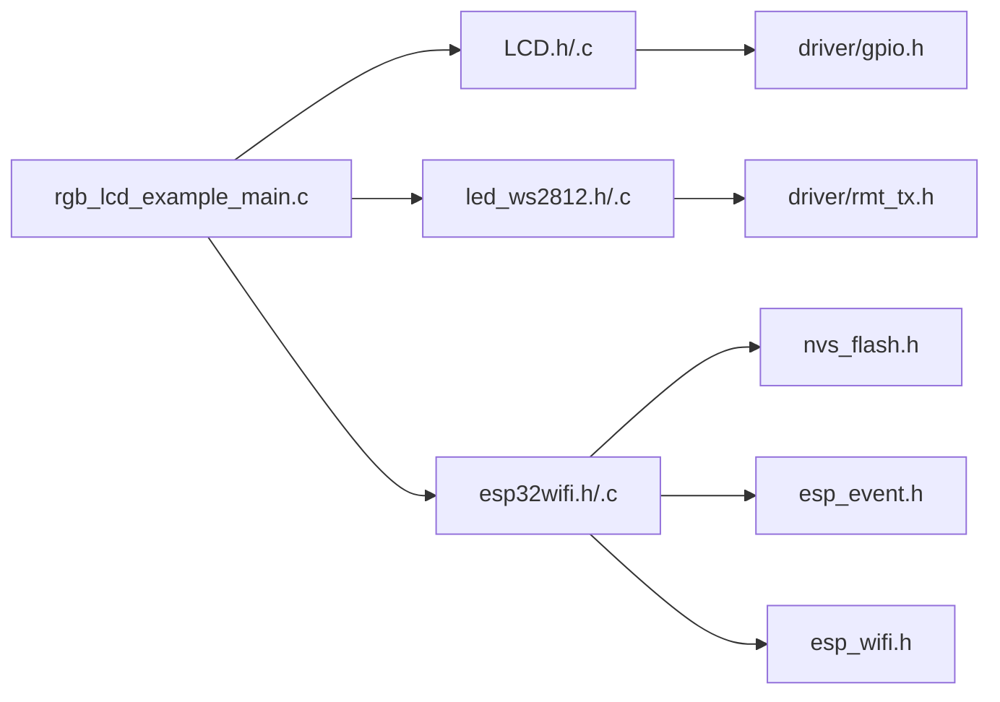

# API参考手册

<cite>
**本文引用的文件**
- [LCD.h](file://ESP32开发板/TK021F2699_ESP32_LVGL_GIF_LED/TK021F2699_ESP32_LVGL_GIF_LED/main/LCD.h)
- [LCD.c](file://ESP32开发板/TK021F2699_ESP32_LVGL_GIF_LED/TK021F2699_ESP32_LVGL_GIF_LED/main/LCD.c)
- [led_ws2812.h](file://ESP32开发板/TK021F2699_ESP32_LVGL_GIF_LED/TK021F2699_ESP32_LVGL_GIF_LED/main/led_ws2812/led_ws2812.h)
- [led_ws2812.c](file://ESP32开发板/TK021F2699_ESP32_LVGL_GIF_LED/TK021F2699_ESP32_LVGL_GIF_LED/main/led_ws2812/led_ws2812.c)
- [esp32wifi.h](file://ESP32开发板/TK021F2699_ESP32_LVGL_GIF_LED/TK021F2699_ESP32_LVGL_GIF_LED/main/wifi/esp32wifi.h)
- [esp32wifi.c](file://ESP32开发板/TK021F2699_ESP32_LVGL_GIF_LED/TK021F2699_ESP32_LVGL_GIF_LED/main/wifi/esp32wifi.c)
- [rgb_lcd_example_main.c](file://ESP32开发板/TK021F2699_ESP32_LVGL_GIF_LED/TK021F2699_ESP32_LVGL_GIF_LED/main/rgb_lcd_example_main.c)
</cite>

## 目录
1. [简介](#简介)
2. [项目结构](#项目结构)
3. [核心组件](#核心组件)
4. [架构总览](#架构总览)
5. [详细组件分析](#详细组件分析)
6. [依赖关系分析](#依赖关系分析)
7. [性能与资源考虑](#性能与资源考虑)
8. [故障排查指南](#故障排查指南)
9. [版本兼容性与迁移](#版本兼容性与迁移)
10. [结论](#结论)

## 简介
本API参考手册面向PathFinder_LCD项目的开发者，系统化梳理并文档化以下公共接口：
- LCD驱动初始化：Lcd_Initialize()、configure_LCD_GPIO()
- WS2812灯带控制：ws2812_init()、ws2812_deinit()、ws2812_write()
- Wi-Fi STA连接：wifi_sta_init()、get_wifi_signal_strength()

手册包含函数签名、参数说明、返回值、错误码、数据结构定义、枚举与配置项、调用顺序与依赖关系、错误处理模式、最佳实践以及示例路径引用。读者无需深入底层即可快速集成与使用这些模块。

## 项目结构
本项目采用“功能模块+示例入口”的组织方式：
- main/ 下按功能划分子目录：lcd（LCD驱动）、led_ws2812（WS2812驱动）、wifi（Wi-Fi STA封装）
- rgb_lcd_example_main.c 作为应用入口，负责系统初始化、模块装配与LVGL任务调度

图表来源
- [rgb_lcd_example_main.c:150-303](file://ESP32开发板/TK021F2699_ESP32_LVGL_GIF_LED/TK021F2699_ESP32_LVGL_GIF_LED/main/rgb_lcd_example_main.c#L150-L303)
- [LCD.h:1-30](file://ESP32开发板/TK021F2699_ESP32_LVGL_GIF_LED/TK021F2699_ESP32_LVGL_GIF_LED/main/LCD.h#L1-L30)
- [LCD.c:1-219](file://ESP32开发板/TK021F2699_ESP32_LVGL_GIF_LED/TK021F2699_ESP32_LVGL_GIF_LED/main/LCD.c#L1-L219)
- [led_ws2812.h:1-46](file://ESP32开发板/TK021F2699_ESP32_LVGL_GIF_LED/TK021F2699_ESP32_LVGL_GIF_LED/main/led_ws2812/led_ws2812.h#L1-L46)
- [led_ws2812.c:1-252](file://ESP32开发板/TK021F2699_ESP32_LVGL_GIF_LED/TK021F2699_ESP32_LVGL_GIF_LED/main/led_ws2812/led_ws2812.c#L1-L252)
- [esp32wifi.h:1-41](file://ESP32开发板/TK021F2699_ESP32_LVGL_GIF_LED/TK021F2699_ESP32_LVGL_GIF_LED/main/wifi/esp32wifi.h#L1-L41)
- [esp32wifi.c:1-109](file://ESP32开发板/TK021F2699_ESP32_LVGL_GIF_LED/TK021F2699_ESP32_LVGL_GIF_LED/main/wifi/esp32wifi.c#L1-L109)

章节来源
- [rgb_lcd_example_main.c:150-303](file://ESP32开发板/TK021F2699_ESP32_LVGL_GIF_LED/TK021F2699_ESP32_LVGL_GIF_LED/main/rgb_lcd_example_main.c#L150-L303)

## 核心组件
本节概述各模块对外暴露的API与其职责边界。

- LCD模块
  - configure_LCD_GPIO(): 配置SPI相关GPIO为推挽输出，拉高时钟与数据线初始电平
  - Lcd_Initialize(): 完成GPIO配置、CS拉低/延时/拉高复位序列，随后下发面板寄存器初始化表

- WS2812模块
  - ws2812_init(gpio, maxled, handle): 分配句柄与RGB缓存，创建RMT发送通道与自定义编码器，使能通道
  - ws2812_deinit(handle): 释放编码器、缓冲区与句柄
  - ws2812_write(handle, index, r, g, b): 将GRB写入对应LED索引位置，并通过RMT传输

- Wi-Fi模块
  - wifi_sta_init(): 初始化NVS、网络栈、事件循环、STA对象与Wi-Fi驱动，注册事件回调，设置SSID/密码并启动
  - get_wifi_signal_strength(): 查询当前AP信息并返回RSSI；失败时返回默认值

章节来源
- [LCD.h:11-30](file://ESP32开发板/TK021F2699_ESP32_LVGL_GIF_LED/TK021F2699_ESP32_LVGL_GIF_LED/main/LCD.h#L11-L30)
- [LCD.c:17-219](file://ESP32开发板/TK021F2699_ESP32_LVGL_GIF_LED/TK021F2699_ESP32_LVGL_GIF_LED/main/LCD.c#L17-L219)
- [led_ws2812.h:15-41](file://ESP32开发板/TK021F2699_ESP32_LVGL_GIF_LED/TK021F2699_ESP32_LVGL_GIF_LED/main/led_ws2812/led_ws2812.h#L15-L41)
- [led_ws2812.c:179-250](file://ESP32开发板/TK021F2699_ESP32_LVGL_GIF_LED/TK021F2699_ESP32_LVGL_GIF_LED/main/led_ws2812/led_ws2812.c#L179-L250)
- [esp32wifi.h:28-35](file://ESP32开发板/TK021F2699_ESP32_LVGL_GIF_LED/TK021F2699_ESP32_LVGL_GIF_LED/main/wifi/esp32wifi.h#L28-L35)
- [esp32wifi.c:46-109](file://ESP32开发板/TK021F2699_ESP32_LVGL_GIF_LED/TK021F2699_ESP32_LVGL_GIF_LED/main/wifi/esp32wifi.c#L46-L109)

## 架构总览
下图展示应用入口与各模块的交互关系及关键数据流。

图表来源
- [rgb_lcd_example_main.c:150-182](file://ESP32开发板/TK021F2699_ESP32_LVGL_GIF_LED/TK021F2699_ESP32_LVGL_GIF_LED/main/rgb_lcd_example_main.c#L150-L182)
- [led_ws2812.c:179-213](file://ESP32开发板/TK021F2699_ESP32_LVGL_GIF_LED/TK021F2699_ESP32_LVGL_GIF_LED/main/led_ws2812/led_ws2812.c#L179-L213)
- [esp32wifi.c:46-95](file://ESP32开发板/TK021F2699_ESP32_LVGL_GIF_LED/TK021F2699_ESP32_LVGL_GIF_LED/main/wifi/esp32wifi.c#L46-L95)
- [LCD.c:205-219](file://ESP32开发板/TK021F2699_ESP32_LVGL_GIF_LED/TK021F2699_ESP32_LVGL_GIF_LED/main/LCD.c#L205-L219)

## 详细组件分析

### LCD驱动API
- 函数：configure_LCD_GPIO()
  - 作用：配置CS/SCK/SDA为输出，并将SCK/SDA置高
  - 参数：无
  - 返回：无
  - 错误码：无（内部通过ESP_ERROR_CHECK上报）
  - 注意事项：若需硬件复位，可启用注释中的RESET流程

- 函数：Lcd_Initialize()
  - 作用：完成GPIO配置、CS拉低/延时/拉高，随后执行面板寄存器初始化表
  - 参数：无
  - 返回：无
  - 错误码：无（内部通过ESP_ERROR_CHECK上报）
  - 数据结构：LCM_setting_table（命令、参数个数、参数列表），以结束标记终止
  - 时序要点：SPI_WriteComm/SPI_WriteData实现3线串行协议

图表来源
- [LCD.c:17-40](file://ESP32开发板/TK021F2699_ESP32_LVGL_GIF_LED/TK021F2699_ESP32_LVGL_GIF_LED/main/LCD.c#L17-L40)
- [LCD.c:51-83](file://ESP32开发板/TK021F2699_ESP32_LVGL_GIF_LED/TK021F2699_ESP32_LVGL_GIF_LED/main/LCD.c#L51-L83)
- [LCD.c:86-160](file://ESP32开发板/TK021F2699_ESP32_LVGL_GIF_LED/TK021F2699_ESP32_LVGL_GIF_LED/main/LCD.c#L86-L160)
- [LCD.c:186-219](file://ESP32开发板/TK021F2699_ESP32_LVGL_GIF_LED/TK021F2699_ESP32_LVGL_GIF_LED/main/LCD.c#L186-L219)

章节来源
- [LCD.h:11-30](file://ESP32开发板/TK021F2699_ESP32_LVGL_GIF_LED/TK021F2699_ESP32_LVGL_GIF_LED/main/LCD.h#L11-L30)
- [LCD.c:17-219](file://ESP32开发板/TK021F2699_ESP32_LVGL_GIF_LED/TK021F2699_ESP32_LVGL_GIF_LED/main/LCD.c#L17-L219)

### WS2812驱动API
- 函数：ws2812_init(gpio_num_t gpio, int maxled, ws2812_strip_handle_t* handle)
  - 作用：分配句柄与RGB缓冲，创建RMT TX通道与自定义编码器，使能通道
  - 参数：
    - gpio: 控制引脚
    - maxled: LED数量
    - handle: 返回的句柄指针
  - 返回：ESP_OK 或 ESP_FAIL
  - 错误码：内存不足、RMT创建失败等会返回错误
  - 注意：内部分辨率设置为10MHz，保证最小时间单元精度

- 函数：ws2812_deinit(ws2812_strip_handle_t handle)
  - 作用：释放编码器、缓冲区与句柄
  - 参数：handle
  - 返回：ESP_OK 或 ESP_FAIL

- 函数：ws2812_write(ws2812_strip_handle_t handle, uint32_t index, uint32_t r, uint32_t g, uint32_t b)
  - 作用：将GRB写入指定索引位置并通过RMT发送
  - 参数：
    - handle: 句柄
    - index: LED索引（从0开始）
    - r,g,b: 颜色分量
  - 返回：ESP_OK 或 ESP_FAIL
  - 注意：WS2812数据顺序为GRB；index越界直接返回失败

图表来源
- [led_ws2812.c:16-22](file://ESP32开发板/TK021F2699_ESP32_LVGL_GIF_LED/TK021F2699_ESP32_LVGL_GIF_LED/main/led_ws2812/led_ws2812.c#L16-L22)
- [led_ws2812.c:113-171](file://ESP32开发板/TK021F2699_ESP32_LVGL_GIF_LED/TK021F2699_ESP32_LVGL_GIF_LED/main/led_ws2812/led_ws2812.c#L113-L171)
- [led_ws2812.c:179-250](file://ESP32开发板/TK021F2699_ESP32_LVGL_GIF_LED/TK021F2699_ESP32_LVGL_GIF_LED/main/led_ws2812/led_ws2812.c#L179-L250)

章节来源
- [led_ws2812.h:15-41](file://ESP32开发板/TK021F2699_ESP32_LVGL_GIF_LED/TK021F2699_ESP32_LVGL_GIF_LED/main/led_ws2812/led_ws2812.h#L15-L41)
- [led_ws2812.c:179-250](file://ESP32开发板/TK021F2699_ESP32_LVGL_GIF_LED/TK021F2699_ESP32_LVGL_GIF_LED/main/led_ws2812/led_ws2812.c#L179-L250)

### Wi-Fi STA封装API
- 函数：wifi_sta_init()
  - 作用：初始化NVS、网络栈、事件循环、STA对象与Wi-Fi驱动，注册事件回调，设置SSID/密码并启动
  - 参数：无
  - 返回：ESP_OK 或 ESP_FAIL
  - 事件：
    - WIFI_EVENT_STA_START -> 自动连接
    - WIFI_EVENT_STA_DISCONNECTED -> 重连
    - IP_EVENT_STA_GOT_IP -> 获取IP成功

- 函数：get_wifi_signal_strength()
  - 作用：读取当前AP信息并返回RSSI
  - 参数：无
  - 返回：int（RSSI），失败返回-100

图表来源
- [esp32wifi.c:14-43](file://ESP32开发板/TK021F2699_ESP32_LVGL_GIF_LED/TK021F2699_ESP32_LVGL_GIF_LED/main/wifi/esp32wifi.c#L14-L43)
- [esp32wifi.c:46-95](file://ESP32开发板/TK021F2699_ESP32_LVGL_GIF_LED/TK021F2699_ESP32_LVGL_GIF_LED/main/wifi/esp32wifi.c#L46-L95)

章节来源
- [esp32wifi.h:28-35](file://ESP32开发板/TK021F2699_ESP32_LVGL_GIF_LED/TK021F2699_ESP32_LVGL_GIF_LED/main/wifi/esp32wifi.h#L28-L35)
- [esp32wifi.c:46-109](file://ESP32开发板/TK021F2699_ESP32_LVGL_GIF_LED/TK021F2699_ESP32_LVGL_GIF_LED/main/wifi/esp32wifi.c#L46-L109)

### 应用入口与调用顺序
- 入口函数app_main()中，典型初始化顺序如下：
  1) 初始化WS2812
  2) 初始化Wi-Fi STA
  3) 初始化LCD（在RGB面板驱动之前）
  4) 配置并初始化RGB面板、LVGL显示驱动与任务

图表来源
- [rgb_lcd_example_main.c:150-182](file://ESP32开发板/TK021F2699_ESP32_LVGL_GIF_LED/TK021F2699_ESP32_LVGL_GIF_LED/main/rgb_lcd_example_main.c#L150-L182)

章节来源
- [rgb_lcd_example_main.c:150-303](file://ESP32开发板/TK021F2699_ESP32_LVGL_GIF_LED/TK021F2699_ESP32_LVGL_GIF_LED/main/rgb_lcd_example_main.c#L150-L303)

## 依赖关系分析
- LCD模块依赖ESP-IDF的GPIO驱动与日志库，内部通过宏封装SPI时序
- WS2812模块依赖ESP-IDF的RMT子系统（rmt_tx_channel、rmt_encoder）
- Wi-Fi模块依赖NVS、事件循环、Wi-Fi与网络栈
- 应用入口同时依赖上述三个模块，并在初始化阶段依次调用

图表来源
- [rgb_lcd_example_main.c:1-23](file://ESP32开发板/TK021F2699_ESP32_LVGL_GIF_LED/TK021F2699_ESP32_LVGL_GIF_LED/main/rgb_lcd_example_main.c#L1-L23)
- [LCD.h:1-6](file://ESP32开发板/TK021F2699_ESP32_LVGL_GIF_LED/TK021F2699_ESP32_LVGL_GIF_LED/main/LCD.h#L1-L6)
- [led_ws2812.c:7-10](file://ESP32开发板/TK021F2699_ESP32_LVGL_GIF_LED/TK021F2699_ESP32_LVGL_GIF_LED/main/led_ws2812/led_ws2812.c#L7-L10)
- [esp32wifi.h:13-26](file://ESP32开发板/TK021F2699_ESP32_LVGL_GIF_LED/TK021F2699_ESP32_LVGL_GIF_LED/main/wifi/esp32wifi.h#L13-L26)

章节来源
- [rgb_lcd_example_main.c:1-23](file://ESP32开发板/TK021F2699_ESP32_LVGL_GIF_LED/TK021F2699_ESP32_LVGL_GIF_LED/main/rgb_lcd_example_main.c#L1-L23)
- [LCD.h:1-6](file://ESP32开发板/TK021F2699_ESP32_LVGL_GIF_LED/TK021F2699_ESP32_LVGL_GIF_LED/main/LCD.h#L1-L6)
- [led_ws2812.c:7-10](file://ESP32开发板/TK021F2699_ESP32_LVGL_GIF_LED/TK021F2699_ESP32_LVGL_GIF_LED/main/led_ws2812/led_ws2812.c#L7-L10)
- [esp32wifi.h:13-26](file://ESP32开发板/TK021F2699_ESP32_LVGL_GIF_LED/TK021F2699_ESP32_LVGL_GIF_LED/main/wifi/esp32wifi.h#L13-L26)

## 性能与资源考虑
- WS2812
  - RMT分辨率设为10MHz，确保时序精度；建议合理设置maxled避免过大缓冲占用PSRAM
  - 批量更新时尽量合并写操作，减少多次rmt_transmit开销
- LCD
  - SPI软件位操作较耗时，初始化表较长，建议在低功耗场景减少重复初始化
  - 如需硬件复位，请确认硬件连线与时序满足屏规格
- Wi-Fi
  - 首次上电可能因NVS损坏而擦除并重初始化，属于预期行为
  - 断线重连由事件回调自动处理，注意避免频繁重连导致功耗上升

[本节为通用指导，不直接分析具体文件]

## 故障排查指南
- WS2812无法点亮或颜色异常
  - 检查gpio引脚是否正确、maxled是否与实际一致
  - 确认ws2812_write传入的index未越界
  - 观察rmt_transmit返回值是否为ESP_OK
  - 参考路径：[led_ws2812.c:236-250](file://ESP32开发板/TK021F2699_ESP32_LVGL_GIF_LED/TK021F2699_ESP32_LVGL_GIF_LED/main/led_ws2812/led_ws2812.c#L236-L250)

- LCD无显示或花屏
  - 确认configure_LCD_GPIO已正确配置且SCK/SDA初始电平正确
  - 检查初始化表末尾是否以结束标记终止
  - 参考路径：[LCD.c:17-40](file://ESP32开发板/TK021F2699_ESP32_LVGL_GIF_LED/TK021F2699_ESP32_LVGL_GIF_LED/main/LCD.c#L17-L40)、[LCD.c:86-160](file://ESP32开发板/TK021F2699_ESP32_LVGL_GIF_LED/TK021F2699_ESP32_LVGL_GIF_LED/main/LCD.c#L86-L160)

- Wi-Fi无法连接或信号强度读取失败
  - 检查NVS初始化是否成功，必要时擦除后重试
  - 关注WIFI_EVENT_STA_DISCONNECTED事件是否触发重连
  - get_wifi_signal_strength失败时返回-100，属正常降级
  - 参考路径：[esp32wifi.c:46-95](file://ESP32开发板/TK021F2699_ESP32_LVGL_GIF_LED/TK021F2699_ESP32_LVGL_GIF_LED/main/wifi/esp32wifi.c#L46-L95)、[esp32wifi.c:98-109](file://ESP32开发板/TK021F2699_ESP32_LVGL_GIF_LED/TK021F2699_ESP32_LVGL_GIF_LED/main/wifi/esp32wifi.c#L98-L109)

章节来源
- [led_ws2812.c:236-250](file://ESP32开发板/TK021F2699_ESP32_LVGL_GIF_LED/TK021F2699_ESP32_LVGL_GIF_LED/main/led_ws2812/led_ws2812.c#L236-L250)
- [LCD.c:17-40](file://ESP32开发板/TK021F2699_ESP32_LVGL_GIF_LED/TK021F2699_ESP32_LVGL_GIF_LED/main/LCD.c#L17-L40)
- [LCD.c:86-160](file://ESP32开发板/TK021F2699_ESP32_LVGL_GIF_LED/TK021F2699_ESP32_LVGL_GIF_LED/main/LCD.c#L86-L160)
- [esp32wifi.c:46-95](file://ESP32开发板/TK021F2699_ESP32_LVGL_GIF_LED/TK021F2699_ESP32_LVGL_GIF_LED/main/wifi/esp32wifi.c#L46-L95)
- [esp32wifi.c:98-109](file://ESP32开发板/TK021F2699_ESP32_LVGL_GIF_LED/TK021F2699_ESP32_LVGL_GIF_LED/main/wifi/esp32wifi.c#L98-L109)

## 版本兼容性与迁移
- 兼容性
  - 基于ESP-IDF框架，依赖driver/gpio、driver/rmt_tx、esp_wifi、nvs_flash等标准组件
  - 若升级ESP-IDF版本，需关注RMT与Wi-Fi API变更，尤其是rmt_new_tx_channel与esp_wifi_set_config等接口
- 迁移建议
  - 若更换MCU或引脚，优先修改WS2812与LCD的引脚宏与GPIO配置
  - 若调整LED数量，需同步更新maxled与缓冲区大小
  - 若更改Wi-Fi认证方式，请在wifi_config.sta.threshold.authmode处调整

[本节为通用指导，不直接分析具体文件]

## 结论
本手册对PathFinder_LCD的核心API进行了系统化整理，涵盖函数签名、参数与返回值、错误码、数据结构、依赖关系与调用顺序，并提供故障排查与最佳实践建议。按照推荐顺序进行初始化与错误处理，可在不同硬件与固件版本间保持良好稳定性与可维护性。