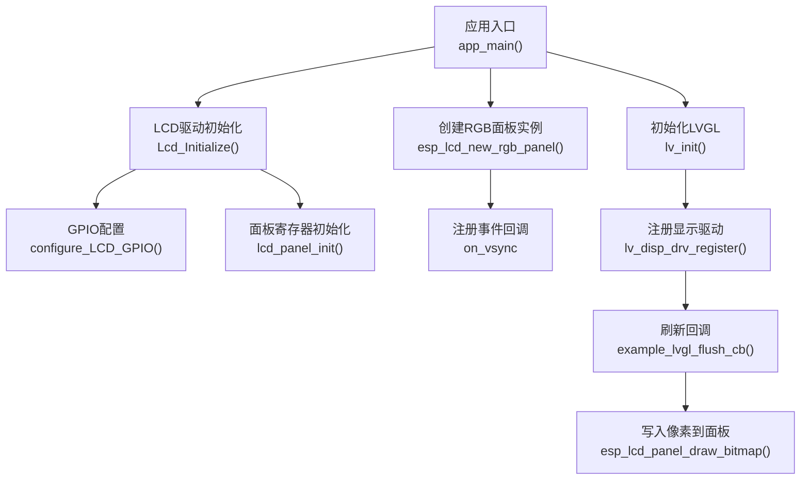
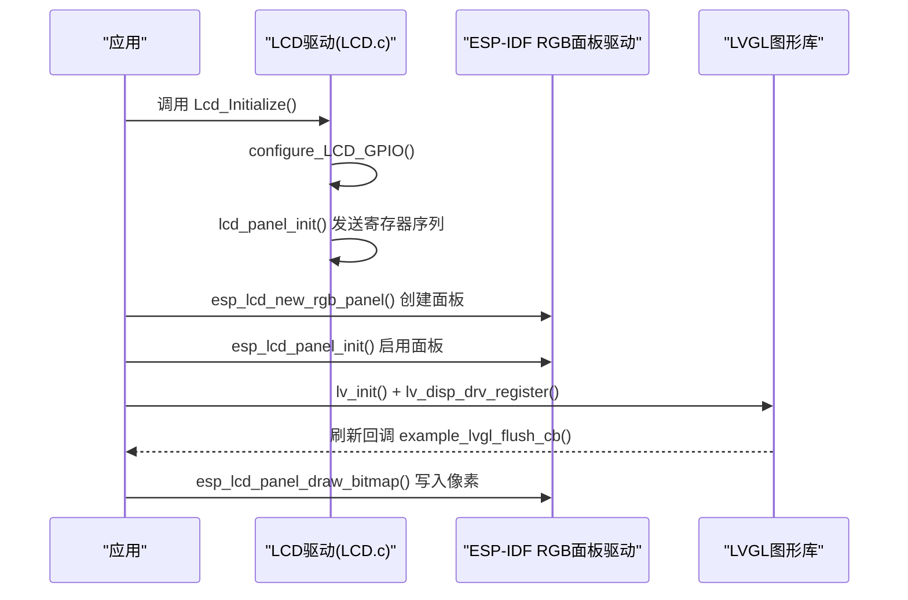
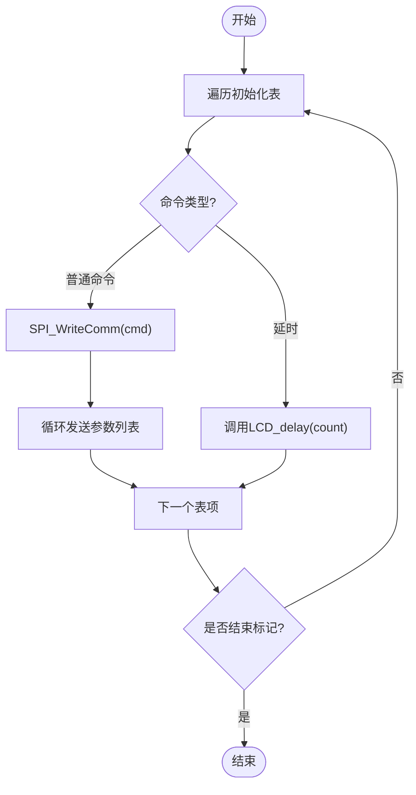
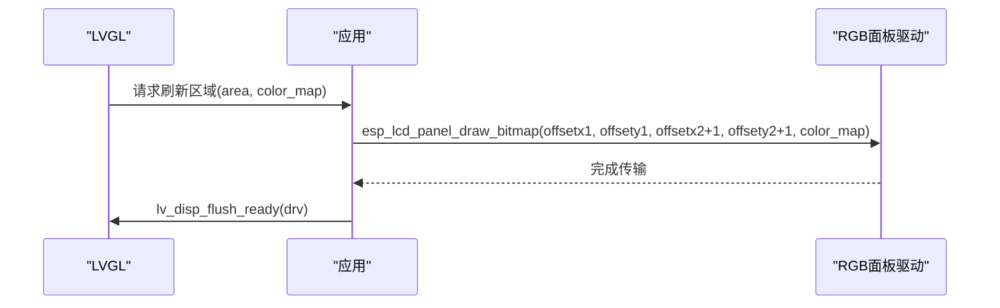
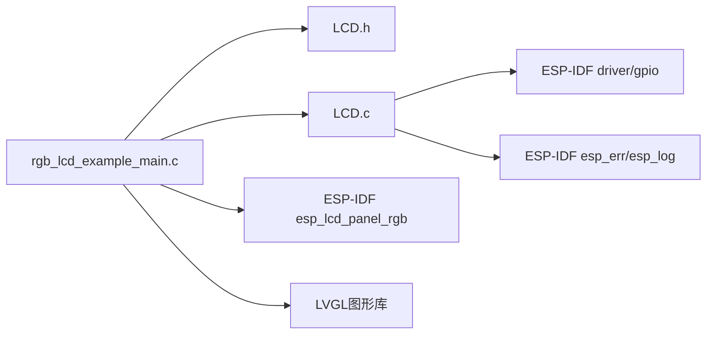

# LCD驱动API

<cite>
**本文引用的文件**
- [LCD.h](file://ESP32开发板/TK021F2699_ESP32_LVGL_GIF_LED/TK021F2699_ESP32_LVGL_GIF_LED/main/LCD.h)
- [LCD.c](file://ESP32开发板/TK021F2699_ESP32_LVGL_GIF_LED/TK021F2699_ESP32_LVGL_GIF_LED/main/LCD.c)
- [rgb_lcd_example_main.c](file://ESP32开发板/TK021F2699_ESP32_LVGL_GIF_LED/TK021F2699_ESP32_LVGL_GIF_LED/main/rgb_lcd_example_main.c)
</cite>

## 目录
1. [简介](#简介)
2. [项目结构](#项目结构)
3. [核心组件](#核心组件)
4. [架构总览](#架构总览)
5. [详细组件分析](#详细组件分析)
6. [依赖关系分析](#依赖关系分析)
7. [性能考虑](#性能考虑)
8. [故障排除指南](#故障排除指南)
9. [结论](#结论)
10. [附录：完整示例与集成要点](#附录完整示例与集成要点)

## 简介
本文件为LCD驱动模块的API文档，聚焦以下目标：
- 记录Lcd_Initialize()函数的接口规范（原型、参数、返回值、错误码）
- 说明configure_LCD_GPIO() GPIO配置接口的使用方法
- 解释LCD_SPI_CS、SPI_DCLK、SPI_SDA等宏定义的作用和使用场景
- 提供RGB LCD时序配置的详细参数说明（分辨率、颜色格式、帧缓冲管理）
- 给出完整的代码示例路径，展示如何正确初始化LCD驱动并处理显示数据
- 说明与LVGL图形系统的集成方式与数据流传递机制
- 提供常见问题排查与性能优化建议

## 项目结构
本项目包含一个基于ESP-IDF的RGB LCD示例工程，其中：
- main/LCD.h 与 main/LCD.c 实现了一个通过三线串行接口对LCD进行初始化的驱动层（用于面板预配置）
- main/rgb_lcd_example_main.c 使用ESP-IDF的esp_lcd_panel_rgb驱动完成真正的RGB并行时序输出，并与LVGL集成

图表来源
- [rgb_lcd_example_main.c:150-303](file://ESP32开发板/TK021F2699_ESP32_LVGL_GIF_LED/TK021F2699_ESP32_LVGL_GIF_LED/main/rgb_lcd_example_main.c#L150-L303)
- [LCD.c:205-219](file://ESP32开发板/TK021F2699_ESP32_LVGL_GIF_LED/TK021F2699_ESP32_LVGL_GIF_LED/main/LCD.c#L205-L219)
- [LCD.c:186-204](file://ESP32开发板/TK021F2699_ESP32_LVGL_GIF_LED/TK021F2699_ESP32_LVGL_GIF_LED/main/LCD.c#L186-L204)
- [LCD.c:17-40](file://ESP32开发板/TK021F2699_ESP32_LVGL_GIF_LED/TK021F2699_ESP32_LVGL_GIF_LED/main/LCD.c#L17-L40)

章节来源
- [rgb_lcd_example_main.c:150-303](file://ESP32开发板/TK021F2699_ESP32_LVGL_GIF_LED/TK021F2699_ESP32_LVGL_GIF_LED/main/rgb_lcd_example_main.c#L150-L303)
- [LCD.c:17-40](file://ESP32开发板/TK021F2699_ESP32_LVGL_GIF_LED/TK021F2699_ESP32_LVGL_GIF_LED/main/LCD.c#L17-L40)
- [LCD.c:186-219](file://ESP32开发板/TK021F2699_ESP32_LVGL_GIF_LED/TK021F2699_ESP32_LVGL_GIF_LED/main/LCD.c#L186-L219)

## 核心组件
本节聚焦LCD驱动对外暴露的API与关键宏。

- Lcd_Initialize()
  - 作用：执行LCD驱动的初始化流程，包括GPIO配置、必要的复位/延时以及面板寄存器序列下发
  - 调用位置：在RGB面板创建之前调用，确保面板处于正确的寄存器状态
  - 返回值：无显式返回；内部通过ESP_ERROR_CHECK或日志记录异常
  - 错误码：该函数未直接返回错误码；底层GPIO配置失败会由ESP_ERROR_CHECK抛出异常

- configure_LCD_GPIO()
  - 作用：将CS/SCK/SDA引脚配置为推挽输出，并设置初始电平
  - 使用场景：在Lcd_Initialize()中首先调用，确保后续SPI写命令/数据可用
  - 注意：当前实现仅配置了CS、SCK、SDA三根线，RESET相关逻辑被注释

- SPI控制宏
  - LCD_SPI_CS(a)：控制片选信号
  - SPI_DCLK(a)：控制时钟信号
  - SPI_SDA(a)：控制数据信号
  - 这些宏封装了对底层gpio_set_level的调用，便于以软件模拟的方式发送串行命令/数据

章节来源
- [LCD.h:12-26](file://ESP32开发板/TK021F2699_ESP32_LVGL_GIF_LED/TK021F2699_ESP32_LVGL_GIF_LED/main/LCD.h#L12-L26)
- [LCD.c:17-40](file://ESP32开发板/TK021F2699_ESP32_LVGL_GIF_LED/TK021F2699_ESP32_LVGL_GIF_LED/main/LCD.c#L17-L40)
- [LCD.c:205-219](file://ESP32开发板/TK021F2699_ESP32_LVGL_GIF_LED/TK021F2699_ESP32_LVGL_GIF_LED/main/LCD.c#L205-L219)

## 架构总览
从系统层面看，LCD驱动分为两层：
- 驱动层（main/LCD.c/h）：通过软件模拟的三线串行接口对LCD控制器进行寄存器初始化（如色深、时序、电源管理等）
- 传输层（ESP-IDF esp_lcd_panel_rgb）：使用硬件RGB并行接口按像素时钟输出图像数据，并由LVGL负责绘制与刷新

图表来源
- [rgb_lcd_example_main.c:150-303](file://ESP32开发板/TK021F2699_ESP32_LVGL_GIF_LED/TK021F2699_ESP32_LVGL_GIF_LED/main/rgb_lcd_example_main.c#L150-L303)
- [LCD.c:205-219](file://ESP32开发板/TK021F2699_ESP32_LVGL_GIF_LED/TK021F2699_ESP32_LVGL_GIF_LED/main/LCD.c#L205-L219)
- [LCD.c:186-204](file://ESP32开发板/TK021F2699_ESP32_LVGL_GIF_LED/TK021F2699_ESP32_LVGL_GIF_LED/main/LCD.c#L186-L204)

## 详细组件分析

### Lcd_Initialize() 接口规范
- 函数原型
  - void Lcd_Initialize(void);
- 参数
  - 无
- 返回值
  - 无
- 行为描述
  - 调用configure_LCD_GPIO()完成GPIO配置
  - 对CS进行拉高/拉低操作并延时，作为上电时序的一部分
  - 调用lcd_panel_init()遍历寄存器表，通过SPI_WriteComm/SPI_WriteData下发命令与参数
- 错误处理
  - 内部未返回错误码；若GPIO配置失败，底层ESP_ERROR_CHECK会触发异常
- 典型调用位置
  - rgb_lcd_example_main.c 的 app_main() 中，在创建RGB面板之前调用

章节来源
- [LCD.c:205-219](file://ESP32开发板/TK021F2699_ESP32_LVGL_GIF_LED/TK021F2699_ESP32_LVGL_GIF_LED/main/LCD.c#L205-L219)
- [rgb_lcd_example_main.c:181](file://ESP32开发板/TK021F2699_ESP32_LVGL_GIF_LED/TK021F2699_ESP32_LVGL_GIF_LED/main/rgb_lcd_example_main.c#L181)

### configure_LCD_GPIO() 使用方法
- 功能
  - 将CS(SPI片选)、SCK(时钟)、SDA(数据)三个GPIO配置为推挽输出模式，并设置初始电平
- 使用步骤
  - 在Lcd_Initialize()中自动调用
  - 如需单独使用，可在应用启动时先调用此函数，再使用LCD_SPI_CS/SPI_DCLK/SPI_SDA宏进行通信
- 注意事项
  - 当前实现未启用硬件RESET引脚（相关代码被注释），如需硬件复位可参考注释部分自行启用

章节来源
- [LCD.c:17-40](file://ESP32开发板/TK021F2699_ESP32_LVGL_GIF_LED/TK021F2699_ESP32_LVGL_GIF_LED/main/LCD.c#L17-L40)
- [LCD.h:28-29](file://ESP32开发板/TK021F2699_ESP32_LVGL_GIF_LED/TK021F2699_ESP32_LVGL_GIF_LED/main/LCD.h#L28-L29)

### SPI控制宏定义与作用
- LCD_SPI_CS(a)
  - 作用：设置CS引脚电平，用于选中/取消选中LCD设备
  - 使用场景：在发送命令或数据前拉低CS，结束后拉高
- SPI_DCLK(a)
  - 作用：设置SCK时钟电平，用于同步数据传输
  - 使用场景：在每个数据位前后产生上升沿/下降沿
- SPI_SDA(a)
  - 作用：设置SDA数据线电平，承载数据位
  - 使用场景：根据待发送字节逐位设置电平
- 底层实现
  - 这些宏封装了对gpio_set_level的调用，属于软件模拟的三线SPI

章节来源
- [LCD.h:12-26](file://ESP32开发板/TK021F2699_ESP32_LVGL_GIF_LED/TK021F2699_ESP32_LVGL_GIF_LED/main/LCD.h#L12-L26)

### 面板寄存器初始化流程
- 数据结构
  - lcm_initialization_setting[]：寄存器初始化表，每项包含命令、参数个数与参数列表
  - REGFLAG_DELAY/REGFLAG_END_OF_TABLE：特殊标记，表示延时或结束
- 流程
  - 遍历初始化表，遇到延时则调用LCD_delay()
  - 否则通过SPI_WriteComm()发送命令，随后用SPI_WriteData()逐个发送参数
- 关键点
  - 该流程用于配置LCD控制器的内部寄存器（如色深、电源与时序等）
  - 具体寄存器值与含义取决于LCD面板规格书

图表来源
- [LCD.c:186-204](file://ESP32开发板/TK021F2699_ESP32_LVGL_GIF_LED/TK021F2699_ESP32_LVGL_GIF_LED/main/LCD.c#L186-L204)
- [LCD.c:86-93](file://ESP32开发板/TK021F2699_ESP32_LVGL_GIF_LED/TK021F2699_ESP32_LVGL_GIF_LED/main/LCD.c#L86-L93)

章节来源
- [LCD.c:86-93](file://ESP32开发板/TK021F2699_ESP32_LVGL_GIF_LED/TK021F2699_ESP32_LVGL_GIF_LED/main/LCD.c#L86-L93)
- [LCD.c:186-204](file://ESP32开发板/TK021F2699_ESP32_LVGL_GIF_LED/TK021F2699_ESP32_LVGL_GIF_LED/main/LCD.c#L186-L204)

### RGB LCD时序配置与帧缓冲管理
- 分辨率与颜色格式
  - 水平分辨率：EXAMPLE_LCD_H_RES
  - 垂直分辨率：EXAMPLE_LCD_V_RES
  - 数据宽度：data_width=16（对应RGB565并行模式）
- 像素时钟与时序参数
  - pclk_hz：像素时钟频率
  - h_res/v_res：有效像素宽高
  - hsync_back_porch/front_porch/pulse_width：行同步后肩、前肩与脉宽
  - vsync_back_porch/front_porch/pulse_width：场同步后肩、前肩与脉宽
  - flags.pclk_active_neg：时钟极性（负有效）
- 帧缓冲管理
  - num_fbs：帧缓冲数量（单缓冲或双缓冲）
  - fb_in_psram：是否在PSRAM分配帧缓冲
  - bounce_buffer_size_px：可选的弹跳缓冲区大小（DMA搬运优化）
- 事件同步
  - on_vsync回调可用于避免撕裂效果（配合互斥量/信号量）

章节来源
- [rgb_lcd_example_main.c:29-71](file://ESP32开发板/TK021F2699_ESP32_LVGL_GIF_LED/TK021F2699_ESP32_LVGL_GIF_LED/main/rgb_lcd_example_main.c#L29-L71)
- [rgb_lcd_example_main.c:182-228](file://ESP32开发板/TK021F2699_ESP32_LVGL_GIF_LED/TK021F2699_ESP32_LVGL_GIF_LED/main/rgb_lcd_example_main.c#L182-L228)
- [rgb_lcd_example_main.c:231-235](file://ESP32开发板/TK021F2699_ESP32_LVGL_GIF_LED/TK021F2699_ESP32_LVGL_GIF_LED/main/rgb_lcd_example_main.c#L231-L235)

### 与LVGL的集成与数据流
- 初始化顺序
  - 先调用Lcd_Initialize()完成面板寄存器配置
  - 创建RGB面板实例并初始化
  - 初始化LVGL并注册显示驱动
- 刷新回调
  - example_lvgl_flush_cb()接收LVGL绘制的区域与像素指针，调用esp_lcd_panel_draw_bitmap()将数据写入面板
- 帧缓冲策略
  - 可选择使用RGB面板自带的帧缓冲（双缓冲）或在PSRAM中分配独立缓冲区
- 任务与定时器
  - 使用FreeRTOS任务运行lv_timer_handler()
  - 使用esp_timer周期性增加LVGL tick

图表来源
- [rgb_lcd_example_main.c:95-109](file://ESP32开发板/TK021F2699_ESP32_LVGL_GIF_LED/TK021F2699_ESP32_LVGL_GIF_LED/main/rgb_lcd_example_main.c#L95-L109)

章节来源
- [rgb_lcd_example_main.c:246-273](file://ESP32开发板/TK021F2699_ESP32_LVGL_GIF_LED/TK021F2699_ESP32_LVGL_GIF_LED/main/rgb_lcd_example_main.c#L246-L273)
- [rgb_lcd_example_main.c:130-148](file://ESP32开发板/TK021F2699_ESP32_LVGL_GIF_LED/TK021F2699_ESP32_LVGL_GIF_LED/main/rgb_lcd_example_main.c#L130-L148)

## 依赖关系分析
- 模块耦合
  - rgb_lcd_example_main.c 依赖 LCD.h/LCD.c 提供的初始化能力
  - LCD.c 依赖ESP-IDF的driver/gpio与esp_err/esp_log
  - rgb_lcd_example_main.c 依赖ESP-IDF的esp_lcd_panel_rgb与LVGL
- 外部依赖
  - ESP-IDF HAL（GPIO、Timer、Semaphore）
  - LVGL图形库（显示驱动、任务调度）

图表来源
- [rgb_lcd_example_main.c:1-23](file://ESP32开发板/TK021F2699_ESP32_LVGL_GIF_LED/TK021F2699_ESP32_LVGL_GIF_LED/main/rgb_lcd_example_main.c#L1-L23)
- [LCD.c:1-6](file://ESP32开发板/TK021F2699_ESP32_LVGL_GIF_LED/TK021F2699_ESP32_LVGL_GIF_LED/main/LCD.c#L1-L6)

章节来源
- [rgb_lcd_example_main.c:1-23](file://ESP32开发板/TK021F2699_ESP32_LVGL_GIF_LED/TK021F2699_ESP32_LVGL_GIF_LED/main/rgb_lcd_example_main.c#L1-L23)
- [LCD.c:1-6](file://ESP32开发板/TK021F2699_ESP32_LVGL_GIF_LED/TK021F2699_ESP32_LVGL_GIF_LED/main/LCD.c#L1-L6)

## 性能考虑
- 像素时钟与时序
  - 合理设置pclk_hz与时序参数，避免超出面板或MCU能力范围
- 帧缓冲策略
  - 双缓冲可减少撕裂，但占用更多内存；单缓冲需关注刷新时机
  - 使用bounce buffer可降低DMA搬运开销
- 内存分配
  - 大分辨率下建议在PSRAM分配帧缓冲，避免SRAM不足
- 任务与中断
  - 使用VSYNC事件与信号量同步，减少撕裂风险
  - LVGL任务优先级与tick周期需平衡实时性与功耗

[本节为通用指导，不直接分析具体文件]

## 故障排除指南
- 屏幕无显示
  - 检查Lcd_Initialize()是否被调用且成功
  - 确认GPIO配置是否正确（CS/SCK/SDA）
  - 核对RGB面板引脚映射与时序参数是否与面板规格一致
- 画面撕裂
  - 启用VSYNC事件回调并使用信号量同步
  - 使用双缓冲模式
- 初始化失败
  - 查看ESP_ERROR_CHECK抛出的错误信息
  - 检查SPI通信宏与底层GPIO电平是否符合预期
- 刷新缓慢
  - 调整pclk_hz与时序参数
  - 启用bounce buffer或双缓冲
  - 优化LVGL绘制区域（只刷新必要区域）

章节来源
- [rgb_lcd_example_main.c:231-235](file://ESP32开发板/TK021F2699_ESP32_LVGL_GIF_LED/TK021F2699_ESP32_LVGL_GIF_LED/main/rgb_lcd_example_main.c#L231-L235)
- [LCD.c:17-40](file://ESP32开发板/TK021F2699_ESP32_LVGL_GIF_LED/TK021F2699_ESP32_LVGL_GIF_LED/main/LCD.c#L17-L40)

## 结论
本驱动模块通过“面板寄存器初始化（串行）+ RGB并行传输（硬件）”的分层设计，既保证了面板的正确配置，又充分利用了ESP-IDF的RGB面板驱动能力。结合LVGL的显示驱动与任务模型，可实现高效稳定的图形界面输出。实际部署时需严格对照面板规格书配置时序与寄存器，并根据应用场景选择合适的帧缓冲策略与同步机制。

[本节为总结性内容，不直接分析具体文件]

## 附录：完整示例与集成要点
- 初始化与显示数据处理的完整示例路径
  - 应用入口与LVGL集成：[rgb_lcd_example_main.c](file://ESP32开发板/TK021F2699_ESP32_LVGL_GIF_LED/TK021F2699_ESP32_LVGL_GIF_LED/main/rgb_lcd_example_main.c)
  - LCD驱动初始化与SPI宏：[LCD.c](file://ESP32开发板/TK021F2699_ESP32_LVGL_GIF_LED/TK021F2699_ESP32_LVGL_GIF_LED/main/LCD.c), [LCD.h](file://ESP32开发板/TK021F2699_ESP32_LVGL_GIF_LED/TK021F2699_ESP32_LVGL_GIF_LED/main/LCD.h)
- 关键步骤摘要
  - 调用Lcd_Initialize()完成面板寄存器配置
  - 使用esp_lcd_new_rgb_panel()创建RGB面板实例
  - 注册LVGL显示驱动与刷新回调
  - 在回调中调用esp_lcd_panel_draw_bitmap()写入像素数据
  - 使用esp_timer与FreeRTOS任务驱动LVGL主循环

章节来源
- [rgb_lcd_example_main.c:150-303](file://ESP32开发板/TK021F2699_ESP32_LVGL_GIF_LED/TK021F2699_ESP32_LVGL_GIF_LED/main/rgb_lcd_example_main.c#L150-L303)
- [LCD.c:205-219](file://ESP32开发板/TK021F2699_ESP32_LVGL_GIF_LED/TK021F2699_ESP32_LVGL_GIF_LED/main/LCD.c#L205-L219)
- [LCD.h:12-26](file://ESP32开发板/TK021F2699_ESP32_LVGL_GIF_LED/TK021F2699_ESP32_LVGL_GIF_LED/main/LCD.h#L12-L26)