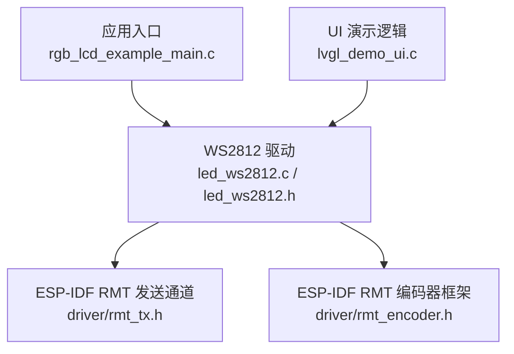
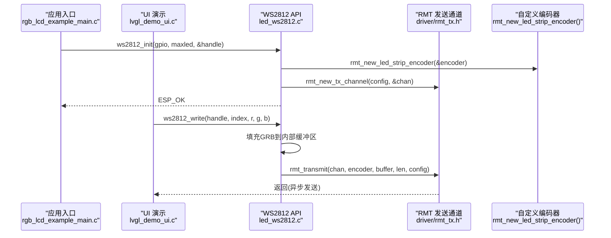
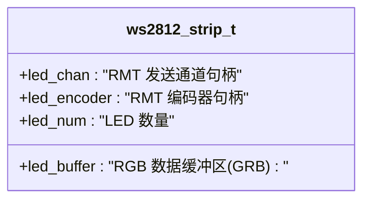
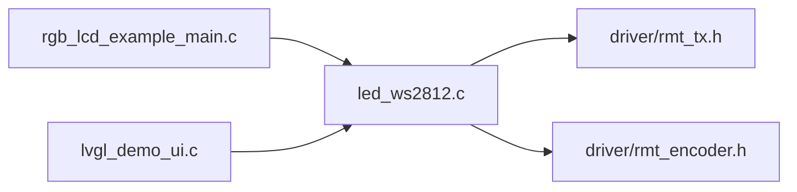

# LED控制API

<cite>
**本文引用的文件**   
- [led_ws2812.h](file://ESP32开发板/TK021F2699_ESP32_LVGL_GIF_LED/TK021F2699_ESP32_LVGL_GIF_LED/main/led_ws2812/led_ws2812.h)
- [led_ws2812.c](file://ESP32开发板/TK021F2699_ESP32_LVGL_GIF_LED/TK021F2699_ESP32_LVGL_GIF_LED/main/led_ws2812/led_ws2812.c)
- [rgb_lcd_example_main.c](file://ESP32开发板/TK021F2699_ESP32_LVGL_GIF_LED/TK021F2699_ESP32_LVGL_GIF_LED/main/rgb_lcd_example_main.c)
- [lvgl_demo_ui.c](file://ESP32开发板/TK021F2699_ESP32_LVGL_GIF_LED/TK021F2699_ESP32_LVGL_GIF_LED/main/ui/lvgl_demo_ui.c)
</cite>

## 目录
1. [简介](#简介)
2. [项目结构](#项目结构)
3. [核心组件](#核心组件)
4. [架构总览](#架构总览)
5. [详细组件分析](#详细组件分析)
6. [依赖关系分析](#依赖关系分析)
7. [性能与功耗优化](#性能与功耗优化)
8. [调试与故障排查](#调试与故障排查)
9. [结论](#结论)
10. [附录：动画示例与最佳实践](#附录动画示例与最佳实践)

## 简介
本文件为 WS2812 LED 控制系统的 API 参考文档，聚焦于 ESP32 平台基于 RMT 外设的驱动实现。文档覆盖初始化接口、数据结构定义、颜色写入流程、RMT 编码器与时序要求、多灯串并联连接方式、最大支持数量限制、功耗与电磁兼容建议，以及调试方法与常见问题解决方案。同时提供跑马灯等常见动画的实现思路与参考路径。

## 项目结构
本项目中与 WS2812 控制相关的核心代码位于 main/led_ws2812 目录下，包含头文件与实现文件；应用入口在 main/rgb_lcd_example_main.c 中完成初始化；UI 层在 main/ui/lvgl_demo_ui.c 中演示了跑马灯效果调用。

图示来源
- [rgb_lcd_example_main.c:150-153](file://ESP32开发板/TK021F2699_ESP32_LVGL_GIF_LED/TK021F2699_ESP32_LVGL_GIF_LED/main/rgb_lcd_example_main.c#L150-L153)
- [led_ws2812.c:178-213](file://ESP32开发板/TK021F2699_ESP32_LVGL_GIF_LED/TK021F2699_ESP32_LVGL_GIF_LED/main/led_ws2812/led_ws2812.c#L178-L213)
- [led_ws2812.h:15-26](file://ESP32开发板/TK021F2699_ESP32_LVGL_GIF_LED/TK021F2699_ESP32_LVGL_GIF_LED/main/led_ws2812/led_ws2812.h#L15-L26)
- [lvgl_demo_ui.c:84-149](file://ESP32开发板/TK021F2699_ESP32_LVGL_GIF_LED/TK021F2699_ESP32_LVGL_GIF_LED/main/ui/lvgl_demo_ui.c#L84-L149)

章节来源
- [rgb_lcd_example_main.c:150-153](file://ESP32开发板/TK021F2699_ESP32_LVGL_GIF_LED/TK021F2699_ESP32_LVGL_GIF_LED/main/rgb_lcd_example_main.c#L150-L153)
- [led_ws2812.h:15-26](file://ESP32开发板/TK021F2699_ESP32_LVGL_GIF_LED/TK021F2699_ESP32_LVGL_GIF_LED/main/led_ws2812/led_ws2812.h#L15-L26)
- [led_ws2812.c:178-213](file://ESP32开发板/TK021F2699_ESP32_LVGL_GIF_LED/TK021F2699_ESP32_LVGL_GIF_LED/main/led_ws2812/led_ws2812.c#L178-L213)
- [lvgl_demo_ui.c:84-149](file://ESP32开发板/TK021F2699_ESP32_LVGL_GIF_LED/TK021F2699_ESP32_LVGL_GIF_LED/main/ui/lvgl_demo_ui.c#L84-L149)

## 核心组件
- ws2812_init()：初始化 WS2812 外设，配置 GPIO、分配缓冲区、创建 RMT 通道与自定义编码器、使能通道。
- ws2812_deinit()：释放资源（编码器、缓冲区、句柄）。
- ws2812_write()：向指定索引的 LED 写入 RGB 数据，底层通过 RMT 发送 GRB 字节序列并附加复位时序。
- ws2812_strip_t：描述 WS2812 条带的运行时状态，包括 RMT 通道、编码器、RGB 缓冲区和 LED 数量。

章节来源
- [led_ws2812.h:18-41](file://ESP32开发板/TK021F2699_ESP32_LVGL_GIF_LED/TK021F2699_ESP32_LVGL_GIF_LED/main/led_ws2812/led_ws2812.h#L18-L41)
- [led_ws2812.c:16-22](file://ESP32开发板/TK021F2699_ESP32_LVGL_GIF_LED/TK021F2699_ESP32_LVGL_GIF_LED/main/led_ws2812/led_ws2812.c#L16-L22)
- [led_ws2812.c:178-213](file://ESP32开发板/TK021F2699_ESP32_LVGL_GIF_LED/TK021F2699_ESP32_LVGL_GIF_LED/main/led_ws2812/led_ws2812.c#L178-L213)
- [led_ws2812.c:219-228](file://ESP32开发板/TK021F2699_ESP32_LVGL_GIF_LED/TK021F2699_ESP32_LVGL_GIF_LED/main/led_ws2812/led_ws2812.c#L219-L228)
- [led_ws2812.c:235-250](file://ESP32开发板/TK021F2699_ESP32_LVGL_GIF_LED/TK021F2699_ESP32_LVGL_GIF_LED/main/led_ws2812/led_ws2812.c#L235-L250)

## 架构总览
下图展示了从应用层到硬件层的调用链路与关键对象关系。

图示来源
- [rgb_lcd_example_main.c:150-153](file://ESP32开发板/TK021F2699_ESP32_LVGL_GIF_LED/TK021F2699_ESP32_LVGL_GIF_LED/main/rgb_lcd_example_main.c#L150-L153)
- [led_ws2812.c:178-213](file://ESP32开发板/TK021F2699_ESP32_LVGL_GIF_LED/TK021F2699_ESP32_LVGL_GIF_LED/main/led_ws2812/led_ws2812.c#L178-L213)
- [led_ws2812.c:235-250](file://ESP32开发板/TK021F2699_ESP32_LVGL_GIF_LED/TK021F2699_ESP32_LVGL_GIF_LED/main/led_ws2812/led_ws2812.c#L235-L250)
- [lvgl_demo_ui.c:84-149](file://ESP32开发板/TK021F2699_ESP32_LVGL_GIF_LED/TK021F2699_ESP32_LVGL_GIF_LED/main/ui/lvgl_demo_ui.c#L84-L149)

## 详细组件分析

### 数据结构：ws2812_strip_t
该结构体封装了 WS2812 条带运行所需的关键资源与状态。

图示来源
- [led_ws2812.c:16-22](file://ESP32开发板/TK021F2699_ESP32_LVGL_GIF_LED/TK021F2699_ESP32_LVGL_GIF_LED/main/led_ws2812/led_ws2812.c#L16-L22)

章节来源
- [led_ws2812.c:16-22](file://ESP32开发板/TK021F2699_ESP32_LVGL_GIF_LED/TK021F2699_ESP32_LVGL_GIF_LED/main/led_ws2812/led_ws2812.c#L16-L22)

### 初始化函数：ws2812_init()
- 功能：分配驱动描述符与 RGB 缓冲区，创建 RMT 发送通道与自定义编码器，使能通道。
- 参数：
  - gpio：控制 WS2812 的 GPIO 编号。
  - maxled：最大支持的 LED 数量。
  - handle：输出参数，返回驱动句柄。
- 返回值：ESP_OK 或错误码。
- 关键点：
  - RMT 分辨率设置为 10MHz（1 tick = 0.1us），用于精确生成 WS2812 所需的位时序。
  - 内存块大小 trans_queue_depth 与 mem_block_symbols 影响后台传输吞吐与延迟。
  - 自定义编码器负责将用户数据编码为符合 WS2812 时序的符号序列，并在末尾追加复位码。

章节来源
- [led_ws2812.c:178-213](file://ESP32开发板/TK021F2699_ESP32_LVGL_GIF_LED/TK021F2699_ESP32_LVGL_GIF_LED/main/led_ws2812/led_ws2812.c#L178-L213)
- [led_ws2812.h:20-26](file://ESP32开发板/TK021F2699_ESP32_LVGL_GIF_LED/TK021F2699_ESP32_LVGL_GIF_LED/main/led_ws2812/led_ws2812.h#L20-L26)

### 反初始化函数：ws2812_deinit()
- 功能：删除编码器、释放缓冲区与驱动描述符。
- 参数：驱动句柄。
- 返回值：ESP_OK 或错误码。

章节来源
- [led_ws2812.c:219-228](file://ESP32开发板/TK021F2699_ESP32_LVGL_GIF_LED/TK021F2699_ESP32_LVGL_GIF_LED/main/led_ws2812/led_ws2812.c#L219-L228)

### 写入函数：ws2812_write()
- 功能：将单个 LED 的 RGB 值写入内部缓冲区，并通过 RMT 发送整条缓冲区的 GRB 数据。
- 参数：
  - handle：驱动句柄。
  - index：LED 索引（从 0 开始）。
  - r,g,b：各通道亮度值（0-255）。
- 行为细节：
  - 内部按 GRB 顺序写入缓冲区。
  - 调用 rmt_transmit 进行非阻塞发送，底层由 RMT 硬件自动产生时序。
  - 若 index 越界则返回失败。

章节来源
- [led_ws2812.c:235-250](file://ESP32开发板/TK021F2699_ESP32_LVGL_GIF_LED/TK021F2699_ESP32_LVGL_GIF_LED/main/led_ws2812/led_ws2812.c#L235-L250)

### RMT 自定义编码器与 WS2812 时序
- 编码器组成：
  - 字节编码器：根据 bit0/bit1 的高/低电平持续时间生成 WS2812 的“0”和“1”符号。
  - 拷贝编码器：用于追加固定时长的复位码（低电平保持至少 50us）。
- 时序要点：
  - 分辨率 10MHz，最小时间单元 0.1us。
  - bit0：高电平约 0.3us，低电平约 0.9us。
  - bit1：高电平约 0.9us，低电平约 0.3us。
  - 复位码：低电平持续约 50us。
- 编码流程：
  - 先编码所有 LED 的 GRB 字节，再追加一次复位码，随后回到初始状态等待下一次传输。

章节来源
- [led_ws2812.c:113-171](file://ESP32开发板/TK021F2699_ESP32_LVGL_GIF_LED/TK021F2699_ESP32_LVGL_GIF_LED/main/led_ws2812/led_ws2812.c#L113-L171)
- [led_ws2812.c:49-89](file://ESP32开发板/TK021F2699_ESP32_LVGL_GIF_LED/TK021F2699_ESP32_LVGL_GIF_LED/main/led_ws2812/led_ws2812.c#L49-L89)

### 应用集成与示例调用
- 应用入口在 app_main 中调用 ws2812_init 完成初始化。
- UI 层 lvgl_demo_ui.c 中实现了红绿蓝三色跑马灯的循环更新，使用 vTaskDelay 控制节奏。

章节来源
- [rgb_lcd_example_main.c:150-153](file://ESP32开发板/TK021F2699_ESP32_LVGL_GIF_LED/TK021F2699_ESP32_LVGL_GIF_LED/main/rgb_lcd_example_main.c#L150-L153)
- [lvgl_demo_ui.c:84-149](file://ESP32开发板/TK021F2699_ESP32_LVGL_GIF_LED/TK021F2699_ESP32_LVGL_GIF_LED/main/ui/lvgl_demo_ui.c#L84-L149)

## 依赖关系分析
- 模块耦合：
  - led_ws2812.c 依赖 ESP-IDF 的 RMT 发送通道与编码器框架。
  - 应用入口与 UI 层仅通过公开 API 与驱动交互，耦合度低。
- 外部依赖：
  - driver/rmt_tx.h：RMT 发送通道管理。
  - driver/rmt_encoder.h：编码器抽象与内置编码器（字节、拷贝）创建。

图示来源
- [rgb_lcd_example_main.c:150-153](file://ESP32开发板/TK021F2699_ESP32_LVGL_GIF_LED/TK021F2699_ESP32_LVGL_GIF_LED/main/rgb_lcd_example_main.c#L150-L153)
- [lvgl_demo_ui.c:84-149](file://ESP32开发板/TK021F2699_ESP32_LVGL_GIF_LED/TK021F2699_ESP32_LVGL_GIF_LED/main/ui/lvgl_demo_ui.c#L84-L149)
- [led_ws2812.c:178-213](file://ESP32开发板/TK021F2699_ESP32_LVGL_GIF_LED/TK021F2699_ESP32_LVGL_GIF_LED/main/led_ws2812/led_ws2812.c#L178-L213)

章节来源
- [led_ws2812.c:178-213](file://ESP32开发板/TK021F2699_ESP32_LVGL_GIF_LED/TK021F2699_ESP32_LVGL_GIF_LED/main/led_ws2812/led_ws2812.c#L178-L213)

## 性能与功耗优化
- 传输策略
  - 批量更新：尽量一次性更新整条缓冲区的 GRB 数据，减少多次 rmt_transmit 调用带来的开销。
  - 队列深度与内存块：适当增大 trans_queue_depth 与 mem_block_symbols 可降低 CPU 占用与抖动，但会增加内存消耗。
- 刷新频率
  - 避免过高的刷新频率导致总线拥塞与电源瞬态波动；结合任务调度合理设置延时。
- 亮度与功耗
  - 降低平均亮度可显著降低功耗与发热；对全白场景尤其明显。
- 电源与布线
  - 为 LED 条带提供独立且充足的供电能力，就近放置去耦电容，缩短信号线长度，必要时加串联电阻以抑制振铃。
- 电磁兼容
  - 采用屏蔽线缆或双绞走线，远离高频噪声源；地平面完整，单点接地以减少环路面积。

[本节为通用指导，不直接分析具体文件]

## 调试与故障排查
- 常见问题
  - 灯不亮或颜色异常：检查 GPIO 配置是否正确、接线是否牢固、供电是否充足。
  - 闪烁或乱码：确认 RMT 分辨率与时序参数是否符合 WS2812 规范；确保复位码时长足够。
  - 卡顿或掉帧：评估 RMT 队列深度与内存块大小；减少频繁的小包传输。
- 定位方法
  - 打印日志：在初始化与写入前后添加日志，观察返回值与耗时。
  - 示波器测量：抓取数据引脚波形，验证 bit0/bit1 与复位码时序。
  - 简化用例：先用少量 LED 测试基本功能，逐步扩展规模。

章节来源
- [led_ws2812.c:178-213](file://ESP32开发板/TK021F2699_ESP32_LVGL_GIF_LED/TK021F2699_ESP32_LVGL_GIF_LED/main/led_ws2812/led_ws2812.c#L178-L213)
- [led_ws2812.c:235-250](file://ESP32开发板/TK021F2699_ESP32_LVGL_GIF_LED/TK021F2699_ESP32_LVGL_GIF_LED/main/led_ws2812/led_ws2812.c#L235-L250)

## 结论
本驱动基于 ESP-IDF 的 RMT 外设与编码器框架，提供了简洁稳定的 WS2812 控制 API。通过合理的缓冲区管理、队列配置与时序设定，可在保证实时性的同时降低 CPU 占用。配合良好的电源与布线设计，可实现稳定可靠的 LED 动态效果。

[本节为总结性内容，不直接分析具体文件]

## 附录：动画示例与最佳实践

### 跑马灯（示例）
- 思路：遍历 LED 索引，依次写入目标颜色并延时，形成流动效果。
- 参考路径：
  - [lvgl_demo_ui.c:84-149](file://ESP32开发板/TK021F2699_ESP32_LVGL_GIF_LED/TK021F2699_ESP32_LVGL_GIF_LED/main/ui/lvgl_demo_ui.c#L84-L149)

章节来源
- [lvgl_demo_ui.c:84-149](file://ESP32开发板/TK021F2699_ESP32_LVGL_GIF_LED/TK021F2699_ESP32_LVGL_GIF_LED/main/ui/lvgl_demo_ui.c#L84-L149)

### 呼吸灯（思路）
- 思路：使用正弦或线性插值渐变改变亮度，周期性递增/递减后重复。
- 建议：
  - 使用定时器或 LVGL timer 驱动，避免阻塞式延时。
  - 调整步长与周期以获得平滑过渡。

[本节为概念性说明，不直接分析具体文件]

### 彩虹效果（思路）
- 思路：基于 HSV 色彩空间计算每个 LED 的颜色，按相位偏移形成彩虹渐变。
- 建议：
  - 预计算色表或使用快速近似算法提升性能。
  - 分批次更新以降低单次传输压力。

[本节为概念性说明，不直接分析具体文件]

### 连接方式与数量限制
- 连接方式
  - 串联：标准 WS2812 条带均为串联，数据从首端传入逐灯传递。
  - 并联：不建议直接并联多条带至同一 GPIO；如需并行，应使用多个 GPIO 与 RMT 通道分别驱动，或在每段条带前增加单向缓冲器。
- 数量限制
  - 受限于内存缓冲区大小与 RMT 传输能力。当前实现按 maxled*3 字节分配缓冲区，需确保系统内存充足。
  - 实际可用数量还受供电能力与信号完整性约束。

章节来源
- [led_ws2812.c:178-213](file://ESP32开发板/TK021F2699_ESP32_LVGL_GIF_LED/TK021F2699_ESP32_LVGL_GIF_LED/main/led_ws2812/led_ws2812.c#L178-L213)

### 颜色设置与亮度调节（接口说明）
- 颜色设置：通过 ws2812_write(handle, index, r, g, b) 设置单个 LED 的 RGB 值。
- 亮度调节：可通过缩放 r/g/b 分量实现整体或局部调光；注意范围保持在 0-255。
- 动态效果：组合上述接口与定时器/任务，实现跑马灯、呼吸灯、彩虹等效果。

章节来源
- [led_ws2812.h:34-41](file://ESP32开发板/TK021F2699_ESP32_LVGL_GIF_LED/TK021F2699_ESP32_LVGL_GIF_LED/main/led_ws2812/led_ws2812.h#L34-L41)
- [led_ws2812.c:235-250](file://ESP32开发板/TK021F2699_ESP32_LVGL_GIF_LED/TK021F2699_ESP32_LVGL_GIF_LED/main/led_ws2812/led_ws2812.c#L235-L250)