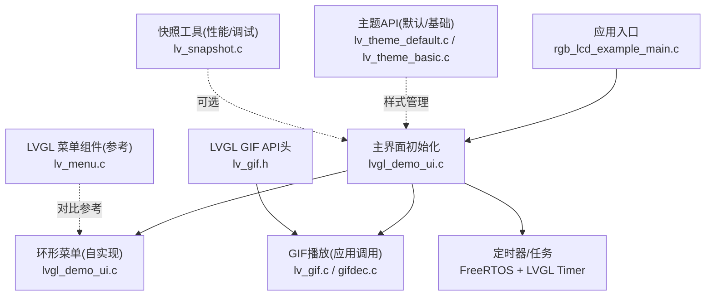
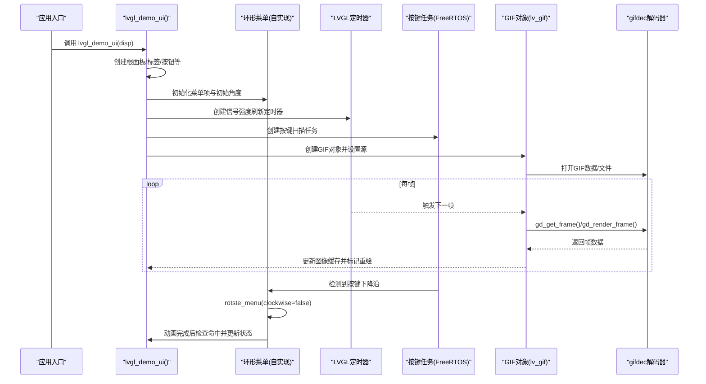
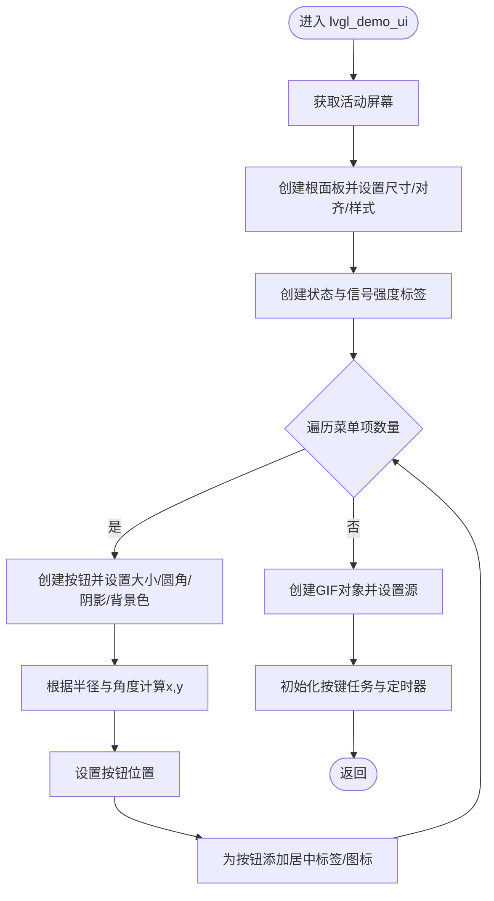
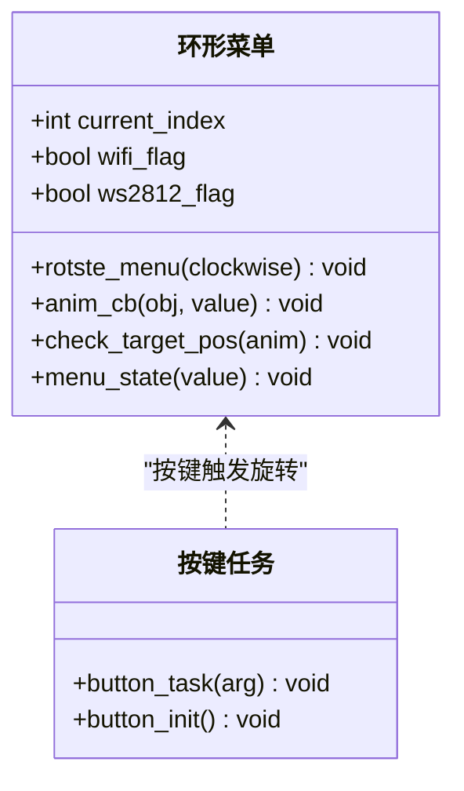
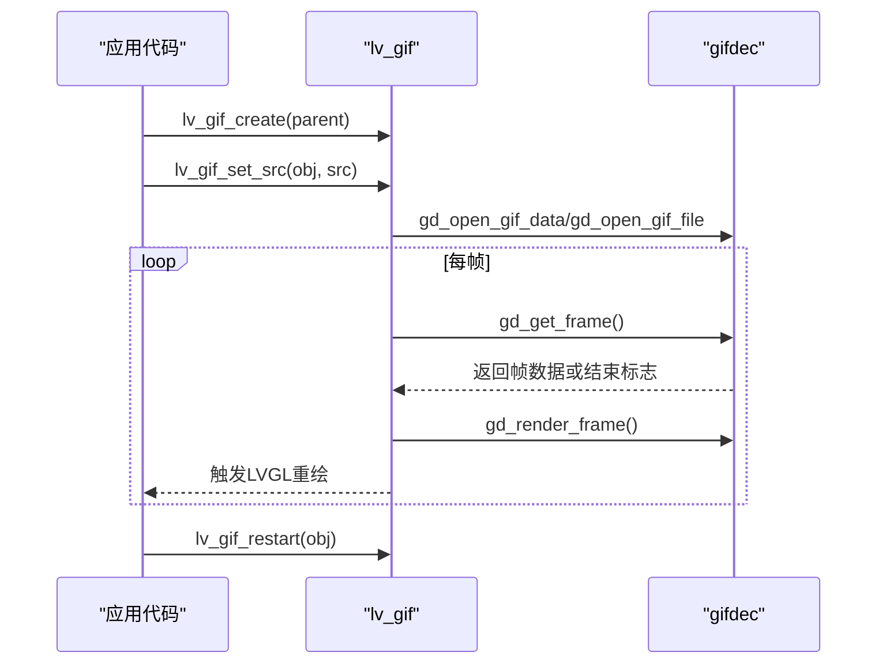
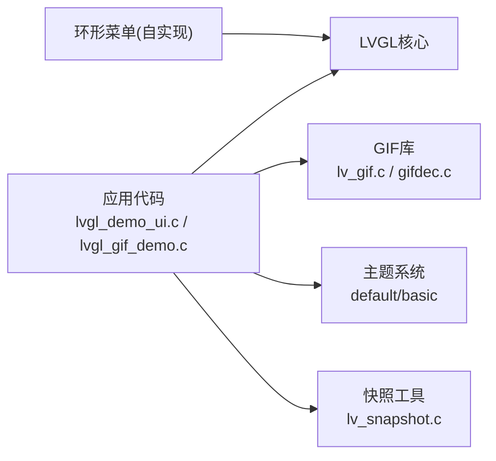

# UI框架API

<cite>
**本文引用的文件**   
- [lvgl_demo_ui.c](file://ESP32开发板/TK021F2699_ESP32_LVGL_GIF_LED/TK021F2699_ESP32_LVGL_GIF_LED/main/ui/lvgl_demo_ui.c)
- [lvgl_gif_demo.c](file://ESP32开发板/TK021F2699_ESP32_LVGL_GIF_LED/TK021F2699_ESP32_LVGL_GIF_LED/main/ui/lvgl_gif_demo.c)
- [rgb_lcd_example_main.c](file://ESP32开发板/TK021F2699_ESP32_LVGL_GIF_LED/TK021F2699_ESP32_LVGL_GIF_LED/main/rgb_lcd_example_main.c)
- [lv_gif.h](file://ESP32开发板/TK021F2699_ESP32_LVGL_GIF_LED/TK021F2699_ESP32_LVGL_GIF_LED/managed_components/lvgl__lvgl/src/extra/libs/gif/lv_gif.h)
- [lv_gif.c](file://ESP32开发板/TK021F2699_ESP32_LVGL_GIF_LED/TK021F2699_ESP32_LVGL_GIF_LED/managed_components/lvgl__lvgl/src/extra/libs/gif/lv_gif.c)
- [gifdec.c](file://ESP32开发板/TK021F2699_ESP32_LVGL_GIF_LED/TK021F2699_ESP32_LVGL_GIF_LED/managed_components/lvgl__lvgl/src/extra/libs/gif/gifdec.c)
- [lv_menu.c](file://ESP32开发板/TK021F2699_ESP32_LVGL_GIF_LED/TK021F2699_ESP32_LVGL_GIF_LED/managed_components/lvgl__lvgl/src/extra/widgets/menu/lv_menu.c)
- [lv_theme_default.h](file://ESP32开发板/TK021F2699_ESP32_LVGL_GIF_LED/TK021F2699_ESP32_LVGL_GIF_LED/managed_components/lvgl__lvgl/src/extra/themes/default/lv_theme_default.h)
- [lv_theme_default.c](file://ESP32开发板/TK021F2699_ESP32_LVGL_GIF_LED/TK021F2699_ESP32_LVGL_GIF_LED/managed_components/lvgl__lvgl/src/extra/themes/default/lv_theme_default.c)
- [lv_theme_basic.c](file://ESP32开发板/TK021F2699_ESP32_LVGL_GIF_LED/TK021F2699_ESP32_LVGL_GIF_LED/managed_components/lvgl__lvgl/src/extra/themes/basic/lv_theme_basic.c)
- [lv_snapshot.h](file://ESP32开发板/TK021F2699_ESP32_LVGL_GIF_LED/TK021F2699_ESP32_LVGL_GIF_LED/managed_components/lvgl__lvgl/src/extra/others/snapshot/lv_snapshot.h)
- [lv_snapshot.c](file://ESP32开发板/TK021F2699_ESP32_LVGL_GIF_LED/TK021F2699_ESP32_LVGL_GIF_LED/managed_components/lvgl__lvgl/src/extra/others/snapshot/lv_snapshot.c)
</cite>

## 目录
1. [简介](#简介)
2. [项目结构](#项目结构)
3. [核心组件](#核心组件)
4. [架构总览](#架构总览)
5. [详细组件分析](#详细组件分析)
6. [依赖关系分析](#依赖关系分析)
7. [性能考虑](#性能考虑)
8. [故障排查指南](#故障排查指南)
9. [结论](#结论)
10. [附录](#附录)

## 简介
本文件为UI框架层综合API文档，聚焦以下目标：
- 记录 lvgl_demo_ui() 主界面初始化函数的接口规范与生命周期管理。
- 详细说明环形菜单组件的API接口（菜单项添加、位置旋转、状态切换）。
- 提供GIF动画播放相关API（加载、帧控制、播放参数设置）。
- 解释用户交互事件捕获与处理机制（按键扫描、触摸响应、手势识别）。
- 说明自定义UI组件的开发接口与扩展方法。
- 包含主题定制与样式管理的API使用说明。
- 提供内存管理与资源释放最佳实践。
- 包含UI性能监控与渲染优化工具方法。

## 项目结构
本项目基于LVGL构建，应用层位于 main/ui 目录，示例入口在 main/rgb_lcd_example_main.c；GIF解码与播放由 LVGL GIF 库实现；环形菜单为应用自实现，LVGL也提供了标准菜单组件用于参考。

图表来源
- [rgb_lcd_example_main.c:81-82](file://ESP32开发板/TK021F2699_ESP32_LVGL_GIF_LED/TK021F2699_ESP32_LVGL_GIF_LED/main/rgb_lcd_example_main.c#L81-L82)
- [lvgl_demo_ui.c:297-496](file://ESP32开发板/TK021F2699_ESP32_LVGL_GIF_LED/TK021F2699_ESP32_LVGL_GIF_LED/main/ui/lvgl_demo_ui.c#L297-L496)
- [lv_gif.h:44-46](file://ESP32开发板/TK021F2699_ESP32_LVGL_GIF_LED/TK021F2699_ESP32_LVGL_GIF_LED/managed_components/lvgl__lvgl/src/extra/libs/gif/lv_gif.h#L44-L46)
- [lv_gif.c:58-154](file://ESP32开发板/TK021F2699_ESP32_LVGL_GIF_LED/TK021F2699_ESP32_LVGL_GIF_LED/managed_components/lvgl__lvgl/src/extra/libs/gif/lv_gif.c#L58-L154)
- [gifdec.c:572-677](file://ESP32开发板/TK021F2699_ESP32_LVGL_GIF_LED/TK021F2699_ESP32_LVGL_GIF_LED/managed_components/lvgl__lvgl/src/extra/libs/gif/gifdec.c#L572-L677)
- [lv_menu.c:112-186](file://ESP32开发板/TK021F2699_ESP32_LVGL_GIF_LED/TK021F2699_ESP32_LVGL_GIF_LED/managed_components/lvgl__lvgl/src/extra/widgets/menu/lv_menu.c#L112-L186)
- [lv_theme_default.c:652-723](file://ESP32开发板/TK021F2699_ESP32_LVGL_GIF_LED/TK021F2699_ESP32_LVGL_GIF_LED/managed_components/lvgl__lvgl/src/extra/themes/default/lv_theme_default.c#L652-L723)
- [lv_theme_basic.c:138-181](file://ESP32开发板/TK021F2699_ESP32_LVGL_GIF_LED/TK021F2699_ESP32_LVGL_GIF_LED/managed_components/lvgl__lvgl/src/extra/themes/basic/lv_theme_basic.c#L138-L181)
- [lv_snapshot.c:61-213](file://ESP32开发板/TK021F2699_ESP32_LVGL_GIF_LED/TK021F2699_ESP32_LVGL_GIF_LED/managed_components/lvgl__lvgl/src/extra/others/snapshot/lv_snapshot.c#L61-L213)

章节来源
- [rgb_lcd_example_main.c:81-82](file://ESP32开发板/TK021F2699_ESP32_LVGL_GIF_LED/TK021F2699_ESP32_LVGL_GIF_LED/main/rgb_lcd_example_main.c#L81-L82)
- [lvgl_demo_ui.c:297-496](file://ESP32开发板/TK021F2699_ESP32_LVGL_GIF_LED/TK021F2699_ESP32_LVGL_GIF_LED/main/ui/lvgl_demo_ui.c#L297-L496)

## 核心组件
- 主界面初始化函数 lvgl_demo_ui(disp)
  - 职责：创建根面板、布局子控件、初始化环形菜单按钮与图标、注册定时器与按键任务、插入GIF对象。
  - 输入：显示设备指针 disp。
  - 输出：无返回值，副作用为构造并展示UI树。
  - 生命周期：在系统启动后、屏幕驱动就绪时调用一次；后续通过LVGL事件循环和定时器驱动更新。
- 环形菜单（自实现）
  - 功能：以圆形轨迹排列多个菜单项，支持顺时针/逆时针旋转，并在到达顶部位置时触发对应业务状态。
  - 关键API：rotste_menu(clockwise)、anim_cb(obj, value)、check_target_pos(anim)。
- GIF播放（LVGL GIF）
  - 功能：创建GIF对象、设置源、自动按帧率推进、完成回调。
  - 关键API：lv_gif_create(parent)、lv_gif_set_src(obj, src)、lv_gif_restart(obj)。
- 主题与样式
  - 功能：默认主题与基础主题初始化与应用。
  - 关键API：lv_theme_default_init(...)、lv_theme_basic_init(...)。
- 快照工具（可选）
  - 功能：对对象树进行截图，便于性能分析与调试。
  - 关键API：lv_snapshot_take_to_buf(...)、lv_snapshot_free(...)。

章节来源
- [lvgl_demo_ui.c:297-496](file://ESP32开发板/TK021F2699_ESP32_LVGL_GIF_LED/TK021F2699_ESP32_LVGL_GIF_LED/main/ui/lvgl_demo_ui.c#L297-L496)
- [lv_gif.h:44-46](file://ESP32开发板/TK021F2699_ESP32_LVGL_GIF_LED/TK021F2699_ESP32_LVGL_GIF_LED/managed_components/lvgl__lvgl/src/extra/libs/gif/lv_gif.h#L44-L46)
- [lv_gif.c:58-154](file://ESP32开发板/TK021F2699_ESP32_LVGL_GIF_LED/TK021F2699_ESP32_LVGL_GIF_LED/managed_components/lvgl__lvgl/src/extra/libs/gif/lv_gif.c#L58-L154)
- [lv_theme_default.h:32-52](file://ESP32开发板/TK021F2699_ESP32_LVGL_GIF_LED/TK021F2699_ESP32_LVGL_GIF_LED/managed_components/lvgl__lvgl/src/extra/themes/default/lv_theme_default.h#L32-L52)
- [lv_theme_default.c:652-723](file://ESP32开发板/TK021F2699_ESP32_LVGL_GIF_LED/TK021F2699_ESP32_LVGL_GIF_LED/managed_components/lvgl__lvgl/src/extra/themes/default/lv_theme_default.c#L652-L723)
- [lv_theme_basic.c:138-181](file://ESP32开发板/TK021F2699_ESP32_LVGL_GIF_LED/TK021F2699_ESP32_LVGL_GIF_LED/managed_components/lvgl__lvgl/src/extra/themes/basic/lv_theme_basic.c#L138-L181)
- [lv_snapshot.c:61-213](file://ESP32开发板/TK021F2699_ESP32_LVGL_GIF_LED/TK021F2699_ESP32_LVGL_GIF_LED/managed_components/lvgl__lvgl/src/extra/others/snapshot/lv_snapshot.c#L61-L213)

## 架构总览
下图展示了主界面初始化、环形菜单动画、GIF播放与事件处理的整体流程。

图表来源
- [rgb_lcd_example_main.c:81-82](file://ESP32开发板/TK021F2699_ESP32_LVGL_GIF_LED/TK021F2699_ESP32_LVGL_GIF_LED/main/rgb_lcd_example_main.c#L81-L82)
- [lvgl_demo_ui.c:297-496](file://ESP32开发板/TK021F2699_ESP32_LVGL_GIF_LED/TK021F2699_ESP32_LVGL_GIF_LED/main/ui/lvgl_demo_ui.c#L297-L496)
- [lv_gif.c:131-154](file://ESP32开发板/TK021F2699_ESP32_LVGL_GIF_LED/TK021F2699_ESP32_LVGL_GIF_LED/managed_components/lvgl__lvgl/src/extra/libs/gif/lv_gif.c#L131-L154)
- [gifdec.c:572-677](file://ESP32开发板/TK021F2699_ESP32_LVGL_GIF_LED/TK021F2699_ESP32_LVGL_GIF_LED/managed_components/lvgl__lvgl/src/extra/libs/gif/gifdec.c#L572-L677)

## 详细组件分析

### 主界面初始化函数 lvgl_demo_ui(disp)
- 接口规范
  - 原型：void lvgl_demo_ui(lv_disp_t *disp)
  - 参数：disp 指向当前活动显示设备
  - 行为：获取活动屏幕，创建根面板与若干子控件，布置环形菜单项与图标，创建GIF对象，注册按键任务与定时器。
- 生命周期管理
  - 初始化阶段：一次性构建UI树，分配对象与定时器。
  - 运行阶段：由LVGL事件循环驱动渲染与动画；按键任务轮询GPIO；定时器周期性刷新信号强度。
  - 退出阶段：若需销毁，应删除创建的定时器与任务，并移除或隐藏相关对象以避免悬挂引用。
- 关键流程
  - 创建根面板与背景样式。
  - 创建状态文本与信号强度文本。
  - 循环创建MENU_ITEM_COUNT个菜单按钮，计算初始角度与坐标。
  - 为每个菜单项添加图标并居中。
  - 创建GIF对象并设置源。
  - 启动按键任务与信号强度定时器。

图表来源
- [lvgl_demo_ui.c:297-496](file://ESP32开发板/TK021F2699_ESP32_LVGL_GIF_LED/TK021F2699_ESP32_LVGL_GIF_LED/main/ui/lvgl_demo_ui.c#L297-L496)

章节来源
- [lvgl_demo_ui.c:297-496](file://ESP32开发板/TK021F2699_ESP32_LVGL_GIF_LED/TK021F2699_ESP32_LVGL_GIF_LED/main/ui/lvgl_demo_ui.c#L297-L496)

### 环形菜单组件API（自实现）
- 菜单项添加
  - 通过循环创建按钮对象，设置尺寸、圆角、阴影与背景色，并按角度计算初始位置。
  - 为每个按钮添加居中的图标对象。
- 位置旋转
  - 使用动画将每个菜单项的角度从 start_angle 过渡到 end_angle，执行回调 anim_cb 更新坐标。
  - 旋转方向由 clockwise 参数决定，内部维护 current_index 作为基准索引。
- 状态切换
  - 动画完成后回调 check_target_pos 检测是否落入顶部目标区域，若是则调用 menu_state 更新状态文本与业务标志位。
- 关键API与回调
  - rotste_menu(clockwise): 触发旋转动画。
  - anim_cb(obj, value): 角度值到坐标的映射。
  - check_target_pos(anim): 动画结束后的命中检测。
  - menu_state(value): 根据选中索引更新UI与业务状态。

图表来源
- [lvgl_demo_ui.c:224-246](file://ESP32开发板/TK021F2699_ESP32_LVGL_GIF_LED/TK021F2699_ESP32_LVGL_GIF_LED/main/ui/lvgl_demo_ui.c#L224-L246)
- [lvgl_demo_ui.c:212-221](file://ESP32开发板/TK021F2699_ESP32_LVGL_GIF_LED/TK021F2699_ESP32_LVGL_GIF_LED/main/ui/lvgl_demo_ui.c#L212-L221)
- [lvgl_demo_ui.c:189-209](file://ESP32开发板/TK021F2699_ESP32_LVGL_GIF_LED/TK021F2699_ESP32_LVGL_GIF_LED/main/ui/lvgl_demo_ui.c#L189-L209)
- [lvgl_demo_ui.c:152-186](file://ESP32开发板/TK021F2699_ESP32_LVGL_GIF_LED/TK021F2699_ESP32_LVGL_GIF_LED/main/ui/lvgl_demo_ui.c#L152-L186)
- [lvgl_demo_ui.c:263-295](file://ESP32开发板/TK021F2699_ESP32_LVGL_GIF_LED/TK021F2699_ESP32_LVGL_GIF_LED/main/ui/lvgl_demo_ui.c#L263-L295)

章节来源
- [lvgl_demo_ui.c:152-186](file://ESP32开发板/TK021F2699_ESP32_LVGL_GIF_LED/TK021F2699_ESP32_LVGL_GIF_LED/main/ui/lvgl_demo_ui.c#L152-L186)
- [lvgl_demo_ui.c:189-209](file://ESP32开发板/TK021F2699_ESP32_LVGL_GIF_LED/TK021F2699_ESP32_LVGL_GIF_LED/main/ui/lvgl_demo_ui.c#L189-L209)
- [lvgl_demo_ui.c:212-246](file://ESP32开发板/TK021F2699_ESP32_LVGL_GIF_LED/TK021F2699_ESP32_LVGL_GIF_LED/main/ui/lvgl_demo_ui.c#L212-L246)
- [lvgl_demo_ui.c:263-295](file://ESP32开发板/TK021F2699_ESP32_LVGL_GIF_LED/TK021F2699_ESP32_LVGL_GIF_LED/main/ui/lvgl_demo_ui.c#L263-L295)

### GIF动画播放API
- 创建与设置
  - lv_gif_create(parent): 创建GIF对象。
  - lv_gif_set_src(obj, src): 设置GIF源（变量或文件），内部关闭旧实例、解析宽高与颜色格式、绑定定时器并开始播放。
  - lv_gif_restart(obj): 重置播放进度并恢复定时器。
- 帧控制与播放参数
  - 内部定时器按帧延迟推进，读取下一帧并渲染到图像缓存，随后使对象失效以触发重绘。
  - 当播放完成（loop_count耗尽）时发送 LV_EVENT_READY 事件并暂停定时器。
- 底层解码
  - gifdec 负责解析GIF数据流、处理循环计数、读取图像块与渲染帧。

图表来源
- [lv_gif.h:44-46](file://ESP32开发板/TK021F2699_ESP32_LVGL_GIF_LED/TK021F2699_ESP32_LVGL_GIF_LED/managed_components/lvgl__lvgl/src/extra/libs/gif/lv_gif.h#L44-L46)
- [lv_gif.c:58-154](file://ESP32开发板/TK021F2699_ESP32_LVGL_GIF_LED/TK021F2699_ESP32_LVGL_GIF_LED/managed_components/lvgl__lvgl/src/extra/libs/gif/lv_gif.c#L58-L154)
- [gifdec.c:572-677](file://ESP32开发板/TK021F2699_ESP32_LVGL_GIF_LED/TK021F2699_ESP32_LVGL_GIF_LED/managed_components/lvgl__lvgl/src/extra/libs/gif/gifdec.c#L572-L677)

章节来源
- [lv_gif.h:44-46](file://ESP32开发板/TK021F2699_ESP32_LVGL_GIF_LED/TK021F2699_ESP32_LVGL_GIF_LED/managed_components/lvgl__lvgl/src/extra/libs/gif/lv_gif.h#L44-L46)
- [lv_gif.c:58-154](file://ESP32开发板/TK021F2699_ESP32_LVGL_GIF_LED/TK021F2699_ESP32_LVGL_GIF_LED/managed_components/lvgl__lvgl/src/extra/libs/gif/lv_gif.c#L58-L154)
- [gifdec.c:572-677](file://ESP32开发板/TK021F2699_ESP32_LVGL_GIF_LED/TK021F2699_ESP32_LVGL_GIF_LED/managed_components/lvgl__lvgl/src/extra/libs/gif/gifdec.c#L572-L677)

### 用户交互事件捕获与处理
- 按键扫描
  - 通过 FreeRTOS 任务轮询 GPIO，检测下降沿触发环形菜单逆时针旋转。
  - 建议增加防抖逻辑与去重判断，避免快速抖动导致多次触发。
- 触摸响应与手势识别
  - 本项目未直接实现触摸与手势识别；可结合 LVGL 输入设备驱动与事件回调实现点击、滑动、长按等。
  - 如需测试随机输入，可使用 LVGL Monkey 模块生成模拟事件。
- 事件处理建议
  - 将业务逻辑与UI解耦，通过事件回调传递上下文。
  - 对于复杂手势，建议使用 LVGL 内置手势识别或第三方库。

章节来源
- [lvgl_demo_ui.c:263-295](file://ESP32开发板/TK021F2699_ESP32_LVGL_GIF_LED/TK021F2699_ESP32_LVGL_GIF_LED/main/ui/lvgl_demo_ui.c#L263-L295)

### 自定义UI组件开发与扩展方法
- 基于LVGL对象类扩展
  - 定义对象类（含构造函数/析构函数）、注册事件回调、实现绘制与布局逻辑。
  - 参考LVGL菜单组件的结构与API设计，如 lv_menu_create、lv_menu_page_create、lv_menu_set_load_page_event 等。
- 推荐模式
  - 使用 flex/grid 布局简化排版。
  - 通过样式系统统一外观，减少硬编码。
  - 将复杂逻辑封装为独立模块，通过事件与回调通信。

章节来源
- [lv_menu.c:112-186](file://ESP32开发板/TK021F2699_ESP32_LVGL_GIF_LED/TK021F2699_ESP32_LVGL_GIF_LED/managed_components/lvgl__lvgl/src/extra/widgets/menu/lv_menu.c#L112-L186)

### 主题定制与样式管理
- 默认主题
  - 通过 lv_theme_default_init 初始化，传入主色、辅色、字体与深色模式标志。
  - 主题应用回调会根据对象类型与层级动态添加样式。
- 基础主题
  - 通过 lv_theme_basic_init 初始化，适用于简单场景。
- 样式管理建议
  - 使用 lv_obj_add_style 与 lv_obj_clear_style 精细控制样式。
  - 利用 PART 与 STATE 组合区分不同部分与状态。
  - 在主题切换时调用 lv_obj_report_style_change 强制刷新。

章节来源
- [lv_theme_default.h:32-52](file://ESP32开发板/TK021F2699_ESP32_LVGL_GIF_LED/TK021F2699_ESP32_LVGL_GIF_LED/managed_components/lvgl__lvgl/src/extra/themes/default/lv_theme_default.h#L32-L52)
- [lv_theme_default.c:652-723](file://ESP32开发板/TK021F2699_ESP32_LVGL_GIF_LED/TK021F2699_ESP32_LVGL_GIF_LED/managed_components/lvgl__lvgl/src/extra/themes/default/lv_theme_default.c#L652-L723)
- [lv_theme_basic.c:138-181](file://ESP32开发板/TK021F2699_ESP32_LVGL_GIF_LED/TK021F2699_ESP32_LVGL_GIF_LED/managed_components/lvgl__lvgl/src/extra/themes/basic/lv_theme_basic.c#L138-L181)

### 内存管理与资源释放最佳实践
- GIF对象
  - 设置新源时会关闭旧实例并清理缓存；析构时释放定时器与解码句柄。
  - 建议在页面切换或对象销毁前显式停止定时器并释放资源。
- 任务与定时器
  - 按键任务与信号强度定时器应在适当时机删除，避免悬挂与泄漏。
- 快照缓冲区
  - 使用 lv_snapshot_take_to_buf 时需确保缓冲区足够大；使用 lv_snapshot_free 释放分配的内存。

章节来源
- [lv_gif.c:121-129](file://ESP32开发板/TK021F2699_ESP32_LVGL_GIF_LED/TK021F2699_ESP32_LVGL_GIF_LED/managed_components/lvgl__lvgl/src/extra/libs/gif/lv_gif.c#L121-L129)
- [lv_snapshot.c:191-207](file://ESP32开发板/TK021F2699_ESP32_LVGL_GIF_LED/TK021F2699_ESP32_LVGL_GIF_LED/managed_components/lvgl__lvgl/src/extra/others/snapshot/lv_snapshot.c#L191-L207)

### UI性能监控与渲染优化
- 快照工具
  - 使用 lv_snapshot_take_to_buf 对对象树进行截图，便于离线分析渲染质量与内容。
  - 注意颜色格式与缓冲区大小匹配，失败时返回错误码。
- 渲染优化建议
  - 减少不必要的重绘区域，合理设置对象可见性与隐藏标志。
  - 使用合适的图片格式与分辨率，避免过大图像频繁解码。
  - 控制GIF帧率与数量，避免过多并发动画影响帧率。

章节来源
- [lv_snapshot.h:62-84](file://ESP32开发板/TK021F2699_ESP32_LVGL_GIF_LED/TK021F2699_ESP32_LVGL_GIF_LED/managed_components/lvgl__lvgl/src/extra/others/snapshot/lv_snapshot.h#L62-L84)
- [lv_snapshot.c:61-155](file://ESP32开发板/TK021F2699_ESP32_LVGL_GIF_LED/TK021F2699_ESP32_LVGL_GIF_LED/managed_components/lvgl__lvgl/src/extra/others/snapshot/lv_snapshot.c#L61-L155)

## 依赖关系分析
- 应用层依赖LVGL核心与额外库（GIF、主题、快照）。
- 环形菜单为自实现，依赖LVGL对象与动画API。
- GIF播放依赖gifdec解码器与LVGL图像缓存。
- 主题系统通过应用回调为对象树注入样式。

图表来源
- [lvgl_demo_ui.c:297-496](file://ESP32开发板/TK021F2699_ESP32_LVGL_GIF_LED/TK021F2699_ESP32_LVGL_GIF_LED/main/ui/lvgl_demo_ui.c#L297-L496)
- [lv_gif.c:58-154](file://ESP32开发板/TK021F2699_ESP32_LVGL_GIF_LED/TK021F2699_ESP32_LVGL_GIF_LED/managed_components/lvgl__lvgl/src/extra/libs/gif/lv_gif.c#L58-L154)
- [gifdec.c:572-677](file://ESP32开发板/TK021F2699_ESP32_LVGL_GIF_LED/TK021F2699_ESP32_LVGL_GIF_LED/managed_components/lvgl__lvgl/src/extra/libs/gif/gifdec.c#L572-L677)
- [lv_theme_default.c:652-723](file://ESP32开发板/TK021F2699_ESP32_LVGL_GIF_LED/TK021F2699_ESP32_LVGL_GIF_LED/managed_components/lvgl__lvgl/src/extra/themes/default/lv_theme_default.c#L652-L723)
- [lv_snapshot.c:61-213](file://ESP32开发板/TK021F2699_ESP32_LVGL_GIF_LED/TK021F2699_ESP32_LVGL_GIF_LED/managed_components/lvgl__lvgl/src/extra/others/snapshot/lv_snapshot.c#L61-L213)

## 性能考虑
- 动画与渲染
  - 环形菜单动画批量创建与执行，注意动画时间与CPU占用平衡。
  - GIF播放按帧推进，避免同时播放过多GIF。
- 输入与任务
  - 按键任务周期不宜过短，避免抢占过多CPU时间片。
- 内存与缓存
  - 合理使用图片与字体资源，避免重复加载。
  - 及时释放不再使用的定时器与任务句柄。

## 故障排查指南
- GIF无法播放
  - 检查源是否为有效变量或文件路径；确认gifdec成功打开并解析。
  - 观察定时器是否被正确恢复与重置。
- 环形菜单不响应
  - 检查按键任务是否创建成功，GPIO配置是否正确。
  - 验证动画回调与目标位置检测逻辑。
- 主题未生效
  - 确认主题初始化已调用且 disp 参数正确。
  - 必要时调用 lv_obj_report_style_change 强制刷新。

章节来源
- [lv_gif.c:58-154](file://ESP32开发板/TK021F2699_ESP32_LVGL_GIF_LED/TK021F2699_ESP32_LVGL_GIF_LED/managed_components/lvgl__lvgl/src/extra/libs/gif/lv_gif.c#L58-L154)
- [lvgl_demo_ui.c:263-295](file://ESP32开发板/TK021F2699_ESP32_LVGL_GIF_LED/TK021F2699_ESP32_LVGL_GIF_LED/main/ui/lvgl_demo_ui.c#L263-L295)
- [lv_theme_default.c:652-723](file://ESP32开发板/TK021F2699_ESP32_LVGL_GIF_LED/TK021F2699_ESP32_LVGL_GIF_LED/managed_components/lvgl__lvgl/src/extra/themes/default/lv_theme_default.c#L652-L723)

## 结论
本UI框架以LVGL为核心，结合自实现环形菜单与GIF播放能力，形成完整的交互体验。通过合理的主题与样式管理、完善的内存与资源释放策略，以及快照工具辅助的性能分析，可在嵌入式设备上实现流畅、可维护的用户界面。

## 附录
- 示例入口声明
  - rgb_lcd_example_main.c 中对外部函数 lvgl_demo_ui 与 ui_gif_demo 进行声明，供主流程调用。

章节来源
- [rgb_lcd_example_main.c:81-82](file://ESP32开发板/TK021F2699_ESP32_LVGL_GIF_LED/TK021F2699_ESP32_LVGL_GIF_LED/main/rgb_lcd_example_main.c#L81-L82)