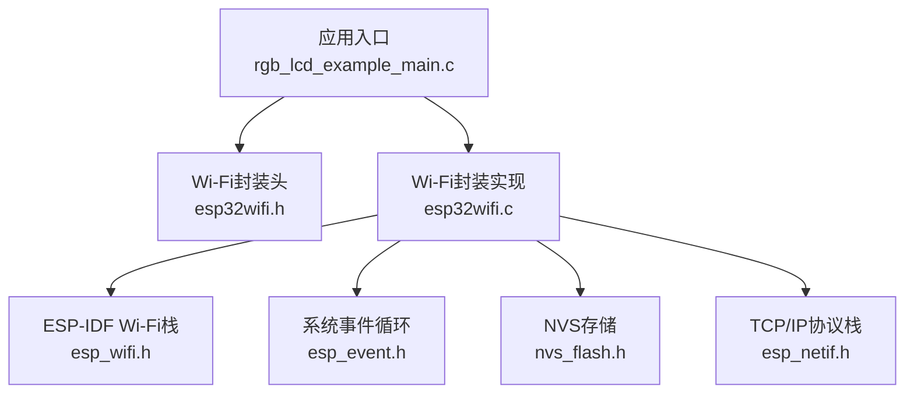
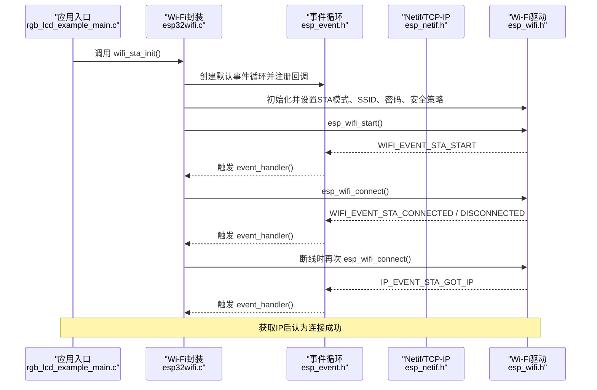
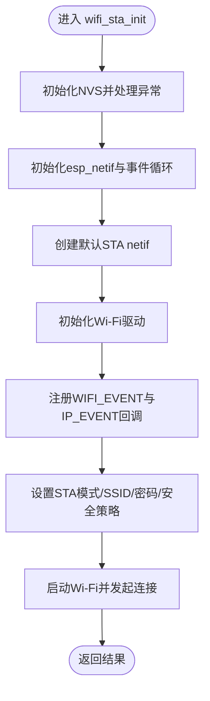
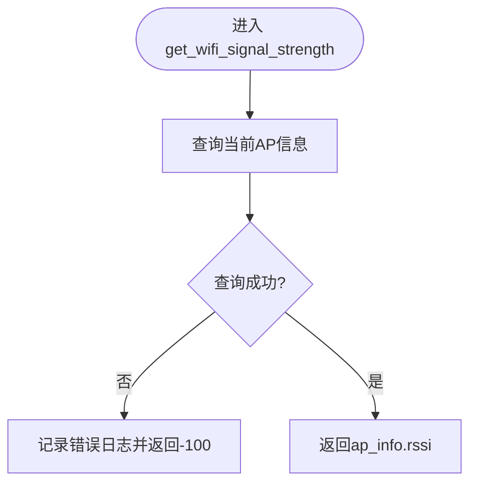
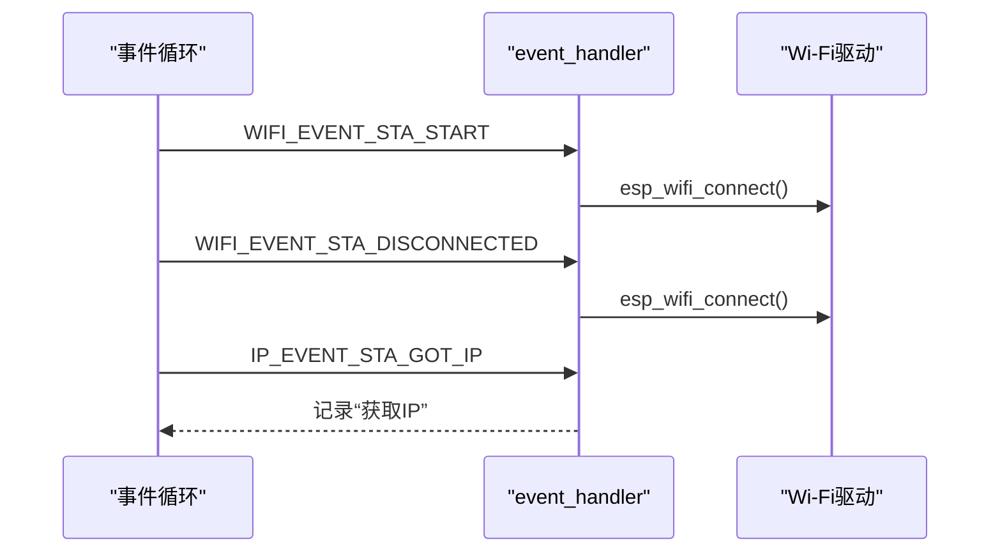
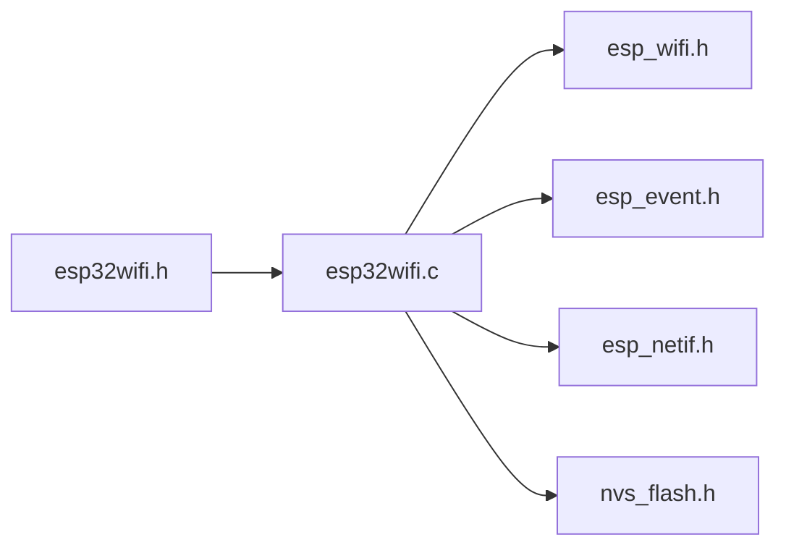

# Wi-Fi模块API

<cite>
**本文引用的文件**   
- [esp32wifi.h](file://ESP32开发板/TK021F2699_ESP32_LVGL_GIF_LED/TK021F2699_ESP32_LVGL_GIF_LED/main/wifi/esp32wifi.h)
- [esp32wifi.c](file://ESP32开发板/TK021F2699_ESP32_LVGL_GIF_LED/TK021F2699_ESP32_LVGL_GIF_LED/main/wifi/esp32wifi.c)
- [rgb_lcd_example_main.c](file://ESP32开发板/TK021F2699_ESP32_LVGL_GIF_LED/TK021F2699_ESP32_LVGL_GIF_LED/main/rgb_lcd_example_main.c)
</cite>

## 目录
1. [简介](#简介)
2. [项目结构](#项目结构)
3. [核心组件](#核心组件)
4. [架构总览](#架构总览)
5. [详细组件分析](#详细组件分析)
6. [依赖关系分析](#依赖关系分析)
7. [性能与稳定性优化建议](#性能与稳定性优化建议)
8. [故障诊断与调试日志](#故障诊断与调试日志)
9. [结论](#结论)
10. [附录：接口规范与示例](#附录接口规范与示例)

## 简介
本文件为Wi-Fi功能模块的API文档，聚焦于STA模式的网络初始化、连接管理、信号强度监测、事件回调机制以及安全配置。文档基于仓库中的Wi-Fi封装实现进行梳理，并提供可操作的接口说明、调用流程与排障建议，帮助开发者快速集成并稳定运行。

## 项目结构
Wi-Fi相关代码位于main/wifi目录下，包含对外暴露的接口头文件与具体实现；应用入口在main/rgb_lcd_example_main.c中调用了Wi-Fi初始化函数。

图表来源
- [esp32wifi.h:1-41](file://ESP32开发板/TK021F2699_ESP32_LVGL_GIF_LED/TK021F2699_ESP32_LVGL_GIF_LED/main/wifi/esp32wifi.h#L1-L41)
- [esp32wifi.c:1-109](file://ESP32开发板/TK021F2699_ESP32_LVGL_GIF_LED/TK021F2699_ESP32_LVGL_GIF_LED/main/wifi/esp32wifi.c#L1-L109)
- [rgb_lcd_example_main.c:150-160](file://ESP32开发板/TK021F2699_ESP32_LVGL_GIF_LED/TK021F2699_ESP32_LVGL_GIF_LED/main/rgb_lcd_example_main.c#L150-L160)

章节来源
- [esp32wifi.h:1-41](file://ESP32开发板/TK021F2699_ESP32_LVGL_GIF_LED/TK021F2699_ESP32_LVGL_GIF_LED/main/wifi/esp32wifi.h#L1-L41)
- [esp32wifi.c:1-109](file://ESP32开发板/TK021F2699_ESP32_LVGL_GIF_LED/TK021F2699_ESP32_LVGL_GIF_LED/main/wifi/esp32wifi.c#L1-L109)
- [rgb_lcd_example_main.c:150-160](file://ESP32开发板/TK021F2699_ESP32_LVGL_GIF_LED/TK021F2699_ESP32_LVGL_GIF_LED/main/rgb_lcd_example_main.c#L150-L160)

## 核心组件
- wifi_sta_init()：完成NVS、事件循环、netif、Wi-Fi驱动初始化，注册WIFI_EVENT与IP_EVENT回调，设置STA模式、SSID、密码与安全策略，启动Wi-Fi并开始连接。
- get_wifi_signal_strength()：查询当前已连接AP的RSSI值，用于信号强度监测。
- 事件回调event_handler()：处理STA启动、连接成功、断开重连、获取IP等关键事件。

章节来源
- [esp32wifi.h:28-35](file://ESP32开发板/TK021F2699_ESP32_LVGL_GIF_LED/TK021F2699_ESP32_LVGL_GIF_LED/main/wifi/esp32wifi.h#L28-L35)
- [esp32wifi.c:14-43](file://ESP32开发板/TK021F2699_ESP32_LVGL_GIF_LED/TK021F2699_ESP32_LVGL_GIF_LED/main/wifi/esp32wifi.c#L14-L43)
- [esp32wifi.c:46-95](file://ESP32开发板/TK021F2699_ESP32_LVGL_GIF_LED/TK021F2699_ESP32_LVGL_GIF_LED/main/wifi/esp32wifi.c#L46-L95)
- [esp32wifi.c:97-109](file://ESP32开发板/TK021F2699_ESP32_LVGL_GIF_LED/TK021F2699_ESP32_LVGL_GIF_LED/main/wifi/esp32wifi.c#L97-L109)

## 架构总览
下图展示了从应用入口到Wi-Fi底层驱动的调用链路与事件流转。

图表来源
- [rgb_lcd_example_main.c:150-160](file://ESP32开发板/TK021F2699_ESP32_LVGL_GIF_LED/TK021F2699_ESP32_LVGL_GIF_LED/main/rgb_lcd_example_main.c#L150-L160)
- [esp32wifi.c:46-95](file://ESP32开发板/TK021F2699_ESP32_LVGL_GIF_LED/TK021F2699_ESP32_LVGL_GIF_LED/main/wifi/esp32wifi.c#L46-L95)
- [esp32wifi.c:14-43](file://ESP32开发板/TK021F2699_ESP32_LVGL_GIF_LED/TK021F2699_ESP32_LVGL_GIF_LED/main/wifi/esp32wifi.c#L14-L43)

## 详细组件分析

### 接口一：wifi_sta_init()（STA网络初始化）
- 功能概述
  - 初始化NVS存储（含错误恢复逻辑）。
  - 初始化TCP/IP协议栈与系统事件循环。
  - 创建默认STA netif对象。
  - 初始化Wi-Fi驱动并注册事件回调（WIFI_EVENT与IP_EVENT）。
  - 配置STA工作模式、SSID、密码与安全策略（WPA2-PSK，PMF能力开启）。
  - 启动Wi-Fi并自动发起连接。
- 参数与返回值
  - 无输入参数。
  - 返回esp_err_t类型，成功返回ESP_OK，失败返回相应错误码。
- 关键行为
  - 事件回调中：
    - STA启动后自动发起连接。
    - 连接成功后记录日志。
    - 断线后自动重连。
    - 获取到IP地址后记录日志（视为连接成功标志）。
- 使用位置
  - 应用入口在app_main中直接调用该函数完成Wi-Fi初始化。

图表来源
- [esp32wifi.c:46-95](file://ESP32开发板/TK021F2699_ESP32_LVGL_GIF_LED/TK021F2699_ESP32_LVGL_GIF_LED/main/wifi/esp32wifi.c#L46-L95)

章节来源
- [esp32wifi.c:46-95](file://ESP32开发板/TK021F2699_ESP32_LVGL_GIF_LED/TK021F2699_ESP32_LVGL_GIF_LED/main/wifi/esp32wifi.c#L46-L95)
- [rgb_lcd_example_main.c:150-160](file://ESP32开发板/TK021F2699_ESP32_LVGL_GIF_LED/TK021F2699_ESP32_LVGL_GIF_LED/main/rgb_lcd_example_main.c#L150-L160)

### 接口二：get_wifi_signal_strength()（信号强度监测）
- 功能概述
  - 通过查询当前连接的AP信息获取RSSI值。
- 返回值
  - 成功：返回int类型的RSSI值（通常为负数，越接近0信号越强）。
  - 失败：返回-100作为默认值，并输出错误日志。
- 使用建议
  - 建议在连接建立后再调用，避免在未连接或初始化未完成时读取无效数据。
  - 可在UI或监控任务中周期性轮询以展示信号强度。

图表来源
- [esp32wifi.c:97-109](file://ESP32开发板/TK021F2699_ESP32_LVGL_GIF_LED/TK021F2699_ESP32_LVGL_GIF_LED/main/wifi/esp32wifi.c#L97-L109)

章节来源
- [esp32wifi.c:97-109](file://ESP32开发板/TK021F2699_ESP32_LVGL_GIF_LED/TK021F2699_ESP32_LVGL_GIF_LED/main/wifi/esp32wifi.c#L97-L109)

### 事件回调机制与自定义事件处理
- 内置事件处理
  - WIFI_EVENT_STA_START：启动后自动发起连接。
  - WIFI_EVENT_STA_CONNECTED：连接成功日志。
  - WIFI_EVENT_STA_DISCONNECTED：断线后自动重连。
  - IP_EVENT_STA_GOT_IP：获取IP后视为连接成功。
- 扩展方式
  - 在现有event_handler基础上增加新的case分支，处理更多WIFI_EVENT或IP_EVENT事件。
  - 可通过用户数据指针传递上下文，实现更丰富的业务逻辑（例如状态机、上报平台等）。

图表来源
- [esp32wifi.c:14-43](file://ESP32开发板/TK021F2699_ESP32_LVGL_GIF_LED/TK021F2699_ESP32_LVGL_GIF_LED/main/wifi/esp32wifi.c#L14-L43)

章节来源
- [esp32wifi.c:14-43](file://ESP32开发板/TK021F2699_ESP32_LVGL_GIF_LED/TK021F2699_ESP32_LVGL_GIF_LED/main/wifi/esp32wifi.c#L14-L43)

### STA与AP模式配置与切换（概念性说明）
- 当前实现仅启用STA模式并通过esp_wifi_set_mode(WIFI_MODE_STA)设置。
- AP模式切换属于概念性说明，实际需在项目中新增AP配置与模式切换逻辑，并在需要时调用相应的API进行模式切换与配置更新。
- 注意：在同一时刻通常只启用一种模式（STA或AP），切换前需确保资源释放与状态清理。

[本节为概念性内容，不直接分析具体文件]

### 网络安全：加密方式与认证协议支持
- 当前配置采用WPA2-PSK认证模式。
- PMF（Protected Management Frames）能力已开启，增强抗干扰与安全性。
- 如需更高安全等级，可在配置中调整认证模式与PMF策略（概念性说明）。

章节来源
- [esp32wifi.c:72-78](file://ESP32开发板/TK021F2699_ESP32_LVGL_GIF_LED/TK021F2699_ESP32_LVGL_GIF_LED/main/wifi/esp32wifi.c#L72-L78)

## 依赖关系分析
- 外部依赖
  - ESP-IDF Wi-Fi栈（esp_wifi.h）
  - 系统事件循环（esp_event.h）
  - TCP/IP协议栈（esp_netif.h）
  - NVS存储（nvs_flash.h）
- 耦合关系
  - Wi-Fi封装对ESP-IDF各子系统有直接依赖，但通过封装函数对外暴露最小接口，降低上层耦合。
  - 事件回调集中处理，便于统一管理与扩展。

图表来源
- [esp32wifi.h:1-41](file://ESP32开发板/TK021F2699_ESP32_LVGL_GIF_LED/TK021F2699_ESP32_LVGL_GIF_LED/main/wifi/esp32wifi.h#L1-L41)
- [esp32wifi.c:1-109](file://ESP32开发板/TK021F2699_ESP32_LVGL_GIF_LED/TK021F2699_ESP32_LVGL_GIF_LED/main/wifi/esp32wifi.c#L1-L109)

章节来源
- [esp32wifi.h:1-41](file://ESP32开发板/TK021F2699_ESP32_LVGL_GIF_LED/TK021F2699_ESP32_LVGL_GIF_LED/main/wifi/esp32wifi.h#L1-L41)
- [esp32wifi.c:1-109](file://ESP32开发板/TK021F2699_ESP32_LVGL_GIF_LED/TK021F2699_ESP32_LVGL_GIF_LED/main/wifi/esp32wifi.c#L1-L109)

## 性能与稳定性优化建议
- 连接稳定性
  - 利用现有断线重连机制，确保在WIFI_EVENT_STA_DISCONNECTED后持续尝试连接。
  - 在获取IP之前避免执行依赖网络的业务逻辑，防止误判连接状态。
- 信号质量监控
  - 周期性调用get_wifi_signal_strength()，结合阈值判断进行弱网告警或切换策略（如提示用户靠近路由器）。
- 资源与内存
  - 合理设置NVS分区与大小，避免频繁擦写导致寿命下降。
  - 在事件回调中避免长时间阻塞操作，必要时使用队列或任务异步处理。
- 日志与可观测性
  - 保留关键路径的日志输出，便于定位问题。
  - 在UI层展示RSSI与连接状态，提升用户体验。

[本节提供通用指导，不直接分析具体文件]

## 故障诊断与调试日志
- 常见日志关键字
  - “connected to AP”：表示已连接到路由器。
  - “connect to the AP fail,retry now”：表示断线并重连。
  - “get ip address”：表示已成功获取IP，连接可用。
  - “Failed to get Wi-Fi signal info”：无法获取信号信息，可能未连接或查询失败。
- 排查步骤
  - 检查是否成功调用wifi_sta_init()且返回ESP_OK。
  - 观察事件日志序列，确认STA启动、连接、获取IP的流程完整。
  - 若频繁断线，检查路由器配置（WPA2-PSK、PMF兼容性）、信道干扰与信号强度。
  - 使用get_wifi_signal_strength()验证RSSI是否在合理范围（例如>-70dBm较稳定）。

章节来源
- [esp32wifi.c:14-43](file://ESP32开发板/TK021F2699_ESP32_LVGL_GIF_LED/TK021F2699_ESP32_LVGL_GIF_LED/main/wifi/esp32wifi.c#L14-L43)
- [esp32wifi.c:97-109](file://ESP32开发板/TK021F2699_ESP32_LVGL_GIF_LED/TK021F2699_ESP32_LVGL_GIF_LED/main/wifi/esp32wifi.c#L97-L109)

## 结论
本Wi-Fi模块封装提供了简洁稳定的STA初始化与信号强度查询接口，并通过事件回调实现了自动重连与连接状态跟踪。开发者可在现有基础上扩展更多事件处理与状态管理逻辑，以满足复杂场景需求。配合合理的日志与监控手段，可有效提升连接稳定性与可维护性。

[本节为总结性内容，不直接分析具体文件]

## 附录：接口规范与示例

### 接口定义
- wifi_sta_init()
  - 作用：初始化Wi-Fi（STA模式），注册事件回调，配置SSID、密码与安全策略，启动连接。
  - 参数：无
  - 返回：esp_err_t
- get_wifi_signal_strength()
  - 作用：获取当前连接AP的RSSI值
  - 参数：无
  - 返回：int（成功返回RSSI，失败返回-100）

章节来源
- [esp32wifi.h:28-35](file://ESP32开发板/TK021F2699_ESP32_LVGL_GIF_LED/TK021F2699_ESP32_LVGL_GIF_LED/main/wifi/esp32wifi.h#L28-L35)
- [esp32wifi.c:46-95](file://ESP32开发板/TK021F2699_ESP32_LVGL_GIF_LED/TK021F2699_ESP32_LVGL_GIF_LED/main/wifi/esp32wifi.c#L46-L95)
- [esp32wifi.c:97-109](file://ESP32开发板/TK021F2699_ESP32_LVGL_GIF_LED/TK021F2699_ESP32_LVGL_GIF_LED/main/wifi/esp32wifi.c#L97-L109)

### 使用示例（调用位置）
- 应用入口在app_main中调用wifi_sta_init()完成初始化。
- 可在任意任务中调用get_wifi_signal_strength()获取信号强度。

章节来源
- [rgb_lcd_example_main.c:150-160](file://ESP32开发板/TK021F2699_ESP32_LVGL_GIF_LED/TK021F2699_ESP32_LVGL_GIF_LED/main/rgb_lcd_example_main.c#L150-L160)