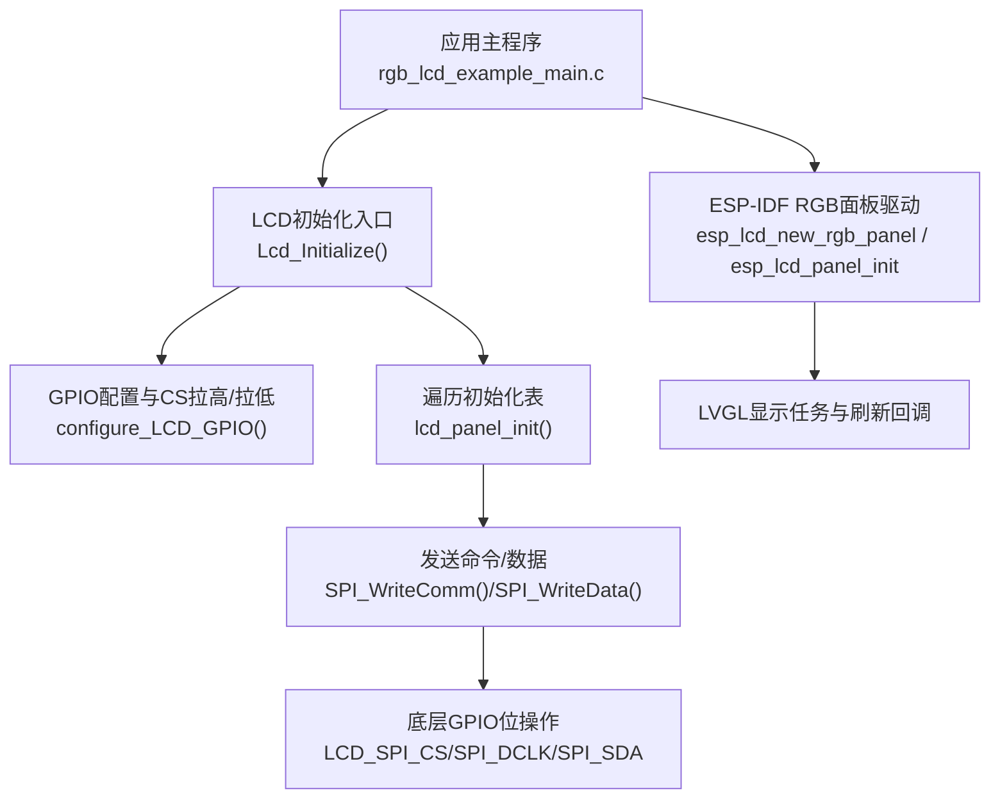
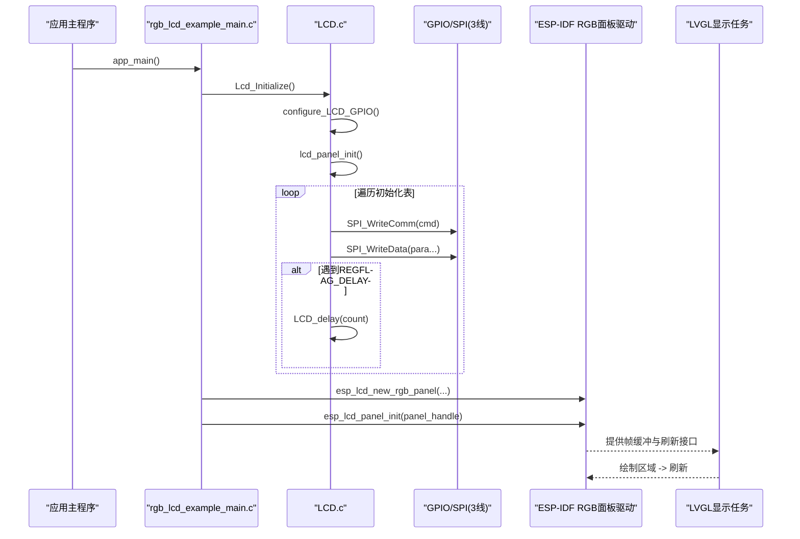
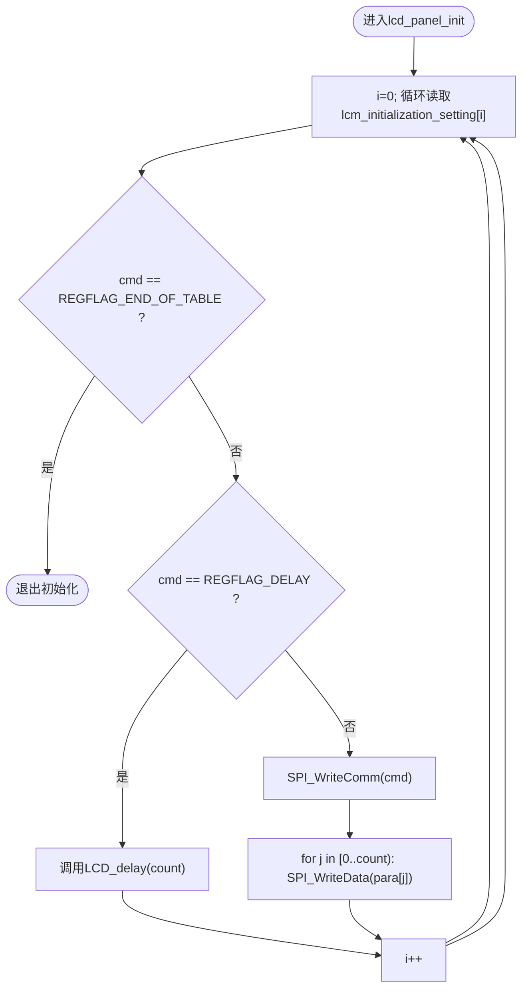
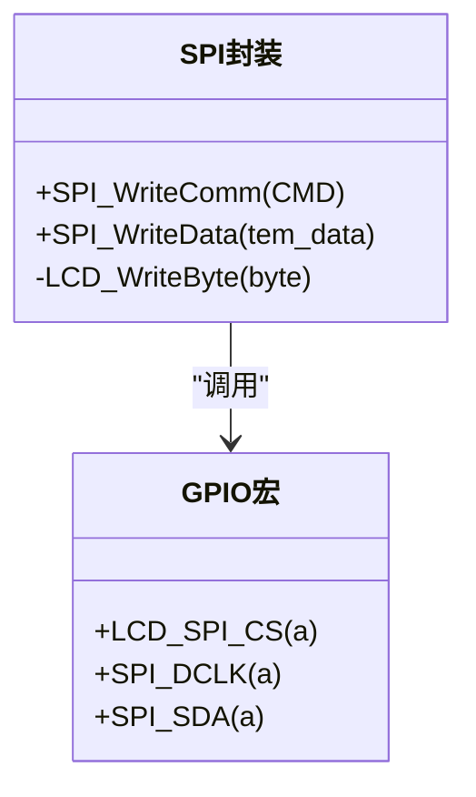
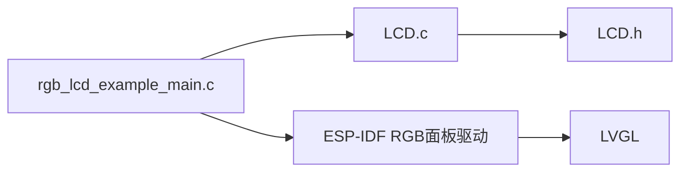

# LCD初始化协议

<cite>
**本文引用的文件**   
- [LCD.c](file://ESP32开发板/TK021F2699_ESP32_LVGL_GIF_LED/TK021F2699_ESP32_LVGL_GIF_LED/main/LCD.c)
- [LCD.h](file://ESP32开发板/TK021F2699_ESP32_LVGL_GIF_LED/TK021F2699_ESP32_LVGL_GIF_LED/main/LCD.h)
- [rgb_lcd_example_main.c](file://ESP32开发板/TK021F2699_ESP32_LVGL_GIF_LED/TK021F2699_ESP32_LVGL_GIF_LED/main/rgb_lcd_example_main.c)
</cite>

## 目录
1. [简介](#简介)
2. [项目结构](#项目结构)
3. [核心组件](#核心组件)
4. [架构总览](#架构总览)
5. [详细组件分析](#详细组件分析)
6. [依赖关系分析](#依赖关系分析)
7. [性能与功耗考量](#性能与功耗考量)
8. [故障排查指南](#故障排查指南)
9. [结论](#结论)
10. [附录：寄存器配置表与参数说明](#附录寄存器配置表与参数说明)

## 简介
本技术文档围绕仓库中的LCD初始化协议展开，重点解析lcm_initialization_setting数组的结构、命令序列与特殊标记（REGFLAG_DELAY、REGFLAG_END_OF_TABLE）的使用方式；同时结合ESP-IDF的RGB面板驱动，梳理从底层GPIO/SPI到上层LVGL的完整数据流。文档还给出不同驱动芯片的适配思路、失败原因分析与调试技巧，以及完整的寄存器配置参考表与推荐值建议。

## 项目结构
本项目包含一个基于ESP32的RGB LCD示例工程，其中：
- main/LCD.c 与 main/LCD.h 实现了对特定LCD驱动芯片的串行初始化流程（通过GPIO模拟SPI）。
- main/rgb_lcd_example_main.c 使用ESP-IDF的RGB面板驱动创建并运行显示任务，并在初始化阶段调用自定义的Lcd_Initialize完成驱动芯片内部寄存器配置。

图表来源
- [rgb_lcd_example_main.c:150-240](file://ESP32开发板/TK021F2699_ESP32_LVGL_GIF_LED/TK021F2699_ESP32_LVGL_GIF_LED/main/rgb_lcd_example_main.c#L150-L240)
- [LCD.c:186-204](file://ESP32开发板/TK021F2699_ESP32_LVGL_GIF_LED/TK021F2699_ESP32_LVGL_GIF_LED/main/LCD.c#L186-L204)
- [LCD.h:12-26](file://ESP32开发板/TK021F2699_ESP32_LVGL_GIF_LED/TK021F2699_ESP32_LVGL_GIF_LED/main/LCD.h#L12-L26)

章节来源
- [rgb_lcd_example_main.c:150-240](file://ESP32开发板/TK021F2699_ESP32_LVGL_GIF_LED/TK021F2699_ESP32_LVGL_GIF_LED/main/rgb_lcd_example_main.c#L150-L240)
- [LCD.c:186-204](file://ESP32开发板/TK021F2699_ESP32_LVGL_GIF_LED/TK021F2699_ESP32_LVGL_GIF_LED/main/LCD.c#L186-L204)
- [LCD.h:12-26](file://ESP32开发板/TK021F2699_ESP32_LVGL_GIF_LED/TK021F2699_ESP32_LVGL_GIF_LED/main/LCD.h#L12-L26)

## 核心组件
- LCM设置表结构体与数组
  - 结构体定义包含“命令字节”、“参数个数”和“参数列表”。
  - lcm_initialization_setting为静态数组，按顺序描述对驱动芯片的寄存器写入序列。
- 特殊标记
  - REGFLAG_DELAY：表示延时项，count字段为延时单位（由软件延时函数处理）。
  - REGFLAG_END_OF_TABLE：表示初始化表结束，循环读取到此标记即停止。
- SPI通信封装
  - SPI_WriteComm/SPI_WriteData：以3线串行（CS/DCLK/SDA）方式将命令或数据写入驱动芯片。
  - GPIO宏：LCD_SPI_CS、SPI_DCLK、SPI_SDA直接操作具体引脚电平。
- 初始化入口
  - Lcd_Initialize：配置GPIO、控制CS时序、调用lcd_panel_init执行表驱动初始化。

章节来源
- [LCD.c:85-93](file://ESP32开发板/TK021F2699_ESP32_LVGL_GIF_LED/TK021F2699_ESP32_LVGL_GIF_LED/main/LCD.c#L85-L93)
- [LCD.c:95-160](file://ESP32开发板/TK021F2699_ESP32_LVGL_GIF_LED/TK021F2699_ESP32_LVGL_GIF_LED/main/LCD.c#L95-L160)
- [LCD.c:51-83](file://ESP32开发板/TK021F2699_ESP32_LVGL_GIF_LED/TK021F2699_ESP32_LVGL_GIF_LED/main/LCD.c#L51-L83)
- [LCD.c:186-204](file://ESP32开发板/TK021F2699_ESP32_LVGL_GIF_LED/TK021F2699_ESP32_LVGL_GIF_LED/main/LCD.c#L186-L204)
- [LCD.c:205-219](file://ESP32开发板/TK021F2699_ESP32_LVGL_GIF_LED/TK021F2699_ESP32_LVGL_GIF_LED/main/LCD.c#L205-L219)
- [LCD.h:12-26](file://ESP32开发板/TK021F2699_ESP32_LVGL_GIF_LED/TK021F2699_ESP32_LVGL_GIF_LED/main/LCD.h#L12-L26)

## 架构总览
下图展示了从应用层到硬件层的调用链与数据流向，包括ESP-IDF RGB面板驱动与自定义串行初始化流程的协作关系。

图表来源
- [rgb_lcd_example_main.c:150-240](file://ESP32开发板/TK021F2699_ESP32_LVGL_GIF_LED/TK021F2699_ESP32_LVGL_GIF_LED/main/rgb_lcd_example_main.c#L150-L240)
- [LCD.c:186-204](file://ESP32开发板/TK021F2699_ESP32_LVGL_GIF_LED/TK021F2699_ESP32_LVGL_GIF_LED/main/LCD.c#L186-L204)

## 详细组件分析

### 数据结构与算法：LCM设置表与遍历器
- 数据结构
  - cmd：命令字节（寄存器地址或特殊标记）。
  - count：参数数量（对于延时项，表示延时单位）。
  - para_list[]：参数数组，长度不超过64。
- 遍历逻辑
  - 若cmd为REGFLAG_END_OF_TABLE：终止。
  - 若cmd为REGFLAG_DELAY：调用软件延时。
  - 否则：先写命令，再依次写count个参数。

图表来源
- [LCD.c:186-204](file://ESP32开发板/TK021F2699_ESP32_LVGL_GIF_LED/TK021F2699_ESP32_LVGL_GIF_LED/main/LCD.c#L186-L204)

章节来源
- [LCD.c:85-93](file://ESP32开发板/TK021F2699_ESP32_LVGL_GIF_LED/TK021F2699_ESP32_LVGL_GIF_LED/main/LCD.c#L85-L93)
- [LCD.c:186-204](file://ESP32开发板/TK021F2699_ESP32_LVGL_GIF_LED/TK021F2699_ESP32_LVGL_GIF_LED/main/LCD.c#L186-L204)

### 串行通信封装：3线SPI（CS/DCLK/SDA）
- 命令与数据区分
  - 命令：在CS拉低后，先将SDA置0，然后产生DCLK边沿，随后移位写入8位命令。
  - 数据：在CS拉低后，先将SDA置1，然后产生DCLK边沿，随后移位写入8位数据。
- 关键宏与函数
  - LCD_SPI_CS(a)、SPI_DCLK(a)、SPI_SDA(a)：直接操作GPIO引脚电平。
  - SPI_WriteComm/CMD、SPI_WriteData/tem_data：封装了上述时序。

图表来源
- [LCD.c:51-83](file://ESP32开发板/TK021F2699_ESP32_LVGL_GIF_LED/TK021F2699_ESP32_LVGL_GIF_LED/main/LCD.c#L51-L83)
- [LCD.h:12-26](file://ESP32开发板/TK021F2699_ESP32_LVGL_GIF_LED/TK021F2699_ESP32_LVGL_GIF_LED/main/LCD.h#L12-L26)

章节来源
- [LCD.c:51-83](file://ESP32开发板/TK021F2699_ESP32_LVGL_GIF_LED/TK021F2699_ESP32_LVGL_GIF_LED/main/LCD.c#L51-L83)
- [LCD.h:12-26](file://ESP32开发板/TK021F2699_ESP32_LVGL_GIF_LED/TK021F2699_ESP32_LVGL_GIF_LED/main/LCD.h#L12-L26)

### 初始化入口与GPIO配置
- Lcd_Initialize
  - 调用configure_LCD_GPIO进行相关GPIO模式配置。
  - 控制CS引脚拉低/拉高，确保总线空闲状态。
  - 调用lcd_panel_init执行表驱动初始化。
- configure_LCD_GPIO
  - 将CS、DCLK、SDA对应的GPIO设置为输出模式，并初始化为高电平。

章节来源
- [LCD.c:205-219](file://ESP32开发板/TK021F2699_ESP32_LVGL_GIF_LED/TK021F2699_ESP32_LVGL_GIF_LED/main/LCD.c#L205-L219)
- [LCD.c:17-40](file://ESP32开发板/TK021F2699_ESP32_LVGL_GIF_LED/TK021F2699_ESP32_LVGL_GIF_LED/main/LCD.c#L17-L40)

### ESP-IDF RGB面板驱动集成
- 像素与时序配置
  - 分辨率：480x480。
  - 像素时钟：16MHz。
  - 时序参数：hsync/vsync前后肩与脉宽等。
  - 数据宽度：16bit（RGB565）。
- 初始化流程
  - 调用Lcd_Initialize完成驱动芯片内部寄存器配置。
  - 使用esp_lcd_new_rgb_panel创建面板句柄。
  - 使用esp_lcd_panel_init启动面板。
  - 注册事件回调（如VSYNC），并与LVGL同步避免撕裂。
- LVGL集成
  - 分配帧缓冲（PSRAM或双缓冲）。
  - 注册flush回调，将LVGL绘制的区域写入面板。

章节来源
- [rgb_lcd_example_main.c:150-240](file://ESP32开发板/TK021F2699_ESP32_LVGL_GIF_LED/TK021F2699_ESP32_LVGL_GIF_LED/main/rgb_lcd_example_main.c#L150-L240)
- [rgb_lcd_example_main.c:246-303](file://ESP32开发板/TK021F2699_ESP32_LVGL_GIF_LED/TK021F2699_ESP32_LVGL_GIF_LED/main/rgb_lcd_example_main.c#L246-L303)

## 依赖关系分析
- 模块耦合
  - rgb_lcd_example_main.c 依赖 LCD.c 提供的Lcd_Initialize。
  - LCD.c 依赖 LCD.h 的GPIO宏与函数声明。
  - LCD.c 通过GPIO直接模拟3线SPI，不依赖ESP-IDF的SPI外设。
- 外部依赖
  - ESP-IDF的RGB面板驱动用于并行RGB数据传输与扫描时序生成。
  - LVGL负责UI渲染与刷新调度。

图表来源
- [rgb_lcd_example_main.c:150-240](file://ESP32开发板/TK021F2699_ESP32_LVGL_GIF_LED/TK021F2699_ESP32_LVGL_GIF_LED/main/rgb_lcd_example_main.c#L150-L240)
- [LCD.c:186-204](file://ESP32开发板/TK021F2699_ESP32_LVGL_GIF_LED/TK021F2699_ESP32_LVGL_GIF_LED/main/LCD.c#L186-L204)
- [LCD.h:12-26](file://ESP32开发板/TK021F2699_ESP32_LVGL_GIF_LED/TK021F2699_ESP32_LVGL_GIF_LED/main/LCD.h#L12-L26)

章节来源
- [rgb_lcd_example_main.c:150-240](file://ESP32开发板/TK021F2699_ESP32_LVGL_GIF_LED/TK021F2699_ESP32_LVGL_GIF_LED/main/rgb_lcd_example_main.c#L150-L240)
- [LCD.c:186-204](file://ESP32开发板/TK021F2699_ESP32_LVGL_GIF_LED/TK021F2699_ESP32_LVGL_GIF_LED/main/LCD.c#L186-L204)
- [LCD.h:12-26](file://ESP32开发板/TK021F2699_ESP32_LVGL_GIF_LED/TK021F2699_ESP32_LVGL_GIF_LED/main/LCD.h#L12-L26)

## 性能与功耗考量
- 软件延时精度
  - LCD_delay为纯软件循环延时，受CPU频率与编译器优化影响较大。建议在需要精确延时的场景改用系统定时器或ESP-IDF延时API。
- 串行初始化开销
  - 大量小包命令/数据写入会增加总线占用时间。可考虑合并相邻写操作或使用批量传输（若驱动支持）。
- 并行RGB带宽
  - 16bit并行+16MHz像素时钟，理论带宽约122.88Mbps。需确保PSRAM带宽与DMA能力满足刷新需求。
- 电源与背光
  - 合理设置背光引脚电平与PWM占空比，降低功耗。

[本节为通用指导，不直接分析具体文件]

## 故障排查指南
- 无显示或花屏
  - 检查CS/DCLK/SDA引脚映射是否正确，确认LCD_SPI_CS/SPI_DCLK/SPI_SDA宏指向的GPIO与实际连线一致。
  - 核对初始化表中命令顺序与参数个数是否与驱动芯片手册匹配。
  - 确认REGFLAG_DELAY的位置与时长是否足够（例如等待PLL锁定或内部复位完成）。
- 颜色异常
  - 检查色彩格式配置命令（如0x3A）与ESP-IDF RGB面板的数据宽度配置是否一致（当前为16bit RGB565）。
  - 校验gamma校正相关寄存器（e0/e1/e2等）是否被正确写入。
- 撕裂或闪烁
  - 启用VSYNC同步机制，确保LVGL刷新与面板扫描周期对齐。
  - 调整帧缓冲策略（单缓冲/双缓冲）与full_refresh标志。
- 初始化卡死
  - 增加关键节点日志，定位卡在哪个命令或延时处。
  - 逐步注释掉部分初始化条目，缩小问题范围。

章节来源
- [LCD.c:85-93](file://ESP32开发板/TK021F2699_ESP32_LVGL_GIF_LED/TK021F2699_ESP32_LVGL_GIF_LED/main/LCD.c#L85-L93)
- [LCD.c:186-204](file://ESP32开发板/TK021F2699_ESP32_LVGL_GIF_LED/TK021F2699_ESP32_LVGL_GIF_LED/main/LCD.c#L186-L204)
- [rgb_lcd_example_main.c:150-240](file://ESP32开发板/TK021F2699_ESP32_LVGL_GIF_LED/TK021F2699_ESP32_LVGL_GIF_LED/main/rgb_lcd_example_main.c#L150-L240)

## 结论
本项目采用“表驱动”的方式组织LCD驱动芯片的初始化序列，通过REGFLAG_DELAY与REGFLAG_END_OF_TABLE实现灵活的控制流。配合ESP-IDF的RGB面板驱动与LVGL，形成从底层GPIO/SPI到上层UI渲染的完整链路。针对不同的驱动芯片，只需替换lcm_initialization_setting的内容即可适配，但需注意时序、色彩格式与gamma校正等关键参数的匹配。

[本节为总结性内容，不直接分析具体文件]

## 附录：寄存器配置表与参数说明

### 初始化表结构与特殊标记
- 结构体字段
  - cmd：命令字节或特殊标记。
  - count：参数个数（延时项时为延时单位）。
  - para_list[]：参数数组。
- 特殊标记
  - REGFLAG_DELAY：插入延时，count单位为软件延时计数。
  - REGFLAG_END_OF_TABLE：初始化表结束标志。

章节来源
- [LCD.c:85-93](file://ESP32开发板/TK021F2699_ESP32_LVGL_GIF_LED/TK021F2699_ESP32_LVGL_GIF_LED/main/LCD.c#L85-L93)
- [LCD.c:95-160](file://ESP32开发板/TK021F2699_ESP32_LVGL_GIF_LED/TK021F2699_ESP32_LVGL_GIF_LED/main/LCD.c#L95-L160)

### 命令序列概览（按出现顺序）
以下为实际使用的初始化条目（不含已注释掉的备用序列）：
- 0x3A, 1, {0x70}
- 0xFF, 5, {0x77, 0x01, 0x00, 0x00, 0x10}
- 0xC0, 2, {0x3B, 0x00}
- 0xC1, 2, {0x06, 0x05}
- 0xC2, 2, {0x37, 0x02}
- 0xC6, 1, {0x21}
- 0xCC, 1, {0x30}
- 0xB0, 16, {...}
- 0xB1, 16, {...}
- 0xFF, 5, {0x77, 0x01, 0x00, 0x00, 0x11}
- 0xB0, 1, {0x7D}
- 0xB1, 1, {0x3B}
- 0xB2, 1, {0x07}
- 0xB3, 1, {0x80}
- 0xB5, 1, {0x45}
- 0xB7, 1, {0x87}
- 0xB8, 1, {0x33}
- 0xB9, 1, {0x10}
- 0xBB, 1, {0x03}
- 0xC0, 1, {0x03}
- 0xC1, 1, {0x70}
- 0xC2, 1, {0x70}
- 0xD0, 1, {0x88}
- REGFLAG_DELAY, 50, {0x00}
- 0xE0, 5, {...}
- 0xE1, 11, {...}
- 0xE2, 13, {...}
- 0xE3, 4, {...}
- 0xE4, 2, {...}
- 0xE5, 16, {...}
- 0xE6, 4, {...}
- 0xE7, 2, {...}
- 0xE8, 16, {...}
- 0xEB, 7, {...}
- 0xEC, 3, {...}
- 0xED, 16, {...}
- 0xEF, 6, {...}
- 0xFF, 5, {0x77, 0x01, 0x00, 0x00, 0x13}
- 0xE8, 2, {0x00, 0x0E}
- 0xE8, 2, {0x00, 0x0C}
- 0xE8, 2, {0x00, 0x00}
- 0xFF, 5, {0x77, 0x01, 0x00, 0x00, 0x00}
- 0x11, 1, {0x00}
- REGFLAG_DELAY, 50, {0x00}
- 0x20, 1, {0x00}
- 0x36, 1, {0x00}
- 0x29, 1, {0x00}
- REGFLAG_END_OF_TABLE, 0x00, {0x00}

章节来源
- [LCD.c:95-160](file://ESP32开发板/TK021F2699_ESP32_LVGL_GIF_LED/TK021F2699_ESP32_LVGL_GIF_LED/main/LCD.c#L95-L160)

### 参数含义与作用分类
- 显示模式与色彩格式
  - 0x3A：设置色彩格式（当前为0x70，对应16bit RGB565）。
  - 0x20/0x29：关闭/开启显示（0x20关，0x29开）。
  - 0x36：内存访问控制（方向/镜像等，当前为0x00）。
- 电源与时序
  - 0xC0/0xC1/0xC2：电源管理相关参数。
  - 0xB0~0xB9、0xBB：时序与驱动强度调节。
  - 0xD0：其他电源/偏置设置。
- Gamma校正
  - 0xE0~0xEF：Gamma曲线与电压调节参数。
- 厂商私有扩展
  - 0xFF：切换扩展页或功能组（常见于某些驱动芯片的私有寄存器组）。
- 特殊标记
  - REGFLAG_DELAY：插入延时，保证上电稳定或内部状态就绪。
  - REGFLAG_END_OF_TABLE：初始化表结束。

章节来源
- [LCD.c:95-160](file://ESP32开发板/TK021F2699_ESP32_LVGL_GIF_LED/TK021F2699_ESP32_LVGL_GIF_LED/main/LCD.c#L95-L160)

### 不同驱动芯片的初始化差异与适配方法
- 差异点
  - 寄存器地址与参数含义可能不同（尤其是0xFF扩展页后的私有寄存器）。
  - 时序参数（前后肩、脉宽）与像素时钟需根据屏幕规格调整。
  - 色彩格式与内存访问方向需与ESP-IDF RGB面板配置保持一致。
- 适配步骤
  - 替换lcm_initialization_setting为对应芯片的初始化序列。
  - 校准0x3A与ESP-IDF data_width一致性。
  - 调整时序参数（hsync_back_porch、hsync_front_porch、hsync_pulse_width、vsync_*等）。
  - 必要时增加或调整REGFLAG_DELAY位置与时长。

章节来源
- [rgb_lcd_example_main.c:182-228](file://ESP32开发板/TK021F2699_ESP32_LVGL_GIF_LED/TK021F2699_ESP32_LVGL_GIF_LED/main/rgb_lcd_example_main.c#L182-L228)
- [LCD.c:95-160](file://ESP32开发板/TK021F2699_ESP32_LVGL_GIF_LED/TK021F2699_ESP32_LVGL_GIF_LED/main/LCD.c#L95-L160)

### 推荐值与最佳实践
- 色彩格式
  - 0x3A设为0x70（16bit RGB565），与ESP-IDF data_width=16保持一致。
- 时序参数
  - 参考屏幕规格书，合理设置hsync/vsync前后肩与脉宽，避免过短导致不稳定。
- Gamma校正
  - 依据屏幕实测效果微调0xE0~0xEF系列参数，以获得更准确的灰阶过渡。
- 延时策略
  - 在上电后与关键命令后插入REGFLAG_DELAY，确保内部状态机稳定。

[本节为通用建议，不直接分析具体文件]