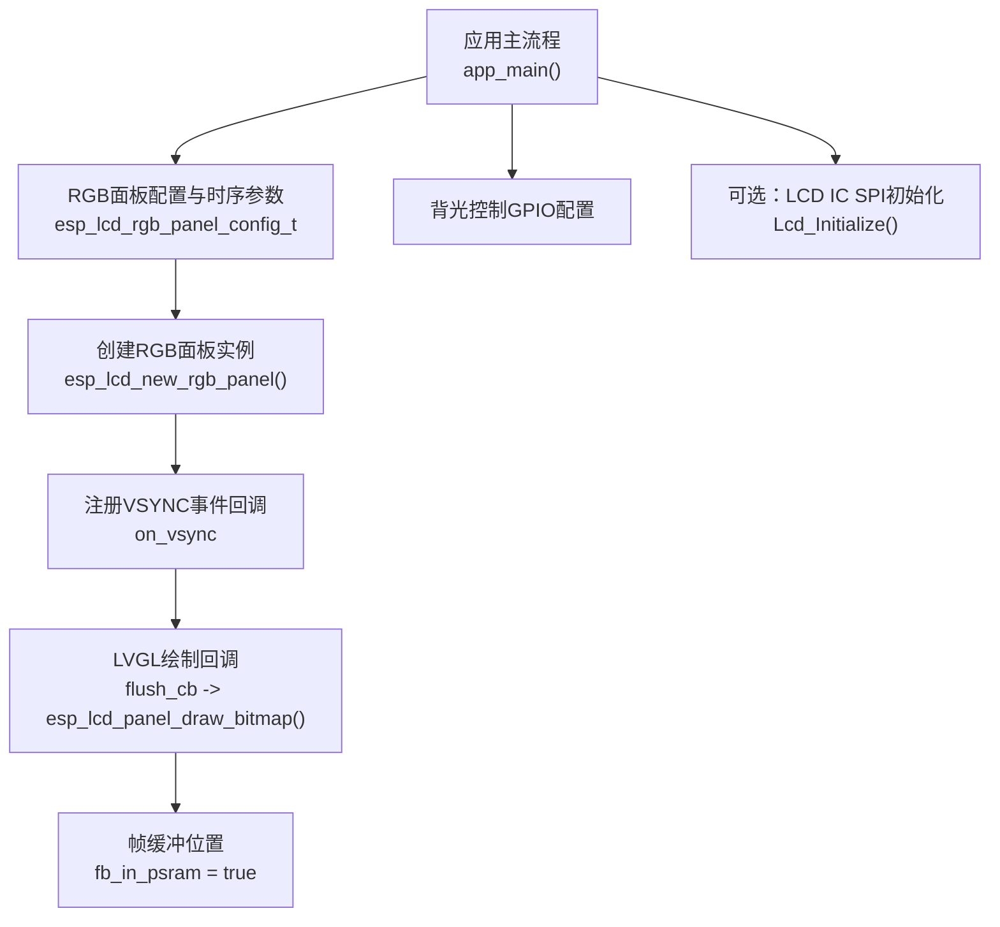
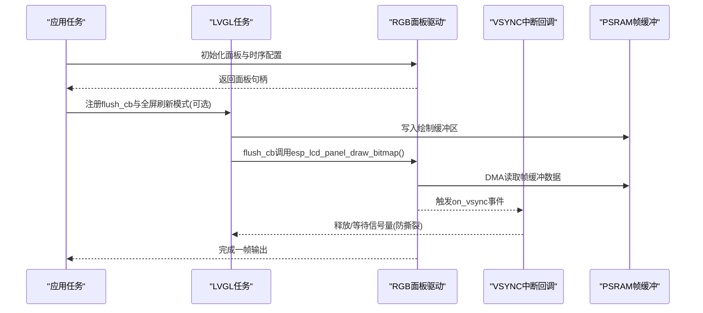
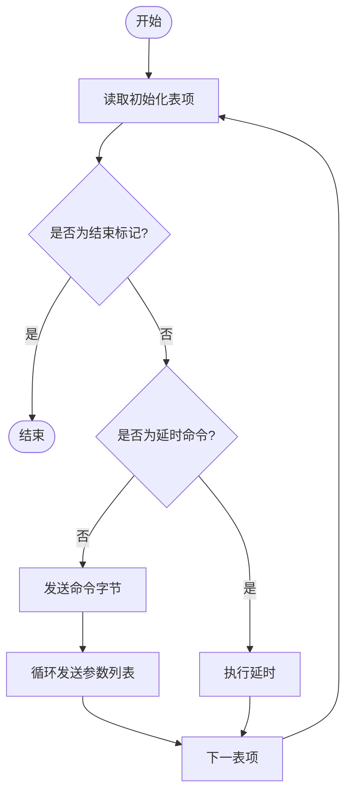
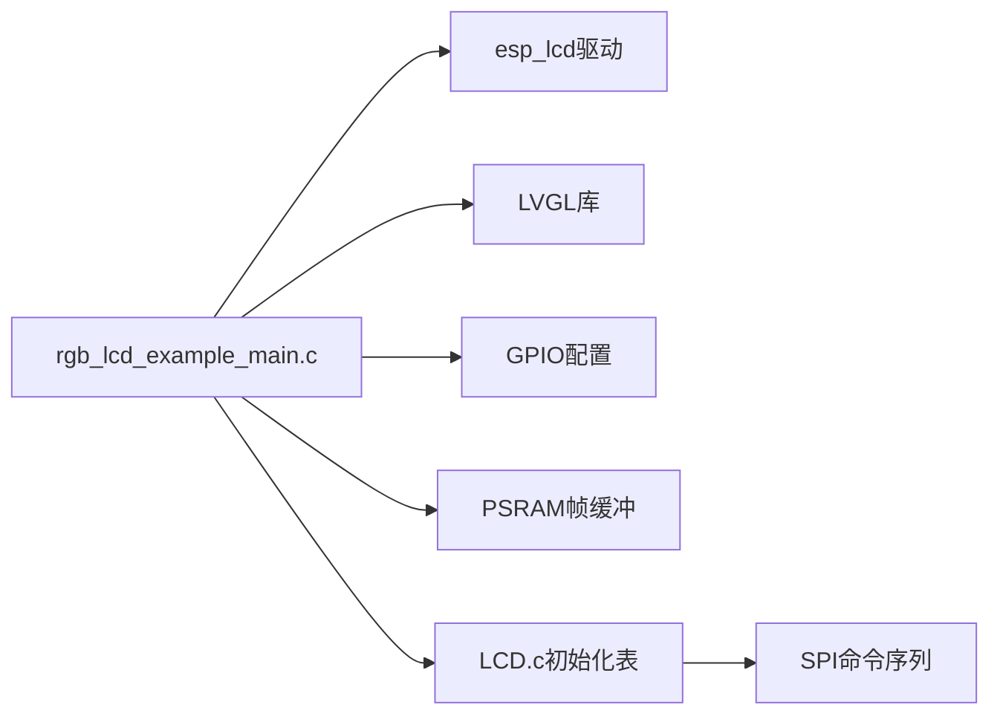

# LCD时序配置

<cite>
**本文引用的文件**   
- [rgb_lcd_example_main.c](file://ESP32开发板/TK021F2699_ESP32_LVGL_GIF_LED/TK021F2699_ESP32_LVGL_GIF_LED/main/rgb_lcd_example_main.c)
- [LCD.h](file://ESP32开发板/TK021F2699_ESP32_LVGL_GIF_LED/TK021F2699_ESP32_LVGL_GIF_LED/main/LCD.h)
- [LCD.c](file://ESP32开发板/TK021F2699_ESP32_LVGL_GIF_LED/TK021F2699_ESP32_LVGL_GIF_LED/main/LCD.c)
- [README.md](file://ESP32开发板/TK021F2699_ESP32_LVGL_GIF_LED/TK021F2699_ESP32_LVGL_GIF_LED/README.md)
</cite>

## 目录
1. [简介](#简介)
2. [项目结构](#项目结构)
3. [核心组件](#核心组件)
4. [架构总览](#架构总览)
5. [详细组件分析](#详细组件分析)
6. [依赖关系分析](#依赖关系分析)
7. [性能与功耗优化](#性能与功耗优化)
8. [故障诊断与排错](#故障诊断与排错)
9. [结论](#结论)
10. [附录：不同刷新率下的时序参数参考表](#附录不同刷新率下的时序参数参考表)

## 简介
本技术文档围绕RGB LCD的时序配置展开，重点解释像素时钟频率、水平同步（HSYNC）、垂直同步（VSYNC）、数据使能（DE）等关键参数的含义与设置方法。结合仓库中的示例工程，给出480x480分辨率下的时序优化建议、PSRAM帧缓冲与LCD控制器之间的数据传输时序要求、不同刷新率的参数参考表与最佳实践，并总结常见显示问题的诊断与解决方法以及高刷新率模式下的功耗优化策略。

## 项目结构
本项目为ESP32-S3平台上的RGB LCD示例工程，包含以下与LCD时序相关的关键内容：
- RGB面板驱动与时序配置：位于主程序入口中，定义像素时钟、分辨率、HSYNC/VSYNC/DE引脚及时序参数，创建RGB面板实例并注册事件回调。
- LVGL集成：通过LVGL绘制缓冲区将图像数据写入到RGB面板，支持单/双帧缓冲与可选防撕裂机制。
- PSRAM帧缓冲：将帧缓冲分配在PSRAM中，受SPI0带宽限制影响最大像素时钟。
- 背光控制与GPIO初始化：根据模块需求控制背光电平。
- 屏幕IC初始化（可选）：部分屏需要额外的SPI命令序列进行初始化，示例工程中提供通用接口与初始化表。

图示来源
- [rgb_lcd_example_main.c:150-236](file://ESP32开发板/TK021F2699_ESP32_LVGL_GIF_LED/TK021F2699_ESP32_LVGL_GIF_LED/main/rgb_lcd_example_main.c#L150-L236)
- [rgb_lcd_example_main.c:246-273](file://ESP32开发板/TK021F2699_ESP32_LVGL_GIF_LED/TK021F2699_ESP32_LVGL_GIF_LED/main/rgb_lcd_example_main.c#L246-L273)
- [LCD.c:186-219](file://ESP32开发板/TK021F2699_ESP32_LVGL_GIF_LED/TK021F2699_ESP32_LVGL_GIF_LED/main/LCD.c#L186-L219)

章节来源
- [rgb_lcd_example_main.c:150-236](file://ESP32开发板/TK021F2699_ESP32_LVGL_GIF_LED/TK021F2699_ESP32_LVGL_GIF_LED/main/rgb_lcd_example_main.c#L150-L236)
- [README.md:102-122](file://ESP32开发板/TK021F2699_ESP32_LVGL_GIF_LED/TK021F2699_ESP32_LVGL_GIF_LED/README.md#L102-L122)

## 核心组件
- RGB面板配置与时序参数
  - 像素时钟频率：pclk_hz决定每秒钟传输的像素数，直接影响刷新率与带宽需求。
  - 分辨率：h_res与v_res定义有效像素区域大小。
  - 同步时序：hsync_back_porch、hsync_front_porch、hsync_pulse_width；vsync_back_porch、vsync_front_porch、vsync_pulse_width。
  - 极性与时钟边沿：flags.pclk_active_neg控制像素时钟采样边沿。
  - 帧缓冲位置：flags.fb_in_psram=true表示帧缓冲位于PSRAM，受SPI0带宽限制。
  - 传输对齐：psram_trans_align用于PSRAM传输对齐，提升DMA效率。
- LVGL集成与刷新回调
  - flush_cb中将绘制缓冲区数据通过esp_lcd_panel_draw_bitmap发送到面板。
  - 可选使用信号量在VSYNC边界同步，避免撕裂。
- 背光与GPIO
  - 背光控制电平可配置，需根据模块规格调整。
- 可选的LCD IC初始化
  - 通过SPI发送命令序列完成面板IC初始化，适用于需要额外配置的屏。

章节来源
- [rgb_lcd_example_main.c:182-228](file://ESP32开发板/TK021F2699_ESP32_LVGL_GIF_LED/TK021F2699_ESP32_LVGL_GIF_LED/main/rgb_lcd_example_main.c#L182-L228)
- [rgb_lcd_example_main.c:95-109](file://ESP32开发板/TK021F2699_ESP32_LVGL_GIF_LED/TK021F2699_ESP32_LVGL_GIF_LED/main/rgb_lcd_example_main.c#L95-L109)
- [rgb_lcd_example_main.c:168-175](file://ESP32开发板/TK021F2699_ESP32_LVGL_GIF_LED/TK021F2699_ESP32_LVGL_GIF_LED/main/rgb_lcd_example_main.c#L168-L175)
- [LCD.c:186-219](file://ESP32开发板/TK021F2699_ESP32_LVGL_GIF_LED/TK021F2699_ESP32_LVGL_GIF_LED/main/LCD.c#L186-L219)

## 架构总览
下图展示了从LVGL绘制到RGB面板输出的整体时序路径，包括VSYNC事件同步与帧缓冲读写关系。

图示来源
- [rgb_lcd_example_main.c:84-93](file://ESP32开发板/TK021F2699_ESP32_LVGL_GIF_LED/TK021F2699_ESP32_LVGL_GIF_LED/main/rgb_lcd_example_main.c#L84-L93)
- [rgb_lcd_example_main.c:95-109](file://ESP32开发板/TK021F2699_ESP32_LVGL_GIF_LED/TK021F2699_ESP32_LVGL_GIF_LED/main/rgb_lcd_example_main.c#L95-L109)
- [rgb_lcd_example_main.c:227-228](file://ESP32开发板/TK021F2699_ESP32_LVGL_GIF_LED/TK021F2699_ESP32_LVGL_GIF_LED/main/rgb_lcd_example_main.c#L227-L228)

## 详细组件分析

### 像素时钟与刷新率计算
- 像素时钟频率pclk_hz与刷新率的关系：
  - 一帧总像素数 = (h_res + hsync_front_porch + hsync_pulse_width + hsync_back_porch) × (v_res + vsync_front_porch + vsync_pulse_width + vsync_back_porch)
  - 刷新率 = pclk_hz / 一帧总像素数
- 示例中采用480x480分辨率，pclk_hz=16MHz，HSYNC/VSYNC前后肩与脉宽均为典型值，据此可估算刷新率。若提高pclk_hz或减小前后肩/脉宽，可提高刷新率，但需确保面板IC与布线满足时序要求。

章节来源
- [rgb_lcd_example_main.c:213-226](file://ESP32开发板/TK021F2699_ESP32_LVGL_GIF_LED/TK021F2699_ESP32_LVGL_GIF_LED/main/rgb_lcd_example_main.c#L213-L226)

### 水平与垂直同步时序
- HSYNC/VSYNC前后肩与脉宽决定了行/场消隐区间长度，影响扫描起始点与稳定性。
- 当出现屏幕漂移或滚动时，应检查并微调这些参数，同时考虑pclk_active_neg对采样边沿的影响。

章节来源
- [rgb_lcd_example_main.c:217-225](file://ESP32开发板/TK021F2699_ESP32_LVGL_GIF_LED/TK021F2699_ESP32_LVGL_GIF_LED/main/rgb_lcd_example_main.c#L217-L225)
- [README.md:108-111](file://ESP32开发板/TK021F2699_ESP32_LVGL_GIF_LED/TK021F2699_ESP32_LVGL_GIF_LED/README.md#L108-L111)

### 数据使能（DE）模式
- 若面板仅支持DE模式，可将HSYNC与VSYNC引脚设为无效（-1），由DE信号指示有效数据窗口。
- DE模式下仍需正确设置pclk_hz与分辨率，确保数据窗口与像素时钟匹配。

章节来源
- [README.md:59-59](file://ESP32开发板/TK021F2699_ESP32_LVGL_GIF_LED/TK021F2699_ESP32_LVGL_GIF_LED/README.md#L59-L59)

### 帧缓冲与PSRAM传输时序
- fb_in_psram=true将帧缓冲置于PSRAM，受SPI0带宽限制，可能降低最大可用pclk_hz。
- psram_trans_align用于对齐PSRAM传输，提升DMA吞吐。
- 若遇到低pclk或带宽不足，可启用bounce buffer模式，将数据先拷贝到内部SRAM再输出，增加CPU占用但缓解PSRAM带宽瓶颈。

章节来源
- [rgb_lcd_example_main.c:183-188](file://ESP32开发板/TK021F2699_ESP32_LVGL_GIF_LED/TK021F2699_ESP32_LVGL_GIF_LED/main/rgb_lcd_example_main.c#L183-L188)
- [rgb_lcd_example_main.c:227-228](file://ESP32开发板/TK021F2699_ESP32_LVGL_GIF_LED/TK021F2699_ESP32_LVGL_GIF_LED/main/rgb_lcd_example_main.c#L227-L228)
- [README.md:106-117](file://ESP32开发板/TK021F2699_ESP32_LVGL_GIF_LED/TK021F2699_ESP32_LVGL_GIF_LED/README.md#L106-L117)

### 防撕裂与VSYNC同步
- 使用信号量在VSYNC边界协调LVGL写入与面板读取，避免撕裂。
- 在flush_cb中发出“GUI准备”信号量，并在on_vsync回调中释放“VSYNC结束”信号量，形成同步握手。

章节来源
- [rgb_lcd_example_main.c:76-93](file://ESP32开发板/TK021F2699_ESP32_LVGL_GIF_LED/TK021F2699_ESP32_LVGL_GIF_LED/main/rgb_lcd_example_main.c#L76-L93)
- [rgb_lcd_example_main.c:102-109](file://ESP32开发板/TK021F2699_ESP32_LVGL_GIF_LED/TK021F2699_ESP32_LVGL_GIF_LED/main/rgb_lcd_example_main.c#L102-L109)

### 可选的LCD IC初始化流程
- 对于需要额外初始化的面板，可通过SPI发送命令序列完成配置，随后再进入RGB模式。
- 初始化表以命令+参数形式组织，循环执行直至结束标记。

图示来源
- [LCD.c:186-204](file://ESP32开发板/TK021F2699_ESP32_LVGL_GIF_LED/TK021F2699_ESP32_LVGL_GIF_LED/main/LCD.c#L186-L204)

章节来源
- [LCD.c:86-160](file://ESP32开发板/TK021F2699_ESP32_LVGL_GIF_LED/TK021F2699_ESP32_LVGL_GIF_LED/main/LCD.c#L86-L160)
- [LCD.c:186-219](file://ESP32开发板/TK021F2699_ESP32_LVGL_GIF_LED/TK021F2699_ESP32_LVGL_GIF_LED/main/LCD.c#L186-L219)

## 依赖关系分析
- 主程序依赖ESP-IDF的esp_lcd与lvgl组件，负责面板驱动、事件回调与UI渲染。
- 面板驱动依赖GPIO与时钟源配置，帧缓冲依赖PSRAM与DMA通道。
- 可选的LCD IC初始化依赖SPI GPIO与软件延时。

图示来源
- [rgb_lcd_example_main.c:150-236](file://ESP32开发板/TK021F2699_ESP32_LVGL_GIF_LED/TK021F2699_ESP32_LVGL_GIF_LED/main/rgb_lcd_example_main.c#L150-L236)
- [LCD.c:186-219](file://ESP32开发板/TK021F2699_ESP32_LVGL_GIF_LED/TK021F2699_ESP32_LVGL_GIF_LED/main/LCD.c#L186-L219)

章节来源
- [rgb_lcd_example_main.c:150-236](file://ESP32开发板/TK021F2699_ESP32_LVGL_GIF_LED/TK021F2699_ESP32_LVGL_GIF_LED/main/rgb_lcd_example_main.c#L150-L236)
- [LCD.c:186-219](file://ESP32开发板/TK021F2699_ESP32_LVGL_GIF_LED/TK021F2699_ESP32_LVGL_GIF_LED/main/LCD.c#L186-L219)

## 性能与功耗优化
- 提高刷新率
  - 增大pclk_hz（注意PSRAM带宽限制）。
  - 减小HSYNC/VSYNC前后肩与脉宽（需遵循面板规格）。
  - 启用bounce buffer以降低PSRAM带宽压力，但会增加CPU占用。
- 降低功耗
  - 合理设置背光电平与开关时机。
  - 在高刷新率下减少不必要的绘制区域，使用局部刷新。
  - 关闭不需要的功能（如GIF动画）以降低CPU与总线负载。
- 内存与带宽
  - 使用双帧缓冲可减少撕裂并提高吞吐，但占用更多内存。
  - 启用SPIRAM指令/常量缓存选项可节省SPI0带宽。

章节来源
- [README.md:106-117](file://ESP32开发板/TK021F2699_ESP32_LVGL_GIF_LED/TK021F2699_ESP32_LVGL_GIF_LED/README.md#L106-L117)
- [rgb_lcd_example_main.c:183-188](file://ESP32开发板/TK021F2699_ESP32_LVGL_GIF_LED/TK021F2699_ESP32_LVGL_GIF_LED/main/rgb_lcd_example_main.c#L183-L188)

## 故障诊断与排错
- 屏幕不亮
  - 检查背光开启电平配置是否正确。
- 无帧缓冲内存
  - 将帧缓冲放置于PSRAM，注意SPI0带宽限制。
- 屏幕漂移或滚动
  - 降低pclk_hz，调整pclk_active_neg与VBP等时序参数。
- 撕裂现象
  - 使用双帧缓冲或在flush_cb与VSYNC间加入信号量同步。
- PCLK频率过低
  - 启用bounce buffer或优化SPIRAM缓存选项。
- 时序正确但无显示
  - 确认是否需要额外的LCD IC初始化序列。

章节来源
- [README.md:102-122](file://ESP32开发板/TK021F2699_ESP32_LVGL_GIF_LED/TK021F2699_ESP32_LVGL_GIF_LED/README.md#L102-L122)
- [rgb_lcd_example_main.c:168-175](file://ESP32开发板/TK021F2699_ESP32_LVGL_GIF_LED/TK021F2699_ESP32_LVGL_GIF_LED/main/rgb_lcd_example_main.c#L168-L175)

## 结论
通过对像素时钟、同步时序、数据使能与帧缓冲位置的合理配置，可在480x480分辨率下实现稳定且高效的RGB LCD输出。针对PSRAM带宽限制与撕裂问题，可采用双帧缓冲、bounce buffer与VSYNC同步等策略。实际调试中应依据面板规格微调时序参数，并结合功耗与性能需求进行权衡。

## 附录：不同刷新率下的时序参数参考表
以下为基于示例工程480x480分辨率的参考配置思路（具体数值需依面板规格与硬件条件验证）：
- 目标刷新率约30fps
  - pclk_hz ≈ 16 MHz
  - h_res=480, v_res=480
  - hsync_back_porch≈9, hsync_front_porch≈4, hsync_pulse_width≈2
  - vsync_back_porch≈9, vsync_front_porch≈4, vsync_pulse_width≈2
  - flags.pclk_active_neg=true
  - flags.fb_in_psram=true
- 目标刷新率约60fps
  - 提高pclk_hz至约32 MHz（需评估PSRAM带宽与布线质量）
  - 可适当减小前后肩与脉宽（遵循面板规格）
  - 启用bounce buffer以降低PSRAM带宽压力
- 目标刷新率约120fps
  - pclk_hz进一步增大（需严格评估SPI0带宽与信号完整性）
  - 尽量缩小前后肩与脉宽，必要时改用内部SRAM作为中间缓冲
  - 减少绘制区域与动画复杂度以降低CPU与总线负载

章节来源
- [rgb_lcd_example_main.c:213-226](file://ESP32开发板/TK021F2699_ESP32_LVGL_GIF_LED/TK021F2699_ESP32_LVGL_GIF_LED/main/rgb_lcd_example_main.c#L213-L226)
- [README.md:106-117](file://ESP32开发板/TK021F2699_ESP32_LVGL_GIF_LED/TK021F2699_ESP32_LVGL_GIF_LED/README.md#L106-L117)