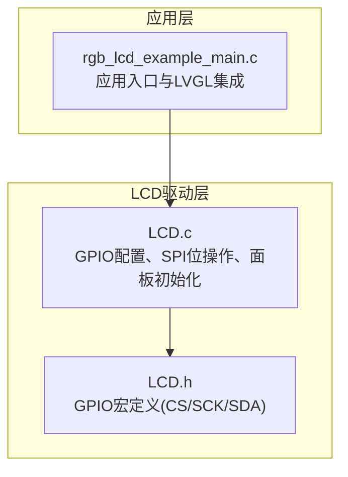
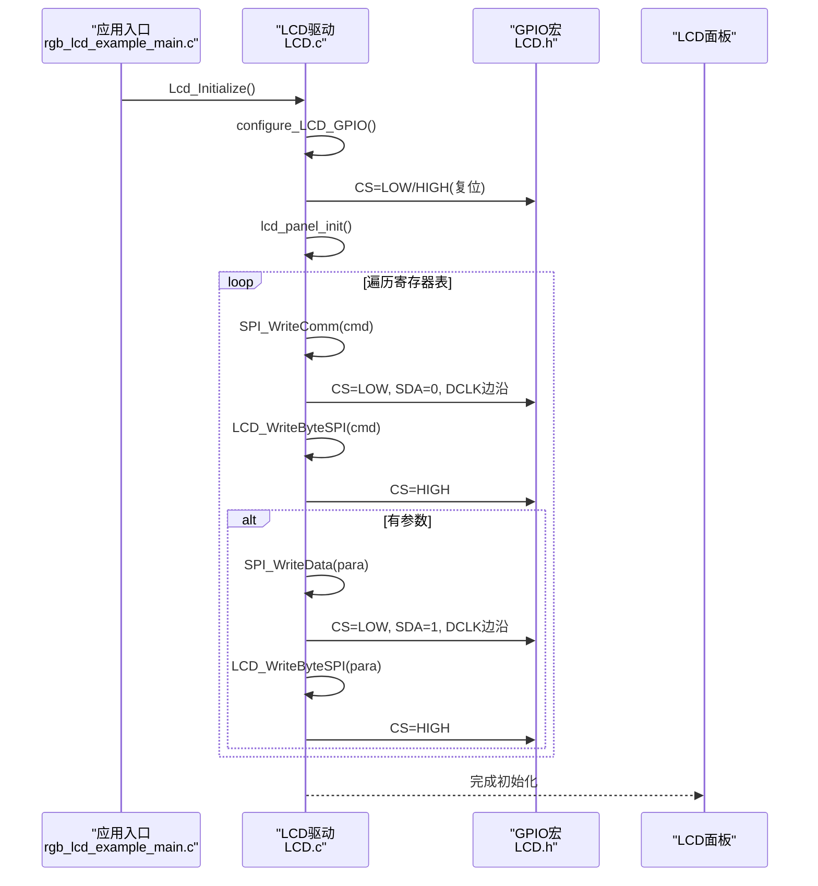
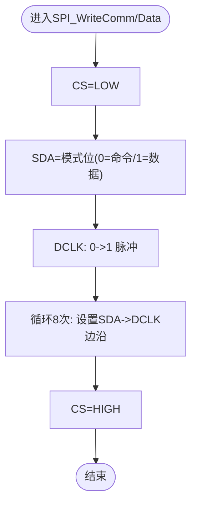
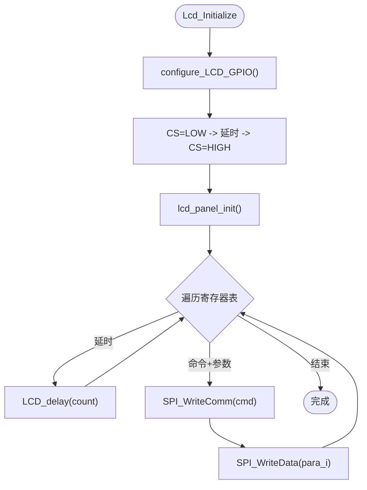
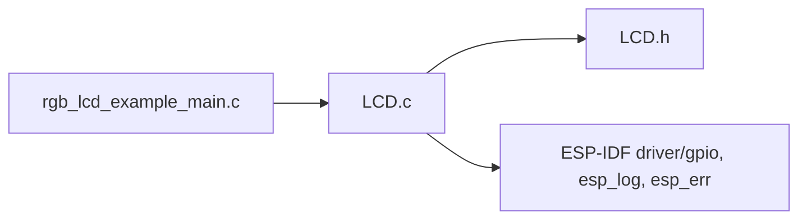
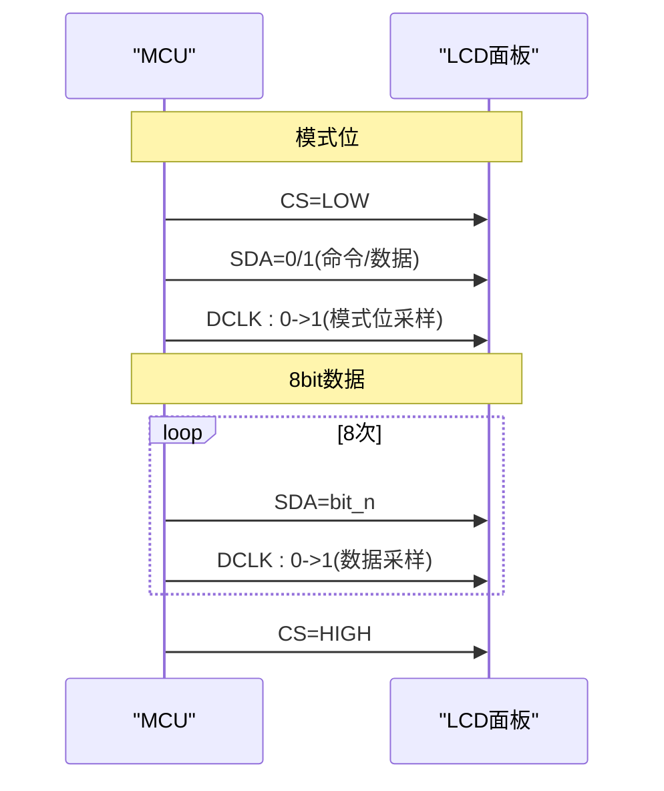

# LCD硬件接口配置

<cite>
**本文引用的文件**   
- [LCD.c](file://ESP32开发板/TK021F2699_ESP32_LVGL_GIF_LED/TK021F2699_ESP32_LVGL_GIF_LED/main/LCD.c)
- [LCD.h](file://ESP32开发板/TK021F2699_ESP32_LVGL_GIF_LED/TK021F2699_ESP32_LVGL_GIF_LED/main/LCD.h)
- [rgb_lcd_example_main.c](file://ESP32开发板/TK021F2699_ESP32_LVGL_GIF_LED/TK021F2699_ESP32_LVGL_GIF_LED/main/rgb_lcd_example_main.c)
</cite>

## 目录
1. [简介](#简介)
2. [项目结构](#项目结构)
3. [核心组件](#核心组件)
4. [架构总览](#架构总览)
5. [详细组件分析](#详细组件分析)
6. [依赖关系分析](#依赖关系分析)
7. [性能与时序特性](#性能与时序特性)
8. [故障诊断指南](#故障诊断指南)
9. [结论](#结论)
10. [附录：引脚映射与兼容性调整](#附录引脚映射与兼容性调整)

## 简介
本技术文档围绕ESP32平台上的LCD硬件接口配置，聚焦于GPIO引脚配置、SPI通信协议实现与时序控制机制。重点解析以下函数与宏：
- configure_LCD_GPIO()：GPIO初始化与背光控制引脚配置
- SPI_WriteByteSPI()/LCD_WriteByteSPI()：底层字节发送
- SPI_WriteComm()/SPI_WriteData()：命令/数据帧封装
- Lcd_Initialize()/lcd_panel_init()：面板初始化流程与寄存器序列

同时提供引脚映射表、信号时序图、电气特性说明、常见问题诊断方法，以及不同LCD面板的兼容性与参数调整建议。

## 项目结构
本项目包含两个主要部分：
- 基于软件模拟SPI的LCD驱动（main/LCD.c, main/LCD.h）
- ESP-IDF官方RGB LCD示例（main/rgb_lcd_example_main.c），用于对比参考时序与系统级集成方式

图表来源
- [rgb_lcd_example_main.c:150-182](file://ESP32开发板/TK021F2699_ESP32_LVGL_GIF_LED/TK021F2699_ESP32_LVGL_GIF_LED/main/rgb_lcd_example_main.c#L150-L182)
- [LCD.h:11-26](file://ESP32开发板/TK021F2699_ESP32_LVGL_GIF_LED/TK021F2699_ESP32_LVGL_GIF_LED/main/LCD.h#L11-L26)
- [LCD.c:17-40](file://ESP32开发板/TK021F2699_ESP32_LVGL_GIF_LED/TK021F2699_ESP32_LVGL_GIF_LED/main/LCD.c#L17-L40)

章节来源
- [rgb_lcd_example_main.c:150-182](file://ESP32开发板/TK021F2699_ESP32_LVGL_GIF_LED/TK021F2699_ESP32_LVGL_GIF_LED/main/rgb_lcd_example_main.c#L150-L182)
- [LCD.h:11-26](file://ESP32开发板/TK021F2699_ESP32_LVGL_GIF_LED/TK021F2699_ESP32_LVGL_GIF_LED/main/LCD.h#L11-L26)
- [LCD.c:17-40](file://ESP32开发板/TK021F2699_ESP32_LVGL_GIF_LED/TK021F2699_ESP32_LVGL_GIF_LED/main/LCD.c#L17-L40)

## 核心组件
- GPIO配置与背光控制
  - configure_LCD_GPIO()负责将CS、SCK、SDA等引脚设置为推挽输出，并设置初始电平；代码中预留了RESET相关逻辑（注释状态）。
- 软件模拟SPI
  - LCD_WriteByteSPI()按高位优先逐位拉高/拉低SDA，并在DCLK上升沿采样；配合CS片选完成一次字节传输。
  - SPI_WriteComm()与SPI_WriteData()在字节前插入一个“模式位”（0为命令，1为数据），形成9bit串行帧。
- 面板初始化
  - lcd_panel_init()遍历寄存器表，遇到延时标记则调用软件延时，否则通过SPI_WriteComm/SPI_WriteData写入命令与参数。
  - Lcd_Initialize()完成GPIO初始化、CS拉低/拉高复位、调用lcd_panel_init()。

章节来源
- [LCD.c:17-40](file://ESP32开发板/TK021F2699_ESP32_LVGL_GIF_LED/TK021F2699_ESP32_LVGL_GIF_LED/main/LCD.c#L17-L40)
- [LCD.c:51-83](file://ESP32开发板/TK021F2699_ESP32_LVGL_GIF_LED/TK021F2699_ESP32_LVGL_GIF_LED/main/LCD.c#L51-L83)
- [LCD.c:186-204](file://ESP32开发板/TK021F2699_ESP32_LVGL_GIF_LED/TK021F2699_ESP32_LVGL_GIF_LED/main/LCD.c#L186-L204)
- [LCD.c:205-219](file://ESP32开发板/TK021F2699_ESP32_LVGL_GIF_LED/TK021F2699_ESP32_LVGL_GIF_LED/main/LCD.c#L205-L219)
- [LCD.h:11-26](file://ESP32开发板/TK021F2699_ESP32_LVGL_GIF_LED/TK021F2699_ESP32_LVGL_GIF_LED/main/LCD.h#L11-L26)

## 架构总览
下图展示了从应用入口到LCD驱动的调用链，以及软件SPI的时序关键点。

图表来源
- [rgb_lcd_example_main.c:180-182](file://ESP32开发板/TK021F2699_ESP32_LVGL_GIF_LED/TK021F2699_ESP32_LVGL_GIF_LED/main/rgb_lcd_example_main.c#L180-L182)
- [LCD.c:205-219](file://ESP32开发板/TK021F2699_ESP32_LVGL_GIF_LED/TK021F2699_ESP32_LVGL_GIF_LED/main/LCD.c#L205-L219)
- [LCD.c:186-204](file://ESP32开发板/TK021F2699_ESP32_LVGL_GIF_LED/TK021F2699_ESP32_LVGL_GIF_LED/main/LCD.c#L186-L204)
- [LCD.c:66-83](file://ESP32开发板/TK021F2699_ESP32_LVGL_GIF_LED/TK021F2699_ESP32_LVGL_GIF_LED/main/LCD.c#L66-L83)
- [LCD.c:51-64](file://ESP32开发板/TK021F2699_ESP32_LVGL_GIF_LED/TK021F2699_ESP32_LVGL_GIF_LED/main/LCD.c#L51-L64)
- [LCD.h:11-26](file://ESP32开发板/TK021F2699_ESP32_LVGL_GIF_LED/TK021F2699_ESP32_LVGL_GIF_LED/main/LCD.h#L11-L26)

## 详细组件分析

### GPIO配置与背光控制
- configure_LCD_GPIO()
  - 使用ESP-IDF gpio_config_t将CS(SPI片选)、SCK(SPI时钟)、SDA(SPI数据)配置为输出模式，并置初值。
  - 代码中预留了RESET引脚（注释状态），可按需启用硬件复位时序。
  - 注意：当前实现未显式配置CS引脚为输出，但通过宏直接写电平，实际运行依赖该引脚可被gpio_set_level访问。若出现异常，建议在gpio_config中加入CS引脚。

章节来源
- [LCD.c:17-40](file://ESP32开发板/TK021F2699_ESP32_LVGL_GIF_LED/TK021F2699_ESP32_LVGL_GIF_LED/main/LCD.c#L17-L40)
- [LCD.h:11-26](file://ESP32开发板/TK021F2699_ESP32_LVGL_GIF_LED/TK021F2699_ESP32_LVGL_GIF_LED/main/LCD.h#L11-L26)

### 软件SPI位操作与时序
- LCD_WriteByteSPI()
  - 高位优先，循环8次：根据最高位设置SDA，随后产生DCLK的下降沿与上升沿，确保数据在上升沿被采样。
- SPI_WriteComm()/SPI_WriteData()
  - 先拉低CS，再设置SDA为0（命令）或1（数据），然后产生一个DCLK脉冲作为“模式位”，随后发送8bit数据，最后拉高CS结束帧。
  - 整体为9bit串行帧：1bit模式位 + 8bit数据。

图表来源
- [LCD.c:66-83](file://ESP32开发板/TK021F2699_ESP32_LVGL_GIF_LED/TK021F2699_ESP32_LVGL_GIF_LED/main/LCD.c#L66-L83)
- [LCD.c:51-64](file://ESP32开发板/TK021F2699_ESP32_LVGL_GIF_LED/TK021F2699_ESP32_LVGL_GIF_LED/main/LCD.c#L51-L64)

章节来源
- [LCD.c:51-83](file://ESP32开发板/TK021F2699_ESP32_LVGL_GIF_LED/TK021F2699_ESP32_LVGL_GIF_LED/main/LCD.c#L51-L83)

### 面板初始化流程
- lcd_panel_init()
  - 遍历lcm_initialization_setting数组，遇到延时标记执行软件延时，否则依次发送命令与参数。
- Lcd_Initialize()
  - 调用configure_LCD_GPIO()，进行CS拉低/拉高复位，然后调用lcd_panel_init()完成面板初始化。

图表来源
- [LCD.c:205-219](file://ESP32开发板/TK021F2699_ESP32_LVGL_GIF_LED/TK021F2699_ESP32_LVGL_GIF_LED/main/LCD.c#L205-L219)
- [LCD.c:186-204](file://ESP32开发板/TK021F2699_ESP32_LVGL_GIF_LED/TK021F2699_ESP32_LVGL_GIF_LED/main/LCD.c#L186-L204)

章节来源
- [LCD.c:186-219](file://ESP32开发板/TK021F2699_ESP32_LVGL_GIF_LED/TK021F2699_ESP32_LVGL_GIF_LED/main/LCD.c#L186-L219)

## 依赖关系分析
- 模块耦合
  - rgb_lcd_example_main.c调用Lcd_Initialize()，间接依赖LCD.c与LCD.h。
  - LCD.c依赖ESP-IDF的driver/gpio与esp_log/esp_err等基础库。
- 外部依赖
  - ESP-IDF GPIO驱动与日志/错误处理API。
  - LVGL与RGB面板驱动在示例主程序中集成，但与软件SPI路径解耦。

图表来源
- [rgb_lcd_example_main.c:180-182](file://ESP32开发板/TK021F2699_ESP32_LVGL_GIF_LED/TK021F2699_ESP32_LVGL_GIF_LED/main/rgb_lcd_example_main.c#L180-L182)
- [LCD.c:1-6](file://ESP32开发板/TK021F2699_ESP32_LVGL_GIF_LED/TK021F2699_ESP32_LVGL_GIF_LED/main/LCD.c#L1-L6)
- [LCD.h:1-6](file://ESP32开发板/TK021F2699_ESP32_LVGL_GIF_LED/TK021F2699_ESP32_LVGL_GIF_LED/main/LCD.h#L1-L6)

章节来源
- [rgb_lcd_example_main.c:180-182](file://ESP32开发板/TK021F2699_ESP32_LVGL_GIF_LED/TK021F2699_ESP32_LVGL_GIF_LED/main/rgb_lcd_example_main.c#L180-L182)
- [LCD.c:1-6](file://ESP32开发板/TK021F2699_ESP32_LVGL_GIF_LED/TK021F2699_ESP32_LVGL_GIF_LED/main/LCD.c#L1-L6)
- [LCD.h:1-6](file://ESP32开发板/TK021F2699_ESP32_LVGL_GIF_LED/TK021F2699_ESP32_LVGL_GIF_LED/main/LCD.h#L1-L6)

## 性能与时序特性
- 软件SPI速率
  - 由CPU循环与gpio_set_level开销决定，典型频率在数百kHz至数MHz范围，取决于系统负载与中断情况。
- 关键时序点
  - 模式位：在第一个DCLK上升沿之前设置SDA为0/1，表示命令/数据。
  - 数据位：每个bit在DCLK上升沿采样，SDA需在DCLK变高前稳定。
  - 片选：每帧开始前拉低CS，结束后拉高CS。
- 电气特性（通用）
  - I/O电平：通常为1.8V或3.3V，需与ESP32引脚兼容。
  - 输入阻抗与噪声容限：短走线、避免长飞线，必要时加小电容滤波。
  - 背光灯：注意电流限制与驱动能力，必要时使用MOS管或恒流驱动。

[本节为通用指导，不直接分析具体文件]

## 故障诊断指南
- 无显示或花屏
  - 检查CS/SCK/SDA引脚连接是否正确，确认宏定义与实际硬件一致。
  - 确认初始化序列是否完整，尤其是延时项与幂序。
  - 使用示波器观察模式位与数据位的时序，确保SDA在DCLK上升沿前稳定。
- 背光不亮
  - 检查背光引脚配置与极性（高/低有效），确认供电与限流电阻。
- 初始化失败
  - 尝试启用硬件复位（取消RESET相关注释），并确保复位时序满足面板要求。
  - 降低SPI速率（增加软件延时）以验证是否为时序问题。
- 与RGB面板示例冲突
  - 确保仅使用一种驱动路径（软件SPI或RGB并行），避免引脚复用冲突。

章节来源
- [LCD.c:17-40](file://ESP32开发板/TK021F2699_ESP32_LVGL_GIF_LED/TK021F2699_ESP32_LVGL_GIF_LED/main/LCD.c#L17-L40)
- [LCD.c:205-219](file://ESP32开发板/TK021F2699_ESP32_LVGL_GIF_LED/TK021F2699_ESP32_LVGL_GIF_LED/main/LCD.c#L205-L219)
- [rgb_lcd_example_main.c:168-175](file://ESP32开发板/TK021F2699_ESP32_LVGL_GIF_LED/TK021F2699_ESP32_LVGL_GIF_LED/main/rgb_lcd_example_main.c#L168-L175)

## 结论
本项目实现了基于ESP32的软件SPI LCD驱动，涵盖GPIO配置、9bit串行帧封装与面板初始化流程。通过清晰的函数分层与寄存器表驱动，便于适配不同面板。结合RGB面板示例，可在同一工程中灵活选择并行或串行方案。建议在实际项目中完善CS引脚的gpio_config、优化软件SPI速率，并根据面板手册调整初始化序列与时序参数。

[本节为总结性内容，不直接分析具体文件]

## 附录：引脚映射与兼容性调整

### 引脚映射表（软件SPI路径）
- CS（片选）：GPIO 1
- SCK（时钟）：GPIO 13
- SDA（数据）：GPIO 20
- RESET（可选）：GPIO 46（当前代码注释状态）

章节来源
- [LCD.h:11-26](file://ESP32开发板/TK021F2699_ESP32_LVGL_GIF_LED/TK021F2699_ESP32_LVGL_GIF_LED/main/LCD.h#L11-L26)
- [LCD.c:17-40](file://ESP32开发板/TK021F2699_ESP32_LVGL_GIF_LED/TK021F2699_ESP32_LVGL_GIF_LED/main/LCD.c#L17-L40)

### 信号时序图（软件SPI）

图表来源
- [LCD.c:66-83](file://ESP32开发板/TK021F2699_ESP32_LVGL_GIF_LED/TK021F2699_ESP32_LVGL_GIF_LED/main/LCD.c#L66-L83)
- [LCD.c:51-64](file://ESP32开发板/TK021F2699_ESP32_LVGL_GIF_LED/TK021F2699_ESP32_LVGL_GIF_LED/main/LCD.c#L51-L64)

### 电气特性说明（通用）
- I/O电平：1.8V/3.3V兼容，需与ESP32引脚匹配
- 输入噪声容限：建议短走线、就近接地，必要时加去耦电容
- 背光灯：注意最大电流与驱动能力，必要时使用外部驱动电路

[本节为通用指导，不直接分析具体文件]

### 不同LCD面板的兼容性与参数调整技巧
- 初始化序列差异
  - 通过修改lcm_initialization_setting数组中的命令与参数列表，适配不同面板。
  - 注意REGFLAG_DELAY与REGFLAG_END_OF_TABLE的使用，保证必要的上电延时与序列终止。
- 时序与速率
  - 若出现不稳定，可增加软件延时或降低SPI速率；反之可缩短延时提升吞吐。
- 复位策略
  - 对于需要硬件复位的屏幕，启用RESET相关逻辑，确保复位时序符合面板规格。
- 背光控制
  - 根据背光极性配置GPIO输出电平，必要时加入PWM调光。

章节来源
- [LCD.c:86-160](file://ESP32开发板/TK021F2699_ESP32_LVGL_GIF_LED/TK021F2699_ESP32_LVGL_GIF_LED/main/LCD.c#L86-L160)
- [LCD.c:186-204](file://ESP32开发板/TK021F2699_ESP32_LVGL_GIF_LED/TK021F2699_ESP32_LVGL_GIF_LED/main/LCD.c#L186-L204)
- [LCD.c:17-40](file://ESP32开发板/TK021F2699_ESP32_LVGL_GIF_LED/TK021F2699_ESP32_LVGL_GIF_LED/main/LCD.c#L17-L40)