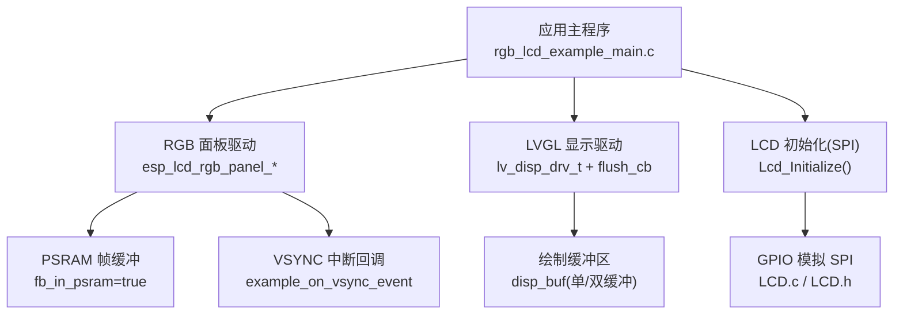
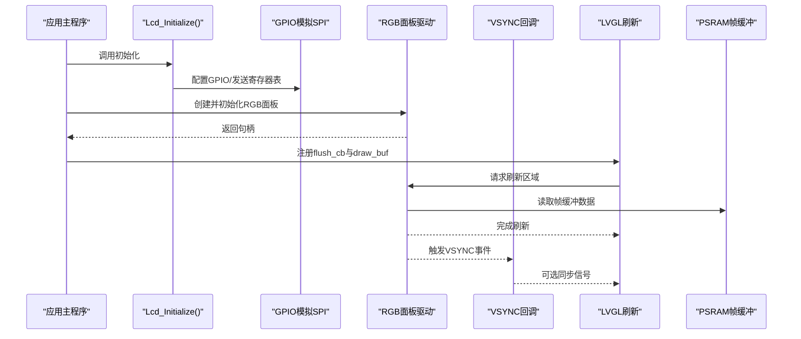
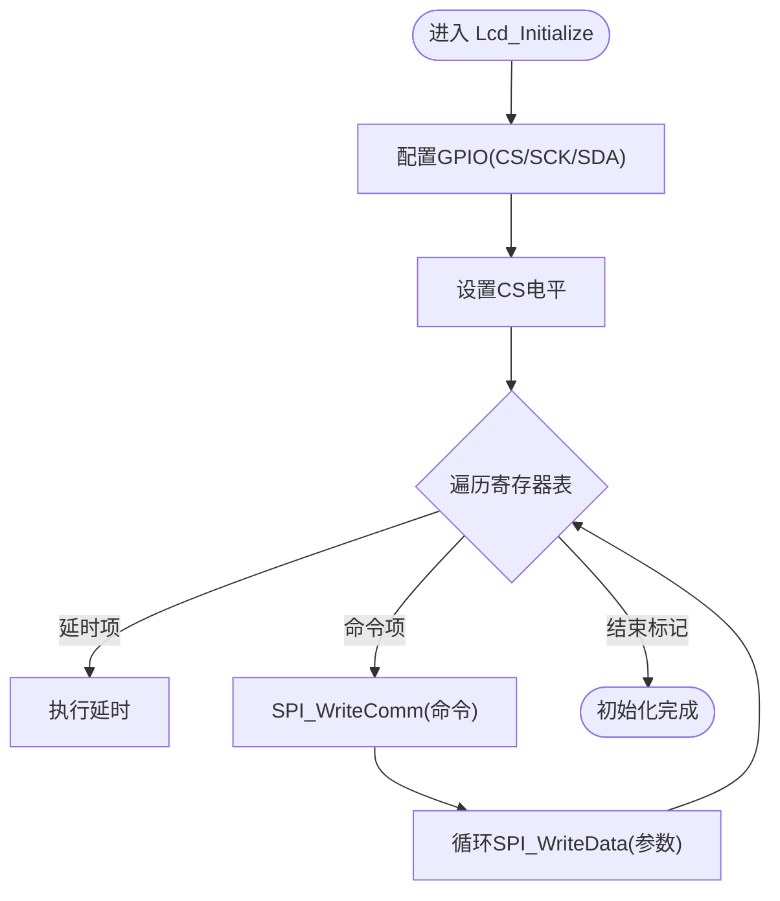
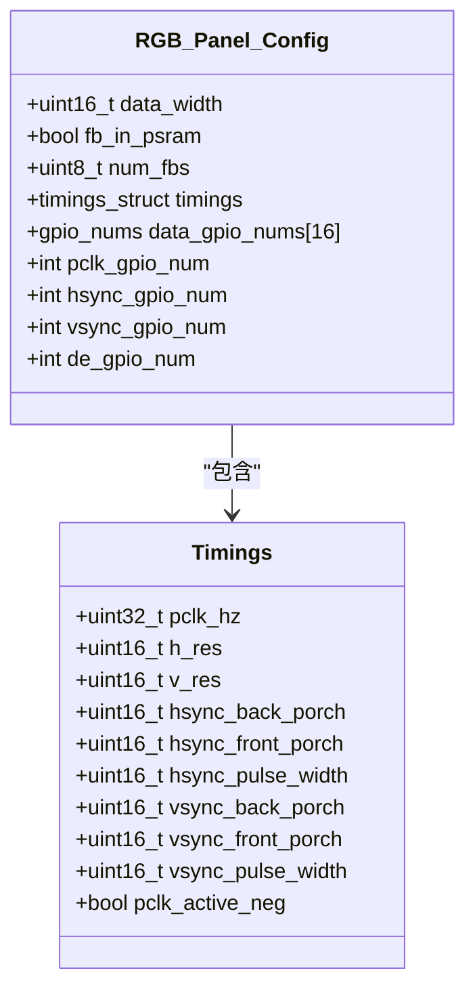
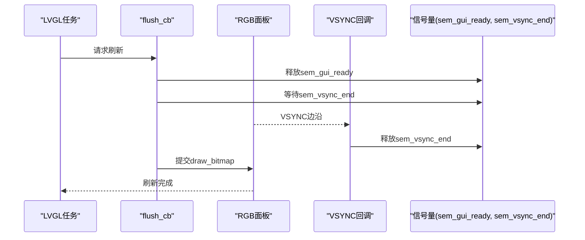
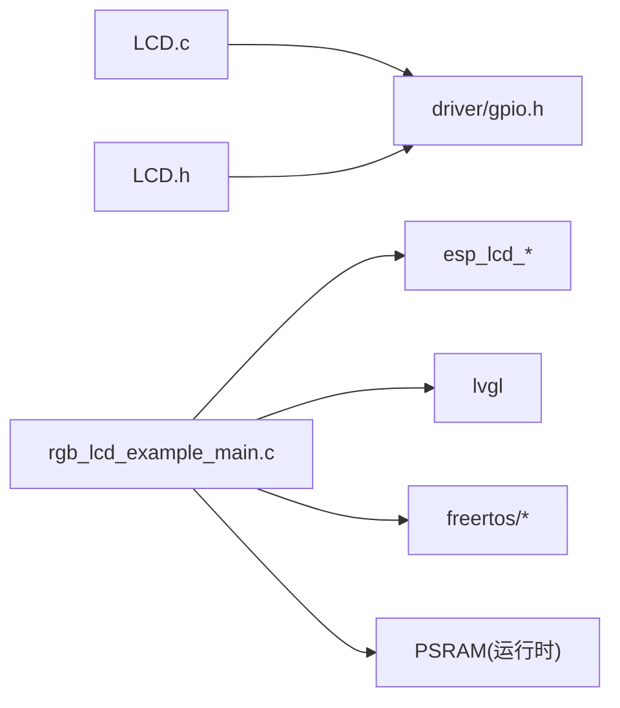

# LCD驱动模块

<cite>
**本文引用的文件**   
- [LCD.c](file://ESP32开发板/TK021F2699_ESP32_LVGL_GIF_LED/TK021F2699_ESP32_LVGL_GIF_LED/main/LCD.c)
- [LCD.h](file://ESP32开发板/TK021F2699_ESP32_LVGL_GIF_LED/TK021F2699_ESP32_LVGL_GIF_LED/main/LCD.h)
- [rgb_lcd_example_main.c](file://ESP32开发板/TK021F2699_ESP32_LVGL_GIF_LED/TK021F2699_ESP32_LVGL_GIF_LED/main/rgb_lcd_example_main.c)
</cite>

## 目录
1. [简介](#简介)
2. [项目结构](#项目结构)
3. [核心组件](#核心组件)
4. [架构总览](#架构总览)
5. [详细组件分析](#详细组件分析)
6. [依赖关系分析](#依赖关系分析)
7. [性能与优化](#性能与优化)
8. [故障诊断与排错](#故障诊断与排错)
9. [结论](#结论)
10. [附录：自定义面板适配指南](#附录自定义面板适配指南)

## 简介
本技术文档围绕 ESP32-S3 平台上的 RGB LCD 驱动模块，系统阐述以下主题：
- RGB LCD 时序原理与时序参数配置
- 帧缓冲管理机制（单缓冲、双缓冲）与刷新策略
- Lcd_Initialize() 初始化流程（GPIO、SPI 寄存器配置、复位等）
- 同步信号处理与撕裂效应规避
- PSRAM 帧缓冲的配置与性能调优
- 背光控制、时钟源选择与关键信号处理
- 针对自定义 LCD 面板的完整适配步骤

## 项目结构
本项目包含两个层次的 LCD 相关实现：
- SPI 串行接口初始化层：通过 GPIO 模拟 SPI，向 LCD 控制器写入初始化序列，完成面板内部寄存器配置。
- RGB 并行显示层：基于 ESP-IDF 的 esp_lcd 驱动，配置 RGB 时序、帧缓冲、事件回调，并与 LVGL 集成进行画面刷新。

图表来源
- [rgb_lcd_example_main.c:150-303](file://ESP32开发板/TK021F2699_ESP32_LVGL_GIF_LED/TK021F2699_ESP32_LVGL_GIF_LED/main/rgb_lcd_example_main.c#L150-L303)
- [LCD.c:204-219](file://ESP32开发板/TK021F2699_ESP32_LVGL_GIF_LED/TK021F2699_ESP32_LVGL_GIF_LED/main/LCD.c#L204-L219)
- [LCD.h:12-26](file://ESP32开发板/TK021F2699_ESP32_LVGL_GIF_LED/TK021F2699_ESP32_LVGL_GIF_LED/main/LCD.h#L12-L26)

章节来源
- [rgb_lcd_example_main.c:150-303](file://ESP32开发板/TK021F2699_ESP32_LVGL_GIF_LED/TK021F2699_ESP32_LVGL_GIF_LED/main/rgb_lcd_example_main.c#L150-L303)
- [LCD.c:1-219](file://ESP32开发板/TK021F2699_ESP32_LVGL_GIF_LED/TK021F2699_ESP32_LVGL_GIF_LED/main/LCD.c#L1-L219)
- [LCD.h:1-30](file://ESP32开发板/TK021F2699_ESP32_LVGL_GIF_LED/TK021F2699_ESP32_LVGL_GIF_LED/main/LCD.h#L1-L30)

## 核心组件
- SPI 初始化层（LCD.c / LCD.h）
  - 负责 GPIO 配置、软件 SPI 位操作、LCD 控制器寄存器表遍历与下发。
  - 提供 Lcd_Initialize() 作为统一入口。
- RGB 显示层（rgb_lcd_example_main.c）
  - 使用 esp_lcd 库创建 RGB 面板实例，配置像素时钟、水平/垂直时序、数据位宽、帧缓冲位置（PSRAM）、VSYNC 回调等。
  - 将 LVGL 的 flush 回调与 esp_lcd 的 draw_bitmap 对接，实现高效刷屏。
- LVGL 集成
  - 管理绘制缓冲区（单/双缓冲），提供定时器 tick、任务调度与互斥锁保护。

章节来源
- [LCD.c:17-219](file://ESP32开发板/TK021F2699_ESP32_LVGL_GIF_LED/TK021F2699_ESP32_LVGL_GIF_LED/main/LCD.c#L17-L219)
- [LCD.h:12-26](file://ESP32开发板/TK021F2699_ESP32_LVGL_GIF_LED/TK021F2699_ESP32_LVGL_GIF_LED/main/LCD.h#L12-L26)
- [rgb_lcd_example_main.c:150-303](file://ESP32开发板/TK021F2699_ESP32_LVGL_GIF_LED/TK021F2699_ESP32_LVGL_GIF_LED/main/rgb_lcd_example_main.c#L150-L303)

## 架构总览
下图展示了从应用到硬件的调用链路与数据流：

图表来源
- [rgb_lcd_example_main.c:150-303](file://ESP32开发板/TK021F2699_ESP32_LVGL_GIF_LED/TK021F2699_ESP32_LVGL_GIF_LED/main/rgb_lcd_example_main.c#L150-L303)
- [LCD.c:204-219](file://ESP32开发板/TK021F2699_ESP32_LVGL_GIF_LED/TK021F2699_ESP32_LVGL_GIF_LED/main/LCD.c#L204-L219)

## 详细组件分析

### Lcd_Initialize() 初始化流程
该函数是 SPI 初始化层的统一入口，主要职责包括：
- 配置 LCD 专用 GPIO（CS、SCK、SDA 等）
- 拉高/拉低 CS 以完成上电稳定或复位准备
- 遍历寄存器表，按命令+参数顺序通过 SPI 写入 LCD 控制器
- 支持延时条目与结束标记，便于维护不同面板的初始化序列

图表来源
- [LCD.c:204-219](file://ESP32开发板/TK021F2699_ESP32_LVGL_GIF_LED/TK021F2699_ESP32_LVGL_GIF_LED/main/LCD.c#L204-L219)
- [LCD.c:17-40](file://ESP32开发板/TK021F2699_ESP32_LVGL_GIF_LED/TK021F2699_ESP32_LVGL_GIF_LED/main/LCD.c#L17-L40)
- [LCD.c:51-83](file://ESP32开发板/TK021F2699_ESP32_LVGL_GIF_LED/TK021F2699_ESP32_LVGL_GIF_LED/main/LCD.c#L51-L83)
- [LCD.c:86-160](file://ESP32开发板/TK021F2699_ESP32_LVGL_GIF_LED/TK021F2699_ESP32_LVGL_GIF_LED/main/LCD.c#L86-L160)
- [LCD.h:12-26](file://ESP32开发板/TK021F2699_ESP32_LVGL_GIF_LED/TK021F2699_ESP32_LVGL_GIF_LED/main/LCD.h#L12-L26)

章节来源
- [LCD.c:17-219](file://ESP32开发板/TK021F2699_ESP32_LVGL_GIF_LED/TK021F2699_ESP32_LVGL_GIF_LED/main/LCD.c#L17-L219)
- [LCD.h:12-26](file://ESP32开发板/TK021F2699_ESP32_LVGL_GIF_LED/TK021F2699_ESP32_LVGL_GIF_LED/main/LCD.h#L12-L26)

### RGB 时序与帧缓冲机制
- 像素时钟与时序
  - 像素时钟频率 pclk_hz 决定每秒钟传输的像素数，需根据面板规格设定。
  - 水平/垂直时序参数包括前肩、后肩与脉冲宽度，确保面板正确采样每个像素行与帧。
- 数据位宽与颜色格式
  - data_width=16 表示 RGB565 并行模式，16 根数据线对应 R/G/B 通道位分配。
- 帧缓冲位置
  - fb_in_psram=true 将帧缓冲分配在 PSRAM，避免占用片内 RAM，适合高分辨率或大尺寸屏。
- 双缓冲与单缓冲
  - 双缓冲：num_fbs=2，配合 disp_drv.full_refresh=true，可保证两帧同步更新，降低撕裂风险。
  - 单缓冲：num_fbs=1，内存占用更低，但需要额外同步手段避免撕裂。

图表来源
- [rgb_lcd_example_main.c:181-228](file://ESP32开发板/TK021F2699_ESP32_LVGL_GIF_LED/TK021F2699_ESP32_LVGL_GIF_LED/main/rgb_lcd_example_main.c#L181-L228)

章节来源
- [rgb_lcd_example_main.c:181-228](file://ESP32开发板/TK021F2699_ESP32_LVGL_GIF_LED/TK021F2699_ESP32_LVGL_GIF_LED/main/rgb_lcd_example_main.c#L181-L228)

### 刷新优化与撕裂效应规避
- 刷新路径
  - LVGL flush_cb 中调用 esp_lcd_panel_draw_bitmap 将绘制缓冲区内容推送到面板。
- 同步策略
  - 通过 VSYNC 回调与互斥量/信号量协调 GUI 线程与面板刷新，避免在帧中间更新导致撕裂。
  - 示例中使用 sem_gui_ready 与 sem_vsync_end 进行握手：GUI 准备好后释放 sem_gui_ready，VSYNC 回调收到后释放 sem_vsync_end，flush_cb 等待后者后再提交刷新。
- 全刷新模式
  - 双缓冲时启用 full_refresh=true，有助于保持两帧一致性，减少部分刷新带来的同步复杂度。

图表来源
- [rgb_lcd_example_main.c:84-109](file://ESP32开发板/TK021F2699_ESP32_LVGL_GIF_LED/TK021F2699_ESP32_LVGL_GIF_LED/main/rgb_lcd_example_main.c#L84-L109)
- [rgb_lcd_example_main.c:160-166](file://ESP32开发板/TK021F2699_ESP32_LVGL_GIF_LED/TK021F2699_ESP32_LVGL_GIF_LED/main/rgb_lcd_example_main.c#L160-L166)

章节来源
- [rgb_lcd_example_main.c:84-109](file://ESP32开发板/TK021F2699_ESP32_LVGL_GIF_LED/TK021F2699_ESP32_LVGL_GIF_LED/main/rgb_lcd_example_main.c#L84-L109)
- [rgb_lcd_example_main.c:160-166](file://ESP32开发板/TK021F2699_ESP32_LVGL_GIF_LED/TK021F2699_ESP32_LVGL_GIF_LED/main/rgb_lcd_example_main.c#L160-L166)

### 背光控制与同步信号处理
- 背光控制
  - 若配置了背光灯引脚（EXAMPLE_PIN_NUM_BK_LIGHT >= 0），则在面板初始化前后分别关闭/开启背光，避免上电闪烁。
- 同步信号
  - VSYNC 回调用于与 GUI 线程同步，防止撕裂；DE 信号可用于限定有效像素窗口（由面板驱动内部处理）。
- 时钟配置
  - clk_src 指定像素时钟源（如 PLL240M），pclk_hz 决定实际像素速率，需结合面板时序计算合理值。

章节来源
- [rgb_lcd_example_main.c:168-175](file://ESP32开发板/TK021F2699_ESP32_LVGL_GIF_LED/TK021F2699_ESP32_LVGL_GIF_LED/main/rgb_lcd_example_main.c#L168-L175)
- [rgb_lcd_example_main.c:241-244](file://ESP32开发板/TK021F2699_ESP32_LVGL_GIF_LED/TK021F2699_ESP32_LVGL_GIF_LED/main/rgb_lcd_example_main.c#L241-L244)
- [rgb_lcd_example_main.c:181-228](file://ESP32开发板/TK021F2699_ESP32_LVGL_GIF_LED/TK021F2699_ESP32_LVGL_GIF_LED/main/rgb_lcd_example_main.c#L181-L228)

### DMA 传输说明
- 当前代码未显式配置 DMA 传输；esp_lcd 底层可能使用 DMA 进行数据搬运，但上层 API 未暴露 DMA 配置项。
- 如需进一步优化吞吐，建议关注 esp-idf 版本与具体 SoC 的 DMA 能力，并在必要时调整 psram_trans_align 与 bounce_buffer_size_px（当启用回冲缓冲时）。

章节来源
- [rgb_lcd_example_main.c:181-228](file://ESP32开发板/TK021F2699_ESP32_LVGL_GIF_LED/TK021F2699_ESP32_LVGL_GIF_LED/main/rgb_lcd_example_main.c#L181-L228)

## 依赖关系分析
- 初始化层依赖
  - LCD.c 依赖 GPIO 驱动与 SDK 配置，通过宏定义映射 CS/SCK/SDA 到具体引脚。
- 显示层依赖
  - rgb_lcd_example_main.c 依赖 esp_lcd 库、LVGL 库与 FreeRTOS 任务/信号量。
- 外部资源
  - PSRAM 用于帧缓冲；可选 WS2812 灯带与 Wi-Fi 功能与本 LCD 模块无直接耦合。

图表来源
- [LCD.c:1-6](file://ESP32开发板/TK021F2699_ESP32_LVGL_GIF_LED/TK021F2699_ESP32_LVGL_GIF_LED/main/LCD.c#L1-L6)
- [LCD.h:1-5](file://ESP32开发板/TK021F2699_ESP32_LVGL_GIF_LED/TK021F2699_ESP32_LVGL_GIF_LED/main/LCD.h#L1-L5)
- [rgb_lcd_example_main.c:7-22](file://ESP32开发板/TK021F2699_ESP32_LVGL_GIF_LED/TK021F2699_ESP32_LVGL_GIF_LED/main/rgb_lcd_example_main.c#L7-L22)

章节来源
- [LCD.c:1-6](file://ESP32开发板/TK021F2699_ESP32_LVGL_GIF_LED/TK021F2699_ESP32_LVGL_GIF_LED/main/LCD.c#L1-L6)
- [LCD.h:1-5](file://ESP32开发板/TK021F2699_ESP32_LVGL_GIF_LED/TK021F2699_ESP32_LVGL_GIF_LED/main/LCD.h#L1-L5)
- [rgb_lcd_example_main.c:7-22](file://ESP32开发板/TK021F2699_ESP32_LVGL_GIF_LED/TK021F2699_ESP32_LVGL_GIF_LED/main/rgb_lcd_example_main.c#L7-L22)

## 性能与优化
- 帧缓冲位置
  - 将帧缓冲置于 PSRAM（fb_in_psram=true）可降低片内 RAM 压力，适合高分辨率屏。
- 双缓冲 vs 单缓冲
  - 双缓冲可减少撕裂，但内存占用翻倍；单缓冲节省内存，需配合 VSYNC 同步。
- 像素时钟与时序
  - 提高 pclk_hz 可增加带宽，但需确保面板与时序参数匹配，否则出现滚动、错位或黑屏。
- 回冲缓冲（bounce buffer）
  - 当启用 CONFIG_EXAMPLE_USE_BOUNCE_BUFFER 时，可适当增大 bounce_buffer_size_px 以提升吞吐，但会占用更多内存。
- PSRAM 对齐与传输
  - psram_trans_align 影响 DMA 传输效率，通常设置为 64 字节对齐以获得更好性能。

章节来源
- [rgb_lcd_example_main.c:181-228](file://ESP32开发板/TK021F2699_ESP32_LVGL_GIF_LED/TK021F2699_ESP32_LVGL_GIF_LED/main/rgb_lcd_example_main.c#L181-L228)
- [rgb_lcd_example_main.c:250-261](file://ESP32开发板/TK021F2699_ESP32_LVGL_GIF_LED/TK021F2699_ESP32_LVGL_GIF_LED/main/rgb_lcd_example_main.c#L250-L261)

## 故障诊断与排错
- 屏幕漂移/滚动
  - 检查水平/垂直时序参数（hsync/vsync back/front porch 与 pulse width）是否与面板规格一致。
  - 确认 pclk_hz 与 panel 的推荐像素时钟范围匹配。
- 撕裂效应
  - 启用 VSYNC 同步与信号量握手，或在双缓冲模式下使用 full_refresh=true。
- 花屏/错位
  - 校验 data_gpio_nums 的引脚映射是否正确，尤其是 R/G/B 位序与数据位宽。
  - 检查 DE 与 PCLK 极性配置（flags.pclk_active_neg）。
- 无法点亮/黑屏
  - 确认 Lcd_Initialize() 已调用且寄存器表正确；必要时增加延时或复位序列。
  - 检查背光引脚配置与电平逻辑（ON/OFF 电平）。
- 卡顿/掉帧
  - 评估 PSRAM 带宽与 psram_trans_align；适当调整 bounce_buffer_size_px。
  - 降低 LVGL 刷新频率或减少复杂动画。

章节来源
- [rgb_lcd_example_main.c:212-228](file://ESP32开发板/TK021F2699_ESP32_LVGL_GIF_LED/TK021F2699_ESP32_LVGL_GIF_LED/main/rgb_lcd_example_main.c#L212-L228)
- [rgb_lcd_example_main.c:84-109](file://ESP32开发板/TK021F2699_ESP32_LVGL_GIF_LED/TK021F2699_ESP32_LVGL_GIF_LED/main/rgb_lcd_example_main.c#L84-L109)
- [rgb_lcd_example_main.c:168-175](file://ESP32开发板/TK021F2699_ESP32_LVGL_GIF_LED/TK021F2699_ESP32_LVGL_GIF_LED/main/rgb_lcd_example_main.c#L168-L175)
- [LCD.c:204-219](file://ESP32开发板/TK021F2699_ESP32_LVGL_GIF_LED/TK021F2699_ESP32_LVGL_GIF_LED/main/LCD.c#L204-L219)

## 结论
本项目实现了基于 ESP32-S3 的 RGB LCD 驱动与 LVGL 集成的完整链路。通过 SPI 初始化层完成面板寄存器配置，再通过 esp_lcd 驱动进行高速并行数据传输。双缓冲与 VSYNC 同步可有效缓解撕裂问题；将帧缓冲置于 PSRAM 能显著降低片内 RAM 压力。对于不同面板，只需调整时序参数与初始化序列即可快速适配。

## 附录：自定义面板适配指南
- 确定面板规格
  - 分辨率（H/V）、颜色格式（RGB565）、像素时钟范围、时序参数（前/后肩、脉宽）、DE/PCLK 极性。
- 配置 RGB 面板参数
  - 修改 EXAMPLE_LCD_PIXEL_CLOCK_HZ、EXAMPLE_LCD_H_RES、EXAMPLE_LCD_V_RES。
  - 设置 hsync/vsync 各段时序与 pclk_active_neg。
  - 配置 data_gpio_nums 与 pclk/h sync/de 引脚。
- 编写 SPI 初始化序列
  - 在 LCD.c 的 lcm_initialization_setting 表中添加/调整命令与参数，必要时插入延时。
  - 若面板需要复位，可在 Lcd_Initialize() 中添加硬件复位逻辑。
- 选择帧缓冲模式
  - 内存紧张时使用单缓冲，配合 VSYNC 同步；追求稳定性时使用双缓冲并启用 full_refresh。
- 验证与调试
  - 先以较低 pclk_hz 启动，逐步提升观察是否出现滚动/错位。
  - 使用示波器测量 HSYNC/VSYNC/PCLK 波形，确认时序符合面板要求。
  - 若出现撕裂，启用信号量同步或切换为双缓冲。

章节来源
- [rgb_lcd_example_main.c:181-228](file://ESP32开发板/TK021F2699_ESP32_LVGL_GIF_LED/TK021F2699_ESP32_LVGL_GIF_LED/main/rgb_lcd_example_main.c#L181-L228)
- [LCD.c:86-160](file://ESP32开发板/TK021F2699_ESP32_LVGL_GIF_LED/TK021F2699_ESP32_LVGL_GIF_LED/main/LCD.c#L86-L160)
- [LCD.c:204-219](file://ESP32开发板/TK021F2699_ESP32_LVGL_GIF_LED/TK021F2699_ESP32_LVGL_GIF_LED/main/LCD.c#L204-L219)