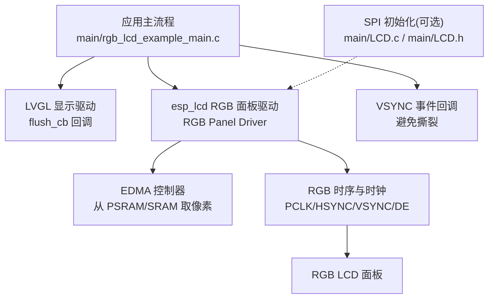
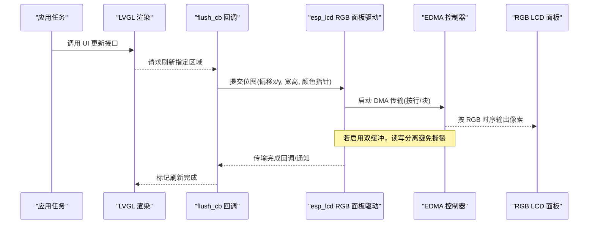
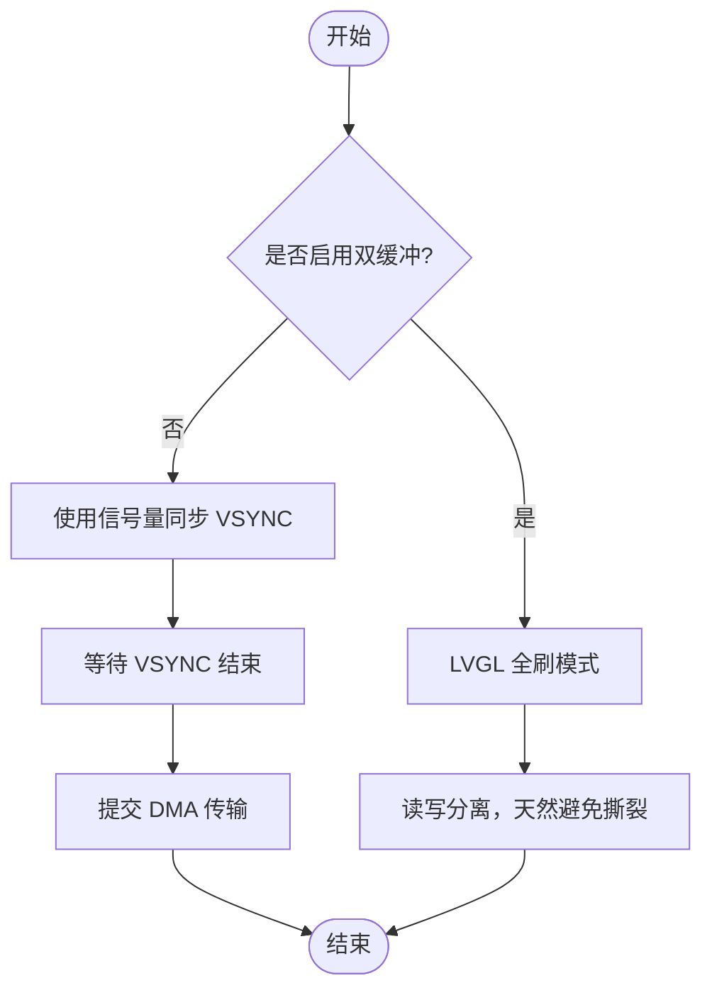
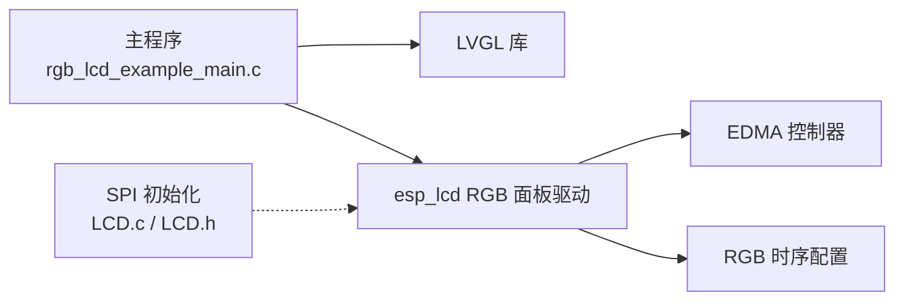

# DMA传输优化

<cite>
**本文引用的文件**   
- [rgb_lcd_example_main.c](file://ESP32开发板/TK021F2699_ESP32_LVGL_GIF_LED/TK021F2699_ESP32_LVGL_GIF_LED/main/rgb_lcd_example_main.c)
- [LCD.c](file://ESP32开发板/TK021F2699_ESP32_LVGL_GIF_LED/TK021F2699_ESP32_LVGL_GIF_LED/main/LCD.c)
- [LCD.h](file://ESP32开发板/TK021F2699_ESP32_LVGL_GIF_LED/TK021F2699_ESP32_LVGL_GIF_LED/main/LCD.h)
- [README.md](file://ESP32开发板/TK021F2699_ESP32_LVGL_GIF_LED/TK021F2699_ESP32_LVGL_GIF_LED/README.md)
- [sdkconfig.defaults.esp32s3](file://ESP32开发板/TK021F2699_ESP32_LVGL_GIF_LED/TK021F2699_ESP32_LVGL_GIF_LED/sdkconfig.defaults.esp32s3)
</cite>

## 目录
1. [简介](#简介)
2. [项目结构](#项目结构)
3. [核心组件](#核心组件)
4. [架构总览](#架构总览)
5. [详细组件分析](#详细组件分析)
6. [依赖关系分析](#依赖关系分析)
7. [性能考量](#性能考量)
8. [故障排查指南](#故障排查指南)
9. [结论](#结论)
10. [附录](#附录)

## 简介
本技术文档围绕 ESP32-S3 的 RGB LCD 控制器与 DMA（EDMA）工作机制，结合工程中的实际实现，系统阐述单次传输与块传输的差异、DMA 缓冲区配置最佳实践、屏幕撕裂成因与消除方法（含垂直同步信号的使用），并提供可落地的性能测试方法与优化技巧（部分刷新与脏矩形思路）。文档面向有一定嵌入式基础的读者，同时兼顾可读性。

## 项目结构
本项目为基于 ESP-IDF 的 RGB LCD 示例，使用 LVGL 进行 UI 渲染，通过 esp_lcd 驱动层将帧缓冲数据经 EDMA 送至 RGB 面板。关键入口与配置集中在主程序与示例说明中：
- 主程序负责初始化 RGB 面板、注册 VSYNC 回调、创建 LVGL 任务与定时器、分配帧缓冲并注册 flush 回调。
- 示例说明文档提供硬件连接、配置项与常见问题建议。
- 可选 SPI 初始化模块用于特定屏 IC 的寄存器配置（非 RGB 直驱路径）。

图表来源
- [rgb_lcd_example_main.c:150-303](file://ESP32开发板/TK021F2699_ESP32_LVGL_GIF_LED/TK021F2699_ESP32_LVGL_GIF_LED/main/rgb_lcd_example_main.c#L150-L303)
- [README.md:1-122](file://ESP32开发板/TK021F2699_ESP32_LVGL_GIF_LED/TK021F2699_ESP32_LVGL_GIF_LED/README.md#L1-L122)
- [LCD.c:186-219](file://ESP32开发板/TK021F2699_ESP32_LVGL_GIF_LED/TK021F2699_ESP32_LVGL_GIF_LED/main/LCD.c#L186-L219)
- [LCD.h:12-26](file://ESP32开发板/TK021F2699_ESP32_LVGL_GIF_LED/TK021F2699_ESP32_LVGL_GIF_LED/main/LCD.h#L12-L26)

章节来源
- [rgb_lcd_example_main.c:150-303](file://ESP32开发板/TK021F2699_ESP32_LVGL_GIF_LED/TK021F2699_ESP32_LVGL_GIF_LED/main/rgb_lcd_example_main.c#L150-L303)
- [README.md:1-122](file://ESP32开发板/TK021F2699_ESP32_LVGL_GIF_LED/TK021F2699_ESP32_LVGL_GIF_LED/README.md#L1-L122)

## 核心组件
- RGB 面板驱动与 EDMA：由 esp_lcd 管理，EDMA 直接从内存读取像素数据并按 RGB 时序输出至面板。
- 帧缓冲与双缓冲：支持单缓冲+额外同步或双缓冲全刷模式，以规避撕裂。
- VSYNC 事件回调：用于在合适的时机触发刷新，降低撕裂风险。
- 回冲缓冲（Bounce Buffer）：当帧缓冲位于 PSRAM 时，可将小块数据搬运到内部 SRAM，提高 PCLK 上限。
- LVGL 集成：通过 flush 回调将绘制区域提交给底层驱动进行 DMA 传输。

章节来源
- [rgb_lcd_example_main.c:182-236](file://ESP32开发板/TK021F2699_ESP32_LVGL_GIF_LED/TK021F2699_ESP32_LVGL_GIF_LED/main/rgb_lcd_example_main.c#L182-L236)
- [rgb_lcd_example_main.c:94-109](file://ESP32开发板/TK021F2699_ESP32_LVGL_GIF_LED/TK021F2699_ESP32_LVGL_GIF_LED/main/rgb_lcd_example_main.c#L94-L109)
- [README.md:102-122](file://ESP32开发板/TK021F2699_ESP32_LVGL_GIF_LED/TK021F2699_ESP32_LVGL_GIF_LED/README.md#L102-L122)

## 架构总览
下图展示了从 LVGL 渲染到 EDMA 传输再到 RGB 面板输出的整体数据流，以及 VSYNC 同步点的作用位置。

图表来源
- [rgb_lcd_example_main.c:94-109](file://ESP32开发板/TK021F2699_ESP32_LVGL_GIF_LED/TK021F2699_ESP32_LVGL_GIF_LED/main/rgb_lcd_example_main.c#L94-L109)
- [rgb_lcd_example_main.c:182-236](file://ESP32开发板/TK021F2699_ESP32_LVGL_GIF_LED/TK021F2699_ESP32_LVGL_GIF_LED/main/rgb_lcd_example_main.c#L182-L236)

## 详细组件分析

### ESP32-S3 RGB LCD 控制器与 DMA 机制
- 数据源与带宽：
  - 帧缓冲可位于 PSRAM 或内部 SRAM。PSRAM 受限于 SPI0 总线带宽，可能限制最大 PCLK；内部 SRAM 带宽更高但容量有限。
  - 示例通过配置项启用“回冲缓冲”，将小块数据拷贝到内部 SRAM 供 EDMA 高速读取，从而提升 PCLK 上限。
- 时钟与引脚：
  - 配置包括 PCLK、HSYNC、VSYNC、DE 及 16 位数据总线，像素时钟频率与前后肩参数需匹配面板规格。
- 事件与同步：
  - 注册 VSYNC 回调，可在每场结束时刻进行同步控制，配合双缓冲或信号量避免撕裂。

章节来源
- [rgb_lcd_example_main.c:182-236](file://ESP32开发板/TK021F2699_ESP32_LVGL_GIF_LED/TK021F2699_ESP32_LVGL_GIF_LED/main/rgb_lcd_example_main.c#L182-L236)
- [README.md:102-122](file://ESP32开发板/TK021F2699_ESP32_LVGL_GIF_LED/TK021F2699_ESP32_LVGL_GIF_LED/README.md#L102-L122)

### 单次传输与块传输的性能差异
- 单次传输（整屏一次 DMA）：
  - 优点：编程简单，适合全屏刷新场景。
  - 缺点：对 PSRAM 带宽压力大，PCLK 受限；CPU 参与拷贝时增加负载；易出现撕裂。
- 块传输（分块/逐行 DMA）：
  - 优点：可通过回冲缓冲减少跨总线访问开销，提高有效带宽利用率；便于局部刷新。
  - 缺点：需要更复杂的调度与对齐策略；频繁中断/回调带来额外开销。
- 延迟与带宽：
  - 当帧缓冲在 PSRAM 且无回冲缓冲时，SPI0 带宽成为瓶颈，PCLK 难以拉高；启用回冲缓冲后，EDMA 从内部 SRAM 读取，PCLK 可达更高值。
  - 块大小影响缓存命中与总线突发效率，过大导致 CPU 拷贝时间增长，过小导致中断/描述符开销上升。

章节来源
- [README.md:102-122](file://ESP32开发板/TK021F2699_ESP32_LVGL_GIF_LED/TK021F2699_ESP32_LVGL_GIF_LED/README.md#L102-L122)
- [rgb_lcd_example_main.c:182-236](file://ESP32开发板/TK021F2699_ESP32_LVGL_GIF_LED/TK021F2699_ESP32_LVGL_GIF_LED/main/rgb_lcd_example_main.c#L182-L236)

### DMA 缓冲区配置最佳实践
- 缓冲区大小选择：
  - 回冲缓冲大小可按行数比例设置，例如示例中设置为若干行像素数量，平衡 CPU 拷贝与 DMA 吞吐。
  - 帧缓冲大小通常为分辨率×色深字节数；双缓冲模式下需双倍空间。
- 内存对齐要求：
  - 示例配置了 PSRAM 传输对齐参数，确保 DMA 能高效访问内存；对齐粒度通常与总线宽度/缓存行相关。
- 内存布局：
  - 优先将帧缓冲置于 PSRAM 以容纳高分辨率；必要时启用回冲缓冲以提升 PCLK。
  - 开启 SPIRAM 指令/只读数据取指选项可减少 ICache 占用 SPI0 带宽，间接提升可用带宽。

章节来源
- [rgb_lcd_example_main.c:182-236](file://ESP32开发板/TK021F2699_ESP32_LVGL_GIF_LED/TK021F2699_ESP32_LVGL_GIF_LED/main/rgb_lcd_example_main.c#L182-L236)
- [sdkconfig.defaults.esp32s3:1-9](file://ESP32开发板/TK021F2699_ESP32_LVGL_GIF_LED/TK021F2699_ESP32_LVGL_GIF_LED/sdkconfig.defaults.esp32s3#L1-L9)

### 屏幕撕裂效应与消除技术
- 产生原因：
  - 写入帧缓冲（CPU/Cache）与读取帧缓冲（EDMA/RGB 控制器）同时进行，导致扫描过程中画面不一致。
- 消除技术：
  - 双缓冲：一个用于写入，另一个用于读取，切换时机与 VSYNC 对齐。
  - 信号量同步：在 flush 回调中等待 VSYNC 结束再提交下一帧，避免交叉。
  - 全刷模式：在双缓冲下，LVGL 可配置为全刷，保证读写分离。

图表来源
- [rgb_lcd_example_main.c:75-93](file://ESP32开发板/TK021F2699_ESP32_LVGL_GIF_LED/TK021F2699_ESP32_LVGL_GIF_LED/main/rgb_lcd_example_main.c#L75-L93)
- [rgb_lcd_example_main.c:94-109](file://ESP32开发板/TK021F2699_ESP32_LVGL_GIF_LED/TK021F2699_ESP32_LVGL_GIF_LED/main/rgb_lcd_example_main.c#L94-L109)
- [README.md:112-117](file://ESP32开发板/TK021F2699_ESP32_LVGL_GIF_LED/TK021F2699_ESP32_LVGL_GIF_LED/README.md#L112-L117)

章节来源
- [rgb_lcd_example_main.c:75-93](file://ESP32开发板/TK021F2699_ESP32_LVGL_GIF_LED/TK021F2699_ESP32_LVGL_GIF_LED/main/rgb_lcd_example_main.c#L75-L93)
- [rgb_lcd_example_main.c:94-109](file://ESP32开发板/TK021F2699_ESP32_LVGL_GIF_LED/TK021F2699_ESP32_LVGL_GIF_LED/main/rgb_lcd_example_main.c#L94-L109)
- [README.md:112-117](file://ESP32开发板/TK021F2699_ESP32_LVGL_GIF_LED/TK021F2699_ESP32_LVGL_GIF_LED/README.md#L112-L117)

### 具体性能测试方法与优化技巧
- 测试方法：
  - 测量 PCLK 与实际刷新率：调整像素时钟与前后肩参数，观察稳定运行的最高 PCLK。
  - 对比不同缓冲模式：单缓冲+信号量 vs 双缓冲全刷，记录 CPU 占用与帧时间抖动。
  - 评估回冲缓冲大小：逐步增大块大小，观察 PCLK 提升与 CPU 拷贝耗时变化。
- 优化技巧：
  - 部分刷新：仅提交发生变化的区域，减少 DMA 数据量。
  - 脏矩形算法：维护最小包围矩形集合，合并相邻脏区，进一步降低传输量。
  - 内存与对齐：确保帧缓冲与回冲缓冲满足 DMA 对齐要求，减少总线错误与重试。
  - 配置 SPIRAM 取指：减少 ICache 对 SPI0 带宽占用，间接提升可用带宽。

章节来源
- [README.md:102-122](file://ESP32开发板/TK021F2699_ESP32_LVGL_GIF_LED/TK021F2699_ESP32_LVGL_GIF_LED/README.md#L102-L122)
- [sdkconfig.defaults.esp32s3:1-9](file://ESP32开发板/TK021F2699_ESP32_LVGL_GIF_LED/TK021F2699_ESP32_LVGL_GIF_LED/sdkconfig.defaults.esp32s3#L1-L9)

## 依赖关系分析
- 主程序依赖 LVGL 与 esp_lcd 驱动，后者管理 EDMA 与 RGB 时序。
- 可选 SPI 初始化模块用于特定屏 IC 的寄存器配置，独立于 RGB 直驱路径。
- 配置项影响运行时行为：双缓冲、回冲缓冲、VSYNC 同步等。

图表来源
- [rgb_lcd_example_main.c:150-303](file://ESP32开发板/TK021F2699_ESP32_LVGL_GIF_LED/TK021F2699_ESP32_LVGL_GIF_LED/main/rgb_lcd_example_main.c#L150-L303)
- [LCD.c:186-219](file://ESP32开发板/TK021F2699_ESP32_LVGL_GIF_LED/TK021F2699_ESP32_LVGL_GIF_LED/main/LCD.c#L186-L219)
- [LCD.h:12-26](file://ESP32开发板/TK021F2699_ESP32_LVGL_GIF_LED/TK021F2699_ESP32_LVGL_GIF_LED/main/LCD.h#L12-L26)

章节来源
- [rgb_lcd_example_main.c:150-303](file://ESP32开发板/TK021F2699_ESP32_LVGL_GIF_LED/TK021F2699_ESP32_LVGL_GIF_LED/main/rgb_lcd_example_main.c#L150-L303)
- [LCD.c:186-219](file://ESP32开发板/TK021F2699_ESP32_LVGL_GIF_LED/TK021F2699_ESP32_LVGL_GIF_LED/main/LCD.c#L186-L219)
- [LCD.h:12-26](file://ESP32开发板/TK021F2699_ESP32_LVGL_GIF_LED/TK021F2699_ESP32_LVGL_GIF_LED/main/LCD.h#L12-L26)

## 性能考量
- 带宽瓶颈：
  - PSRAM 帧缓冲受 SPI0 带宽限制，PCLK 难以拉高；启用回冲缓冲可显著提升 PCLK。
- CPU 占用：
  - 回冲缓冲涉及 CPU 拷贝，需权衡块大小与 CPU 负载。
- 撕裂与稳定性：
  - 双缓冲或 VSYNC 同步可有效避免撕裂；全刷模式在双缓冲下最稳健。
- 配置建议：
  - 根据面板规格合理设置 PCLK 与前后肩；必要时降低 PCLK 以避免漂移。
  - 开启 SPIRAM 取指与只读数据取指，释放 SPI0 带宽。

章节来源
- [README.md:102-122](file://ESP32开发板/TK021F2699_ESP32_LVGL_GIF_LED/TK021F2699_ESP32_LVGL_GIF_LED/README.md#L102-L122)
- [sdkconfig.defaults.esp32s3:1-9](file://ESP32开发板/TK021F2699_ESP32_LVGL_GIF_LED/TK021F2699_ESP32_LVGL_GIF_LED/sdkconfig.defaults.esp32s3#L1-L9)

## 故障排查指南
- 屏幕不亮：
  - 检查背光电平极性，必要时调整宏定义。
- 帧缓冲内存不足：
  - 将帧缓冲置于 PSRAM；注意 SPI0 带宽限制。
- 屏幕漂移：
  - 降低 PCLK；调整 pclk_active_neg 与 vsync_back_porch 等时序参数。
- 屏幕撕裂：
  - 使用双缓冲或添加 VSYNC 同步机制。
- PCLK 偏低：
  - 启用回冲缓冲；开启 SPIRAM 取指与只读数据取指。

章节来源
- [README.md:102-122](file://ESP32开发板/TK021F2699_ESP32_LVGL_GIF_LED/TK021F2699_ESP32_LVGL_GIF_LED/README.md#L102-L122)

## 结论
通过合理利用双缓冲、VSYNC 同步与回冲缓冲，并结合合理的 DMA 缓冲区大小与内存对齐策略，可以在 ESP32-S3 上获得更高的 PCLK 与更稳定的刷新表现。针对高频更新场景，建议采用部分刷新与脏矩形算法以减少传输量，并通过系统化的性能测试验证优化效果。

## 附录
- 关键配置项参考：
  - 双缓冲：示例中通过配置开关启用，LVGL 可设为全刷模式。
  - 回冲缓冲：示例中按行像素数设置块大小，平衡 CPU 与 DMA 吞吐。
  - PSRAM 传输对齐：确保 DMA 高效访问。
  - SPIRAM 取指与只读数据取指：释放 SPI0 带宽，提升可用带宽。

章节来源
- [rgb_lcd_example_main.c:182-236](file://ESP32开发板/TK021F2699_ESP32_LVGL_GIF_LED/TK021F2699_ESP32_LVGL_GIF_LED/main/rgb_lcd_example_main.c#L182-L236)
- [sdkconfig.defaults.esp32s3:1-9](file://ESP32开发板/TK021F2699_ESP32_LVGL_GIF_LED/TK021F2699_ESP32_LVGL_GIF_LED/sdkconfig.defaults.esp32s3#L1-L9)