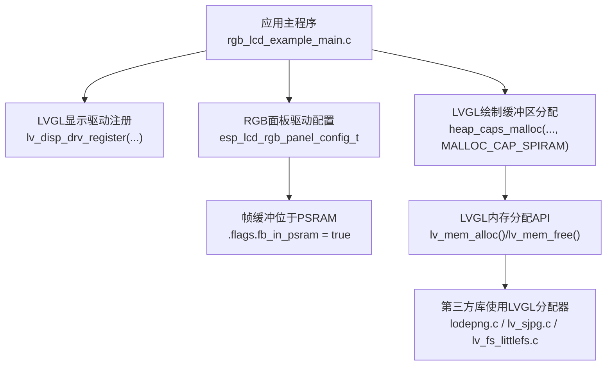
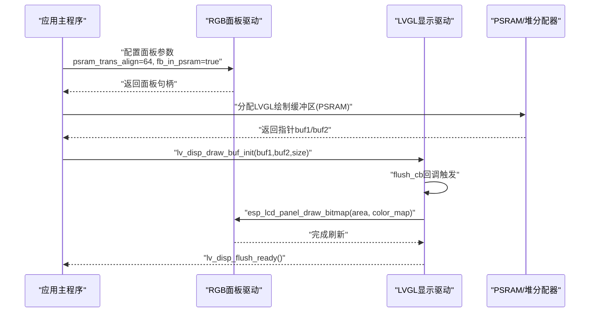
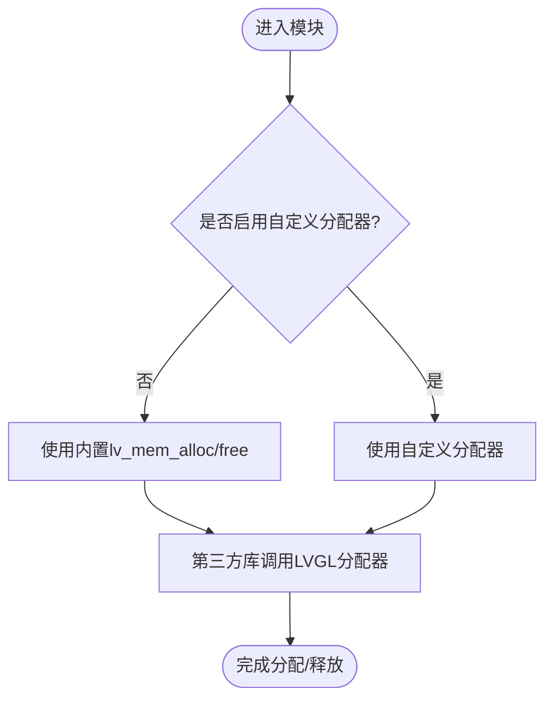
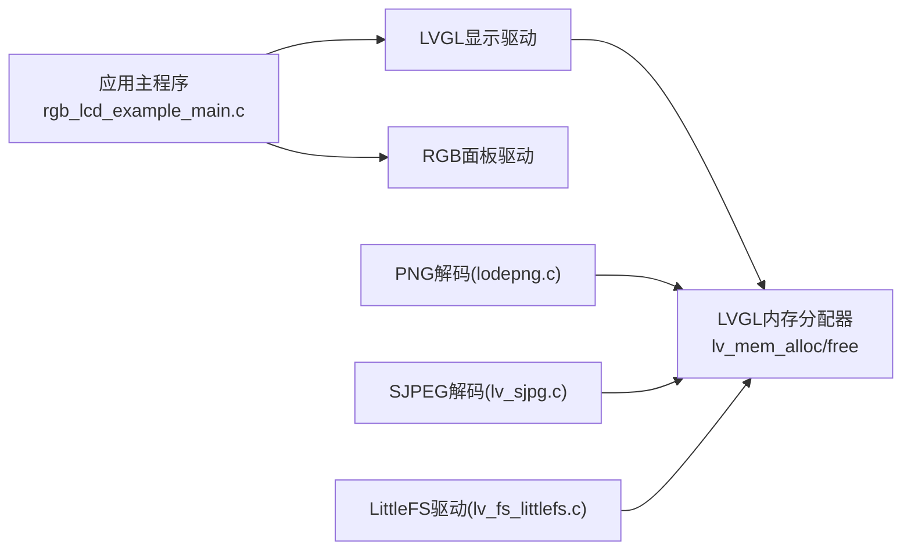

# PSRAM帧缓冲分配

<cite>
**本文引用的文件**   
- [README.md](file://ESP32开发板/TK021F2699_ESP32_LVGL_GIF_LED/TK021F2699_ESP32_LVGL_GIF_LED/README.md)
- [rgb_lcd_example_main.c](file://ESP32开发板/TK021F2699_ESP32_LVGL_GIF_LED/TK021F2699_ESP32_LVGL_GIF_LED/main/rgb_lcd_example_main.c)
- [sdkconfig.defaults.esp32s3](file://ESP32开发板/TK021F2699_ESP32_LVGL_GIF_LED/TK021F2699_ESP32_LVGL_GIF_LED/sdkconfig.defaults.esp32s3)
- [lv_conf_template.h](file://ESP32开发板/TK021F2699_ESP32_LVGL_GIF_LED/TK021F2699_ESP32_LVGL_GIF_LED/managed_components/lvgl__lvgl/lv_conf_template.h)
- [lv_conf_internal.h](file://ESP32开发板/TK021F2699_ESP32_LVGL_GIF_LED/TK021F2699_ESP32_LVGL_GIF_LED/managed_components/lvgl__lvgl/src/lv_conf_internal.h)
- [Kconfig](file://ESP32开发板/TK021F2699_ESP32_LVGL_GIF_LED/TK021F2699_ESP32_LVGL_GIF_LED/managed_components/lvgl__lvgl/Kconfig)
- [lv_sjpg.c](file://ESP32开发板/TK021F2699_ESP32_LVGL_GIF_LED/TK021F2699_ESP32_LVGL_GIF_LED/managed_components/lvgl__lvgl/src/extra/libs/sjpg/lv_sjpg.c)
- [lodepng.c](file://ESP32开发板/TK021F2699_ESP32_LVGL_GIF_LED/TK021F2699_ESP32_LVGL_GIF_LED/managed_components/lvgl__lvgl/src/extra/libs/png/lodepng.c)
- [lv_fs_littlefs.c](file://ESP32开发板/TK021F2699_ESP32_LVGL_GIF_LED/TK021F2699_ESP32_LVGL_GIF_LED/managed_components/lvgl__lvgl/src/extra/libs/fsdrv/lv_fs_littlefs.c)
</cite>

## 目录
1. [简介](#简介)
2. [项目结构](#项目结构)
3. [核心组件](#核心组件)
4. [架构总览](#架构总览)
5. [详细组件分析](#详细组件分析)
6. [依赖关系分析](#依赖关系分析)
7. [性能考虑](#性能考虑)
8. [故障排查指南](#故障排查指南)
9. [结论](#结论)
10. [附录](#附录)

## 简介
本技术文档围绕ESP32-S3平台上的PSRAM帧缓冲分配与LVGL内存管理展开，重点包括：
- ESP32-S3的PSRAM架构特点与内存布局要点
- LVGL中lv_mem_alloc()的使用方式与对齐要求
- 大尺寸屏幕（480x480）在RGB565下的显存需求计算
- PSRAM初始化与配置最佳实践（含内存池大小调整与访问优化）
- 内存碎片化问题、解决方案及内存使用监控与泄漏检测思路

## 项目结构
本项目为ESP-IDF示例工程，包含RGB LCD面板驱动、LVGL集成、以及若干第三方库（如PNG/SJPEG解码器）。关键路径如下：
- 应用主程序：main/rgb_lcd_example_main.c
- 示例说明：README.md
- ESP32-S3默认配置：sdkconfig.defaults.esp32s3
- LVGL配置模板与内部宏：lv_conf_template.h、src/lv_conf_internal.h、Kconfig
- 图像解码与内存分配示例：src/extra/libs/png/lodepng.c、src/extra/libs/sjpg/lv_sjpg.c、src/extra/libs/fsdrv/lv_fs_littlefs.c

图示来源
- [rgb_lcd_example_main.c:180-230](file://ESP32开发板/TK021F2699_ESP32_LVGL_GIF_LED/TK021F2699_ESP32_LVGL_GIF_LED/main/rgb_lcd_example_main.c#L180-L230)
- [rgb_lcd_example_main.c:246-273](file://ESP32开发板/TK021F2699_ESP32_LVGL_GIF_LED/TK021F2699_ESP32_LVGL_GIF_LED/main/rgb_lcd_example_main.c#L246-L273)
- [lv_conf_template.h:47-51](file://ESP32开发板/TK021F2699_ESP32_LVGL_GIF_LED/TK021F2699_ESP32_LVGL_GIF_LED/managed_components/lvgl__lvgl/lv_conf_template.h#L47-L51)
- [lv_conf_internal.h:117-129](file://ESP32开发板/TK021F2699_ESP32_LVGL_GIF_LED/TK021F2699_ESP32_LVGL_GIF_LED/managed_components/lvgl__lvgl/src/lv_conf_internal.h#L117-L129)
- [lodepng.c:74-91](file://ESP32开发板/TK021F2699_ESP32_LVGL_GIF_LED/TK021F2699_ESP32_LVGL_GIF_LED/managed_components/lvgl__lvgl/src/extra/libs/png/lodepng.c#L74-L91)
- [lv_sjpg.c:755-792](file://ESP32开发板/TK021F2699_ESP32_LVGL_GIF_LED/TK021F2699_ESP32_LVGL_GIF_LED/managed_components/lvgl__lvgl/src/extra/libs/sjpg/lv_sjpg.c#L755-L792)
- [lv_fs_littlefs.c:134-167](file://ESP32开发板/TK021F2699_ESP32_LVGL_GIF_LED/TK021F2699_ESP32_LVGL_GIF_LED/managed_components/lvgl__lvgl/src/extra/libs/fsdrv/lv_fs_littlefs.c#L134-L167)

章节来源
- [README.md:1-122](file://ESP32开发板/TK021F2699_ESP32_LVGL_GIF_LED/TK021F2699_ESP32_LVGL_GIF_LED/README.md#L1-L122)
- [rgb_lcd_example_main.c:150-303](file://ESP32开发板/TK021F2699_ESP32_LVGL_GIF_LED/TK021F2699_ESP32_LVGL_GIF_LED/main/rgb_lcd_example_main.c#L150-L303)

## 核心组件
- RGB面板驱动与帧缓冲
  - 通过esp_lcd_rgb_panel_config_t配置数据宽度、时序、时钟源等，并启用fb_in_psram将帧缓冲置于PSRAM。
  - 可选双缓冲模式或回写缓冲（bounce buffer）以降低SPI0带宽压力。
- LVGL显示驱动
  - 使用lv_disp_draw_buf_init设置绘制缓冲区；当未启用双帧缓冲时，从PSRAM单独分配绘制缓冲区。
  - flush回调中将绘制结果写入面板。
- LVGL内存分配
  - 默认使用内置分配器lv_mem_alloc()/lv_mem_free()，可通过配置切换自定义分配器。
  - 第三方库（如PNG/SJPEG/LittleFS）通过LVGL分配器进行临时缓冲分配与释放。

章节来源
- [rgb_lcd_example_main.c:180-230](file://ESP32开发板/TK021F2699_ESP32_LVGL_GIF_LED/TK021F2699_ESP32_LVGL_GIF_LED/main/rgb_lcd_example_main.c#L180-L230)
- [rgb_lcd_example_main.c:246-273](file://ESP32开发板/TK021F2699_ESP32_LVGL_GIF_LED/TK021F2699_ESP32_LVGL_GIF_LED/main/rgb_lcd_example_main.c#L246-L273)
- [lv_conf_template.h:47-51](file://ESP32开发板/TK021F2699_ESP32_LVGL_GIF_LED/TK021F2699_ESP32_LVGL_GIF_LED/managed_components/lvgl__lvgl/lv_conf_template.h#L47-L51)
- [lv_conf_internal.h:117-129](file://ESP32开发板/TK021F2699_ESP32_LVGL_GIF_LED/TK021F2699_ESP32_LVGL_GIF_LED/managed_components/lvgl__lvgl/src/lv_conf_internal.h#L117-L129)
- [lodepng.c:74-91](file://ESP32开发板/TK021F2699_ESP32_LVGL_GIF_LED/TK021F2699_ESP32_LVGL_GIF_LED/managed_components/lvgl__lvgl/src/extra/libs/png/lodepng.c#L74-L91)
- [lv_sjpg.c:755-792](file://ESP32开发板/TK021F2699_ESP32_LVGL_GIF_LED/TK021F2699_ESP32_LVGL_GIF_LED/managed_components/lvgl__lvgl/src/extra/libs/sjpg/lv_sjpg.c#L755-L792)
- [lv_fs_littlefs.c:134-167](file://ESP32开发板/TK021F2699_ESP32_LVGL_GIF_LED/TK021F2699_ESP32_LVGL_GIF_LED/managed_components/lvgl__lvgl/src/extra/libs/fsdrv/lv_fs_littlefs.c#L134-L167)

## 架构总览
下图展示了从应用到硬件的关键路径：应用初始化LVGL与RGB面板，选择帧缓冲位置（PSRAM），并通过flush回调将绘制缓冲区内容传输至面板。

图示来源
- [rgb_lcd_example_main.c:180-230](file://ESP32开发板/TK021F2699_ESP32_LVGL_GIF_LED/TK021F2699_ESP32_LVGL_GIF_LED/main/rgb_lcd_example_main.c#L180-L230)
- [rgb_lcd_example_main.c:246-273](file://ESP32开发板/TK021F2699_ESP32_LVGL_GIF_LED/TK021F2699_ESP32_LVGL_GIF_LED/main/rgb_lcd_example_main.c#L246-L273)
- [rgb_lcd_example_main.c:95-109](file://ESP32开发板/TK021F2699_ESP32_LVGL_GIF_LED/TK021F2699_ESP32_LVGL_GIF_LED/main/rgb_lcd_example_main.c#L95-L109)

## 详细组件分析

### ESP32-S3 PSRAM架构与内存布局要点
- 外部PSRAM通过SPI总线连接，受限于SPI0带宽，高PCLK下可能成为瓶颈。
- 支持DMA访问PSRAM，可配合GDMA/AHB提升吞吐。
- 建议开启指令/常量取指从PSRAM读取的配置以节省SPI0带宽。
- 帧缓冲放置于PSRAM可降低内部SRAM占用，但需权衡PCLK上限与撕裂现象。

章节来源
- [README.md:106-117](file://ESP32开发板/TK021F2699_ESP32_LVGL_GIF_LED/TK021F2699_ESP32_LVGL_GIF_LED/README.md#L106-L117)
- [sdkconfig.defaults.esp32s3:5](file://ESP32开发板/TK021F2699_ESP32_LVGL_GIF_LED/TK021F2699_ESP32_LVGL_GIF_LED/sdkconfig.defaults.esp32s3#L5)

### LVGL内存分配器与lv_mem_alloc()使用
- 默认启用内置分配器，提供lv_mem_alloc()/lv_mem_free()接口。
- 可通过配置切换自定义分配器（例如对接系统堆或特定区域）。
- 第三方库普遍通过LVGL分配器进行临时缓冲分配与释放，便于统一管理与监控。

图示来源
- [lv_conf_template.h:47-51](file://ESP32开发板/TK021F2699_ESP32_LVGL_GIF_LED/TK021F2699_ESP32_LVGL_GIF_LED/managed_components/lvgl__lvgl/lv_conf_template.h#L47-L51)
- [lv_conf_internal.h:117-129](file://ESP32开发板/TK021F2699_ESP32_LVGL_GIF_LED/TK021F2699_ESP32_LVGL_GIF_LED/managed_components/lvgl__lvgl/src/lv_conf_internal.h#L117-L129)
- [Kconfig:70-73](file://ESP32开发板/TK021F2699_ESP32_LVGL_GIF_LED/TK021F2699_ESP32_LVGL_GIF_LED/managed_components/lvgl__lvgl/Kconfig#L70-L73)
- [lodepng.c:74-91](file://ESP32开发板/TK021F2699_ESP32_LVGL_GIF_LED/TK021F2699_ESP32_LVGL_GIF_LED/managed_components/lvgl__lvgl/src/extra/libs/png/lodepng.c#L74-L91)
- [lv_fs_littlefs.c:134-167](file://ESP32开发板/TK021F2699_ESP32_LVGL_GIF_LED/TK021F2699_ESP32_LVGL_GIF_LED/managed_components/lvgl__lvgl/src/extra/libs/fsdrv/lv_fs_littlefs.c#L134-L167)

### 内存对齐与PSRAM传输对齐
- 面板驱动配置中包含psram_trans_align字段，用于指定PSRAM传输对齐粒度（示例为64字节），有助于提高DMA效率。
- 对于需要严格对齐的场景（如某些DMA外设或缓存行对齐），应确保分配的缓冲区满足相应对齐要求。

章节来源
- [rgb_lcd_example_main.c:183](file://ESP32开发板/TK021F2699_ESP32_LVGL_GIF_LED/TK021F2699_ESP32_LVGL_GIF_LED/main/rgb_lcd_example_main.c#L183)

### 大尺寸屏幕（480x480）内存需求计算（RGB565）
- 单像素占用：RGB565为16位，即2字节。
- 单帧缓冲大小：480 × 480 × 2 = 460,800 字节 ≈ 450 KB。
- 若启用双帧缓冲：约900 KB。
- LVGL绘制缓冲区：
  - 若复用面板帧缓冲作为绘制缓冲：无需额外分配。
  - 若独立分配：至少再增加一个450 KB的PSRAM空间。
- 注意：实际可用内存还需考虑LVGL对象、样式、字体、图片缓存等开销。

章节来源
- [rgb_lcd_example_main.c:57-58](file://ESP32开发板/TK021F2699_ESP32_LVGL_GIF_LED/TK021F2699_ESP32_LVGL_GIF_LED/main/rgb_lcd_example_main.c#L57-L58)
- [rgb_lcd_example_main.c:246-261](file://ESP32开发板/TK021F2699_ESP32_LVGL_GIF_LED/TK021F2699_ESP32_LVGL_GIF_LED/main/rgb_lcd_example_main.c#L246-L261)

### PSRAM初始化与配置最佳实践
- 面板驱动配置
  - 设置psram_trans_align为64，利于DMA传输对齐。
  - 启用fb_in_psram将帧缓冲置于PSRAM。
  - 根据LCD规格设置时序与时钟源，必要时降低PCLK以避免带宽不足。
- LVGL绘制缓冲策略
  - 双帧缓冲+全刷新模式可减少撕裂，但需更多PSRAM。
  - 单帧缓冲+独立绘制缓冲（PSRAM）更省资源，但需注意同步避免撕裂。
  - 启用bounce buffer可将部分数据暂存于内部SRAM，降低对PSRAM带宽压力，但会增加CPU负载。
- 内存池大小调整
  - 通过LV_MEM_SIZE或CONFIG_LV_MEM_SIZE调整LVGL内存池大小，以满足对象、样式、缓存等需求。
  - 参考官方文档与demo提示，适当增大LV_MEM_SIZE以避免运行时分配失败。

章节来源
- [rgb_lcd_example_main.c:180-230](file://ESP32开发板/TK021F2699_ESP32_LVGL_GIF_LED/TK021F2699_ESP32_LVGL_GIF_LED/main/rgb_lcd_example_main.c#L180-L230)
- [rgb_lcd_example_main.c:246-273](file://ESP32开发板/TK021F2699_ESP32_LVGL_GIF_LED/TK021F2699_ESP32_LVGL_GIF_LED/main/rgb_lcd_example_main.c#L246-L273)
- [lv_conf_template.h:47-51](file://ESP32开发板/TK021F2699_ESP32_LVGL_GIF_LED/TK021F2699_ESP32_LVGL_GIF_LED/managed_components/lvgl__lvgl/lv_conf_template.h#L47-L51)
- [lv_conf_internal.h:125-129](file://ESP32开发板/TK021F2699_ESP32_LVGL_GIF_LED/TK021F2699_ESP32_LVGL_GIF_LED/managed_components/lvgl__lvgl/src/lv_conf_internal.h#L125-L129)
- [Kconfig:70-73](file://ESP32开发板/TK021F2699_ESP32_LVGL_GIF_LED/TK021F2699_ESP32_LVGL_GIF_LED/managed_components/lvgl__lvgl/Kconfig#L70-L73)
- [README.md:106-117](file://ESP32开发板/TK021F2699_ESP32_LVGL_GIF_LED/TK021F2699_ESP32_LVGL_GIF_LED/README.md#L106-L117)

### 内存碎片化问题与解决方案
- 碎片化成因
  - 频繁的小块分配/释放导致空闲块分散，难以满足大块连续分配（如帧缓冲）。
- 缓解策略
  - 优先使用PSRAM分配大块连续内存（如帧缓冲、LVGL绘制缓冲）。
  - 合理设置LV_MEM_SIZE，减少动态分配频率。
  - 采用对象池或预分配策略，避免运行期频繁分配。
  - 使用bounce buffer降低PSRAM带宽压力，间接减少因带宽导致的重分配与重试。
- 监控与诊断
  - 统计LVGL内存池使用情况（已用/最大/最小空闲块），定位峰值与碎片程度。
  - 记录分配失败场景，结合日志分析热点分配路径。
  - 针对第三方库（PNG/SJPEG/LittleFS）的分配/释放路径进行审计，确保及时释放。

章节来源
- [lv_conf_template.h:47-51](file://ESP32开发板/TK021F2699_ESP32_LVGL_GIF_LED/TK021F2699_ESP32_LVGL_GIF_LED/managed_components/lvgl__lvgl/lv_conf_template.h#L47-L51)
- [lv_conf_internal.h:125-129](file://ESP32开发板/TK021F2699_ESP32_LVGL_GIF_LED/TK021F2699_ESP32_LVGL_GIF_LED/managed_components/lvgl__lvgl/src/lv_conf_internal.h#L125-L129)
- [README.md:106-117](file://ESP32开发板/TK021F2699_ESP32_LVGL_GIF_LED/TK021F2699_ESP32_LVGL_GIF_LED/README.md#L106-L117)

### 内存使用监控与泄漏检测实现方法
- 监控指标
  - LVGL内存池：当前使用量、历史峰值、最小空闲块、分配次数与失败次数。
  - 系统堆：PSRAM与内部SRAM的剩余容量与碎片指数。
- 实现思路
  - 在LVGL分配器层封装统计钩子，累计分配/释放计数与大小。
  - 定期输出统计信息（如每5秒一次），辅助定位峰值与异常增长。
  - 对第三方库的分配/释放路径添加断言与日志，确保成对匹配。
- 泄漏检测
  - 基于“分配时间戳+唯一ID”的记录表，在对象销毁时移除条目，启动/退出时报告未释放项。
  - 结合崩溃转储与日志回溯，定位具体分配点。

章节来源
- [lv_conf_template.h:47-51](file://ESP32开发板/TK021F2699_ESP32_LVGL_GIF_LED/TK021F2699_ESP32_LVGL_GIF_LED/managed_components/lvgl__lvgl/lv_conf_template.h#L47-L51)
- [lv_conf_internal.h:117-129](file://ESP32开发板/TK021F2699_ESP32_LVGL_GIF_LED/TK021F2699_ESP32_LVGL_GIF_LED/managed_components/lvgl__lvgl/src/lv_conf_internal.h#L117-L129)
- [lodepng.c:74-91](file://ESP32开发板/TK021F2699_ESP32_LVGL_GIF_LED/TK021F2699_ESP32_LVGL_GIF_LED/managed_components/lvgl__lvgl/src/extra/libs/png/lodepng.c#L74-L91)
- [lv_fs_littlefs.c:134-167](file://ESP32开发板/TK021F2699_ESP32_LVGL_GIF_LED/TK021F2699_ESP32_LVGL_GIF_LED/managed_components/lvgl__lvgl/src/extra/libs/fsdrv/lv_fs_littlefs.c#L134-L167)

## 依赖关系分析
- 应用主程序依赖LVGL显示驱动与RGB面板驱动。
- LVGL显示驱动依赖LVGL内存分配器（内置或自定义）。
- 第三方库（PNG/SJPEG/LittleFS）依赖LVGL分配器进行临时缓冲管理。

图示来源
- [rgb_lcd_example_main.c:246-273](file://ESP32开发板/TK021F2699_ESP32_LVGL_GIF_LED/TK021F2699_ESP32_LVGL_GIF_LED/main/rgb_lcd_example_main.c#L246-L273)
- [lv_conf_template.h:47-51](file://ESP32开发板/TK021F2699_ESP32_LVGL_GIF_LED/TK021F2699_ESP32_LVGL_GIF_LED/managed_components/lvgl__lvgl/lv_conf_template.h#L47-L51)
- [lodepng.c:74-91](file://ESP32开发板/TK021F2699_ESP32_LVGL_GIF_LED/TK021F2699_ESP32_LVGL_GIF_LED/managed_components/lvgl__lvgl/src/extra/libs/png/lodepng.c#L74-L91)
- [lv_sjpg.c:755-792](file://ESP32开发板/TK021F2699_ESP32_LVGL_GIF_LED/TK021F2699_ESP32_LVGL_GIF_LED/managed_components/lvgl__lvgl/src/extra/libs/sjpg/lv_sjpg.c#L755-L792)
- [lv_fs_littlefs.c:134-167](file://ESP32开发板/TK021F2699_ESP32_LVGL_GIF_LED/TK021F2699_ESP32_LVGL_GIF_LED/managed_components/lvgl__lvgl/src/extra/libs/fsdrv/lv_fs_littlefs.c#L134-L167)

## 性能考虑
- PSRAM带宽限制
  - 将帧缓冲置于PSRAM会降低PCLK上限，必要时启用bounce buffer或降低PCLK。
- DMA与对齐
  - 使用psram_trans_align=64提升DMA效率；确保缓冲区对齐满足外设要求。
- 双缓冲与撕裂
  - 双帧缓冲+全刷新可避免撕裂，但需更大PSRAM；单缓冲需额外同步机制。
- 指令/常量取指优化
  - 开启从PSRAM取指与常量以减少SPI0竞争，提升整体吞吐。

章节来源
- [README.md:106-117](file://ESP32开发板/TK021F2699_ESP32_LVGL_GIF_LED/TK021F2699_ESP32_LVGL_GIF_LED/README.md#L106-L117)
- [rgb_lcd_example_main.c:183](file://ESP32开发板/TK021F2699_ESP32_LVGL_GIF_LED/TK021F2699_ESP32_LVGL_GIF_LED/main/rgb_lcd_example_main.c#L183)
- [rgb_lcd_example_main.c:270-273](file://ESP32开发板/TK021F2699_ESP32_LVGL_GIF_LED/TK021F2699_ESP32_LVGL_GIF_LED/main/rgb_lcd_example_main.c#L270-L273)

## 故障排查指南
- 无帧缓冲内存
  - 检查PSRAM容量与fb_in_psram配置；评估是否需要减小分辨率或颜色深度。
- 屏幕撕裂
  - 启用双帧缓冲或增加同步机制（信号量）。
- PCLK过低
  - 启用bounce buffer或优化PSRAM取指配置。
- 屏幕漂移
  - 降低PCLK，调整时序参数（hsync/vsync前后沿与脉宽）。
- 分配失败
  - 增大LV_MEM_SIZE；减少同时活跃的对象与图片缓存；检查第三方库释放路径。

章节来源
- [README.md:106-117](file://ESP32开发板/TK021F2699_ESP32_LVGL_GIF_LED/TK021F2699_ESP32_LVGL_GIF_LED/README.md#L106-L117)
- [lv_conf_template.h:47-51](file://ESP32开发板/TK021F2699_ESP32_LVGL_GIF_LED/TK021F2699_ESP32_LVGL_GIF_LED/managed_components/lvgl__lvgl/lv_conf_template.h#L47-L51)

## 结论
在ESP32-S3平台上，将帧缓冲与LVGL绘制缓冲置于PSRAM可有效缓解内部SRAM压力，但需关注SPI0带宽与PCLK上限。通过合理的PSRAM传输对齐、双缓冲策略与LV_MEM_SIZE调优，可在保证画质的前提下获得稳定流畅的显示效果。同时，建立完善的内存监控与泄漏检测机制，有助于长期维护与性能优化。

## 附录
- 相关配置项参考
  - LVGL内存池大小：LV_MEM_SIZE或CONFIG_LV_MEM_SIZE
  - 自定义分配器开关：LV_MEM_CUSTOM
  - 面板PSRAM传输对齐：psram_trans_align
  - 帧缓冲位置：fb_in_psram

章节来源
- [lv_conf_template.h:47-51](file://ESP32开发板/TK021F2699_ESP32_LVGL_GIF_LED/TK021F2699_ESP32_LVGL_GIF_LED/managed_components/lvgl__lvgl/lv_conf_template.h#L47-L51)
- [lv_conf_internal.h:117-129](file://ESP32开发板/TK021F2699_ESP32_LVGL_GIF_LED/TK021F2699_ESP32_LVGL_GIF_LED/managed_components/lvgl__lvgl/src/lv_conf_internal.h#L117-L129)
- [rgb_lcd_example_main.c:183](file://ESP32开发板/TK021F2699_ESP32_LVGL_GIF_LED/TK021F2699_ESP32_LVGL_GIF_LED/main/rgb_lcd_example_main.c#L183)
- [rgb_lcd_example_main.c:227](file://ESP32开发板/TK021F2699_ESP32_LVGL_GIF_LED/TK021F2699_ESP32_LVGL_GIF_LED/main/rgb_lcd_example_main.c#L227)