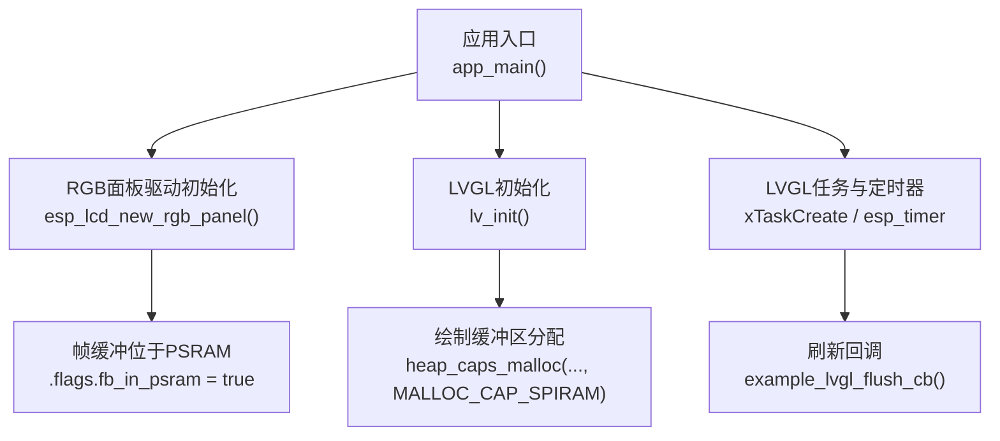
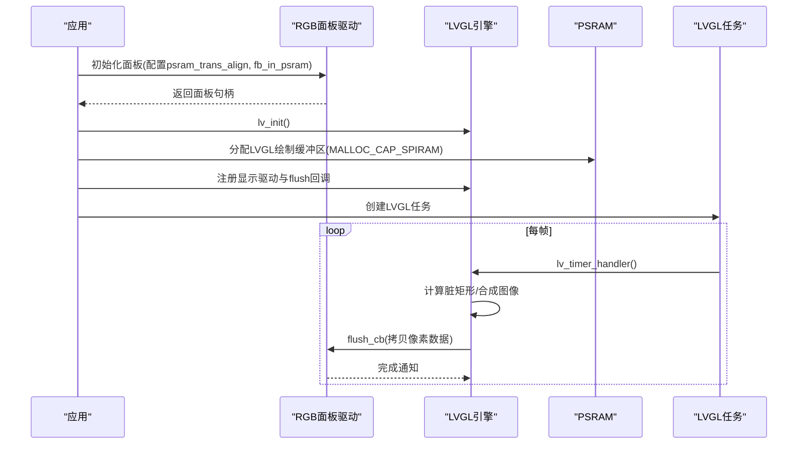
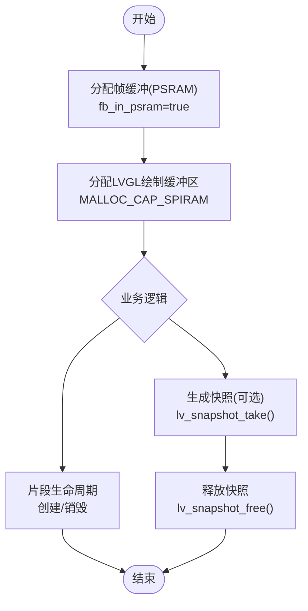
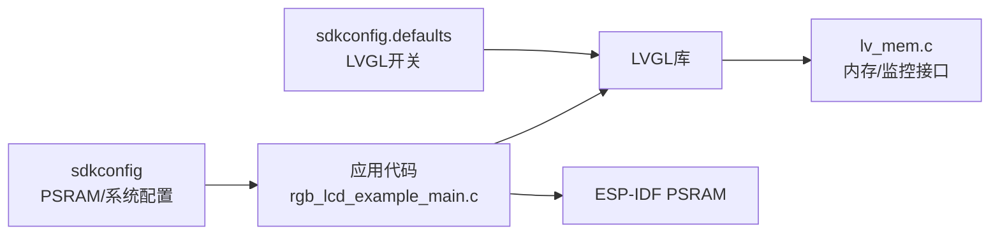

# 内存监控与调试

<cite>
**本文引用的文件**   
- [rgb_lcd_example_main.c](file://ESP32开发板/TK021F2699_ESP32_LVGL_GIF_LED/TK021F2699_ESP32_LVGL_GIF_LED/main/rgb_lcd_example_main.c)
- [sdkconfig.defaults](file://ESP32开发板/TK021F2699_ESP32_LVGL_GIF_LED/TK021F2699_ESP32_LVGL_GIF_LED/sdkconfig.defaults)
- [sdkconfig](file://ESP32开发板/TK021F2699_ESP32_LVGL_GIF_LED/TK021F2699_ESP32_LVGL_GIF_LED/sdkconfig)
- [lv_mem.c](file://ESP32开发板/TK021F2699_ESP32_LVGL_GIF_LED/TK021F2699_ESP32_LVGL_GIF_LED/managed_components/lvgl__lvgl/src/misc/lv_mem.c)
- [lv_fragment.c](file://ESP32开发板/TK021F2699_ESP32_LVGL_GIF_LED/TK021F2699_ESP32_LVGL_GIF_LED/managed_components/lvgl__lvgl/src/extra/others/fragment/lv_fragment.c)
- [lv_snapshot.c](file://ESP32开发板/TK021F2699_ESP32_LVGL_GIF_LED/TK021F2699_ESP32_LVGL_GIF_LED/managed_components/lvgl__lvgl/src/extra/others/snapshot/lv_snapshot.c)
- [test_snapshot.c](file://ESP32开发板/TK021F2699_ESP32_LVGL_GIF_LED/TK021F2699_ESP32_LVGL_GIF_LED/managed_components/lvgl__lvgl/tests/src/test_cases/test_snapshot.c)
</cite>

## 目录
1. [简介](#简介)
2. [项目结构](#项目结构)
3. [核心组件](#核心组件)
4. [架构总览](#架构总览)
5. [详细组件分析](#详细组件分析)
6. [依赖分析](#依赖分析)
7. [性能考虑](#性能考虑)
8. [故障排查指南](#故障排查指南)
9. [结论](#结论)
10. [附录](#附录)

## 简介
本技术文档面向在 ESP-IDF 平台上进行 LVGL 图形应用开发的工程师，聚焦于内存监控与调试。内容涵盖：
- ESP-IDF 的 PSRAM 配置与使用方式（含帧缓冲、传输对齐等）
- LVGL 动态内存与性能监控接口在项目中的启用与使用
- 基于 heap_trace 的内存泄漏检测方法与流程
- 常见问题定位思路：内存碎片化、栈溢出、堆损坏
- 实战案例与性能分析技巧，帮助快速定位并解决内存相关问题

## 项目结构
本项目为基于 ESP32-S3 的 RGB LCD + LVGL 示例工程，关键内存相关点包括：
- 通过 ESP-IDF 配置项启用 PSRAM，并将帧缓冲分配至 PSRAM
- 通过 LVGL 配置开启自定义内存与性能监控
- 示例主程序初始化显示驱动、LVGL 任务与定时器，并在运行时进行刷新回调

图示来源
- [rgb_lcd_example_main.c:150-303](file://ESP32开发板/TK021F2699_ESP32_LVGL_GIF_LED/TK021F2699_ESP32_LVGL_GIF_LED/main/rgb_lcd_example_main.c#L150-L303)

章节来源
- [rgb_lcd_example_main.c:150-303](file://ESP32开发板/TK021F2699_ESP32_LVGL_GIF_LED/TK021F2699_ESP32_LVGL_GIF_LED/main/rgb_lcd_example_main.c#L150-L303)
- [sdkconfig.defaults:1-6](file://ESP32开发板/TK021F2699_ESP32_LVGL_GIF_LED/TK021F2699_ESP32_LVGL_GIF_LED/sdkconfig.defaults#L1-L6)
- [sdkconfig:940-976](file://ESP32开发板/TK021F2699_ESP32_LVGL_GIF_LED/TK021F2699_ESP32_LVGL_GIF_LED/sdkconfig#L940-L976)

## 核心组件
- ESP-IDF PSRAM 子系统
  - 启用 SPIRAM、设置工作模式与速度、允许将栈分配到外部内存、保留内部堆大小等
  - 关键配置项见 sdkconfig 中“ESP PSRAM”段
- LVGL 内存与性能监控
  - 启用自定义内存实现与性能监控开关
  - 提供 lv_mem_* 系列接口用于统计与诊断
- 示例应用内存布局
  - 帧缓冲位于 PSRAM（fb_in_psram）
  - LVGL 绘制缓冲区从 PSRAM 分配（MALLOC_CAP_SPIRAM）
  - 传输对齐参数 psram_trans_align 用于优化 DMA 传输

章节来源
- [sdkconfig:940-976](file://ESP32开发板/TK021F2699_ESP32_LVGL_GIF_LED/TK021F2699_ESP32_LVGL_GIF_LED/sdkconfig#L940-L976)
- [sdkconfig.defaults:1-6](file://ESP32开发板/TK021F2699_ESP32_LVGL_GIF_LED/TK021F2699_ESP32_LVGL_GIF_LED/sdkconfig.defaults#L1-L6)
- [rgb_lcd_example_main.c:180-261](file://ESP32开发板/TK021F2699_ESP32_LVGL_GIF_LED/TK021F2699_ESP32_LVGL_GIF_LED/main/rgb_lcd_example_main.c#L180-L261)

## 架构总览
下图展示了从应用启动到 LVGL 渲染刷新的内存路径，以及 PSRAM 的使用位置。

图示来源
- [rgb_lcd_example_main.c:150-303](file://ESP32开发板/TK021F2699_ESP32_LVGL_GIF_LED/TK021F2699_ESP32_LVGL_GIF_LED/main/rgb_lcd_example_main.c#L150-L303)

## 详细组件分析

### ESP-IDF PSRAM 配置与使用
- 启用与模式
  - 启用 SPIRAM，选择 OCT 模式，自动类型识别，80MHz 运行频率
  - 允许将栈分配到外部内存，便于大对象或大栈场景
- 分配策略
  - 保留内部堆大小，避免网络栈等关键模块被挤占
  - 示例中将帧缓冲置于 PSRAM，并通过 MALLOC_CAP_SPIRAM 显式分配 LVGL 绘制缓冲区
- 传输优化
  - 设置 psram_trans_align=64，有利于 DMA 传输对齐，降低总线开销

章节来源
- [sdkconfig:940-976](file://ESP32开发板/TK021F2699_ESP32_LVGL_GIF_LED/TK021F2699_ESP32_LVGL_GIF_LED/sdkconfig#L940-L976)
- [rgb_lcd_example_main.c:180-261](file://ESP32开发板/TK021F2699_ESP32_LVGL_GIF_LED/TK021F2699_ESP32_LVGL_GIF_LED/main/rgb_lcd_example_main.c#L180-L261)

### LVGL 动态内存与性能监控
- 配置项
  - 启用自定义内存实现与性能监控，便于接入底层统计
- 常用能力
  - 获取空闲内存、最大连续块、已用内存等指标
  - 在测试用例中通过 monitor.free_size 观察内存变化趋势
- 典型用法
  - 在应用关键路径前后读取监控值，对比差值判断是否存在泄漏或峰值异常

章节来源
- [sdkconfig.defaults:1-6](file://ESP32开发板/TK021F2699_ESP32_LVGL_GIF_LED/TK021F2699_ESP32_LVGL_GIF_LED/sdkconfig.defaults#L1-L6)
- [lv_mem.c:1-20](file://ESP32开发板/TK021F2699_ESP32_LVGL_GIF_LED/TK021F2699_ESP32_LVGL_GIF_LED/managed_components/lvgl__lvgl/src/misc/lv_mem.c#L1-L20)
- [test_snapshot.c:1-40](file://ESP32开发板/TK021F2699_ESP32_LVGL_GIF_LED/TK021F2699_ESP32_LVGL_GIF_LED/managed_components/lvgl__lvgl/tests/src/test_cases/test_snapshot.c#L1-L40)

### 常见内存分配点与释放点
- 帧缓冲与绘制缓冲区
  - 帧缓冲由面板驱动在 PSRAM 中管理；绘制缓冲区通过 heap_caps_malloc 指定 SPIRAM 分配
- 快照功能
  - 生成截图时会在 PSRAM 分配图像数据与描述符，需在完成后释放
- 片段管理器
  - 创建与销毁片段实例时涉及分配与释放，需确保成对调用

图示来源
- [rgb_lcd_example_main.c:246-261](file://ESP32开发板/TK021F2699_ESP32_LVGL_GIF_LED/TK021F2699_ESP32_LVGL_GIF_LED/main/rgb_lcd_example_main.c#L246-L261)
- [lv_snapshot.c:164-207](file://ESP32开发板/TK021F2699_ESP32_LVGL_GIF_LED/TK021F2699_ESP32_LVGL_GIF_LED/managed_components/lvgl__lvgl/src/extra/others/snapshot/lv_snapshot.c#L164-L207)
- [lv_fragment.c:24-56](file://ESP32开发板/TK021F2699_ESP32_LVGL_GIF_LED/TK021F2699_ESP32_LVGL_GIF_LED/managed_components/lvgl__lvgl/src/extra/others/fragment/lv_fragment.c#L24-L56)

章节来源
- [rgb_lcd_example_main.c:246-261](file://ESP32开发板/TK021F2699_ESP32_LVGL_GIF_LED/TK021F2699_ESP32_LVGL_GIF_LED/main/rgb_lcd_example_main.c#L246-L261)
- [lv_snapshot.c:164-207](file://ESP32开发板/TK021F2699_ESP32_LVGL_GIF_LED/TK021F2699_ESP32_LVGL_GIF_LED/managed_components/lvgl__lvgl/src/extra/others/snapshot/lv_snapshot.c#L164-L207)
- [lv_fragment.c:24-56](file://ESP32开发板/TK021F2699_ESP32_LVGL_GIF_LED/TK021F2699_ESP32_LVGL_GIF_LED/managed_components/lvgl__lvgl/src/extra/others/fragment/lv_fragment.c#L24-L56)

## 依赖分析
- 应用层依赖
  - ESP-IDF 的 PSRAM 子系统与 LCD 驱动
  - LVGL 的内存与性能监控能力
- 配置层依赖
  - sdkconfig 控制 PSRAM 行为与系统特性
  - sdkconfig.defaults 控制 LVGL 功能开关

图示来源
- [sdkconfig:940-976](file://ESP32开发板/TK021F2699_ESP32_LVGL_GIF_LED/TK021F2699_ESP32_LVGL_GIF_LED/sdkconfig#L940-L976)
- [sdkconfig.defaults:1-6](file://ESP32开发板/TK021F2699_ESP32_LVGL_GIF_LED/TK021F2699_ESP32_LVGL_GIF_LED/sdkconfig.defaults#L1-L6)
- [lv_mem.c:1-20](file://ESP32开发板/TK021F2699_ESP32_LVGL_GIF_LED/TK021F2699_ESP32_LVGL_GIF_LED/managed_components/lvgl__lvgl/src/misc/lv_mem.c#L1-L20)
- [rgb_lcd_example_main.c:150-303](file://ESP32开发板/TK021F2699_ESP32_LVGL_GIF_LED/TK021F2699_ESP32_LVGL_GIF_LED/main/rgb_lcd_example_main.c#L150-L303)

章节来源
- [sdkconfig:940-976](file://ESP32开发板/TK021F2699_ESP32_LVGL_GIF_LED/TK021F2699_ESP32_LVGL_GIF_LED/sdkconfig#L940-L976)
- [sdkconfig.defaults:1-6](file://ESP32开发板/TK021F2699_ESP32_LVGL_GIF_LED/TK021F2699_ESP32_LVGL_GIF_LED/sdkconfig.defaults#L1-L6)
- [lv_mem.c:1-20](file://ESP32开发板/TK021F2699_ESP32_LVGL_GIF_LED/TK021F2699_ESP32_LVGL_GIF_LED/managed_components/lvgl__lvgl/src/misc/lv_mem.c#L1-L20)
- [rgb_lcd_example_main.c:150-303](file://ESP32开发板/TK021F2699_ESP32_LVGL_GIF_LED/TK021F2699_ESP32_LVGL_GIF_LED/main/rgb_lcd_example_main.c#L150-L303)

## 性能考虑
- PSRAM 带宽与时序
  - 高刷新率下注意 PSRAM 带宽瓶颈，合理设置 psram_trans_align 与 DMA 传输粒度
- 帧缓冲与绘制缓冲区
  - 双缓冲可提升流畅度但占用双倍显存；单缓冲+PSRAM 可降低内存占用
- 内存碎片化
  - 频繁小块分配易导致碎片化，建议合并分配、复用缓冲区、减少临时对象
- 缓存与一致性
  - 关注指令/数据缓存与 PSRAM 访问延迟，必要时调整 CPU 频率与缓存线大小

[本节为通用指导，不直接分析具体文件]

## 故障排查指南

### 如何监控 PSRAM 使用情况
- 启用 LVGL 性能监控
  - 在 sdkconfig.defaults 中启用 LV_USE_PERF_MONITOR
- 采集指标
  - 在关键路径前后读取监控值（如 free_size），记录差值与峰值
  - 结合日志输出，形成时间序列曲线，观察长期趋势
- 定位热点
  - 针对峰值出现的功能模块，缩小范围复现并二次采样

章节来源
- [sdkconfig.defaults:1-6](file://ESP32开发板/TK021F2699_ESP32_LVGL_GIF_LED/TK021F2699_ESP32_LVGL_GIF_LED/sdkconfig.defaults#L1-L6)
- [test_snapshot.c:1-40](file://ESP32开发板/TK021F2699_ESP32_LVGL_GIF_LED/TK021F2699_ESP32_LVGL_GIF_LED/managed_components/lvgl__lvgl/tests/src/test_cases/test_snapshot.c#L1-L40)

### 内存泄漏检测（heap_trace）
- 启用与编译
  - 在 menuconfig 中启用 heap_trace 相关选项，并配置输出目标（串口/文件）
- 采集与分析
  - 在问题复现场景前后开启追踪，导出 trace 数据
  - 使用工具链提供的分析脚本解析分配/释放轨迹，定位未释放对象
- 验证修复
  - 修复后再次采集，确认峰值回落且无持续增长

[本节为通用流程说明，不直接分析具体文件]

### 常见问题与解决方案
- 内存碎片化
  - 现象：可用内存充足但无法分配大块
  - 方案：合并分配、减少频繁小块分配、引入对象池或固定大小缓冲区
- 栈溢出
  - 现象：任务崩溃、看门狗复位
  - 方案：增大任务栈、拆分函数、减少局部大数组、避免深层递归
- 堆损坏
  - 现象：随机崩溃、断言失败
  - 方案：启用堆破坏检测、检查越界写入、核对分配/释放配对

[本节为通用指导，不直接分析具体文件]

### 实战案例与技巧
- 案例一：LVGL 截图导致的内存峰值
  - 现象：调用截图接口后内存显著上升
  - 处理：确保调用释放接口；在低峰时段执行；必要时限制截图分辨率
- 案例二：PSRAM 分配失败
  - 现象：MALLOC_CAP_SPIRAM 分配返回空指针
  - 处理：检查 PSRAM 配置与剩余空间；降低分辨率或关闭双缓冲；优化分配时机

章节来源
- [lv_snapshot.c:164-207](file://ESP32开发板/TK021F2699_ESP32_LVGL_GIF_LED/TK021F2699_ESP32_LVGL_GIF_LED/managed_components/lvgl__lvgl/src/extra/others/snapshot/lv_snapshot.c#L164-L207)
- [rgb_lcd_example_main.c:246-261](file://ESP32开发板/TK021F2699_ESP32_LVGL_GIF_LED/TK021F2699_ESP32_LVGL_GIF_LED/main/rgb_lcd_example_main.c#L246-L261)

## 结论
通过在 ESP-IDF 中正确配置 PSRAM、在 LVGL 中启用性能监控，并结合 heap_trace 进行泄漏检测，可以系统化地定位和解决内存相关问题。建议在开发早期建立内存基线与监控流程，持续跟踪峰值与趋势，从而保障系统在长时间运行下的稳定性。

[本节为总结性内容，不直接分析具体文件]

## 附录
- 关键配置项速查
  - PSRAM 启用与模式：CONFIG_SPIRAM、CONFIG_SPIRAM_MODE_OCT、CONFIG_SPIRAM_SPEED_80M
  - 栈外存支持：CONFIG_SPIRAM_ALLOW_STACK_EXTERNAL_MEMORY
  - 内部堆保留：CONFIG_SPIRAM_MALLOC_RESERVE_INTERNAL
  - LVGL 性能监控：CONFIG_LV_USE_PERF_MONITOR
  - LVGL 自定义内存：CONFIG_LV_MEM_CUSTOM

章节来源
- [sdkconfig:940-976](file://ESP32开发板/TK021F2699_ESP32_LVGL_GIF_LED/TK021F2699_ESP32_LVGL_GIF_LED/sdkconfig#L940-L976)
- [sdkconfig.defaults:1-6](file://ESP32开发板/TK021F2699_ESP32_LVGL_GIF_LED/TK021F2699_ESP32_LVGL_GIF_LED/sdkconfig.defaults#L1-L6)