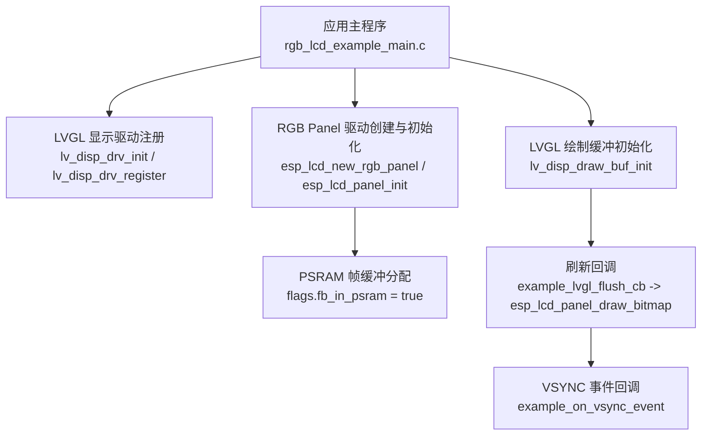
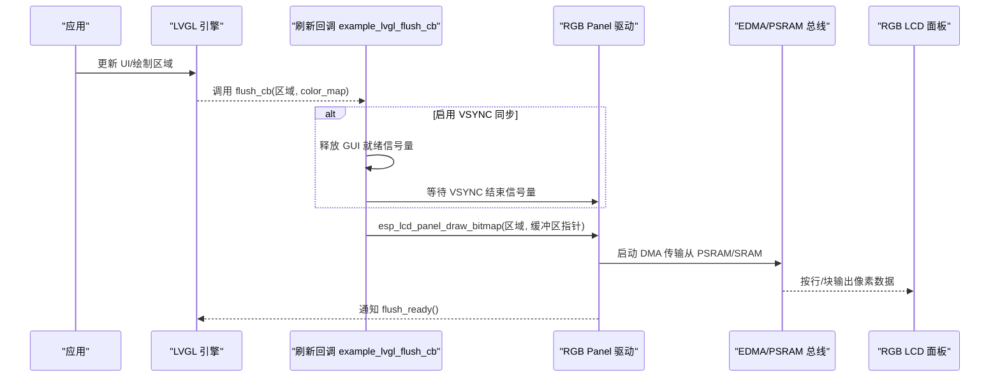
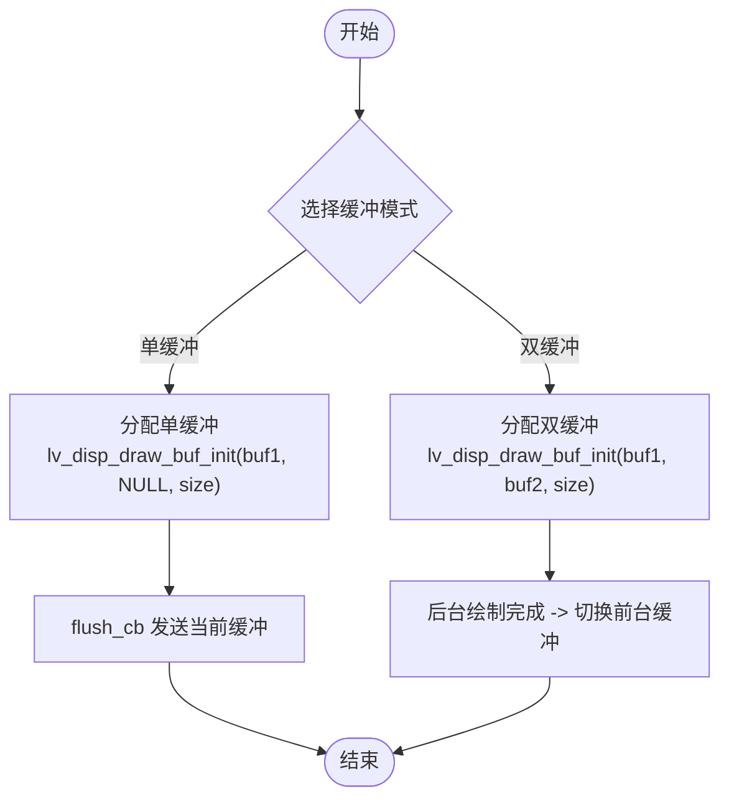
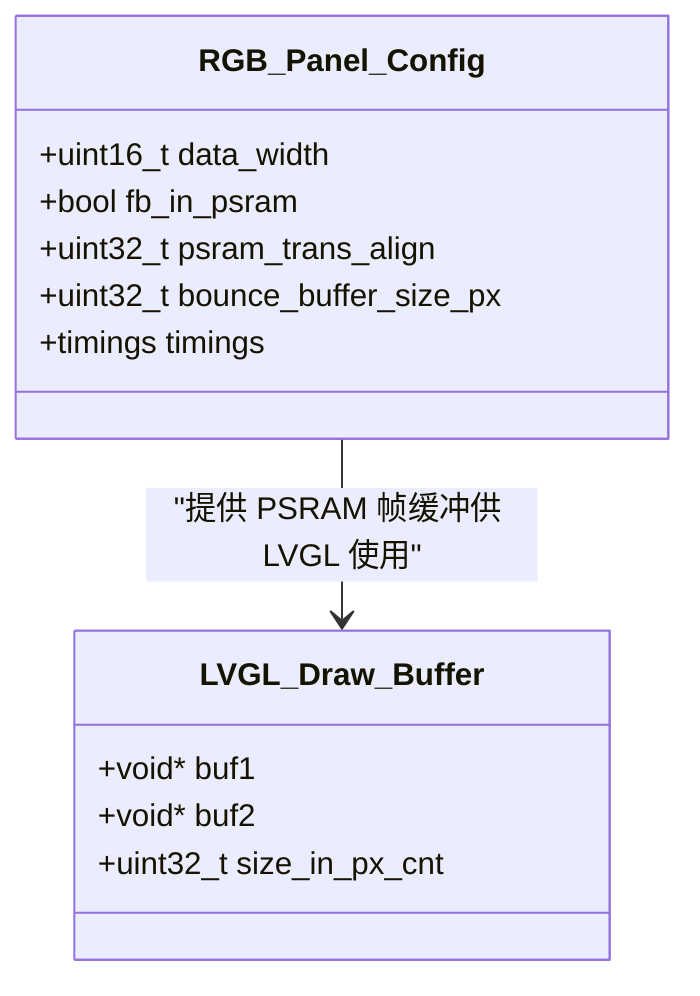
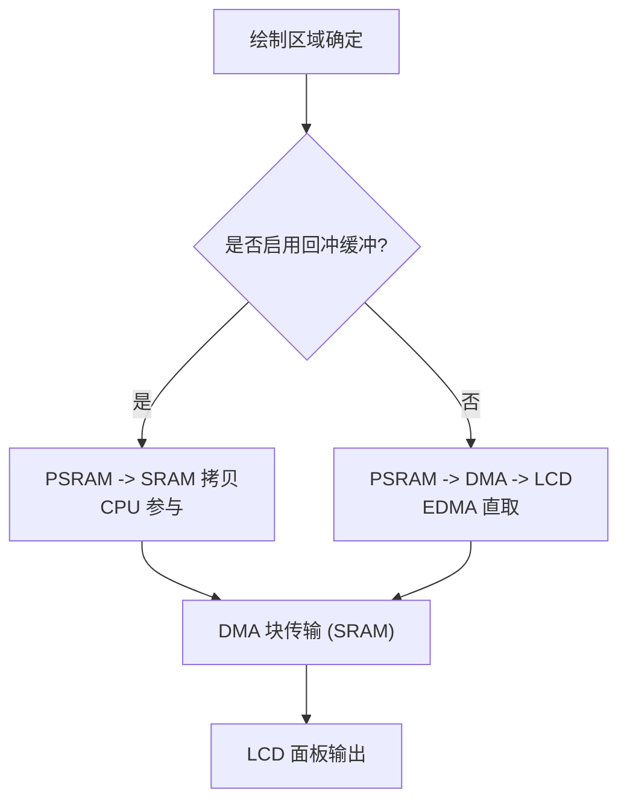
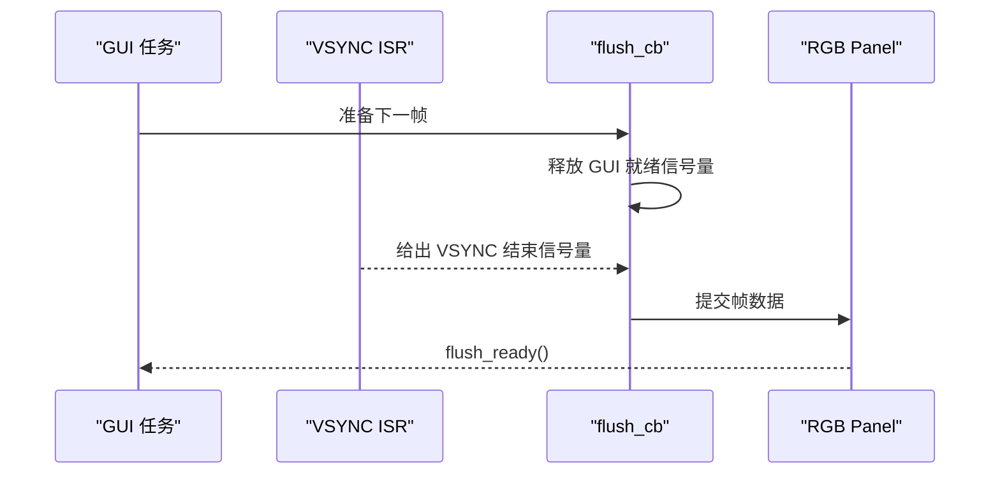
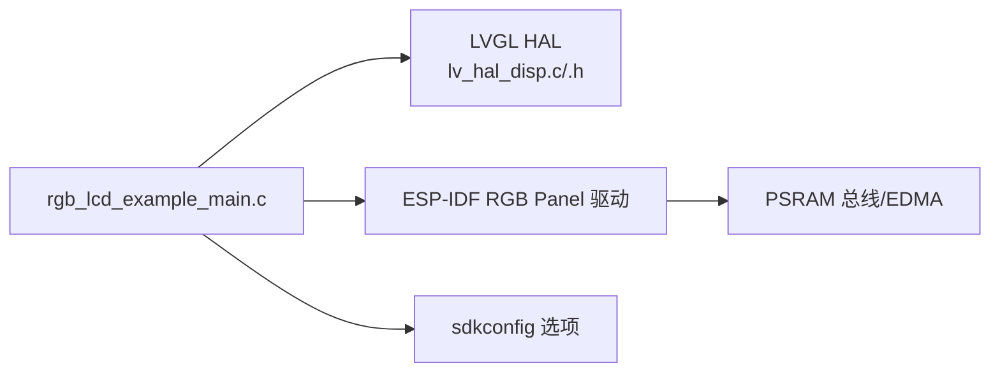

# 帧缓冲管理

<cite>
**本文引用的文件**
- [rgb_lcd_example_main.c](file://ESP32开发板/TK021F2699_ESP32_LVGL_GIF_LED/TK021F2699_ESP32_LVGL_GIF_LED/main/rgb_lcd_example_main.c)
- [LCD.c](file://ESP32开发板/TK021F2699_ESP32_LVGL_GIF_LED/TK021F2699_ESP32_LVGL_GIF_LED/main/LCD.c)
- [LCD.h](file://ESP32开发板/TK021F2699_ESP32_LVGL_GIF_LED/TK021F2699_ESP32_LVGL_GIF_LED/main/LCD.h)
- [lv_hal_disp.c](file://ESP32开发板/TK021F2699_ESP32_LVGL_GIF_LED/TK021F2699_ESP32_LVGL_GIF_LED/managed_components/lvgl__lvgl/src/hal/lv_hal_disp.c)
- [lv_hal_disp.h](file://ESP32开发板/TK021F2699_ESP32_LVGL_GIF_LED/TK021F2699_ESP32_LVGL_GIF_LED/managed_components/lvgl__lvgl/src/hal/lv_hal_disp.h)
- [sdkconfig.defaults.esp32s3](file://ESP32开发板/TK021F2699_ESP32_LVGL_GIF_LED/TK021F2699_ESP32_LVGL_GIF_LED/sdkconfig.defaults.esp32s3)
- [README.md](file://ESP32开发板/TK021F2699_ESP32_LVGL_GIF_LED/TK021F2699_ESP32_LVGL_GIF_LED/README.md)
</cite>

## 目录
1. [简介](#简介)
2. [项目结构](#项目结构)
3. [核心组件](#核心组件)
4. [架构总览](#架构总览)
5. [详细组件分析](#详细组件分析)
6. [依赖关系分析](#依赖关系分析)
7. [性能考量](#性能考量)
8. [故障排查指南](#故障排查指南)
9. [结论](#结论)
10. [附录](#附录)

## 简介
本技术文档围绕 ESP32-S3 + RGB LCD 的帧缓冲（Frame Buffer）管理展开，重点覆盖：
- 单缓冲与双缓冲模式的实现原理、适用场景与性能对比
- PSRAM 帧缓冲分配策略、内存对齐要求与访问优化
- DMA/EDMA 传输配置与使用要点，单次传输与块传输的差异
- 屏幕撕裂效应的成因与消除方法
- 内存使用监控与泄漏检测手段
- 大尺寸图像显示的内存优化技巧与分页加载策略

## 项目结构
本项目在应用层通过 LVGL 驱动 RGB LCD，底层由 ESP-IDF 的 RGB Panel 驱动负责时序与 DMA 传输。关键入口与初始化流程位于主程序文件中，LVGL 显示缓冲初始化接口位于 HAL 层。

图示来源
- [rgb_lcd_example_main.c:181-229](file://ESP32开发板/TK021F2699_ESP32_LVGL_GIF_LED/TK021F2699_ESP32_LVGL_GIF_LED/main/rgb_lcd_example_main.c#L181-L229)
- [rgb_lcd_example_main.c:246-273](file://ESP32开发板/TK021F2699_ESP32_LVGL_GIF_LED/TK021F2699_ESP32_LVGL_GIF_LED/main/rgb_lcd_example_main.c#L246-L273)
- [lv_hal_disp.c:149](file://ESP32开发板/TK021F2699_ESP32_LVGL_GIF_LED/TK021F2699_ESP32_LVGL_GIF_LED/managed_components/lvgl__lvgl/src/hal/lv_hal_disp.c#L149)

章节来源
- [rgb_lcd_example_main.c:150-303](file://ESP32开发板/TK021F2699_ESP32_LVGL_GIF_LED/TK021F2699_ESP32_LVGL_GIF_LED/main/rgb_lcd_example_main.c#L150-L303)
- [lv_hal_disp.c:149](file://ESP32开发板/TK021F2699_ESP32_LVGL_GIF_LED/TK021F2699_ESP32_LVGL_GIF_LED/managed_components/lvgl__lvgl/src/hal/lv_hal_disp.c#L149)

## 核心组件
- LVGL 显示缓冲管理
  - 通过 lv_disp_draw_buf_init 初始化一个或多个绘制缓冲，支持单缓冲或双缓冲模式。
  - 通过 disp_drv.draw_buf 将缓冲绑定到显示驱动。
- RGB Panel 驱动
  - 通过 esp_lcd_new_rgb_panel 创建面板实例，配置像素时钟、时序、数据位宽等。
  - 支持将帧缓冲置于 PSRAM（flags.fb_in_psram），并启用 EDMA 从 PSRAM 直接取数。
- VSYNC 同步机制
  - 可选地通过信号量在 GUI 任务与 VSYNC ISR 间同步，避免撕裂。
- 回冲缓冲（Bounce Buffer）
  - 可选开启 bounce_buffer_size_px，使控制器从内部 SRAM 拉取数据，减少 PSRAM 带宽压力但增加 CPU 拷贝开销。

章节来源
- [lv_hal_disp.c:149](file://ESP32开发板/TK021F2699_ESP32_LVGL_GIF_LED/TK021F2699_ESP32_LVGL_GIF_LED/managed_components/lvgl__lvgl/src/hal/lv_hal_disp.c#L149)
- [lv_hal_disp.h:90-224](file://ESP32开发板/TK021F2699_ESP32_LVGL_GIF_LED/TK021F2699_ESP32_LVGL_GIF_LED/managed_components/lvgl__lvgl/src/hal/lv_hal_disp.h#L90-L224)
- [rgb_lcd_example_main.c:181-229](file://ESP32开发板/TK021F2699_ESP32_LVGL_GIF_LED/TK021F2699_ESP32_LVGL_GIF_LED/main/rgb_lcd_example_main.c#L181-L229)
- [rgb_lcd_example_main.c:246-273](file://ESP32开发板/TK021F2699_ESP32_LVGL_GIF_LED/TK021F2699_ESP32_LVGL_GIF_LED/main/rgb_lcd_example_main.c#L246-L273)
- [rgb_lcd_example_main.c:84-109](file://ESP32开发板/TK021F2699_ESP32_LVGL_GIF_LED/TK021F2699_ESP32_LVGL_GIF_LED/main/rgb_lcd_example_main.c#L84-L109)

## 架构总览
下图展示了从 LVGL 渲染到 RGB 面板输出的完整链路，包括双缓冲切换、VSYNC 同步与 PSRAM 直取路径。

图示来源
- [rgb_lcd_example_main.c:95-109](file://ESP32开发板/TK021F2699_ESP32_LVGL_GIF_LED/TK021F2699_ESP32_LVGL_GIF_LED/main/rgb_lcd_example_main.c#L95-L109)
- [rgb_lcd_example_main.c:84-93](file://ESP32开发板/TK021F2699_ESP32_LVGL_GIF_LED/TK021F2699_ESP32_LVGL_GIF_LED/main/rgb_lcd_example_main.c#L84-L93)
- [rgb_lcd_example_main.c:181-229](file://ESP32开发板/TK021F2699_ESP32_LVGL_GIF_LED/TK021F2699_ESP32_LVGL_GIF_LED/main/rgb_lcd_example_main.c#L181-L229)

## 详细组件分析

### 单缓冲与双缓冲模式
- 单缓冲
  - 仅分配一块绘制缓冲，LVGL 在该缓冲上绘制后，刷新回调将其内容发送到面板。
  - 优点：内存占用小；缺点：若绘制与传输重叠，可能出现撕裂或卡顿。
- 双缓冲
  - 分配两块绘制缓冲，LVGL 在“后台缓冲”绘制，完成后切换到“前台缓冲”进行显示。
  - 配合 full_refresh 标志可确保两缓冲同步一致性。
  - 优点：降低撕裂风险、提升流畅度；缺点：内存占用翻倍。

图示来源
- [rgb_lcd_example_main.c:249-261](file://ESP32开发板/TK021F2699_ESP32_LVGL_GIF_LED/TK021F2699_ESP32_LVGL_GIF_LED/main/rgb_lcd_example_main.c#L249-L261)
- [rgb_lcd_example_main.c:270-272](file://ESP32开发板/TK021F2699_ESP32_LVGL_GIF_LED/TK021F2699_ESP32_LVGL_GIF_LED/main/rgb_lcd_example_main.c#L270-L272)
- [lv_hal_disp.c:149](file://ESP32开发板/TK021F2699_ESP32_LVGL_GIF_LED/TK021F2699_ESP32_LVGL_GIF_LED/managed_components/lvgl__lvgl/src/hal/lv_hal_disp.c#L149)

章节来源
- [rgb_lcd_example_main.c:249-272](file://ESP32开发板/TK021F2699_ESP32_LVGL_GIF_LED/TK021F2699_ESP32_LVGL_GIF_LED/main/rgb_lcd_example_main.c#L249-L272)
- [lv_hal_disp.c:149](file://ESP32开发板/TK021F2699_ESP32_LVGL_GIF_LED/TK021F2699_ESP32_LVGL_GIF_LED/managed_components/lvgl__lvgl/src/hal/lv_hal_disp.c#L149)

### PSRAM 帧缓冲分配策略与内存对齐
- 分配位置
  - 当 flags.fb_in_psram = true 时，RGB 面板驱动会在 PSRAM 中分配帧缓冲，并由 EDMA 直接从 PSRAM 读取数据，降低内部 SRAM 占用。
  - 也可在应用层通过 heap_caps_malloc(..., MALLOC_CAP_SPIRAM) 为 LVGL 绘制缓冲单独分配 PSRAM 空间。
- 对齐与传输优化
  - psram_trans_align 用于指定 PSRAM 传输对齐大小（示例为 64 字节），有助于提高 DMA 吞吐。
  - SDK 默认启用 SPIRAM 指令/只读数据取指优化，有利于在 PSRAM 运行时的整体性能。
- 注意事项
  - PSRAM 带宽有限，高 PCLK 下需关注总线拥塞与抖动。
  - 大块连续分配可能受碎片影响，必要时分块或调整对齐。

图示来源
- [rgb_lcd_example_main.c:181-229](file://ESP32开发板/TK021F2699_ESP32_LVGL_GIF_LED/TK021F2699_ESP32_LVGL_GIF_LED/main/rgb_lcd_example_main.c#L181-L229)
- [rgb_lcd_example_main.c:256-261](file://ESP32开发板/TK021F2699_ESP32_LVGL_GIF_LED/TK021F2699_ESP32_LVGL_GIF_LED/main/rgb_lcd_example_main.c#L256-L261)
- [sdkconfig.defaults.esp32s3:1-9](file://ESP32开发板/TK021F2699_ESP32_LVGL_GIF_LED/TK021F2699_ESP32_LVGL_GIF_LED/sdkconfig.defaults.esp32s3#L1-L9)

章节来源
- [rgb_lcd_example_main.c:181-229](file://ESP32开发板/TK021F2699_ESP32_LVGL_GIF_LED/TK021F2699_ESP32_LVGL_GIF_LED/main/rgb_lcd_example_main.c#L181-L229)
- [rgb_lcd_example_main.c:256-261](file://ESP32开发板/TK021F2699_ESP32_LVGL_GIF_LED/TK021F2699_ESP32_LVGL_GIF_LED/main/rgb_lcd_example_main.c#L256-L261)
- [sdkconfig.defaults.esp32s3:1-9](file://ESP32开发板/TK021F2699_ESP32_LVGL_GIF_LED/TK021F2699_ESP32_LVGL_GIF_LED/sdkconfig.defaults.esp32s3#L1-L9)

### DMA 传输配置与使用（单次 vs 块传输）
- 配置要点
  - 通过 rgb panel 配置的 timings 与 data_gpio_nums 定义像素时钟与并行数据宽度（如 16bit）。
  - psram_trans_align 控制 PSRAM 传输对齐，利于 DMA 批量搬运。
- 单次传输与块传输差异
  - 单次传输：每次 draw_bitmap 对应一次 DMA 请求，适合小区域增量刷新，延迟低但频繁触发中断/状态机切换。
  - 块传输：将多行或多区域合并为较大块，减少 DMA 启动次数，提高吞吐，但需要更大的临时缓冲或更复杂的调度。
- 回冲缓冲（Bounce Buffer）
  - 启用 bounce_buffer_size_px 后，控制器从内部 SRAM 拉取数据，CPU 需先将 PSRAM 数据拷贝至 SRAM，降低 PSRAM 带宽压力，但增加 CPU 负载。

图示来源
- [rgb_lcd_example_main.c:181-229](file://ESP32开发板/TK021F2699_ESP32_LVGL_GIF_LED/TK021F2699_ESP32_LVGL_GIF_LED/main/rgb_lcd_example_main.c#L181-L229)
- [README.md:115](file://ESP32开发板/TK021F2699_ESP32_LVGL_GIF_LED/TK021F2699_ESP32_LVGL_GIF_LED/README.md#L115)

章节来源
- [rgb_lcd_example_main.c:181-229](file://ESP32开发板/TK021F2699_ESP32_LVGL_GIF_LED/TK021F2699_ESP32_LVGL_GIF_LED/main/rgb_lcd_example_main.c#L181-L229)
- [README.md:115](file://ESP32开发板/TK021F2699_ESP32_LVGL_GIF_LED/TK021F2699_ESP32_LVGL_GIF_LED/README.md#L115)

### 屏幕撕裂效应与消除技术
- 产生原因
  - 当 LVGL 正在向“前台缓冲”写入新帧，而面板同时从该缓冲读取旧帧时，会出现上半屏旧内容、下半屏新内容的撕裂现象。
- 消除方法
  - 双缓冲 + 全屏刷新：在双缓冲模式下设置 full_refresh，保证两缓冲同步切换。
  - VSYNC 同步：在 flush_cb 中通过信号量等待 VSYNC 结束再提交下一帧，避免在扫描过程中更新可见区域。
  - 局部刷新优化：尽量减小脏矩形面积，降低与扫描窗口冲突的概率。

图示来源
- [rgb_lcd_example_main.c:84-93](file://ESP32开发板/TK021F2699_ESP32_LVGL_GIF_LED/TK021F2699_ESP32_LVGL_GIF_LED/main/rgb_lcd_example_main.c#L84-L93)
- [rgb_lcd_example_main.c:95-109](file://ESP32开发板/TK021F2699_ESP32_LVGL_GIF_LED/TK021F2699_ESP32_LVGL_GIF_LED/main/rgb_lcd_example_main.c#L95-L109)
- [rgb_lcd_example_main.c:270-272](file://ESP32开发板/TK021F2699_ESP32_LVGL_GIF_LED/TK021F2699_ESP32_LVGL_GIF_LED/main/rgb_lcd_example_main.c#L270-L272)

章节来源
- [rgb_lcd_example_main.c:84-109](file://ESP32开发板/TK021F2699_ESP32_LVGL_GIF_LED/TK021F2699_ESP32_LVGL_GIF_LED/main/rgb_lcd_example_main.c#L84-L109)
- [rgb_lcd_example_main.c:270-272](file://ESP32开发板/TK021F2699_ESP32_LVGL_GIF_LED/TK021F2699_ESP32_LVGL_GIF_LED/main/rgb_lcd_example_main.c#L270-L272)

### 内存使用监控与泄漏检测
- LVGL 性能监控
  - 启用 CONFIG_LV_USE_PERF_MONITOR 可在运行时查看内存与性能指标，辅助定位瓶颈。
- 堆栈与 PSRAM 监控
  - 使用 ESP-IDF 提供的 heap 统计 API 与 FreeRTOS 任务栈检查工具，观察 PSRAM 分配与释放情况。
- 常见泄漏点
  - 未释放 LVGL 对象或自定义资源；重复分配 PSRAM 而未 free；回调中持有长生命周期引用导致无法回收。

章节来源
- [sdkconfig.defaults:1-6](file://ESP32开发板/TK021F2699_ESP32_LVGL_GIF_LED/TK021F2699_ESP32_LVGL_GIF_LED/sdkconfig.defaults#L1-L6)

### 大尺寸图像显示的内存优化与分页加载
- 内存优化技巧
  - 使用压缩格式（如 SJPEG）按需解码，避免整图常驻内存。
  - 采用降采样或分块渲染，减少一次性占用的帧缓冲大小。
  - 合理设置 LV_COLOR_DEPTH，平衡画质与内存占用。
- 分页加载策略
  - 将大图划分为若干 tile，按视口可见范围动态加载与卸载，结合 LVGL 的缓存机制减少重复解码。
  - 对滚动/缩放场景，预取相邻页以提升交互流畅性。

章节来源
- [lv_sjpg.c:755-828](file://ESP32开发板/TK021F2699_ESP32_LVGL_GIF_LED/TK021F2699_ESP32_LVGL_GIF_LED/managed_components/lvgl__lvgl/src/extra/libs/sjpg/lv_sjpg.c#L755-L828)

## 依赖关系分析
- 应用层依赖 LVGL 的显示缓冲与驱动接口，并通过刷新回调与 ESP-IDF 的 RGB Panel 驱动交互。
- RGB Panel 驱动依赖 ESP-IDF 的 GPIO、定时器与 DMA 子系统，以及 PSRAM 总线。
- 配置项（如双缓冲、回冲缓冲、VSYNC 同步）通过 Kconfig/sdkconfig 控制编译期行为。

图示来源
- [rgb_lcd_example_main.c:181-229](file://ESP32开发板/TK021F2699_ESP32_LVGL_GIF_LED/TK021F2699_ESP32_LVGL_GIF_LED/main/rgb_lcd_example_main.c#L181-L229)
- [lv_hal_disp.c:149](file://ESP32开发板/TK021F2699_ESP32_LVGL_GIF_LED/TK021F2699_ESP32_LVGL_GIF_LED/managed_components/lvgl__lvgl/src/hal/lv_hal_disp.c#L149)
- [lv_hal_disp.h:90-224](file://ESP32开发板/TK021F2699_ESP32_LVGL_GIF_LED/TK021F2699_ESP32_LVGL_GIF_LED/managed_components/lvgl__lvgl/src/hal/lv_hal_disp.h#L90-L224)

章节来源
- [rgb_lcd_example_main.c:181-229](file://ESP32开发板/TK021F2699_ESP32_LVGL_GIF_LED/TK021F2699_ESP32_LVGL_GIF_LED/main/rgb_lcd_example_main.c#L181-L229)
- [lv_hal_disp.c:149](file://ESP32开发板/TK021F2699_ESP32_LVGL_GIF_LED/TK021F2699_ESP32_LVGL_GIF_LED/managed_components/lvgl__lvgl/src/hal/lv_hal_disp.c#L149)
- [lv_hal_disp.h:90-224](file://ESP32开发板/TK021F2699_ESP32_LVGL_GIF_LED/TK021F2699_ESP32_LVGL_GIF_LED/managed_components/lvgl__lvgl/src/hal/lv_hal_disp.h#L90-L224)

## 性能考量
- 缓冲模式选择
  - 双缓冲更适合高刷新率与复杂 UI，但内存占用翻倍；单缓冲适合资源受限场景。
- PSRAM 带宽与对齐
  - 增大 psram_trans_align 可减少 DMA 启动次数，提高吞吐；注意对齐边界与内存碎片。
- 回冲缓冲权衡
  - 启用 bounce buffer 可降低 PSRAM 压力，但引入 CPU 拷贝成本；根据系统负载与目标帧率调优。
- 局部刷新与脏矩形
  - 尽量缩小刷新区域，减少 DMA 传输量与总线竞争。
- 时钟与时序
  - 合理设置 pclk_hz 与时序参数，避免过高的像素时钟导致不稳定。

[本节为通用指导，不直接分析具体文件]

## 故障排查指南
- 无显示或花屏
  - 检查 RGB 引脚映射与时序参数是否正确；确认背光控制与复位序列。
- 撕裂明显
  - 启用 VSYNC 同步或双缓冲 + full_refresh；检查 flush_cb 中的同步逻辑。
- 卡顿或掉帧
  - 评估 PSRAM 带宽瓶颈，考虑启用 bounce buffer 或降低分辨率/颜色深度；减少一次性绘制区域。
- 内存不足或崩溃
  - 检查 PSRAM 分配是否成功；监控堆使用，避免重复分配与泄漏。

章节来源
- [LCD.c:186-204](file://ESP32开发板/TK021F2699_ESP32_LVGL_GIF_LED/TK021F2699_ESP32_LVGL_GIF_LED/main/LCD.c#L186-L204)
- [LCD.h:12-26](file://ESP32开发板/TK021F2699_ESP32_LVGL_GIF_LED/TK021F2699_ESP32_LVGL_GIF_LED/main/LCD.h#L12-L26)
- [rgb_lcd_example_main.c:84-109](file://ESP32开发板/TK021F2699_ESP32_LVGL_GIF_LED/TK021F2699_ESP32_LVGL_GIF_LED/main/rgb_lcd_example_main.c#L84-L109)

## 结论
通过在应用层合理配置 LVGL 显示缓冲与刷新回调，并结合 ESP-IDF RGB Panel 驱动的 PSRAM 直取与可选回冲缓冲机制，可以在 ESP32-S3 平台上实现稳定高效的 LCD 帧缓冲管理。针对撕裂问题，建议优先采用双缓冲与 VSYNC 同步；针对大图像与高刷新场景，应结合压缩解码、分页加载与局部刷新策略，以在内存与性能之间取得平衡。

[本节为总结性内容，不直接分析具体文件]

## 附录
- 相关配置项说明
  - CONFIG_EXAMPLE_DOUBLE_FB：启用双缓冲模式
  - CONFIG_EXAMPLE_AVOID_TEAR_EFFECT_WITH_SEM：启用 VSYNC 同步避免撕裂
  - CONFIG_EXAMPLE_USE_BOUNCE_BUFFER：启用回冲缓冲，降低 PSRAM 带宽压力
  - CONFIG_LV_USE_PERF_MONITOR：启用 LVGL 性能监控
- 参考文件
  - [sdkconfig.defaults.esp32s3](file://ESP32开发板/TK021F2699_ESP32_LVGL_GIF_LED/TK021F2699_ESP32_LVGL_GIF_LED/sdkconfig.defaults.esp32s3)
  - [README.md](file://ESP32开发板/TK021F2699_ESP32_LVGL_GIF_LED/TK021F2699_ESP32_LVGL_GIF_LED/README.md)

章节来源
- [sdkconfig.defaults:1-6](file://ESP32开发板/TK021F2699_ESP32_LVGL_GIF_LED/TK021F2699_ESP32_LVGL_GIF_LED/sdkconfig.defaults#L1-L6)
- [README.md:115](file://ESP32开发板/TK021F2699_ESP32_LVGL_GIF_LED/TK021F2699_ESP32_LVGL_GIF_LED/README.md#L115)