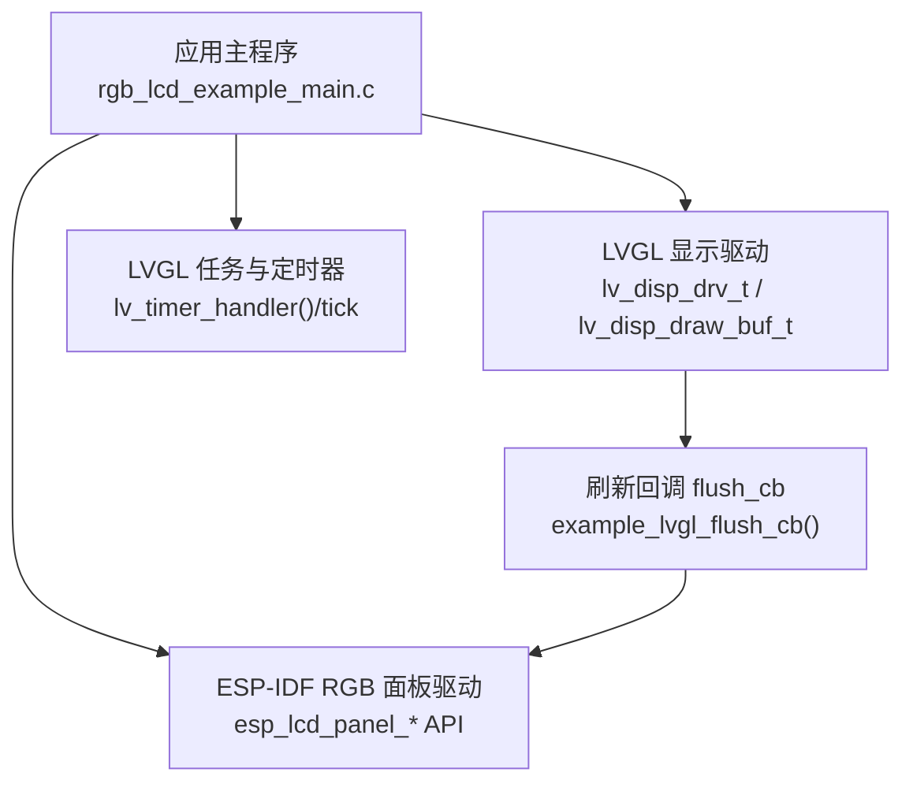
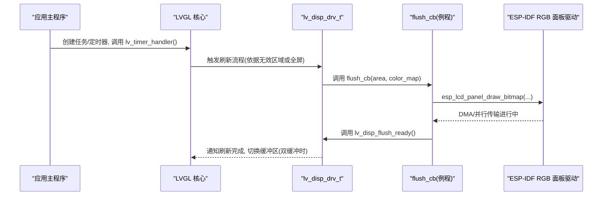
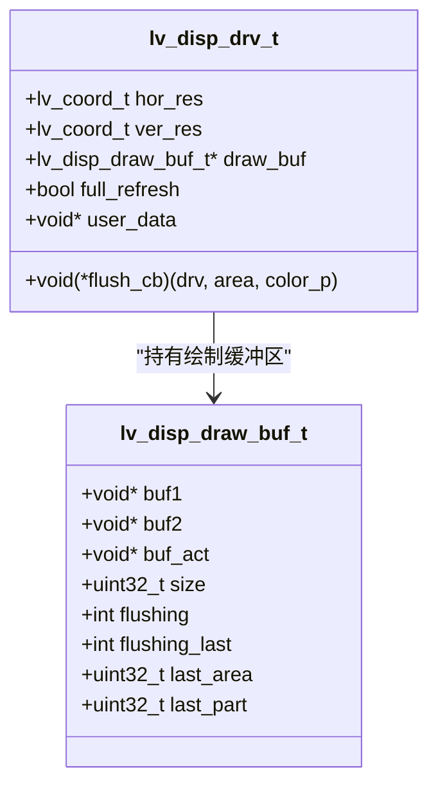
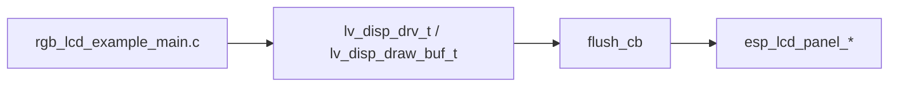

# 缓冲模式配置

<cite>
**本文引用的文件**   
- [rgb_lcd_example_main.c](file://ESP32开发板/TK021F2699_ESP32_LVGL_GIF_LED/TK021F2699_ESP32_LVGL_GIF_LED/main/rgb_lcd_example_main.c)
- [lv_hal_disp.h](file://ESP32开发板/TK021F2699_ESP32_LVGL_GIF_LED/TK021F2699_ESP32_LVGL_GIF_LED/managed_components/lvgl__lvgl/src/hal/lv_hal_disp.h)
- [lv_hal_disp.c](file://ESP32开发板/TK021F2699_ESP32_LVGL_GIF_LED/TK021F2699_ESP32_LVGL_GIF_LED/managed_components/lvgl__lvgl/src/hal/lv_hal_disp.c)
</cite>

## 目录
1. [简介](#简介)
2. [项目结构](#项目结构)
3. [核心组件](#核心组件)
4. [架构总览](#架构总览)
5. [详细组件分析](#详细组件分析)
6. [依赖关系分析](#依赖关系分析)
7. [性能与内存考量](#性能与内存考量)
8. [故障排查指南](#故障排查指南)
9. [结论](#结论)
10. [附录：配置步骤与示例路径](#附录配置步骤与示例路径)

## 简介
本技术文档围绕 LCD 缓冲模式配置，系统阐述单缓冲与双缓冲的实现原理、性能差异与适用场景；详细说明 LVGL 显示驱动中 lv_disp_drv_t 的配置方法（缓冲区指针设置、缓冲区大小计算、刷新回调函数配置）；分析不同缓冲模式对内存占用的影响，给出内存占用计算公式与优化建议；并提供具体代码示例路径，帮助在实际项目中选择合适的缓冲策略。

## 项目结构
本项目基于 ESP-IDF + LVGL，使用 RGB LCD 面板驱动，并通过 LVGL 的显示驱动接口完成 UI 渲染与刷新。关键入口位于应用主程序，负责初始化硬件、分配 LVGL 绘制缓冲区、注册刷新回调并启动 LVGL 任务。

图表来源 
- [rgb_lcd_example_main.c:150-303](file://ESP32开发板/TK021F2699_ESP32_LVGL_GIF_LED/TK021F2699_ESP32_LVGL_GIF_LED/main/rgb_lcd_example_main.c#L150-L303)
- [lv_hal_disp.h:78-153](file://ESP32开发板/TK021F2699_ESP32_LVGL_GIF_LED/TK021F2699_ESP32_LVGL_GIF_LED/managed_components/lvgl__lvgl/src/hal/lv_hal_disp.h#L78-L153)
- [lv_hal_disp.c:150-158](file://ESP32开发板/TK021F2699_ESP32_LVGL_GIF_LED/TK021F2699_ESP32_LVGL_GIF_LED/managed_components/lvgl__lvgl/src/hal/lv_hal_disp.c#L150-L158)

章节来源
- [rgb_lcd_example_main.c:150-303](file://ESP32开发板/TK021F2699_ESP32_LVGL_GIF_LED/TK021F2699_ESP32_LVGL_GIF_LED/main/rgb_lcd_example_main.c#L150-L303)

## 核心组件
- LVGL 显示驱动结构体 lv_disp_drv_t：包含分辨率、刷新回调、绘制缓冲区指针等关键配置项。
- LVGL 绘制缓冲区结构体 lv_disp_draw_buf_t：维护两个缓冲区指针（buf1/buf2）、当前活动缓冲区指针、像素计数等。
- 应用层刷新回调 example_lvgl_flush_cb：将 LVGL 绘制的像素数据通过 ESP-IDF 的 RGB 面板驱动写入屏幕。

章节来源
- [lv_hal_disp.h:78-153](file://ESP32开发板/TK021F2699_ESP32_LVGL_GIF_LED/TK021F2699_ESP32_LVGL_GIF_LED/managed_components/lvgl__lvgl/src/hal/lv_hal_disp.h#L78-L153)
- [lv_hal_disp.h:51-64](file://ESP32开发板/TK021F2699_ESP32_LVGL_GIF_LED/TK021F2699_ESP32_LVGL_GIF_LED/managed_components/lvgl__lvgl/src/hal/lv_hal_disp.h#L51-L64)
- [rgb_lcd_example_main.c:95-109](file://ESP32开发板/TK021F2699_ESP32_LVGL_GIF_LED/TK021F2699_ESP32_LVGL_GIF_LED/main/rgb_lcd_example_main.c#L95-L109)

## 架构总览
下图展示了从 LVGL 渲染到屏幕刷新的完整调用链，以及单/双缓冲在其中的作用位置。

图表来源 
- [rgb_lcd_example_main.c:95-109](file://ESP32开发板/TK021F2699_ESP32_LVGL_GIF_LED/TK021F2699_ESP32_LVGL_GIF_LED/main/rgb_lcd_example_main.c#L95-L109)
- [lv_hal_disp.c:519-523](file://ESP32开发板/TK021F2699_ESP32_LVGL_GIF_LED/TK021F2699_ESP32_LVGL_GIF_LED/managed_components/lvgl__lvgl/src/hal/lv_hal_disp.c#L519-L523)

## 详细组件分析

### 单缓冲与双缓冲实现原理
- 单缓冲模式
  - 仅使用一个绘制缓冲区 buf1，LVGL 在该缓冲区上绘制，随后由 flush_cb 将该缓冲区内容发送到屏幕。
  - 适用于内存受限或不需要并行渲染/传输的场景。
- 双缓冲模式
  - 使用两个缓冲区 buf1 和 buf2，LVGL 在一个缓冲区绘制，同时另一个缓冲区可被 flush_cb 通过 DMA 等方式并行传输至屏幕，从而提升吞吐与帧率。
  - 需要确保 flush_cb 能异步传输并在完成后调用 lv_disp_flush_ready()，以便 LVGL 安全切换缓冲区。

章节来源
- [lv_hal_disp.h:51-64](file://ESP32开发板/TK021F2699_ESP32_LVGL_GIF_LED/TK021F2699_ESP32_LVGL_GIF_LED/managed_components/lvgl__lvgl/src/hal/lv_hal_disp.h#L51-L64)
- [lv_hal_disp.c:150-158](file://ESP32开发板/TK021F2699_ESP32_LVGL_GIF_LED/TK021F2699_ESP32_LVGL_GIF_LED/managed_components/lvgl__lvgl/src/hal/lv_hal_disp.c#L150-L158)
- [rgb_lcd_example_main.c:95-109](file://ESP32开发板/TK021F2699_ESP32_LVGL_GIF_LED/TK021F2699_ESP32_LVGL_GIF_LED/main/rgb_lcd_example_main.c#L95-L109)

### lv_disp_drv_t 配置要点
- 分辨率设置：hor_res、ver_res 需与实际屏幕一致。
- 刷新回调：flush_cb 必须实现，并在传输完成后调用 lv_disp_flush_ready()。
- 绘制缓冲区：draw_buf 指向已初始化的 lv_disp_draw_buf_t。
- 全屏刷新：full_refresh 为 true 时要求 draw_buf 至少容纳整屏像素，否则会被内核强制关闭并告警。
- user_data：用于传递底层面板句柄给 flush_cb。

章节来源
- [lv_hal_disp.h:78-153](file://ESP32开发板/TK021F2699_ESP32_LVGL_GIF_LED/TK021F2699_ESP32_LVGL_GIF_LED/managed_components/lvgl__lvgl/src/hal/lv_hal_disp.h#L78-L153)
- [lv_hal_disp.c:202-205](file://ESP32开发板/TK021F2699_ESP32_LVGL_GIF_LED/TK021F2699_ESP32_LVGL_GIF_LED/managed_components/lvgl__lvgl/src/hal/lv_hal_disp.c#L202-L205)
- [rgb_lcd_example_main.c:263-273](file://ESP32开发板/TK021F2699_ESP32_LVGL_GIF_LED/TK021F2699_ESP32_LVGL_GIF_LED/main/rgb_lcd_example_main.c#L263-L273)

### 缓冲区指针与大小计算
- 缓冲区指针
  - 单缓冲：buf1 有效，buf2 置 NULL。
  - 双缓冲：buf1 与 buf2 均指向可用内存块。
- 缓冲区大小
  - size_in_px_cnt 以“像素个数”为单位，通常为 hor_res × ver_res（全屏）或按行分块的较小值（部分刷新）。
  - 字节数 = size_in_px_cnt × sizeof(lv_color_t)。
- 初始化
  - 使用 lv_disp_draw_buf_init(draw_buf, buf1, buf2, size_in_px_cnt) 完成初始化。

章节来源
- [lv_hal_disp.h:210-225](file://ESP32开发板/TK021F2699_ESP32_LVGL_GIF_LED/TK021F2699_ESP32_LVGL_GIF_LED/managed_components/lvgl__lvgl/src/hal/lv_hal_disp.h#L210-L225)
- [lv_hal_disp.c:150-158](file://ESP32开发板/TK021F2699_ESP32_LVGL_GIF_LED/TK021F2699_ESP32_LVGL_GIF_LED/managed_components/lvgl__lvgl/src/hal/lv_hal_disp.c#L150-L158)
- [rgb_lcd_example_main.c:248-261](file://ESP32开发板/TK021F2699_ESP32_LVGL_GIF_LED/TK021F2699_ESP32_LVGL_GIF_LED/main/rgb_lcd_example_main.c#L248-L261)

### 刷新回调函数配置
- 回调签名：void (*flush_cb)(lv_disp_drv_t * drv, const lv_area_t * area, lv_color_t * color_p)
- 典型实现
  - 解析 area 得到偏移与宽高。
  - 调用底层面板驱动进行位图绘制（如 esp_lcd_panel_draw_bitmap）。
  - 完成后调用 lv_disp_flush_ready(drv) 通知 LVGL。
- 防撕裂同步（可选）
  - 可通过 VSYNC 事件与信号量协调 GUI 任务与刷新时序，避免画面撕裂。

章节来源
- [lv_hal_disp.h:105-108](file://ESP32开发板/TK021F2699_ESP32_LVGL_GIF_LED/TK021F2699_ESP32_LVGL_GIF_LED/managed_components/lvgl__lvgl/src/hal/lv_hal_disp.h#L105-L108)
- [rgb_lcd_example_main.c:84-109](file://ESP32开发板/TK021F2699_ESP32_LVGL_GIF_LED/TK021F2699_ESP32_LVGL_GIF_LED/main/rgb_lcd_example_main.c#L84-L109)

### 类图：LVGL 显示驱动相关结构体

图表来源 
- [lv_hal_disp.h:51-64](file://ESP32开发板/TK021F2699_ESP32_LVGL_GIF_LED/TK021F2699_ESP32_LVGL_GIF_LED/managed_components/lvgl__lvgl/src/hal/lv_hal_disp.h#L51-L64)
- [lv_hal_disp.h:78-153](file://ESP32开发板/TK021F2699_ESP32_LVGL_GIF_LED/TK021F2699_ESP32_LVGL_GIF_LED/managed_components/lvgl__lvgl/src/hal/lv_hal_disp.h#L78-L153)

## 依赖关系分析
- 应用主程序依赖 LVGL 的显示驱动接口与 ESP-IDF 的 RGB 面板驱动。
- LVGL 内部根据 draw_buf 的 buf1/buf2 与 size 决定渲染与刷新策略。
- flush_cb 作为桥接点，将 LVGL 的像素数据传递给底层面板驱动。

图表来源 
- [rgb_lcd_example_main.c:150-303](file://ESP32开发板/TK021F2699_ESP32_LVGL_GIF_LED/TK021F2699_ESP32_LVGL_GIF_LED/main/rgb_lcd_example_main.c#L150-L303)
- [lv_hal_disp.h:78-153](file://ESP32开发板/TK021F2699_ESP32_LVGL_GIF_LED/TK021F2699_ESP32_LVGL_GIF_LED/managed_components/lvgl__lvgl/src/hal/lv_hal_disp.h#L78-L153)

章节来源
- [rgb_lcd_example_main.c:150-303](file://ESP32开发板/TK021F2699_ESP32_LVGL_GIF_LED/TK021F2699_ESP32_LVGL_GIF_LED/main/rgb_lcd_example_main.c#L150-L303)

## 性能与内存考量

### 单缓冲 vs 双缓冲对比
- 单缓冲
  - 优点：内存占用低，实现简单。
  - 缺点：渲染与传输串行，可能限制帧率；若 flush_cb 阻塞，UI 会卡顿。
- 双缓冲
  - 优点：渲染与传输可并行，提高吞吐与流畅度；适合高刷新率或复杂界面。
  - 缺点：内存占用翻倍；需正确管理缓冲区切换与同步。

### 内存占用计算公式
- 单缓冲内存（字节）= hor_res × ver_res × sizeof(lv_color_t)
- 双缓冲内存（字节）= 2 × hor_res × ver_res × sizeof(lv_color_t)
- 说明：size_in_px_cnt 以像素个数计，实际字节数需乘以每像素字节数（由颜色深度决定）。

章节来源
- [lv_hal_disp.h:210-225](file://ESP32开发板/TK021F2699_ESP32_LVGL_GIF_LED/TK021F2699_ESP32_LVGL_GIF_LED/managed_components/lvgl__lvgl/src/hal/lv_hal_disp.h#L210-L225)
- [lv_hal_disp.c:150-158](file://ESP32开发板/TK021F2699_ESP32_LVGL_GIF_LED/TK021F2699_ESP32_LVGL_GIF_LED/managed_components/lvgl__lvgl/src/hal/lv_hal_disp.c#L150-L158)

### 优化建议
- 内存紧张时采用单缓冲，或将 draw_buf 分配到外部 PSRAM（示例中启用 fb_in_psram）。
- 需要高帧率时使用双缓冲，并确保 flush_cb 使用 DMA 或硬件加速进行后台传输。
- 若使用 full_refresh，请保证 draw_buf 至少容纳整屏像素，否则内核会禁用该模式并输出警告。
- 合理设置刷新区域（非全屏），减少每次传输的数据量。

章节来源
- [rgb_lcd_example_main.c:227-229](file://ESP32开发板/TK021F2699_ESP32_LVGL_GIF_LED/TK021F2699_ESP32_LVGL_GIF_LED/main/rgb_lcd_example_main.c#L227-L229)
- [lv_hal_disp.c:202-205](file://ESP32开发板/TK021F2699_ESP32_LVGL_GIF_LED/TK021F2699_ESP32_LVGL_GIF_LED/managed_components/lvgl__lvgl/src/hal/lv_hal_disp.c#L202-L205)

## 故障排查指南
- 现象：开启 full_refresh 后出现警告且模式被禁用
  - 原因：draw_buf 大小不足整屏像素
  - 处理：增大 draw_buf 的 size_in_px_cnt 或使用全屏缓冲区
- 现象：画面撕裂
  - 原因：GUI 渲染与面板扫描不同步
  - 处理：启用 VSYNC 事件与信号量同步（示例中提供开关）
- 现象：刷新卡顿
  - 原因：flush_cb 未异步传输或未调用 lv_disp_flush_ready()
  - 处理：使用 DMA/硬件通道后台传输，并在完成后调用 lv_disp_flush_ready()

章节来源
- [lv_hal_disp.c:202-205](file://ESP32开发板/TK021F2699_ESP32_LVGL_GIF_LED/TK021F2699_ESP32_LVGL_GIF_LED/managed_components/lvgl__lvgl/src/hal/lv_hal_disp.c#L202-L205)
- [rgb_lcd_example_main.c:84-109](file://ESP32开发板/TK021F2699_ESP32_LVGL_GIF_LED/TK021F2699_ESP32_LVGL_GIF_LED/main/rgb_lcd_example_main.c#L84-L109)
- [lv_hal_disp.c:519-523](file://ESP32开发板/TK021F2699_ESP32_LVGL_GIF_LED/TK021F2699_ESP32_LVGL_GIF_LED/managed_components/lvgl__lvgl/src/hal/lv_hal_disp.c#L519-L523)

## 结论
- 单缓冲适合资源受限场景，双缓冲适合高性能需求。
- 正确配置 lv_disp_drv_t 与 lv_disp_draw_buf_t 是稳定运行的基础。
- 通过 DMA/硬件加速与 VSYNC 同步，可显著提升刷新性能与画面质量。
- 内存公式与优化建议有助于在项目初期做出合理的缓冲策略选择。

## 附录：配置步骤与示例路径
- 初始化 LVGL 与显示驱动
  - 参考路径：[rgb_lcd_example_main.c:246-273](file://ESP32开发板/TK021F2699_ESP32_LVGL_GIF_LED/TK021F2699_ESP32_LVGL_GIF_LED/main/rgb_lcd_example_main.c#L246-L273)
- 分配绘制缓冲区（单/双缓冲）
  - 参考路径：[rgb_lcd_example_main.c:248-261](file://ESP32开发板/TK021F2699_ESP32_LVGL_GIF_LED/TK021F2699_ESP32_LVGL_GIF_LED/main/rgb_lcd_example_main.c#L248-L261)
- 注册刷新回调
  - 参考路径：[rgb_lcd_example_main.c:95-109](file://ESP32开发板/TK021F2699_ESP32_LVGL_GIF_LED/TK021F2699_ESP32_LVGL_GIF_LED/main/rgb_lcd_example_main.c#L95-L109)
- 防撕裂同步（可选）
  - 参考路径：[rgb_lcd_example_main.c:84-93](file://ESP32开发板/TK021F2699_ESP32_LVGL_GIF_LED/TK021F2699_ESP32_LVGL_GIF_LED/main/rgb_lcd_example_main.c#L84-L93)