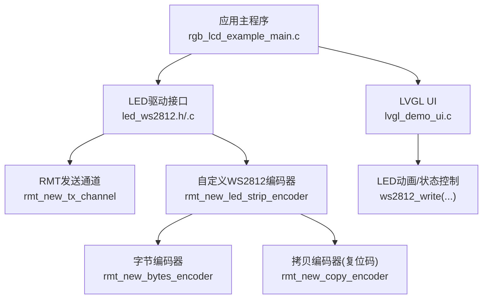
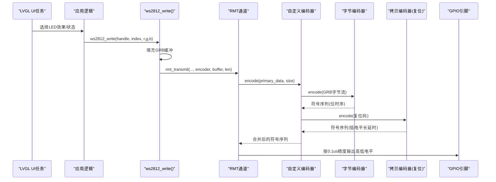
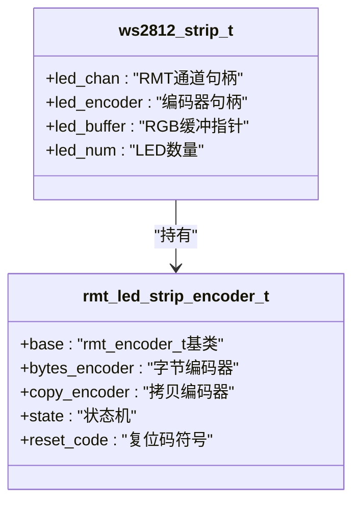
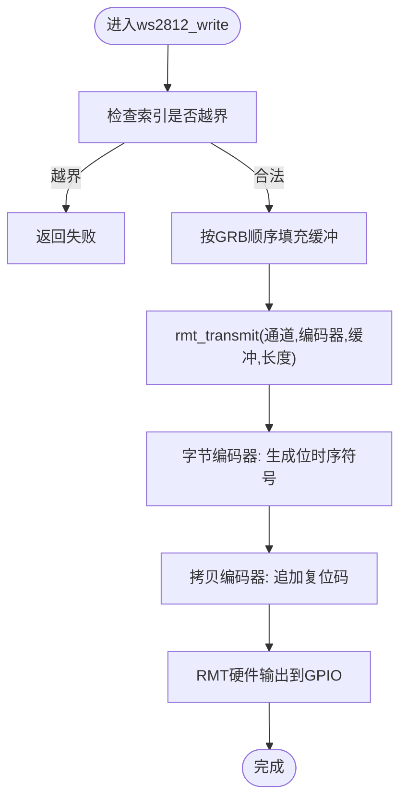
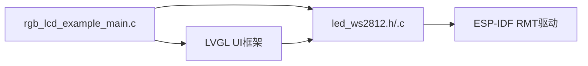

# LED控制系统

<cite>
**本文引用的文件**   
- [led_ws2812.c](file://ESP32开发板/TK021F2699_ESP32_LVGL_GIF_LED/TK021F2699_ESP32_LVGL_GIF_LED/main/led_ws2812/led_ws2812.c)
- [led_ws2812.h](file://ESP32开发板/TK021F2699_ESP32_LVGL_GIF_LED/TK021F2699_ESP32_LVGL_GIF_LED/main/led_ws2812/led_ws2812.h)
- [rgb_lcd_example_main.c](file://ESP32开发板/TK021F2699_ESP32_LVGL_GIF_LED/TK021F2699_ESP32_LVGL_GIF_LED/main/rgb_lcd_example_main.c)
- [lvgl_demo_ui.c](file://ESP32开发板/TK021F2699_ESP32_LVGL_GIF_LED/TK021F2699_ESP32_LVGL_GIF_LED/main/ui/lvgl_demo_ui.c)
</cite>

## 目录
1. [简介](#简介)
2. [项目结构](#项目结构)
3. [核心组件](#核心组件)
4. [架构总览](#架构总览)
5. [详细组件分析](#详细组件分析)
6. [依赖关系分析](#依赖关系分析)
7. [性能考虑](#性能考虑)
8. [故障排查指南](#故障排查指南)
9. [结论](#结论)
10. [附录：扩展与集成指南](#附录扩展与集成指南)

## 简介
本技术文档围绕 ESP32 平台上的 WS2812 LED 灯带控制，深入解析 RMT（远程调制解调器）硬件编码器的工作机制与 ws2812_init() 的实现细节，包括通道配置、时序编码与数据传输。同时提供多种动态效果算法思路（跑马灯、颜色渐变、亮度调节），并给出性能优化策略、错误处理与异常恢复方案，以及与 LVGL UI 系统的集成方法和事件同步机制说明。

## 项目结构
本项目将 LED 驱动封装在 led_ws2812 模块中，通过 RMT 外设实现精确的 WS2812 时序；应用层在 main 入口初始化 LED 和 LVGL，并在 UI 任务中触发 LED 动画或状态切换。

图表来源
- [rgb_lcd_example_main.c:150-160](file://ESP32开发板/TK021F2699_ESP32_LVGL_GIF_LED/TK021F2699_ESP32_LVGL_GIF_LED/main/rgb_lcd_example_main.c#L150-L160)
- [led_ws2812.c:179-213](file://ESP32开发板/TK021F2699_ESP32_LVGL_GIF_LED/TK021F2699_ESP32_LVGL_GIF_LED/main/led_ws2812/led_ws2812.c#L179-L213)
- [led_ws2812.c:113-171](file://ESP32开发板/TK021F2699_ESP32_LVGL_GIF_LED/TK021F2699_ESP32_LVGL_GIF_LED/main/led_ws2812/led_ws2812.c#L113-L171)
- [lvgl_demo_ui.c:75-149](file://ESP32开发板/TK021F2699_ESP32_LVGL_GIF_LED/TK021F2699_ESP32_LVGL_GIF_LED/main/ui/lvgl_demo_ui.c#L75-L149)

章节来源
- [rgb_lcd_example_main.c:150-160](file://ESP32开发板/TK021F2699_ESP32_LVGL_GIF_LED/TK021F2699_ESP32_LVGL_GIF_LED/main/rgb_lcd_example_main.c#L150-L160)
- [led_ws2812.c:179-213](file://ESP32开发板/TK021F2699_ESP32_LVGL_GIF_LED/TK021F2699_ESP32_LVGL_GIF_LED/main/led_ws2812/led_ws2812.c#L179-L213)
- [led_ws2812.c:113-171](file://ESP32开发板/TK021F2699_ESP32_LVGL_GIF_LED/TK021F2699_ESP32_LVGL_GIF_LED/main/led_ws2812/led_ws2812.c#L113-L171)
- [lvgl_demo_ui.c:75-149](file://ESP32开发板/TK021F2699_ESP32_LVGL_GIF_LED/TK021F2699_ESP32_LVGL_GIF_LED/main/ui/lvgl_demo_ui.c#L75-L149)

## 核心组件
- WS2812 驱动抽象
  - 句柄结构体包含 RMT 通道、编码器、RGB 缓冲与 LED 数量。
  - 对外暴露初始化、反初始化、单灯写入接口。
- RMT 自定义编码器
  - 组合“字节编码器”与“拷贝编码器”，在每次传输后追加复位码，满足 WS2812 协议要求。
  - 使用 10MHz 分辨率（0.1us/tick）生成符合 WS2812 的 T0H/T0L/T1H/T1L 时序。
- 应用集成
  - 主程序初始化 LED 与 LVGL，UI 层通过定时器或任务触发 LED 动画。

章节来源
- [led_ws2812.c:16-22](file://ESP32开发板/TK021F2699_ESP32_LVGL_GIF_LED/TK021F2699_ESP32_LVGL_GIF_LED/main/led_ws2812/led_ws2812.c#L16-L22)
- [led_ws2812.c:113-171](file://ESP32开发板/TK021F2699_ESP32_LVGL_GIF_LED/TK021F2699_ESP32_LVGL_GIF_LED/main/led_ws2812/led_ws2812.c#L113-L171)
- [led_ws2812.c:179-213](file://ESP32开发板/TK021F2699_ESP32_LVGL_GIF_LED/TK021F2699_ESP32_LVGL_GIF_LED/main/led_ws2812/led_ws2812.c#L179-L213)
- [led_ws2812.c:236-250](file://ESP32开发板/TK021F2699_ESP32_LVGL_GIF_LED/TK021F2699_ESP32_LVGL_GIF_LED/main/led_ws2812/led_ws2812.c#L236-L250)
- [lvgl_demo_ui.c:75-149](file://ESP32开发板/TK021F2699_ESP32_LVGL_GIF_LED/TK021F2699_ESP32_LVGL_GIF_LED/main/ui/lvgl_demo_ui.c#L75-L149)

## 架构总览
下图展示了从 UI 到 RMT 硬件的完整调用链，以及数据如何被编码为 WS2812 时序并输出至 GPIO。

图表来源
- [lvgl_demo_ui.c:126-149](file://ESP32开发板/TK021F2699_ESP32_LVGL_GIF_LED/TK021F2699_ESP32_LVGL_GIF_LED/main/ui/lvgl_demo_ui.c#L126-L149)
- [led_ws2812.c:236-250](file://ESP32开发板/TK021F2699_ESP32_LVGL_GIF_LED/TK021F2699_ESP32_LVGL_GIF_LED/main/led_ws2812/led_ws2812.c#L236-L250)
- [led_ws2812.c:49-89](file://ESP32开发板/TK021F2699_ESP32_LVGL_GIF_LED/TK021F2699_ESP32_LVGL_GIF_LED/main/led_ws2812/led_ws2812.c#L49-L89)
- [led_ws2812.c:113-171](file://ESP32开发板/TK021F2699_ESP32_LVGL_GIF_LED/TK021F2699_ESP32_LVGL_GIF_LED/main/led_ws2812/led_ws2812.c#L113-L171)

## 详细组件分析

### WS2812 驱动与 RMT 编码器
- 数据结构
  - 驱动句柄：保存 RMT 通道、编码器、RGB 缓冲、LED 数量。
  - 自定义编码器：封装字节编码器与拷贝编码器，维护状态机以在 RGB 数据后追加复位码。
- 关键流程
  - 初始化：分配句柄与缓冲，创建 RMT 发送通道（默认时钟源、指定 GPIO、内存块大小、分辨率、队列深度），创建自定义编码器，使能通道。
  - 编码：encode 回调先调用字节编码器将 GRB 数据转为符号序列，再调用拷贝编码器插入复位码（低电平长延时）。
  - 传输：rmt_transmit 将缓冲区一次性送入底层，由 RMT 硬件按 0.1us 精度输出波形。
- 时序参数
  - 分辨率：10MHz（0.1us/tick）。
  - 位时序：T0H=0.3us、T0L=0.9us、T1H=0.9us、T1L=0.3us。
  - 复位码：约 50us 的低电平间隔，确保灯带内部状态机复位。

图表来源
- [led_ws2812.c:16-22](file://ESP32开发板/TK021F2699_ESP32_LVGL_GIF_LED/TK021F2699_ESP32_LVGL_GIF_LED/main/led_ws2812/led_ws2812.c#L16-L22)
- [led_ws2812.c:25-31](file://ESP32开发板/TK021F2699_ESP32_LVGL_GIF_LED/TK021F2699_ESP32_LVGL_GIF_LED/main/led_ws2812/led_ws2812.c#L25-L31)

章节来源
- [led_ws2812.c:16-22](file://ESP32开发板/TK021F2699_ESP32_LVGL_GIF_LED/TK021F2699_ESP32_LVGL_GIF_LED/main/led_ws2812/led_ws2812.c#L16-L22)
- [led_ws2812.c:25-31](file://ESP32开发板/TK021F2699_ESP32_LVGL_GIF_LED/TK021F2699_ESP32_LVGL_GIF_LED/main/led_ws2812/led_ws2812.c#L25-L31)
- [led_ws2812.c:49-89](file://ESP32开发板/TK021F2699_ESP32_LVGL_GIF_LED/TK021F2699_ESP32_LVGL_GIF_LED/main/led_ws2812/led_ws2812.c#L49-L89)
- [led_ws2812.c:113-171](file://ESP32开发板/TK021F2699_ESP32_LVGL_GIF_LED/TK021F2699_ESP32_LVGL_GIF_LED/main/led_ws2812/led_ws2812.c#L113-L171)
- [led_ws2812.c:179-213](file://ESP32开发板/TK021F2699_ESP32_LVGL_GIF_LED/TK021F2699_ESP32_LVGL_GIF_LED/main/led_ws2812/led_ws2812.c#L179-L213)
- [led_ws2812.c:236-250](file://ESP32开发板/TK021F2699_ESP32_LVGL_GIF_LED/TK021F2699_ESP32_LVGL_GIF_LED/main/led_ws2812/led_ws2812.c#L236-L250)

### ws2812_init() 实现细节
- 功能要点
  - 分配驱动句柄与 RGB 缓冲（大小为 LED 数×3）。
  - 配置 RMT 发送通道：默认时钟源、目标 GPIO、内存块大小、分辨率（10MHz）、传输队列深度。
  - 创建自定义编码器（内含字节编码器与拷贝编码器，设置位时序与复位码）。
  - 使能 RMT 通道，返回句柄供上层使用。
- 关键点
  - 分辨率决定最小时间单元，影响 WS2812 时序精度。
  - 传输队列深度影响后台吞吐能力，避免阻塞上层。
  - 复位码长度需满足 WS2812 规范，保证每帧结束后的稳定。

章节来源
- [led_ws2812.c:179-213](file://ESP32开发板/TK021F2699_ESP32_LVGL_GIF_LED/TK021F2699_ESP32_LVGL_GIF_LED/main/led_ws2812/led_ws2812.c#L179-L213)
- [led_ws2812.c:113-171](file://ESP32开发板/TK021F2699_ESP32_LVGL_GIF_LED/TK021F2699_ESP32_LVGL_GIF_LED/main/led_ws2812/led_ws2812.c#L113-L171)

### 数据传输与编码流程
- 数据组织
  - WS2812 采用 GRB 顺序，写入函数将传入的 R/G/B 转换为 GRB 并放入缓冲。
- 编码步骤
  - 字节编码器将每个字节拆分为 8 个位，按 T0/T1 时序生成符号。
  - 拷贝编码器在末尾追加复位码（低电平长延时）。
- 传输方式
  - rmt_transmit 非阻塞地将数据送入 RMT 队列，底层 DMA 驱动 GPIO 输出。

图表来源
- [led_ws2812.c:236-250](file://ESP32开发板/TK021F2699_ESP32_LVGL_GIF_LED/TK021F2699_ESP32_LVGL_GIF_LED/main/led_ws2812/led_ws2812.c#L236-L250)
- [led_ws2812.c:49-89](file://ESP32开发板/TK021F2699_ESP32_LVGL_GIF_LED/TK021F2699_ESP32_LVGL_GIF_LED/main/led_ws2812/led_ws2812.c#L49-L89)

章节来源
- [led_ws2812.c:236-250](file://ESP32开发板/TK021F2699_ESP32_LVGL_GIF_LED/TK021F2699_ESP32_LVGL_GIF_LED/main/led_ws2812/led_ws2812.c#L236-L250)
- [led_ws2812.c:49-89](file://ESP32开发板/TK021F2699_ESP32_LVGL_GIF_LED/TK021F2699_ESP32_LVGL_GIF_LED/main/led_ws2812/led_ws2812.c#L49-L89)

### 动态效果算法实现
- 跑马灯
  - 逐灯循环设置固定颜色（红/绿/蓝），配合延时形成移动光点。
  - 参考路径：[lvgl_demo_ui.c:84-124](file://ESP32开发板/TK021F2699_ESP32_LVGL_GIF_LED/TK021F2699_ESP32_LVGL_GIF_LED/main/ui/lvgl_demo_ui.c#L84-L124)、[lvgl_demo_ui.c:126-149](file://ESP32开发板/TK021F2699_ESP32_LVGL_GIF_LED/TK021F2699_ESP32_LVGL_GIF_LED/main/ui/lvgl_demo_ui.c#L126-L149)
- 颜色渐变
  - 基于 HSV 空间计算 RGB，逐步变化色相或明度，实现平滑过渡。
  - 可参考 LVGL 中的快速 HSV→RGB 转换思路（近似算法，适合 UI 实时性）。
  - 参考路径：[lv_colorwheel.c:604-632](file://ESP32开发板/TK021F2699_ESP32_LVGL_GIF_LED/TK021F2699_ESP32_LVGL_GIF_LED/managed_components/lvgl__lvgl/src/extra/widgets/colorwheel/lv_colorwheel.c#L604-L632)
- 亮度调节
  - 对当前颜色分量按比例缩放，或使用灰度混合方法降低亮度。
  - 参考路径：[lv_led.c:85-96](file://ESP32开发板/TK021F2699_ESP32_LVGL_GIF_LED/TK021F2699_ESP32_LVGL_GIF_LED/managed_components/lvgl__lvgl/src/extra/widgets/led/lv_led.c#L85-L96)

章节来源
- [lvgl_demo_ui.c:84-124](file://ESP32开发板/TK021F2699_ESP32_LVGL_GIF_LED/TK021F2699_ESP32_LVGL_GIF_LED/main/ui/lvgl_demo_ui.c#L84-L124)
- [lvgl_demo_ui.c:126-149](file://ESP32开发板/TK021F2699_ESP32_LVGL_GIF_LED/TK021F2699_ESP32_LVGL_GIF_LED/main/ui/lvgl_demo_ui.c#L126-L149)
- [lv_colorwheel.c:604-632](file://ESP32开发板/TK021F2699_ESP32_LVGL_GIF_LED/TK021F2699_ESP32_LVGL_GIF_LED/managed_components/lvgl__lvgl/src/extra/widgets/colorwheel/lv_colorwheel.c#L604-L632)
- [lv_led.c:85-96](file://ESP32开发板/TK021F2699_ESP32_LVGL_GIF_LED/TK021F2699_ESP32_LVGL_GIF_LED/managed_components/lvgl__lvgl/src/extra/widgets/led/lv_led.c#L85-L96)

### 错误处理与异常恢复
- 初始化阶段
  - 使用断言与错误检查宏进行资源分配与驱动创建校验，失败时清理已分配资源。
  - 参考路径：[led_ws2812.c:113-171](file://ESP32开发板/TK021F2699_ESP32_LVGL_GIF_LED/TK021F2699_ESP32_LVGL_GIF_LED/main/led_ws2812/led_ws2812.c#L113-L171)
- 运行阶段
  - 写入前检查索引范围，越界直接返回失败，防止访问非法内存。
  - 参考路径：[led_ws2812.c:236-250](file://ESP32开发板/TK021F2699_ESP32_LVGL_GIF_LED/TK021F2699_ESP32_LVGL_GIF_LED/main/led_ws2812/led_ws2812.c#L236-L250)
- 资源释放
  - 反初始化删除编码器、释放缓冲与句柄，避免内存泄漏。
  - 参考路径：[led_ws2812.c:219-228](file://ESP32开发板/TK021F2699_ESP32_LVGL_GIF_LED/TK021F2699_ESP32_LVGL_GIF_LED/main/led_ws2812/led_ws2812.c#L219-L228)

章节来源
- [led_ws2812.c:113-171](file://ESP32开发板/TK021F2699_ESP32_LVGL_GIF_LED/TK021F2699_ESP32_LVGL_GIF_LED/main/led_ws2812/led_ws2812.c#L113-L171)
- [led_ws2812.c:236-250](file://ESP32开发板/TK021F2699_ESP32_LVGL_GIF_LED/TK021F2699_ESP32_LVGL_GIF_LED/main/led_ws2812/led_ws2812.c#L236-L250)
- [led_ws2812.c:219-228](file://ESP32开发板/TK021F2699_ESP32_LVGL_GIF_LED/TK021F2699_ESP32_LVGL_GIF_LED/main/led_ws2812/led_ws2812.c#L219-L228)

## 依赖关系分析
- 模块耦合
  - 应用主程序依赖 LED 驱动接口与 LVGL 显示驱动。
  - LED 驱动依赖 ESP-IDF 的 RMT 驱动与编码器库。
- 外部依赖
  - ESP-IDF RMT 发送通道与编码器 API。
  - LVGL 用于 UI 构建与事件调度。

图表来源
- [rgb_lcd_example_main.c:150-160](file://ESP32开发板/TK021F2699_ESP32_LVGL_GIF_LED/TK021F2699_ESP32_LVGL_GIF_LED/main/rgb_lcd_example_main.c#L150-L160)
- [led_ws2812.h:15-40](file://ESP32开发板/TK021F2699_ESP32_LVGL_GIF_LED/TK021F2699_ESP32_LVGL_GIF_LED/main/led_ws2812/led_ws2812.h#L15-L40)

章节来源
- [rgb_lcd_example_main.c:150-160](file://ESP32开发板/TK021F2699_ESP32_LVGL_GIF_LED/TK021F2699_ESP32_LVGL_GIF_LED/main/rgb_lcd_example_main.c#L150-L160)
- [led_ws2812.h:15-40](file://ESP32开发板/TK021F2699_ESP32_LVGL_GIF_LED/TK021F2699_ESP32_LVGL_GIF_LED/main/led_ws2812/led_ws2812.h#L15-L40)

## 性能考虑
- 内存使用
  - RGB 缓冲大小为 LED 数×3 字节，建议根据实际灯带长度合理估算，避免过大导致 PSRAM 压力。
- CPU 占用
  - 使用 RMT 硬件编码与 DMA 传输，CPU 仅在准备数据与发起传输时参与，显著降低占用。
  - 避免在高频循环中进行复杂计算，尽量将效果计算放在独立任务或定时器回调中。
- 实时性保证
  - 调整 RMT 传输队列深度，提高吞吐能力，减少阻塞风险。
  - 使用 lv_timer 或 FreeRTOS 任务管理动画节奏，避免 vTaskDelay 过长导致 UI 卡顿。
- 功耗与发热
  - 高亮度全白会显著增加功耗，建议在 UI 中提供亮度限制或自动降亮策略。

[本节为通用指导，不直接分析具体文件]

## 故障排查指南
- 现象：LED 无响应或闪烁异常
  - 检查 GPIO 配置是否正确，RMT 通道是否成功创建与使能。
  - 确认复位码时长是否符合 WS2812 规范。
  - 参考路径：[led_ws2812.c:179-213](file://ESP32开发板/TK021F2699_ESP32_LVGL_GIF_LED/TK021F2699_ESP32_LVGL_GIF_LED/main/led_ws2812/led_ws2812.c#L179-L213)
- 现象：部分灯颜色不正确
  - 检查 GRB 顺序是否与灯带一致，写入函数是否按 GRB 填充缓冲。
  - 参考路径：[led_ws2812.c:236-250](file://ESP32开发板/TK021F2699_ESP32_LVGL_GIF_LED/TK021F2699_ESP32_LVGL_GIF_LED/main/led_ws2812/led_ws2812.c#L236-L250)
- 现象：UI 卡顿或动画掉帧
  - 检查 LED 动画是否在独立任务中执行，避免阻塞 LVGL 主循环。
  - 参考路径：[lvgl_demo_ui.c:84-124](file://ESP32开发板/TK021F2699_ESP32_LVGL_GIF_LED/TK021F2699_ESP32_LVGL_GIF_LED/main/ui/lvgl_demo_ui.c#L84-L124)

章节来源
- [led_ws2812.c:179-213](file://ESP32开发板/TK021F2699_ESP32_LVGL_GIF_LED/TK021F2699_ESP32_LVGL_GIF_LED/main/led_ws2812/led_ws2812.c#L179-L213)
- [led_ws2812.c:236-250](file://ESP32开发板/TK021F2699_ESP32_LVGL_GIF_LED/TK021F2699_ESP32_LVGL_GIF_LED/main/led_ws2812/led_ws2812.c#L236-L250)
- [lvgl_demo_ui.c:84-124](file://ESP32开发板/TK021F2699_ESP32_LVGL_GIF_LED/TK021F2699_ESP32_LVGL_GIF_LED/main/ui/lvgl_demo_ui.c#L84-L124)

## 结论
本项目通过 ESP-IDF 的 RMT 外设与自定义编码器实现了高效、精确的 WS2812 驱动。ws2812_init() 负责通道与编码器配置，ws2812_write() 负责数据打包与传输。结合 LVGL UI 的任务与定时器机制，可实现丰富的动态效果。通过合理的内存与队列配置、异步任务设计，可在保证实时性的同时降低 CPU 占用。

[本节为总结，不直接分析具体文件]

## 附录：扩展与集成指南
- 自定义 LED 效果
  - 在 UI 层新增效果选项，通过 ws2812_write() 批量更新缓冲或直接逐灯写入。
  - 使用 HSV→RGB 快速转换提升性能，参考路径：[lv_colorwheel.c:604-632](file://ESP32开发板/TK021F2699_ESP32_LVGL_GIF_LED/TK021F2699_ESP32_LVGL_GIF_LED/managed_components/lvgl__lvgl/src/extra/widgets/colorwheel/lv_colorwheel.c#L604-L632)
- 与 UI 系统集成
  - 使用 lv_timer 周期性触发 LED 动画，或在按键回调中启动任务。
  - 参考路径：[lvgl_demo_ui.c:126-149](file://ESP32开发板/TK021F2699_ESP32_LVGL_GIF_LED/TK021F2699_ESP32_LVGL_GIF_LED/main/ui/lvgl_demo_ui.c#L126-L149)
- 事件同步机制
  - 若需要与屏幕刷新同步（如避免撕裂），可使用信号量在 VSYNC 回调与 LVGL 刷新回调之间协调。
  - 参考路径：[rgb_lcd_example_main.c:84-109](file://ESP32开发板/TK021F2699_ESP32_LVGL_GIF_LED/TK021F2699_ESP32_LVGL_GIF_LED/main/rgb_lcd_example_main.c#L84-L109)

章节来源
- [lv_colorwheel.c:604-632](file://ESP32开发板/TK021F2699_ESP32_LVGL_GIF_LED/TK021F2699_ESP32_LVGL_GIF_LED/managed_components/lvgl__lvgl/src/extra/widgets/colorwheel/lv_colorwheel.c#L604-L632)
- [lvgl_demo_ui.c:126-149](file://ESP32开发板/TK021F2699_ESP32_LVGL_GIF_LED/TK021F2699_ESP32_LVGL_GIF_LED/main/ui/lvgl_demo_ui.c#L126-L149)
- [rgb_lcd_example_main.c:84-109](file://ESP32开发板/TK021F2699_ESP32_LVGL_GIF_LED/TK021F2699_ESP32_LVGL_GIF_LED/main/rgb_lcd_example_main.c#L84-L109)