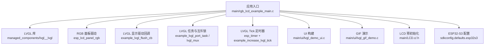
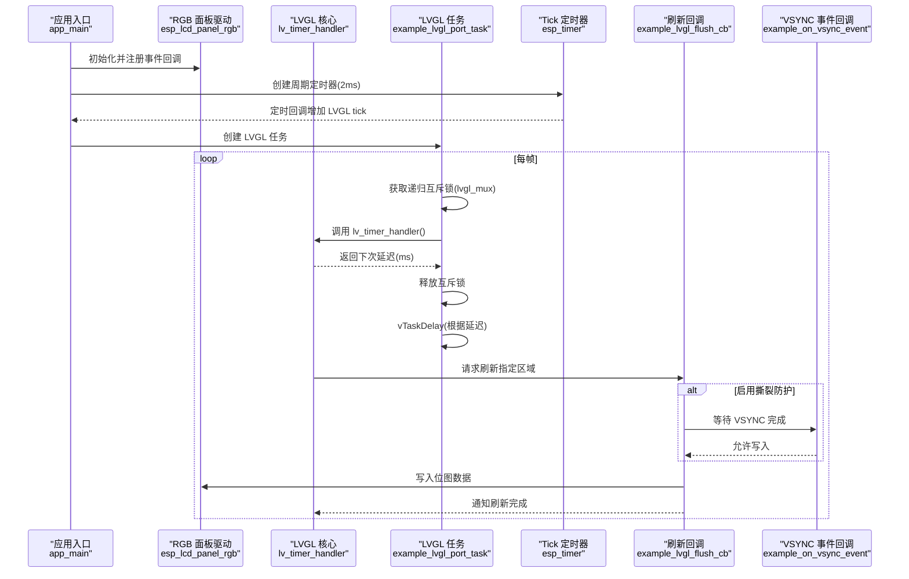
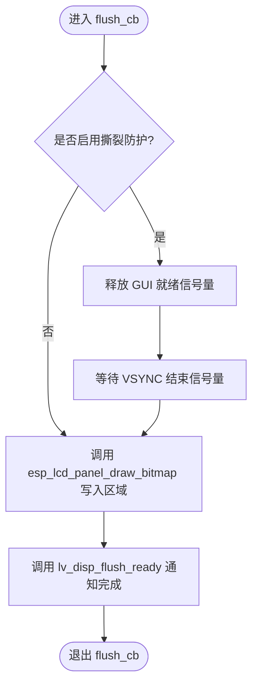
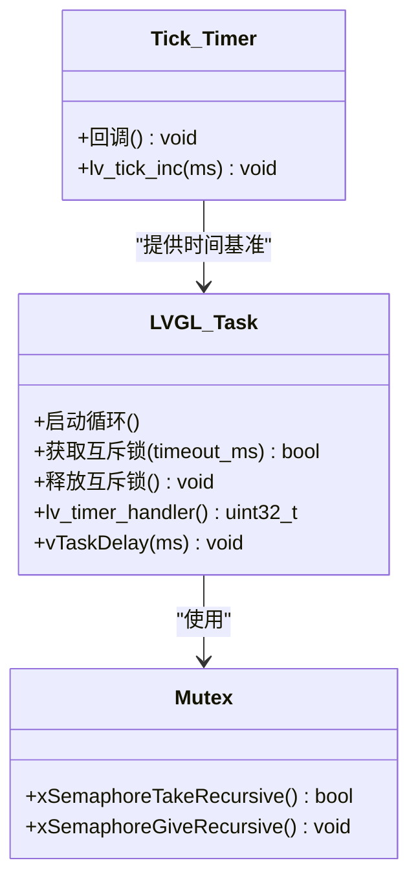
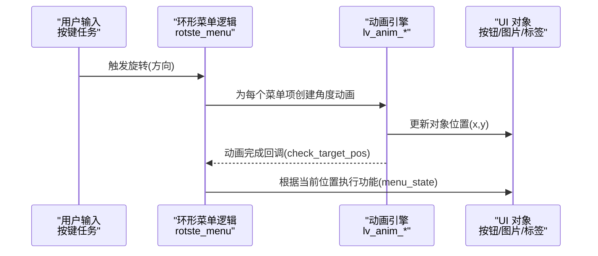
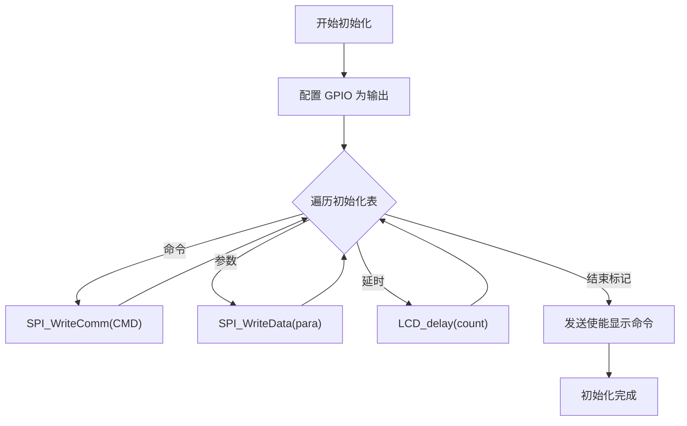
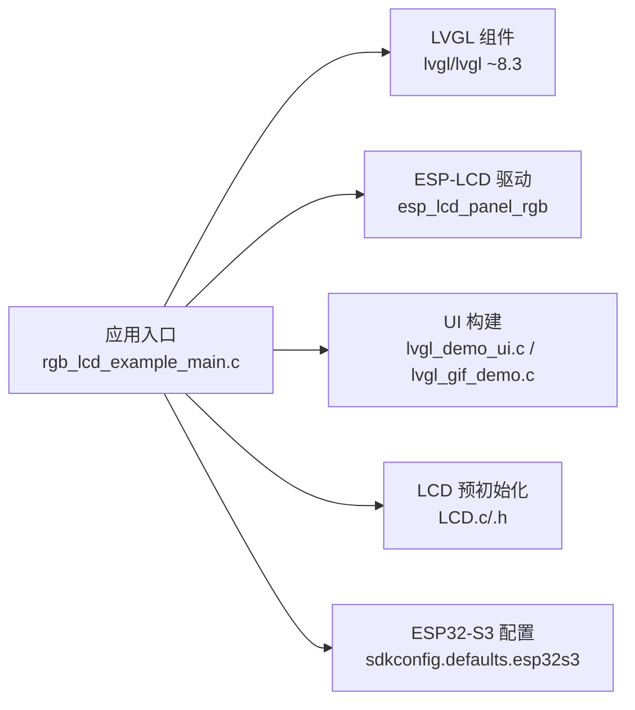

# LVGL图形系统

<cite>
**本文引用的文件**   
- [README.md](file://ESP32开发板/TK021F2699_ESP32_LVGL_GIF_LED/TK021F2699_ESP32_LVGL_GIF_LED/README.md)
- [rgb_lcd_example_main.c](file://ESP32开发板/TK021F2699_ESP32_LVGL_GIF_LED/TK021F2699_ESP32_LVGL_GIF_LED/main/rgb_lcd_example_main.c)
- [LCD.h](file://ESP32开发板/TK021F2699_ESP32_LVGL_GIF_LED/TK021F2699_ESP32_LVGL_GIF_LED/main/LCD.h)
- [LCD.c](file://ESP32开发板/TK021F2699_ESP32_LVGL_GIF_LED/TK021F2699_ESP32_LVGL_GIF_LED/main/LCD.c)
- [lvgl_demo_ui.c](file://ESP32开发板/TK021F2699_ESP32_LVGL_GIF_LED/TK021F2699_ESP32_LVGL_GIF_LED/main/ui/lvgl_demo_ui.c)
- [lvgl_gif_demo.c](file://ESP32开发板/TK021F2699_ESP32_LVGL_GIF_LED/TK021F2699_ESP32_LVGL_GIF_LED/main/ui/lvgl_gif_demo.c)
- [idf_component.yml](file://ESP32开发板/TK021F2699_ESP32_LVGL_GIF_LED/TK021F2699_ESP32_LVGL_GIF_LED/main/idf_component.yml)
- [sdkconfig.defaults.esp32s3](file://ESP32开发板/TK021F2699_ESP32_LVGL_GIF_LED/TK021F2699_ESP32_LVGL_GIF_LED/sdkconfig.defaults.esp32s3)
</cite>

## 目录
1. [简介](#简介)
2. [项目结构](#项目结构)
3. [核心组件](#核心组件)
4. [架构总览](#架构总览)
5. [详细组件分析](#详细组件分析)
6. [依赖关系分析](#依赖关系分析)
7. [性能考虑](#性能考虑)
8. [故障排查指南](#故障排查指南)
9. [结论](#结论)
10. [附录](#附录)

## 简介
本技术文档围绕在 ESP32-S3 上移植与配置 LVGL 图形系统的实践，结合工程中的 RGB LCD 示例、LVGL 任务与定时器、内存缓冲策略、线程安全机制、UI 构建与动画、GIF 播放等，提供从架构到实现细节的完整说明。文档同时给出自定义控件开发、样式定制、字体与图像处理、多语言支持、调试与性能优化的方法建议，帮助开发者高效构建稳定高效的嵌入式图形界面。

## 项目结构
本项目基于 ESP-IDF 框架，使用 lvgl/lvgl 组件（版本约 8.3），通过 RGB 面板驱动将 LVGL 渲染结果输出到屏幕。关键目录与职责：
- main/rgb_lcd_example_main.c：应用入口，初始化硬件、注册 LVGL 显示驱动、创建 LVGL 任务与 tick 定时器、管理互斥锁与撕裂防护信号量。
- main/LCD.c/.h：针对特定屏的 SPI 初始化与寄存器配置（用于部分屏的预初始化）。
- main/ui/lvgl_demo_ui.c：主 UI 构建（环形菜单、图标、标签、定时器更新 Wi-Fi 信号等）。
- main/ui/lvgl_gif_demo.c：GIF 演示页面。
- managed_components/lvgl__lvgl：LVGL 源码与官方示例、文档、脚本等。
- sdkconfig.defaults.esp32s3：ESP32-S3 默认配置（PSRAM、SPIRAM 模式与速度、指令/常量取指优化）。
- idf_component.yml：声明 lvgl 组件依赖。

图表来源
- [rgb_lcd_example_main.c:150-303](file://ESP32开发板/TK021F2699_ESP32_LVGL_GIF_LED/TK021F2699_ESP32_LVGL_GIF_LED/main/rgb_lcd_example_main.c#L150-L303)
- [lvgl_demo_ui.c:297-497](file://ESP32开发板/TK021F2699_ESP32_LVGL_GIF_LED/TK021F2699_ESP32_LVGL_GIF_LED/main/ui/lvgl_demo_ui.c#L297-L497)
- [lvgl_gif_demo.c:12-47](file://ESP32开发板/TK021F2699_ESP32_LVGL_GIF_LED/TK021F2699_ESP32_LVGL_GIF_LED/main/ui/lvgl_gif_demo.c#L12-L47)
- [LCD.c:186-219](file://ESP32开发板/TK021F2699_ESP32_LVGL_GIF_LED/TK021F2699_ESP32_LVGL_GIF_LED/main/LCD.c#L186-L219)
- [sdkconfig.defaults.esp32s3:1-9](file://ESP32开发板/TK021F2699_ESP32_LVGL_GIF_LED/TK021F2699_ESP32_LVGL_GIF_LED/sdkconfig.defaults.esp32s3#L1-L9)

章节来源
- [README.md:1-122](file://ESP32开发板/TK021F2699_ESP32_LVGL_GIF_LED/TK021F2699_ESP32_LVGL_GIF_LED/README.md#L1-L122)
- [idf_component.yml:1-4](file://ESP32开发板/TK021F2699_ESP32_LVGL_GIF_LED/TK021F2699_ESP32_LVGL_GIF_LED/main/idf_component.yml#L1-L4)

## 核心组件
- 显示驱动与刷新回调：通过 esp_lcd 驱动 RGB 面板，LVGL 调用 flush_cb 将绘制缓冲区内容写入面板；可选双缓冲或单缓冲+额外同步避免撕裂。
- LVGL 任务与线程安全：独立任务循环调用 lv_timer_handler()，所有 LVGL API 调用前后需获取/释放递归互斥锁 lvgl_mux。
- Tick 定时器：使用 esp_timer 周期性触发 lv_tick_inc()，为 LVGL 内部计时器提供时间基准。
- 内存缓冲策略：支持双帧缓冲（full_refresh）或 PSRAM 分配 LVGL 绘制缓冲；可启用回冲缓冲（bounce buffer）提升 PCLK 上限。
- UI 与动画：环形菜单、按钮、图片、标签、GIF 播放、定时器更新状态信息。
- 外设集成：WS2812 LED 跑马灯、Wi-Fi 信号强度读取与显示。

章节来源
- [rgb_lcd_example_main.c:95-148](file://ESP32开发板/TK021F2699_ESP32_LVGL_GIF_LED/TK021F2699_ESP32_LVGL_GIF_LED/main/rgb_lcd_example_main.c#L95-L148)
- [rgb_lcd_example_main.c:246-288](file://ESP32开发板/TK021F2699_ESP32_LVGL_GIF_LED/TK021F2699_ESP32_LVGL_GIF_LED/main/rgb_lcd_example_main.c#L246-L288)
- [lvgl_demo_ui.c:297-497](file://ESP32开发板/TK021F2699_ESP32_LVGL_GIF_LED/TK021F2699_ESP32_LVGL_GIF_LED/main/ui/lvgl_demo_ui.c#L297-L497)

## 架构总览
下图展示从应用入口到 LVGL 渲染输出的整体流程，包括任务调度、互斥锁保护、VSYNC 同步与刷新回调。

图表来源
- [rgb_lcd_example_main.c:84-148](file://ESP32开发板/TK021F2699_ESP32_LVGL_GIF_LED/TK021F2699_ESP32_LVGL_GIF_LED/main/rgb_lcd_example_main.c#L84-L148)
- [rgb_lcd_example_main.c:275-288](file://ESP32开发板/TK021F2699_ESP32_LVGL_GIF_LED/TK021F2699_ESP32_LVGL_GIF_LED/main/rgb_lcd_example_main.c#L275-L288)

## 详细组件分析

### 显示驱动与刷新回调
- 功能要点：
  - 通过 esp_lcd_new_rgb_panel 配置像素时钟、时序、数据引脚、帧缓冲位置（PSRAM）。
  - 注册 on_vsync 事件回调，配合信号量实现写入与读出的同步，避免撕裂。
  - flush_cb 中根据 LVGL 绘制的区域调用 esp_lcd_panel_draw_bitmap 进行批量写入，完成后调用 lv_disp_flush_ready。
- 线程安全：
  - 所有 LVGL API 调用被递归互斥锁 lvgl_mux 保护，确保跨任务访问安全。
- 缓冲策略：
  - 双缓冲时设置 disp_drv.full_refresh = true，以维持两个帧缓冲的同步。
  - 单缓冲时可启用 bounce buffer 提高 PCLK 上限，但会增加 CPU 占用。

图表来源
- [rgb_lcd_example_main.c:95-109](file://ESP32开发板/TK021F2699_ESP32_LVGL_GIF_LED/TK021F2699_ESP32_LVGL_GIF_LED/main/rgb_lcd_example_main.c#L95-L109)
- [rgb_lcd_example_main.c:263-273](file://ESP32开发板/TK021F2699_ESP32_LVGL_GIF_LED/TK021F2699_ESP32_LVGL_GIF_LED/main/rgb_lcd_example_main.c#L263-L273)

章节来源
- [rgb_lcd_example_main.c:177-244](file://ESP32开发板/TK021F2699_ESP32_LVGL_GIF_LED/TK021F2699_ESP32_LVGL_GIF_LED/main/rgb_lcd_example_main.c#L177-L244)
- [rgb_lcd_example_main.c:246-288](file://ESP32开发板/TK021F2699_ESP32_LVGL_GIF_LED/TK021F2699_ESP32_LVGL_GIF_LED/main/rgb_lcd_example_main.c#L246-L288)

### LVGL 任务与 Tick 定时器
- 任务模型：
  - 独立任务循环调用 lv_timer_handler()，并根据返回值动态调整 vTaskDelay 时长，平衡响应性与功耗。
  - 使用递归互斥锁 lvgl_mux 包裹所有 LVGL API 调用，保证线程安全。
- Tick 定时器：
  - 使用 esp_timer 每 2ms 触发一次，调用 lv_tick_inc() 推进 LVGL 内部时间。
- 撕裂防护：
  - 可选通过二进制信号量对 VSYNC 与 GUI 就绪进行握手，避免 EDMA 读取与 Cache 写入冲突。

图表来源
- [rgb_lcd_example_main.c:111-148](file://ESP32开发板/TK021F2699_ESP32_LVGL_GIF_LED/TK021F2699_ESP32_LVGL_GIF_LED/main/rgb_lcd_example_main.c#L111-L148)
- [rgb_lcd_example_main.c:275-288](file://ESP32开发板/TK021F2699_ESP32_LVGL_GIF_LED/TK021F2699_ESP32_LVGL_GIF_LED/main/rgb_lcd_example_main.c#L275-L288)

章节来源
- [rgb_lcd_example_main.c:111-148](file://ESP32开发板/TK021F2699_ESP32_LVGL_GIF_LED/TK021F2699_ESP32_LVGL_GIF_LED/main/rgb_lcd_example_main.c#L111-L148)
- [rgb_lcd_example_main.c:275-288](file://ESP32开发板/TK021F2699_ESP32_LVGL_GIF_LED/TK021F2699_ESP32_LVGL_GIF_LED/main/rgb_lcd_example_main.c#L275-L288)

### UI 构建与动画
- 环形菜单：
  - 通过计算角度与半径确定每个菜单项的初始位置，点击按键后按顺时针/逆时针旋转菜单项，并在动画完成后检测目标位置以执行对应功能。
- 图标与标签：
  - 使用内置图片资源与字体资源，动态显示 Wi-Fi 信号强度等信息。
- GIF 播放：
  - 使用 lv_gif_create 与 lv_gif_set_src 加载 GIF 资源，嵌入到 UI 中。

图表来源
- [lvgl_demo_ui.c:224-246](file://ESP32开发板/TK021F2699_ESP32_LVGL_GIF_LED/TK021F2699_ESP32_LVGL_GIF_LED/main/ui/lvgl_demo_ui.c#L224-L246)
- [lvgl_demo_ui.c:297-497](file://ESP32开发板/TK021F2699_ESP32_LVGL_GIF_LED/TK021F2699_ESP32_LVGL_GIF_LED/main/ui/lvgl_demo_ui.c#L297-L497)
- [lvgl_gif_demo.c:12-47](file://ESP32开发板/TK021F2699_ESP32_LVGL_GIF_LED/TK021F2699_ESP32_LVGL_GIF_LED/main/ui/lvgl_gif_demo.c#L12-L47)

章节来源
- [lvgl_demo_ui.c:224-246](file://ESP32开发板/TK021F2699_ESP32_LVGL_GIF_LED/TK021F2699_ESP32_LVGL_GIF_LED/main/ui/lvgl_demo_ui.c#L224-L246)
- [lvgl_demo_ui.c:297-497](file://ESP32开发板/TK021F2699_ESP32_LVGL_GIF_LED/TK021F2699_ESP32_LVGL_GIF_LED/main/ui/lvgl_demo_ui.c#L297-L497)
- [lvgl_gif_demo.c:12-47](file://ESP32开发板/TK021F2699_ESP32_LVGL_GIF_LED/TK021F2699_ESP32_LVGL_GIF_LED/main/ui/lvgl_gif_demo.c#L12-L47)

### LCD 预初始化（SPI 方式）
- 目的：某些屏需要额外的 SPI 命令序列进行初始化，工程提供了 SPI 写命令/数据函数与寄存器表。
- 流程：
  - 配置 GPIO 为推挽输出。
  - 遍历初始化表，发送命令与参数，必要时插入延时。
  - 最终开启显示（如 0x29 命令）。

图表来源
- [LCD.c:186-219](file://ESP32开发板/TK021F2699_ESP32_LVGL_GIF_LED/TK021F2699_ESP32_LVGL_GIF_LED/main/LCD.c#L186-L219)
- [LCD.h:12-26](file://ESP32开发板/TK021F2699_ESP32_LVGL_GIF_LED/TK021F2699_ESP32_LVGL_GIF_LED/main/LCD.h#L12-L26)

章节来源
- [LCD.c:186-219](file://ESP32开发板/TK021F2699_ESP32_LVGL_GIF_LED/TK021F2699_ESP32_LVGL_GIF_LED/main/LCD.c#L186-L219)
- [LCD.h:12-26](file://ESP32开发板/TK021F2699_ESP32_LVGL_GIF_LED/TK021F2699_ESP32_LVGL_GIF_LED/main/LCD.h#L12-L26)

## 依赖关系分析
- 组件依赖：
  - 应用入口依赖 lvgl/lvgl 组件（~8.3），并通过 ESP-IDF 包管理器安装。
  - 显示驱动依赖 esp_lcd 系列接口（esp_lcd_panel_ops、esp_lcd_panel_rgb）。
  - UI 层依赖 LVGL 提供的对象树、样式、动画、GIF 等能力。
- 外部依赖：
  - ESP32-S3 的 PSRAM 配置影响帧缓冲与指令/常量取指路径，从而影响 PCLK 上限与带宽。

图表来源
- [idf_component.yml:1-4](file://ESP32开发板/TK021F2699_ESP32_LVGL_GIF_LED/TK021F2699_ESP32_LVGL_GIF_LED/main/idf_component.yml#L1-L4)
- [sdkconfig.defaults.esp32s3:1-9](file://ESP32开发板/TK021F2699_ESP32_LVGL_GIF_LED/TK021F2699_ESP32_LVGL_GIF_LED/sdkconfig.defaults.esp32s3#L1-L9)

章节来源
- [idf_component.yml:1-4](file://ESP32开发板/TK021F2699_ESP32_LVGL_GIF_LED/TK021F2699_ESP32_LVGL_GIF_LED/main/idf_component.yml#L1-L4)
- [sdkconfig.defaults.esp32s3:1-9](file://ESP32开发板/TK021F2699_ESP32_LVGL_GIF_LED/TK021F2699_ESP32_LVGL_GIF_LED/sdkconfig.defaults.esp32s3#L1-L9)

## 性能考虑
- 渲染优化：
  - 优先使用双缓冲（full_refresh）以避免撕裂与额外同步开销；若必须单缓冲，启用 bounce buffer 以提升 PCLK 上限。
  - 合理设置 flush_cb 的刷新区域，减少不必要的整屏刷新。
- 内存使用：
  - 将帧缓冲置于 PSRAM 可降低 SRAM 压力，但受限于 SPI0 带宽；可通过启用 CONFIG_SPIRAM_FETCH_INSTRUCTIONS 与 CONFIG_SPIRAM_RODATA 节省 ICache 带宽。
  - 控制 GIF 与图片数量与尺寸，避免一次性加载过多资源导致内存峰值过高。
- 功耗管理：
  - 根据 lv_timer_handler 返回的延迟动态调整任务休眠时间，降低空闲时的 CPU 占用。
  - 关闭不需要的动画与定时器，减少刷新频率。
- 时钟与带宽：
  - 适当降低 PCLK 频率或调整时序参数（hsync/vsync porch、pclk_active_neg）以适配不同面板。
  - 启用回冲缓冲可在 CPU 占用上升的前提下提高 PCLK 上限。

[本节为通用指导，不直接分析具体文件]

## 故障排查指南
- 屏幕不亮：
  - 检查背光电平配置（EXAMPLE_LCD_BK_LIGHT_ON_LEVEL），确认高/低电平有效。
- 无帧缓冲内存：
  - 将帧缓冲放置于 PSRAM，并确保 SPIRAM 配置正确（Octal、80MHz）。
- 屏幕漂移：
  - 降低 PCLK 频率，调整时序参数（hsync/vsync back/front porch、pulse width、pclk_active_neg）。
  - 启用 SPIRAM 取指与常量优化，减轻 SPI0 带宽压力。
- 撕裂现象：
  - 使用双缓冲或添加 VSYNC 同步机制（semaphores）。
- PCLK 频率过低：
  - 启用 bounce buffer 或使用 SPIRAM 取指/常量优化。
- RGB 时序正确但无显示：
  - 检查面板 IC 是否需要特殊初始化序列（工程中已提供 SPI 初始化表）。

章节来源
- [README.md:102-122](file://ESP32开发板/TK021F2699_ESP32_LVGL_GIF_LED/TK021F2699_ESP32_LVGL_GIF_LED/README.md#L102-L122)
- [sdkconfig.defaults.esp32s3:1-9](file://ESP32开发板/TK021F2699_ESP32_LVGL_GIF_LED/TK021F2699_ESP32_LVGL_GIF_LED/sdkconfig.defaults.esp32s3#L1-L9)

## 结论
通过在 ESP32-S3 上采用 RGB 面板驱动与 LVGL 的组合，结合任务与定时器、互斥锁与 VSYNC 同步机制，可实现稳定流畅的图形界面。合理的缓冲策略、内存布局与时序调优是获得高性能的关键。UI 层利用 LVGL 的对象树、样式系统与动画能力，能够快速构建丰富的交互体验。对于复杂场景，建议逐步引入 GPU/DMA 加速与资源压缩，进一步优化渲染与功耗表现。

[本节为总结性内容，不直接分析具体文件]

## 附录

### 自定义组件开发指南
- 新控件创建步骤：
  - 定义控件类与属性（参考 LVGL 对象类机制）。
  - 实现绘制回调（draw callback），处理形状、颜色、阴影等样式。
  - 注册事件处理器（点击、拖拽、滚动等），并与对象树交互。
  - 在 UI 构建阶段实例化控件，并设置样式与布局。
- 样式定制：
  - 使用 lv_obj_set_style_* 系列 API 设置背景色、圆角、边框、阴影、文本字体等。
  - 针对不同状态（默认、按下、聚焦）分别设置样式，提升交互反馈。
- 动画效果实现：
  - 使用 lv_anim_* 创建属性动画（位置、透明度、大小等），在 ready 回调中执行后续逻辑。
  - 组合多个动画形成复杂动效，注意控制动画时间与频率，避免卡顿。

[本节为概念性指导，不直接分析具体文件]

### 字体加载与多语言支持
- 字体加载：
  - 使用 LV_FONT_DECLARE 声明编译生成的字体头文件，并在 UI 中通过 lv_obj_set_style_text_font 应用到标签或按钮。
  - 按需生成精简字体（仅包含所需字符集），减小资源体积。
- 多语言支持：
  - 维护多套字符串资源，运行时根据语言切换替换标签文本。
  - 结合 LVGL 的文本对象与样式系统，统一管理与更新界面文案。

[本节为概念性指导，不直接分析具体文件]

### 图像处理与 GIF 播放
- 静态图像：
  - 使用 LV_IMG_DECLARE 声明图片资源，通过 lv_img_create 与 lv_img_set_src 添加到对象树。
  - 选择合适的图片格式与尺寸，避免过大导致内存与带宽压力。
- GIF 播放：
  - 使用 lv_gif_create 与 lv_gif_set_src 加载 GIF 资源，嵌入到 UI 中。
  - 控制 GIF 数量与分辨率，避免频繁解码造成卡顿。

章节来源
- [lvgl_demo_ui.c:19-39](file://ESP32开发板/TK021F2699_ESP32_LVGL_GIF_LED/TK021F2699_ESP32_LVGL_GIF_LED/main/ui/lvgl_demo_ui.c#L19-L39)
- [lvgl_gif_demo.c:12-47](file://ESP32开发板/TK021F2699_ESP32_LVGL_GIF_LED/TK021F2699_ESP32_LVGL_GIF_LED/main/ui/lvgl_gif_demo.c#L12-L47)

### 调试技巧与性能分析方法
- 日志与断点：
  - 使用 ESP_LOGI/ESP_ERROR_CHECK 打印关键初始化与错误信息。
  - 在 LVGL 任务与 flush_cb 处设置断点，观察调用链与耗时。
- 性能指标：
  - 监控 lv_timer_handler 返回的延迟，评估任务调度效率。
  - 统计刷新区域面积与频率，定位过度刷新问题。
- 内存分析：
  - 检查 PSRAM 与 SRAM 使用情况，避免峰值溢出。
  - 评估 GIF 与图片资源的内存占用，必要时进行压缩或懒加载。

[本节为通用指导，不直接分析具体文件]