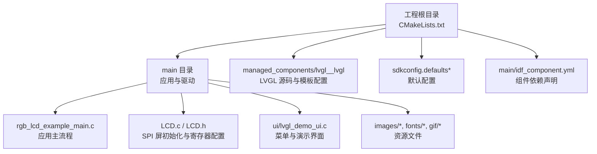
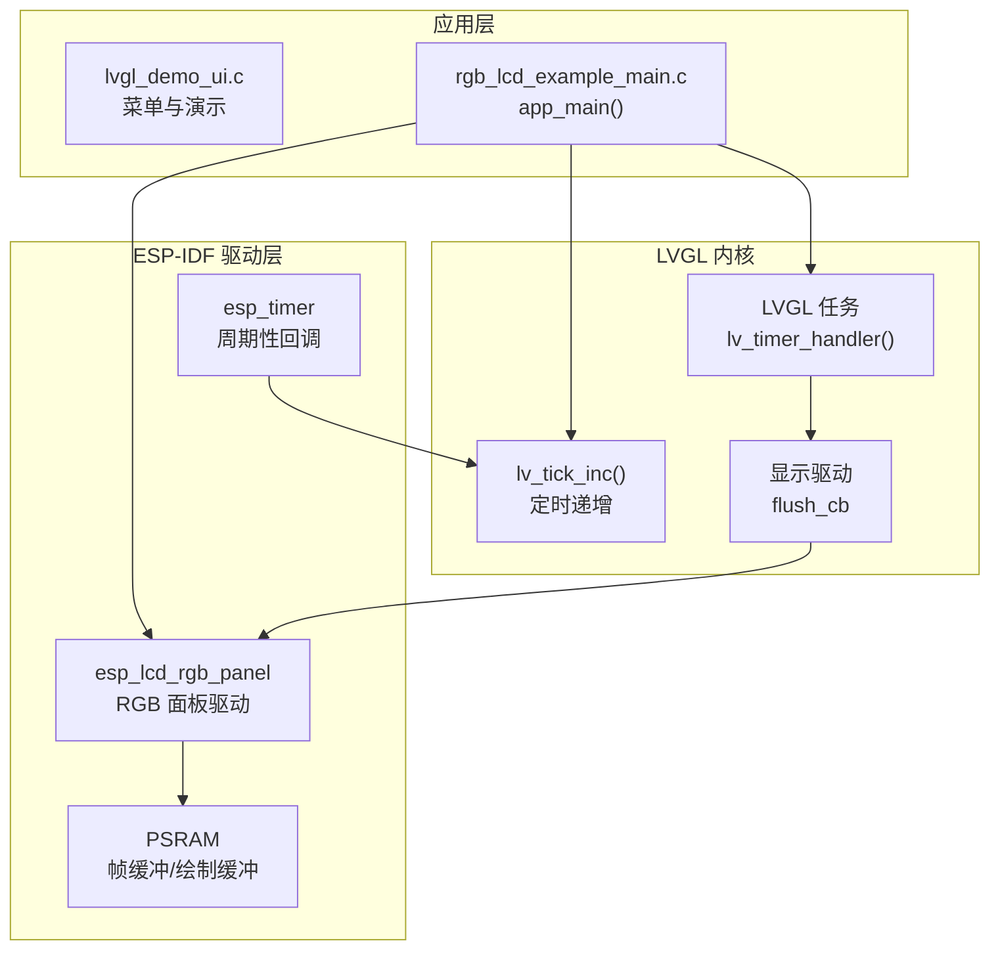
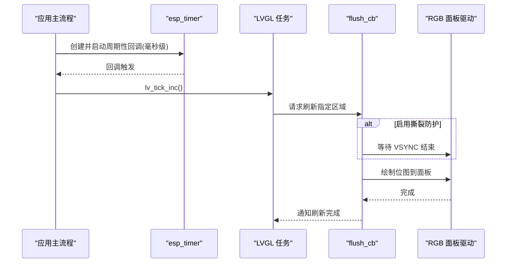
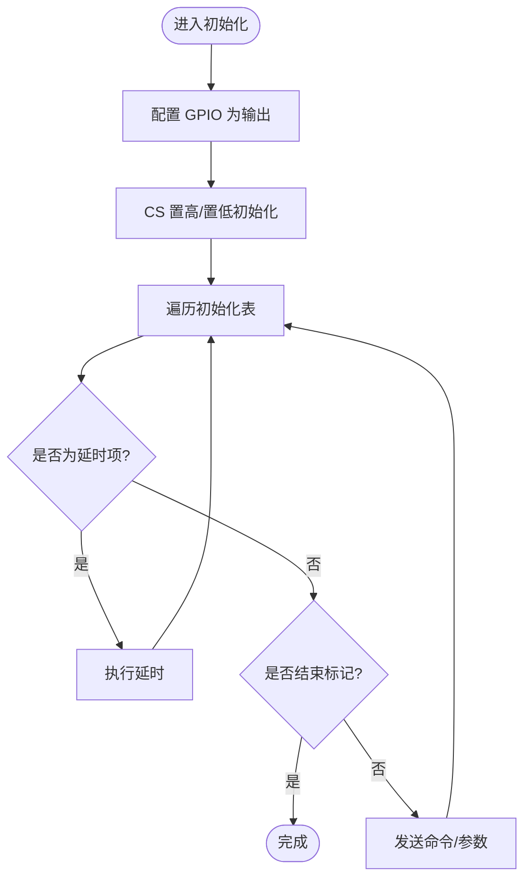
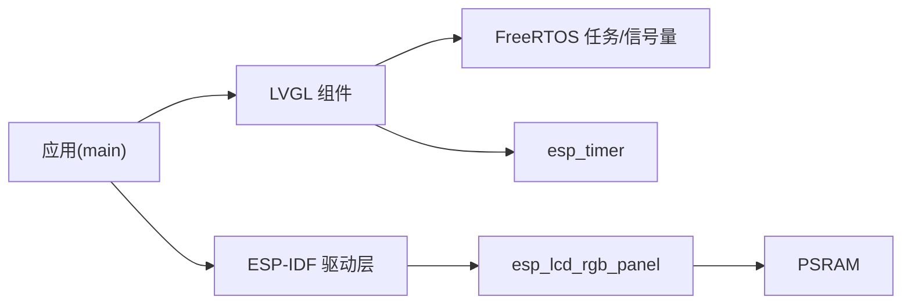

# LVGL配置与移植

<cite>
**本文引用的文件**   
- [rgb_lcd_example_main.c](file://ESP32开发板/TK021F2699_ESP32_LVGL_GIF_LED/TK021F2699_ESP32_LVGL_GIF_LED/main/rgb_lcd_example_main.c)
- [LCD.c](file://ESP32开发板/TK021F2699_ESP32_LVGL_GIF_LED/TK021F2699_ESP32_LVGL_GIF_LED/main/LCD.c)
- [LCD.h](file://ESP32开发板/TK021F2699_ESP32_LVGL_GIF_LED/TK021F2699_ESP32_LVGL_GIF_LED/main/LCD.h)
- [CMakeLists.txt](file://ESP32开发板/TK021F2699_ESP32_LVGL_GIF_LED/TK021F2699_ESP32_LVGL_GIF_LED/CMakeLists.txt)
- [main/CMakeLists.txt](file://ESP32开发板/TK021F2699_ESP32_LVGL_GIF_LED/TK021F2699_ESP32_LVGL_GIF_LED/main/CMakeLists.txt)
- [idf_component.yml](file://ESP32开发板/TK021F2699_ESP32_LVGL_GIF_LED/TK021F2699_ESP32_LVGL_GIF_LED/main/idf_component.yml)
- [sdkconfig.defaults](file://ESP32开发板/TK021F2699_ESP32_LVGL_GIF_LED/TK021F2699_ESP32_LVGL_GIF_LED/sdkconfig.defaults)
- [sdkconfig.defaults.esp32s3](file://ESP32开发板/TK021F2699_ESP32_LVGL_GIF_LED/TK021F2699_ESP32_LVGL_GIF_LED/sdkconfig.defaults.esp32s3)
- [lv_conf_template.h](file://ESP32开发板/TK021F2699_ESP32_LVGL_GIF_LED/TK021F2699_ESP32_LVGL_GIF_LED/managed_components/lvgl__lvgl/lv_conf_template.h)
</cite>

## 目录
1. [简介](#简介)
2. [项目结构](#项目结构)
3. [核心组件](#核心组件)
4. [架构总览](#架构总览)
5. [详细组件分析](#详细组件分析)
6. [依赖关系分析](#依赖关系分析)
7. [性能考虑](#性能考虑)
8. [故障排查指南](#故障排查指南)
9. [结论](#结论)
10. [附录](#附录)

## 简介
本技术文档面向在 ESP32-S3 平台上将 LVGL 进行完整移植的工程实践，围绕以下目标展开：
- 解释 ESP-IDF 的 sdkconfig 关键选项及其最佳实践（尤其是内存管理与性能监控）
- 说明 CMake 集成方式、依赖管理与编译优化要点
- 阐述 FreeRTOS 任务集成、显示驱动适配与输入设备配置思路
- 提供常见问题诊断方法与不同硬件平台的适配建议

## 项目结构
本项目基于 ESP-IDF 工程组织，LVGL 以 IDF Component 形式引入。顶层 CMake 负责初始化工程，main 子目录包含应用入口、UI 逻辑、LCD 底层驱动与资源文件；LVGL 源码位于 managed_components 下。

图表来源
- [CMakeLists.txt:1-5](file://ESP32开发板/TK021F2699_ESP32_LVGL_GIF_LED/TK021F2699_ESP32_LVGL_GIF_LED/CMakeLists.txt#L1-L5)
- [main/CMakeLists.txt:1-29](file://ESP32开发板/TK021F2699_ESP32_LVGL_GIF_LED/TK021F2699_ESP32_LVGL_GIF_LED/main/CMakeLists.txt#L1-L29)
- [idf_component.yml:1-4](file://ESP32开发板/TK021F2699_ESP32_LVGL_GIF_LED/TK021F2699_ESP32_LVGL_GIF_LED/main/idf_component.yml#L1-L4)
- [sdkconfig.defaults:1-6](file://ESP32开发板/TK021F2699_ESP32_LVGL_GIF_LED/TK021F2699_ESP32_LVGL_GIF_LED/sdkconfig.defaults#L1-L6)
- [sdkconfig.defaults.esp32s3:1-9](file://ESP32开发板/TK021F2699_ESP32_LVGL_GIF_LED/TK021F2699_ESP32_LVGL_GIF_LED/sdkconfig.defaults.esp32s3#L1-L9)

章节来源
- [CMakeLists.txt:1-5](file://ESP32开发板/TK021F2699_ESP32_LVGL_GIF_LED/TK021F2699_ESP32_LVGL_GIF_LED/CMakeLists.txt#L1-L5)
- [main/CMakeLists.txt:1-29](file://ESP32开发板/TK021F2699_ESP32_LVGL_GIF_LED/TK021F2699_ESP32_LVGL_GIF_LED/main/CMakeLists.txt#L1-L29)
- [idf_component.yml:1-4](file://ESP32开发板/TK021F2699_ESP32_LVGL_GIF_LED/TK021F2699_ESP32_LVGL_GIF_LED/main/idf_component.yml#L1-L4)

## 核心组件
- 应用主流程与 LVGL 集成：完成 RGB 面板初始化、帧缓冲分配、LVGL 显示驱动注册、定时器与任务创建、UI 启动。
- LCD 底层驱动：通过 SPI 对屏幕控制器进行复位与寄存器初始化序列下发。
- 组件与构建系统：通过 idf_component.yml 引入 LVGL 组件，CMake 管理源文件与头文件路径。
- 运行时配置：通过 sdkconfig.defaults 与平台特定 defaults 启用内存自定义、标准库 memcpy/memset、性能监控等。

章节来源
- [rgb_lcd_example_main.c:150-303](file://ESP32开发板/TK021F2699_ESP32_LVGL_GIF_LED/TK021F2699_ESP32_LVGL_GIF_LED/main/rgb_lcd_example_main.c#L150-L303)
- [LCD.c:186-219](file://ESP32开发板/TK021F2699_ESP32_LVGL_GIF_LED/TK021F2699_ESP32_LVGL_GIF_LED/main/LCD.c#L186-L219)
- [idf_component.yml:1-4](file://ESP32开发板/TK021F2699_ESP32_LVGL_GIF_LED/TK021F2699_ESP32_LVGL_GIF_LED/main/idf_component.yml#L1-L4)
- [sdkconfig.defaults:1-6](file://ESP32开发板/TK021F2699_ESP32_LVGL_GIF_LED/TK021F2699_ESP32_LVGL_GIF_LED/sdkconfig.defaults#L1-L6)

## 架构总览
下图展示了 ESP32-S3 上 LVGL 的运行时架构：FreeRTOS 任务驱动 LVGL 主循环，esp_timer 提供 tick，RGB 面板驱动负责像素传输，LVGL 刷新回调将绘制缓冲区数据写入面板。

图表来源
- [rgb_lcd_example_main.c:111-148](file://ESP32开发板/TK021F2699_ESP32_LVGL_GIF_LED/TK021F2699_ESP32_LVGL_GIF_LED/main/rgb_lcd_example_main.c#L111-L148)
- [rgb_lcd_example_main.c:150-303](file://ESP32开发板/TK021F2699_ESP32_LVGL_GIF_LED/TK021F2699_ESP32_LVGL_GIF_LED/main/rgb_lcd_example_main.c#L150-L303)

## 详细组件分析

### 显示驱动与 LVGL 集成（RGB 面板 + LVGL flush）
- 引脚与时序：定义 HSYNC/VSYNC/DE/PCLK 与 16bit 数据总线，设置 pclk_hz、前后肩与脉宽，确保与屏幕规格一致。
- 帧缓冲策略：支持双缓冲或单缓冲；当使用 PSRAM 时开启 fb_in_psram，避免内部 SRAM 不足。
- LVGL 刷新回调：在回调中调用 esp_lcd_panel_draw_bitmap 将绘制缓冲区内容推送至面板，并通知 LVGL 刷新完成。
- 撕裂防护：可选 VSYNC 同步信号与互斥量配合，避免画面撕裂。
- Tick 与任务：使用 esp_timer 周期触发 lv_tick_inc，独立 LVGL 任务循环调用 lv_timer_handler。

图表来源
- [rgb_lcd_example_main.c:84-109](file://ESP32开发板/TK021F2699_ESP32_LVGL_GIF_LED/TK021F2699_ESP32_LVGL_GIF_LED/main/rgb_lcd_example_main.c#L84-L109)
- [rgb_lcd_example_main.c:111-148](file://ESP32开发板/TK021F2699_ESP32_LVGL_GIF_LED/TK021F2699_ESP32_LVGL_GIF_LED/main/rgb_lcd_example_main.c#L111-L148)
- [rgb_lcd_example_main.c:150-303](file://ESP32开发板/TK021F2699_ESP32_LVGL_GIF_LED/TK021F2699_ESP32_LVGL_GIF_LED/main/rgb_lcd_example_main.c#L150-L303)

章节来源
- [rgb_lcd_example_main.c:29-71](file://ESP32开发板/TK021F2699_ESP32_LVGL_GIF_LED/TK021F2699_ESP32_LVGL_GIF_LED/main/rgb_lcd_example_main.c#L29-L71)
- [rgb_lcd_example_main.c:84-109](file://ESP32开发板/TK021F2699_ESP32_LVGL_GIF_LED/TK021F2699_ESP32_LVGL_GIF_LED/main/rgb_lcd_example_main.c#L84-L109)
- [rgb_lcd_example_main.c:111-148](file://ESP32开发板/TK021F2699_ESP32_LVGL_GIF_LED/TK021F2699_ESP32_LVGL_GIF_LED/main/rgb_lcd_example_main.c#L111-L148)
- [rgb_lcd_example_main.c:150-303](file://ESP32开发板/TK021F2699_ESP32_LVGL_GIF_LED/TK021F2699_ESP32_LVGL_GIF_LED/main/rgb_lcd_example_main.c#L150-L303)

### LCD 底层驱动（SPI 屏初始化）
- GPIO 配置：CS/DCLK/SDA 等控制线初始化为输出，必要时拉高/拉低。
- 串行通信：实现 3 线 9bit 串行协议，命令与数据分别通过 CS 与 SDA 区分。
- 初始化表：按厂商规范下发寄存器序列，包含延时标记与结束标记。
- 初始化流程：先配置 GPIO，再发送初始化表，最后使能显示。

图表来源
- [LCD.c:17-40](file://ESP32开发板/TK021F2699_ESP32_LVGL_GIF_LED/TK021F2699_ESP32_LVGL_GIF_LED/main/LCD.c#L17-L40)
- [LCD.c:51-83](file://ESP32开发板/TK021F2699_ESP32_LVGL_GIF_LED/TK021F2699_ESP32_LVGL_GIF_LED/main/LCD.c#L51-L83)
- [LCD.c:86-160](file://ESP32开发板/TK021F2699_ESP32_LVGL_GIF_LED/TK021F2699_ESP32_LVGL_GIF_LED/main/LCD.c#L86-L160)
- [LCD.c:186-219](file://ESP32开发板/TK021F2699_ESP32_LVGL_GIF_LED/TK021F2699_ESP32_LVGL_GIF_LED/main/LCD.c#L186-L219)
- [LCD.h:12-26](file://ESP32开发板/TK021F2699_ESP32_LVGL_GIF_LED/TK021F2699_ESP32_LVGL_GIF_LED/main/LCD.h#L12-L26)

章节来源
- [LCD.c:17-40](file://ESP32开发板/TK021F2699_ESP32_LVGL_GIF_LED/TK021F2699_ESP32_LVGL_GIF_LED/main/LCD.c#L17-L40)
- [LCD.c:51-83](file://ESP32开发板/TK021F2699_ESP32_LVGL_GIF_LED/TK021F2699_ESP32_LVGL_GIF_LED/main/LCD.c#L51-L83)
- [LCD.c:86-160](file://ESP32开发板/TK021F2699_ESP32_LVGL_GIF_LED/TK021F2699_ESP32_LVGL_GIF_LED/main/LCD.c#L86-L160)
- [LCD.c:186-219](file://ESP32开发板/TK021F2699_ESP32_LVGL_GIF_LED/TK021F2699_ESP32_LVGL_GIF_LED/main/LCD.c#L186-L219)
- [LCD.h:12-26](file://ESP32开发板/TK021F2699_ESP32_LVGL_GIF_LED/TK021F2699_ESP32_LVGL_GIF_LED/main/LCD.h#L12-L26)

### 内存管理与 LVGL 配置（CONFIG_LV_MEM_CUSTOM 等）
- 自定义内存分配：启用 CONFIG_LV_MEM_CUSTOM 后，LVGL 使用标准 malloc/free/realloc，便于与 ESP-IDF 堆管理协同。
- 标准库 memcpy/memset：启用 CONFIG_LV_MEMCPY_MEMSET_STD 可调用平台优化版本，提升拷贝与填充效率。
- 颜色深度与交换：模板中默认 RGB565，若接口为 8bit 需启用字节交换。
- 中间缓冲与缓存：合理设置中间缓冲数量与图像/渐变缓存大小，平衡内存占用与性能。
- 复杂绘制特性：阴影、圆角、渐变等需要更多内存与 CPU，可按需求裁剪。

章节来源
- [sdkconfig.defaults:1-6](file://ESP32开发板/TK021F2699_ESP32_LVGL_GIF_LED/TK021F2699_ESP32_LVGL_GIF_LED/sdkconfig.defaults#L1-L6)
- [lv_conf_template.h:26-74](file://ESP32开发板/TK021F2699_ESP32_LVGL_GIF_LED/TK021F2699_ESP32_LVGL_GIF_LED/managed_components/lvgl__lvgl/lv_conf_template.h#L26-L74)
- [lv_conf_template.h:142-173](file://ESP32开发板/TK021F2699_ESP32_LVGL_GIF_LED/TK021F2699_ESP32_LVGL_GIF_LED/managed_components/lvgl__lvgl/lv_conf_template.h#L142-L173)
- [lv_conf_template.h:109-124](file://ESP32开发板/TK021F2699_ESP32_LVGL_GIF_LED/TK021F2699_ESP32_LVGL_GIF_LED/managed_components/lvgl__lvgl/lv_conf_template.h#L109-L124)

### 性能监控（CONFIG_LV_USE_PERF_MONITOR）
- 启用后 LVGL 可在运行时统计与展示 FPS、CPU 占用、内存使用等指标，便于定位瓶颈。
- 建议在调试阶段开启，发布前根据产品需求决定是否保留。

章节来源
- [sdkconfig.defaults:5-6](file://ESP32开发板/TK021F2699_ESP32_LVGL_GIF_LED/TK021F2699_ESP32_LVGL_GIF_LED/sdkconfig.defaults#L5-L6)

### FreeRTOS 任务集成
- LVGL 任务：独立任务循环调用 lv_timer_handler，并通过递归互斥锁保护 LVGL API 调用。
- Tick 定时器：使用 esp_timer 周期触发 lv_tick_inc，保证动画与事件处理时间基准。
- 撕裂防护：可选 VSYNC 中断与信号量协调，确保仅在垂直回扫期间更新帧缓冲。

章节来源
- [rgb_lcd_example_main.c:111-148](file://ESP32开发板/TK021F2699_ESP32_LVGL_GIF_LED/TK021F2699_ESP32_LVGL_GIF_LED/main/rgb_lcd_example_main.c#L111-L148)
- [rgb_lcd_example_main.c:150-303](file://ESP32开发板/TK021F2699_ESP32_LVGL_GIF_LED/TK021F2699_ESP32_LVGL_GIF_LED/main/rgb_lcd_example_main.c#L150-L303)

### 输入设备配置（思路与示例）
- 触摸/按键：可通过 LVGL 输入设备模板对接 GPIO 或 I2C/SPI 触控芯片，实现坐标读取与事件上报。
- 轮询频率：参考 LV_INDEV_DEF_READ_PERIOD 调整采样间隔，平衡响应性与 CPU 占用。
- 坐标系映射：根据屏幕分辨率与触控范围进行坐标缩放与翻转。

章节来源
- [lv_conf_template.h:80-84](file://ESP32开发板/TK021F2699_ESP32_LVGL_GIF_LED/TK021F2699_ESP32_LVGL_GIF_LED/managed_components/lvgl__lvgl/lv_conf_template.h#L80-L84)

### CMake 集成与依赖管理
- 顶层 CMake：包含 ESP-IDF 工程脚本并设置工程名。
- main/CMakeLists：注册源文件、图片与字体资源，添加包含目录。
- 组件依赖：idf_component.yml 声明 LVGL 组件版本与 ESP-IDF 最低版本要求。

章节来源
- [CMakeLists.txt:1-5](file://ESP32开发板/TK021F2699_ESP32_LVGL_GIF_LED/TK021F2699_ESP32_LVGL_GIF_LED/CMakeLists.txt#L1-L5)
- [main/CMakeLists.txt:1-29](file://ESP32开发板/TK021F2699_ESP32_LVGL_GIF_LED/TK021F2699_ESP32_LVGL_GIF_LED/main/CMakeLists.txt#L1-L29)
- [idf_component.yml:1-4](file://ESP32开发板/TK021F2699_ESP32_LVGL_GIF_LED/TK021F2699_ESP32_LVGL_GIF_LED/main/idf_component.yml#L1-L4)

## 依赖关系分析
- 组件依赖：应用依赖 LVGL 组件与 ESP-IDF 基础库。
- 运行时依赖：LVGL 依赖 FreeRTOS 任务与 esp_timer；显示驱动依赖 esp_lcd_rgb_panel 与 PSRAM。
- 构建依赖：CMake 与 idf_component 管理源文件与第三方组件。

图表来源
- [idf_component.yml:1-4](file://ESP32开发板/TK021F2699_ESP32_LVGL_GIF_LED/TK021F2699_ESP32_LVGL_GIF_LED/main/idf_component.yml#L1-L4)
- [rgb_lcd_example_main.c:150-303](file://ESP32开发板/TK021F2699_ESP32_LVGL_GIF_LED/TK021F2699_ESP32_LVGL_GIF_LED/main/rgb_lcd_example_main.c#L150-L303)

章节来源
- [idf_component.yml:1-4](file://ESP32开发板/TK021F2699_ESP32_LVGL_GIF_LED/TK021F2699_ESP32_LVGL_GIF_LED/main/idf_component.yml#L1-L4)
- [rgb_lcd_example_main.c:150-303](file://ESP32开发板/TK021F2699_ESP32_LVGL_GIF_LED/TK021F2699_ESP32_LVGL_GIF_LED/main/rgb_lcd_example_main.c#L150-L303)

## 性能考虑
- 帧缓冲位置：大分辨率或高分辨率场景优先将帧缓冲置于 PSRAM，降低内部 SRAM 压力。
- 双缓冲与全刷新：双缓冲可减少撕裂，但需权衡显存占用；全刷新模式有助于保持同步。
- 中间缓冲与缓存：适当增大中间缓冲与图像/渐变缓存可降低重复计算，但会增加内存占用。
- 复杂绘制特性：阴影、圆角、渐变等会显著增加 CPU 与内存开销，按需裁剪。
- 时钟与 PCLK：提高像素时钟可提升吞吐，但需满足屏幕时序与布线约束。
- 内存拷贝优化：启用标准库 memcpy/memset 可利用平台优化路径。

[本节为通用指导，不直接分析具体文件]

## 故障排查指南
- 屏幕无显示或花屏
  - 检查 SPI 初始化表是否正确、延时是否足够、GPIO 电平是否符合屏幕手册。
  - 确认 RGB 面板引脚与时序参数与屏幕规格一致。
- 画面撕裂
  - 启用 VSYNC 同步与信号量机制，确保仅在垂直回扫期间更新帧缓冲。
- 卡顿或掉帧
  - 检查 LVGL 任务优先级与栈大小，评估刷新回调耗时与 PSRAM 带宽。
  - 减少复杂绘制特性与中间缓冲数量，关闭不必要的功能模块。
- 内存不足或崩溃
  - 启用自定义内存分配并使用 PSRAM 作为帧缓冲；调整 LV_MEM_SIZE 与中间缓冲数量。
- 性能监控
  - 开启性能监控功能，观察 FPS、CPU 与内存使用情况，定位热点。

章节来源
- [LCD.c:186-219](file://ESP32开发板/TK021F2699_ESP32_LVGL_GIF_LED/TK021F2699_ESP32_LVGL_GIF_LED/main/LCD.c#L186-L219)
- [rgb_lcd_example_main.c:84-109](file://ESP32开发板/TK021F2699_ESP32_LVGL_GIF_LED/TK021F2699_ESP32_LVGL_GIF_LED/main/rgb_lcd_example_main.c#L84-L109)
- [sdkconfig.defaults:1-6](file://ESP32开发板/TK021F2699_ESP32_LVGL_GIF_LED/TK021F2699_ESP32_LVGL_GIF_LED/sdkconfig.defaults#L1-L6)

## 结论
通过在 ESP32-S3 上正确配置 LVGL 与 ESP-IDF 驱动，结合合理的内存与性能调优，可实现稳定流畅的图形界面。关键在于：
- 准确的屏幕初始化与 RGB 时序配置
- 合适的帧缓冲策略与内存管理
- 可靠的 FreeRTOS 任务与 tick 集成
- 利用性能监控持续优化

[本节为总结性内容，不直接分析具体文件]

## 附录

### ESP32-S3 平台相关配置要点
- PSRAM 与指令/只读数据取指优化：启用 PSRAM 及取指/RODATA 从 PSRAM 获取，有助于提高 PCLK 可达频率与整体吞吐。
- 颜色深度与字节交换：根据接口宽度与端序设置颜色深度与交换标志。
- 输入设备读取周期：依据交互需求调整读取周期，避免过高 CPU 占用。

章节来源
- [sdkconfig.defaults.esp32s3:1-9](file://ESP32开发板/TK021F2699_ESP32_LVGL_GIF_LED/TK021F2699_ESP32_LVGL_GIF_LED/sdkconfig.defaults.esp32s3#L1-L9)
- [lv_conf_template.h:26-31](file://ESP32开发板/TK021F2699_ESP32_LVGL_GIF_LED/TK021F2699_ESP32_LVGL_GIF_LED/managed_components/lvgl__lvgl/lv_conf_template.h#L26-L31)
- [lv_conf_template.h:80-84](file://ESP32开发板/TK021F2699_ESP32_LVGL_GIF_LED/TK021F2699_ESP32_LVGL_GIF_LED/managed_components/lvgl__lvgl/lv_conf_template.h#L80-L84)