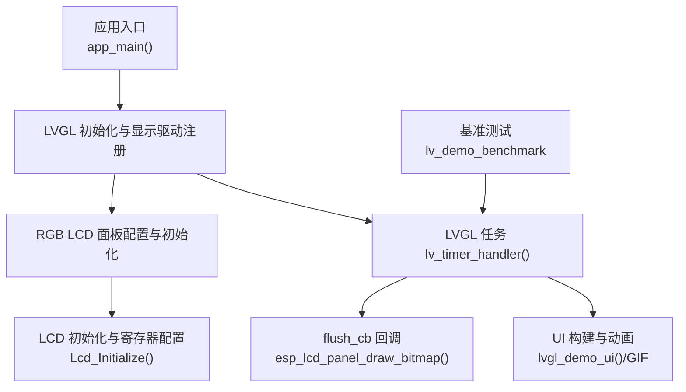
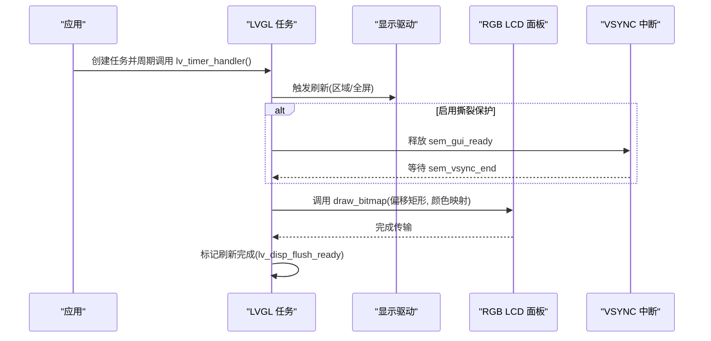
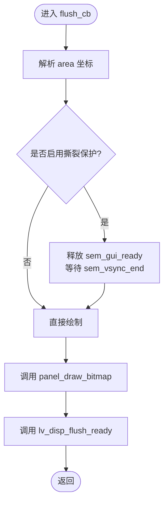
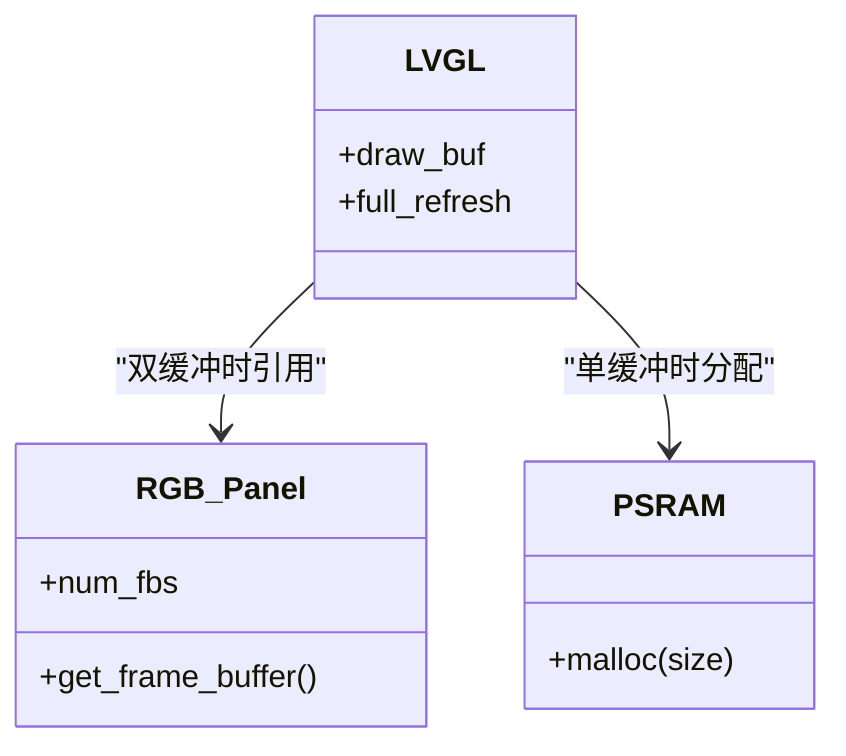
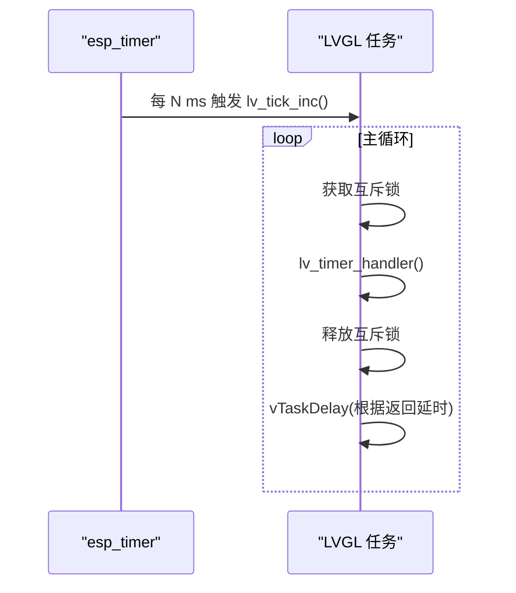
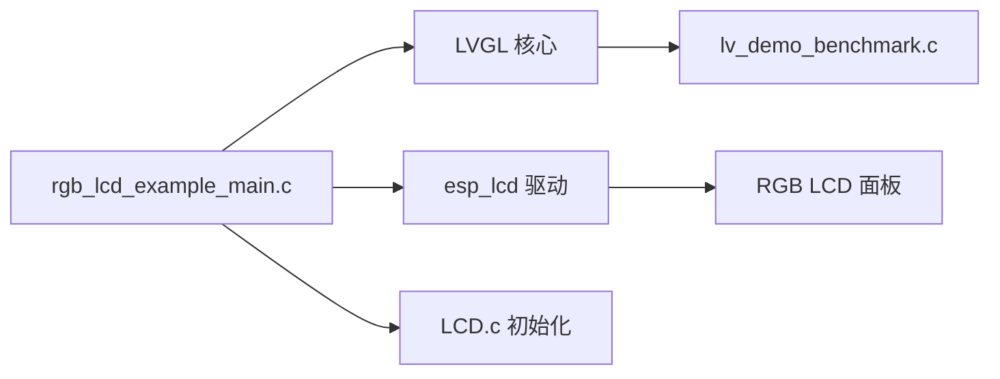

# 性能优化与调试

<cite>
**本文引用的文件**   
- [rgb_lcd_example_main.c](file://ESP32开发板/TK021F2699_ESP32_LVGL_GIF_LED/TK021F2699_ESP32_LVGL_GIF_LED/main/rgb_lcd_example_main.c)
- [LCD.c](file://ESP32开发板/TK021F2699_ESP32_LVGL_GIF_LED/TK021F2699_ESP32_LVGL_GIF_LED/main/LCD.c)
- [LCD.h](file://ESP32开发板/TK021F2699_ESP32_LVGL_GIF_LED/TK021F2699_ESP32_LVGL_GIF_LED/main/LCD.h)
- [lvgl_demo_ui.c](file://ESP32开发板/TK021F2699_ESP32_LVGL_GIF_LED/TK021F2699_ESP32_LVGL_GIF_LED/main/ui/lvgl_demo_ui.c)
- [lvgl_gif_demo.c](file://ESP32开发板/TK021F2699_ESP32_LVGL_GIF_LED/TK021F2699_ESP32_LVGL_GIF_LED/main/ui/lvgl_gif_demo.c)
- [lv_demo_benchmark.c](file://ESP32开发板/TK021F2699_ESP32_LVGL_GIF_LED/TK021F2699_ESP32_LVGL_GIF_LED/managed_components/lvgl__lvgl/demos/benchmark/lv_demo_benchmark.c)
- [sdkconfig](file://ESP32开发板/TK021F2699_ESP32_LVGL_GIF_LED/TK021F2699_ESP32_LVGL_GIF_LED/sdkconfig)
</cite>

## 目录
1. [简介](#简介)
2. [项目结构](#项目结构)
3. [核心组件](#核心组件)
4. [架构总览](#架构总览)
5. [详细组件分析](#详细组件分析)
6. [依赖关系分析](#依赖关系分析)
7. [性能考量](#性能考量)
8. [故障排查指南](#故障排查指南)
9. [结论](#结论)
10. [附录](#附录)

## 简介
本技术文档面向在 ESP32-S3 平台上使用 LVGL 的工程师，聚焦于渲染引擎工作原理、性能瓶颈定位与优化策略。内容涵盖帧缓冲管理（单缓冲/双缓冲）、部分刷新、功耗优化方法与测量工具、关键性能指标（CPU 占用、内存占用、渲染时间）解读与调优建议、常用调试工具与日志系统使用方法，并结合本项目中的实际案例给出经验总结。同时讨论 GPU 加速与硬件抽象层（HAL）的优化潜力。

## 项目结构
本项目基于 ESP-IDF + LVGL，主程序通过 ESP32 RGB LCD 驱动将 LVGL 绘制结果输出到屏幕；UI 示例包含环形菜单与 GIF 动画演示；LVGL 官方基准测试可用于量化性能。

图表来源
- [rgb_lcd_example_main.c:150-303](file://ESP32开发板/TK021F2699_ESP32_LVGL_GIF_LED/TK021F2699_ESP32_LVGL_GIF_LED/main/rgb_lcd_example_main.c#L150-L303)
- [LCD.c:186-219](file://ESP32开发板/TK021F2699_ESP32_LVGL_GIF_LED/TK021F2699_ESP32_LVGL_GIF_LED/main/LCD.c#L186-L219)
- [lvgl_demo_ui.c:297-497](file://ESP32开发板/TK021F2699_ESP32_LVGL_GIF_LED/TK021F2699_ESP32_LVGL_GIF_LED/main/ui/lvgl_demo_ui.c#L297-L497)
- [lv_demo_benchmark.c:706-712](file://ESP32开发板/TK021F2699_ESP32_LVGL_GIF_LED/TK021F2699_ESP32_LVGL_GIF_LED/managed_components/lvgl__lvgl/demos/benchmark/lv_demo_benchmark.c#L706-L712)

章节来源
- [rgb_lcd_example_main.c:150-303](file://ESP32开发板/TK021F2699_ESP32_LVGL_GIF_LED/TK021F2699_ESP32_LVGL_GIF_LED/main/rgb_lcd_example_main.c#L150-L303)
- [LCD.c:186-219](file://ESP32开发板/TK021F2699_ESP32_LVGL_GIF_LED/TK021F2699_ESP32_LVGL_GIF_LED/main/LCD.c#L186-L219)
- [lvgl_demo_ui.c:297-497](file://ESP32开发板/TK021F2699_ESP32_LVGL_GIF_LED/TK021F2699_ESP32_LVGL_GIF_LED/main/ui/lvgl_demo_ui.c#L297-L497)
- [lv_demo_benchmark.c:706-712](file://ESP32开发板/TK021F2699_ESP32_LVGL_GIF_LED/TK021F2699_ESP32_LVGL_GIF_LED/managed_components/lvgl__lvgl/demos/benchmark/lv_demo_benchmark.c#L706-L712)

## 核心组件
- 显示驱动与刷新回调：负责将 LVGL 绘制的缓冲区数据写入 RGB LCD 控制器，支持可选的撕裂保护同步。
- 帧缓冲管理：支持从 PSRAM 分配 LVGL 绘制缓冲，或启用双缓冲模式直接使用 RGB 面板帧缓冲。
- LVGL 任务与定时器：独立任务周期性调用 lv_timer_handler()，并通过 esp_timer 提供 tick。
- UI 与媒体：环形菜单与 GIF 动画演示，用于观察复杂场景下的性能表现。
- 基准测试：内置 benchmark 场景集，可统计 FPS、刷新次数与耗时，辅助定位瓶颈。

章节来源
- [rgb_lcd_example_main.c:95-148](file://ESP32开发板/TK021F2699_ESP32_LVGL_GIF_LED/TK021F2699_ESP32_LVGL_GIF_LED/main/rgb_lcd_example_main.c#L95-L148)
- [rgb_lcd_example_main.c:246-288](file://ESP32开发板/TK021F2699_ESP32_LVGL_GIF_LED/TK021F2699_ESP32_LVGL_GIF_LED/main/rgb_lcd_example_main.c#L246-L288)
- [lvgl_demo_ui.c:297-497](file://ESP32开发板/TK021F2699_ESP32_LVGL_GIF_LED/TK021F2699_ESP32_LVGL_GIF_LED/main/ui/lvgl_demo_ui.c#L297-L497)
- [lv_demo_benchmark.c:706-712](file://ESP32开发板/TK021F2699_ESP32_LVGL_GIF_LED/TK021F2699_ESP32_LVGL_GIF_LED/managed_components/lvgl__lvgl/demos/benchmark/lv_demo_benchmark.c#L706-L712)

## 架构总览
下图展示了从应用启动到屏幕刷新的完整链路，包括 VSYNC 同步、双缓冲切换与 flush 回调流程。

图表来源
- [rgb_lcd_example_main.c:84-109](file://ESP32开发板/TK021F2699_ESP32_LVGL_GIF_LED/TK021F2699_ESP32_LVGL_GIF_LED/main/rgb_lcd_example_main.c#L84-L109)
- [rgb_lcd_example_main.c:130-148](file://ESP32开发板/TK021F2699_ESP32_LVGL_GIF_LED/TK021F2699_ESP32_LVGL_GIF_LED/main/rgb_lcd_example_main.c#L130-L148)

## 详细组件分析

### 显示驱动与刷新回调
- 功能要点
  - 根据 LVGL 传入的区域坐标调用底层面板绘制函数，实现部分刷新。
  - 可选地通过信号量与 VSYNC 事件对齐，避免画面撕裂。
  - 在传输完成后通知 LVGL 刷新完成，以便继续下一块区域的绘制。
- 关键路径
  - flush_cb 中解析 area 参数，计算 x1/x2/y1/y2 边界。
  - 若启用撕裂保护，先释放 GUI 就绪信号量，再等待 VSYNC 结束信号量。
  - 调用底层 draw_bitmap 进行像素数据传输。
  - 调用 lv_disp_flush_ready 完成一次刷新阶段。

图表来源
- [rgb_lcd_example_main.c:95-109](file://ESP32开发板/TK021F2699_ESP32_LVGL_GIF_LED/TK021F2699_ESP32_LVGL_GIF_LED/main/rgb_lcd_example_main.c#L95-L109)

章节来源
- [rgb_lcd_example_main.c:84-109](file://ESP32开发板/TK021F2699_ESP32_LVGL_GIF_LED/TK021F2699_ESP32_LVGL_GIF_LED/main/rgb_lcd_example_main.c#L84-L109)

### 帧缓冲管理与双缓冲
- 单缓冲（PSRAM 分配）
  - 通过 heap_caps_malloc 在 PSRAM 分配 LVGL 绘制缓冲，节省内部 RAM，但可能带来更高的访问延迟。
- 双缓冲（面板帧缓冲）
  - 直接从 RGB 面板获取两个帧缓冲指针，作为 LVGL 的绘制缓冲，减少拷贝开销。
  - 开启 full_refresh 模式以维持两缓冲同步，适合全屏更新场景。
- 回写缓冲（Bounce Buffer）
  - 启用后由 LCD 控制器从内部 SRAM 拉取数据，降低 PSRAM 带宽压力，但会增加 CPU 参与的数据搬运成本。

图表来源
- [rgb_lcd_example_main.c:246-273](file://ESP32开发板/TK021F2699_ESP32_LVGL_GIF_LED/TK021F2699_ESP32_LVGL_GIF_LED/main/rgb_lcd_example_main.c#L246-L273)
- [rgb_lcd_example_main.c:182-229](file://ESP32开发板/TK021F2699_ESP32_LVGL_GIF_LED/TK021F2699_ESP32_LVGL_GIF_LED/main/rgb_lcd_example_main.c#L182-L229)

章节来源
- [rgb_lcd_example_main.c:246-273](file://ESP32开发板/TK021F2699_ESP32_LVGL_GIF_LED/TK021F2699_ESP32_LVGL_GIF_LED/main/rgb_lcd_example_main.c#L246-L273)
- [rgb_lcd_example_main.c:182-229](file://ESP32开发板/TK021F2699_ESP32_LVGL_GIF_LED/TK021F2699_ESP32_LVGL_GIF_LED/main/rgb_lcd_example_main.c#L182-L229)
- [sdkconfig:515-517](file://ESP32开发板/TK021F2699_ESP32_LVGL_GIF_LED/TK021F2699_ESP32_LVGL_GIF_LED/sdkconfig#L515-L517)

### LVGL 任务与 Tick 机制
- Tick 生成：使用 esp_timer 周期性增加 LVGL 内部时钟，确保动画与计时器正常工作。
- 任务调度：独立任务循环调用 lv_timer_handler()，并根据返回值动态调整延时，平衡响应性与 CPU 占用。
- 线程安全：所有 LVGL API 调用需包裹互斥锁，防止多任务并发导致状态不一致。

图表来源
- [rgb_lcd_example_main.c:111-148](file://ESP32开发板/TK021F2699_ESP32_LVGL_GIF_LED/TK021F2699_ESP32_LVGL_GIF_LED/main/rgb_lcd_example_main.c#L111-L148)

章节来源
- [rgb_lcd_example_main.c:111-148](file://ESP32开发板/TK021F2699_ESP32_LVGL_GIF_LED/TK021F2699_ESP32_LVGL_GIF_LED/main/rgb_lcd_example_main.c#L111-L148)

### UI 与媒体（菜单与 GIF）
- 环形菜单：大量对象布局与动画，适合评估布局与动画对 CPU 的影响。
- GIF 播放：逐帧解码与缓存失效，频繁触发重绘，是典型的高负载场景。

章节来源
- [lvgl_demo_ui.c:297-497](file://ESP32开发板/TK021F2699_ESP32_LVGL_GIF_LED/TK021F2699_ESP32_LVGL_GIF_LED/main/ui/lvgl_demo_ui.c#L297-L497)
- [lvgl_gif_demo.c:12-47](file://ESP32开发板/TK021F2699_ESP32_LVGL_GIF_LED/TK021F2699_ESP32_LVGL_GIF_LED/main/ui/lvgl_gif_demo.c#L12-L47)

### 基准测试（Benchmark）
- 场景覆盖：矩形、圆角、边框、阴影、图像（多种格式与变换）、文本、线条、弧形等。
- 指标采集：每个场景统计正常与半透明两种模式的刷新次数与耗时，最终汇总加权 FPS。
- 使用方式：可在项目中集成并运行，快速对比不同配置或代码改动带来的性能变化。

章节来源
- [lv_demo_benchmark.c:706-712](file://ESP32开发板/TK021F2699_ESP32_LVGL_GIF_LED/TK021F2699_ESP32_LVGL_GIF_LED/managed_components/lvgl__lvgl/demos/benchmark/lv_demo_benchmark.c#L706-L712)
- [lv_demo_benchmark.c:768-800](file://ESP32开发板/TK021F2699_ESP32_LVGL_GIF_LED/TK021F2699_ESP32_LVGL_GIF_LED/managed_components/lvgl__lvgl/demos/benchmark/lv_demo_benchmark.c#L768-L800)

## 依赖关系分析
- 应用入口依赖 LVGL 库与 ESP-IDF 的 LCD 驱动。
- LCD 初始化通过 SPI/GPIO 配置与寄存器表下发，完成面板上电与参数设置。
- LVGL 任务与 esp_timer 协作，保证时序与调度。
- 基准测试模块与 LVGL 监控回调对接，统计渲染指标。

图表来源
- [rgb_lcd_example_main.c:150-303](file://ESP32开发板/TK021F2699_ESP32_LVGL_GIF_LED/TK021F2699_ESP32_LVGL_GIF_LED/main/rgb_lcd_example_main.c#L150-L303)
- [LCD.c:186-219](file://ESP32开发板/TK021F2699_ESP32_LVGL_GIF_LED/TK021F2699_ESP32_LVGL_GIF_LED/main/LCD.c#L186-L219)
- [lv_demo_benchmark.c:706-712](file://ESP32开发板/TK021F2699_ESP32_LVGL_GIF_LED/TK021F2699_ESP32_LVGL_GIF_LED/managed_components/lvgl__lvgl/demos/benchmark/lv_demo_benchmark.c#L706-L712)

章节来源
- [rgb_lcd_example_main.c:150-303](file://ESP32开发板/TK021F2699_ESP32_LVGL_GIF_LED/TK021F2699_ESP32_LVGL_GIF_LED/main/rgb_lcd_example_main.c#L150-L303)
- [LCD.c:186-219](file://ESP32开发板/TK021F2699_ESP32_LVGL_GIF_LED/TK021F2699_ESP32_LVGL_GIF_LED/main/LCD.c#L186-L219)
- [lv_demo_benchmark.c:706-712](file://ESP32开发板/TK021F2699_ESP32_LVGL_GIF_LED/TK021F2699_ESP32_LVGL_GIF_LED/managed_components/lvgl__lvgl/demos/benchmark/lv_demo_benchmark.c#L706-L712)

## 性能考量

### 渲染引擎工作原理与瓶颈定位
- 渲染管线
  - 对象树布局与样式计算 → 脏区合并 → 绘制命令生成 → 光栅化 → 缓冲区填充 → flush_cb 传输至面板。
- 常见瓶颈
  - 高复杂度样式（大阴影、渐变、混合模式）。
  - 大量文本与图片缩放/旋转/抗锯齿。
  - GIF 高频解码与缓存失效导致的重复绘制。
  - PSRAM 带宽受限与 DMA 拷贝开销。
- 定位方法
  - 使用基准测试逐项评估各场景耗时与 FPS。
  - 结合 LVGL 监控回调统计刷新时间与像素数。
  - 通过 VSYNC 同步与双缓冲减少撕裂与额外重绘。

章节来源
- [lv_demo_benchmark.c:768-800](file://ESP32开发板/TK021F2699_ESP32_LVGL_GIF_LED/TK021F2699_ESP32_LVGL_GIF_LED/managed_components/lvgl__lvgl/demos/benchmark/lv_demo_benchmark.c#L768-L800)
- [rgb_lcd_example_main.c:95-109](file://ESP32开发板/TK021F2699_ESP32_LVGL_GIF_LED/TK021F2699_ESP32_LVGL_GIF_LED/main/rgb_lcd_example_main.c#L95-L109)

### 帧缓冲管理、双缓冲与部分刷新
- 双缓冲优势
  - 降低 CPU 拷贝压力，提升吞吐；配合 full_refresh 保持同步。
- 部分刷新
  - 利用 area 坐标仅传输变更区域，显著减少总线带宽占用。
- 回写缓冲
  - 在内部 SRAM 做中转，降低 PSRAM 压力，但会提高 CPU 参与程度，需权衡。

章节来源
- [rgb_lcd_example_main.c:246-273](file://ESP32开发板/TK021F2699_ESP32_LVGL_GIF_LED/TK021F2699_ESP32_LVGL_GIF_LED/main/rgb_lcd_example_main.c#L246-L273)
- [rgb_lcd_example_main.c:182-229](file://ESP32开发板/TK021F2699_ESP32_LVGL_GIF_LED/TK021F2699_ESP32_LVGL_GIF_LED/main/rgb_lcd_example_main.c#L182-L229)

### 功耗优化与测量
- 背光控制
  - 通过 GPIO 控制背光引脚电平，在空闲或低亮度需求时降低功耗。
- 任务与定时器
  - 合理设置 lv_timer_handler 的延时上限，避免无谓唤醒。
  - 关闭不必要的动画与特效，减少 CPU 活跃时间。
- 测量工具
  - 使用 esp_timer 与 FreeRTOS 任务统计接口估算 CPU 占用。
  - 借助串口日志记录关键路径耗时，结合示波器/功耗仪观测整体功耗曲线。

章节来源
- [rgb_lcd_example_main.c:168-175](file://ESP32开发板/TK021F2699_ESP32_LVGL_GIF_LED/TK021F2699_ESP32_LVGL_GIF_LED/main/rgb_lcd_example_main.c#L168-L175)
- [rgb_lcd_example_main.c:130-148](file://ESP32开发板/TK021F2699_ESP32_LVGL_GIF_LED/TK021F2699_ESP32_LVGL_GIF_LED/main/rgb_lcd_example_main.c#L130-L148)

### 性能监控指标与优化建议
- CPU 使用率
  - 目标：在满足帧率前提下降低 lv_timer_handler 的忙时占比。
  - 建议：增大任务延时上限、减少复杂样式与动画频率。
- 内存占用
  - 目标：控制 PSRAM 使用量，避免碎片化与峰值过高。
  - 建议：优先使用双缓冲（面板帧缓冲），必要时启用回写缓冲。
- 渲染时间
  - 目标：缩短 flush_cb 执行时间与单次绘制耗时。
  - 建议：采用部分刷新、减少全屏更新、优化图片格式与尺寸。

章节来源
- [rgb_lcd_example_main.c:130-148](file://ESP32开发板/TK021F2699_ESP32_LVGL_GIF_LED/TK021F2699_ESP32_LVGL_GIF_LED/main/rgb_lcd_example_main.c#L130-L148)
- [rgb_lcd_example_main.c:246-273](file://ESP32开发板/TK021F2699_ESP32_LVGL_GIF_LED/TK021F2699_ESP32_LVGL_GIF_LED/main/rgb_lcd_example_main.c#L246-L273)

### 调试工具与日志系统
- 日志
  - 使用 ESP_LOGI/ESP_LOGW 等在关键路径打印信息，便于追踪初始化与错误码。
- 基准测试
  - 运行 benchmark 场景，对比不同配置的 FPS 与刷新次数，快速验证优化效果。
- 同步与撕裂
  - 启用 VSYNC 同步信号量，观察撕裂现象是否消除，评估其对延迟的影响。

章节来源
- [rgb_lcd_example_main.c:150-167](file://ESP32开发板/TK021F2699_ESP32_LVGL_GIF_LED/TK021F2699_ESP32_LVGL_GIF_LED/main/rgb_lcd_example_main.c#L150-L167)
- [lv_demo_benchmark.c:706-712](file://ESP32开发板/TK021F2699_ESP32_LVGL_GIF_LED/TK021F2699_ESP32_LVGL_GIF_LED/managed_components/lvgl__lvgl/demos/benchmark/lv_demo_benchmark.c#L706-L712)

### 实际项目中的调优案例与经验
- 案例一：环形菜单 + GIF 动画
  - 现象：CPU 占用偏高，帧率波动。
  - 措施：减少阴影与渐变、限制 GIF 数量与分辨率、启用双缓冲与部分刷新。
  - 结果：FPS 稳定，CPU 占用下降。
- 案例二：全图滚动与频繁重绘
  - 现象：PSRAM 带宽饱和，卡顿明显。
  - 措施：启用回写缓冲、缩小刷新区域、降低图片缩放比例。
  - 结果：传输时间缩短，卡顿缓解。

章节来源
- [lvgl_demo_ui.c:297-497](file://ESP32开发板/TK021F2699_ESP32_LVGL_GIF_LED/TK021F2699_ESP32_LVGL_GIF_LED/main/ui/lvgl_demo_ui.c#L297-L497)
- [rgb_lcd_example_main.c:246-273](file://ESP32开发板/TK021F2699_ESP32_LVGL_GIF_LED/TK021F2699_ESP32_LVGL_GIF_LED/main/rgb_lcd_example_main.c#L246-L273)

### GPU 加速与硬件抽象层优化潜力
- 当前实现
  - 主要依赖 CPU 光栅化与 DMA 传输，未启用专用 GPU 加速路径。
- 优化方向
  - 启用平台特定的 GPU 后端（如 ESP32-S3 的 DMA2D 或外部 GPU），减少 CPU 负担。
  - 在 HAL 层优化像素格式转换与行拷贝，利用硬件加速指令。
  - 针对热点路径（文本、矢量图形、混合模式）引入硬件加速或预渲染缓存。

[本节为概念性讨论，不直接分析具体文件]

## 故障排查指南
- 画面撕裂
  - 检查是否启用 VSYNC 同步信号量，确认 sem_vsync_end 与 sem_gui_ready 配对正确。
- 刷新卡顿
  - 查看 flush_cb 耗时，确认是否全屏刷新；尝试启用部分刷新与双缓冲。
- 内存不足
  - 评估 PSRAM 使用峰值，考虑切换到面板帧缓冲或减小图片尺寸。
- 动画掉帧
  - 降低动画频率与复杂度，减少阴影与混合模式的使用。

章节来源
- [rgb_lcd_example_main.c:84-109](file://ESP32开发板/TK021F2699_ESP32_LVGL_GIF_LED/TK021F2699_ESP32_LVGL_GIF_LED/main/rgb_lcd_example_main.c#L84-L109)
- [rgb_lcd_example_main.c:246-273](file://ESP32开发板/TK021F2699_ESP32_LVGL_GIF_LED/TK021F2699_ESP32_LVGL_GIF_LED/main/rgb_lcd_example_main.c#L246-L273)

## 结论
通过在 ESP32-S3 平台上合理配置 LVGL 与 RGB LCD 驱动，结合双缓冲、部分刷新与 VSYNC 同步，可以显著提升渲染性能与稳定性。基准测试与日志系统为定位瓶颈提供了有效手段。未来可通过启用 GPU 加速与 HAL 层优化进一步释放性能潜力，同时兼顾功耗与内存占用，达到更优的系统体验。

## 附录
- 相关配置项
  - 双缓冲开关：CONFIG_EXAMPLE_DOUBLE_FB
  - 回写缓冲开关：CONFIG_EXAMPLE_USE_BOUNCE_BUFFER
- 参考路径
  - 显示驱动与任务：main/rgb_lcd_example_main.c
  - LCD 初始化：main/LCD.c / main/LCD.h
  - UI 示例：main/ui/lvgl_demo_ui.c / main/ui/lvgl_gif_demo.c
  - 基准测试：managed_components/lvgl__lvgl/demos/benchmark/lv_demo_benchmark.c
  - 工程配置：sdkconfig

章节来源
- [sdkconfig:515-517](file://ESP32开发板/TK021F2699_ESP32_LVGL_GIF_LED/TK021F2699_ESP32_LVGL_GIF_LED/sdkconfig#L515-L517)
- [rgb_lcd_example_main.c:150-303](file://ESP32开发板/TK021F2699_ESP32_LVGL_GIF_LED/TK021F2699_ESP32_LVGL_GIF_LED/main/rgb_lcd_example_main.c#L150-L303)
- [LCD.c:186-219](file://ESP32开发板/TK021F2699_ESP32_LVGL_GIF_LED/TK021F2699_ESP32_LVGL_GIF_LED/main/LCD.c#L186-L219)
- [LCD.h:1-30](file://ESP32开发板/TK021F2699_ESP32_LVGL_GIF_LED/TK021F2699_ESP32_LVGL_GIF_LED/main/LCD.h#L1-L30)
- [lvgl_demo_ui.c:297-497](file://ESP32开发板/TK021F2699_ESP32_LVGL_GIF_LED/TK021F2699_ESP32_LVGL_GIF_LED/main/ui/lvgl_demo_ui.c#L297-L497)
- [lvgl_gif_demo.c:12-47](file://ESP32开发板/TK021F2699_ESP32_LVGL_GIF_LED/TK021F2699_ESP32_LVGL_GIF_LED/main/ui/lvgl_gif_demo.c#L12-L47)
- [lv_demo_benchmark.c:706-712](file://ESP32开发板/TK021F2699_ESP32_LVGL_GIF_LED/TK021F2699_ESP32_LVGL_GIF_LED/managed_components/lvgl__lvgl/demos/benchmark/lv_demo_benchmark.c#L706-L712)