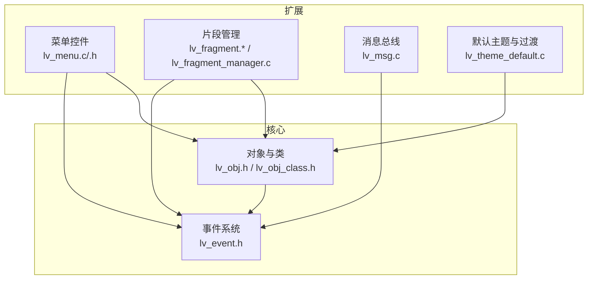
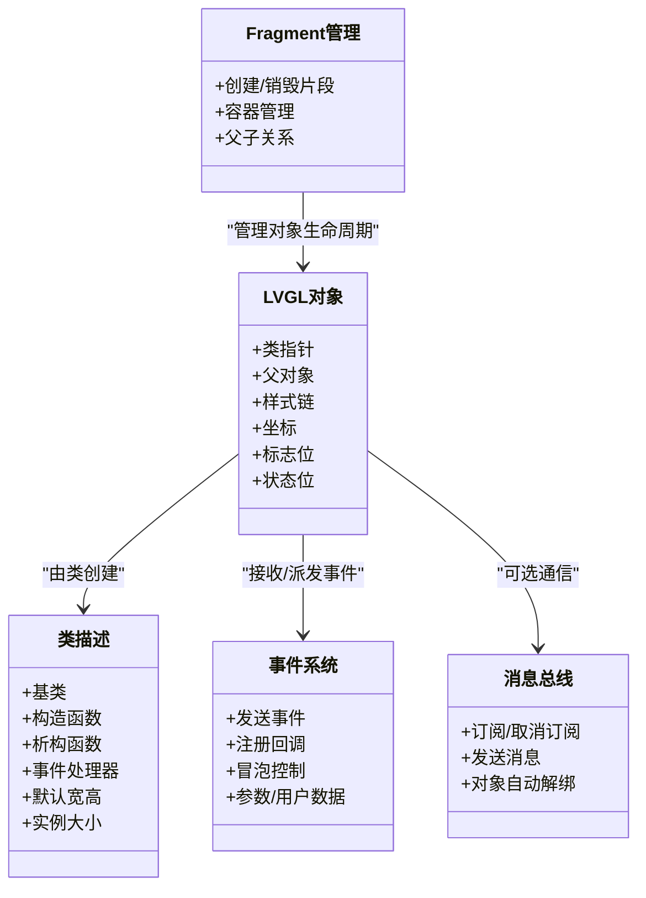
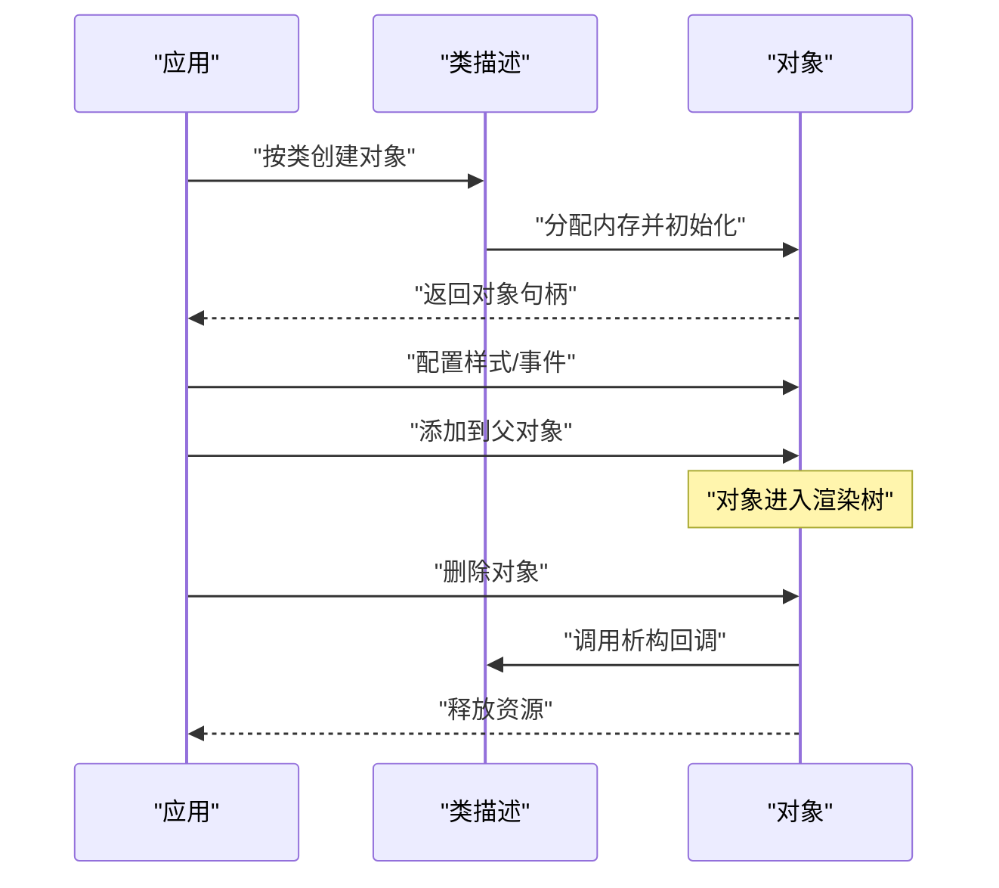
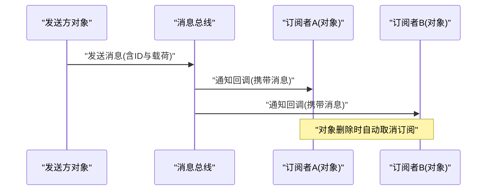
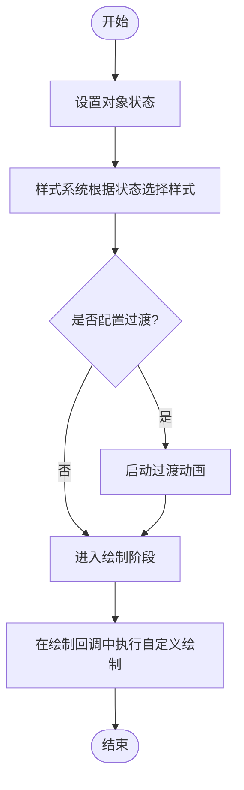
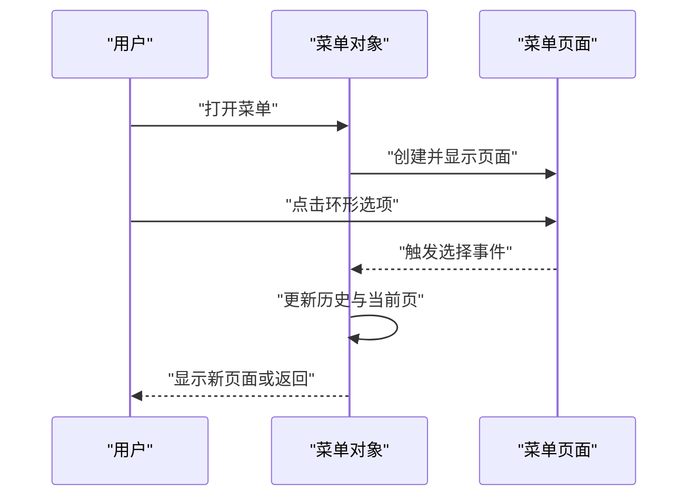
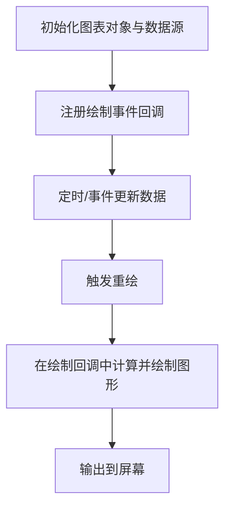
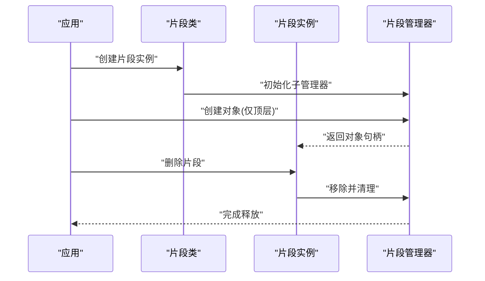
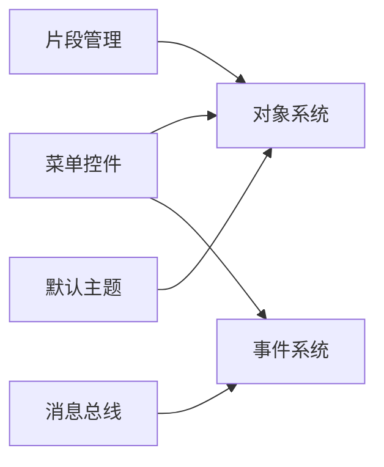

# 自定义组件开发

<cite>
**本文引用的文件**   
- [lv_obj.h](file://ESP32开发板/TK021F2699_ESP32_LVGL_GIF_LED/TK021F2699_ESP32_LVGL_GIF_LED/managed_components/lvgl__lvgl/src/core/lv_obj.h)
- [lv_obj_class.h](file://ESP32开发板/TK021F2699_ESP32_LVGL_GIF_LED/TK021F2699_ESP32_LVGL_GIF_LED/managed_components/lvgl__lvgl/src/core/lv_obj_class.h)
- [lv_event.h](file://ESP32开发板/TK021F2699_ESP32_LVGL_GIF_LED/TK021F2699_ESP32_LVGL_GIF_LED/managed_components/lvgl__lvgl/src/core/lv_event.h)
- [lv_menu.c](file://ESP32开发板/TK021F2699_ESP32_LVGL_GIF_LED/TK021F2699_ESP32_LVGL_GIF_LED/managed_components/lvgl__lvgl/src/extra/widgets/menu/lv_menu.c)
- [lv_menu.h](file://ESP32开发板/TK021F2699_ESP32_LVGL_GIF_LED/TK021F2699_ESP32_LVGL_GIF_LED/managed_components/lvgl__lvgl/src/extra/widgets/menu/lv_menu.h)
- [lv_fragment.h](file://ESP32开发板/TK021F2699_ESP32_LVGL_GIF_LED/TK021F2699_ESP32_LVGL_GIF_LED/managed_components/lvgl__lvgl/src/extra/others/fragment/lv_fragment.h)
- [lv_fragment.c](file://ESP32开发板/TK021F2699_ESP32_LVGL_GIF_LED/TK021F2699_ESP32_LVGL_GIF_LED/managed_components/lvgl__lvgl/src/extra/others/fragment/lv_fragment.c)
- [lv_fragment_manager.c](file://ESP32开发板/TK021F2699_ESP32_LVGL_GIF_LED/TK021F2699_ESP32_LVGL_GIF_LED/managed_components/lvgl__lvgl/src/extra/others/fragment/lv_fragment_manager.c)
- [lv_msg.c](file://ESP32开发板/TK021F2699_ESP32_LVGL_GIF_LED/TK021F2699_ESP32_LVGL_GIF_LED/managed_components/lvgl__lvgl/src/extra/others/msg/lv_msg.c)
- [lv_theme_default.c](file://ESP32开发板/TK021F2699_ESP32_LVGL_GIF_LED/TK021F2699_ESP32_LVGL_GIF_LED/managed_components/lvgl__lvgl/src/extra/themes/default/lv_theme_default.c)
</cite>

## 目录
1. [简介](#简介)
2. [项目结构](#项目结构)
3. [核心组件](#核心组件)
4. [架构总览](#架构总览)
5. [详细组件分析](#详细组件分析)
6. [依赖关系分析](#依赖关系分析)
7. [性能考虑](#性能考虑)
8. [故障排查指南](#故障排查指南)
9. [结论](#结论)
10. [附录](#附录)

## 简介
本指南面向希望在LVGL上开发自定义组件的工程师，围绕对象模型与类系统、生命周期管理、继承机制、样式系统与绘制回调、动画与状态管理、事件处理与消息传递等主题展开。文档结合仓库中的菜单组件、Fragment（片段）框架、消息总线以及默认主题示例，提供从基础到进阶的系统化说明，并给出可操作的流程图与时序图，帮助读者快速上手并构建高质量的可复用控件。

## 项目结构
本项目在ESP32工程下集成了LVGL源码与示例。与自定义组件开发密切相关的代码主要位于：
- 核心对象与类系统：src/core 下的 lv_obj.h、lv_obj_class.h、lv_event.h
- 扩展控件：src/extra/widgets/menu/lv_menu.c/.h
- 片段管理：src/extra/others/fragment/lv_fragment.*、lv_fragment_manager.c
- 消息总线：src/extra/others/msg/lv_msg.c
- 主题与过渡：src/extra/themes/default/lv_theme_default.c

图表来源
- [lv_obj.h:174-193](file://ESP32开发板/TK021F2699_ESP32_LVGL_GIF_LED/TK021F2699_ESP32_LVGL_GIF_LED/managed_components/lvgl__lvgl/src/core/lv_obj.h#L174-L193)
- [lv_obj_class.h:49-63](file://ESP32开发板/TK021F2699_ESP32_LVGL_GIF_LED/TK021F2699_ESP32_LVGL_GIF_LED/managed_components/lvgl__lvgl/src/core/lv_obj_class.h#L49-L63)
- [lv_event.h:32-92](file://ESP32开发板/TK021F2699_ESP32_LVGL_GIF_LED/TK021F2699_ESP32_LVGL_GIF_LED/managed_components/lvgl__lvgl/src/core/lv_event.h#L32-L92)
- [lv_menu.c:38-86](file://ESP32开发板/TK021F2699_ESP32_LVGL_GIF_LED/TK021F2699_ESP32_LVGL_GIF_LED/managed_components/lvgl__lvgl/src/extra/widgets/menu/lv_menu.c#L38-L86)
- [lv_fragment.h:36-98](file://ESP32开发板/TK021F2699_ESP32_LVGL_GIF_LED/TK021F2699_ESP32_LVGL_GIF_LED/managed_components/lvgl__lvgl/src/extra/others/fragment/lv_fragment.h#L36-L98)
- [lv_msg.c:116-123](file://ESP32开发板/TK021F2699_ESP32_LVGL_GIF_LED/TK021F2699_ESP32_LVGL_GIF_LED/managed_components/lvgl__lvgl/src/extra/others/msg/lv_msg.c#L116-L123)
- [lv_theme_default.c:205-233](file://ESP32开发板/TK021F2699_ESP32_LVGL_GIF_LED/TK021F2699_ESP32_LVGL_GIF_LED/managed_components/lvgl__lvgl/src/extra/themes/default/lv_theme_default.c#L205-L233)

章节来源
- [lv_obj.h:174-193](file://ESP32开发板/TK021F2699_ESP32_LVGL_GIF_LED/TK021F2699_ESP32_LVGL_GIF_LED/managed_components/lvgl__lvgl/src/core/lv_obj.h#L174-L193)
- [lv_obj_class.h:49-63](file://ESP32开发板/TK021F2699_ESP32_LVGL_GIF_LED/TK021F2699_ESP32_LVGL_GIF_LED/managed_components/lvgl__lvgl/src/core/lv_obj_class.h#L49-L63)
- [lv_event.h:32-92](file://ESP32开发板/TK021F2699_ESP32_LVGL_GIF_LED/TK021F2699_ESP32_LVGL_GIF_LED/managed_components/lvgl__lvgl/src/core/lv_event.h#L32-L92)
- [lv_menu.c:38-86](file://ESP32开发板/TK021F2699_ESP32_LVGL_GIF_LED/TK021F2699_ESP32_LVGL_GIF_LED/managed_components/lvgl__lvgl/src/extra/widgets/menu/lv_menu.c#L38-L86)
- [lv_fragment.h:36-98](file://ESP32开发板/TK021F2699_ESP32_LVGL_GIF_LED/TK021F2699_ESP32_LVGL_GIF_LED/managed_components/lvgl__lvgl/src/extra/others/fragment/lv_fragment.h#L36-L98)
- [lv_msg.c:116-123](file://ESP32开发板/TK021F2699_ESP32_LVGL_GIF_LED/TK021F2699_ESP32_LVGL_GIF_LED/managed_components/lvgl__lvgl/src/extra/others/msg/lv_msg.c#L116-L123)
- [lv_theme_default.c:205-233](file://ESP32开发板/TK021F2699_ESP32_LVGL_GIF_LED/TK021F2699_ESP32_LVGL_GIF_LED/managed_components/lvgl__lvgl/src/extra/themes/default/lv_theme_default.c#L205-L233)

## 核心组件
本节聚焦LVGL对象模型与类系统的关键概念，为后续自定义控件开发奠定基础。

- 对象结构与状态
  - 对象包含类指针、父对象、可选扩展属性、样式链、坐标、标志位、状态位等。
  - 状态用于描述交互态（如按下、聚焦、禁用），样式可根据状态切换并触发过渡动画。
- 类系统与继承
  - 每个对象由一个类描述，类定义构造函数、析构函数、默认尺寸、实例大小、事件处理器等。
  - 通过 base_class 实现继承，子类可复用父类行为并覆盖特定逻辑。
- 事件系统
  - 事件类型涵盖输入、绘制、特殊与通用事件；支持冒泡与停止传播。
  - 可在事件回调中获取目标对象、当前目标、参数、用户数据等上下文信息。

章节来源
- [lv_obj.h:41-83](file://ESP32开发板/TK021F2699_ESP32_LVGL_GIF_LED/TK021F2699_ESP32_LVGL_GIF_LED/managed_components/lvgl__lvgl/src/core/lv_obj.h#L41-L83)
- [lv_obj.h:174-193](file://ESP32开发板/TK021F2699_ESP32_LVGL_GIF_LED/TK021F2699_ESP32_LVGL_GIF_LED/managed_components/lvgl__lvgl/src/core/lv_obj.h#L174-L193)
- [lv_obj_class.h:49-63](file://ESP32开发板/TK021F2699_ESP32_LVGL_GIF_LED/TK021F2699_ESP32_LVGL_GIF_LED/managed_components/lvgl__lvgl/src/core/lv_obj_class.h#L49-L63)
- [lv_event.h:32-92](file://ESP32开发板/TK021F2699_ESP32_LVGL_GIF_LED/TK021F2699_ESP32_LVGL_GIF_LED/managed_components/lvgl__lvgl/src/core/lv_event.h#L32-L92)

## 架构总览
下图展示自定义控件在LVGL中的位置与交互路径：控件基于对象类创建，使用样式系统进行外观定制，通过事件系统响应交互，必要时借助消息总线进行跨对象通信，并可利用Fragment组织复杂界面。

图表来源
- [lv_obj.h:174-193](file://ESP32开发板/TK021F2699_ESP32_LVGL_GIF_LED/TK021F2699_ESP32_LVGL_GIF_LED/managed_components/lvgl__lvgl/src/core/lv_obj.h#L174-L193)
- [lv_obj_class.h:49-63](file://ESP32开发板/TK021F2699_ESP32_LVGL_GIF_LED/TK021F2699_ESP32_LVGL_GIF_LED/managed_components/lvgl__lvgl/src/core/lv_obj_class.h#L49-L63)
- [lv_event.h:146-154](file://ESP32开发板/TK021F2699_ESP32_LVGL_GIF_LED/TK021F2699_ESP32_LVGL_GIF_LED/managed_components/lvgl__lvgl/src/core/lv_event.h#L146-L154)
- [lv_msg.c:76-88](file://ESP32开发板/TK021F2699_ESP32_LVGL_GIF_LED/TK021F2699_ESP32_LVGL_GIF_LED/managed_components/lvgl__lvgl/src/extra/others/msg/lv_msg.c#L76-L88)
- [lv_fragment.h:36-98](file://ESP32开发板/TK021F2699_ESP32_LVGL_GIF_LED/TK021F2699_ESP32_LVGL_GIF_LED/managed_components/lvgl__lvgl/src/extra/others/fragment/lv_fragment.h#L36-L98)

## 详细组件分析

### 对象与类系统（继承与生命周期）
- 类定义要点
  - 基类引用、构造/析构回调、事件处理器、默认尺寸、实例大小。
  - 通过设置 instance_size 使对象拥有私有数据区。
- 对象创建流程
  - 使用类创建对象并初始化，随后进入渲染树。
- 生命周期
  - 构造阶段完成私有数据初始化；析构阶段释放资源；删除时清理事件与样式。

图表来源
- [lv_obj_class.h:75-79](file://ESP32开发板/TK021F2699_ESP32_LVGL_GIF_LED/TK021F2699_ESP32_LVGL_GIF_LED/managed_components/lvgl__lvgl/src/core/lv_obj_class.h#L75-L79)
- [lv_obj.h:226-226](file://ESP32开发板/TK021F2699_ESP32_LVGL_GIF_LED/TK021F2699_ESP32_LVGL_GIF_LED/managed_components/lvgl__lvgl/src/core/lv_obj.h#L226-L226)

章节来源
- [lv_obj_class.h:49-63](file://ESP32开发板/TK021F2699_ESP32_LVGL_GIF_LED/TK021F2699_ESP32_LVGL_GIF_LED/managed_components/lvgl__lvgl/src/core/lv_obj_class.h#L49-L63)
- [lv_obj.h:174-193](file://ESP32开发板/TK021F2699_ESP32_LVGL_GIF_LED/TK021F2699_ESP32_LVGL_GIF_LED/managed_components/lvgl__lvgl/src/core/lv_obj.h#L174-L193)

### 事件处理机制与消息传递
- 事件类型与回调
  - 输入事件（点击、长按、滚动）、绘制事件（主绘制、后绘制、部件绘制）、通用事件（值改变、删除、布局变化）。
  - 支持事件冒泡与停止传播，便于分层处理。
- 消息总线
  - 对象订阅消息并在删除时自动解绑，避免悬挂回调。
  - 适合跨层级或无直接关系的对象通信。

图表来源
- [lv_event.h:32-92](file://ESP32开发板/TK021F2699_ESP32_LVGL_GIF_LED/TK021F2699_ESP32_LVGL_GIF_LED/managed_components/lvgl__lvgl/src/core/lv_event.h#L32-L92)
- [lv_msg.c:116-123](file://ESP32开发板/TK021F2699_ESP32_LVGL_GIF_LED/TK021F2699_ESP32_LVGL_GIF_LED/managed_components/lvgl__lvgl/src/extra/others/msg/lv_msg.c#L116-L123)
- [lv_msg.c:76-88](file://ESP32开发板/TK021F2699_ESP32_LVGL_GIF_LED/TK021F2699_ESP32_LVGL_GIF_LED/managed_components/lvgl__lvgl/src/extra/others/msg/lv_msg.c#L76-L88)

章节来源
- [lv_event.h:146-154](file://ESP32开发板/TK021F2699_ESP32_LVGL_GIF_LED/TK021F2699_ESP32_LVGL_GIF_LED/managed_components/lvgl__lvgl/src/core/lv_event.h#L146-L154)
- [lv_msg.c:76-88](file://ESP32开发板/TK021F2699_ESP32_LVGL_GIF_LED/TK021F2699_ESP32_LVGL_GIF_LED/managed_components/lvgl__lvgl/src/extra/others/msg/lv_msg.c#L76-L88)

### 样式系统与绘制回调（深度定制）
- 状态与部件
  - 状态（按下、聚焦、禁用等）与部件（背景、指示器、滑块手柄等）组合，形成丰富的样式表达。
- 过渡动画
  - 通过过渡描述指定属性集合、缓动曲线、时长与延迟，实现平滑的状态切换。
- 绘制回调
  - 在绘制事件中插入自定义绘制逻辑，例如绘制环形进度、刻度线或自定义图标。

图表来源
- [lv_obj.h:41-83](file://ESP32开发板/TK021F2699_ESP32_LVGL_GIF_LED/TK021F2699_ESP32_LVGL_GIF_LED/managed_components/lvgl__lvgl/src/core/lv_obj.h#L41-L83)
- [lv_theme_default.c:205-233](file://ESP32开发板/TK021F2699_ESP32_LVGL_GIF_LED/TK021F2699_ESP32_LVGL_GIF_LED/managed_components/lvgl__lvgl/src/extra/themes/default/lv_theme_default.c#L205-L233)

章节来源
- [lv_obj.h:41-83](file://ESP32开发板/TK021F2699_ESP32_LVGL_GIF_LED/TK021F2699_ESP32_LVGL_GIF_LED/managed_components/lvgl__lvgl/src/core/lv_obj.h#L41-L83)
- [lv_theme_default.c:205-233](file://ESP32开发板/TK021F2699_ESP32_LVGL_GIF_LED/TK021F2699_ESP32_LVGL_GIF_LED/managed_components/lvgl__lvgl/src/extra/themes/default/lv_theme_default.c#L205-L233)

### 实际案例一：环形菜单（基于菜单控件）
- 设计思路
  - 使用菜单控件作为容器，页面作为子项，通过历史栈管理导航深度。
  - 在页面中布置环形布局的子项，配合点击事件实现选中与跳转。
- 关键API与结构
  - 菜单类与页面类定义、创建函数、设置当前页、刷新显示。
  - 通过事件回调处理用户选择，更新菜单状态与页面内容。

图表来源
- [lv_menu.c:38-86](file://ESP32开发板/TK021F2699_ESP32_LVGL_GIF_LED/TK021F2699_ESP32_LVGL_GIF_LED/managed_components/lvgl__lvgl/src/extra/widgets/menu/lv_menu.c#L38-L86)
- [lv_menu.c:140-162](file://ESP32开发板/TK021F2699_ESP32_LVGL_GIF_LED/TK021F2699_ESP32_LVGL_GIF_LED/managed_components/lvgl__lvgl/src/extra/widgets/menu/lv_menu.c#L140-L162)
- [lv_menu.c:164-196](file://ESP32开发板/TK021F2699_ESP32_LVGL_GIF_LED/TK021F2699_ESP32_LVGL_GIF_LED/managed_components/lvgl__lvgl/src/extra/widgets/menu/lv_menu.c#L164-L196)
- [lv_menu.h:74-112](file://ESP32开发板/TK021F2699_ESP32_LVGL_GIF_LED/TK021F2699_ESP32_LVGL_GIF_LED/managed_components/lvgl__lvgl/src/extra/widgets/menu/lv_menu.h#L74-L112)

章节来源
- [lv_menu.c:38-86](file://ESP32开发板/TK021F2699_ESP32_LVGL_GIF_LED/TK021F2699_ESP32_LVGL_GIF_LED/managed_components/lvgl__lvgl/src/extra/widgets/menu/lv_menu.c#L38-L86)
- [lv_menu.c:140-162](file://ESP32开发板/TK021F2699_ESP32_LVGL_GIF_LED/TK021F2699_ESP32_LVGL_GIF_LED/managed_components/lvgl__lvgl/src/extra/widgets/menu/lv_menu.c#L140-L162)
- [lv_menu.c:164-196](file://ESP32开发板/TK021F2699_ESP32_LVGL_GIF_LED/TK021F2699_ESP32_LVGL_GIF_LED/managed_components/lvgl__lvgl/src/extra/widgets/menu/lv_menu.c#L164-L196)
- [lv_menu.h:74-112](file://ESP32开发板/TK021F2699_ESP32_LVGL_GIF_LED/TK021F2699_ESP32_LVGL_GIF_LED/managed_components/lvgl__lvgl/src/extra/widgets/menu/lv_menu.h#L74-L112)

### 实际案例二：动态图表（基于绘制回调与事件）
- 设计思路
  - 使用基础对象作为画布，在绘制回调中计算并绘制折线/柱状图。
  - 通过定时器或事件驱动更新数据源，触发重绘。
- 关键点
  - 在 LV_EVENT_DRAW_MAIN/POST 中执行自定义绘制。
  - 使用样式与颜色区分不同系列，结合状态切换高亮数据点。

[此图为概念性流程，不直接映射具体文件，故不提供图表来源]

章节来源
- [lv_event.h:54-64](file://ESP32开发板/TK021F2699_ESP32_LVGL_GIF_LED/TK021F2699_ESP32_LVGL_GIF_LED/managed_components/lvgl__lvgl/src/core/lv_event.h#L54-L64)

### 片段管理（Fragment）与对象生命周期
- 片段类与实例
  - 片段类定义构造/析构、附加/分离、创建对象、对象创建后回调等。
  - 片段实例持有类指针、管理器、子管理器与对象句柄。
- 管理器职责
  - 维护附着列表与堆栈，负责对象的创建与销毁，确保顶层片段优先创建。
- 生命周期钩子
  - 在对象创建后与删除前提供回调，便于绑定事件与释放资源。

图表来源
- [lv_fragment.h:36-98](file://ESP32开发板/TK021F2699_ESP32_LVGL_GIF_LED/TK021F2699_ESP32_LVGL_GIF_LED/managed_components/lvgl__lvgl/src/extra/others/fragment/lv_fragment.h#L36-L98)
- [lv_fragment.c:24-37](file://ESP32开发板/TK021F2699_ESP32_LVGL_GIF_LED/TK021F2699_ESP32_LVGL_GIF_LED/managed_components/lvgl__lvgl/src/extra/others/fragment/lv_fragment.c#L24-L37)
- [lv_fragment.c:79-98](file://ESP32开发板/TK021F2699_ESP32_LVGL_GIF_LED/TK021F2699_ESP32_LVGL_GIF_LED/managed_components/lvgl__lvgl/src/extra/others/fragment/lv_fragment.c#L79-L98)
- [lv_fragment_manager.c:65-100](file://ESP32开发板/TK021F2699_ESP32_LVGL_GIF_LED/TK021F2699_ESP32_LVGL_GIF_LED/managed_components/lvgl__lvgl/src/extra/others/fragment/lv_fragment_manager.c#L65-L100)

章节来源
- [lv_fragment.h:36-98](file://ESP32开发板/TK021F2699_ESP32_LVGL_GIF_LED/TK021F2699_ESP32_LVGL_GIF_LED/managed_components/lvgl__lvgl/src/extra/others/fragment/lv_fragment.h#L36-L98)
- [lv_fragment.c:24-37](file://ESP32开发板/TK021F2699_ESP32_LVGL_GIF_LED/TK021F2699_ESP32_LVGL_GIF_LED/managed_components/lvgl__lvgl/src/extra/others/fragment/lv_fragment.c#L24-L37)
- [lv_fragment.c:79-98](file://ESP32开发板/TK021F2699_ESP32_LVGL_GIF_LED/TK021F2699_ESP32_LVGL_GIF_LED/managed_components/lvgl__lvgl/src/extra/others/fragment/lv_fragment.c#L79-L98)
- [lv_fragment_manager.c:65-100](file://ESP32开发板/TK021F2699_ESP32_LVGL_GIF_LED/TK021F2699_ESP32_LVGL_GIF_LED/managed_components/lvgl__lvgl/src/extra/others/fragment/lv_fragment_manager.c#L65-L100)

## 依赖关系分析
- 耦合与内聚
  - 菜单控件强依赖对象与事件系统，弱依赖布局与标签/按钮/图片等基础控件。
  - 片段管理与对象系统紧密耦合，但通过类抽象保持良好内聚。
- 外部依赖
  - 主题模块依赖样式与过渡能力，为控件提供一致的视觉风格。
  - 消息总线独立于对象树，适用于松耦合通信。

图表来源
- [lv_menu.c:38-86](file://ESP32开发板/TK021F2699_ESP32_LVGL_GIF_LED/TK021F2699_ESP32_LVGL_GIF_LED/managed_components/lvgl__lvgl/src/extra/widgets/menu/lv_menu.c#L38-L86)
- [lv_fragment.h:36-98](file://ESP32开发板/TK021F2699_ESP32_LVGL_GIF_LED/TK021F2699_ESP32_LVGL_GIF_LED/managed_components/lvgl__lvgl/src/extra/others/fragment/lv_fragment.h#L36-L98)
- [lv_theme_default.c:205-233](file://ESP32开发板/TK021F2699_ESP32_LVGL_GIF_LED/TK021F2699_ESP32_LVGL_GIF_LED/managed_components/lvgl__lvgl/src/extra/themes/default/lv_theme_default.c#L205-L233)
- [lv_msg.c:116-123](file://ESP32开发板/TK021F2699_ESP32_LVGL_GIF_LED/TK021F2699_ESP32_LVGL_GIF_LED/managed_components/lvgl__lvgl/src/extra/others/msg/lv_msg.c#L116-L123)

章节来源
- [lv_menu.c:38-86](file://ESP32开发板/TK021F2699_ESP32_LVGL_GIF_LED/TK021F2699_ESP32_LVGL_GIF_LED/managed_components/lvgl__lvgl/src/extra/widgets/menu/lv_menu.c#L38-L86)
- [lv_fragment.h:36-98](file://ESP32开发板/TK021F2699_ESP32_LVGL_GIF_LED/TK021F2699_ESP32_LVGL_GIF_LED/managed_components/lvgl__lvgl/src/extra/others/fragment/lv_fragment.h#L36-L98)
- [lv_theme_default.c:205-233](file://ESP32开发板/TK021F2699_ESP32_LVGL_GIF_LED/TK021F2699_ESP32_LVGL_GIF_LED/managed_components/lvgl__lvgl/src/extra/themes/default/lv_theme_default.c#L205-L233)
- [lv_msg.c:116-123](file://ESP32开发板/TK021F2699_ESP32_LVGL_GIF_LED/TK021F2699_ESP32_LVGL_GIF_LED/managed_components/lvgl__lvgl/src/extra/others/msg/lv_msg.c#L116-L123)

## 性能考虑
- 减少不必要的重绘
  - 仅在数据变化时触发重绘，合并多次更新。
- 合理使用过渡动画
  - 过渡属性过多或时长过长会影响帧率，按需启用。
- 绘制回调优化
  - 避免在绘制回调中进行耗时计算，尽量预计算或使用缓存。
- 事件与消息
  - 避免在高频事件中进行阻塞操作，必要时使用异步任务或定时器。

[本节为通用指导，不涉及具体文件分析]

## 故障排查指南
- 常见问题定位
  - 对象无效：检查对象是否已被删除或类型不匹配。
  - 事件未触发：确认事件过滤器与冒泡设置是否正确。
  - 样式未生效：检查状态与部件是否匹配，过渡是否被跳过。
  - 内存泄漏：确保析构回调正确释放资源，片段管理器正确清理。
- 调试技巧
  - 使用日志宏打印关键路径。
  - 在事件回调中记录目标对象与参数，辅助定位问题。
  - 对频繁更新的图表，降低刷新频率或分块绘制。

章节来源
- [lv_event.h:146-154](file://ESP32开发板/TK021F2699_ESP32_LVGL_GIF_LED/TK021F2699_ESP32_LVGL_GIF_LED/managed_components/lvgl__lvgl/src/core/lv_event.h#L146-L154)
- [lv_msg.c:76-88](file://ESP32开发板/TK021F2699_ESP32_LVGL_GIF_LED/TK021F2699_ESP32_LVGL_GIF_LED/managed_components/lvgl__lvgl/src/extra/others/msg/lv_msg.c#L76-L88)

## 结论
通过理解LVGL的对象模型与类系统、掌握事件与消息机制、熟练运用样式与绘制回调，开发者可以高效构建高性能、可复用的自定义控件。结合菜单与片段管理等实际案例，能够进一步验证并完善组件的生命周期与交互逻辑。建议在开发过程中注重性能与可维护性，采用模块化设计与清晰的接口契约，以提升整体质量。

## 附录
- 术语表
  - 对象：UI元素的最小单元，具备类、样式、事件与生命周期。
  - 类：描述对象的共同方法与默认行为。
  - 状态：描述对象交互态的位域，影响样式与动画。
  - 部件：对象内部可独立样式化的部分。
  - 事件：对象间通信的基本方式，支持冒泡与停止传播。
  - 消息：跨对象松耦合通信机制，支持自动解绑。
  - 片段：界面片段的封装与管理，简化复杂UI的组织。

[本节为概念性内容，不涉及具体文件分析]