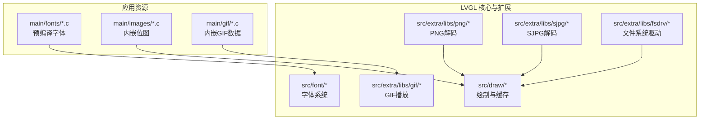
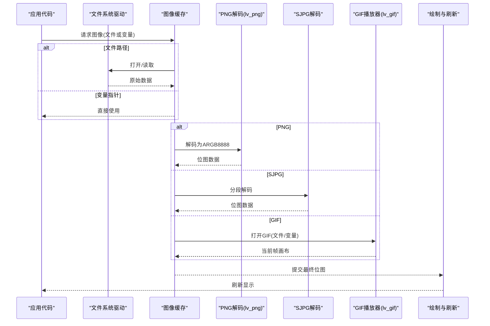
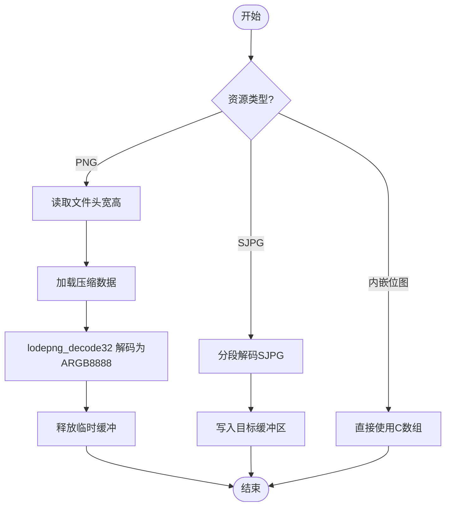
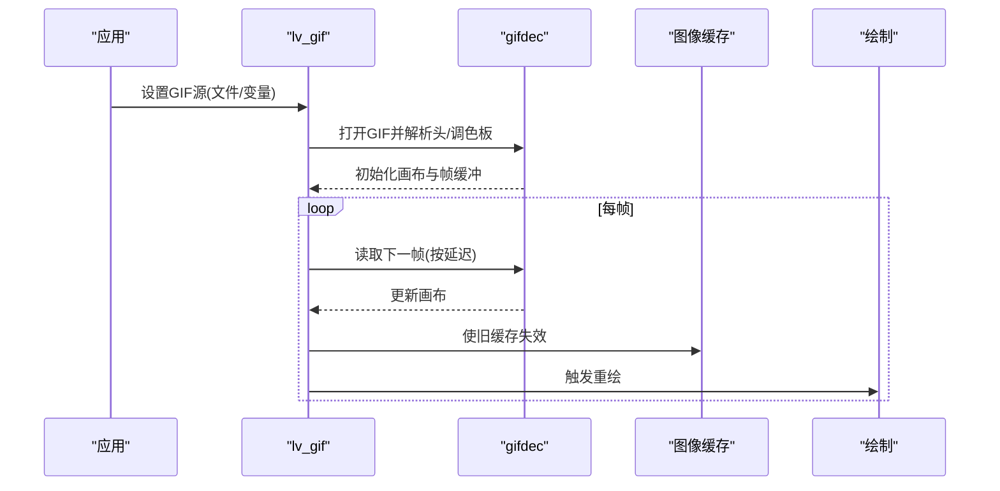
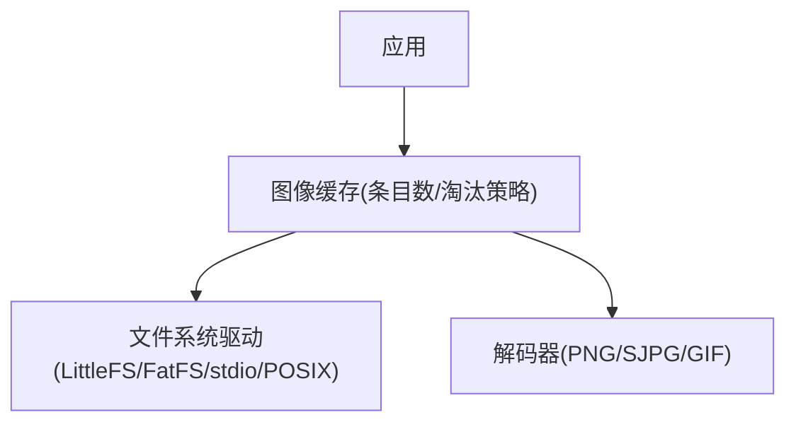
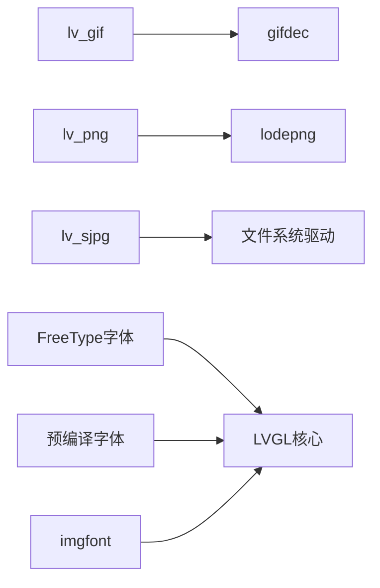

# 资源管理与优化

<cite>
**本文引用的文件**
- [README.md](file://ESP32开发板/TK021F2699_ESP32_LVGL_GIF_LED/TK021F2699_ESP32_LVGL_GIF_LED/README.md)
- [ui_font_Alibaba_PuHuiTi_Font_14.c](file://ESP32开发板/TK021F2699_ESP32_LVGL_GIF_LED/TK021F2699_ESP32_LVGL_GIF_LED/main/fonts/ui_font_Alibaba_PuHuiTi_Font_14.c)
- [lv_imgfont.h](file://ESP32开发板/TK021F2699_ESP32_LVGL_GIF_LED/TK021F2699_ESP32_LVGL_GIF_LED/managed_components/lvgl__lvgl/src/extra/others/imgfont/lv_imgfont.h)
- [lv_imgfont.c](file://ESP32开发板/TK021F2699_ESP32_LVGL_GIF_LED/TK021F2699_ESP32_LVGL_GIF_LED/managed_components/lvgl__lvgl/src/extra/others/imgfont/lv_imgfont.c)
- [lv_freetype.c](file://ESP32开发板/TK021F2699_ESP32_LVGL_GIF_LED/TK021F2699_ESP32_LVGL_GIF_LED/managed_components/lvgl__lvgl/src/extra/libs/freetype/lv_freetype.c)
- [font.md](file://ESP32开发板/TK021F2699_ESP32_LVGL_GIF_LED/TK021F2699_ESP32_LVGL_GIF_LED/managed_components/lvgl__lvgl/docs/overview/font.md)
- [ui_img_1063244380.c](file://ESP32开发板/TK021F2699_ESP32_LVGL_GIF_LED/TK021F2699_ESP32_LVGL_GIF_LED/main/images/ui_img_1063244380.c)
- [minions_0.c](file://ESP32开发板/TK021F2699_ESP32_LVGL_GIF_LED/TK021F2699_ESP32_LVGL_GIF_LED/main/gif/minions_0.c)
- [lv_gif.h](file://ESP32开发板/TK021F2699_ESP32_LVGL_GIF_LED/TK021F2699_ESP32_LVGL_GIF_LED/managed_components/lvgl__lvgl/src/extra/libs/gif/lv_gif.h)
- [lv_gif.c](file://ESP32开发板/TK021F2699_ESP32_LVGL_GIF_LED/TK021F2699_ESP32_LVGL_GIF_LED/managed_components/lvgl__lvgl/src/extra/libs/gif/lv_gif.c)
- [gifdec.h](file://ESP32开发板/TK021F2699_ESP32_LVGL_GIF_LED/TK021F2699_ESP32_LVGL_GIF_LED/managed_components/lvgl__lvgl/src/extra/libs/gif/gifdec.h)
- [gifdec.c](file://ESP32开发板/TK021F2699_ESP32_LVGL_GIF_LED/TK021F2699_ESP32_LVGL_GIF_LED/managed_components/lvgl__lvgl/src/extra/libs/gif/gifdec.c)
- [lv_png.c](file://ESP32开发板/TK021F2699_ESP32_LVGL_GIF_LED/TK021F2699_ESP32_LVGL_GIF_LED/managed_components/lvgl__lvgl/src/extra/libs/png/lv_png.c)
- [lodepng.c](file://ESP32开发板/TK021F2699_ESP32_LVGL_GIF_LED/TK021F2699_ESP32_LVGL_GIF_LED/managed_components/lvgl__lvgl/src/extra/libs/png/lodepng.c)
- [lv_sjpg.c](file://ESP32开发板/TK021F2699_ESP32_LVGL_GIF_LED/TK021F2699_ESP32_LVGL_GIF_LED/managed_components/lvgl__lvgl/src/extra/libs/sjpg/lv_sjpg.c)
- [image.md](file://ESP32开发板/TK021F2699_ESP32_LVGL_GIF_LED/TK021F2699_ESP32_LVGL_GIF_LED/managed_components/lvgl__lvgl/docs/overview/image.md)
- [lv_fs_littlefs.c](file://ESP32开发板/TK021F2699_ESP32_LVGL_GIF_LED/TK021F2699_ESP32_LVGL_GIF_LED/managed_components/lvgl__lvgl/src/extra/libs/fsdrv/lv_fs_littlefs.c)
- [lv_fs_fatfs.c](file://ESP32开发板/TK021F2699_ESP32_LVGL_GIF_LED/TK021F2699_ESP32_LVGL_GIF_LED/managed_components/lvgl__lvgl/src/extra/libs/fsdrv/lv_fs_fatfs.c)
- [lv_fs_stdio.c](file://ESP32开发板/TK021F2699_ESP32_LVGL_GIF_LED/TK021F2699_ESP32_LVGL_GIF_LED/managed_components/lvgl__lvgl/src/extra/libs/fsdrv/lv_fs_stdio.c)
- [lv_fs_posix.c](file://ESP32开发板/TK021F2699_ESP32_LVGL_GIF_LED/TK021F2699_ESP32_LVGL_GIF_LED/managed_components/lvgl__lvgl/src/extra/libs/fsdrv/lv_fs_posix.c)
- [lv_obj.c](file://ESP32开发板/TK021F2699_ESP32_LVGL_GIF_LED/TK021F2699_ESP32_LVGL_GIF_LED/managed_components/lvgl__lvgl/src/core/lv_obj.c)
</cite>

## 目录
1. [简介](#简介)
2. [项目结构](#项目结构)
3. [核心组件](#核心组件)
4. [架构总览](#架构总览)
5. [详细组件分析](#详细组件分析)
6. [依赖关系分析](#依赖关系分析)
7. [性能考虑](#性能考虑)
8. [故障排查指南](#故障排查指南)
9. [结论](#结论)
10. [附录](#附录)

## 简介
本指南面向在 ESP32-S3 + LVGL 平台上进行资源管理的开发者，聚焦字体、图像与 GIF 动画的生成、压缩、加载与内存管理，并结合文件系统与缓存机制提供可落地的优化策略。文档基于仓库中的实际实现与示例，覆盖：
- 字体的离线编译与运行时渲染（FreeType）
- 图片资源的内嵌与解码（PNG、JPEG/SJPEG）
- GIF 动画播放流程与帧调度
- 文件系统驱动注册与缓存
- 内存使用分析与泄漏定位方法
- 资源打包与部署最佳实践

## 项目结构
本项目采用“应用资源 + LVGL 库”的分层组织方式：
- 应用资源位于 main 目录，包含生成的字体 C 数组、静态图片 C 数组以及内嵌 GIF 数据
- LVGL 库位于 managed_components/lvgl__lvgl，包含字体、图像解码、GIF 播放、文件系统驱动等模块



图表来源
- [README.md:1-122](file://ESP32开发板/TK021F2699_ESP32_LVGL_GIF_LED/TK021F2699_ESP32_LVGL_GIF_LED/README.md#L1-L122)
- [ui_font_Alibaba_PuHuiTi_Font_14.c:1-800](file://ESP32开发板/TK021F2699_ESP32_LVGL_GIF_LED/TK021F2699_ESP32_LVGL_GIF_LED/main/fonts/ui_font_Alibaba_PuHuiTi_Font_14.c#L1-L800)
- [ui_img_1063244380.c:1-61](file://ESP32开发板/TK021F2699_ESP32_LVGL_GIF_LED/TK021F2699_ESP32_LVGL_GIF_LED/main/images/ui_img_1063244380.c#L1-L61)
- [minions_0.c:1-800](file://ESP32开发板/TK021F2699_ESP32_LVGL_GIF_LED/TK021F2699_ESP32_LVGL_GIF_LED/main/gif/minions_0.c#L1-L800)

章节来源
- [README.md:1-122](file://ESP32开发板/TK021F2699_ESP32_LVGL_GIF_LED/TK021F2699_ESP32_LVGL_GIF_LED/README.md#L1-L122)

## 核心组件
- 字体子系统
  - 预编译字体：以 C 数组形式嵌入，包含字形位图与描述表，适合小范围字符集与固定字号
  - FreeType 运行时渲染：按需从 TTF/OTF 生成字形位图，支持粗体、斜体等样式
  - 图像字体（imgfont）：将每个字符映射为外部图片路径，动态获取位图
- 图像子系统
  - PNG 解码：通过 lodepng 将 PNG 解码为 ARGB8888，再转换为 LVGL 目标格式
  - JPEG/SJPEG 解码：SJPG 为多片段 JPEG 的自定义封装，便于嵌入式平台分块解码
  - 内嵌位图：由工具（如 SquareLine Studio）将图片转为 C 数组，直接作为 lv_img_dsc_t 使用
- GIF 播放
  - 基于 gifdec 解析 GIF 头、调色板与帧数据，按时间戳推进帧并刷新显示
- 文件系统与缓存
  - 多种 FS 驱动（LittleFS、FatFS、stdio、POSIX）统一注册到 LVGL 文件系统接口
  - 图像缓存控制打开的资源数量与淘汰策略，避免频繁 IO 与重复解码

章节来源
- [ui_font_Alibaba_PuHuiTi_Font_14.c:1-800](file://ESP32开发板/TK021F2699_ESP32_LVGL_GIF_LED/TK021F2699_ESP32_LVGL_GIF_LED/main/fonts/ui_font_Alibaba_PuHuiTi_Font_14.c#L1-L800)
- [lv_freetype.c:190-539](file://ESP32开发板/TK021F2699_ESP32_LVGL_GIF_LED/TK021F2699_ESP32_LVGL_GIF_LED/managed_components/lvgl__lvgl/src/extra/libs/freetype/lv_freetype.c#L190-L539)
- [lv_imgfont.h:1-60](file://ESP32开发板/TK021F2699_ESP32_LVGL_GIF_LED/TK021F2699_ESP32_LVGL_GIF_LED/managed_components/lvgl__lvgl/src/extra/others/imgfont/lv_imgfont.h#L1-L60)
- [lv_imgfont.c:59-108](file://ESP32开发板/TK021F2699_ESP32_LVGL_GIF_LED/TK021F2699_ESP32_LVGL_GIF_LED/managed_components/lvgl__lvgl/src/extra/others/imgfont/lv_imgfont.c#L59-L108)
- [ui_img_1063244380.c:1-61](file://ESP32开发板/TK021F2699_ESP32_LVGL_GIF_LED/TK021F2699_ESP32_LVGL_GIF_LED/main/images/ui_img_1063244380.c#L1-L61)
- [lv_png.c:55-182](file://ESP32开发板/TK021F2699_ESP32_LVGL_GIF_LED/TK021F2699_ESP32_LVGL_GIF_LED/managed_components/lvgl__lvgl/src/extra/libs/png/lv_png.c#L55-L182)
- [lodepng.c:4953-5035](file://ESP32开发板/TK021F2699_ESP32_LVGL_GIF_LED/TK021F2699_ESP32_LVGL_GIF_LED/managed_components/lvgl__lvgl/src/extra/libs/png/lodepng.c#L4953-L5035)
- [lv_sjpg.c:1-25](file://ESP32开发板/TK021F2699_ESP32_LVGL_GIF_LED/TK021F2699_ESP32_LVGL_GIF_LED/managed_components/lvgl__lvgl/src/extra/libs/sjpg/lv_sjpg.c#L1-L25)
- [lv_gif.h:1-58](file://ESP32开发板/TK021F2699_ESP32_LVGL_GIF_LED/TK021F2699_ESP32_LVGL_GIF_LED/managed_components/lvgl__lvgl/src/extra/libs/gif/lv_gif.h#L1-L58)
- [lv_gif.c:1-154](file://ESP32开发板/TK021F2699_ESP32_LVGL_GIF_LED/TK021F2699_ESP32_LVGL_GIF_LED/managed_components/lvgl__lvgl/src/extra/libs/gif/lv_gif.c#L1-L154)
- [gifdec.h:1-60](file://ESP32开发板/TK021F2699_ESP32_LVGL_GIF_LED/TK021F2699_ESP32_LVGL_GIF_LED/managed_components/lvgl__lvgl/src/extra/libs/gif/gifdec.h#L1-L60)
- [gifdec.c:78-633](file://ESP32开发板/TK021F2699_ESP32_LVGL_GIF_LED/TK021F2699_ESP32_LVGL_GIF_LED/managed_components/lvgl__lvgl/src/extra/libs/gif/gifdec.c#L78-L633)
- [lv_fs_littlefs.c:49-96](file://ESP32开发板/TK021F2699_ESP32_LVGL_GIF_LED/TK021F2699_ESP32_LVGL_GIF_LED/managed_components/lvgl__lvgl/src/extra/libs/fsdrv/lv_fs_littlefs.c#L49-L96)
- [lv_fs_fatfs.c:45-95](file://ESP32开发板/TK021F2699_ESP32_LVGL_GIF_LED/TK021F2699_ESP32_LVGL_GIF_LED/managed_components/lvgl__lvgl/src/extra/libs/fsdrv/lv_fs_fatfs.c#L45-L95)
- [lv_fs_stdio.c:51-96](file://ESP32开发板/TK021F2699_ESP32_LVGL_GIF_LED/TK021F2699_ESP32_LVGL_GIF_LED/managed_components/lvgl__lvgl/src/extra/libs/fsdrv/lv_fs_stdio.c#L51-L96)
- [lv_fs_posix.c:48-93](file://ESP32开发板/TK021F2699_ESP32_LVGL_GIF_LED/TK021F2699_ESP32_LVGL_GIF_LED/managed_components/lvgl__lvgl/src/extra/libs/fsdrv/lv_fs_posix.c#L48-L93)

## 架构总览
下图展示了资源从“源文件/内嵌数据”到“渲染输出”的整体路径，包括字体、图像与 GIF 的关键环节。



图表来源
- [lv_png.c:55-182](file://ESP32开发板/TK021F2699_ESP32_LVGL_GIF_LED/TK021F2699_ESP32_LVGL_GIF_LED/managed_components/lvgl__lvgl/src/extra/libs/png/lv_png.c#L55-L182)
- [lodepng.c:4953-5035](file://ESP32开发板/TK021F2699_ESP32_LVGL_GIF_LED/TK021F2699_ESP32_LVGL_GIF_LED/managed_components/lvgl__lvgl/src/extra/libs/png/lodepng.c#L4953-L5035)
- [lv_sjpg.c:1-25](file://ESP32开发板/TK021F2699_ESP32_LVGL_GIF_LED/TK021F2699_ESP32_LVGL_GIF_LED/managed_components/lvgl__lvgl/src/extra/libs/sjpg/lv_sjpg.c#L1-L25)
- [lv_gif.c:1-154](file://ESP32开发板/TK021F2699_ESP32_LVGL_GIF_LED/TK021F2699_ESP32_LVGL_GIF_LED/managed_components/lvgl__lvgl/src/extra/libs/gif/lv_gif.c#L1-L154)
- [gifdec.c:78-633](file://ESP32开发板/TK021F2699_ESP32_LVGL_GIF_LED/TK021F2699_ESP32_LVGL_GIF_LED/managed_components/lvgl__lvgl/src/extra/libs/gif/gifdec.c#L78-L633)
- [lv_fs_littlefs.c:49-96](file://ESP32开发板/TK021F2699_ESP32_LVGL_GIF_LED/TK021F2699_ESP32_LVGL_GIF_LED/managed_components/lvgl__lvgl/src/extra/libs/fsdrv/lv_fs_littlefs.c#L49-L96)

## 详细组件分析

### 字体资源：生成、压缩与加载
- 预编译字体（C 数组）
  - 特点：包含字形位图与描述表，体积小、加载快，适合固定字符集与字号
  - 生成方式：使用在线字体转换器或命令行工具生成，指定 bpp、size、字符范围等参数
  - 使用方式：直接引用生成的 lv_font_t 对象
- FreeType 运行时渲染
  - 特点：按需从 TTF/OTF 生成字形位图，支持粗体、斜体等样式，灵活但需要更多 RAM
  - 关键点：Face/Size 激活、轮廓转位图、BPP=8 的灰度图
- 图像字体（imgfont）
  - 特点：每个字符对应一张图片，通过回调返回路径，适合图标化字体
  - 生命周期：创建/销毁需显式管理，避免内存泄漏

```mermaid
classDiagram
class 预编译字体 {
+字形位图数组
+描述表(glyph_dsc)
+字符映射(cmap)
+使用 : 直接注册lv_font_t
}
class FreeType字体 {
+Face/Size句柄
+轮廓转位图
+支持粗体/斜体
+使用 : 运行时生成字形
}
class 图像字体(imgfont) {
+高度配置
+路径回调(path_cb)
+创建/销毁API
+使用 : 字符->图片路径
}
预编译字体 <.. FreeType字体 : "互补方案"
预编译字体 <.. 图像字体 : "互补方案"
```

图表来源
- [ui_font_Alibaba_PuHuiTi_Font_14.c:1-800](file://ESP32开发板/TK021F2699_ESP32_LVGL_GIF_LED/TK021F2699_ESP32_LVGL_GIF_LED/main/fonts/ui_font_Alibaba_PuHuiTi_Font_14.c#L1-L800)
- [lv_freetype.c:190-539](file://ESP32开发板/TK021F2699_ESP32_LVGL_GIF_LED/TK021F2699_ESP32_LVGL_GIF_LED/managed_components/lvgl__lvgl/src/extra/libs/freetype/lv_freetype.c#L190-L539)
- [lv_imgfont.h:1-60](file://ESP32开发板/TK021F2699_ESP32_LVGL_GIF_LED/TK021F2699_ESP32_LVGL_GIF_LED/managed_components/lvgl__lvgl/src/extra/others/imgfont/lv_imgfont.h#L1-L60)
- [lv_imgfont.c:59-108](file://ESP32开发板/TK021F2699_ESP32_LVGL_GIF_LED/TK021F2699_ESP32_LVGL_GIF_LED/managed_components/lvgl__lvgl/src/extra/others/imgfont/lv_imgfont.c#L59-L108)
- [font.md:152-180](file://ESP32开发板/TK021F2699_ESP32_LVGL_GIF_LED/TK021F2699_ESP32_LVGL_GIF_LED/managed_components/lvgl__lvgl/docs/overview/font.md#L152-L180)

章节来源
- [ui_font_Alibaba_PuHuiTi_Font_14.c:1-800](file://ESP32开发板/TK021F2699_ESP32_LVGL_GIF_LED/TK021F2699_ESP32_LVGL_GIF_LED/main/fonts/ui_font_Alibaba_PuHuiTi_Font_14.c#L1-L800)
- [lv_freetype.c:190-539](file://ESP32开发板/TK021F2699_ESP32_LVGL_GIF_LED/TK021F2699_ESP32_LVGL_GIF_LED/managed_components/lvgl__lvgl/src/extra/libs/freetype/lv_freetype.c#L190-L539)
- [lv_imgfont.h:1-60](file://ESP32开发板/TK021F2699_ESP32_LVGL_GIF_LED/TK021F2699_ESP32_LVGL_GIF_LED/managed_components/lvgl__lvgl/src/extra/others/imgfont/lv_imgfont.h#L1-L60)
- [lv_imgfont.c:59-108](file://ESP32开发板/TK021F2699_ESP32_LVGL_GIF_LED/TK021F2699_ESP32_LVGL_GIF_LED/managed_components/lvgl__lvgl/src/extra/others/imgfont/lv_imgfont.c#L59-L108)
- [font.md:152-180](file://ESP32开发板/TK021F2699_ESP32_LVGL_GIF_LED/TK021F2699_ESP32_LVGL_GIF_LED/managed_components/lvgl__lvgl/docs/overview/font.md#L152-L180)

### 图像资源：格式支持与压缩算法
- PNG
  - 解码流程：读取文件头宽高 -> 加载压缩数据 -> lodepng_decode32 解码为 ARGB8888 -> 释放临时缓冲
  - 内存占用：解码后位图大小 = 宽×高×4 字节；建议结合图像缓存减少重复解码
- JPEG/SJPEG
  - SJPEG 为多片段 JPEG 的自定义封装，便于嵌入式平台分块解码，整体体积接近原 JPEG
  - 适用场景：大图背景、照片类资源
- 内嵌位图
  - 由工具生成 C 数组，直接作为 lv_img_dsc_t 使用，无需运行时解码，适合 UI 图标与小图



图表来源
- [lv_png.c:55-182](file://ESP32开发板/TK021F2699_ESP32_LVGL_GIF_LED/TK021F2699_ESP32_LVGL_GIF_LED/managed_components/lvgl__lvgl/src/extra/libs/png/lv_png.c#L55-L182)
- [lodepng.c:4953-5035](file://ESP32开发板/TK021F2699_ESP32_LVGL_GIF_LED/TK021F2699_ESP32_LVGL_GIF_LED/managed_components/lvgl__lvgl/src/extra/libs/png/lodepng.c#L4953-L5035)
- [lv_sjpg.c:1-25](file://ESP32开发板/TK021F2699_ESP32_LVGL_GIF_LED/TK021F2699_ESP32_LVGL_GIF_LED/managed_components/lvgl__lvgl/src/extra/libs/sjpg/lv_sjpg.c#L1-L25)
- [ui_img_1063244380.c:1-61](file://ESP32开发板/TK021F2699_ESP32_LVGL_GIF_LED/TK021F2699_ESP32_LVGL_GIF_LED/main/images/ui_img_1063244380.c#L1-L61)

章节来源
- [lv_png.c:55-182](file://ESP32开发板/TK021F2699_ESP32_LVGL_GIF_LED/TK021F2699_ESP32_LVGL_GIF_LED/managed_components/lvgl__lvgl/src/extra/libs/png/lv_png.c#L55-L182)
- [lodepng.c:4953-5035](file://ESP32开发板/TK021F2699_ESP32_LVGL_GIF_LED/TK021F2699_ESP32_LVGL_GIF_LED/managed_components/lvgl__lvgl/src/extra/libs/png/lodepng.c#L4953-L5035)
- [lv_sjpg.c:1-25](file://ESP32开发板/TK021F2699_ESP32_LVGL_GIF_LED/TK021F2699_ESP32_LVGL_GIF_LED/managed_components/lvgl__lvgl/src/extra/libs/sjpg/lv_sjpg.c#L1-L25)
- [ui_img_1063244380.c:1-61](file://ESP32开发板/TK021F2699_ESP32_LVGL_GIF_LED/TK021F2699_ESP32_LVGL_GIF_LED/main/images/ui_img_1063244380.c#L1-L61)

### GIF 动画：播放原理与性能优化
- 播放流程
  - 打开 GIF（文件/变量），解析头部、全局调色板、画布尺寸
  - 定时器驱动下一帧，根据 GCE 延迟判断是否推进
  - 渲染帧至画布，使图像缓存失效并触发重绘
- 关键数据结构
  - gd_GIF：保存文件句柄、画布、帧缓冲、循环计数、GCE 信息等
- 性能优化
  - 合理设置定时器周期，避免过度刷新
  - 控制同时播放的 GIF 数量，降低峰值内存
  - 使用较小的分辨率与调色板深度，减少解码开销



图表来源
- [lv_gif.h:1-58](file://ESP32开发板/TK021F2699_ESP32_LVGL_GIF_LED/TK021F2699_ESP32_LVGL_GIF_LED/managed_components/lvgl__lvgl/src/extra/libs/gif/lv_gif.h#L1-L58)
- [lv_gif.c:1-154](file://ESP32开发板/TK021F2699_ESP32_LVGL_GIF_LED/TK021F2699_ESP32_LVGL_GIF_LED/managed_components/lvgl__lvgl/src/extra/libs/gif/lv_gif.c#L1-L154)
- [gifdec.h:1-60](file://ESP32开发板/TK021F2699_ESP32_LVGL_GIF_LED/TK021F2699_ESP32_LVGL_GIF_LED/managed_components/lvgl__lvgl/src/extra/libs/gif/gifdec.h#L1-L60)
- [gifdec.c:78-633](file://ESP32开发板/TK021F2699_ESP32_LVGL_GIF_LED/TK021F2699_ESP32_LVGL_GIF_LED/managed_components/lvgl__lvgl/src/extra/libs/gif/gifdec.c#L78-L633)
- [minions_0.c:1-800](file://ESP32开发板/TK021F2699_ESP32_LVGL_GIF_LED/TK021F2699_ESP32_LVGL_GIF_LED/main/gif/minions_0.c#L1-L800)

章节来源
- [lv_gif.h:1-58](file://ESP32开发板/TK021F2699_ESP32_LVGL_GIF_LED/TK021F2699_ESP32_LVGL_GIF_LED/managed_components/lvgl__lvgl/src/extra/libs/gif/lv_gif.h#L1-L58)
- [lv_gif.c:1-154](file://ESP32开发板/TK021F2699_ESP32_LVGL_GIF_LED/TK021F2699_ESP32_LVGL_GIF_LED/managed_components/lvgl__lvgl/src/extra/libs/gif/lv_gif.c#L1-L154)
- [gifdec.h:1-60](file://ESP32开发板/TK021F2699_ESP32_LVGL_GIF_LED/TK021F2699_ESP32_LVGL_GIF_LED/managed_components/lvgl__lvgl/src/extra/libs/gif/gifdec.h#L1-L60)
- [gifdec.c:78-633](file://ESP32开发板/TK021F2699_ESP32_LVGL_GIF_LED/TK021F2699_ESP32_LVGL_GIF_LED/managed_components/lvgl__lvgl/src/extra/libs/gif/gifdec.c#L78-L633)
- [minions_0.c:1-800](file://ESP32开发板/TK021F2699_ESP32_LVGL_GIF_LED/TK021F2699_ESP32_LVGL_GIF_LED/main/gif/minions_0.c#L1-L800)

### 文件系统集成与资源缓存
- 文件系统驱动
  - LittleFS/FatFS/stdio/POSIX 驱动通过统一接口注册，提供 open/read/seek/tell 等回调
  - 驱动字母标识与缓存大小可配置，适配不同存储介质
- 图像缓存
  - 默认缓存大小可在初始化时设置，控制同时打开的资源条目数
  - 当超过缓存容量时，依据“打开耗时”评估淘汰策略，保留更“有价值”的条目
  - 若底层资源变更，需手动使特定或全部缓存失效



图表来源
- [lv_fs_littlefs.c:49-96](file://ESP32开发板/TK021F2699_ESP32_LVGL_GIF_LED/TK021F2699_ESP32_LVGL_GIF_LED/managed_components/lvgl__lvgl/src/extra/libs/fsdrv/lv_fs_littlefs.c#L49-L96)
- [lv_fs_fatfs.c:45-95](file://ESP32开发板/TK021F2699_ESP32_LVGL_GIF_LED/TK021F2699_ESP32_LVGL_GIF_LED/managed_components/lvgl__lvgl/src/extra/libs/fsdrv/lv_fs_fatfs.c#L45-L95)
- [lv_fs_stdio.c:51-96](file://ESP32开发板/TK021F2699_ESP32_LVGL_GIF_LED/TK021F2699_ESP32_LVGL_GIF_LED/managed_components/lvgl__lvgl/src/extra/libs/fsdrv/lv_fs_stdio.c#L51-L96)
- [lv_fs_posix.c:48-93](file://ESP32开发板/TK021F2699_ESP32_LVGL_GIF_LED/TK021F2699_ESP32_LVGL_GIF_LED/managed_components/lvgl__lvgl/src/extra/libs/fsdrv/lv_fs_posix.c#L48-L93)
- [image.md:294-316](file://ESP32开发板/TK021F2699_ESP32_LVGL_GIF_LED/TK021F2699_ESP32_LVGL_GIF_LED/managed_components/lvgl__lvgl/docs/overview/image.md#L294-L316)
- [lv_obj.c:148](file://ESP32开发板/TK021F2699_ESP32_LVGL_GIF_LED/TK021F2699_ESP32_LVGL_GIF_LED/managed_components/lvgl__lvgl/src/core/lv_obj.c#L148)

章节来源
- [lv_fs_littlefs.c:49-96](file://ESP32开发板/TK021F2699_ESP32_LVGL_GIF_LED/TK021F2699_ESP32_LVGL_GIF_LED/managed_components/lvgl__lvgl/src/extra/libs/fsdrv/lv_fs_littlefs.c#L49-L96)
- [lv_fs_fatfs.c:45-95](file://ESP32开发板/TK021F2699_ESP32_LVGL_GIF_LED/TK021F2699_ESP32_LVGL_GIF_LED/managed_components/lvgl__lvgl/src/extra/libs/fsdrv/lv_fs_fatfs.c#L45-L95)
- [lv_fs_stdio.c:51-96](file://ESP32开发板/TK021F2699_ESP32_LVGL_GIF_LED/TK021F2699_ESP32_LVGL_GIF_LED/managed_components/lvgl__lvgl/src/extra/libs/fsdrv/lv_fs_stdio.c#L51-L96)
- [lv_fs_posix.c:48-93](file://ESP32开发板/TK021F2699_ESP32_LVGL_GIF_LED/TK021F2699_ESP32_LVGL_GIF_LED/managed_components/lvgl__lvgl/src/extra/libs/fsdrv/lv_fs_posix.c#L48-L93)
- [image.md:294-316](file://ESP32开发板/TK021F2699_ESP32_LVGL_GIF_LED/TK021F2699_ESP32_LVGL_GIF_LED/managed_components/lvgl__lvgl/docs/overview/image.md#L294-L316)
- [lv_obj.c:148](file://ESP32开发板/TK021F2699_ESP32_LVGL_GIF_LED/TK021F2699_ESP32_LVGL_GIF_LED/managed_components/lvgl__lvgl/src/core/lv_obj.c#L148)

## 依赖关系分析
- 组件耦合
  - GIF 播放器依赖 gifdec 解析与 LVGL 定时器/事件机制
  - PNG/SJPG 解码依赖 LVGL 文件系统与图像缓存
  - 字体子系统可选择预编译、FreeType 或 imgfont 三种模式
- 外部依赖
  - lodepng（PNG）、gifdec（GIF）、FreeType（可选）
- 潜在循环依赖
  - 通过分层接口（FS 驱动、解码器、缓存）解耦，避免直接循环调用



图表来源
- [lv_gif.c:1-154](file://ESP32开发板/TK021F2699_ESP32_LVGL_GIF_LED/TK021F2699_ESP32_LVGL_GIF_LED/managed_components/lvgl__lvgl/src/extra/libs/gif/lv_gif.c#L1-L154)
- [gifdec.c:78-633](file://ESP32开发板/TK021F2699_ESP32_LVGL_GIF_LED/TK021F2699_ESP32_LVGL_GIF_LED/managed_components/lvgl__lvgl/src/extra/libs/gif/gifdec.c#L78-L633)
- [lv_png.c:55-182](file://ESP32开发板/TK021F2699_ESP32_LVGL_GIF_LED/TK021F2699_ESP32_LVGL_GIF_LED/managed_components/lvgl__lvgl/src/extra/libs/png/lv_png.c#L55-L182)
- [lodepng.c:4953-5035](file://ESP32开发板/TK021F2699_ESP32_LVGL_GIF_LED/TK021F2699_ESP32_LVGL_GIF_LED/managed_components/lvgl__lvgl/src/extra/libs/png/lodepng.c#L4953-L5035)
- [lv_sjpg.c:1-25](file://ESP32开发板/TK021F2699_ESP32_LVGL_GIF_LED/TK021F2699_ESP32_LVGL_GIF_LED/managed_components/lvgl__lvgl/src/extra/libs/sjpg/lv_sjpg.c#L1-L25)
- [lv_freetype.c:190-539](file://ESP32开发板/TK021F2699_ESP32_LVGL_GIF_LED/TK021F2699_ESP32_LVGL_GIF_LED/managed_components/lvgl__lvgl/src/extra/libs/freetype/lv_freetype.c#L190-L539)

## 性能考虑
- 字体
  - 优先使用预编译字体以减少运行时 CPU 与 RAM 压力
  - 若必须使用 FreeType，限制字符集与字号，避免过多 Face/Size 切换
- 图像
  - 大图优先使用 SJPG 分块解码，降低一次性内存峰值
  - 合理使用图像缓存大小，平衡命中率与内存占用
- GIF
  - 控制同时播放数量与分辨率，避免帧率抖动
  - 调整定时器周期匹配 GIF 延迟，减少无效刷新
- 文件系统
  - 选择合适 FS 驱动与缓存大小，确保 IO 吞吐稳定
- 内存布局
  - 参考项目说明，将帧缓冲置于 PSRAM 以降低内部 SRAM 压力，注意 SPI0 带宽限制

[本节为通用指导，不直接分析具体文件]

## 故障排查指南
- 常见问题
  - 字体缺失或乱码：检查字符范围与编码，确认已包含所需 Unicode 区间
  - PNG 解码失败：确认文件头可读且未损坏，检查 lodepng 错误码
  - GIF 无动画：检查 GCE 延迟与循环计数，确认定时器正常触发
  - 内存不足：减少同时打开的资源数量，调低图像缓存条目，或使用 SJPG
- 定位方法
  - 使用日志宏观察解码与缓存行为
  - 监控 lv_mem_alloc/free 分配情况，识别未释放资源
  - 对动态资源（FreeType、imgfont）确保正确销毁

章节来源
- [lv_png.c:55-182](file://ESP32开发板/TK021F2699_ESP32_LVGL_GIF_LED/TK021F2699_ESP32_LVGL_GIF_LED/managed_components/lvgl__lvgl/src/extra/libs/png/lv_png.c#L55-L182)
- [lodepng.c:4953-5035](file://ESP32开发板/TK021F2699_ESP32_LVGL_GIF_LED/TK021F2699_ESP32_LVGL_GIF_LED/managed_components/lvgl__lvgl/src/extra/libs/png/lodepng.c#L4953-L5035)
- [lv_gif.c:1-154](file://ESP32开发板/TK021F2699_ESP32_LVGL_GIF_LED/TK021F2699_ESP32_LVGL_GIF_LED/managed_components/lvgl__lvgl/src/extra/libs/gif/lv_gif.c#L1-L154)
- [gifdec.c:78-633](file://ESP32开发板/TK021F2699_ESP32_LVGL_GIF_LED/TK021F2699_ESP32_LVGL_GIF_LED/managed_components/lvgl__lvgl/src/extra/libs/gif/gifdec.c#L78-L633)
- [image.md:294-316](file://ESP32开发板/TK021F2699_ESP32_LVGL_GIF_LED/TK021F2699_ESP32_LVGL_GIF_LED/managed_components/lvgl__lvgl/docs/overview/image.md#L294-L316)

## 结论
通过在构建期生成字体与内嵌位图、在运行期按需解码 PNG/SJPG、并以 gifdec 驱动 GIF 播放，配合 LVGL 文件系统与图像缓存，可以在 ESP32-S3 上实现高效稳定的资源管理。关键在于：
- 选择合适的字体策略（预编译 vs FreeType vs imgfont）
- 针对大图采用 SJPG 分块解码
- 控制 GIF 播放规模与刷新频率
- 合理配置文件系统与图像缓存
- 建立完善的内存使用监控与清理流程

[本节为总结性内容，不直接分析具体文件]

## 附录
- 资源打包与部署最佳实践
  - 将常用字体与图标以预编译 C 数组形式固化，减少运行时 IO
  - 大图与照片使用 SJPG，并在构建脚本中批量转换
  - GIF 资源尽量控制在较小分辨率与帧数，必要时拆分为多个短循环
  - 在应用启动阶段注册 FS 驱动并设置合适的图像缓存大小
  - 对动态资源（FreeType、imgfont）在退出或页面切换时显式销毁

[本节为通用指导，不直接分析具体文件]