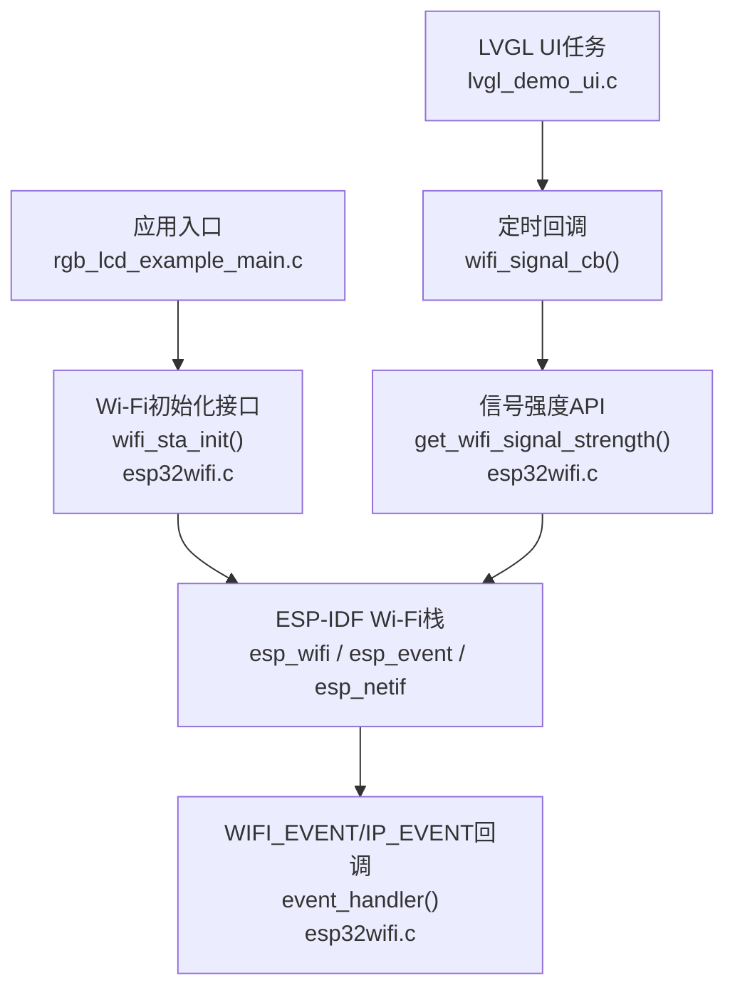
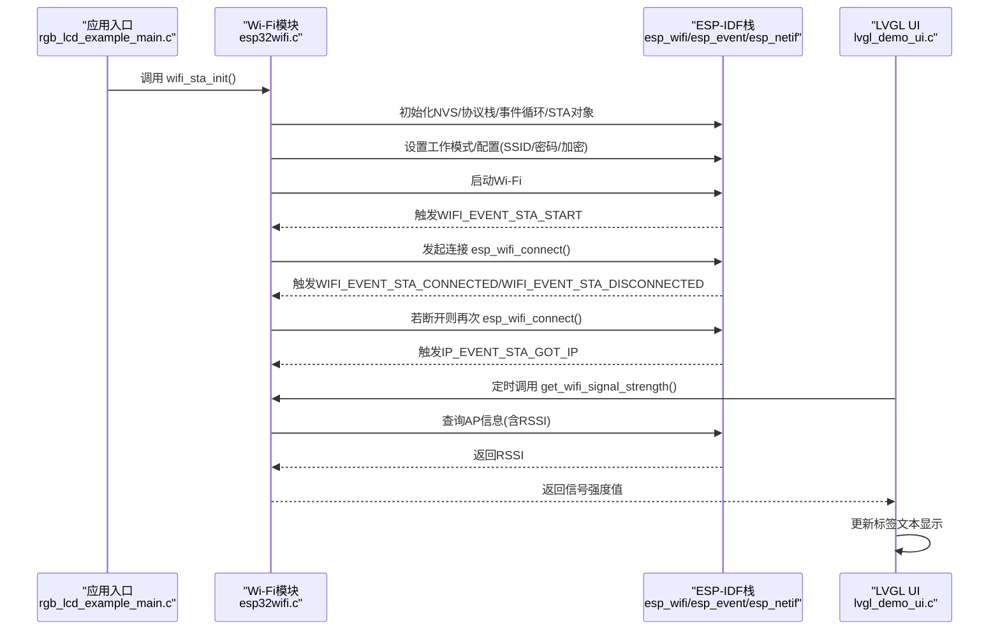
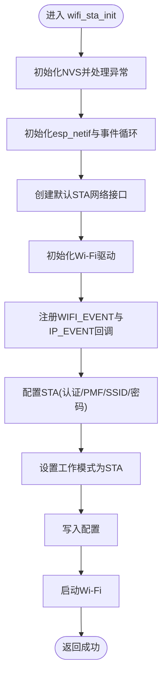
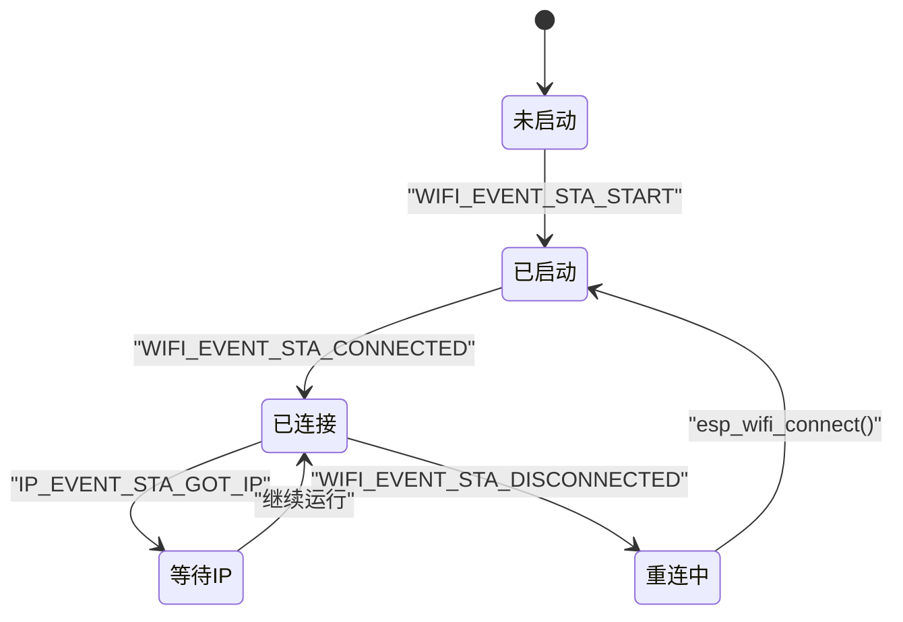
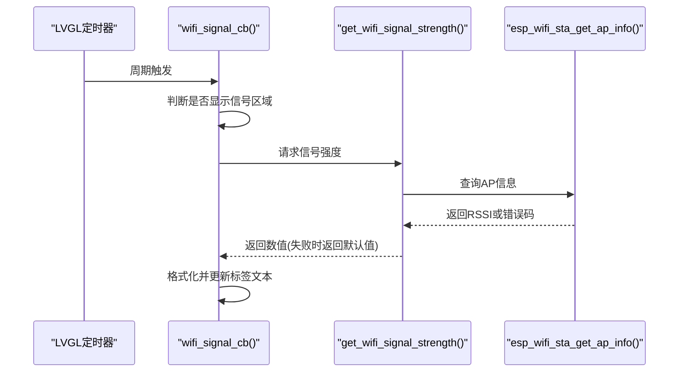
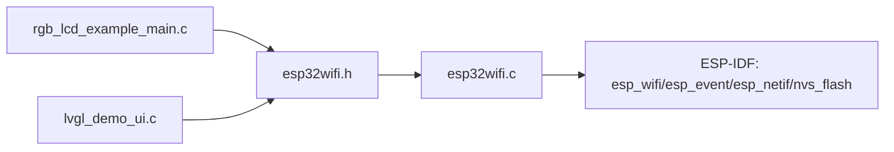

# Wi-Fi功能模块

<cite>
**本文引用的文件**   
- [esp32wifi.h](file://ESP32开发板/TK021F2699_ESP32_LVGL_GIF_LED/TK021F2699_ESP32_LVGL_GIF_LED/main/wifi/esp32wifi.h)
- [esp32wifi.c](file://ESP32开发板/TK021F2699_ESP32_LVGL_GIF_LED/TK021F2699_ESP32_LVGL_GIF_LED/main/wifi/esp32wifi.c)
- [rgb_lcd_example_main.c](file://ESP32开发板/TK021F2699_ESP32_LVGL_GIF_LED/TK021F2699_ESP32_LVGL_GIF_LED/main/rgb_lcd_example_main.c)
- [lvgl_demo_ui.c](file://ESP32开发板/TK021F2699_ESP32_LVGL_GIF_LED/TK021F2699_ESP32_LVGL_GIF_LED/main/ui/lvgl_demo_ui.c)
</cite>

## 目录
1. [简介](#简介)
2. [项目结构](#项目结构)
3. [核心组件](#核心组件)
4. [架构总览](#架构总览)
5. [详细组件分析](#详细组件分析)
6. [依赖关系分析](#依赖关系分析)
7. [性能与健壮性](#性能与健壮性)
8. [故障排除指南](#故障排除指南)
9. [结论](#结论)
10. [附录：配置与安全最佳实践](#附录配置与安全最佳实践)

## 简介
本技术文档围绕Wi-Fi功能模块，系统阐述以下方面：
- 网络连接初始化流程（重点解析 wifi_sta_init()）
- 连接状态管理与断线重连机制
- 信号强度获取算法与UI更新机制
- 网络事件处理与异步通信模式
- 与主UI系统的集成和数据同步方式
- 配置优化、安全设置与健壮性方案（重试、重连）
- 调试工具与常见问题排查

## 项目结构
Wi-Fi相关代码位于 main/wifi 目录，由头文件声明接口，实现文件完成底层驱动与事件处理；应用入口在 main/rgb_lcd_example_main.c 中调用初始化；UI层在 main/ui/lvgl_demo_ui.c 中定时读取并刷新信号强度显示。

图示来源
- [rgb_lcd_example_main.c:150-156](file://ESP32开发板/TK021F2699_ESP32_LVGL_GIF_LED/TK021F2699_ESP32_LVGL_GIF_LED/main/rgb_lcd_example_main.c#L150-L156)
- [esp32wifi.c:45-95](file://ESP32开发板/TK021F2699_ESP32_LVGL_GIF_LED/TK021F2699_ESP32_LVGL_GIF_LED/main/wifi/esp32wifi.c#L45-L95)
- [esp32wifi.c:14-43](file://ESP32开发板/TK021F2699_ESP32_LVGL_GIF_LED/TK021F2699_ESP32_LVGL_GIF_LED/main/wifi/esp32wifi.c#L14-L43)
- [lvgl_demo_ui.c:248-260](file://ESP32开发板/TK021F2699_ESP32_LVGL_GIF_LED/TK021F2699_ESP32_LVGL_GIF_LED/main/ui/lvgl_demo_ui.c#L248-L260)

章节来源
- [rgb_lcd_example_main.c:150-156](file://ESP32开发板/TK021F2699_ESP32_LVGL_GIF_LED/TK021F2699_ESP32_LVGL_GIF_LED/main/rgb_lcd_example_main.c#L150-L156)
- [esp32wifi.h:28-34](file://ESP32开发板/TK021F2699_ESP32_LVGL_GIF_LED/TK021F2699_ESP32_LVGL_GIF_LED/main/wifi/esp32wifi.h#L28-L34)
- [esp32wifi.c:45-95](file://ESP32开发板/TK021F2699_ESP32_LVGL_GIF_LED/TK021F2699_ESP32_LVGL_GIF_LED/main/wifi/esp32wifi.c#L45-L95)
- [lvgl_demo_ui.c:248-260](file://ESP32开发板/TK021F2699_ESP32_LVGL_GIF_LED/TK021F2699_ESP32_LVGL_GIF_LED/main/ui/lvgl_demo_ui.c#L248-L260)

## 核心组件
- Wi-Fi初始化与配置：提供 wifi_sta_init() 完成NVS、协议栈、事件循环、STA对象、Wi-Fi驱动初始化、默认配置写入与启动。
- 事件处理：通过 esp_event 注册 WIFI_EVENT 与 IP_EVENT 回调，统一处理连接、断开、IP分配等事件，并在断线时自动触发重连。
- 信号强度获取：通过 get_wifi_signal_strength() 查询当前AP的RSSI，供UI层展示。
- UI集成：LVGL界面通过定时器周期调用信号强度API并刷新标签文本。

章节来源
- [esp32wifi.h:31-34](file://ESP32开发板/TK021F2699_ESP32_LVGL_GIF_LED/TK021F2699_ESP32_LVGL_GIF_LED/main/wifi/esp32wifi.h#L31-L34)
- [esp32wifi.c:45-95](file://ESP32开发板/TK021F2699_ESP32_LVGL_GIF_LED/TK021F2699_ESP32_LVGL_GIF_LED/main/wifi/esp32wifi.c#L45-L95)
- [esp32wifi.c:97-108](file://ESP32开发板/TK021F2699_ESP32_LVGL_GIF_LED/TK021F2699_ESP32_LVGL_GIF_LED/main/wifi/esp32wifi.c#L97-L108)
- [lvgl_demo_ui.c:248-260](file://ESP32开发板/TK021F2699_ESP32_LVGL_GIF_LED/TK021F2699_ESP32_LVGL_GIF_LED/main/ui/lvgl_demo_ui.c#L248-L260)

## 架构总览
下图展示了从应用入口到Wi-Fi驱动、事件回调以及UI更新的完整链路。

图示来源
- [rgb_lcd_example_main.c:150-156](file://ESP32开发板/TK021F2699_ESP32_LVGL_GIF_LED/TK021F2699_ESP32_LVGL_GIF_LED/main/rgb_lcd_example_main.c#L150-L156)
- [esp32wifi.c:45-95](file://ESP32开发板/TK021F2699_ESP32_LVGL_GIF_LED/TK021F2699_ESP32_LVGL_GIF_LED/main/wifi/esp32wifi.c#L45-L95)
- [esp32wifi.c:14-43](file://ESP32开发板/TK021F2699_ESP32_LVGL_GIF_LED/TK021F2699_ESP32_LVGL_GIF_LED/main/wifi/esp32wifi.c#L14-L43)
- [esp32wifi.c:97-108](file://ESP32开发板/TK021F2699_ESP32_LVGL_GIF_LED/TK021F2699_ESP32_LVGL_GIF_LED/main/wifi/esp32wifi.c#L97-L108)
- [lvgl_demo_ui.c:248-260](file://ESP32开发板/TK021F2699_ESP32_LVGL_GIF_LED/TK021F2699_ESP32_LVGL_GIF_LED/main/ui/lvgl_demo_ui.c#L248-L260)

## 详细组件分析

### Wi-Fi初始化流程：wifi_sta_init()
该函数负责完整的STA模式初始化与启动，关键步骤包括：
- NVS初始化与错误恢复（分区损坏或版本不匹配时擦除并重试）
- 初始化TCP/IP协议栈与默认事件循环
- 创建默认STA网络接口
- 初始化Wi-Fi驱动并注册事件回调（WIFI_EVENT与IP_EVENT）
- 配置STA参数（认证模式、PMF能力）、填充SSID与密码
- 设置工作模式为STA、写入配置、启动Wi-Fi

图示来源
- [esp32wifi.c:45-95](file://ESP32开发板/TK021F2699_ESP32_LVGL_GIF_LED/TK021F2699_ESP32_LVGL_GIF_LED/main/wifi/esp32wifi.c#L45-L95)

章节来源
- [esp32wifi.c:45-95](file://ESP32开发板/TK021F2699_ESP32_LVGL_GIF_LED/TK021F2699_ESP32_LVGL_GIF_LED/main/wifi/esp32wifi.c#L45-L95)

### 连接状态管理与断线重连
事件处理器 event_handler() 统一处理两类事件：
- WIFI_EVENT：
  - STA启动后触发连接
  - 已连接时记录日志
  - 断开时立即尝试重连
- IP_EVENT：
  - 获取到IP地址时记录日志

图示来源
- [esp32wifi.c:14-43](file://ESP32开发板/TK021F2699_ESP32_LVGL_GIF_LED/TK021F2699_ESP32_LVGL_GIF_LED/main/wifi/esp32wifi.c#L14-L43)

章节来源
- [esp32wifi.c:14-43](file://ESP32开发板/TK021F2699_ESP32_LVGL_GIF_LED/TK021F2699_ESP32_LVGL_GIF_LED/main/wifi/esp32wifi.c#L14-L43)

### 信号强度获取算法与UI更新机制
- 获取算法：调用底层接口查询当前连接的AP信息，提取RSSI作为信号强度指标；若失败则返回一个保守的默认值。
- UI更新：LVGL界面创建一个周期性定时器回调，根据当前菜单状态决定是否显示信号区域，然后读取RSSI并格式化输出到标签控件。

图示来源
- [lvgl_demo_ui.c:248-260](file://ESP32开发板/TK021F2699_ESP32_LVGL_GIF_LED/TK021F2699_ESP32_LVGL_GIF_LED/main/ui/lvgl_demo_ui.c#L248-L260)
- [esp32wifi.c:97-108](file://ESP32开发板/TK021F2699_ESP32_LVGL_GIF_LED/TK021F2699_ESP32_LVGL_GIF_LED/main/wifi/esp32wifi.c#L97-L108)

章节来源
- [lvgl_demo_ui.c:248-260](file://ESP32开发板/TK021F2699_ESP32_LVGL_GIF_LED/TK021F2699_ESP32_LVGL_GIF_LED/main/ui/lvgl_demo_ui.c#L248-L260)
- [esp32wifi.c:97-108](file://ESP32开发板/TK021F2699_ESP32_LVGL_GIF_LED/TK021F2699_ESP32_LVGL_GIF_LED/main/wifi/esp32wifi.c#L97-L108)

### 网络事件处理与异步通信模式
- 使用 ESP-IDF 的事件框架（esp_event）进行解耦：Wi-Fi驱动将事件推送到默认事件循环，用户态通过回调函数处理。
- 优势：避免阻塞式轮询，提升系统响应性与可维护性；支持多事件源统一调度。

章节来源
- [esp32wifi.c:14-43](file://ESP32开发板/TK021F2699_ESP32_LVGL_GIF_LED/TK021F2699_ESP32_LVGL_GIF_LED/main/wifi/esp32wifi.c#L14-L43)

### 与主UI系统的集成方法与数据同步机制
- 集成点：应用入口在LVGL初始化之前调用 wifi_sta_init()，确保网络子系统就绪后再构建UI。
- 数据同步：UI侧通过 LVGL 定时器以固定周期读取信号强度并更新控件；由于LVGL非线程安全，所有UI操作均在LVGL任务上下文中执行，并通过互斥量保护。

章节来源
- [rgb_lcd_example_main.c:150-156](file://ESP32开发板/TK021F2699_ESP32_LVGL_GIF_LED/TK021F2699_ESP32_LVGL_GIF_LED/main/rgb_lcd_example_main.c#L150-L156)
- [lvgl_demo_ui.c:248-260](file://ESP32开发板/TK021F2699_ESP32_LVGL_GIF_LED/TK021F2699_ESP32_LVGL_GIF_LED/main/ui/lvgl_demo_ui.c#L248-L260)

## 依赖关系分析
- 模块内依赖：
  - esp32wifi.c 依赖 esp32wifi.h 提供的接口定义
  - esp32wifi.c 依赖 ESP-IDF 的 esp_wifi、esp_event、esp_netif、nvs_flash 等库
- 跨模块依赖：
  - rgb_lcd_example_main.c 依赖 esp32wifi.h 中的初始化接口
  - lvgl_demo_ui.c 依赖 esp32wifi.h 中的信号强度接口

图示来源
- [esp32wifi.h:28-34](file://ESP32开发板/TK021F2699_ESP32_LVGL_GIF_LED/TK021F2699_ESP32_LVGL_GIF_LED/main/wifi/esp32wifi.h#L28-L34)
- [esp32wifi.c:1-4](file://ESP32开发板/TK021F2699_ESP32_LVGL_GIF_LED/TK021F2699_ESP32_LVGL_GIF_LED/main/wifi/esp32wifi.c#L1-L4)
- [rgb_lcd_example_main.c:22-23](file://ESP32开发板/TK021F2699_ESP32_LVGL_GIF_LED/TK021F2699_ESP32_LVGL_GIF_LED/main/rgb_lcd_example_main.c#L22-L23)
- [lvgl_demo_ui.c:16-17](file://ESP32开发板/TK021F2699_ESP32_LVGL_GIF_LED/TK021F2699_ESP32_LVGL_GIF_LED/main/ui/lvgl_demo_ui.c#L16-L17)

章节来源
- [esp32wifi.h:28-34](file://ESP32开发板/TK021F2699_ESP32_LVGL_GIF_LED/TK021F2699_ESP32_LVGL_GIF_LED/main/wifi/esp32wifi.h#L28-L34)
- [esp32wifi.c:1-4](file://ESP32开发板/TK021F2699_ESP32_LVGL_GIF_LED/TK021F2699_ESP32_LVGL_GIF_LED/main/wifi/esp32wifi.c#L1-L4)
- [rgb_lcd_example_main.c:22-23](file://ESP32开发板/TK021F2699_ESP32_LVGL_GIF_LED/TK021F2699_ESP32_LVGL_GIF_LED/main/rgb_lcd_example_main.c#L22-L23)
- [lvgl_demo_ui.c:16-17](file://ESP32开发板/TK021F2699_ESP32_LVGL_GIF_LED/TK021F2699_ESP32_LVGL_GIF_LED/main/ui/lvgl_demo_ui.c#L16-L17)

## 性能与健壮性
- 性能特性
  - 事件驱动模型避免忙轮询，降低CPU占用
  - 信号强度查询为轻量级API调用，适合秒级周期更新
- 健壮性建议
  - 断线重连已在事件回调中实现，建议在回调中加入退避策略与最大重试次数限制，防止风暴式重连
  - 对NVS初始化失败路径已有擦除重试逻辑，可在生产环境增加更详细的错误码诊断
  - 在UI侧对信号强度异常值做阈值过滤与平滑处理，避免频繁抖动

[本节为通用指导，无需特定文件引用]

## 故障排除指南
- 无法获取IP地址
  - 检查路由器DHCP服务是否正常
  - 确认SSID与密码正确且符合加密要求
  - 查看事件日志中是否出现“获取到IP地址”提示
- 频繁断线重连
  - 评估无线信道干扰与信号覆盖
  - 调整路由器发射功率与信道宽度
  - 在事件回调中增加退避与限流逻辑
- 信号强度显示异常
  - 确认 get_wifi_signal_strength() 返回值是否为默认失败值
  - 检查UI定时器是否正常运行，标签控件是否被隐藏

章节来源
- [esp32wifi.c:14-43](file://ESP32开发板/TK021F2699_ESP32_LVGL_GIF_LED/TK021F2699_ESP32_LVGL_GIF_LED/main/wifi/esp32wifi.c#L14-L43)
- [esp32wifi.c:97-108](file://ESP32开发板/TK021F2699_ESP32_LVGL_GIF_LED/TK021F2699_ESP32_LVGL_GIF_LED/main/wifi/esp32wifi.c#L97-L108)
- [lvgl_demo_ui.c:248-260](file://ESP32开发板/TK021F2699_ESP32_LVGL_GIF_LED/TK021F2699_ESP32_LVGL_GIF_LED/main/ui/lvgl_demo_ui.c#L248-L260)

## 结论
本Wi-Fi模块基于ESP-IDF事件框架实现了稳定的STA连接管理、自动重连与信号强度监测，并与LVGL UI良好集成。通过合理的配置与安全设置、健壮的重连策略以及完善的调试手段，可在复杂无线环境中保持较好的用户体验与系统稳定性。

[本节为总结性内容，无需特定文件引用]

## 附录：配置与安全最佳实践
- 配置优化
  - 合理设置扫描间隔与连接超时，减少不必要的扫描与握手开销
  - 在弱信号环境下启用快速重连与退避策略
  - 使用双频路由时优先选择干扰较少的频段
- 安全设置
  - 采用WPA2-PSK及以上加密，禁用过时或不安全的认证方式
  - 开启PMF（管理帧保护）以提升抗欺骗能力
  - 定期更换SSID与密码，避免硬编码敏感信息
- 健壮性增强
  - 在断线事件中引入指数退避与最大重试上限
  - 对NVS异常进行更细粒度的错误分类与上报
  - 在UI层对信号强度进行滑动平均滤波，降低抖动

[本节为通用指导，无需特定文件引用]