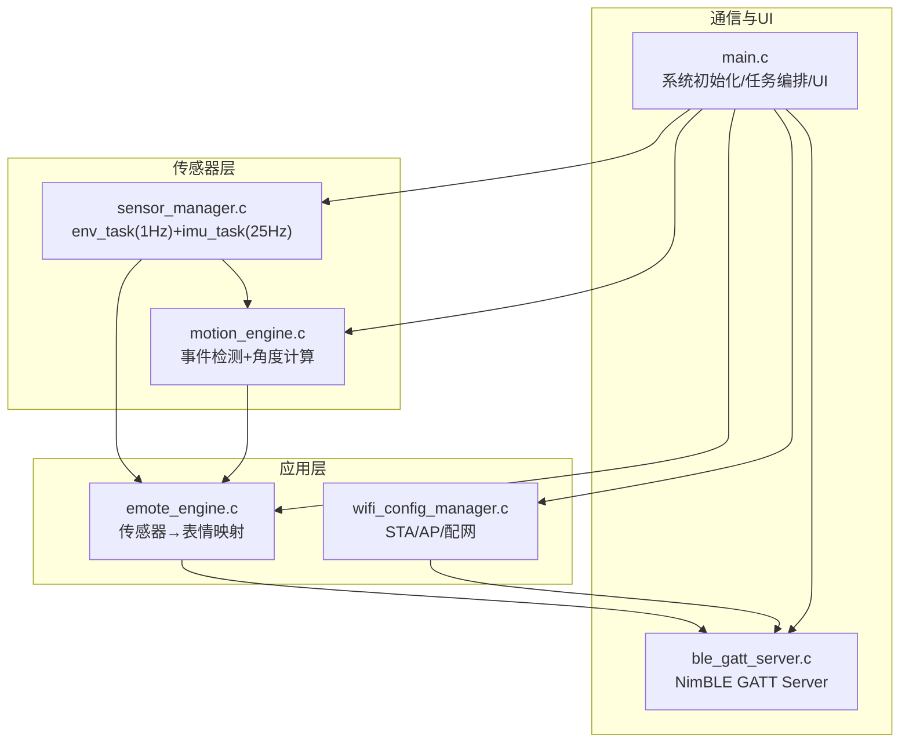
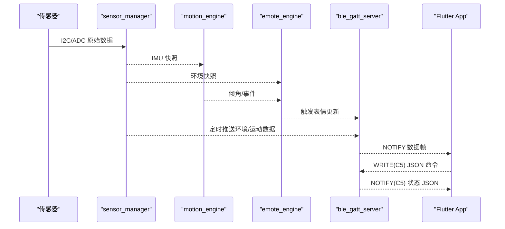
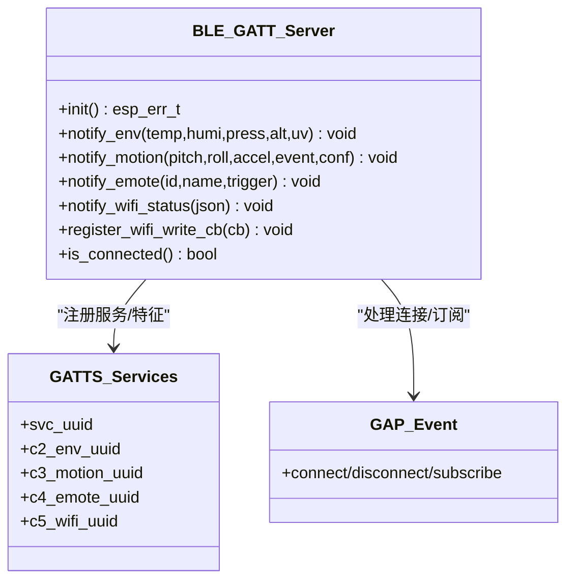
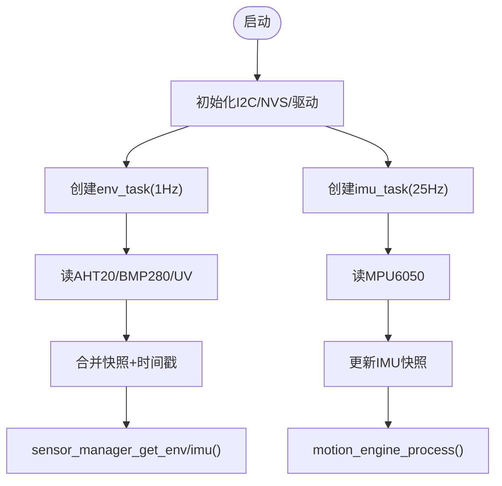
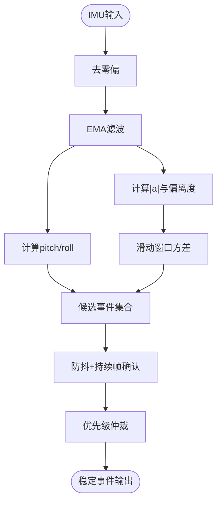
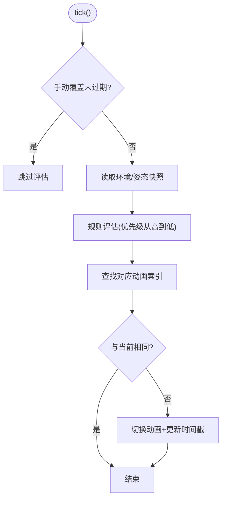
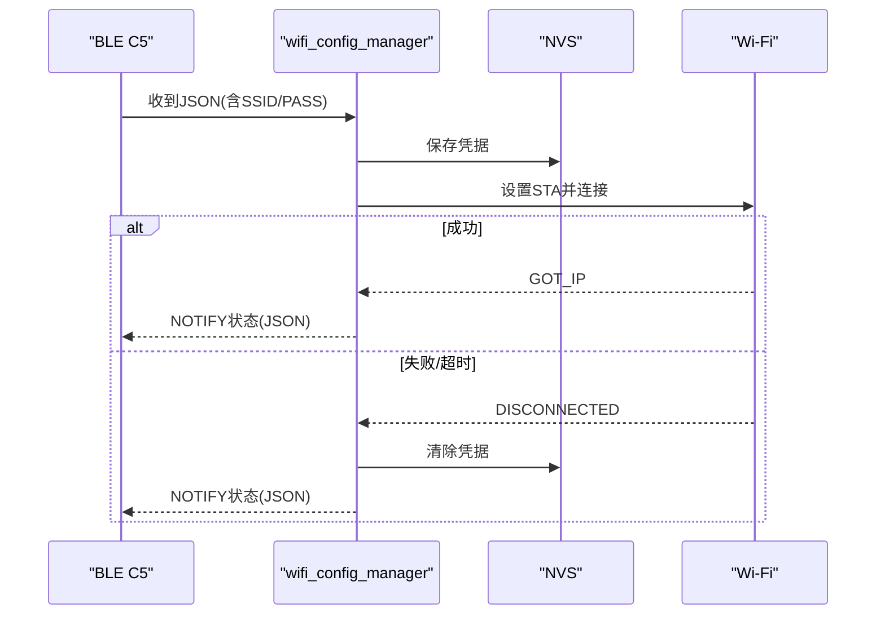
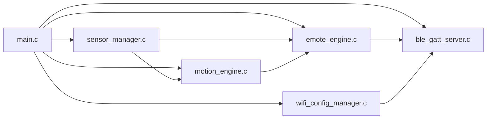

# BLE GATT服务器

<cite>
**本文引用的文件**   
- [ble_gatt_server.c](file://PathFinder_EMOTE/main/ble_gatt_server.c)
- [ble_gatt_server.h](file://PathFinder_EMOTE/main/ble_gatt_server.h)
- [main.c](file://PathFinder_EMOTE/main/main.c)
- [sensor_manager.c](file://PathFinder_EMOTE/main/sensor_manager.c)
- [motion_engine.c](file://PathFinder_EMOTE/main/motion_engine.c)
- [emote_engine.c](file://PathFinder_EMOTE/main/emote_engine.c)
- [wifi_config_manager.c](file://PathFinder_EMOTE/main/wifi_config_manager.c)
- [CMakeLists.txt](file://PathFinder_EMOTE/CMakeLists.txt)
</cite>

## 目录
1. [简介](#简介)
2. [项目结构](#项目结构)
3. [核心组件](#核心组件)
4. [架构总览](#架构总览)
5. [详细组件分析](#详细组件分析)
6. [依赖关系分析](#依赖关系分析)
7. [性能与实时性](#性能与实时性)
8. [故障排查指南](#故障排查指南)
9. [结论](#结论)
10. [附录：协议与数据帧](#附录协议与数据帧)

## 简介
本文件聚焦于 ESP32-S3 端 BLE GATT 服务器的设计与实现，围绕 NimBLE 协议栈、GATT 服务/特征值定义、连接与订阅管理、以及环境/运动/表情三类数据的 Notify 推送机制展开。同时给出与 Flutter App 的端到端数据流说明、关键算法与状态机、以及与 Wi-Fi 配网（C5）的交互方式。

## 项目结构
ESP32 固件采用分层模块化设计：
- 传感器层：多传感器驱动与双任务采样（环境 1Hz + IMU 25Hz）
- 数据处理层：运动事件检测与表情评估
- 通信与 UI 层：BLE GATT Server、LVGL UI、EAF 动画播放、Wi-Fi 配网

图表来源
- [main.c](file://PathFinder_EMOTE/main/main.c)
- [sensor_manager.c](file://PathFinder_EMOTE/main/sensor_manager.c)
- [motion_engine.c](file://PathFinder_EMOTE/main/motion_engine.c)
- [emote_engine.c](file://PathFinder_EMOTE/main/emote_engine.c)
- [wifi_config_manager.c](file://PathFinder_EMOTE/main/wifi_config_manager.c)
- [ble_gatt_server.c](file://PathFinder_EMOTE/main/ble_gatt_server.c)

章节来源
- [CMakeLists.txt:1-5](file://PathFinder_EMOTE/CMakeLists.txt#L1-L5)
- [main.c:1-120](file://PathFinder_EMOTE/main/main.c#L1-L120)

## 核心组件
- BLE GATT 服务器：基于 NimBLE，提供自定义 Service 与多个 Characteristic，支持 Read/Notify/Write 及订阅回调。
- 传感器管理器：I2C 总线与多传感器驱动，双任务采集并维护线程安全快照。
- 运动引擎：对 IMU 数据进行滤波、姿态解算、滑动窗口方差与阈值判定，输出稳定事件。
- 表情引擎：按规则表将环境/姿态数据映射为 EAF 动画，避免频繁切换导致抖动。
- Wi-Fi 配置管理器：AP/STA 模式切换、凭据持久化、Web Portal 联动。

章节来源
- [ble_gatt_server.c:1-120](file://PathFinder_EMOTE/main/ble_gatt_server.c#L1-L120)
- [sensor_manager.c:1-120](file://PathFinder_EMOTE/main/sensor_manager.c#L1-L120)
- [motion_engine.c:1-120](file://PathFinder_EMOTE/main/motion_engine.c#L1-L120)
- [emote_engine.c:1-120](file://PathFinder_EMOTE/main/emote_engine.c#L1-L120)
- [wifi_config_manager.c:1-120](file://PathFinder_EMOTE/main/wifi_config_manager.c#L1-L120)

## 架构总览
从传感器到手机 App 的数据路径如下：
- 传感器 → sensor_manager → motion_engine/emote_engine → ble_gatt_server → 手机 App
- C5 通道用于双向 JSON 控制（App→设备写命令；设备→App 通知状态）

图表来源
- [sensor_manager.c:80-150](file://PathFinder_EMOTE/main/sensor_manager.c#L80-L150)
- [motion_engine.c:180-370](file://PathFinder_EMOTE/main/motion_engine.c#L180-L370)
- [emote_engine.c:230-320](file://PathFinder_EMOTE/main/emote_engine.c#L230-L320)
- [ble_gatt_server.c:358-487](file://PathFinder_EMOTE/main/ble_gatt_server.c#L358-L487)

## 详细组件分析

### BLE GATT 服务器（NimBLE）
- 服务与特征值
  - 自定义 Service UUID（16-bit），包含四个特征：
    - C2 环境数据：Read + Notify，固定长度二进制帧
    - C3 运动数据：Read + Notify，固定长度二进制帧
    - C4 表情状态：Read + Notify，固定长度二进制帧
    - C5 WiFi 配网：Write + Notify，JSON 分包处理
- 连接与订阅
  - GAP 事件回调中记录连接句柄、断开清理、订阅状态变更（各特征独立订阅位）
- 数据推送
  - 小端写入辅助函数组装二进制帧，通过 Notify 发送
  - 仅当有客户端订阅时才推送，降低功耗
- C5 配网
  - Write 回调接收首字节标志的分包 JSON，拼接后在闭合时触发上层回调
  - 提供注册接口供上层处理 JSON 命令

图表来源
- [ble_gatt_server.c:125-162](file://PathFinder_EMOTE/main/ble_gatt_server.c#L125-L162)
- [ble_gatt_server.c:171-237](file://PathFinder_EMOTE/main/ble_gatt_server.c#L171-L237)
- [ble_gatt_server.c:314-356](file://PathFinder_EMOTE/main/ble_gatt_server.c#L314-L356)
- [ble_gatt_server.c:376-456](file://PathFinder_EMOTE/main/ble_gatt_server.c#L376-L456)
- [ble_gatt_server.c:467-487](file://PathFinder_EMOTE/main/ble_gatt_server.c#L467-L487)

章节来源
- [ble_gatt_server.c:1-120](file://PathFinder_EMOTE/main/ble_gatt_server.c#L1-L120)
- [ble_gatt_server.c:125-162](file://PathFinder_EMOTE/main/ble_gatt_server.c#L125-L162)
- [ble_gatt_server.c:171-237](file://PathFinder_EMOTE/main/ble_gatt_server.c#L171-L237)
- [ble_gatt_server.c:314-356](file://PathFinder_EMOTE/main/ble_gatt_server.c#L314-L356)
- [ble_gatt_server.c:376-456](file://PathFinder_EMOTE/main/ble_gatt_server.c#L376-L456)
- [ble_gatt_server.c:467-487](file://PathFinder_EMOTE/main/ble_gatt_server.c#L467-L487)

### 传感器管理器（双任务采样）
- env_task（1Hz）：读取 AHT20/BMP280/UV，合并时间戳，互斥锁保护全局快照
- imu_task（25Hz）：读取 MPU6050，更新最新快照并喂给运动引擎
- NVS 校准：气压计海平面气压与偏移量持久化，支持在线校准界面

图表来源
- [sensor_manager.c:80-150](file://PathFinder_EMOTE/main/sensor_manager.c#L80-L150)
- [sensor_manager.c:177-236](file://PathFinder_EMOTE/main/sensor_manager.c#L177-L236)
- [sensor_manager.c:258-304](file://PathFinder_EMOTE/main/sensor_manager.c#L258-L304)

章节来源
- [sensor_manager.c:1-120](file://PathFinder_EMOTE/main/sensor_manager.c#L1-L120)
- [sensor_manager.c:177-236](file://PathFinder_EMOTE/main/sensor_manager.c#L177-L236)
- [sensor_manager.c:258-304](file://PathFinder_EMOTE/main/sensor_manager.c#L258-L304)

### 运动引擎（事件检测与稳定输出）
- 预处理：零偏去除 + EMA 低通滤波
- 姿态解算：pitch/roll 由加速度重力分量 atan2 计算
- 滑动窗口方差：检测颠簸
- 事件候选：急加速/刹车、急转弯、坡度/倾斜、碰撞、高速、静止等
- 优先级仲裁 + 防抖：连续 N 帧确认，碰撞直通

图表来源
- [motion_engine.c:183-371](file://PathFinder_EMOTE/main/motion_engine.c#L183-L371)

章节来源
- [motion_engine.c:1-120](file://PathFinder_EMOTE/main/motion_engine.c#L1-L120)
- [motion_engine.c:183-371](file://PathFinder_EMOTE/main/motion_engine.c#L183-L371)

### 表情引擎（传感器→表情映射）
- 评估周期：每 5 秒评估一次，避免频繁切换
- 规则优先级：极端 UV > 高温 > 低温 > 高湿 > 大倾角 > 中等倾角 > 低气压 > 正常
- 手动覆盖：点击切换后 10 秒内不自动评估
- 名称友好映射：内部前缀匹配显示友好名

图表来源
- [emote_engine.c:265-316](file://PathFinder_EMOTE/main/emote_engine.c#L265-L316)
- [emote_engine.c:173-226](file://PathFinder_EMOTE/main/emote_engine.c#L173-L226)

章节来源
- [emote_engine.c:1-120](file://PathFinder_EMOTE/main/emote_engine.c#L1-L120)
- [emote_engine.c:232-263](file://PathFinder_EMOTE/main/emote_engine.c#L232-L263)
- [emote_engine.c:265-316](file://PathFinder_EMOTE/main/emote_engine.c#L265-L316)

### Wi-Fi 配置管理器（BLE C5 联动）
- 初始化：创建事件组、网络接口、默认事件循环、注册 Wi-Fi/IP 事件
- 凭据存储：NVS 读写 SSID/密码
- 连接流程：无凭据→AP+Web Portal；有凭据→STA 直连
- 重试与失败：最大重试次数耗尽则清除凭据并重进配网

图表来源
- [wifi_config_manager.c:231-273](file://PathFinder_EMOTE/main/wifi_config_manager.c#L231-L273)
- [wifi_config_manager.c:275-317](file://PathFinder_EMOTE/main/wifi_config_manager.c#L275-L317)
- [wifi_config_manager.c:51-100](file://PathFinder_EMOTE/main/wifi_config_manager.c#L51-L100)

章节来源
- [wifi_config_manager.c:1-120](file://PathFinder_EMOTE/main/wifi_config_manager.c#L1-L120)
- [wifi_config_manager.c:231-273](file://PathFinder_EMOTE/main/wifi_config_manager.c#L231-L273)
- [wifi_config_manager.c:275-317](file://PathFinder_EMOTE/main/wifi_config_manager.c#L275-L317)

## 依赖关系分析
- main.c 作为入口，负责系统初始化、任务编排与 UI 构建，调用各模块 API
- sensor_manager 依赖底层驱动（AHT20/BMP280/MPU6050/UV ADC）
- motion_engine 依赖 IMU 数据，输出事件与角度
- emote_engine 依赖 sensor_manager 与 motion_engine，驱动 LVGL/EAF
- ble_gatt_server 被 main 与各业务模块调用以推送数据或状态
- wifi_config_manager 与 BLE C5 协同完成配网流程

图表来源
- [main.c:1-120](file://PathFinder_EMOTE/main/main.c#L1-L120)
- [sensor_manager.c:177-236](file://PathFinder_EMOTE/main/sensor_manager.c#L177-L236)
- [motion_engine.c:134-142](file://PathFinder_EMOTE/main/motion_engine.c#L134-L142)
- [emote_engine.c:232-263](file://PathFinder_EMOTE/main/emote_engine.c#L232-L263)
- [ble_gatt_server.c:314-356](file://PathFinder_EMOTE/main/ble_gatt_server.c#L314-L356)
- [wifi_config_manager.c:231-273](file://PathFinder_EMOTE/main/wifi_config_manager.c#L231-L273)

章节来源
- [main.c:1-120](file://PathFinder_EMOTE/main/main.c#L1-L120)
- [sensor_manager.c:177-236](file://PathFinder_EMOTE/main/sensor_manager.c#L177-L236)
- [motion_engine.c:134-142](file://PathFinder_EMOTE/main/motion_engine.c#L134-L142)
- [emote_engine.c:232-263](file://PathFinder_EMOTE/main/emote_engine.c#L232-L263)
- [ble_gatt_server.c:314-356](file://PathFinder_EMOTE/main/ble_gatt_server.c#L314-L356)
- [wifi_config_manager.c:231-273](file://PathFinder_EMOTE/main/wifi_config_manager.c#L231-L273)

## 性能与实时性
- 采样频率与环境/运动分离：环境 1Hz、IMU 25Hz，降低 I2C 与 PSRAM 带宽压力
- 低通滤波与滑动窗口方差：提高事件检测稳定性，减少误报
- BLE 推送策略：仅在订阅存在时 Notify，避免无效传输
- 表情切换节流：5 秒评估间隔 + 手动覆盖期，避免频繁切换造成闪烁
- 内存与资源：NVS 持久化校准参数，减小运行时开销

[本节为通用指导，无需源码引用]

## 故障排查指南
- BLE 无法扫描/连接
  - 检查 Service/Characteristic UUID 是否为 16-bit 格式且广播中包含
  - 确认客户端已订阅相应特征的 Notify
- 数据未更新
  - 检查 s_cX_subscribed 状态与连接句柄是否有效
  - 确认上层任务是否调用了相应的 notify_* 接口
- C5 配网 JSON 不完整
  - 检查首字节标志（0x00/0x01）与缓冲区边界
  - 确认 JSON 闭合符到达后触发回调
- 传感器读数异常
  - 使用 I2C 扫描确认设备地址与连线
  - 查看 NVS 校准参数是否正确加载

章节来源
- [ble_gatt_server.c:171-237](file://PathFinder_EMOTE/main/ble_gatt_server.c#L171-L237)
- [ble_gatt_server.c:78-119](file://PathFinder_EMOTE/main/ble_gatt_server.c#L78-L119)
- [sensor_manager.c:154-171](file://PathFinder_EMOTE/main/sensor_manager.c#L154-L171)
- [sensor_manager.c:47-78](file://PathFinder_EMOTE/main/sensor_manager.c#L47-L78)

## 结论
该 BLE GATT 服务器以 NimBLE 为核心，结合传感器与运动/表情引擎，实现了稳定的低功耗蓝牙数据推送与双向控制能力。通过严格的二进制帧对齐与订阅机制，确保手机端可高效解析与可视化。后续可在 C5 配网上扩展更多远程配置能力，并结合 Web Portal 提升用户体验。

[本节为总结，无需源码引用]

## 附录：协议与数据帧
- Service UUID：自定义 16-bit（Base UUID 扩展）
- 特征值
  - C2 环境数据：固定长度二进制帧（温度×100、湿度×100、气压Pa、海拔×10、UV×100，小端）
  - C3 运动数据：固定长度二进制帧（俯仰×100、横滚×100、合加速度偏差×1000、事件码、置信度）
  - C4 表情状态：固定长度二进制帧（表情ID、名称长度、名称ASCII、触发原因码）
  - C5 WiFi 配网：Write 接收 JSON 分片（首字节标志），Notify 推送状态 JSON

章节来源
- [ble_gatt_server.h:1-82](file://PathFinder_EMOTE/main/ble_gatt_server.h#L1-L82)
- [ble_gatt_server.c:376-456](file://PathFinder_EMOTE/main/ble_gatt_server.c#L376-L456)
- [ble_gatt_server.c:467-487](file://PathFinder_EMOTE/main/ble_gatt_server.c#L467-L487)