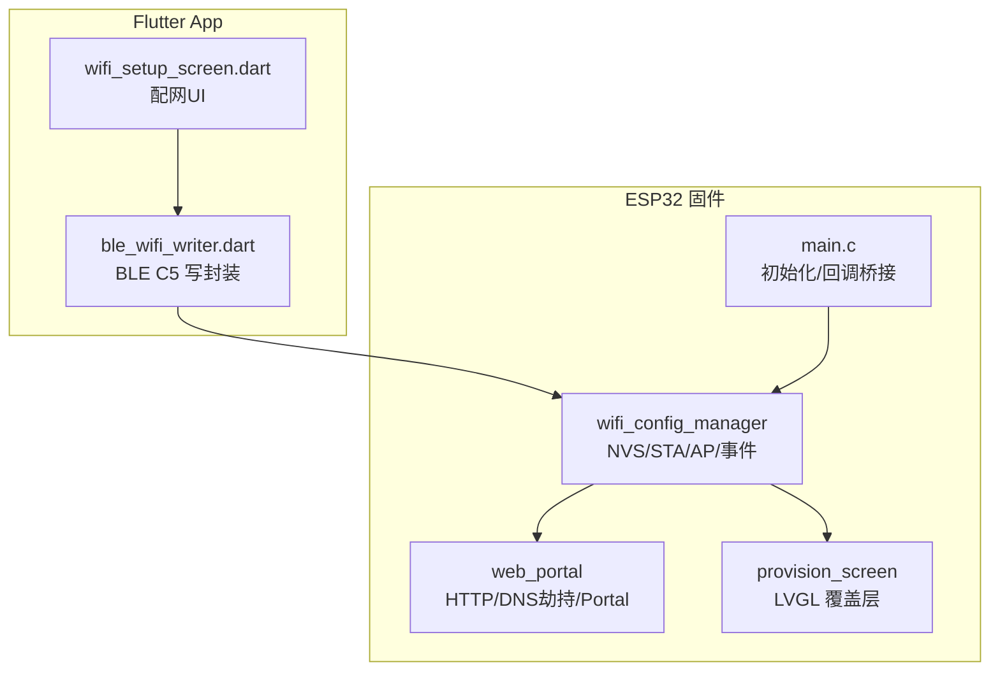
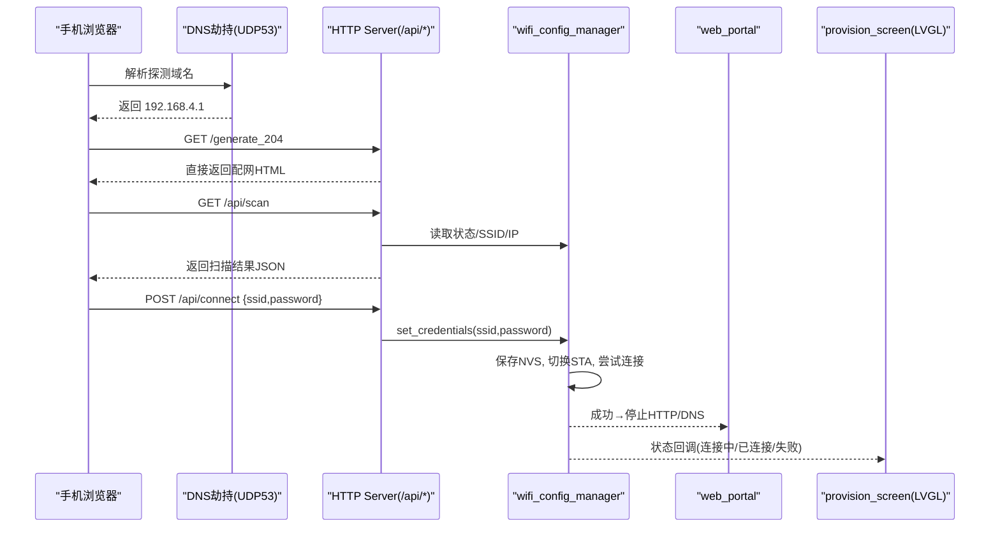
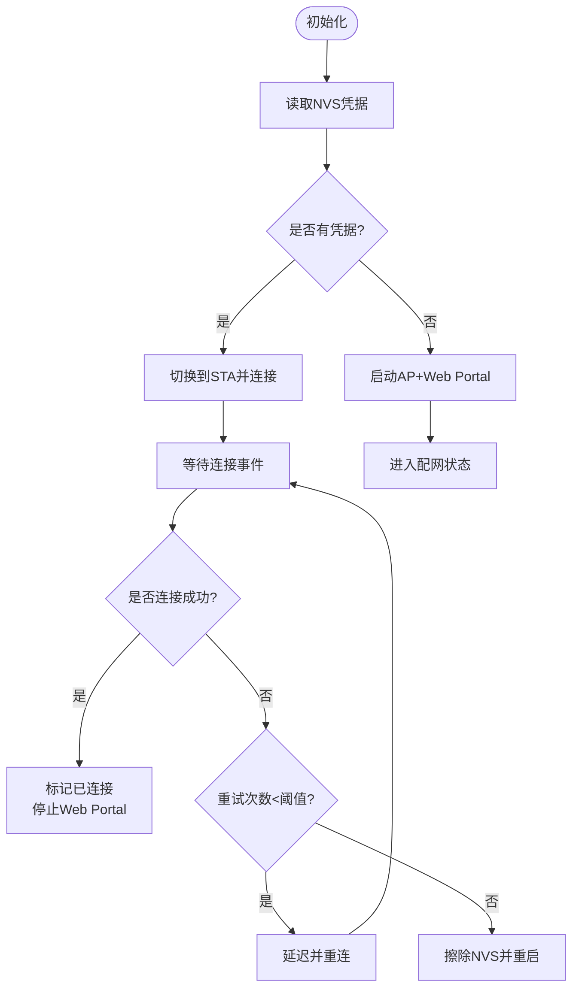
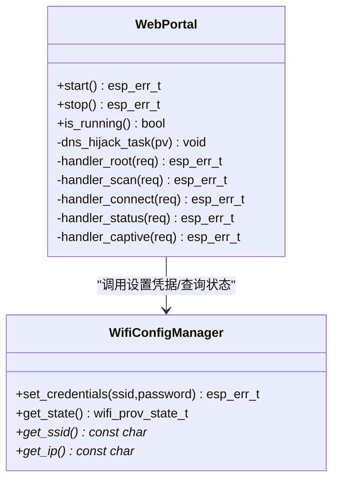
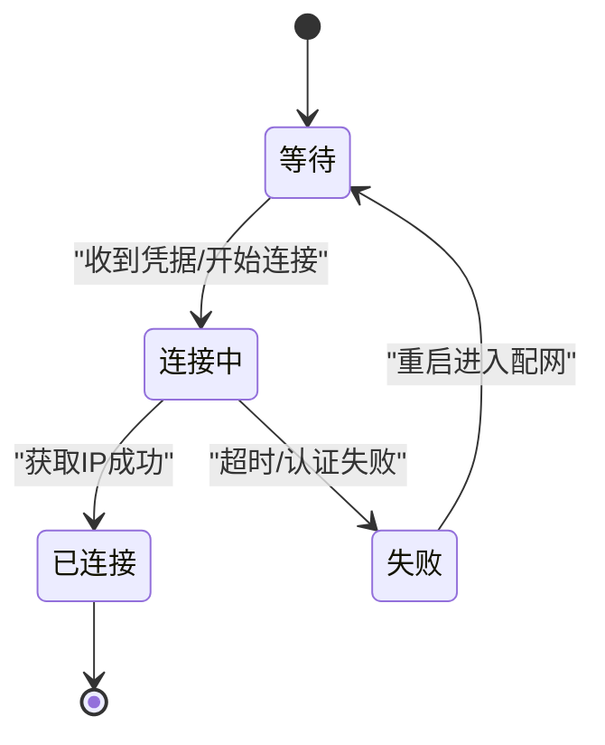
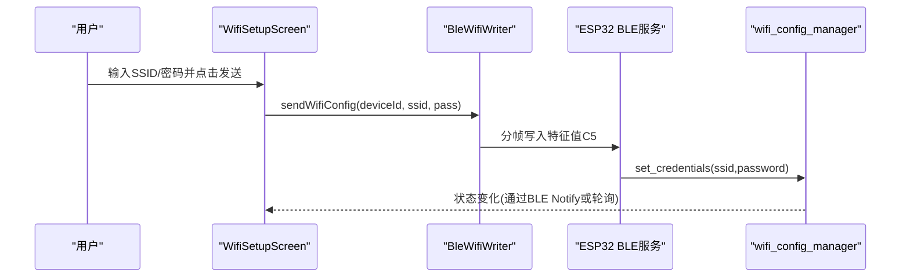
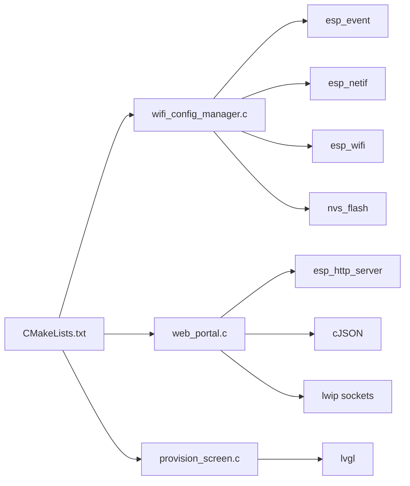

# WiFi双模式配置系统

<cite>
**本文引用的文件**   
- [wifi_config_manager.c](file://PathFinder_EMOTE/main/wifi_config_manager.c)
- [wifi_config_manager.h](file://PathFinder_EMOTE/main/wifi_config_manager.h)
- [web_portal.c](file://PathFinder_EMOTE/main/web_portal.c)
- [web_portal.h](file://PathFinder_EMOTE/main/web_portal.h)
- [provision_screen.c](file://PathFinder_EMOTE/main/provision_screen.c)
- [provision_screen.h](file://PathFinder_EMOTE/main/provision_screen.h)
- [main.c](file://PathFinder_EMOTE/main/main.c)
- [CMakeLists.txt](file://PathFinder_EMOTE/main/CMakeLists.txt)
- [sdkconfig.defaults](file://PathFinder_EMOTE/sdkconfig.defaults)
- [2026-07-12-esp32-wifi-provisioning.md](file://docs/superpowers/plans/2026-07-12-esp32-wifi-provisioning.md)
- [2026-07-12-esp32-wifi-provisioning-impl-report.md](file://docs/superpowers/specs/2026-07-12-esp32-wifi-provisioning-impl-report.md)
- [wifi_setup_screen.dart](file://PathFinder_Dashboard/lib/features/wifi/wifi_setup_screen.dart)
- [ble_wifi_writer.dart](file://PathFinder_Dashboard/lib/core/ble/ble_wifi_writer.dart)
</cite>

## 目录
1. [简介](#简介)
2. [项目结构](#项目结构)
3. [核心组件](#核心组件)
4. [架构总览](#架构总览)
5. [详细组件分析](#详细组件分析)
6. [依赖关系分析](#依赖关系分析)
7. [性能与资源考量](#性能与资源考量)
8. [故障排查指南](#故障排查指南)
9. [结论](#结论)
10. [附录](#附录)

## 简介
本系统为 PathFinder EMOTE 设备提供“BLE + Web”双模 Wi-Fi 配网能力。设备在无凭据时自动进入 AP 模式并启动 Web Captive Portal，用户可通过手机浏览器选择目标路由器并输入密码；同时支持通过 BLE 下发 JSON 命令完成配网。配网成功后，设备切换至 STA 模式连接目标路由器，并销毁 AP、HTTP Server 与 DNS 劫持任务以释放内存。LVGL 侧提供覆盖层 UI，实时反馈配网状态。

## 项目结构
- ESP32 固件侧（ESP-IDF）
  - wifi_config_manager：NVS 持久化、STA/AP 切换、重连与事件回调
  - web_portal：HTTP Server、DNS 劫持、Captive Portal、扫描与状态 API
  - provision_screen：LVGL 配网覆盖层（等待/连接中/已连接/失败）
  - main：集成初始化与回调桥接
  - CMakeLists / sdkconfig：构建与运行时配置
- Flutter 应用侧
  - 配网页面：输入 SSID/密码并通过 BLE 下发
  - BLE 写入封装：JSON 分帧发送

图示来源
- [wifi_config_manager.c:1-343](file://PathFinder_EMOTE/main/wifi_config_manager.c#L1-L343)
- [web_portal.c:1-348](file://PathFinder_EMOTE/main/web_portal.c#L1-L348)
- [provision_screen.c:1-297](file://PathFinder_EMOTE/main/provision_screen.c#L1-L297)
- [main.c:1-800](file://PathFinder_EMOTE/main/main.c#L1-L800)
- [wifi_setup_screen.dart:1-202](file://PathFinder_Dashboard/lib/features/wifi/wifi_setup_screen.dart#L1-L202)
- [ble_wifi_writer.dart:1-88](file://PathFinder_Dashboard/lib/core/ble/ble_wifi_writer.dart#L1-L88)

章节来源
- [CMakeLists.txt:1-32](file://PathFinder_EMOTE/main/CMakeLists.txt#L1-L32)
- [sdkconfig.defaults:66-74](file://PathFinder_EMOTE/sdkconfig.defaults#L66-L74)

## 核心组件
- Wi-Fi 配置管理器（wifi_config_manager）
  - 负责 NVS 读写、STA/AP 模式切换、连接重试、事件组同步、状态回调
  - 关键接口：初始化、设置凭据、重置、查询状态/SSID/IP、注册回调
- Web 门户（web_portal）
  - HTTP Server 提供根页面、扫描列表、提交凭据、状态轮询
  - DNS 劫持将任意域名解析到 AP IP，触发手机 Captive Portal 弹窗
  - 探测路径直接返回 HTML，避免 302 不被跟随的问题
- LVGL 配网覆盖层（provision_screen）
  - 四态显示：等待（AP+Web）、连接中、已连接、失败
  - 进度条与脉冲点动画，颜色与 EMA 胶囊风格一致
- Flutter 配网入口
  - 页面提供 SSID/密码输入与状态提示
  - BLE 写入封装支持 MTU 分包，首帧前缀 0x00，续帧 0x01

章节来源
- [wifi_config_manager.h:1-72](file://PathFinder_EMOTE/main/wifi_config_manager.h#L1-L72)
- [wifi_config_manager.c:231-343](file://PathFinder_EMOTE/main/wifi_config_manager.c#L231-L343)
- [web_portal.h:1-28](file://PathFinder_EMOTE/main/web_portal.h#L1-L28)
- [web_portal.c:278-348](file://PathFinder_EMOTE/main/web_portal.c#L278-L348)
- [provision_screen.h:1-44](file://PathFinder_EMOTE/main/provision_screen.h#L1-L44)
- [provision_screen.c:96-297](file://PathFinder_EMOTE/main/provision_screen.c#L96-L297)
- [wifi_setup_screen.dart:1-202](file://PathFinder_Dashboard/lib/features/wifi/wifi_setup_screen.dart#L1-L202)
- [ble_wifi_writer.dart:1-88](file://PathFinder_Dashboard/lib/core/ble/ble_wifi_writer.dart#L1-L88)

## 架构总览
系统采用“中心控制器 + 多通道接入”的架构：
- 中心控制器：wifi_config_manager 统一维护状态机与持久化
- 接入通道：
  - Web 通道：手机浏览器 → DNS 劫持 → HTTP Server → 调用配置管理器
  - BLE 通道：Flutter App → BLE C5 Write → 配置管理器
- 输出通道：LVGL 覆盖层展示状态；成功则关闭 Web 资源

图示来源
- [web_portal.c:278-348](file://PathFinder_EMOTE/main/web_portal.c#L278-L348)
- [wifi_config_manager.c:231-343](file://PathFinder_EMOTE/main/wifi_config_manager.c#L231-L343)
- [provision_screen.c:170-272](file://PathFinder_EMOTE/main/provision_screen.c#L170-L272)

## 详细组件分析

### Wi-Fi 配置管理器（wifi_config_manager）
- 职责
  - 初始化网络栈、事件循环、STA/AP netif
  - 从 NVS 加载凭据：有则 STA 直连，无则启动 AP+Web Portal
  - 接收凭据后保存到 NVS，切换 STA 模式并等待连接结果
  - 处理断线重试，超过阈值清除凭据并重启进入配网
  - 提供状态、SSID、IP 查询与回调注册
- 关键流程
  - 初始化：创建事件组、注册 WIFI_EVENT 与 IP_EVENT 处理器
  - 连接等待：使用 EventGroup 等待 CONNECTED/FAILED 标志位
  - 成功回调：设置已连接状态并停止 Web Portal
  - 失败处理：达到最大重试次数后擦除 NVS 并重启

图示来源
- [wifi_config_manager.c:231-343](file://PathFinder_EMOTE/main/wifi_config_manager.c#L231-L343)

章节来源
- [wifi_config_manager.h:1-72](file://PathFinder_EMOTE/main/wifi_config_manager.h#L1-L72)
- [wifi_config_manager.c:1-230](file://PathFinder_EMOTE/main/wifi_config_manager.c#L1-L230)

### Web 门户（web_portal）
- 职责
  - 启动 HTTP Server，注册根页面与 /api/* 端点
  - 实现 DNS 劫持任务，将所有域名解析到 AP IP
  - 提供 Wi-Fi 扫描、凭据提交、状态轮询接口
  - 探测路径直接返回 HTML，兼容不跟随 302 的手机
- 关键端点
  - GET /：返回配网页面
  - GET /api/scan：返回附近热点列表（最多20个）
  - POST /api/connect：接收 JSON {ssid,password}，异步调用配置管理器
  - GET /api/status：返回当前状态、SSID、IP
  - GET /generate_204、/hotspot-detect.html、/ncsi.txt：直接返回配网HTML

图示来源
- [web_portal.c:1-348](file://PathFinder_EMOTE/main/web_portal.c#L1-L348)
- [wifi_config_manager.h:1-72](file://PathFinder_EMOTE/main/wifi_config_manager.h#L1-L72)

章节来源
- [web_portal.h:1-28](file://PathFinder_EMOTE/main/web_portal.h#L1-L28)
- [web_portal.c:156-273](file://PathFinder_EMOTE/main/web_portal.c#L156-L273)

### LVGL 配网覆盖层（provision_screen）
- 职责
  - 在正常 UI 之上叠加全屏覆盖层
  - 根据状态更新标题、SSID、详情、胶囊标签、进度条与脉冲点
  - 提供创建/销毁/可见性判断接口
- 状态映射
  - WAITING：黄色边框，显示 AP 名称与“BLE + Web”提示
  - CONNECTING：蓝色边框，显示进度条，隐藏脉冲点
  - CONNECTED：绿色边框，显示 IP 与“启动仪表板”提示
  - FAILED：红色边框，显示错误原因与“返回配网”提示

图示来源
- [provision_screen.c:170-272](file://PathFinder_EMOTE/main/provision_screen.c#L170-L272)
- [provision_screen.h:1-44](file://PathFinder_EMOTE/main/provision_screen.h#L1-L44)

章节来源
- [provision_screen.c:1-297](file://PathFinder_EMOTE/main/provision_screen.c#L1-L297)

### Flutter 配网入口与 BLE 写入
- 配网页面
  - 校验 BLE 连接状态，提供 SSID/密码输入
  - 发送配置后显示“正在连接”，完成后提示成功或失败
- BLE 写入封装
  - 构造 JSON 命令，按 MTU 安全上限分帧发送
  - 首帧前缀 0x00，后续帧 0x01，帧间小延迟保证稳定

图示来源
- [wifi_setup_screen.dart:1-202](file://PathFinder_Dashboard/lib/features/wifi/wifi_setup_screen.dart#L1-L202)
- [ble_wifi_writer.dart:1-88](file://PathFinder_Dashboard/lib/core/ble/ble_wifi_writer.dart#L1-L88)
- [wifi_config_manager.c:275-295](file://PathFinder_EMOTE/main/wifi_config_manager.c#L275-L295)

章节来源
- [wifi_setup_screen.dart:1-202](file://PathFinder_Dashboard/lib/features/wifi/wifi_setup_screen.dart#L1-L202)
- [ble_wifi_writer.dart:1-88](file://PathFinder_Dashboard/lib/core/ble/ble_wifi_writer.dart#L1-L88)

## 依赖关系分析
- 构建依赖
  - REQUIRES：esp_wifi、esp_http_server、esp_event、esp_netif、nvs_flash、bt
  - SRCS：新增 wifi_config_manager.c、web_portal.c、provision_screen.c
- 运行时依赖
  - wifi_config_manager 依赖 esp_wifi、esp_event、esp_netif、nvs_flash、freertos/event_groups
  - web_portal 依赖 esp_http_server、cJSON、lwip sockets（DNS 劫持）
  - provision_screen 依赖 lvgl 控件与动画

图示来源
- [CMakeLists.txt:1-32](file://PathFinder_EMOTE/main/CMakeLists.txt#L1-L32)
- [wifi_config_manager.c:1-343](file://PathFinder_EMOTE/main/wifi_config_manager.c#L1-L343)
- [web_portal.c:1-348](file://PathFinder_EMOTE/main/web_portal.c#L1-L348)
- [provision_screen.c:1-297](file://PathFinder_EMOTE/main/provision_screen.c#L1-L297)

章节来源
- [CMakeLists.txt:1-32](file://PathFinder_EMOTE/main/CMakeLists.txt#L1-L32)
- [sdkconfig.defaults:66-74](file://PathFinder_EMOTE/sdkconfig.defaults#L66-L74)

## 性能与资源考量
- 内存释放策略
  - 配网成功后立即停止 HTTP Server 与 DNS 劫持任务，释放 socket 与任务栈
- 扫描限制
  - 扫描结果最多返回 20 个热点，减少 JSON 体积与渲染压力
- 请求头长度
  - 提高 HTTPD_MAX_REQ_HDR_LEN 至 2048，避免移动端 UA/Accept 等头部过长导致拒绝
- 事件与阻塞
  - 连接等待使用 EventGroup 非阻塞等待，避免长时间阻塞主线程
- LVGL 动画
  - 进度条与脉冲点动画仅在需要时启用，降低刷新开销

章节来源
- [web_portal.c:325-348](file://PathFinder_EMOTE/main/web_portal.c#L325-L348)
- [web_portal.c:165-192](file://PathFinder_EMOTE/main/web_portal.c#L165-L192)
- [sdkconfig.defaults:71-74](file://PathFinder_EMOTE/sdkconfig.defaults#L71-L74)
- [wifi_config_manager.c:212-225](file://PathFinder_EMOTE/main/wifi_config_manager.c#L212-L225)

## 故障排查指南
- 现象：连接热点后未弹出配网页面
  - 检查 DNS 劫持任务是否启动，确认 UDP 53 端口监听与响应
  - 参考修复：添加 DNS 劫持服务器，所有域名解析到 AP IP
- 现象：弹出空白页
  - 检查探测路径是否直接返回 HTML，而非 302 重定向
  - 参考修复：/generate_204 等路径直接返回配网页面
- 现象：访问页面报“Header Field are too long”
  - 调整 CONFIG_HTTPD_MAX_REQ_HDR_LEN 与 CONFIG_HTTPD_MAX_URI_LEN
- 现象：配网后无法进入正常功能
  - 检查是否成功切换至 STA 并获取 IP，确认 Web Portal 已停止
  - 查看日志中的状态回调与事件标志位

章节来源
- [2026-07-12-esp32-wifi-provisioning-impl-report.md:76-157](file://docs/superpowers/specs/2026-07-12-esp32-wifi-provisioning-impl-report.md#L76-L157)
- [web_portal.c:264-273](file://PathFinder_EMOTE/main/web_portal.c#L264-L273)
- [sdkconfig.defaults:71-74](file://PathFinder_EMOTE/sdkconfig.defaults#L71-L74)
- [wifi_config_manager.c:89-100](file://PathFinder_EMOTE/main/wifi_config_manager.c#L89-L100)

## 结论
本方案通过统一的配置管理器协调 BLE 与 Web 两条配网通道，结合 DNS 劫持与直接返回 HTML 的策略，显著提升了手机端 Captive Portal 的可用性。配网成功后及时释放 AP/HTTP/DNS 资源，确保设备快速回归正常运行。LVGL 覆盖层提供直观的状态反馈，便于用户理解与操作。整体架构清晰、扩展性好，适合车载终端等对用户体验要求较高的场景。

## 附录
- 设计计划与实现报告
  - 设计计划：[2026-07-12-esp32-wifi-provisioning.md](file://docs/superpowers/plans/2026-07-12-esp32-wifi-provisioning.md)
  - 实现报告：[2026-07-12-esp32-wifi-provisioning-impl-report.md](file://docs/superpowers/specs/2026-07-12-esp32-wifi-provisioning-impl-report.md)
- 关键构建配置
  - CMake 源与依赖：[CMakeLists.txt](file://PathFinder_EMOTE/main/CMakeLists.txt)
  - SDK 默认配置（Wi-Fi/HTTPD）：[sdkconfig.defaults](file://PathFinder_EMOTE/sdkconfig.defaults)