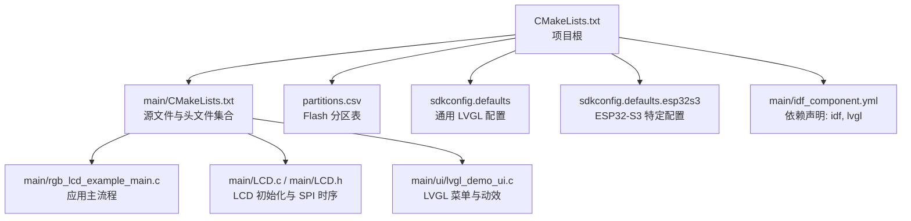
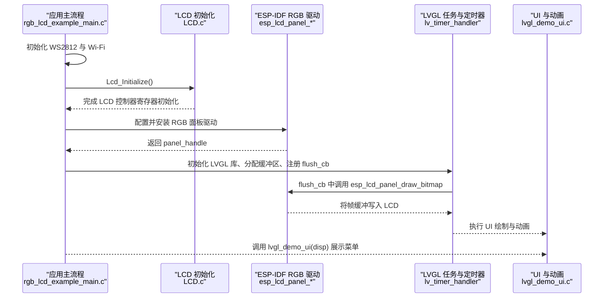
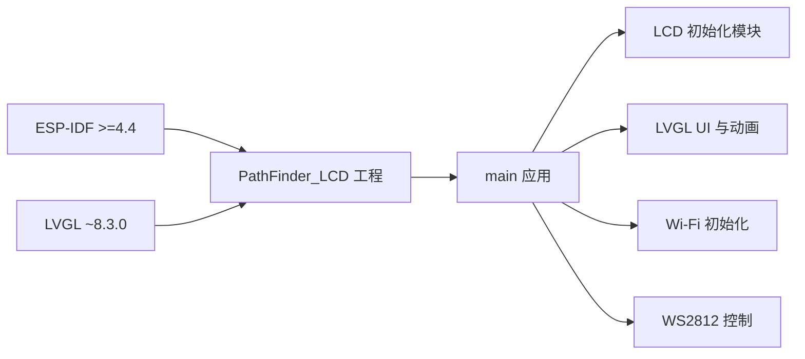

# 快速开始

<cite>
**本文引用的文件**   
- [ESP32开发板/TK021F2699_ESP32_LVGL_GIF_LED/TK021F2699_ESP32_LVGL_GIF_LED/README.md](file://ESP32开发板/TK021F2699_ESP32_LVGL_GIF_LED/TK021F2699_ESP32_LVGL_GIF_LED/README.md)
- [ESP32开发板/TK021F2699_ESP32_LVGL_GIF_LED/TK021F2699_ESP32_LVGL_GIF_LED/CMakeLists.txt](file://ESP32开发板/TK021F2699_ESP32_LVGL_GIF_LED/TK021F2699_ESP32_LVGL_GIF_LED/CMakeLists.txt)
- [ESP32开发板/TK021F2699_ESP32_LVGL_GIF_LED/TK021F2699_ESP32_LVGL_GIF_LED/main/CMakeLists.txt](file://ESP32开发板/TK021F2699_ESP32_LVGL_GIF_LED/TK021F2699_ESP32_LVGL_GIF_LED/main/CMakeLists.txt)
- [ESP32开发板/TK021F2699_ESP32_LVGL_GIF_LED/TK021F2699_ESP32_LVGL_GIF_LED/main/idf_component.yml](file://ESP32开发板/TK021F2699_ESP32_LVGL_GIF_LED/TK021F2699_ESP32_LVGL_GIF_LED/main/idf_component.yml)
- [ESP32开发板/TK021F2699_ESP32_LVGL_GIF_LED/TK021F2699_ESP32_LVGL_GIF_LED/partitions.csv](file://ESP32开发板/TK021F2699_ESP32_LVGL_GIF_LED/TK021F2699_ESP32_LVGL_GIF_LED/partitions.csv)
- [ESP32开发板/TK021F2699_ESP32_LVGL_GIF_LED/TK021F2699_ESP32_LVGL_GIF_LED/sdkconfig.defaults](file://ESP32开发板/TK021F2699_ESP32_LVGL_GIF_LED/TK021F2699_ESP32_LVGL_GIF_LED/sdkconfig.defaults)
- [ESP32开发板/TK021F2699_ESP32_LVGL_GIF_LED/TK021F2699_ESP32_LVGL_GIF_LED/sdkconfig.defaults.esp32s3](file://ESP32开发板/TK021F2699_ESP32_LVGL_GIF_LED/TK021F2699_ESP32_LVGL_GIF_LED/sdkconfig.defaults.esp32s3)
- [ESP32开发板/TK021F2699_ESP32_LVGL_GIF_LED/TK021F2699_ESP32_LVGL_GIF_LED/main/rgb_lcd_example_main.c](file://ESP32开发板/TK021F2699_ESP32_LVGL_GIF_LED/TK021F2699_ESP32_LVGL_GIF_LED/main/rgb_lcd_example_main.c)
- [ESP32开发板/TK021F2699_ESP32_LVGL_GIF_LED/TK021F2699_ESP32_LVGL_GIF_LED/main/LCD.h](file://ESP32开发板/TK021F2699_ESP32_LVGL_GIF_LED/TK021F2699_ESP32_LVGL_GIF_LED/main/LCD.h)
- [ESP32开发板/TK021F2699_ESP32_LVGL_GIF_LED/TK021F2699_ESP32_LVGL_GIF_LED/main/LCD.c](file://ESP32开发板/TK021F2699_ESP32_LVGL_GIF_LED/TK021F2699_ESP32_LVGL_GIF_LED/main/LCD.c)
</cite>

## 目录
1. [简介](#简介)
2. [项目结构](#项目结构)
3. [核心组件](#核心组件)
4. [架构总览](#架构总览)
5. [详细组件分析](#详细组件分析)
6. [依赖关系分析](#依赖关系分析)
7. [性能与配置建议](#性能与配置建议)
8. [故障排除指南](#故障排除指南)
9. [结论](#结论)
10. [附录：构建与烧录命令速查](#附录构建与烧录命令速查)

## 简介
本快速开始指南面向首次接触 PathFinder_LCD 项目的开发者，目标是帮助你在最短时间内完成环境搭建、硬件连接、编译烧录并成功运行第一个示例程序。本项目基于 ESP-IDF 框架，在 ESP32-S3 上驱动 TK021F2699 RGB LCD 面板，并使用 LVGL 显示界面与动画。

## 项目结构
- 顶层工程使用 CMake 管理，包含 main 应用层代码、LVGL 组件（通过 idf_component 管理）、分区表与默认配置等。
- 关键入口位于 main 目录，负责初始化 Wi-Fi、WS2812 LED、RGB LCD 面板以及 LVGL 任务与 UI。
- 针对 ESP32-S3 的默认配置集中在 sdkconfig.defaults 与 sdkconfig.defaults.esp32s3。
- 分区表 partitions.csv 定义了 Flash 分区布局，包含 factory、OTA、字体数据区等。

图表来源
- [ESP32开发板/TK021F2699_ESP32_LVGL_GIF_LED/TK021F2699_ESP32_LVGL_GIF_LED/CMakeLists.txt:1-5](file://ESP32开发板/TK021F2699_ESP32_LVGL_GIF_LED/TK021F2699_ESP32_LVGL_GIF_LED/CMakeLists.txt#L1-L5)
- [ESP32开发板/TK021F2699_ESP32_LVGL_GIF_LED/TK021F2699_ESP32_LVGL_GIF_LED/main/CMakeLists.txt:1-29](file://ESP32开发板/TK021F2699_ESP32_LVGL_GIF_LED/TK021F2699_ESP32_LVGL_GIF_LED/main/CMakeLists.txt#L1-L29)
- [ESP32开发板/TK021F2699_ESP32_LVGL_GIF_LED/TK021F2699_ESP32_LVGL_GIF_LED/main/rgb_lcd_example_main.c:150-303](file://ESP32开发板/TK021F2699_ESP32_LVGL_GIF_LED/TK021F2699_ESP32_LVGL_GIF_LED/main/rgb_lcd_example_main.c#L150-L303)
- [ESP32开发板/TK021F2699_ESP32_LVGL_GIF_LED/TK021F2699_ESP32_LVGL_GIF_LED/main/LCD.c:1-219](file://ESP32开发板/TK021F2699_ESP32_LVGL_GIF_LED/TK021F2699_ESP32_LVGL_GIF_LED/main/LCD.c#L1-L219)
- [ESP32开发板/TK021F2699_ESP32_LVGL_GIF_LED/TK021F2699_ESP32_LVGL_GIF_LED/main/LCD.h:1-30](file://ESP32开发板/TK021F2699_ESP32_LVGL_GIF_LED/TK021F2699_ESP32_LVGL_GIF_LED/main/LCD.h#L1-L30)
- [ESP32开发板/TK021F2699_ESP32_LVGL_GIF_LED/TK021F2699_ESP32_LVGL_GIF_LED/partitions.csv:1-10](file://ESP32开发板/TK021F2699_ESP32_LVGL_GIF_LED/TK021F2699_ESP32_LVGL_GIF_LED/partitions.csv#L1-L10)
- [ESP32开发板/TK021F2699_ESP32_LVGL_GIF_LED/TK021F2699_ESP32_LVGL_GIF_LED/sdkconfig.defaults:1-6](file://ESP32开发板/TK021F2699_ESP32_LVGL_GIF_LED/TK021F2699_ESP32_LVGL_GIF_LED/sdkconfig.defaults#L1-L6)
- [ESP32开发板/TK021F2699_ESP32_LVGL_GIF_LED/TK021F2699_ESP32_LVGL_GIF_LED/sdkconfig.defaults.esp32s3:1-9](file://ESP32开发板/TK021F2699_ESP32_LVGL_GIF_LED/TK021F2699_ESP32_LVGL_GIF_LED/sdkconfig.defaults.esp32s3#L1-L9)
- [ESP32开发板/TK021F2699_ESP32_LVGL_GIF_LED/TK021F2699_ESP32_LVGL_GIF_LED/main/idf_component.yml:1-4](file://ESP32开发板/TK021F2699_ESP32_LVGL_GIF_LED/TK021F2699_ESP32_LVGL_GIF_LED/main/idf_component.yml#L1-L4)

章节来源
- [ESP32开发板/TK021F2699_ESP32_LVGL_GIF_LED/TK021F2699_ESP32_LVGL_GIF_LED/CMakeLists.txt:1-5](file://ESP32开发板/TK021F2699_ESP32_LVGL_GIF_LED/TK021F2699_ESP32_LVGL_GIF_LED/CMakeLists.txt#L1-L5)
- [ESP32开发板/TK021F2699_ESP32_LVGL_GIF_LED/TK021F2699_ESP32_LVGL_GIF_LED/main/CMakeLists.txt:1-29](file://ESP32开发板/TK021F2699_ESP32_LVGL_GIF_LED/TK021F2699_ESP32_LVGL_GIF_LED/main/CMakeLists.txt#L1-L29)
- [ESP32开发板/TK021F2699_ESP32_LVGL_GIF_LED/TK021F2699_ESP32_LVGL_GIF_LED/main/idf_component.yml:1-4](file://ESP32开发板/TK021F2699_ESP32_LVGL_GIF_LED/TK021F2699_ESP32_LVGL_GIF_LED/main/idf_component.yml#L1-L4)
- [ESP32开发板/TK021F2699_ESP32_LVGL_GIF_LED/TK021F2699_ESP32_LVGL_GIF_LED/partitions.csv:1-10](file://ESP32开发板/TK021F2699_ESP32_LVGL_GIF_LED/TK021F2699_ESP32_LVGL_GIF_LED/partitions.csv#L1-L10)
- [ESP32开发板/TK021F2699_ESP32_LVGL_GIF_LED/TK021F2699_ESP32_LVGL_GIF_LED/sdkconfig.defaults:1-6](file://ESP32开发板/TK021F2699_ESP32_LVGL_GIF_LED/TK021F2699_ESP32_LVGL_GIF_LED/sdkconfig.defaults#L1-L6)
- [ESP32开发板/TK021F2699_ESP32_LVGL_GIF_LED/TK021F2699_ESP32_LVGL_GIF_LED/sdkconfig.defaults.esp32s3:1-9](file://ESP32开发板/TK021F2699_ESP32_LVGL_GIF_LED/TK021F2699_ESP32_LVGL_GIF_LED/sdkconfig.defaults.esp32s3#L1-L9)

## 核心组件
- 应用主流程：初始化 WS2812 LED、Wi-Fi、RGB LCD 面板、LVGL 库与任务，并在屏幕上展示菜单与动画。
- LCD 初始化模块：通过 GPIO 模拟 SPI 时序对 LCD 控制器进行寄存器初始化，为后续 RGB 数据传输做准备。
- LVGL 集成：使用 esp_timer 提供 tick，创建独立任务处理 lv_timer_handler，并通过互斥量保证线程安全。
- 资源与配置：分区表定义 Flash 布局；默认配置启用 PSRAM 与 LVGL 相关特性；idf_component.yml 声明依赖版本。

章节来源
- [ESP32开发板/TK021F2699_ESP32_LVGL_GIF_LED/TK021F2699_ESP32_LVGL_GIF_LED/main/rgb_lcd_example_main.c:150-303](file://ESP32开发板/TK021F2699_ESP32_LVGL_GIF_LED/TK021F2699_ESP32_LVGL_GIF_LED/main/rgb_lcd_example_main.c#L150-L303)
- [ESP32开发板/TK021F2699_ESP32_LVGL_GIF_LED/TK021F2699_ESP32_LVGL_GIF_LED/main/LCD.c:1-219](file://ESP32开发板/TK021F2699_ESP32_LVGL_GIF_LED/TK021F2699_ESP32_LVGL_GIF_LED/main/LCD.c#L1-L219)
- [ESP32开发板/TK021F2699_ESP32_LVGL_GIF_LED/TK021F2699_ESP32_LVGL_GIF_LED/main/LCD.h:1-30](file://ESP32开发板/TK021F2699_ESP32_LVGL_GIF_LED/TK021F2699_ESP32_LVGL_GIF_LED/main/LCD.h#L1-L30)
- [ESP32开发板/TK021F2699_ESP32_LVGL_GIF_LED/TK021F2699_ESP32_LVGL_GIF_LED/main/idf_component.yml:1-4](file://ESP32开发板/TK021F2699_ESP32_LVGL_GIF_LED/TK021F2699_ESP32_LVGL_GIF_LED/main/idf_component.yml#L1-L4)
- [ESP32开发板/TK021F2699_ESP32_LVGL_GIF_LED/TK021F2699_ESP32_LVGL_GIF_LED/sdkconfig.defaults:1-6](file://ESP32开发板/TK021F2699_ESP32_LVGL_GIF_LED/TK021F2699_ESP32_LVGL_GIF_LED/sdkconfig.defaults#L1-L6)
- [ESP32开发板/TK021F2699_ESP32_LVGL_GIF_LED/TK021F2699_ESP32_LVGL_GIF_LED/sdkconfig.defaults.esp32s3:1-9](file://ESP32开发板/TK021F2699_ESP32_LVGL_GIF_LED/TK021F2699_ESP32_LVGL_GIF_LED/sdkconfig.defaults.esp32s3#L1-L9)

## 架构总览
下图展示了从应用启动到屏幕显示的完整调用链，包括硬件初始化、LVGL 任务与刷新回调、以及与 LCD 控制器的交互。

图表来源
- [ESP32开发板/TK021F2699_ESP32_LVGL_GIF_LED/TK021F2699_ESP32_LVGL_GIF_LED/main/rgb_lcd_example_main.c:150-303](file://ESP32开发板/TK021F2699_ESP32_LVGL_GIF_LED/TK021F2699_ESP32_LVGL_GIF_LED/main/rgb_lcd_example_main.c#L150-L303)
- [ESP32开发板/TK021F2699_ESP32_LVGL_GIF_LED/TK021F2699_ESP32_LVGL_GIF_LED/main/LCD.c:186-219](file://ESP32开发板/TK021F2699_ESP32_LVGL_GIF_LED/TK021F2699_ESP32_LVGL_GIF_LED/main/LCD.c#L186-L219)

## 详细组件分析

### 应用主流程（app_main）
- 初始化顺序：WS2812 LED -> Wi-Fi -> RGB LCD 面板 -> LVGL 库与任务 -> UI 展示。
- 关键配置：像素时钟、分辨率、HSYNC/VSYNC/DE 引脚、数据总线宽度、是否使用双缓冲、PSRAM 帧缓冲等。
- 同步机制：可选 VSYNC 信号与互斥量避免撕裂；LVGL 任务周期性处理事件与渲染。

章节来源
- [ESP32开发板/TK021F2699_ESP32_LVGL_GIF_LED/TK021F2699_ESP32_LVGL_GIF_LED/main/rgb_lcd_example_main.c:150-303](file://ESP32开发板/TK021F2699_ESP32_LVGL_GIF_LED/TK021F2699_ESP32_LVGL_GIF_LED/main/rgb_lcd_example_main.c#L150-L303)

### LCD 初始化模块（LCD.c / LCD.h）
- GPIO 配置：CS/SCK/SDA 引脚设置为推挽输出，用于模拟 SPI 时序。
- SPI 写函数：实现 9bit 串行接口（命令/数据前导位 + 8bit 数据）。
- 初始化序列：通过寄存器表依次发送命令与参数，完成 LCD 控制器初始化。
- 注意：部分屏无需硬件复位或软件延时过长会影响稳定性，需根据实际面板调整。

章节来源
- [ESP32开发板/TK021F2699_ESP32_LVGL_GIF_LED/TK021F2699_ESP32_LVGL_GIF_LED/main/LCD.h:1-30](file://ESP32开发板/TK021F2699_ESP32_LVGL_GIF_LED/TK021F2699_ESP32_LVGL_GIF_LED/main/LCD.h#L1-L30)
- [ESP32开发板/TK021F2699_ESP32_LVGL_GIF_LED/TK021F2699_ESP32_LVGL_GIF_LED/main/LCD.c:1-219](file://ESP32开发板/TK021F2699_ESP32_LVGL_GIF_LED/TK021F2699_ESP32_LVGL_GIF_LED/main/LCD.c#L1-L219)

### LVGL 集成与 UI
- Tick 生成：使用 esp_timer 周期触发 lv_tick_inc。
- 任务调度：创建 LVGL 任务，循环调用 lv_timer_handler，并通过递归互斥量保护 LVGL API 调用。
- 刷新回调：flush_cb 中将 LVGL 绘制的缓冲区通过 esp_lcd_panel_draw_bitmap 发送到 LCD。
- UI 内容：环形菜单、图标、状态标签、跑马灯效果等。

章节来源
- [ESP32开发板/TK021F2699_ESP32_LVGL_GIF_LED/TK021F2699_ESP32_LVGL_GIF_LED/main/rgb_lcd_example_main.c:150-303](file://ESP32开发板/TK021F2699_ESP32_LVGL_GIF_LED/TK021F2699_ESP32_LVGL_GIF_LED/main/rgb_lcd_example_main.c#L150-L303)
- [ESP32开发板/TK021F2699_ESP32_LVGL_GIF_LED/TK021F2699_ESP32_LVGL_GIF_LED/main/ui/lvgl_demo_ui.c:1-200](file://ESP32开发板/TK021F2699_ESP32_LVGL_GIF_LED/TK021F2699_ESP32_LVGL_GIF_LED/main/ui/lvgl_demo_ui.c#L1-L200)

### 构建系统与依赖
- 根 CMakeLists 引入 ESP-IDF 的 project.cmake，设置项目名称。
- main/CMakeLists 列出所有源文件与头文件路径，确保编译器能找到资源。
- idf_component.yml 声明依赖：ESP-IDF 版本要求与 LVGL 组件版本。
- 分区表 partitions.csv 定义 Flash 分区，包含工厂应用、OTA、字体数据等。
- sdkconfig.defaults 与 sdkconfig.defaults.esp32s3 提供默认配置项，如 LVGL 内存策略与 ESP32-S3 的 PSRAM 优化。

章节来源
- [ESP32开发板/TK021F2699_ESP32_LVGL_GIF_LED/TK021F2699_ESP32_LVGL_GIF_LED/CMakeLists.txt:1-5](file://ESP32开发板/TK021F2699_ESP32_LVGL_GIF_LED/TK021F2699_ESP32_LVGL_GIF_LED/CMakeLists.txt#L1-L5)
- [ESP32开发板/TK021F2699_ESP32_LVGL_GIF_LED/TK021F2699_ESP32_LVGL_GIF_LED/main/CMakeLists.txt:1-29](file://ESP32开发板/TK021F2699_ESP32_LVGL_GIF_LED/TK021F2699_ESP32_LVGL_GIF_LED/main/CMakeLists.txt#L1-L29)
- [ESP32开发板/TK021F2699_ESP32_LVGL_GIF_LED/TK021F2699_ESP32_LVGL_GIF_LED/main/idf_component.yml:1-4](file://ESP32开发板/TK021F2699_ESP32_LVGL_GIF_LED/TK021F2699_ESP32_LVGL_GIF_LED/main/idf_component.yml#L1-L4)
- [ESP32开发板/TK021F2699_ESP32_LVGL_GIF_LED/TK021F2699_ESP32_LVGL_GIF_LED/partitions.csv:1-10](file://ESP32开发板/TK021F2699_ESP32_LVGL_GIF_LED/TK021F2699_ESP32_LVGL_GIF_LED/partitions.csv#L1-L10)
- [ESP32开发板/TK021F2699_ESP32_LVGL_GIF_LED/TK021F2699_ESP32_LVGL_GIF_LED/sdkconfig.defaults:1-6](file://ESP32开发板/TK021F2699_ESP32_LVGL_GIF_LED/TK021F2699_ESP32_LVGL_GIF_LED/sdkconfig.defaults#L1-L6)
- [ESP32开发板/TK021F2699_ESP32_LVGL_GIF_LED/TK021F2699_ESP32_LVGL_GIF_LED/sdkconfig.defaults.esp32s3:1-9](file://ESP32开发板/TK021F2699_ESP32_LVGL_GIF_LED/TK021F2699_ESP32_LVGL_GIF_LED/sdkconfig.defaults.esp32s3#L1-L9)

## 依赖关系分析
- 外部依赖：ESP-IDF（>=4.4），LVGL（~8.3.0）。
- 内部依赖：main 应用依赖 LCD 初始化模块、LVGL 演示 UI、Wi-Fi 与 WS2812 控制。
- 构建依赖：CMake 与 ESP-IDF 工具链，idf_component 自动下载与管理组件。

图表来源
- [ESP32开发板/TK021F2699_ESP32_LVGL_GIF_LED/TK021F2699_ESP32_LVGL_GIF_LED/main/idf_component.yml:1-4](file://ESP32开发板/TK021F2699_ESP32_LVGL_GIF_LED/TK021F2699_ESP32_LVGL_GIF_LED/main/idf_component.yml#L1-L4)
- [ESP32开发板/TK021F2699_ESP32_LVGL_GIF_LED/TK021F2699_ESP32_LVGL_GIF_LED/main/CMakeLists.txt:1-29](file://ESP32开发板/TK021F2699_ESP32_LVGL_GIF_LED/TK021F2699_ESP32_LVGL_GIF_LED/main/CMakeLists.txt#L1-L29)

章节来源
- [ESP32开发板/TK021F2699_ESP32_LVGL_GIF_LED/TK021F2699_ESP32_LVGL_GIF_LED/main/idf_component.yml:1-4](file://ESP32开发板/TK021F2699_ESP32_LVGL_GIF_LED/TK021F2699_ESP32_LVGL_GIF_LED/main/idf_component.yml#L1-L4)
- [ESP32开发板/TK021F2699_ESP32_LVGL_GIF_LED/TK021F2699_ESP32_LVGL_GIF_LED/main/CMakeLists.txt:1-29](file://ESP32开发板/TK021F2699_ESP32_LVGL_GIF_LED/TK021F2699_ESP32_LVGL_GIF_LED/main/CMakeLists.txt#L1-L29)

## 性能与配置建议
- 帧缓冲位置：推荐将帧缓冲放在 PSRAM，以降低 RAM 占用，但需注意 SPI0 带宽限制。
- PCLK 频率：若出现屏幕漂移或无法显示，可降低 PCLK 或调整时序参数（如 pclk_active_neg、vsync_back_porch）。
- 撕裂问题：可使用双缓冲或增加同步机制（如 VSYNC 信号与互斥量）。
- 低 PCLK 场景：启用 bounce buffer 可将数据从内部 SRAM 读取，提高速度但会增加 CPU 负载。
- 指令与只读数据缓存：启用 CONFIG_SPIRAM_FETCH_INSTRUCTIONS 与 CONFIG_SPIRAM_RODATA 可节省 SPI0 带宽。

章节来源
- [ESP32开发板/TK021F2699_ESP32_LVGL_GIF_LED/TK021F2699_ESP32_LVGL_GIF_LED/README.md:102-122](file://ESP32开发板/TK021F2699_ESP32_LVGL_GIF_LED/TK021F2699_ESP32_LVGL_GIF_LED/README.md#L102-L122)
- [ESP32开发板/TK021F2699_ESP32_LVGL_GIF_LED/TK021F2699_ESP32_LVGL_GIF_LED/sdkconfig.defaults.esp32s3:1-9](file://ESP32开发板/TK021F2699_ESP32_LVGL_GIF_LED/TK021F2699_ESP32_LVGL_GIF_LED/sdkconfig.defaults.esp32s3#L1-L9)

## 故障排除指南
- 屏幕不亮：检查背光开启电平，更新 EXAMPLE_LCD_BK_LIGHT_ON_LEVEL。
- 无帧缓冲内存：将帧缓冲放到 PSRAM，参考默认配置与说明。
- 屏幕漂移：降低 PCLK，调整时序参数，或启用 SPIRAM 指令与只读数据缓存。
- 撕裂现象：使用双缓冲或增加同步机制。
- PCLK 过低：启用 bounce buffer 或 SPIRAM 缓存优化。
- 时序正确但无显示：确认 LCD 是否需要特殊初始化序列，参考 LCD 控制器手册。

章节来源
- [ESP32开发板/TK021F2699_ESP32_LVGL_GIF_LED/TK021F2699_ESP32_LVGL_GIF_LED/README.md:102-122](file://ESP32开发板/TK021F2699_ESP32_LVGL_GIF_LED/TK021F2699_ESP32_LVGL_GIF_LED/README.md#L102-L122)

## 结论
通过本指南，你已了解 PathFinder_LCD 的项目结构、核心组件、构建与烧录流程、硬件连接与常见问题排查。按照步骤操作，即可在 ESP32-S3 上成功驱动 TK021F2699 LCD 并运行 LVGL 示例界面。

## 附录：构建与烧录命令速查
- 进入工程目录后，执行以下命令完成构建、烧录与串口监视：
  - idf.py -p PORT build flash monitor
- 首次运行会额外耗时以解析依赖并下载组件至 managed_components 目录。
- 退出串口监视器：Ctrl-]

章节来源
- [ESP32开发板/TK021F2699_ESP32_LVGL_GIF_LED/TK021F2699_ESP32_LVGL_GIF_LED/README.md:69-77](file://ESP32开发板/TK021F2699_ESP32_LVGL_GIF_LED/TK021F2699_ESP32_LVGL_GIF_LED/README.md#L69-L77)