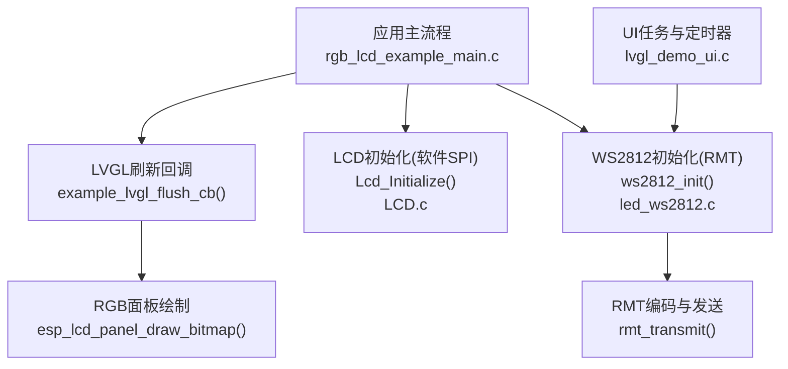
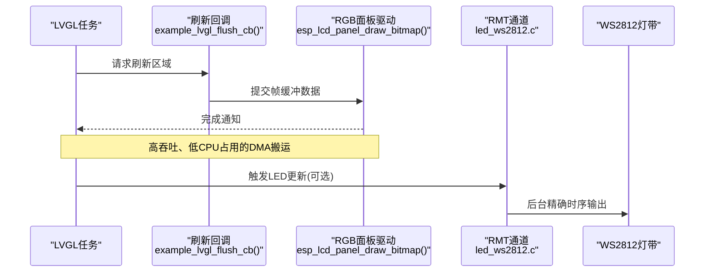
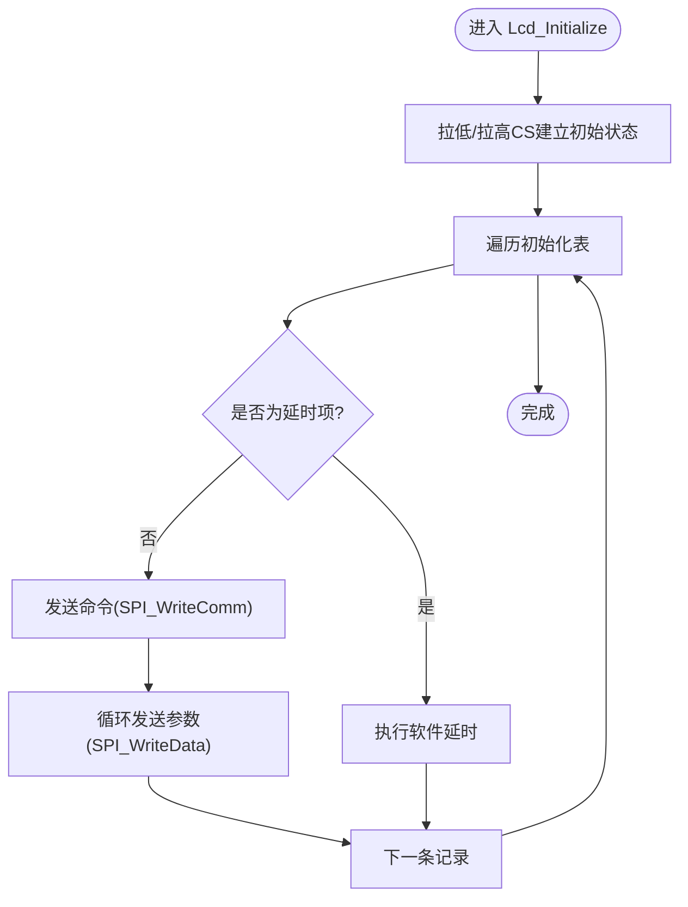
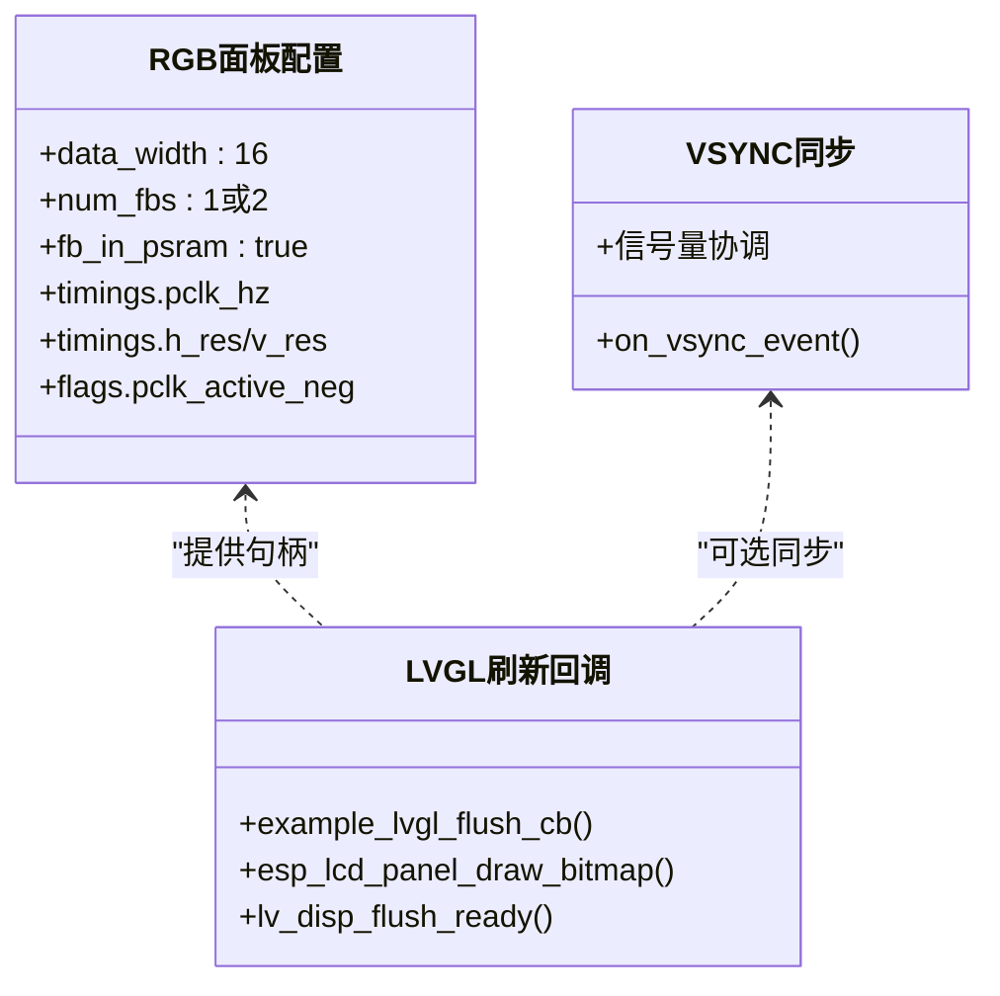
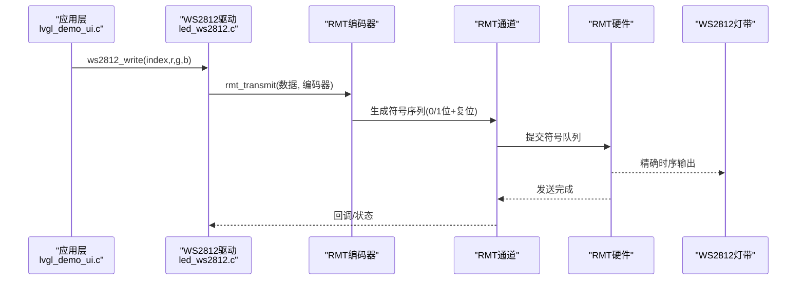
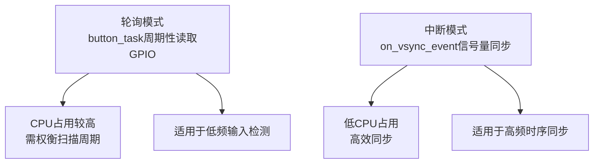
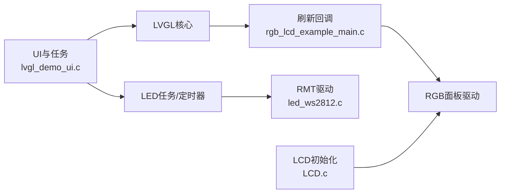

# I/O性能优化

<cite>
**本文引用的文件**   
- [rgb_lcd_example_main.c](file://ESP32开发板/TK021F2699_ESP32_LVGL_GIF_LED/TK021F2699_ESP32_LVGL_GIF_LED/main/rgb_lcd_example_main.c)
- [LCD.c](file://ESP32开发板/TK021F2699_ESP32_LVGL_GIF_LED/TK021F2699_ESP32_LVGL_GIF_LED/main/LCD.c)
- [LCD.h](file://ESP32开发板/TK021F2699_ESP32_LVGL_GIF_LED/TK021F2699_ESP32_LVGL_GIF_LED/main/LCD.h)
- [led_ws2812.c](file://ESP32开发板/TK021F2699_ESP32_LVGL_GIF_LED/TK021F2699_ESP32_LVGL_GIF_LED/main/led_ws2812/led_ws2812.c)
- [led_ws2812.h](file://ESP32开发板/TK021F2699_ESP32_LVGL_GIF_LED/TK021F2699_ESP32_LVGL_GIF_LED/main/led_ws2812/led_ws2812.h)
- [lvgl_demo_ui.c](file://ESP32开发板/TK021F2699_ESP32_LVGL_GIF_LED/TK021F2699_ESP32_LVGL_GIF_LED/main/ui/lvgl_demo_ui.c)
</cite>

## 目录
1. [引言](#引言)
2. [项目结构](#项目结构)
3. [核心组件](#核心组件)
4. [架构总览](#架构总览)
5. [详细组件分析](#详细组件分析)
6. [依赖关系分析](#依赖关系分析)
7. [性能考量](#性能考量)
8. [故障排查指南](#故障排查指南)
9. [结论](#结论)
10. [附录](#附录)

## 引言
本技术文档聚焦于I/O性能优化，围绕以下主题展开：SPI总线配置与软件模拟时序、DMA传输与帧缓冲策略、RMT硬件模块在WS2812 LED控制中的性能调优、中断处理与轮询模式的差异、GPIO引脚切换速度与驱动能力配置，以及I/O延迟测量与性能分析方法。文档结合工程实际代码路径进行说明，并提供可视化图示帮助理解数据流与控制流。

## 项目结构
本项目包含RGB LCD显示、LVGL图形框架、WS2812 LED控制（基于RMT）等关键子系统。与I/O性能密切相关的源文件如下：
- RGB LCD初始化与LVGL刷新回调：rgb_lcd_example_main.c
- 软件模拟SPI的LCD初始化与寄存器配置：LCD.c、LCD.h
- WS2812 LED驱动（RMT编码器与发送通道）：led_ws2812.c、led_ws2812.h
- UI交互与LED任务调度：lvgl_demo_ui.c

图表来源
- [rgb_lcd_example_main.c:150-303](file://ESP32开发板/TK021F2699_ESP32_LVGL_GIF_LED/TK021F2699_ESP32_LVGL_GIF_LED/main/rgb_lcd_example_main.c#L150-L303)
- [LCD.c:205-219](file://ESP32开发板/TK021F2699_ESP32_LVGL_GIF_LED/TK021F2699_ESP32_LVGL_GIF_LED/main/LCD.c#L205-L219)
- [led_ws2812.c:179-213](file://ESP32开发板/TK021F2699_ESP32_LVGL_GIF_LED/TK021F2699_ESP32_LVGL_GIF_LED/main/led_ws2812/led_ws2812.c#L179-L213)
- [lvgl_demo_ui.c:84-124](file://ESP32开发板/TK021F2699_ESP32_LVGL_GIF_LED/TK021F2699_ESP32_LVGL_GIF_LED/main/ui/lvgl_demo_ui.c#L84-L124)

章节来源
- [rgb_lcd_example_main.c:150-303](file://ESP32开发板/TK021F2699_ESP32_LVGL_GIF_LED/TK021F2699_ESP32_LVGL_GIF_LED/main/rgb_lcd_example_main.c#L150-L303)
- [LCD.c:17-40](file://ESP32开发板/TK021F2699_ESP32_LVGL_GIF_LED/TK021F2699_ESP32_LVGL_GIF_LED/main/LCD.c#L17-L40)
- [led_ws2812.c:179-213](file://ESP32开发板/TK021F2699_ESP32_LVGL_GIF_LED/TK021F2699_ESP32_LVGL_GIF_LED/main/led_ws2812/led_ws2812.c#L179-L213)
- [lvgl_demo_ui.c:84-124](file://ESP32开发板/TK021F2699_ESP32_LVGL_GIF_LED/TK021F2699_ESP32_LVGL_GIF_LED/main/ui/lvgl_demo_ui.c#L84-L124)

## 核心组件
- RGB LCD与LVGL集成：通过esp_lcd_rgb_panel驱动将LVGL绘制的缓冲区直接推送到RGB面板，支持双缓冲或PSRAM分配，降低CPU占用并提升吞吐。
- 软件模拟SPI的LCD初始化：使用GPIO位操作实现串行命令/数据写入，用于面板初始化阶段，非实时像素传输路径。
- WS2812 LED驱动（RMT）：利用RMT通道与自定义编码器精确生成WS2812时序，后台自动发送，释放CPU。
- UI与任务调度：LVGL任务、定时器与按键扫描任务协同工作，避免阻塞关键路径。

章节来源
- [rgb_lcd_example_main.c:177-273](file://ESP32开发板/TK021F2699_ESP32_LVGL_GIF_LED/TK021F2699_ESP32_LVGL_GIF_LED/main/rgb_lcd_example_main.c#L177-L273)
- [LCD.c:51-83](file://ESP32开发板/TK021F2699_ESP32_LVGL_GIF_LED/TK021F2699_ESP32_LVGL_GIF_LED/main/LCD.c#L51-L83)
- [led_ws2812.c:179-213](file://ESP32开发板/TK021F2699_ESP32_LVGL_GIF_LED/TK021F2699_ESP32_LVGL_GIF_LED/main/led_ws2812/led_ws2812.c#L179-L213)
- [lvgl_demo_ui.c:262-295](file://ESP32开发板/TK021F2699_ESP32_LVGL_GIF_LED/TK021F2699_ESP32_LVGL_GIF_LED/main/ui/lvgl_demo_ui.c#L262-L295)

## 架构总览
下图展示从LVGL绘制到RGB面板输出的关键路径，以及与WS2812 LED控制的并行路径。

图表来源
- [rgb_lcd_example_main.c:95-109](file://ESP32开发板/TK021F2699_ESP32_LVGL_GIF_LED/TK021F2699_ESP32_LVGL_GIF_LED/main/rgb_lcd_example_main.c#L95-L109)
- [led_ws2812.c:236-250](file://ESP32开发板/TK021F2699_ESP32_LVGL_GIF_LED/TK021F2699_ESP32_LVGL_GIF_LED/main/led_ws2812/led_ws2812.c#L236-L250)

## 详细组件分析

### SPI总线配置与软件模拟时序（LCD初始化）
- GPIO配置与电平设置：通过gpio_config设置CS/SCK/SDA为推挽输出，并在初始化时拉高/拉低以建立初始状态。
- 软件SPI字节写入：循环移位并按位设置SDA，配合SCK边沿采样，实现命令与数据分片写入。
- 初始化表驱动：以命令+参数数组形式顺序下发，含延时标记，确保面板稳定上电与复位。

图表来源
- [LCD.c:205-219](file://ESP32开发板/TK021F2699_ESP32_LVGL_GIF_LED/TK021F2699_ESP32_LVGL_GIF_LED/main/LCD.c#L205-L219)
- [LCD.c:51-83](file://ESP32开发板/TK021F2699_ESP32_LVGL_GIF_LED/TK021F2699_ESP32_LVGL_GIF_LED/main/LCD.c#L51-L83)
- [LCD.c:86-160](file://ESP32开发板/TK021F2699_ESP32_LVGL_GIF_LED/TK021F2699_ESP32_LVGL_GIF_LED/main/LCD.c#L86-L160)

章节来源
- [LCD.c:17-40](file://ESP32开发板/TK021F2699_ESP32_LVGL_GIF_LED/TK021F2699_ESP32_LVGL_GIF_LED/main/LCD.c#L17-L40)
- [LCD.c:51-83](file://ESP32开发板/TK021F2699_ESP32_LVGL_GIF_LED/TK021F2699_ESP32_LVGL_GIF_LED/main/LCD.c#L51-L83)
- [LCD.c:86-160](file://ESP32开发板/TK021F2699_ESP32_LVGL_GIF_LED/TK021F2699_ESP32_LVGL_GIF_LED/main/LCD.c#L86-L160)
- [LCD.h:12-26](file://ESP32开发板/TK021F2699_ESP32_LVGL_GIF_LED/TK021F2699_ESP32_LVGL_GIF_LED/main/LCD.h#L12-L26)

优化建议
- 仅用于初始化阶段：软件SPI适合低频、短时的面板初始化；像素传输应走RGB DMA路径。
- 减少函数调用开销：可将宏内联逻辑合并，避免多次gpio_set_level调用。
- 合理延时：初始化表中REGFLAG_DELAY需按面板手册设定，避免过短导致不稳定。

### DMA传输与帧缓冲策略（RGB LCD + LVGL）
- 像素时钟与时序：通过esp_lcd_rgb_panel配置pclk_hz、hsync/vsync/de及数据位宽，启用PSRAM帧缓冲以降低内部SRAM压力。
- 双缓冲与防撕裂：可启用双缓冲并通过信号量同步VSYNC事件，避免画面撕裂。
- LVGL刷新回调：在回调中提交绘制区域至面板，完成后通知LVGL继续下一帧。

图表来源
- [rgb_lcd_example_main.c:182-228](file://ESP32开发板/TK021F2699_ESP32_LVGL_GIF_LED/TK021F2699_ESP32_LVGL_GIF_LED/main/rgb_lcd_example_main.c#L182-L228)
- [rgb_lcd_example_main.c:95-109](file://ESP32开发板/TK021F2699_ESP32_LVGL_GIF_LED/TK021F2699_ESP32_LVGL_GIF_LED/main/rgb_lcd_example_main.c#L95-L109)
- [rgb_lcd_example_main.c:84-93](file://ESP32开发板/TK021F2699_ESP32_LVGL_GIF_LED/TK021F2699_ESP32_LVGL_GIF_LED/main/rgb_lcd_example_main.c#L84-L93)

章节来源
- [rgb_lcd_example_main.c:177-273](file://ESP32开发板/TK021F2699_ESP32_LVGL_GIF_LED/TK021F2699_ESP32_LVGL_GIF_LED/main/rgb_lcd_example_main.c#L177-L273)
- [rgb_lcd_example_main.c:84-93](file://ESP32开发板/TK021F2699_ESP32_LVGL_GIF_LED/TK021F2699_ESP32_LVGL_GIF_LED/main/rgb_lcd_example_main.c#L84-L93)

优化建议
- 优先使用PSRAM帧缓冲：大分辨率下显著降低内部内存压力。
- 双缓冲+全刷新模式：在需要严格同步的场景开启full_refresh，避免撕裂。
- 调整pclk_hz与时序参数：依据面板规格微调前后肩与脉宽，确保稳定时序。

### RMT硬件模块在LED控制中的性能调优（WS2812）
- RMT通道与编码器：创建RMT TX通道，配置分辨率（如10MHz），并使用自定义编码器组合“字节编码器”和“拷贝编码器”，生成WS2812所需的0/1位时序与复位码。
- 后台发送：rmt_transmit将数据送入底层队列，由硬件自动产生精确时序，CPU无需忙等。
- 内存块与队列深度：mem_block_symbols与trans_queue_depth影响吞吐与延迟，可按LED数量与刷新频率调优。

图表来源
- [led_ws2812.c:179-213](file://ESP32开发板/TK021F2699_ESP32_LVGL_GIF_LED/TK021F2699_ESP32_LVGL_GIF_LED/main/led_ws2812/led_ws2812.c#L179-L213)
- [led_ws2812.c:236-250](file://ESP32开发板/TK021F2699_ESP32_LVGL_GIF_LED/TK021F2699_ESP32_LVGL_GIF_LED/main/led_ws2812/led_ws2812.c#L236-L250)
- [led_ws2812.c:49-89](file://ESP32开发板/TK021F2699_ESP32_LVGL_GIF_LED/TK021F2699_ESP32_LVGL_GIF_LED/main/led_ws2812/led_ws2812.c#L49-L89)

章节来源
- [led_ws2812.c:179-213](file://ESP32开发板/TK021F2699_ESP32_LVGL_GIF_LED/TK021F2699_ESP32_LVGL_GIF_LED/main/led_ws2812/led_ws2812.c#L179-L213)
- [led_ws2812.c:236-250](file://ESP32开发板/TK021F2699_ESP32_LVGL_GIF_LED/TK021F2699_ESP32_LVGL_GIF_LED/main/led_ws2812/led_ws2812.c#L236-L250)
- [led_ws2812.c:49-89](file://ESP32开发板/TK021F2699_ESP32_LVGL_GIF_LED/TK021F2699_ESP32_LVGL_GIF_LED/main/led_ws2812/led_ws2812.c#L49-L89)

优化建议
- 分辨率与最小时间单元：提高resolution_hz可获得更细粒度时序控制，但需评估系统时钟与功耗。
- 队列深度与内存块：增大trans_queue_depth与mem_block_symbols可降低丢包风险，提升批量更新吞吐。
- 避免频繁malloc/free：在高频刷新场景复用缓冲区，减少动态分配开销。

### 中断处理与轮询模式的性能差异
- 轮询模式（按键扫描）：在lvgl_demo_ui.c中，button_task周期读取GPIO电平，简单可靠，但会占用CPU时间片。
- 中断模式（VSYNC同步）：在rgb_lcd_example_main.c中，on_vsync_event回调通过信号量与LVGL任务同步，避免撕裂且不影响渲染主循环。

章节来源
- [lvgl_demo_ui.c:262-295](file://ESP32开发板/TK021F2699_ESP32_LVGL_GIF_LED/TK021F2699_ESP32_LVGL_GIF_LED/main/ui/lvgl_demo_ui.c#L262-L295)
- [rgb_lcd_example_main.c:84-93](file://ESP32开发板/TK021F2699_ESP32_LVGL_GIF_LED/TK021F2699_ESP32_LVGL_GIF_LED/main/rgb_lcd_example_main.c#L84-L93)

优化建议
- 按键去抖与降频：适当延长扫描周期，或在ISR中标记事件，交由任务处理。
- 使用信号量/队列：在中断与任务间传递轻量事件，避免长耗时操作进入中断上下文。

### GPIO引脚切换速度与驱动能力配置
- 推挽输出：LCD初始化中将CS/SCK/SDA配置为GPIO_MODE_OUTPUT，满足快速切换需求。
- 驱动能力：ESP32系列GPIO默认具备较强驱动能力，必要时可通过驱动强度配置增强（具体API因SDK版本而异）。
- 引脚选择：尽量选用高速IO组，避免与高频外设冲突；注意布线与负载电容对上升/下降沿的影响。

章节来源
- [LCD.c:17-40](file://ESP32开发板/TK021F2699_ESP32_LVGL_GIF_LED/TK021F2699_ESP32_LVGL_GIF_LED/main/LCD.c#L17-L40)
- [lcd.h:12-26](file://ESP32开发板/TK021F2699_ESP32_LVGL_GIF_LED/TK021F2699_ESP32_LVGL_GIF_LED/main/LCD.h#L12-L26)

优化建议
- 减少跨组切换：尽量在同一GPIO组内组织相关信号，降低交叉耦合。
- 控制负载：对于长走线或大电容负载，考虑串接电阻或降低切换速率。

### I/O延迟测量与性能分析方法
- 计时器：使用高精度定时器（如esp_timer）在关键路径前后打点，统计端到端延迟。
- 示波器/逻辑分析仪：测量GPIO翻转边沿，验证SPI/RMT时序是否符合协议要求。
- 指标定义：
  - 刷新延迟：从LVGL flush回调到面板可见更新的时长。
  - LED更新延迟：从ws2812_write到最后一位波形结束的时间。
  - 抖动：多次测量的标准差，反映系统稳定性。

[本节为通用方法说明，不直接分析具体文件]

## 依赖关系分析
- 上层应用（LVGL任务/UI）依赖底层驱动（RGB面板、RMT）。
- 软件SPI仅用于初始化，不参与像素传输，避免成为瓶颈。
- RMT编码器与通道解耦，便于扩展不同时序协议。

图表来源
- [lvgl_demo_ui.c:84-124](file://ESP32开发板/TK021F2699_ESP32_LVGL_GIF_LED/TK021F2699_ESP32_LVGL_GIF_LED/main/ui/lvgl_demo_ui.c#L84-L124)
- [rgb_lcd_example_main.c:95-109](file://ESP32开发板/TK021F2699_ESP32_LVGL_GIF_LED/TK021F2699_ESP32_LVGL_GIF_LED/main/rgb_lcd_example_main.c#L95-L109)
- [LCD.c:205-219](file://ESP32开发板/TK021F2699_ESP32_LVGL_GIF_LED/TK021F2699_ESP32_LVGL_GIF_LED/main/LCD.c#L205-L219)
- [led_ws2812.c:179-213](file://ESP32开发板/TK021F2699_ESP32_LVGL_GIF_LED/TK021F2699_ESP32_LVGL_GIF_LED/main/led_ws2812/led_ws2812.c#L179-L213)

章节来源
- [rgb_lcd_example_main.c:177-273](file://ESP32开发板/TK021F2699_ESP32_LVGL_GIF_LED/TK021F2699_ESP32_LVGL_GIF_LED/main/rgb_lcd_example_main.c#L177-L273)
- [LCD.c:205-219](file://ESP32开发板/TK021F2699_ESP32_LVGL_GIF_LED/TK021F2699_ESP32_LVGL_GIF_LED/main/LCD.c#L205-L219)
- [led_ws2812.c:179-213](file://ESP32开发板/TK021F2699_ESP32_LVGL_GIF_LED/TK021F2699_ESP32_LVGL_GIF_LED/main/led_ws2812/led_ws2812.c#L179-L213)
- [lvgl_demo_ui.c:84-124](file://ESP32开发板/TK021F2699_ESP32_LVGL_GIF_LED/TK021F2699_ESP32_LVGL_GIF_LED/main/ui/lvgl_demo_ui.c#L84-L124)

## 性能考量
- 传输路径选择：初始化用软件SPI，像素传输走RGB DMA，最大化吞吐并降低CPU占用。
- 帧缓冲策略：优先PSRAM分配，必要时双缓冲+全刷新保证同步。
- RMT调优：合理设置分辨率、队列深度与内存块大小，避免频繁分配。
- 中断与轮询：高频时序用中断/硬件，低频输入用轮询，平衡响应与资源。
- GPIO布局与驱动：选择合适引脚组，控制负载与走线长度，必要时调整驱动强度。

[本节为通用指导，不直接分析具体文件]

## 故障排查指南
- 屏幕无显示或花屏：检查RGB时序参数与pclk_hz是否匹配面板规格；确认帧缓冲地址与对齐。
- 画面撕裂：启用VSYNC同步与双缓冲，确保flush回调与VSYNC事件正确协作。
- LED闪烁异常：核对RMT分辨率与WS2812时序要求；检查队列深度与内存块是否足够。
- 按键误触发：增加去抖逻辑或降低扫描频率；必要时改用外部中断。

章节来源
- [rgb_lcd_example_main.c:84-93](file://ESP32开发板/TK021F2699_ESP32_LVGL_GIF_LED/TK021F2699_ESP32_LVGL_GIF_LED/main/rgb_lcd_example_main.c#L84-L93)
- [rgb_lcd_example_main.c:95-109](file://ESP32开发板/TK021F2699_ESP32_LVGL_GIF_LED/TK021F2699_ESP32_LVGL_GIF_LED/main/rgb_lcd_example_main.c#L95-L109)
- [led_ws2812.c:179-213](file://ESP32开发板/TK021F2699_ESP32_LVGL_GIF_LED/TK021F2699_ESP32_LVGL_GIF_LED/main/led_ws2812/led_ws2812.c#L179-L213)
- [lvgl_demo_ui.c:262-295](file://ESP32开发板/TK021F2699_ESP32_LVGL_GIF_LED/TK021F2699_ESP32_LVGL_GIF_LED/main/ui/lvgl_demo_ui.c#L262-L295)

## 结论
通过将初始化阶段的软件SPI与实时像素传输的RGB DMA分离，并结合RMT硬件精确时序输出，项目在保持功能完整性的同时显著提升了I/O吞吐与CPU效率。合理的帧缓冲策略、中断同步与GPIO配置进一步优化了整体性能。建议在后续迭代中持续量化延迟指标，并根据应用场景微调参数以获得最佳体验。

[本节为总结性内容，不直接分析具体文件]

## 附录
- 术语
  - DMA：直接存储器访问，用于外设与内存之间的高速数据传输。
  - RMT：远程调制解调器模块，常用于精确时序的信号输出。
  - VSYNC：垂直同步信号，用于帧边界同步。
- 参考路径
  - RGB面板配置与LVGL集成：[rgb_lcd_example_main.c:177-273](file://ESP32开发板/TK021F2699_ESP32_LVGL_GIF_LED/TK021F2699_ESP32_LVGL_GIF_LED/main/rgb_lcd_example_main.c#L177-L273)
  - 软件SPI初始化：[LCD.c:205-219](file://ESP32开发板/TK021F2699_ESP32_LVGL_GIF_LED/TK021F2699_ESP32_LVGL_GIF_LED/main/LCD.c#L205-L219)
  - RMT驱动与编码器：[led_ws2812.c:179-213](file://ESP32开发板/TK021F2699_ESP32_LVGL_GIF_LED/TK021F2699_ESP32_LVGL_GIF_LED/main/led_ws2812/led_ws2812.c#L179-L213)
  - UI与任务调度：[lvgl_demo_ui.c:84-124](file://ESP32开发板/TK021F2699_ESP32_LVGL_GIF_LED/TK021F2699_ESP32_LVGL_GIF_LED/main/ui/lvgl_demo_ui.c#L84-L124)