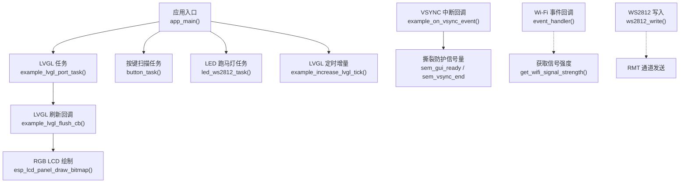
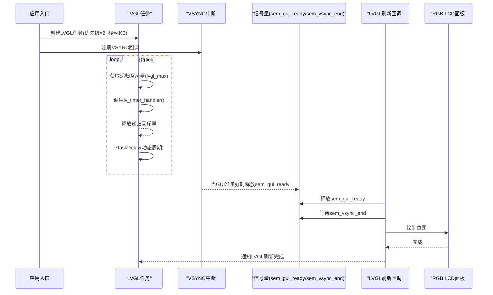
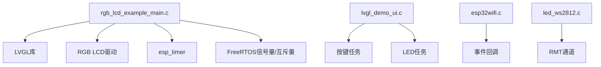

# 任务调度优化

<cite>
**本文引用的文件**   
- [rgb_lcd_example_main.c](file://ESP32开发板/TK021F2699_ESP32_LVGL_GIF_LED/TK021F2699_ESP32_LVGL_GIF_LED/main/rgb_lcd_example_main.c)
- [LCD.c](file://ESP32开发板/TK021F2699_ESP32_LVGL_GIF_LED/TK021F2699_ESP32_LVGL_GIF_LED/main/LCD.c)
- [LCD.h](file://ESP32开发板/TK021F2699_ESP32_LVGL_GIF_LED/TK021F2699_ESP32_LVGL_GIF_LED/main/LCD.h)
- [lvgl_demo_ui.c](file://ESP32开发板/TK021F2699_ESP32_LVGL_GIF_LED/TK021F2699_ESP32_LVGL_GIF_LED/main/ui/lvgl_demo_ui.c)
- [esp32wifi.c](file://ESP32开发板/TK021F2699_ESP32_LVGL_GIF_LED/TK021F2699_ESP32_LVGL_GIF_LED/main/wifi/esp32wifi.c)
- [led_ws2812.c](file://ESP32开发板/TK021F2699_ESP32_LVGL_GIF_LED/TK021F2699_ESP32_LVGL_GIF_LED/main/led_ws2812/led_ws2812.c)
- [led_ws2812.h](file://ESP32开发板/TK021F2699_ESP32_LVGL_GIF_LED/TK021F2699_ESP32_LVGL_GIF_LED/main/led_ws2812/led_ws2812.h)
</cite>

## 目录
1. [引言](#引言)
2. [项目结构](#项目结构)
3. [核心组件](#核心组件)
4. [架构总览](#架构总览)
5. [详细组件分析](#详细组件分析)
6. [依赖关系分析](#依赖关系分析)
7. [性能与实时性考虑](#性能与实时性考虑)
8. [故障排查指南](#故障排查指南)
9. [结论](#结论)
10. [附录](#附录)

## 引言
本技术文档面向在 ESP32 平台上基于 FreeRTOS 进行多任务开发的工程师，围绕“任务调度优化”这一目标，结合工程中的 LVGL 显示、RGB LCD 驱动、Wi-Fi 事件处理与 WS2812 LED 控制等实际代码，系统阐述以下主题：
- 多任务优先级设置与任务间通信机制（信号量、互斥锁）
- 并发控制的优化策略（避免撕裂、线程安全）
- 任务栈大小配置与堆栈溢出检测
- 定时器任务与中断对系统实时性的影响
- CPU 使用率分析与任务执行时间测量方法
- 任务死锁的检测与预防策略

## 项目结构
本项目采用分层组织方式：应用入口与任务创建位于主程序；LVGL UI 与动画逻辑位于 ui 目录；外设驱动（LCD、WS2812）与网络模块（Wi-Fi）各自独立。FreeRTOS 的任务、信号量、递归互斥量以及 esp_timer 的周期性回调贯穿各层，形成“UI 渲染 + 外设刷新 + 事件驱动”的典型嵌入式实时架构。

图表来源
- [rgb_lcd_example_main.c:130-148](file://ESP32开发板/TK021F2699_ESP32_LVGL_GIF_LED/TK021F2699_ESP32_LVGL_GIF_LED/main/rgb_lcd_example_main.c#L130-L148)
- [rgb_lcd_example_main.c:84-93](file://ESP32开发板/TK021F2699_ESP32_LVGL_GIF_LED/TK021F2699_ESP32_LVGL_GIF_LED/main/rgb_lcd_example_main.c#L84-L93)
- [rgb_lcd_example_main.c:95-109](file://ESP32开发板/TK021F2699_ESP32_LVGL_GIF_LED/TK021F2699_ESP32_LVGL_GIF_LED/main/rgb_lcd_example_main.c#L95-L109)
- [lvgl_demo_ui.c:263-279](file://ESP32开发板/TK021F2699_ESP32_LVGL_GIF_LED/TK021F2699_ESP32_LVGL_GIF_LED/main/ui/lvgl_demo_ui.c#L263-L279)
- [lvgl_demo_ui.c:84-124](file://ESP32开发板/TK021F2699_ESP32_LVGL_GIF_LED/TK021F2699_ESP32_LVGL_GIF_LED/main/ui/lvgl_demo_ui.c#L84-L124)
- [esp32wifi.c:14-43](file://ESP32开发板/TK021F2699_ESP32_LVGL_GIF_LED/TK021F2699_ESP32_LVGL_GIF_LED/main/wifi/esp32wifi.c#L14-L43)
- [esp32wifi.c:98-108](file://ESP32开发板/TK021F2699_ESP32_LVGL_GIF_LED/TK021F2699_ESP32_LVGL_GIF_LED/main/wifi/esp32wifi.c#L98-L108)
- [led_ws2812.c:236-250](file://ESP32开发板/TK021F2699_ESP32_LVGL_GIF_LED/TK021F2699_ESP32_LVGL_GIF_LED/main/led_ws2812/led_ws2812.c#L236-L250)

章节来源
- [rgb_lcd_example_main.c:150-303](file://ESP32开发板/TK021F2699_ESP32_LVGL_GIF_LED/TK021F2699_ESP32_LVGL_GIF_LED/main/rgb_lcd_example_main.c#L150-L303)
- [lvgl_demo_ui.c:297-497](file://ESP32开发板/TK021F2699_ESP32_LVGL_GIF_LED/TK021F2699_ESP32_LVGL_GIF_LED/main/ui/lvgl_demo_ui.c#L297-L497)
- [esp32wifi.c:46-95](file://ESP32开发板/TK021F2699_ESP32_LVGL_GIF_LED/TK021F2699_ESP32_LVGL_GIF_LED/main/wifi/esp32wifi.c#L46-L95)
- [led_ws2812.c:179-213](file://ESP32开发板/TK021F2699_ESP32_LVGL_GIF_LED/TK021F2699_ESP32_LVGL_GIF_LED/main/led_ws2812/led_ws2812.c#L179-L213)

## 核心组件
- 任务与同步原语
  - LVGL 任务：周期性调用 lv_timer_handler，并通过递归互斥量保护 LVGL API 调用。
  - VSYNC 中断回调：用于撕裂防护的信号量协调。
  - 按键扫描任务：轮询 GPIO，触发菜单旋转动画。
  - LED 跑马灯任务：按周期更新 WS2812 颜色序列。
- 定时器与事件
  - esp_timer 周期性回调提供 LVGL tick。
  - Wi-Fi 事件回调处理连接状态变化。
- 显示与刷新
  - RGB LCD 面板初始化与帧缓冲管理。
  - LVGL flush 回调将缓冲区数据写入硬件，并在可选模式下等待 VSYNC 以避免撕裂。

章节来源
- [rgb_lcd_example_main.c:117-128](file://ESP32开发板/TK021F2699_ESP32_LVGL_GIF_LED/TK021F2699_ESP32_LVGL_GIF_LED/main/rgb_lcd_example_main.c#L117-L128)
- [rgb_lcd_example_main.c:130-148](file://ESP32开发板/TK021F2699_ESP32_LVGL_GIF_LED/TK021F2699_ESP32_LVGL_GIF_LED/main/rgb_lcd_example_main.c#L130-L148)
- [rgb_lcd_example_main.c:84-93](file://ESP32开发板/TK021F2699_ESP32_LVGL_GIF_LED/TK021F2699_ESP32_LVGL_GIF_LED/main/rgb_lcd_example_main.c#L84-L93)
- [rgb_lcd_example_main.c:95-109](file://ESP32开发板/TK021F2699_ESP32_LVGL_GIF_LED/TK021F2699_ESP32_LVGL_GIF_LED/main/rgb_lcd_example_main.c#L95-L109)
- [lvgl_demo_ui.c:263-279](file://ESP32开发板/TK021F2699_ESP32_LVGL_GIF_LED/TK021F2699_ESP32_LVGL_GIF_LED/main/ui/lvgl_demo_ui.c#L263-L279)
- [lvgl_demo_ui.c:84-124](file://ESP32开发板/TK021F2699_ESP32_LVGL_GIF_LED/TK021F2699_ESP32_LVGL_GIF_LED/main/ui/lvgl_demo_ui.c#L84-L124)
- [esp32wifi.c:14-43](file://ESP32开发板/TK021F2699_ESP32_LVGL_GIF_LED/TK021F2699_ESP32_LVGL_GIF_LED/main/wifi/esp32wifi.c#L14-L43)

## 架构总览
下图展示了从应用启动到 UI 渲染、中断同步、外设驱动的完整链路，并标注了关键同步点与资源访问路径。

图表来源
- [rgb_lcd_example_main.c:130-148](file://ESP32开发板/TK021F2699_ESP32_LVGL_GIF_LED/TK021F2699_ESP32_LVGL_GIF_LED/main/rgb_lcd_example_main.c#L130-L148)
- [rgb_lcd_example_main.c:84-93](file://ESP32开发板/TK021F2699_ESP32_LVGL_GIF_LED/TK021F2699_ESP32_LVGL_GIF_LED/main/rgb_lcd_example_main.c#L84-L93)
- [rgb_lcd_example_main.c:95-109](file://ESP32开发板/TK021F2699_ESP32_LVGL_GIF_LED/TK021F2699_ESP32_LVGL_GIF_LED/main/rgb_lcd_example_main.c#L95-L109)

## 详细组件分析

### 任务与优先级设计
- LVGL 任务
  - 优先级：示例中设置为 2，适合中等负载的 UI 循环。若需提升响应性，可在保证不抢占高优先级中断的前提下适当提高。
  - 栈大小：示例为 4KB，对于仅调用 lv_timer_handler 的场景通常足够；若包含复杂动画或大量对象操作，建议通过溢出检测逐步增大。
  - 延迟策略：根据 lv_timer_handler 返回的剩余时间动态调整 vTaskDelay，兼顾吞吐与时延。
- 按键扫描任务
  - 优先级：示例中设置为 10，高于 LVGL 任务，确保交互及时响应。
  - 栈大小：示例为 2KB，满足简单轮询逻辑。
- LED 跑马灯任务
  - 优先级：示例中设置为 10，与按键任务同级，避免长时间阻塞 LVGL 渲染。
  - 栈大小：示例为 4KB，足以容纳循环与延时逻辑。

优化建议
- 将耗时且非实时的任务（如网络请求、大文件 IO）置于较低优先级，避免抢占 UI 与输入任务。
- 使用事件或消息队列替代忙等，减少 CPU 占用。
- 合理分配栈空间，结合溢出检测工具验证最小需求。

章节来源
- [rgb_lcd_example_main.c:66-71](file://ESP32开发板/TK021F2699_ESP32_LVGL_GIF_LED/TK021F2699_ESP32_LVGL_GIF_LED/main/rgb_lcd_example_main.c#L66-L71)
- [rgb_lcd_example_main.c:130-148](file://ESP32开发板/TK021F2699_ESP32_LVGL_GIF_LED/TK021F2699_ESP32_LVGL_GIF_LED/main/rgb_lcd_example_main.c#L130-L148)
- [lvgl_demo_ui.c:263-279](file://ESP32开发板/TK021F2699_ESP32_LVGL_GIF_LED/TK021F2699_ESP32_LVGL_GIF_LED/main/ui/lvgl_demo_ui.c#L263-L279)
- [lvgl_demo_ui.c:84-124](file://ESP32开发板/TK021F2699_ESP32_LVGL_GIF_LED/TK021F2699_ESP32_LVGL_GIF_LED/main/ui/lvgl_demo_ui.c#L84-L124)

### 任务间通信与并发控制
- 递归互斥量（lvgl_mux）
  - 用途：保护 LVGL API 的线程安全访问。
  - 模式：所有进入 LVGL 的入口均需先获取再释放，支持嵌套调用。
- 信号量（sem_gui_ready / sem_vsync_end）
  - 用途：在可选模式下实现 VSYNC 同步，避免画面撕裂。
  - 流程：flush 回调释放 sem_gui_ready，中断回调在 GUI 准备好后释放 sem_vsync_end，flush 等待后者后再进行绘制。
- 事件回调（Wi-Fi）
  - 用途：处理 STA 连接与断开事件，必要时可触发 UI 更新或任务唤醒。

优化建议
- 尽量避免在中断中进行长耗时操作，仅做轻量同步（如释放信号量）。
- 使用带超时的取信号量接口，防止无限等待导致死锁。
- 对共享资源采用细粒度锁，降低临界区长度。

章节来源
- [rgb_lcd_example_main.c:117-128](file://ESP32开发板/TK021F2699_ESP32_LVGL_GIF_LED/TK021F2699_ESP32_LVGL_GIF_LED/main/rgb_lcd_example_main.c#L117-L128)
- [rgb_lcd_example_main.c:84-93](file://ESP32开发板/TK021F2699_ESP32_LVGL_GIF_LED/TK021F2699_ESP32_LVGL_GIF_LED/main/rgb_lcd_example_main.c#L84-L93)
- [rgb_lcd_example_main.c:95-109](file://ESP32开发板/TK021F2699_ESP32_LVGL_GIF_LED/TK021F2699_ESP32_LVGL_GIF_LED/main/rgb_lcd_example_main.c#L95-L109)
- [esp32wifi.c:14-43](file://ESP32开发板/TK021F2699_ESP32_LVGL_GIF_LED/TK021F2699_ESP32_LVGL_GIF_LED/main/wifi/esp32wifi.c#L14-L43)

### 定时器任务与中断对实时性的影响
- esp_timer 周期性回调
  - 作用：以固定周期增加 LVGL tick，保障动画与界面更新的时序一致性。
  - 建议：周期不宜过短，避免频繁上下文切换；也不宜过长，以免动画卡顿。
- VSYNC 中断回调
  - 作用：在可选模式下与 LVGL 刷新回调协作，避免撕裂。
  - 注意：中断内只做信号量操作，避免阻塞。

优化建议
- 将 LVGL tick 周期设为 2ms，平衡精度与开销。
- 若无需撕裂防护，可关闭相关信号量以减少同步开销。

章节来源
- [rgb_lcd_example_main.c:111-115](file://ESP32开发板/TK021F2699_ESP32_LVGL_GIF_LED/TK021F2699_ESP32_LVGL_GIF_LED/main/rgb_lcd_example_main.c#L111-L115)
- [rgb_lcd_example_main.c:84-93](file://ESP32开发板/TK021F2699_ESP32_LVGL_GIF_LED/TK021F2699_ESP32_LVGL_GIF_LED/main/rgb_lcd_example_main.c#L84-L93)

### 任务栈大小配置与溢出检测
- 配置要点
  - LVGL 任务：4KB（示例），适用于常规 UI 场景。
  - 按键任务：2KB（示例），满足轮询逻辑。
  - LED 任务：4KB（示例），满足循环与延时。
- 溢出检测
  - 启用 FreeRTOS 的栈溢出检测宏（如 configCHECK_FOR_STACK_OVERFLOW），并在运行时记录溢出信息。
  - 结合日志输出定位具体任务与栈使用峰值。
- 调优方法
  - 逐步增大任务栈，观察是否仍发生溢出。
  - 减少函数局部变量与深层递归，改用静态或堆分配。

章节来源
- [rgb_lcd_example_main.c:66-71](file://ESP32开发板/TK021F2699_ESP32_LVGL_GIF_LED/TK021F2699_ESP32_LVGL_GIF_LED/main/rgb_lcd_example_main.c#L66-L71)
- [lvgl_demo_ui.c:263-279](file://ESP32开发板/TK021F2699_ESP32_LVGL_GIF_LED/TK021F2699_ESP32_LVGL_GIF_LED/main/ui/lvgl_demo_ui.c#L263-L279)
- [lvgl_demo_ui.c:84-124](file://ESP32开发板/TK021F2699_ESP32_LVGL_GIF_LED/TK021F2699_ESP32_LVGL_GIF_LED/main/ui/lvgl_demo_ui.c#L84-L124)

### 定时器与中断处理的最佳实践
- esp_timer 回调
  - 保持简短，仅做必要的数据更新或信号量释放。
  - 避免在回调中调用可能阻塞的 API。
- VSYNC 中断
  - 仅做同步原语操作，确保快速退出。
  - 若不需要撕裂防护，可禁用相关回调以降低中断负载。

章节来源
- [rgb_lcd_example_main.c:111-115](file://ESP32开发板/TK021F2699_ESP32_LVGL_GIF_LED/TK021F2699_ESP32_LVGL_GIF_LED/main/rgb_lcd_example_main.c#L111-L115)
- [rgb_lcd_example_main.c:84-93](file://ESP32开发板/TK021F2699_ESP32_LVGL_GIF_LED/TK021F2699_ESP32_LVGL_GIF_LED/main/rgb_lcd_example_main.c#L84-L93)

### CPU 使用率分析与任务执行时间测量
- 使用 FreeRTOS 统计接口
  - 获取每个任务的运行时间与 CPU 占用比例，识别热点任务。
- 使用 esp_timer 高精度计时
  - 在关键路径前后读取时间戳，计算执行时长，辅助定位瓶颈。
- 可视化与分析
  - 将统计数据导出至串口或文件系统，结合图表分析趋势。

章节来源
- [rgb_lcd_example_main.c:111-115](file://ESP32开发板/TK021F2699_ESP32_LVGL_GIF_LED/TK021F2699_ESP32_LVGL_GIF_LED/main/rgb_lcd_example_main.c#L111-L115)

### 任务死锁检测与预防策略
- 常见原因
  - 未正确释放互斥量或信号量。
  - 在中断中尝试获取可能阻塞的同步原语。
  - 循环等待条件永远无法满足。
- 检测方法
  - 启用 FreeRTOS 死锁检测（如 configUSE_TRACE_FACILITY 与相关宏）。
  - 在关键路径添加超时参数，避免无限等待。
- 预防策略
  - 统一加锁顺序，避免环路依赖。
  - 缩短临界区，减少持有锁的时间。
  - 使用带超时的取锁接口，失败时回退或重试。

章节来源
- [rgb_lcd_example_main.c:117-128](file://ESP32开发板/TK021F2699_ESP32_LVGL_GIF_LED/TK021F2699_ESP32_LVGL_GIF_LED/main/rgb_lcd_example_main.c#L117-L128)
- [rgb_lcd_example_main.c:95-109](file://ESP32开发板/TK021F2699_ESP32_LVGL_GIF_LED/TK021F2699_ESP32_LVGL_GIF_LED/main/rgb_lcd_example_main.c#L95-L109)

## 依赖关系分析
- 模块耦合
  - 主程序依赖 LVGL、RGB LCD 驱动、Wi-Fi 事件与 WS2812 驱动。
  - LVGL 任务通过递归互斥量与刷新回调协同工作。
  - VSYNC 中断与 LVGL 刷新回调通过信号量同步。
- 外部依赖
  - FreeRTOS 任务、信号量、递归互斥量。
  - esp_timer 提供高精度周期回调。
  - ESP-IDF 的 LCD 与 RMT 驱动。

图表来源
- [rgb_lcd_example_main.c:150-303](file://ESP32开发板/TK021F2699_ESP32_LVGL_GIF_LED/TK021F2699_ESP32_LVGL_GIF_LED/main/rgb_lcd_example_main.c#L150-L303)
- [lvgl_demo_ui.c:297-497](file://ESP32开发板/TK021F2699_ESP32_LVGL_GIF_LED/TK021F2699_ESP32_LVGL_GIF_LED/main/ui/lvgl_demo_ui.c#L297-L497)
- [esp32wifi.c:46-95](file://ESP32开发板/TK021F2699_ESP32_LVGL_GIF_LED/TK021F2699_ESP32_LVGL_GIF_LED/main/wifi/esp32wifi.c#L46-L95)
- [led_ws2812.c:179-213](file://ESP32开发板/TK021F2699_ESP32_LVGL_GIF_LED/TK021F2699_ESP32_LVGL_GIF_LED/main/led_ws2812/led_ws2812.c#L179-L213)

章节来源
- [rgb_lcd_example_main.c:150-303](file://ESP32开发板/TK021F2699_ESP32_LVGL_GIF_LED/TK021F2699_ESP32_LVGL_GIF_LED/main/rgb_lcd_example_main.c#L150-L303)
- [lvgl_demo_ui.c:297-497](file://ESP32开发板/TK021F2699_ESP32_LVGL_GIF_LED/TK021F2699_ESP32_LVGL_GIF_LED/main/ui/lvgl_demo_ui.c#L297-L497)
- [esp32wifi.c:46-95](file://ESP32开发板/TK021F2699_ESP32_LVGL_GIF_LED/TK021F2699_ESP32_LVGL_GIF_LED/main/wifi/esp32wifi.c#L46-L95)
- [led_ws2812.c:179-213](file://ESP32开发板/TK021F2699_ESP32_LVGL_GIF_LED/TK021F2699_ESP32_LVGL_GIF_LED/main/led_ws2812/led_ws2812.c#L179-L213)

## 性能与实时性考虑
- 任务优先级
  - 输入与 UI 任务应优先于后台任务，确保交互流畅。
- 同步开销
  - 仅在必要时使用信号量与互斥量，避免过度同步。
- 中断负载
  - 中断回调尽量短小，避免阻塞型操作。
- 内存与缓存
  - 帧缓冲与 LVGL 缓冲区放置在 PSRAM 可降低内部 RAM 压力，但需注意带宽与延迟。
- 动画与刷新
  - 合理设置 LVGL tick 周期与刷新区域，减少不必要的重绘。

[本节为通用指导，不直接分析具体文件]

## 故障排查指南
- 画面撕裂
  - 检查 VSYNC 信号量是否正确配对释放与等待。
  - 确认 flush 回调在等待 VSYNC 后才进行绘制。
- 任务卡死
  - 检查互斥量与信号量的获取/释放路径，确保无遗漏。
  - 为关键等待添加超时，避免无限阻塞。
- 栈溢出
  - 启用溢出检测宏，查看日志定位任务。
  - 逐步增大任务栈，减少局部变量与递归深度。
- 中断异常
  - 避免在中断中调用可能阻塞的 API。
  - 简化中断回调逻辑，仅做同步与标志设置。

章节来源
- [rgb_lcd_example_main.c:84-93](file://ESP32开发板/TK021F2699_ESP32_LVGL_GIF_LED/TK021F2699_ESP32_LVGL_GIF_LED/main/rgb_lcd_example_main.c#L84-L93)
- [rgb_lcd_example_main.c:95-109](file://ESP32开发板/TK021F2699_ESP32_LVGL_GIF_LED/TK021F2699_ESP32_LVGL_GIF_LED/main/rgb_lcd_example_main.c#L95-L109)
- [rgb_lcd_example_main.c:117-128](file://ESP32开发板/TK021F2699_ESP32_LVGL_GIF_LED/TK021F2699_ESP32_LVGL_GIF_LED/main/rgb_lcd_example_main.c#L117-L128)

## 结论
通过对项目中 LVGL 任务、VSYNC 中断、Wi-Fi 事件与 WS2812 驱动的深入分析，可以得出以下优化要点：
- 合理设置任务优先级与栈大小，结合溢出检测持续调优。
- 使用递归互斥量保护 LVGL API，使用信号量实现 VSYNC 同步，避免撕裂。
- 精简中断回调，避免阻塞操作，确保系统实时性。
- 借助 FreeRTOS 统计与 esp_timer 进行 CPU 使用率与执行时间分析，定位性能瓶颈。
- 建立死锁检测与预防机制，提升系统稳定性。

[本节为总结，不直接分析具体文件]

## 附录
- 关键配置参考
  - LVGL 任务优先级与栈大小：参见主程序定义。
  - VSYNC 撕裂防护开关：通过编译选项启用/禁用。
  - esp_timer 周期：建议 2ms。
- 常用接口路径
  - LVGL 任务入口与循环：[rgb_lcd_example_main.c:130-148](file://ESP32开发板/TK021F2699_ESP32_LVGL_GIF_LED/TK021F2699_ESP32_LVGL_GIF_LED/main/rgb_lcd_example_main.c#L130-L148)
  - VSYNC 中断回调：[rgb_lcd_example_main.c:84-93](file://ESP32开发板/TK021F2699_ESP32_LVGL_GIF_LED/TK021F2699_ESP32_LVGL_GIF_LED/main/rgb_lcd_example_main.c#L84-L93)
  - LVGL 刷新回调：[rgb_lcd_example_main.c:95-109](file://ESP32开发板/TK021F2699_ESP32_LVGL_GIF_LED/TK021F2699_ESP32_LVGL_GIF_LED/main/rgb_lcd_example_main.c#L95-L109)
  - 按键扫描任务：[lvgl_demo_ui.c:263-279](file://ESP32开发板/TK021F2699_ESP32_LVGL_GIF_LED/TK021F2699_ESP32_LVGL_GIF_LED/main/ui/lvgl_demo_ui.c#L263-L279)
  - LED 跑马灯任务：[lvgl_demo_ui.c:84-124](file://ESP32开发板/TK021F2699_ESP32_LVGL_GIF_LED/TK021F2699_ESP32_LVGL_GIF_LED/main/ui/lvgl_demo_ui.c#L84-L124)
  - Wi-Fi 事件回调：[esp32wifi.c:14-43](file://ESP32开发板/TK021F2699_ESP32_LVGL_GIF_LED/TK021F2699_ESP32_LVGL_GIF_LED/main/wifi/esp32wifi.c#L14-L43)
  - WS2812 写入：[led_ws2812.c:236-250](file://ESP32开发板/TK021F2699_ESP32_LVGL_GIF_LED/TK021F2699_ESP32_LVGL_GIF_LED/main/led_ws2812/led_ws2812.c#L236-L250)