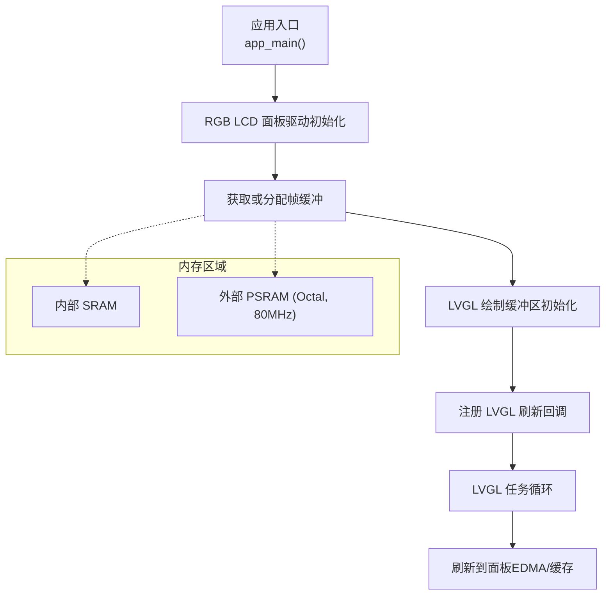
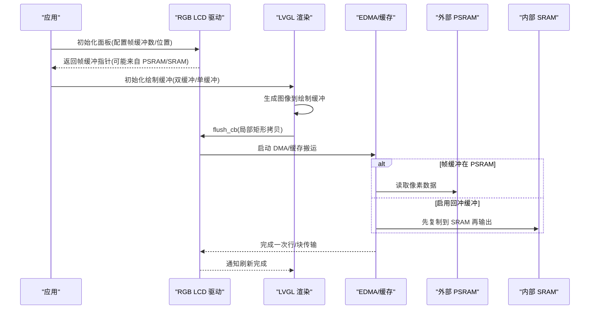
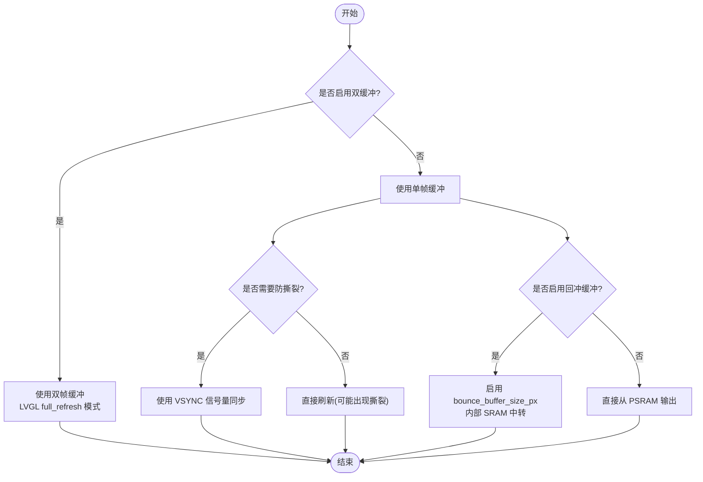
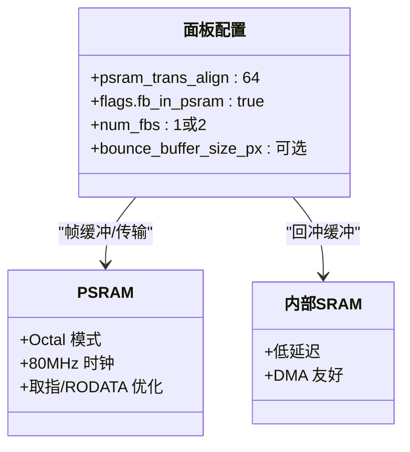
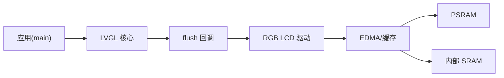

# 内存管理优化

<cite>
**本文引用的文件**   
- [README.md](file://ESP32开发板/TK021F2699_ESP32_LVGL_GIF_LED/TK021F2699_ESP32_LVGL_GIF_LED/README.md)
- [rgb_lcd_example_main.c](file://ESP32开发板/TK021F2699_ESP32_LVGL_GIF_LED/TK021F2699_ESP32_LVGL_GIF_LED/main/rgb_lcd_example_main.c)
- [sdkconfig.defaults.esp32s3](file://ESP32开发板/TK021F2699_ESP32_LVGL_GIF_LED/TK021F2699_ESP32_LVGL_GIF_LED/sdkconfig.defaults.esp32s3)
- [sdkconfig.ci.double_fb](file://ESP32开发板/TK021F2699_ESP32_LVGL_GIF_LED/TK021F2699_ESP32_LVGL_GIF_LED/sdkconfig.ci.double_fb)
- [sdkconfig.ci.single_fb_no_bb](file://ESP32开发板/TK021F2699_ESP32_LVGL_GIF_LED/TK021F2699_ESP32_LVGL_GIF_LED/sdkconfig.ci.single_fb_no_bb)
- [sdkconfig.ci.single_fb_with_bb](file://ESP32开发板/TK021F2699_ESP32_LVGL_GIF_LED/TK021F2699_ESP32_LVGL_GIF_LED/sdkconfig.ci.single_fb_with_bb)
- [lv_refr.c](file://ESP32开发板/TK021F2699_ESP32_LVGL_GIF_LED/TK021F2699_ESP32_LVGL_GIF_LED/managed_components/lvgl__lvgl/src/core/lv_refr.c)
</cite>

## 目录
1. [简介](#简介)
2. [项目结构](#项目结构)
3. [核心组件](#核心组件)
4. [架构总览](#架构总览)
5. [详细组件分析](#详细组件分析)
6. [依赖关系分析](#依赖关系分析)
7. [性能考量](#性能考量)
8. [故障排查指南](#故障排查指南)
9. [结论](#结论)
10. [附录](#附录)

## 简介
本技术文档聚焦于 ESP32-S3 平台上的内存管理优化，围绕内部 SRAM 与外部 PSRAM 的协同使用策略、帧缓冲区的分配与双缓冲模式、内存对齐与 DMA 传输特性、heap_caps_malloc 的使用场景与内存池管理思路、内存泄漏检测方法与工具、以及不同配置下的性能表现与最佳实践展开。文档结合工程中的 LVGL 显示驱动与 RGB LCD 示例，给出可操作的优化建议与调试技巧。

## 项目结构
本项目为基于 ESP-IDF 的 RGB LCD 示例，集成 LVGL 图形库，支持单/双帧缓冲、回冲缓冲（bounce buffer）等显示路径选项；PSRAM 以 Octal 模式运行，并通过若干默认配置提升 PCLK 上限。关键源码与配置如下：
- 应用主流程与显示初始化：main/rgb_lcd_example_main.c
- 示例说明与故障排查：README.md
- ESP32-S3 默认配置（启用 PSRAM、Octal、80MHz、ICache/RODATA 从 PSRAM 取指/取数据）：sdkconfig.defaults.esp32s3
- CI 配置集（双缓冲、单缓冲无回冲、单缓冲有回冲）：sdkconfig.ci.*

图表来源
- [rgb_lcd_example_main.c:150-273](file://ESP32开发板/TK021F2699_ESP32_LVGL_GIF_LED/TK021F2699_ESP32_LVGL_GIF_LED/main/rgb_lcd_example_main.c#L150-L273)
- [sdkconfig.defaults.esp32s3:1-9](file://ESP32开发板/TK021F2699_ESP32_LVGL_GIF_LED/TK021F2699_ESP32_LVGL_GIF_LED/sdkconfig.defaults.esp32s3#L1-L9)

章节来源
- [README.md:1-122](file://ESP32开发板/TK021F2699_ESP32_LVGL_GIF_LED/TK021F2699_ESP32_LVGL_GIF_LED/README.md#L1-L122)
- [rgb_lcd_example_main.c:150-303](file://ESP32开发板/TK021F2699_ESP32_LVGL_GIF_LED/TK021F2699_ESP32_LVGL_GIF_LED/main/rgb_lcd_example_main.c#L150-L303)
- [sdkconfig.defaults.esp32s3:1-9](file://ESP32开发板/TK021F2699_ESP32_LVGL_GIF_LED/TK021F2699_ESP32_LVGL_GIF_LED/sdkconfig.defaults.esp32s3#L1-L9)

## 核心组件
- 显示驱动与帧缓冲
  - 通过 RGB LCD 驱动创建面板并配置帧缓冲数量与位置（内部 SRAM 或 PSRAM）。
  - 支持双缓冲模式（full_refresh），避免撕裂；单缓冲模式下可选择回冲缓冲以提升 PCLK。
- LVGL 集成
  - 将 LVGL 绘制缓冲区与底层帧缓冲绑定，提供 flush 回调完成像素搬运。
  - 使用互斥量保护 LVGL API 调用，确保线程安全。
- 内存分配
  - 在单缓冲路径下，使用 heap_caps_malloc 指定 MALLOC_CAP_SPIRAM 将 LVGL 绘制缓冲区分配至 PSRAM。
  - 在双缓冲路径下，直接从 RGB 驱动获取两个帧缓冲指针作为 LVGL 的双缓冲。
- 同步机制
  - 可选 VSYNC 信号与互斥量/信号量配合，避免写入与读取冲突导致的撕裂。

章节来源
- [rgb_lcd_example_main.c:177-273](file://ESP32开发板/TK021F2699_ESP32_LVGL_GIF_LED/TK021F2699_ESP32_LVGL_GIF_LED/main/rgb_lcd_example_main.c#L177-L273)
- [lv_refr.c:329-706](file://ESP32开发板/TK021F2699_ESP32_LVGL_GIF_LED/TK021F2699_ESP32_LVGL_GIF_LED/managed_components/lvgl__lvgl/src/core/lv_refr.c#L329-L706)

## 架构总览
下图展示了 ESP32-S3 上 LVGL 与 RGB LCD 驱动的内存与数据流交互，包括 PSRAM 帧缓冲、内部 SRAM 回冲缓冲、以及 EDMA/缓存的数据通路。

图表来源
- [rgb_lcd_example_main.c:183-273](file://ESP32开发板/TK021F2699_ESP32_LVGL_GIF_LED/TK021F2699_ESP32_LVGL_GIF_LED/main/rgb_lcd_example_main.c#L183-L273)
- [lv_refr.c:519-706](file://ESP32开发板/TK021F2699_ESP32_LVGL_GIF_LED/TK021F2699_ESP32_LVGL_GIF_LED/managed_components/lvgl__lvgl/src/core/lv_refr.c#L519-L706)

## 详细组件分析

### 帧缓冲与双缓冲模式
- 双缓冲模式
  - 通过配置项启用双帧缓冲，LVGL 使用 full_refresh 模式，保证离线缓冲写入与在线缓冲读取无交集，从而避免撕裂。
  - 帧缓冲由 RGB 驱动统一分配与管理，可直接获取两个缓冲指针用于 LVGL 双缓冲。
- 单缓冲模式
  - LVGL 仅有一个绘制缓冲，需额外同步（如 VSYNC 信号量）以避免撕裂。
  - 可通过回冲缓冲（bounce buffer）将部分数据暂存至内部 SRAM，提高 PCLK 上限，但会增加 CPU 占用。

图表来源
- [rgb_lcd_example_main.c:250-273](file://ESP32开发板/TK021F2699_ESP32_LVGL_GIF_LED/TK021F2699_ESP32_LVGL_GIF_LED/main/rgb_lcd_example_main.c#L250-L273)
- [lv_refr.c:519-706](file://ESP32开发板/TK021F2699_ESP32_LVGL_GIF_LED/TK021F2699_ESP32_LVGL_GIF_LED/managed_components/lvgl__lvgl/src/core/lv_refr.c#L519-L706)

章节来源
- [README.md:12-18](file://ESP32开发板/TK021F2699_ESP32_LVGL_GIF_LED/TK021F2699_ESP32_LVGL_GIF_LED/README.md#L12-L18)
- [rgb_lcd_example_main.c:250-273](file://ESP32开发板/TK021F2699_ESP32_LVGL_GIF_LED/TK021F2699_ESP32_LVGL_GIF_LED/main/rgb_lcd_example_main.c#L250-L273)
- [lv_refr.c:519-706](file://ESP32开发板/TK021F2699_ESP32_LVGL_GIF_LED/TK021F2699_ESP32_LVGL_GIF_LED/managed_components/lvgl__lvgl/src/core/lv_refr.c#L519-L706)

### PSRAM 与内存对齐
- PSRAM 配置
  - 启用 SPIRAM，Octal 模式，80MHz 时钟，有助于提升带宽。
  - 开启“从 PSRAM 取指令/只读数据”以降低 ICache 对 SPI0 带宽占用，间接提升 PCLK 上限。
- 传输对齐
  - 面板配置中设置 psram_trans_align=64，满足 DMA/总线对齐要求，减少碎片化访问带来的开销。
- 帧缓冲位置
  - 通过 flags.fb_in_psram=true 将帧缓冲置于 PSRAM，降低内部 SRAM 压力，但受限于 SPI0 带宽。

图表来源
- [rgb_lcd_example_main.c:183-228](file://ESP32开发板/TK021F2699_ESP32_LVGL_GIF_LED/TK021F2699_ESP32_LVGL_GIF_LED/main/rgb_lcd_example_main.c#L183-L228)
- [sdkconfig.defaults.esp32s3:1-9](file://ESP32开发板/TK021F2699_ESP32_LVGL_GIF_LED/TK021F2699_ESP32_LVGL_GIF_LED/sdkconfig.defaults.esp32s3#L1-L9)

章节来源
- [sdkconfig.defaults.esp32s3:1-9](file://ESP32开发板/TK021F2699_ESP32_LVGL_GIF_LED/TK021F2699_ESP32_LVGL_GIF_LED/sdkconfig.defaults.esp32s3#L1-L9)
- [rgb_lcd_example_main.c:183-228](file://ESP32开发板/TK021F2699_ESP32_LVGL_GIF_LED/TK021F2699_ESP32_LVGL_GIF_LED/main/rgb_lcd_example_main.c#L183-L228)

### heap_caps_malloc 使用场景与内存池管理
- 使用场景
  - 在单缓冲路径下，使用 heap_caps_malloc 显式指定 MALLOC_CAP_SPIRAM，将 LVGL 绘制缓冲分配到 PSRAM，释放内部 SRAM 空间。
- 内存池管理建议
  - 预分配大对象：对于固定大小的帧缓冲或图片缓存，建议在启动阶段一次性分配，避免运行时碎片化。
  - 分类池：按用途划分内存池（如 UI 资源、临时解码缓冲、网络缓冲），限制各池大小，防止单一模块耗尽全局堆。
  - 对齐与边界：遵循 DMA 对齐要求（如 64B），必要时手动对齐或选择对齐分配器。
  - 生命周期管理：明确分配/释放点，避免跨任务共享未加锁的内存句柄。

章节来源
- [rgb_lcd_example_main.c:256-261](file://ESP32开发板/TK021F2699_ESP32_LVGL_GIF_LED/TK021F2699_ESP32_LVGL_GIF_LED/main/rgb_lcd_example_main.c#L256-L261)

### 内存泄漏检测方法与工具
- 静态分析与编译期检查
  - 使用 ESP-IDF 提供的静态分析工具链（如 cppcheck）在构建阶段发现潜在问题。
- 运行时监控
  - 利用 FreeRTOS 堆统计接口（如 vTaskGetFreeHeapSize）周期性打印剩余堆大小，观察异常下降趋势。
  - 启用 ESP-IDF 的堆损坏检测（CONFIG_HEAP_POISONING）与断言，捕获越界与重复释放。
- 日志与回溯
  - 在关键分配/释放处记录日志，结合崩溃时的栈回溯定位泄漏点。
- 第三方工具
  - 结合 ESP-Prog/JTAG 进行内存快照对比，或使用 ESP-IDF 的 Memory Profiler 辅助分析。

章节来源
- [README.md:102-122](file://ESP32开发板/TK021F2699_ESP32_LVGL_GIF_LED/TK021F2699_ESP32_LVGL_GIF_LED/README.md#L102-L122)

### 不同内存配置下的性能表现与最佳实践
- 双缓冲 + PSRAM 帧缓冲
  - 优点：无撕裂，渲染稳定；缺点：SPI0 带宽受限，PCLK 上限较低。
  - 建议：开启“从 PSRAM 取指令/RODATA”，减少 ICache 对 SPI0 的争用。
- 单缓冲 + 回冲缓冲
  - 优点：PCLK 更高，刷新更快；缺点：CPU 占用增加。
  - 建议：合理设置 bounce_buffer_size_px，平衡带宽与 CPU 负载。
- 单缓冲 + 无回冲缓冲
  - 优点：实现简单；缺点：可能出现撕裂，需额外同步。
  - 建议：仅在低端设备或演示场景使用。

章节来源
- [README.md:106-117](file://ESP32开发板/TK021F2699_ESP32_LVGL_GIF_LED/TK021F2699_ESP32_LVGL_GIF_LED/README.md#L106-L117)
- [sdkconfig.ci.double_fb:1-2](file://ESP32开发板/TK021F2699_ESP32_LVGL_GIF_LED/TK021F2699_ESP32_LVGL_GIF_LED/sdkconfig.ci.double_fb#L1-L2)
- [sdkconfig.ci.single_fb_no_bb:1-3](file://ESP32开发板/TK021F2699_ESP32_LVGL_GIF_LED/TK021F2699_ESP32_LVGL_GIF_LED/sdkconfig.ci.single_fb_no_bb#L1-L3)
- [sdkconfig.ci.single_fb_with_bb:1-3](file://ESP32开发板/TK021F2699_ESP32_LVGL_GIF_LED/TK021F2699_ESP32_LVGL_GIF_LED/sdkconfig.ci.single_fb_with_bb#L1-L3)

## 依赖关系分析
- 组件耦合
  - 应用层依赖 LVGL 与 RGB LCD 驱动；LVGL 通过 flush 回调与驱动交互。
  - 内存分配策略影响驱动与 LVGL 的行为（双缓冲 vs 单缓冲）。
- 外部依赖
  - ESP-IDF 的 PSRAM 子系统、DMA/EDMA、定时器与任务调度。
- 可能的循环依赖
  - 当前示例未见明显循环依赖；LVGL 与驱动之间通过回调解耦。

图表来源
- [rgb_lcd_example_main.c:263-273](file://ESP32开发板/TK021F2699_ESP32_LVGL_GIF_LED/TK021F2699_ESP32_LVGL_GIF_LED/main/rgb_lcd_example_main.c#L263-L273)

章节来源
- [rgb_lcd_example_main.c:263-273](file://ESP32开发板/TK021F2699_ESP32_LVGL_GIF_LED/TK021F2699_ESP32_LVGL_GIF_LED/main/rgb_lcd_example_main.c#L263-L273)

## 性能考量
- 带宽瓶颈
  - PSRAM 帧缓冲受 SPI0 带宽限制，适当降低分辨率或颜色深度可缓解。
- 缓存与取指
  - 开启“从 PSRAM 取指令/RODATA”可减少 ICache 对 SPI0 的占用，提高 PCLK。
- CPU 占用
  - 回冲缓冲会引入额外的内存拷贝，需权衡 CPU 与带宽。
- 同步开销
  - 双缓冲无需额外同步；单缓冲需信号量同步，带来少量开销。

[本节为通用指导，不直接分析具体文件]

## 故障排查指南
- 屏幕不亮
  - 检查背光电平配置，更新宏定义。
- 帧缓冲内存不足
  - 将帧缓冲移至 PSRAM；若仍不足，考虑降低分辨率或颜色深度。
- 屏幕漂移
  - 降低 PCLK；调整时序参数；开启“从 PSRAM 取指令/RODATA”。
- 撕裂现象
  - 使用双缓冲；或在单缓冲模式下添加 VSYNC 同步。
- PCLK 频率过低
  - 启用回冲缓冲；或开启“从 PSRAM 取指令/RODATA”。

章节来源
- [README.md:104-117](file://ESP32开发板/TK021F2699_ESP32_LVGL_GIF_LED/TK021F2699_ESP32_LVGL_GIF_LED/README.md#L104-L117)

## 结论
通过在 ESP32-S3 上合理配置 PSRAM、帧缓冲与回冲缓冲，并结合 LVGL 的双缓冲与同步机制，可在撕裂、带宽与 CPU 占用之间取得良好平衡。建议在启动阶段预分配关键内存，遵循 DMA 对齐要求，并使用运行时监控与静态分析工具持续跟踪内存健康度。

[本节为总结性内容，不直接分析具体文件]

## 附录
- 相关配置项速查
  - CONFIG_EXAMPLE_DOUBLE_FB：启用双缓冲
  - CONFIG_EXAMPLE_USE_BOUNCE_BUFFER：启用回冲缓冲
  - CONFIG_SPIRAM / CONFIG_SPIRAM_MODE_OCT / CONFIG_SPIRAM_SPEED_80M：PSRAM 基础配置
  - CONFIG_SPIRAM_FETCH_INSTRUCTIONS / CONFIG_SPIRAM_RODATA：从 PSRAM 取指/取 RO 数据

章节来源
- [sdkconfig.ci.double_fb:1-2](file://ESP32开发板/TK021F2699_ESP32_LVGL_GIF_LED/TK021F2699_ESP32_LVGL_GIF_LED/sdkconfig.ci.double_fb#L1-L2)
- [sdkconfig.ci.single_fb_with_bb:1-3](file://ESP32开发板/TK021F2699_ESP32_LVGL_GIF_LED/TK021F2699_ESP32_LVGL_GIF_LED/sdkconfig.ci.single_fb_with_bb#L1-L3)
- [sdkconfig.defaults.esp32s3:1-9](file://ESP32开发板/TK021F2699_ESP32_LVGL_GIF_LED/TK021F2699_ESP32_LVGL_GIF_LED/sdkconfig.defaults.esp32s3#L1-L9)