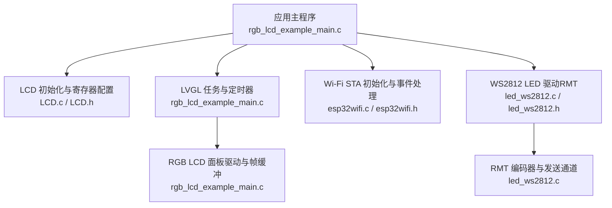
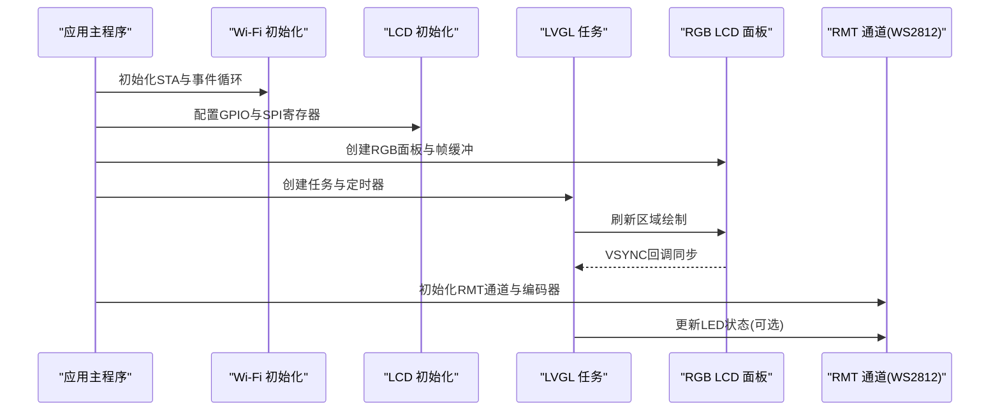
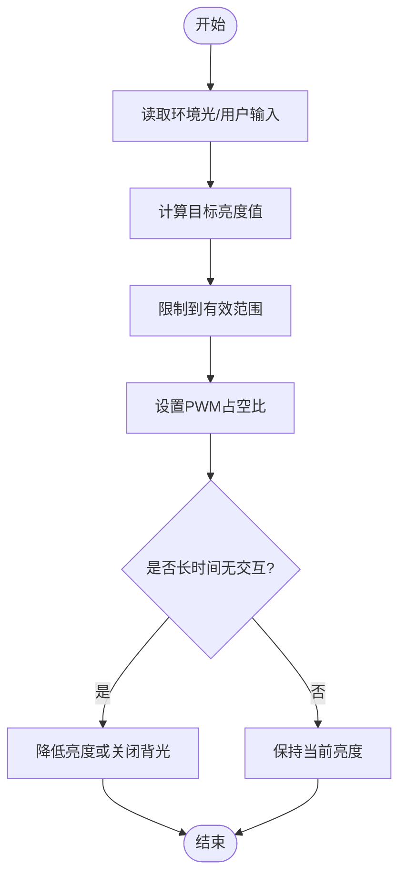
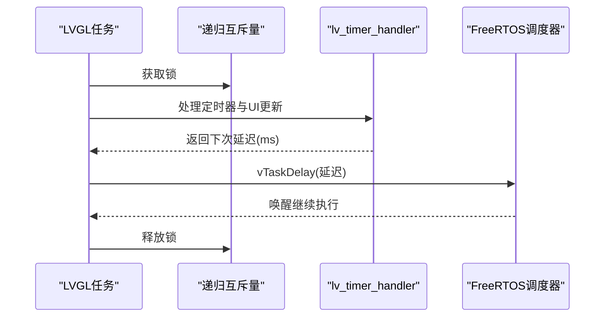
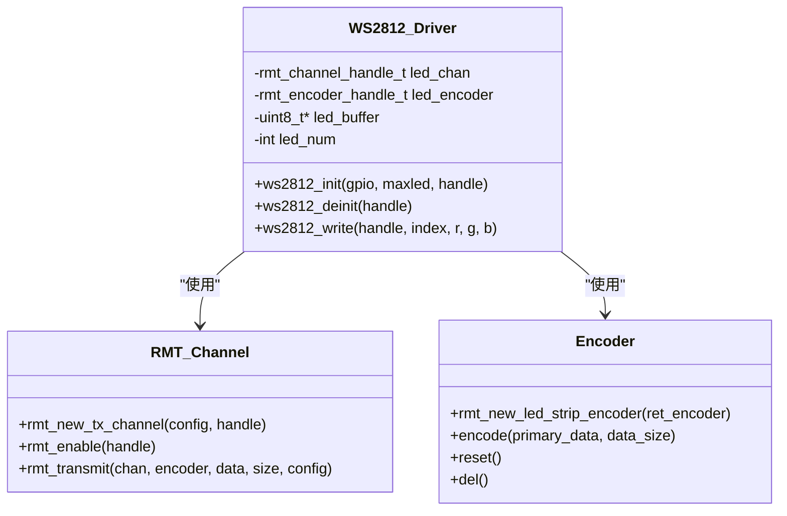
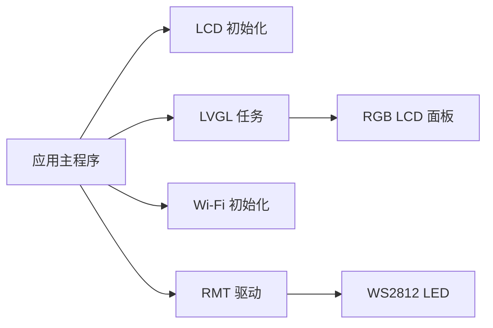

# 功耗管理优化

<cite>
**本文引用的文件**   
- [rgb_lcd_example_main.c](file://ESP32开发板/TK021F2699_ESP32_LVGL_GIF_LED/TK021F2699_ESP32_LVGL_GIF_LED/main/rgb_lcd_example_main.c)
- [LCD.c](file://ESP32开发板/TK021F2699_ESP32_LVGL_GIF_LED/TK021F2699_ESP32_LVGL_GIF_LED/main/LCD.c)
- [LCD.h](file://ESP32开发板/TK021F2699_ESP32_LVGL_GIF_LED/TK021F2699_ESP32_LVGL_GIF_LED/main/LCD.h)
- [esp32wifi.c](file://ESP32开发板/TK021F2699_ESP32_LVGL_GIF_LED/TK021F2699_ESP32_LVGL_GIF_LED/main/wifi/esp32wifi.c)
- [esp32wifi.h](file://ESP32开发板/TK021F2699_ESP32_LVGL_GIF_LED/TK021F2699_ESP32_LVGL_GIF_LED/main/wifi/esp32wifi.h)
- [led_ws2812.c](file://ESP32开发板/TK021F2699_ESP32_LVGL_GIF_LED/TK021F2699_ESP32_LVGL_GIF_LED/main/led_ws2812/led_ws2812.c)
- [led_ws2812.h](file://ESP32开发板/TK021F2699_ESP32_LVGL_GIF_LED/TK021F2699_ESP32_LVGL_GIF_LED/main/led_ws2812/led_ws2812.h)
</cite>

## 目录
1. [简介](#简介)
2. [项目结构](#项目结构)
3. [核心组件](#核心组件)
4. [架构总览](#架构总览)
5. [详细组件分析](#详细组件分析)
6. [依赖关系分析](#依赖关系分析)
7. [性能与功耗考量](#性能与功耗考量)
8. [故障排查指南](#故障排查指南)
9. [结论](#结论)
10. [附录](#附录)

## 简介
本技术文档围绕 ESP32-S3 平台的功耗管理优化展开，结合工程中的 LCD、Wi-Fi、RMT（WS2812）等模块实现，系统阐述：
- ESP32-S3 低功耗模式与睡眠状态配置思路
- LCD 背光控制策略与亮度调节算法
- 任务调度对功耗的影响及优化方法
- 外设模块（Wi-Fi、RMT 等）的电源管理与功耗控制
- 功耗测量与分析工具使用方法
- 电池供电设备的功耗优化最佳实践

## 项目结构
本项目为基于 ESP-IDF 的应用示例，包含 LVGL 图形界面、RGB LCD 驱动、Wi-Fi STA 初始化与事件处理、以及基于 RMT 的 WS2812 LED 驱动。关键入口位于应用主函数中，负责初始化 Wi-Fi、LCD、LVGL 任务与定时器，并注册 VSYNC 回调以同步显示刷新。

图示来源
- [rgb_lcd_example_main.c:150-303](file://ESP32开发板/TK021F2699_ESP32_LVGL_GIF_LED/TK021F2699_ESP32_LVGL_GIF_LED/main/rgb_lcd_example_main.c#L150-L303)
- [LCD.c:186-219](file://ESP32开发板/TK021F2699_ESP32_LVGL_GIF_LED/TK021F2699_ESP32_LVGL_GIF_LED/main/LCD.c#L186-L219)
- [LCD.h:12-26](file://ESP32开发板/TK021F2699_ESP32_LVGL_GIF_LED/TK021F2699_ESP32_LVGL_GIF_LED/main/LCD.h#L12-L26)
- [esp32wifi.c:46-95](file://ESP32开发板/TK021F2699_ESP32_LVGL_GIF_LED/TK021F2699_ESP32_LVGL_GIF_LED/main/wifi/esp32wifi.c#L46-L95)
- [led_ws2812.c:179-213](file://ESP32开发板/TK021F2699_ESP32_LVGL_GIF_LED/TK021F2699_ESP32_LVGL_GIF_LED/main/led_ws2812/led_ws2812.c#L179-L213)

章节来源
- [rgb_lcd_example_main.c:150-303](file://ESP32开发板/TK021F2699_ESP32_LVGL_GIF_LED/TK021F2699_ESP32_LVGL_GIF_LED/main/rgb_lcd_example_main.c#L150-L303)
- [LCD.c:186-219](file://ESP32开发板/TK021F2699_ESP32_LVGL_GIF_LED/TK021F2699_ESP32_LVGL_GIF_LED/main/LCD.c#L186-L219)
- [esp32wifi.c:46-95](file://ESP32开发板/TK021F2699_ESP32_LVGL_GIF_LED/TK021F2699_ESP32_LVGL_GIF_LED/main/wifi/esp32wifi.c#L46-L95)
- [led_ws2812.c:179-213](file://ESP32开发板/TK021F2699_ESP32_LVGL_GIF_LED/TK021F2699_ESP32_LVGL_GIF_LED/main/led_ws2812/led_ws2812.c#L179-L213)

## 核心组件
- 应用主流程与任务调度：初始化 Wi-Fi、LCD、LVGL 任务与定时器，注册 VSYNC 回调，完成显示刷新与 UI 渲染。
- LCD 初始化与 SPI 寄存器配置：通过 GPIO 模拟 SPI 写入 LCD 控制器寄存器，完成面板初始化。
- Wi-Fi STA 初始化与事件处理：创建默认网络接口、注册事件回调、设置 SSID/密码并启动连接。
- WS2812 LED 驱动（RMT）：使用 RMT 通道与自定义编码器生成精确时序，传输 GRB 数据。

章节来源
- [rgb_lcd_example_main.c:150-303](file://ESP32开发板/TK021F2699_ESP32_LVGL_GIF_LED/TK021F2699_ESP32_LVGL_GIF_LED/main/rgb_lcd_example_main.c#L150-L303)
- [LCD.c:186-219](file://ESP32开发板/TK021F2699_ESP32_LVGL_GIF_LED/TK021F2699_ESP32_LVGL_GIF_LED/main/LCD.c#L186-L219)
- [esp32wifi.c:46-95](file://ESP32开发板/TK021F2699_ESP32_LVGL_GIF_LED/TK021F2699_ESP32_LVGL_GIF_LED/main/wifi/esp32wifi.c#L46-L95)
- [led_ws2812.c:179-213](file://ESP32开发板/TK021F2699_ESP32_LVGL_GIF_LED/TK021F2699_ESP32_LVGL_GIF_LED/main/led_ws2812/led_ws2812.c#L179-L213)

## 架构总览
下图展示应用主流程与各子系统交互关系，包括显示刷新、LVGL 任务、VSYNC 同步、Wi-Fi 事件与 RMT 数据传输路径。

图示来源
- [rgb_lcd_example_main.c:150-303](file://ESP32开发板/TK021F2699_ESP32_LVGL_GIF_LED/TK021F2699_ESP32_LVGL_GIF_LED/main/rgb_lcd_example_main.c#L150-L303)
- [esp32wifi.c:46-95](file://ESP32开发板/TK021F2699_ESP32_LVGL_GIF_LED/TK021F2699_ESP32_LVGL_GIF_LED/main/wifi/esp32wifi.c#L46-L95)
- [led_ws2812.c:179-213](file://ESP32开发板/TK021F2699_ESP32_LVGL_GIF_LED/TK021F2699_ESP32_LVGL_GIF_LED/main/led_ws2812/led_ws2812.c#L179-L213)

## 详细组件分析

### ESP32-S3 低功耗模式与睡眠状态配置
- 目标与原则
  - 在空闲或等待事件时进入深度睡眠或轻睡眠，降低 CPU 与外设功耗。
  - 合理设置唤醒源（如 GPIO、RTC 定时器、外部中断），避免频繁唤醒导致“抖动功耗”。
- 在本工程中的切入点
  - 应用主流程中可加入睡眠策略：当无 UI 更新且无网络活动时，关闭非必要外设（如 Wi-Fi、RMT），进入睡眠；由定时器或按键唤醒后恢复。
  - 注意 LVGL 任务与定时器的休眠协调：确保唤醒后能正确恢复 tick 与任务调度。
- 建议实现要点
  - 使用 RTC 定时器作为周期性唤醒源，周期根据业务需求设定（例如 100ms~1s）。
  - 在进入睡眠前保存必要上下文（如 LVGL 状态、Wi-Fi 连接信息），退出后快速恢复。
  - 将高功耗外设（Wi-Fi、RMT）在睡眠前禁用，唤醒后再按需启用。

章节来源
- [rgb_lcd_example_main.c:150-303](file://ESP32开发板/TK021F2699_ESP32_LVGL_GIF_LED/TK021F2699_ESP32_LVGL_GIF_LED/main/rgb_lcd_example_main.c#L150-L303)

### LCD 背光控制策略与亮度调节算法
- 当前实现现状
  - 工程中定义了背光引脚常量与电平极性，并在初始化阶段进行开/关控制。
  - 未在当前代码中发现 PWM 或 DAC 驱动的亮度调节逻辑。
- 推荐策略
  - 使用 PWM 控制背光引脚，实现平滑亮度调节。
  - 采用自适应亮度算法：依据环境光传感器（若存在）或用户输入动态调整占空比。
  - 在无显示内容或长时间无交互时自动降低亮度或关闭背光。
- 算法流程示意

章节来源
- [rgb_lcd_example_main.c:29-32](file://ESP32开发板/TK021F2699_ESP32_LVGL_GIF_LED/TK021F2699_ESP32_LVGL_GIF_LED/main/rgb_lcd_example_main.c#L29-L32)
- [rgb_lcd_example_main.c:168-175](file://ESP32开发板/TK021F2699_ESP32_LVGL_GIF_LED/TK021F2699_ESP32_LVGL_GIF_LED/main/rgb_lcd_example_main.c#L168-L175)
- [rgb_lcd_example_main.c:241-244](file://ESP32开发板/TK021F2699_ESP32_LVGL_GIF_LED/TK021F2699_ESP32_LVGL_GIF_LED/main/rgb_lcd_example_main.c#L241-L244)

### 任务调度对功耗的影响与优化
- 当前实现
  - LVGL 任务周期性运行，调用 lv_timer_handler() 并根据返回延迟进行 vTaskDelay()。
  - 使用递归互斥量保护 LVGL API 调用，避免多线程竞争。
- 功耗影响
  - 过高的任务频率会增加 CPU 活跃时间，提升功耗。
  - 频繁的唤醒与切换也会带来额外开销。
- 优化建议
  - 根据屏幕刷新率与 UI 活动情况动态调整任务延迟上限与下限。
  - 在无 UI 更新时延长任务间隔，减少 CPU 占用。
  - 利用 VSYNC 回调进行同步，避免撕裂的同时减少不必要的刷新。

图示来源
- [rgb_lcd_example_main.c:130-148](file://ESP32开发板/TK021F2699_ESP32_LVGL_GIF_LED/TK021F2699_ESP32_LVGL_GIF_LED/main/rgb_lcd_example_main.c#L130-L148)
- [rgb_lcd_example_main.c:117-128](file://ESP32开发板/TK021F2699_ESP32_LVGL_GIF_LED/TK021F2699_ESP32_LVGL_GIF_LED/main/rgb_lcd_example_main.c#L117-L128)

章节来源
- [rgb_lcd_example_main.c:130-148](file://ESP32开发板/TK021F2699_ESP32_LVGL_GIF_LED/TK021F2699_ESP32_LVGL_GIF_LED/main/rgb_lcd_example_main.c#L130-L148)
- [rgb_lcd_example_main.c:117-128](file://ESP32开发板/TK021F2699_ESP32_LVGL_GIF_LED/TK021F2699_ESP32_LVGL_GIF_LED/main/rgb_lcd_example_main.c#L117-L128)

### 外设模块电源管理：Wi-Fi 与 RMT
- Wi-Fi 模块
  - 当前实现：初始化 STA 模式、注册事件回调、设置 SSID/密码并启动连接。
  - 功耗优化：
    - 在非通信时段关闭 Wi-Fi（esp_wifi_stop），需要时再启动。
    - 使用事件驱动而非轮询，减少 CPU 占用。
    - 合理设置重连策略与退避时间，避免频繁重连带来的功耗峰值。
- RMT 模块（WS2812）
  - 当前实现：创建 RMT 发送通道与自定义编码器，按 WS2812 时序发送 GRB 数据。
  - 功耗优化：
    - 仅在需要更新 LED 时启用 RMT 通道，完成后禁用或进入低功率状态。
    - 批量更新以减少多次传输的开销。
    - 合理设置内存块大小与队列深度，平衡吞吐与功耗。

图示来源
- [led_ws2812.c:179-213](file://ESP32开发板/TK021F2699_ESP32_LVGL_GIF_LED/TK021F2699_ESP32_LVGL_GIF_LED/main/led_ws2812/led_ws2812.c#L179-L213)
- [led_ws2812.c:113-171](file://ESP32开发板/TK021F2699_ESP32_LVGL_GIF_LED/TK021F2699_ESP32_LVGL_GIF_LED/main/led_ws2812/led_ws2812.c#L113-L171)
- [led_ws2812.c:236-250](file://ESP32开发板/TK021F2699_ESP32_LVGL_GIF_LED/TK021F2699_ESP32_LVGL_GIF_LED/main/led_ws2812/led_ws2812.c#L236-L250)

章节来源
- [esp32wifi.c:46-95](file://ESP32开发板/TK021F2699_ESP32_LVGL_GIF_LED/TK021F2699_ESP32_LVGL_GIF_LED/main/wifi/esp32wifi.c#L46-L95)
- [led_ws2812.c:179-213](file://ESP32开发板/TK021F2699_ESP32_LVGL_GIF_LED/TK021F2699_ESP32_LVGL_GIF_LED/main/led_ws2812/led_ws2812.c#L179-L213)
- [led_ws2812.c:113-171](file://ESP32开发板/TK021F2699_ESP32_LVGL_GIF_LED/TK021F2699_ESP32_LVGL_GIF_LED/main/led_ws2812/led_ws2812.c#L113-L171)
- [led_ws2812.c:236-250](file://ESP32开发板/TK021F2699_ESP32_LVGL_GIF_LED/TK021F2699_ESP32_LVGL_GIF_LED/main/led_ws2812/led_ws2812.c#L236-L250)

### 功耗测量与分析工具使用方法
- 硬件测量
  - 使用高精度电流表或电源监测模块串联供电回路，记录平均电流与瞬态峰值。
  - 关注不同工作模式下的电流曲线：待机、UI 渲染、Wi-Fi 收发、LED 更新。
- 软件辅助
  - 使用 FreeRTOS 任务统计与 esp_timer 统计各模块运行时间与唤醒次数。
  - 在关键路径添加日志标记，结合功耗曲线定位高功耗热点。
- 分析方法
  - 分段测量：将设备行为划分为若干阶段，分别测量各阶段功耗。
  - 对比优化前后差异，验证策略有效性。

[本节为通用指导，不直接分析具体文件]

### 电池供电设备的功耗优化最佳实践
- 任务与事件驱动：尽量使用事件与中断唤醒，避免忙轮询。
- 外设生命周期管理：按需启用/禁用高功耗外设（Wi-Fi、RMT、LCD 背光）。
- 显示优化：降低刷新率、减少无效绘制、使用双缓冲与全刷新模式减少撕裂与重复刷新。
- 网络优化：批量传输、压缩数据、合理设置心跳与重连策略。
- 电源域与时钟：选择合适的时钟源与分频，降低 CPU 频率在非高峰期的功耗。
- 休眠策略：在空闲期进入深度睡眠，使用 RTC 定时器或 GPIO 中断唤醒。

[本节为通用指导，不直接分析具体文件]

## 依赖关系分析
- 应用主程序依赖：
  - LCD 初始化与 SPI 寄存器配置（LCD.c / LCD.h）
  - LVGL 任务与定时器（rgb_lcd_example_main.c）
  - Wi-Fi 初始化与事件处理（esp32wifi.c / esp32wifi.h）
  - WS2812 LED 驱动（led_ws2812.c / led_ws2812.h）
- 子系统间耦合：
  - LVGL 任务与 RGB LCD 面板通过 flush 回调与 VSYNC 事件同步。
  - Wi-Fi 事件回调独立于显示与 LED 控制，但可在业务层联动（如网络事件触发 UI 更新）。
  - RMT 驱动与 LED 更新可由 UI 或业务逻辑触发。

图示来源
- [rgb_lcd_example_main.c:150-303](file://ESP32开发板/TK021F2699_ESP32_LVGL_GIF_LED/TK021F2699_ESP32_LVGL_GIF_LED/main/rgb_lcd_example_main.c#L150-L303)
- [LCD.c:186-219](file://ESP32开发板/TK021F2699_ESP32_LVGL_GIF_LED/TK021F2699_ESP32_LVGL_GIF_LED/main/LCD.c#L186-L219)
- [esp32wifi.c:46-95](file://ESP32开发板/TK021F2699_ESP32_LVGL_GIF_LED/TK021F2699_ESP32_LVGL_GIF_LED/main/wifi/esp32wifi.c#L46-L95)
- [led_ws2812.c:179-213](file://ESP32开发板/TK021F2699_ESP32_LVGL_GIF_LED/TK021F2699_ESP32_LVGL_GIF_LED/main/led_ws2812/led_ws2812.c#L179-L213)

章节来源
- [rgb_lcd_example_main.c:150-303](file://ESP32开发板/TK021F2699_ESP32_LVGL_GIF_LED/TK021F2699_ESP32_LVGL_GIF_LED/main/rgb_lcd_example_main.c#L150-L303)
- [LCD.c:186-219](file://ESP32开发板/TK021F2699_ESP32_LVGL_GIF_LED/TK021F2699_ESP32_LVGL_GIF_LED/main/LCD.c#L186-L219)
- [esp32wifi.c:46-95](file://ESP32开发板/TK021F2699_ESP32_LVGL_GIF_LED/TK021F2699_ESP32_LVGL_GIF_LED/main/wifi/esp32wifi.c#L46-L95)
- [led_ws2812.c:179-213](file://ESP32开发板/TK021F2699_ESP32_LVGL_GIF_LED/TK021F2699_ESP32_LVGL_GIF_LED/main/led_ws2812/led_ws2812.c#L179-L213)

## 性能与功耗考量
- 显示刷新与内存布局
  - 使用 PSRAM 分配帧缓冲可降低内部 SRAM 压力，但需注意访问延迟与功耗。
  - 全刷新模式可减少撕裂，但可能增加带宽与功耗，需权衡。
- 任务调度与延迟
  - 合理设置 LVGL 任务的最大/最小延迟，避免过高频率导致的 CPU 活跃时间增加。
- 外设使用策略
  - Wi-Fi 仅在需要时启用，避免常驻高功耗状态。
  - RMT 批量更新与及时禁用通道，减少空闲功耗。

[本节为通用指导，不直接分析具体文件]

## 故障排查指南
- Wi-Fi 连接问题
  - 检查事件回调是否正确注册与处理（WIFI_EVENT、IP_EVENT）。
  - 确认 SSID/密码配置与路由器兼容性。
- LCD 显示异常
  - 校验 SPI 时序与寄存器配置，确保 CS/DCLK/SDA 引脚正确。
  - 检查背光控制引脚电平与极性定义。
- WS2812 LED 无响应
  - 确认 RMT 通道分辨率与编码时序符合 WS2812 规范。
  - 检查数据顺序（GRB）与缓冲区长度。

章节来源
- [esp32wifi.c:14-43](file://ESP32开发板/TK021F2699_ESP32_LVGL_GIF_LED/TK021F2699_ESP32_LVGL_GIF_LED/main/wifi/esp32wifi.c#L14-L43)
- [LCD.c:51-83](file://ESP32开发板/TK021F2699_ESP32_LVGL_GIF_LED/TK021F2699_ESP32_LVGL_GIF_LED/main/LCD.c#L51-L83)
- [led_ws2812.c:236-250](file://ESP32开发板/TK021F2699_ESP32_LVGL_GIF_LED/TK021F2699_ESP32_LVGL_GIF_LED/main/led_ws2812/led_ws2812.c#L236-L250)

## 结论
通过对应用主流程、LCD 初始化、Wi-Fi 事件处理与 RMT 驱动的深入分析，明确了在 ESP32-S3 平台上的功耗优化关键点：合理配置低功耗模式、优化任务调度与显示刷新、按需管理外设生命周期，并结合准确的功耗测量工具进行验证与迭代。建议在项目中引入自适应亮度与休眠策略，进一步提升电池供电设备的续航表现。

[本节为总结性内容，不直接分析具体文件]

## 附录
- 相关常量与宏定义参考
  - 背光控制引脚与电平极性定义
  - LVGL 任务优先级与栈大小
  - RMT 通道分辨率与内存块大小

章节来源
- [rgb_lcd_example_main.c:29-32](file://ESP32开发板/TK021F2699_ESP32_LVGL_GIF_LED/TK021F2699_ESP32_LVGL_GIF_LED/main/rgb_lcd_example_main.c#L29-L32)
- [rgb_lcd_example_main.c:66-71](file://ESP32开发板/TK021F2699_ESP32_LVGL_GIF_LED/TK021F2699_ESP32_LVGL_GIF_LED/main/rgb_lcd_example_main.c#L66-L71)
- [led_ws2812.c:13-14](file://ESP32开发板/TK021F2699_ESP32_LVGL_GIF_LED/TK021F2699_ESP32_LVGL_GIF_LED/main/led_ws2812/led_ws2812.c#L13-L14)