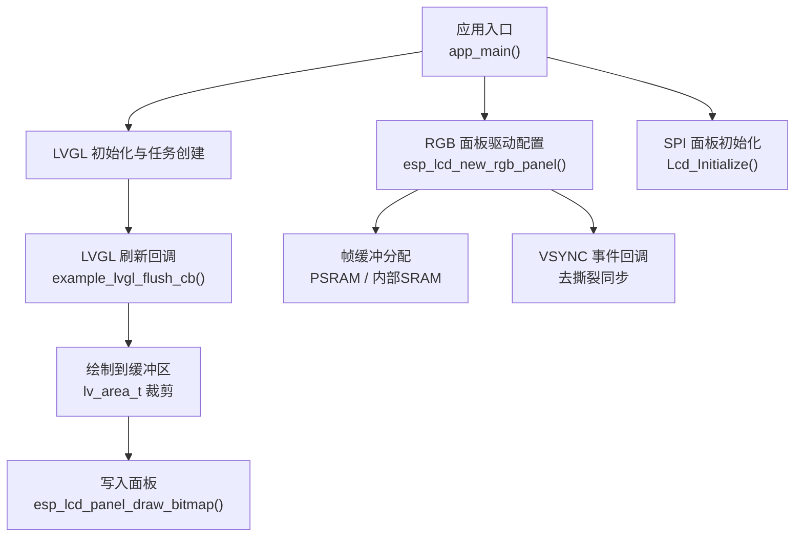
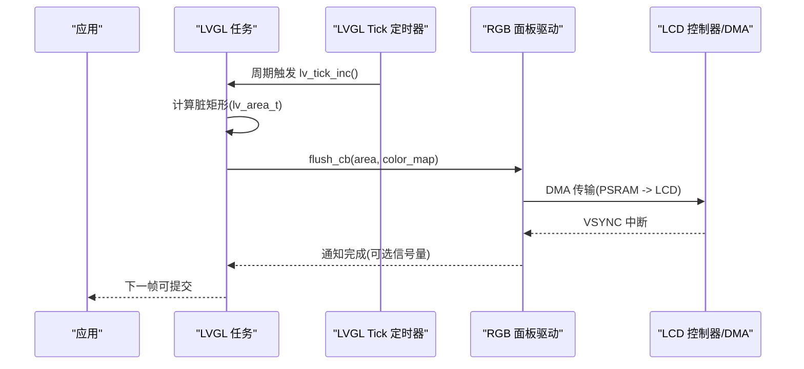
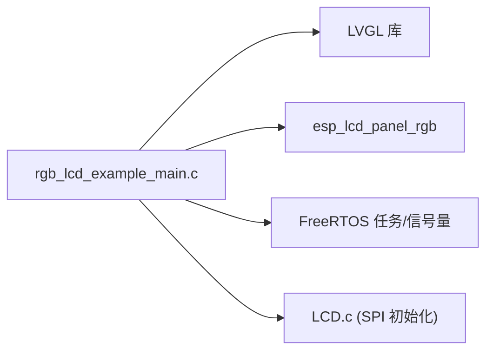

# 性能优化

<cite>
**本文引用的文件**   
- [rgb_lcd_example_main.c](file://ESP32开发板/TK021F2699_ESP32_LVGL_GIF_LED/TK021F2699_ESP32_LVGL_GIF_LED/main/rgb_lcd_example_main.c)
- [LCD.c](file://ESP32开发板/TK021F2699_ESP32_LVGL_GIF_LED/TK021F2699_ESP32_LVGL_GIF_LED/main/LCD.c)
- [LCD.h](file://ESP32开发板/TK021F2699_ESP32_LVGL_GIF_LED/TK021F2699_ESP32_LVGL_GIF_LED/main/LCD.h)
- [sdkconfig.defaults](file://ESP32开发板/TK021F2699_ESP32_LVGL_GIF_LED/TK021F2699_ESP32_LVGL_GIF_LED/sdkconfig.defaults)
- [sdkconfig.defaults.esp32s3](file://ESP32开发板/TK021F2699_ESP32_LVGL_GIF_LED/TK021F2699_ESP32_LVGL_GIF_LED/sdkconfig.defaults.esp32s3)
- [README.md](file://ESP32开发板/TK021F2699_ESP32_LVGL_GIF_LED/TK021F2699_ESP32_LVGL_GIF_LED/README.md)
</cite>

## 目录
1. [简介](#简介)
2. [项目结构](#项目结构)
3. [核心组件](#核心组件)
4. [架构总览](#架构总览)
5. [详细组件分析](#详细组件分析)
6. [依赖分析](#依赖分析)
7. [性能考虑](#性能考虑)
8. [故障排查指南](#故障排查指南)
9. [结论](#结论)
10. [附录](#附录)

## 简介
本技术文档面向在 ESP32-S3 平台上基于 LVGL 与 RGB LCD 的图形应用，聚焦于系统级性能优化。内容覆盖内存管理（PSRAM、堆栈分配、内存泄漏检测）、渲染性能（帧缓冲、绘制区域裁剪、批量操作）、功耗管理与低功耗模式、CPU 使用率分析与热点识别、I/O 性能（SPI 总线、DMA 传输、中断处理）、实时性与任务调度优化，以及性能监控工具与调试方法。同时给出不同硬件配置下的调优策略与权衡建议。

## 项目结构
本项目包含两个主要显示路径：
- RGB 并行接口路径：通过 ESP-IDF 的 esp_lcd_panel_rgb 驱动，配合 LVGL 完成高性能刷新。
- SPI 串行初始化路径：用于面板寄存器初始化（部分屏需要），采用 GPIO 模拟时序。

图表来源
- [rgb_lcd_example_main.c:150-303](file://ESP32开发板/TK021F2699_ESP32_LVGL_GIF_LED/TK021F2699_ESP32_LVGL_GIF_LED/main/rgb_lcd_example_main.c#L150-L303)
- [LCD.c:205-219](file://ESP32开发板/TK021F2699_ESP32_LVGL_GIF_LED/TK021F2699_ESP32_LVGL_GIF_LED/main/LCD.c#L205-L219)

章节来源
- [rgb_lcd_example_main.c:150-303](file://ESP32开发板/TK021F2699_ESP32_LVGL_GIF_LED/TK021F2699_ESP32_LVGL_GIF_LED/main/rgb_lcd_example_main.c#L150-L303)
- [LCD.c:205-219](file://ESP32开发板/TK021F2699_ESP32_LVGL_GIF_LED/TK021F2699_ESP32_LVGL_GIF_LED/main/LCD.c#L205-L219)

## 核心组件
- LVGL 任务与定时器：周期性调用 lv_timer_handler()，并通过 esp_timer 提供 tick。
- RGB 面板驱动：配置像素时钟、时序、数据位宽、帧缓冲位置（PSRAM）等。
- VSYNC 同步机制：可选信号量同步，避免撕裂。
- 绘制刷新回调：将 LVGL 绘制的矩形区域提交给面板驱动进行 DMA 传输。
- SPI 面板初始化：GPIO 模拟 3 线串行协议，按表写入面板寄存器。

章节来源
- [rgb_lcd_example_main.c:111-148](file://ESP32开发板/TK021F2699_ESP32_LVGL_GIF_LED/TK021F2699_ESP32_LVGL_GIF_LED/main/rgb_lcd_example_main.c#L111-L148)
- [rgb_lcd_example_main.c:182-229](file://ESP32开发板/TK021F2699_ESP32_LVGL_GIF_LED/TK021F2699_ESP32_LVGL_GIF_LED/main/rgb_lcd_example_main.c#L182-L229)
- [rgb_lcd_example_main.c:246-288](file://ESP32开发板/TK021F2699_ESP32_LVGL_GIF_LED/TK021F2699_ESP32_LVGL_GIF_LED/main/rgb_lcd_example_main.c#L246-L288)
- [LCD.c:186-204](file://ESP32开发板/TK021F2699_ESP32_LVGL_GIF_LED/TK021F2699_ESP32_LVGL_GIF_LED/main/LCD.c#L186-L204)

## 架构总览
下图展示从 LVGL 绘制到面板刷新的关键流程，包括 PSRAM 帧缓冲、DMA 传输与 VSYNC 同步。

图表来源
- [rgb_lcd_example_main.c:111-148](file://ESP32开发板/TK021F2699_ESP32_LVGL_GIF_LED/TK021F2699_ESP32_LVGL_GIF_LED/main/rgb_lcd_example_main.c#L111-L148)
- [rgb_lcd_example_main.c:95-109](file://ESP32开发板/TK021F2699_ESP32_LVGL_GIF_LED/TK021F2699_ESP32_LVGL_GIF_LED/main/rgb_lcd_example_main.c#L95-L109)
- [rgb_lcd_example_main.c:84-93](file://ESP32开发板/TK021F2699_ESP32_LVGL_GIF_LED/TK021F2699_ESP32_LVGL_GIF_LED/main/rgb_lcd_example_main.c#L84-L93)

## 详细组件分析

### 内存管理与 PSRAM 使用
- 帧缓冲位置选择
  - 双缓冲模式：直接从 RGB 面板驱动获取两块帧缓冲，通常位于 PSRAM，减少拷贝开销。
  - 单缓冲 + PSRAM：为 LVGL 单独分配 PSRAM 作为绘制缓冲。
  - 回弹缓冲（Bounce Buffer）：启用后，LCD 控制器从内部 SRAM 取数，需 CPU 协助搬运，提升稳定性但增加 CPU 占用。
- PSRAM 对齐与访问优化
  - 设置 psram_trans_align 以匹配 DMA 对齐要求。
  - 开启 SPIRAM_FETCH_INSTRUCTIONS 与 SPIRAM_RODATA，有助于提高 PCLK 频率与指令/常量读取效率。
- 内存分配策略
  - 优先使用 heap_caps_malloc(MALLOC_CAP_SPIRAM) 为大对象分配 PSRAM。
  - 控制 LVGL 内存池大小，避免频繁动态分配。
- 内存泄漏检测
  - 启用 LV_USE_PERF_MONITOR 以便运行时观察内存与性能指标。
  - 结合 ESP-IDF 的 heap profiler 与 FreeRTOS 堆统计定位泄漏。

章节来源
- [rgb_lcd_example_main.c:249-261](file://ESP32开发板/TK021F2699_ESP32_LVGL_GIF_LED/TK021F2699_ESP32_LVGL_GIF_LED/main/rgb_lcd_example_main.c#L249-L261)
- [rgb_lcd_example_main.c:182-188](file://ESP32开发板/TK021F2699_ESP32_LVGL_GIF_LED/TK021F2699_ESP32_LVGL_GIF_LED/main/rgb_lcd_example_main.c#L182-L188)
- [rgb_lcd_example_main.c:226-228](file://ESP32开发板/TK021F2699_ESP32_LVGL_GIF_LED/TK021F2699_ESP32_LVGL_GIF_LED/main/rgb_lcd_example_main.c#L226-L228)
- [sdkconfig.defaults:1-6](file://ESP32开发板/TK021F2699_ESP32_LVGL_GIF_LED/TK021F2699_ESP32_LVGL_GIF_LED/sdkconfig.defaults#L1-L6)
- [sdkconfig.defaults.esp32s3:1-9](file://ESP32开发板/TK021F2699_ESP32_LVGL_GIF_LED/TK021F2699_ESP32_LVGL_GIF_LED/sdkconfig.defaults.esp32s3#L1-L9)
- [README.md:115](file://ESP32开发板/TK021F2699_ESP32_LVGL_GIF_LED/TK021F2699_ESP32_LVGL_GIF_LED/README.md#L115)

### 渲染性能优化
- 帧缓冲管理
  - 双缓冲：适合全屏刷新或复杂动画，降低撕裂风险；需更大内存。
  - 单缓冲 + 局部刷新：利用 LVGL 的脏矩形裁剪，仅更新变化区域。
- 绘制区域裁剪
  - LVGL 自动计算 area 并传入 flush_cb，确保只传输必要像素。
- 批量操作
  - 合并相邻脏矩形，减少多次 draw_bitmap 调用。
  - 使用半透明或纯色填充时，尽量批量绘制以减少状态切换。
- 像素格式与时序
  - 使用 RGB565 16bit 并行，合理设置 pclk_hz 与前后肩参数，避免过高的 PCLK 导致不稳定。

章节来源
- [rgb_lcd_example_main.c:95-109](file://ESP32开发板/TK021F2699_ESP32_LVGL_GIF_LED/TK021F2699_ESP32_LVGL_GIF_LED/main/rgb_lcd_example_main.c#L95-L109)
- [rgb_lcd_example_main.c:213-226](file://ESP32开发板/TK021F2699_ESP32_LVGL_GIF_LED/TK021F2699_ESP32_LVGL_GIF_LED/main/rgb_lcd_example_main.c#L213-L226)

### 功耗管理与低功耗模式
- 背光控制
  - 根据场景调节背光亮度或关闭，显著降低功耗。
- 电源与时钟
  - 调整 CPU 频率与外设时钟，平衡性能与功耗。
- 休眠与唤醒
  - 在无交互时进入深度睡眠，由外部事件或定时器唤醒。
- 显示相关
  - 降低刷新率或禁用不必要的动画，减少 DMA 与 CPU 活动。

[本节为通用指导，不直接分析具体文件]

### CPU 使用率分析与热点识别
- 使用 LVGL 性能监控
  - 启用 LV_USE_PERF_MONITOR，观察 FPS、CPU 占用、内存使用。
- 任务与定时器
  - 评估 LVGL 任务优先级与延时策略，避免阻塞其他任务。
- 热点定位
  - 使用 ESP-IDF Profiler 与 perf 工具，识别高 CPU 占用的函数。
  - 关注图像解码、字体渲染、复杂动画路径。

章节来源
- [sdkconfig.defaults:5](file://ESP32开发板/TK021F2699_ESP32_LVGL_GIF_LED/TK021F2699_ESP32_LVGL_GIF_LED/sdkconfig.defaults#L5)
- [rgb_lcd_example_main.c:130-148](file://ESP32开发板/TK021F2699_ESP32_LVGL_GIF_LED/TK021F2699_ESP32_LVGL_GIF_LED/main/rgb_lcd_example_main.c#L130-L148)

### I/O 性能优化（SPI、DMA、中断）
- SPI 面板初始化
  - 当前实现使用 GPIO 模拟 3 线串行，适合一次性初始化，不适合高频数据传输。
  - 若需高速 SPI 传输，应改用 ESP-IDF 的 SPI 主机驱动与 DMA。
- DMA 传输
  - RGB 面板驱动内部使用 DMA 将 PSRAM 数据搬运至 LCD，减少 CPU 参与。
  - 注意 PSRAM 对齐与缓存一致性。
- 中断处理
  - VSYNC 中断用于同步，避免撕裂；在中断中只做轻量操作（如释放信号量）。

章节来源
- [LCD.c:51-83](file://ESP32开发板/TK021F2699_ESP32_LVGL_GIF_LED/TK021F2699_ESP32_LVGL_GIF_LED/main/LCD.c#L51-L83)
- [rgb_lcd_example_main.c:84-93](file://ESP32开发板/TK021F2699_ESP32_LVGL_GIF_LED/TK021F2699_ESP32_LVGL_GIF_LED/main/rgb_lcd_example_main.c#L84-L93)
- [rgb_lcd_example_main.c:95-109](file://ESP32开发板/TK021F2699_ESP32_LVGL_GIF_LED/TK021F2699_ESP32_LVGL_GIF_LED/main/rgb_lcd_example_main.c#L95-L109)

### 实时性保证与任务调度优化
- LVGL 任务
  - 使用递归互斥保护 LVGL API 调用，避免重入问题。
  - 根据 lv_timer_handler() 返回的延迟动态调整 vTaskDelay，平衡响应与功耗。
- VSYNC 同步
  - 可选信号量同步，确保仅在 VSYNC 期间提交新帧，避免撕裂。
- 优先级与资源竞争
  - 合理设置 LVGL 任务优先级，避免与 Wi-Fi、音频等高负载任务冲突。

章节来源
- [rgb_lcd_example_main.c:117-128](file://ESP32开发板/TK021F2699_ESP32_LVGL_GIF_LED/TK021F2699_ESP32_LVGL_GIF_LED/main/rgb_lcd_example_main.c#L117-L128)
- [rgb_lcd_example_main.c:130-148](file://ESP32开发板/TK021F2699_ESP32_LVGL_GIF_LED/TK021F2699_ESP32_LVGL_GIF_LED/main/rgb_lcd_example_main.c#L130-L148)
- [rgb_lcd_example_main.c:76-93](file://ESP32开发板/TK021F2699_ESP32_LVGL_GIF_LED/TK021F2699_ESP32_LVGL_GIF_LED/main/rgb_lcd_example_main.c#L76-L93)

### 性能监控工具与调试方法
- LVGL 性能监控
  - 启用 LV_USE_PERF_MONITOR，查看 FPS、CPU、内存曲线。
- ESP-IDF 工具链
  - 使用 esp_timer 精确计时关键路径。
  - 使用 heap profiler 与 FreeRTOS 堆统计检查内存碎片与泄漏。
- 示波器与逻辑分析仪
  - 测量 PCLK、HSYNC、VSYNC 波形，验证时序与抖动。
- 日志与断点
  - 在 flush_cb 与 VSYNC 回调中添加日志，定位卡顿与丢帧。

章节来源
- [sdkconfig.defaults:5](file://ESP32开发板/TK021F2699_ESP32_LVGL_GIF_LED/TK021F2699_ESP32_LVGL_GIF_LED/sdkconfig.defaults#L5)
- [rgb_lcd_example_main.c:276-283](file://ESP32开发板/TK021F2699_ESP32_LVGL_GIF_LED/TK021F2699_ESP32_LVGL_GIF_LED/main/rgb_lcd_example_main.c#L276-L283)

### 不同硬件配置的调优策略
- 双缓冲 vs 单缓冲
  - 双缓冲：更稳定、更少撕裂，但占用更多 PSRAM。
  - 单缓冲：节省内存，需更精细的脏矩形管理。
- 回弹缓冲（Bounce Buffer）
  - 提升稳定性，但增加 CPU 占用；适用于对撕裂敏感的场景。
- PSRAM 模式与速度
  - 启用 OCT 模式与 80MHz 速度，提升带宽；必要时开启指令/常量预取。
- 像素时钟与时序
  - 根据屏幕规格调整 pclk_hz 与前/后肩、脉宽，避免过驱或不稳定。

章节来源
- [README.md:115](file://ESP32开发板/TK021F2699_ESP32_LVGL_GIF_LED/TK021F2699_ESP32_LVGL_GIF_LED/README.md#L115)
- [sdkconfig.defaults.esp32s3:1-9](file://ESP32开发板/TK021F2699_ESP32_LVGL_GIF_LED/TK021F2699_ESP32_LVGL_GIF_LED/sdkconfig.defaults.esp32s3#L1-L9)
- [rgb_lcd_example_main.c:213-226](file://ESP32开发板/TK021F2699_ESP32_LVGL_GIF_LED/TK021F2699_ESP32_LVGL_GIF_LED/main/rgb_lcd_example_main.c#L213-L226)

## 依赖分析
- 模块耦合
  - 应用入口依赖 LVGL、ESP-IDF LCD 驱动与 FreeRTOS。
  - SPI 初始化独立于 RGB 路径，仅用于面板寄存器配置。
- 外部依赖
  - ESP-IDF 的 esp_lcd_panel_rgb、esp_timer、driver/gpio。
  - LVGL 库及其配置头。
- 潜在循环依赖
  - 当前代码无循环依赖；LVGL 通过回调与面板驱动解耦。

图表来源
- [rgb_lcd_example_main.c:150-303](file://ESP32开发板/TK021F2699_ESP32_LVGL_GIF_LED/TK021F2699_ESP32_LVGL_GIF_LED/main/rgb_lcd_example_main.c#L150-L303)
- [LCD.c:205-219](file://ESP32开发板/TK021F2699_ESP32_LVGL_GIF_LED/TK021F2699_ESP32_LVGL_GIF_LED/main/LCD.c#L205-L219)

章节来源
- [rgb_lcd_example_main.c:150-303](file://ESP32开发板/TK021F2699_ESP32_LVGL_GIF_LED/TK021F2699_ESP32_LVGL_GIF_LED/main/rgb_lcd_example_main.c#L150-L303)
- [LCD.c:205-219](file://ESP32开发板/TK021F2699_ESP32_LVGL_GIF_LED/TK021F2699_ESP32_LVGL_GIF_LED/main/LCD.c#L205-L219)

## 性能考虑
- 内存
  - 优先使用 PSRAM 存放大帧缓冲；控制 LVGL 内存池大小，避免频繁分配。
- 渲染
  - 利用 LVGL 脏矩形裁剪；合并绘制命令；减少复杂样式与阴影。
- I/O
  - 使用 DMA 传输；避免在 VSYNC 中断中进行耗时操作。
- 功耗
  - 动态调节背光与刷新率；空闲时进入低功耗模式。
- 实时性
  - 合理设置 LVGL 任务优先级与延时；使用信号量同步避免撕裂。

[本节为通用指导，不直接分析具体文件]

## 故障排查指南
- 撕裂现象
  - 启用 VSYNC 同步信号量，确保仅在 VSYNC 期间提交新帧。
- 卡顿与掉帧
  - 检查 LVGL 任务延时策略；减少每帧绘制面积；避免在 flush_cb 中执行耗时操作。
- 内存不足
  - 增大 PSRAM 容量或减小分辨率/颜色深度；启用双缓冲时需评估内存占用。
- SPI 初始化失败
  - 检查 GPIO 映射与电平；确认面板寄存器序列正确；必要时延长延时。

章节来源
- [rgb_lcd_example_main.c:76-93](file://ESP32开发板/TK021F2699_ESP32_LVGL_GIF_LED/TK021F2699_ESP32_LVGL_GIF_LED/main/rgb_lcd_example_main.c#L76-L93)
- [rgb_lcd_example_main.c:130-148](file://ESP32开发板/TK021F2699_ESP32_LVGL_GIF_LED/TK021F2699_ESP32_LVGL_GIF_LED/main/rgb_lcd_example_main.c#L130-L148)
- [LCD.c:186-204](file://ESP32开发板/TK021F2699_ESP32_LVGL_GIF_LED/TK021F2699_ESP32_LVGL_GIF_LED/main/LCD.c#L186-L204)

## 结论
通过在 PSRAM 上合理分配帧缓冲、利用 LVGL 的脏矩形裁剪与 DMA 传输、结合 VSYNC 同步与任务调度优化，可在 ESP32-S3 平台上获得稳定且高效的图形性能。针对不同的硬件配置与应用需求，灵活选择双缓冲、回弹缓冲与 PSRAM 模式，并结合性能监控工具持续优化，是达成目标的关键。

[本节为总结，不直接分析具体文件]

## 附录
- 关键配置项速查
  - CONFIG_EXAMPLE_DOUBLE_FB：是否启用双缓冲。
  - CONFIG_EXAMPLE_USE_BOUNCE_BUFFER：是否启用回弹缓冲。
  - CONFIG_SPIRAM_MODE_OCT / CONFIG_SPIRAM_SPEED_80M：PSRAM 模式与速度。
  - CONFIG_LV_USE_PERF_MONITOR：启用 LVGL 性能监控。

章节来源
- [sdkconfig.defaults:1-6](file://ESP32开发板/TK021F2699_ESP32_LVGL_GIF_LED/TK021F2699_ESP32_LVGL_GIF_LED/sdkconfig.defaults#L1-L6)
- [sdkconfig.defaults.esp32s3:1-9](file://ESP32开发板/TK021F2699_ESP32_LVGL_GIF_LED/TK021F2699_ESP32_LVGL_GIF_LED/sdkconfig.defaults.esp32s3#L1-L9)
- [README.md:115](file://ESP32开发板/TK021F2699_ESP32_LVGL_GIF_LED/TK021F2699_ESP32_LVGL_GIF_LED/README.md#L115)