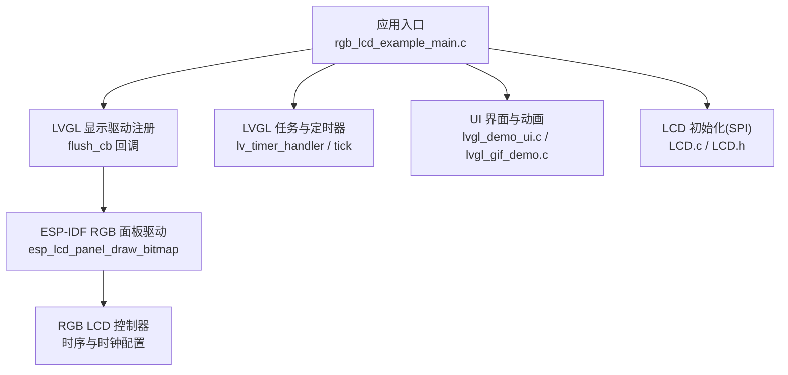
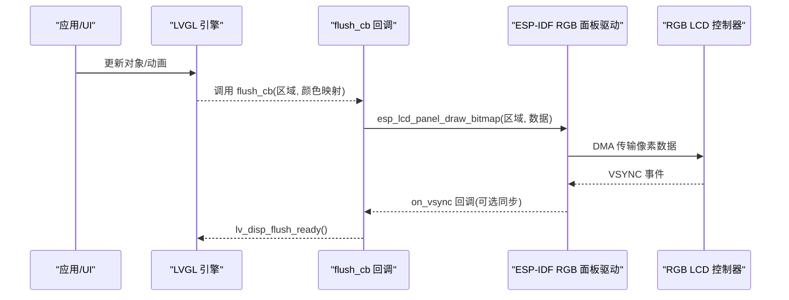
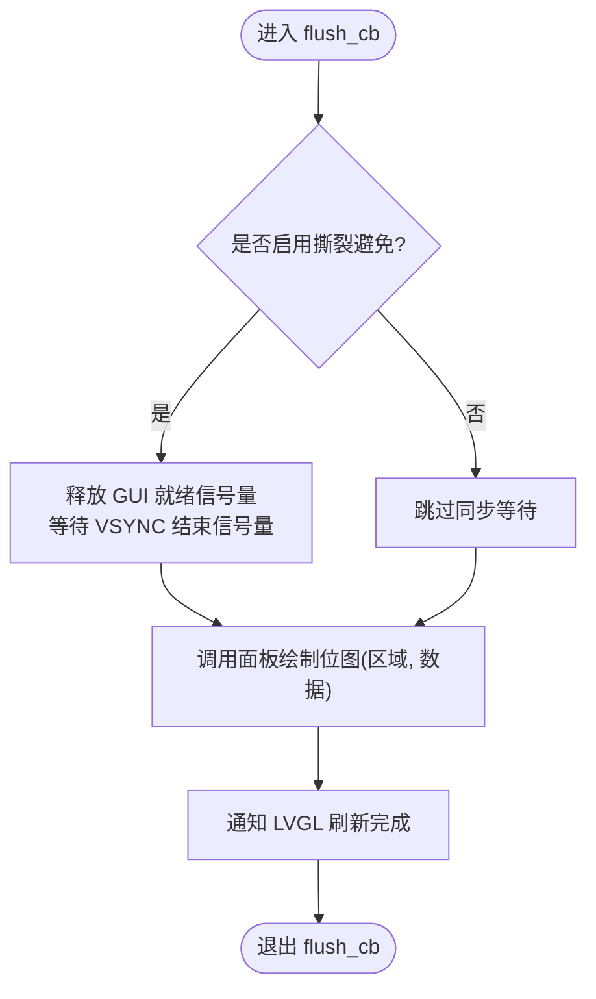
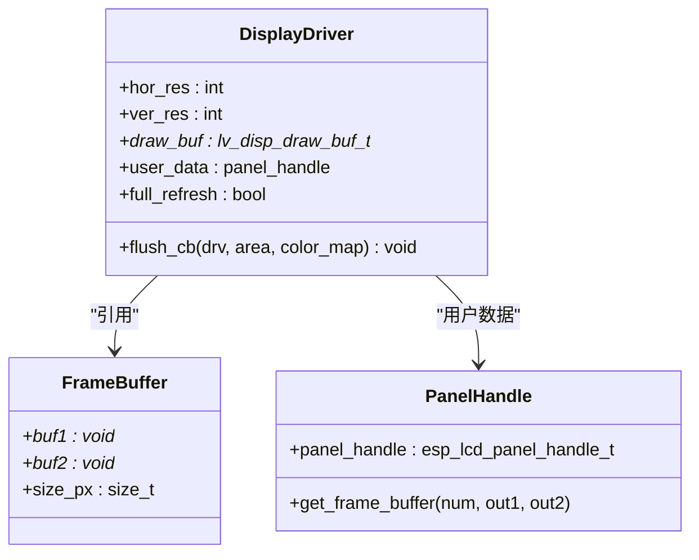
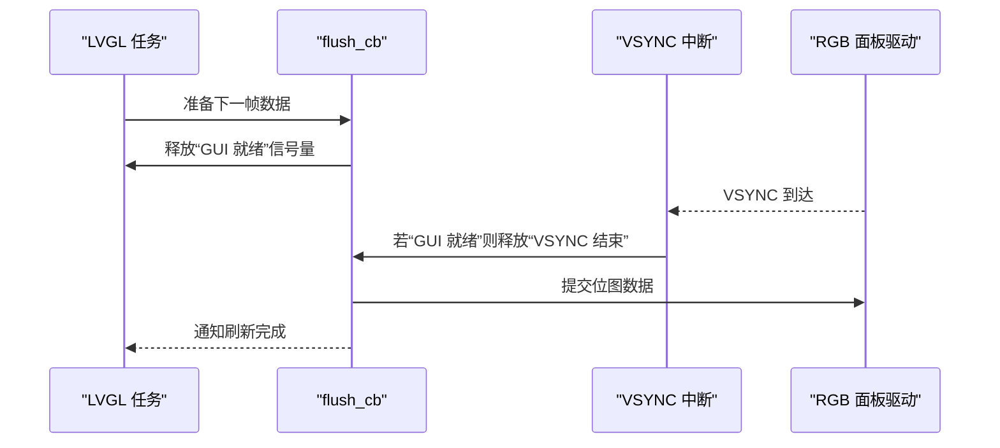
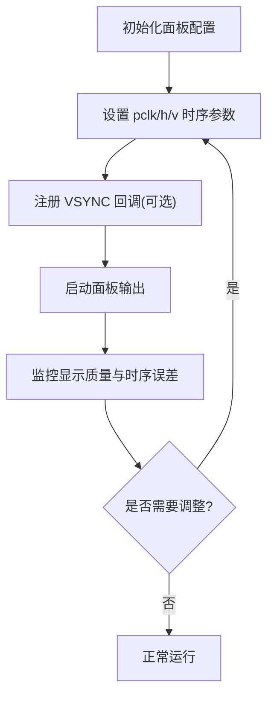
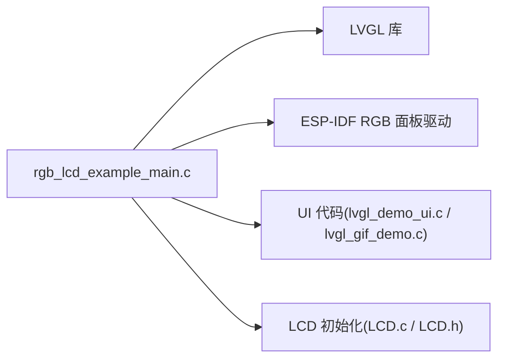

# 渲染性能优化

<cite>
**本文引用的文件**   
- [rgb_lcd_example_main.c](file://ESP32开发板/TK021F2699_ESP32_LVGL_GIF_LED/TK021F2699_ESP32_LVGL_GIF_LED/main/rgb_lcd_example_main.c)
- [LCD.c](file://ESP32开发板/TK021F2699_ESP32_LVGL_GIF_LED/TK021F2699_ESP32_LVGL_GIF_LED/main/LCD.c)
- [LCD.h](file://ESP32开发板/TK021F2699_ESP32_LVGL_GIF_LED/TK021F2699_ESP32_LVGL_GIF_LED/main/LCD.h)
- [lvgl_demo_ui.c](file://ESP32开发板/TK021F2699_ESP32_LVGL_GIF_LED/TK021F2699_ESP32_LVGL_GIF_LED/main/ui/lvgl_demo_ui.c)
- [lvgl_gif_demo.c](file://ESP32开发板/TK021F2699_ESP32_LVGL_GIF_LED/TK021F2699_ESP32_LVGL_GIF_LED/main/ui/lvgl_gif_demo.c)
- [README.md](file://ESP32开发板/TK021F2699_ESP32_LVGL_GIF_LED/TK021F2699_ESP32_LVGL_GIF_LED/README.md)
</cite>

## 目录
1. [简介](#简介)
2. [项目结构](#项目结构)
3. [核心组件](#核心组件)
4. [架构总览](#架构总览)
5. [详细组件分析](#详细组件分析)
6. [依赖关系分析](#依赖关系分析)
7. [性能考量与调优建议](#性能考量与调优建议)
8. [故障排查指南](#故障排查指南)
9. [结论](#结论)
10. [附录](#附录)

## 简介
本技术文档面向在 ESP32 平台上使用 LVGL 驱动 RGB LCD 面板的开发者，聚焦于渲染性能优化。内容涵盖：
- LVGL 绘制区域裁剪、批量传输与硬件加速配置
- RGB LCD 刷新机制与时序参数优化
- 帧同步与撕裂避免方案（基于 VSYNC 信号）
- DMA 传输与缓冲区管理策略（双缓冲、回弹缓冲、PSRAM 分配）
- 渲染性能监控与瓶颈识别方法
- 不同分辨率下的调优建议

## 项目结构
本项目围绕 ESP-IDF + LVGL 的 RGB LCD 示例展开，关键路径如下：
- 应用入口与 LVGL 端口：main/rgb_lcd_example_main.c
- LCD 初始化与 SPI 寄存器配置：main/LCD.c、main/LCD.h
- UI 演示与动画：main/ui/lvgl_demo_ui.c、main/ui/lvgl_gif_demo.c
- 构建与配置说明：README.md

图表来源
- [rgb_lcd_example_main.c:150-303](file://ESP32开发板/TK021F2699_ESP32_LVGL_GIF_LED/TK021F2699_ESP32_LVGL_GIF_LED/main/rgb_lcd_example_main.c#L150-L303)
- [LCD.c:186-219](file://ESP32开发板/TK021F2699_ESP32_LVGL_GIF_LED/TK021F2699_ESP32_LVGL_GIF_LED/main/LCD.c#L186-L219)
- [LCD.h:12-26](file://ESP32开发板/TK021F2699_ESP32_LVGL_GIF_LED/TK021F2699_ESP32_LVGL_GIF_LED/main/LCD.h#L12-L26)
- [lvgl_demo_ui.c:297-497](file://ESP32开发板/TK021F2699_ESP32_LVGL_GIF_LED/TK021F2699_ESP32_LVGL_GIF_LED/main/ui/lvgl_demo_ui.c#L297-L497)
- [lvgl_gif_demo.c:12-47](file://ESP32开发板/TK021F2699_ESP32_LVGL_GIF_LED/TK021F2699_ESP32_LVGL_GIF_LED/main/ui/lvgl_gif_demo.c#L12-L47)

章节来源
- [rgb_lcd_example_main.c:150-303](file://ESP32开发板/TK021F2699_ESP32_LVGL_GIF_LED/TK021F2699_ESP32_LVGL_GIF_LED/main/rgb_lcd_example_main.c#L150-L303)
- [LCD.c:186-219](file://ESP32开发板/TK021F2699_ESP32_LVGL_GIF_LED/TK021F2699_ESP32_LVGL_GIF_LED/main/LCD.c#L186-L219)
- [LCD.h:12-26](file://ESP32开发板/TK021F2699_ESP32_LVGL_GIF_LED/TK021F2699_ESP32_LVGL_GIF_LED/main/LCD.h#L12-L26)
- [lvgl_demo_ui.c:297-497](file://ESP32开发板/TK021F2699_ESP32_LVGL_GIF_LED/TK021F2699_ESP32_LVGL_GIF_LED/main/ui/lvgl_demo_ui.c#L297-L497)
- [lvgl_gif_demo.c:12-47](file://ESP32开发板/TK021F2699_ESP32_LVGL_GIF_LED/TK021F2699_ESP32_LVGL_GIF_LED/main/ui/lvgl_gif_demo.c#L12-L47)

## 核心组件
- 显示驱动与刷新回调
  - 通过 LVGL 的 flush_cb 将绘制区域数据提交到 ESP-IDF 的 RGB 面板驱动，实现像素数据的 DMA 传输。
- 帧缓冲与内存布局
  - 支持双缓冲（两个帧缓冲）或单缓冲；可选择将帧缓冲分配在 PSRAM，或通过回弹缓冲（bounce buffer）在内部 SRAM 中转。
- 帧同步与撕裂避免
  - 可选地利用 VSYNC 中断与信号量进行同步，确保 GUI 准备完成后才允许下一帧开始刷新。
- 时钟与时序
  - 配置像素时钟、HSYNC/VSYNC 前后肩与脉宽，直接影响带宽与稳定性。
- UI 与动画
  - 菜单与 GIF 动画等 UI 元素对渲染压力较大，需关注资源与刷新频率。

章节来源
- [rgb_lcd_example_main.c:94-109](file://ESP32开发板/TK021F2699_ESP32_LVGL_GIF_LED/TK021F2699_ESP32_LVGL_GIF_LED/main/rgb_lcd_example_main.c#L94-L109)
- [rgb_lcd_example_main.c:182-229](file://ESP32开发板/TK021F2699_ESP32_LVGL_GIF_LED/TK021F2699_ESP32_LVGL_GIF_LED/main/rgb_lcd_example_main.c#L182-L229)
- [rgb_lcd_example_main.c:246-273](file://ESP32开发板/TK021F2699_ESP32_LVGL_GIF_LED/TK021F2699_ESP32_LVGL_GIF_LED/main/rgb_lcd_example_main.c#L246-L273)
- [lvgl_demo_ui.c:297-497](file://ESP32开发板/TK021F2699_ESP32_LVGL_GIF_LED/TK021F2699_ESP32_LVGL_GIF_LED/main/ui/lvgl_demo_ui.c#L297-L497)
- [lvgl_gif_demo.c:12-47](file://ESP32开发板/TK021F2699_ESP32_LVGL_GIF_LED/TK021F2699_ESP32_LVGL_GIF_LED/main/ui/lvgl_gif_demo.c#L12-L47)

## 架构总览
下图展示了从 LVGL 渲染到 RGB LCD 输出的完整链路，包括帧缓冲、DMA 传输、VSYNC 同步与 UI 层交互。

图表来源
- [rgb_lcd_example_main.c:94-109](file://ESP32开发板/TK021F2699_ESP32_LVGL_GIF_LED/TK021F2699_ESP32_LVGL_GIF_LED/main/rgb_lcd_example_main.c#L94-L109)
- [rgb_lcd_example_main.c:84-93](file://ESP32开发板/TK021F2699_ESP32_LVGL_GIF_LED/TK021F2699_ESP32_LVGL_GIF_LED/main/rgb_lcd_example_main.c#L84-L93)

## 详细组件分析

### 刷新回调与 DMA 传输
- 作用：将 LVGL 绘制的矩形区域数据提交给底层驱动，由驱动发起 DMA 传输至 LCD。
- 关键点：
  - 传入区域坐标用于裁剪，减少不必要的数据传输。
  - 在启用撕裂避免时，通过信号量等待 VSYNC 完成后再提交下一帧。
  - 调用 lv_disp_flush_ready 通知 LVGL 完成一次刷新。

图表来源
- [rgb_lcd_example_main.c:94-109](file://ESP32开发板/TK021F2699_ESP32_LVGL_GIF_LED/TK021F2699_ESP32_LVGL_GIF_LED/main/rgb_lcd_example_main.c#L94-L109)

章节来源
- [rgb_lcd_example_main.c:94-109](file://ESP32开发板/TK021F2699_ESP32_LVGL_GIF_LED/TK021F2699_ESP32_LVGL_GIF_LED/main/rgb_lcd_example_main.c#L94-L109)

### 帧缓冲与内存布局
- 双缓冲模式：
  - 使用两个帧缓冲，配合 full_refresh 标志，有助于维持两缓冲同步，降低撕裂风险。
- 单缓冲模式：
  - 可从 PSRAM 分配 LVGL 绘制缓冲，节省内部 RAM。
- 回弹缓冲（bounce buffer）：
  - 当启用时，LCD 控制器从内部 SRAM 拉取数据，提高吞吐，但会增加 CPU 拷贝开销。

图表来源
- [rgb_lcd_example_main.c:246-273](file://ESP32开发板/TK021F2699_ESP32_LVGL_GIF_LED/TK021F2699_ESP32_LVGL_GIF_LED/main/rgb_lcd_example_main.c#L246-L273)
- [rgb_lcd_example_main.c:182-229](file://ESP32开发板/TK021F2699_ESP32_LVGL_GIF_LED/TK021F2699_ESP32_LVGL_GIF_LED/main/rgb_lcd_example_main.c#L182-L229)

章节来源
- [rgb_lcd_example_main.c:246-273](file://ESP32开发板/TK021F2699_ESP32_LVGL_GIF_LED/TK021F2699_ESP32_LVGL_GIF_LED/main/rgb_lcd_example_main.c#L246-L273)
- [rgb_lcd_example_main.c:182-229](file://ESP32开发板/TK021F2699_ESP32_LVGL_GIF_LED/TK021F2699_ESP32_LVGL_GIF_LED/main/rgb_lcd_example_main.c#L182-L229)

### 帧同步与撕裂避免
- 机制：
  - 在 VSYNC 中断中，若 GUI 已准备好，则释放“VSYNC 结束”信号量，使 flush_cb 继续执行。
  - flush_cb 在提交数据前释放“GUI 就绪”信号量并等待“VSYNC 结束”，从而保证一帧内不出现撕裂。
- 适用场景：
  - 高刷新率或复杂 UI 下，避免部分行被上一帧覆盖导致撕裂。

图表来源
- [rgb_lcd_example_main.c:84-93](file://ESP32开发板/TK021F2699_ESP32_LVGL_GIF_LED/TK021F2699_ESP32_LVGL_GIF_LED/main/rgb_lcd_example_main.c#L84-L93)
- [rgb_lcd_example_main.c:94-109](file://ESP32开发板/TK021F2699_ESP32_LVGL_GIF_LED/TK021F2699_ESP32_LVGL_GIF_LED/main/rgb_lcd_example_main.c#L94-L109)

章节来源
- [rgb_lcd_example_main.c:84-93](file://ESP32开发板/TK021F2699_ESP32_LVGL_GIF_LED/TK021F2699_ESP32_LVGL_GIF_LED/main/rgb_lcd_example_main.c#L84-L93)
- [rgb_lcd_example_main.c:94-109](file://ESP32开发板/TK021F2699_ESP32_LVGL_GIF_LED/TK021F2699_ESP32_LVGL_GIF_LED/main/rgb_lcd_example_main.c#L94-L109)

### RGB LCD 时序与刷新机制
- 关键参数：
  - 像素时钟频率（pclk_hz）
  - HSYNC/VSYNC 前后肩与脉宽
  - 数据宽度（16bit RGB565）
- 影响：
  - pclk 越高，带宽越大，但需确保面板稳定；前后肩与脉宽错误会导致图像错位或不显示。
- 建议：
  - 根据面板规格书精确设置时序；逐步提升 pclk 以找到稳定上限。

图表来源
- [rgb_lcd_example_main.c:182-229](file://ESP32开发板/TK021F2699_ESP32_LVGL_GIF_LED/TK021F2699_ESP32_LVGL_GIF_LED/main/rgb_lcd_example_main.c#L182-L229)

章节来源
- [rgb_lcd_example_main.c:182-229](file://ESP32开发板/TK021F2699_ESP32_LVGL_GIF_LED/TK021F2699_ESP32_LVGL_GIF_LED/main/rgb_lcd_example_main.c#L182-L229)

### LCD 初始化与 SPI 寄存器配置
- 功能：
  - 通过 SPI 向 LCD 控制器写入初始化序列，设置工作模式、电源与时序相关寄存器。
- 注意：
  - 某些面板可省略复位步骤；初始化表顺序与延时至关重要。

章节来源
- [LCD.c:186-219](file://ESP32开发板/TK021F2699_ESP32_LVGL_GIF_LED/TK021F2699_ESP32_LVGL_GIF_LED/main/LCD.c#L186-L219)
- [LCD.h:12-26](file://ESP32开发板/TK021F2699_ESP32_LVGL_GIF_LED/TK021F2699_ESP32_LVGL_GIF_LED/main/LCD.h#L12-L26)

### UI 与动画对渲染的影响
- 菜单与图标：
  - 大量静态图标与样式设置会触发初次绘制与缓存。
- GIF 动画：
  - 解码与逐帧合成带来额外 CPU 负载，需控制同时播放数量与帧率。

章节来源
- [lvgl_demo_ui.c:297-497](file://ESP32开发板/TK021F2699_ESP32_LVGL_GIF_LED/TK021F2699_ESP32_LVGL_GIF_LED/main/ui/lvgl_demo_ui.c#L297-L497)
- [lvgl_gif_demo.c:12-47](file://ESP32开发板/TK021F2699_ESP32_LVGL_GIF_LED/TK021F2699_ESP32_LVGL_GIF_LED/main/ui/lvgl_gif_demo.c#L12-L47)

## 依赖关系分析
- 模块耦合：
  - 应用入口负责创建 LVGL 实例、注册显示驱动与任务，耦合度适中。
  - flush_cb 作为桥接点，连接 LVGL 与 ESP-IDF 面板驱动。
- 外部依赖：
  - ESP-IDF 的 RGB 面板驱动提供 DMA 与 VSYNC 能力。
  - LVGL 提供渲染、对象树与动画框架。

图表来源
- [rgb_lcd_example_main.c:150-303](file://ESP32开发板/TK021F2699_ESP32_LVGL_GIF_LED/TK021F2699_ESP32_LVGL_GIF_LED/main/rgb_lcd_example_main.c#L150-L303)
- [lvgl_demo_ui.c:297-497](file://ESP32开发板/TK021F2699_ESP32_LVGL_GIF_LED/TK021F2699_ESP32_LVGL_GIF_LED/main/ui/lvgl_demo_ui.c#L297-L497)
- [lvgl_gif_demo.c:12-47](file://ESP32开发板/TK021F2699_ESP32_LVGL_GIF_LED/TK021F2699_ESP32_LVGL_GIF_LED/main/ui/lvgl_gif_demo.c#L12-L47)
- [LCD.c:186-219](file://ESP32开发板/TK021F2699_ESP32_LVGL_GIF_LED/TK021F2699_ESP32_LVGL_GIF_LED/main/LCD.c#L186-L219)
- [LCD.h:12-26](file://ESP32开发板/TK021F2699_ESP32_LVGL_GIF_LED/TK021F2699_ESP32_LVGL_GIF_LED/main/LCD.h#L12-L26)

章节来源
- [rgb_lcd_example_main.c:150-303](file://ESP32开发板/TK021F2699_ESP32_LVGL_GIF_LED/TK021F2699_ESP32_LVGL_GIF_LED/main/rgb_lcd_example_main.c#L150-L303)

## 性能考量与调优建议

### 绘制区域裁剪与批量操作
- 裁剪：
  - LVGL 自动按脏矩形裁剪，flush_cb 仅接收需要更新的区域，减少 DMA 传输量。
- 批量：
  - 尽量合并相邻区域的更新，避免频繁小区域刷新；可通过减少动画频率与对象重绘次数来降低刷新总量。
- 建议：
  - 合理设计 UI 层级与可见性，隐藏不可见对象以减少绘制。

章节来源
- [rgb_lcd_example_main.c:94-109](file://ESP32开发板/TK021F2699_ESP32_LVGL_GIF_LED/TK021F2699_ESP32_LVGL_GIF_LED/main/rgb_lcd_example_main.c#L94-L109)

### 硬件加速与 GPU 配置
- 现状：
  - 当前示例未启用特定 GPU/DMA2D 后端，主要依赖 ESP-IDF RGB 面板驱动的 DMA 传输。
- 建议：
  - 若平台支持，可在 LVGL 配置中启用对应 GPU 后端（如 STM32 DMA2D、NXP PXP 等），并将绘制结果直接送入帧缓冲，减少 CPU 参与。
  - 对于 ESP32-S3，优先使用 RGB 面板 DMA 与 PSRAM 分配，必要时启用回弹缓冲以提升吞吐。

章节来源
- [rgb_lcd_example_main.c:182-229](file://ESP32开发板/TK021F2699_ESP32_LVGL_GIF_LED/TK021F2699_ESP32_LVGL_GIF_LED/main/rgb_lcd_example_main.c#L182-L229)

### 帧同步与撕裂避免
- 启用条件：
  - 编译选项 CONFIG_EXAMPLE_AVOID_TEAR_EFFECT_WITH_SEM 开启后，flush_cb 与 VSYNC 中断通过信号量协作。
- 效果：
  - 有效避免同一帧内新旧画面混合导致的撕裂。
- 代价：
  - 可能引入少量延迟，需在流畅性与稳定性间权衡。

章节来源
- [rgb_lcd_example_main.c:84-93](file://ESP32开发板/TK021F2699_ESP32_LVGL_GIF_LED/TK021F2699_ESP32_LVGL_GIF_LED/main/rgb_lcd_example_main.c#L84-L93)
- [rgb_lcd_example_main.c:94-109](file://ESP32开发板/TK021F2699_ESP32_LVGL_GIF_LED/TK021F2699_ESP32_LVGL_GIF_LED/main/rgb_lcd_example_main.c#L94-L109)

### DMA 传输优化与缓冲区管理
- 双缓冲 vs 单缓冲：
  - 双缓冲可降低撕裂风险，适合全屏刷新或复杂动画；单缓冲节省内存。
- PSRAM 分配：
  - 将帧缓冲置于 PSRAM 可缓解内部 RAM 压力，但需注意访问延迟。
- 回弹缓冲：
  - 启用 CONFIG_EXAMPLE_USE_BOUNCE_BUFFER 可使面板从内部 SRAM 读取数据，提高吞吐，但增加 CPU 拷贝成本。
- 建议：
  - 高分辨率或高帧率场景优先双缓冲 + PSRAM；低内存设备考虑单缓冲 + 回弹缓冲。

章节来源
- [rgb_lcd_example_main.c:246-273](file://ESP32开发板/TK021F2699_ESP32_LVGL_GIF_LED/TK021F2699_ESP32_LVGL_GIF_LED/main/rgb_lcd_example_main.c#L246-L273)
- [README.md:115](file://ESP32开发板/TK021F2699_ESP32_LVGL_GIF_LED/TK021F2699_ESP32_LVGL_GIF_LED/README.md#L115)

### 时序优化与带宽规划
- 像素时钟：
  - 根据分辨率与目标帧率计算所需带宽，逐步提升 pclk 直至稳定。
- 前后肩与脉宽：
  - 严格遵循面板规格，避免行/场同步错误。
- 建议：
  - 在极限条件下测试长时间运行稳定性，观察是否有抖动或丢帧。

章节来源
- [rgb_lcd_example_main.c:182-229](file://ESP32开发板/TK021F2699_ESP32_LVGL_GIF_LED/TK021F2699_ESP32_LVGL_GIF_LED/main/rgb_lcd_example_main.c#L182-L229)

### 不同分辨率下的调优建议
- 低分辨率（如 480x480）：
  - 可使用单缓冲 + PSRAM，关闭回弹缓冲以降低 CPU 占用。
- 中等分辨率（如 800x480）：
  - 推荐双缓冲 + PSRAM；必要时启用回弹缓冲提升吞吐。
- 高分辨率（如 1024x600 及以上）：
  - 必须双缓冲 + PSRAM；谨慎启用回弹缓冲；减少动画复杂度与同时播放的媒体数量。
- 通用建议：
  - 控制每帧脏矩形面积，避免全屏刷新；合理使用图层与缓存。

[本节为通用指导，不直接分析具体文件]

### 渲染性能监控与瓶颈识别
- 指标采集：
  - 统计 flush_cb 调用频率与平均耗时；记录 VSYNC 间隔与实际刷新周期。
  - 监控 LVGL 任务延迟与 tick 精度。
- 工具与方法：
  - 使用 GPIO 翻转或串口打印标记关键路径起止时间。
  - 结合 ESP-IDF 性能分析工具（如 perfmon）定位热点。
- 常见瓶颈：
  - 过高的 pclk 导致不稳定；回弹缓冲拷贝过多；GIF/视频解码占用 CPU；UI 过度重绘。

[本节为通用指导，不直接分析具体文件]

## 故障排查指南
- 无显示或花屏：
  - 检查 LCD 初始化序列与时序参数是否正确；确认数据引脚与使能信号配置。
- 撕裂明显：
  - 启用撕裂避免选项；检查 VSYNC 回调是否正常工作。
- 卡顿或掉帧：
  - 评估回弹缓冲带来的 CPU 开销；减少动画与媒体播放；优化 UI 重绘范围。
- 内存不足：
  - 切换为单缓冲；将帧缓冲移至 PSRAM；减少资源大小。

章节来源
- [rgb_lcd_example_main.c:182-229](file://ESP32开发板/TK021F2699_ESP32_LVGL_GIF_LED/TK021F2699_ESP32_LVGL_GIF_LED/main/rgb_lcd_example_main.c#L182-L229)
- [rgb_lcd_example_main.c:246-273](file://ESP32开发板/TK021F2699_ESP32_LVGL_GIF_LED/TK021F2699_ESP32_LVGL_GIF_LED/main/rgb_lcd_example_main.c#L246-L273)
- [LCD.c:186-219](file://ESP32开发板/TK021F2699_ESP32_LVGL_GIF_LED/TK021F2699_ESP32_LVGL_GIF_LED/main/LCD.c#L186-L219)

## 结论
通过在 LVGL 与 ESP-IDF RGB 面板驱动之间建立高效的 flush_cb 通道，并结合双缓冲、PSRAM 分配、回弹缓冲与 VSYNC 同步，可以在 ESP32 平台上实现稳定且流畅的 RGB LCD 渲染。针对不同的分辨率与应用场景，选择合适的缓冲区策略与时序参数，辅以性能监控与瓶颈定位，可显著提升整体用户体验。

[本节为总结，不直接分析具体文件]

## 附录
- 构建与配置参考：
  - README 中提供了关于回弹缓冲的配置说明与性能权衡提示。

章节来源
- [README.md:115](file://ESP32开发板/TK021F2699_ESP32_LVGL_GIF_LED/TK021F2699_ESP32_LVGL_GIF_LED/README.md#L115)