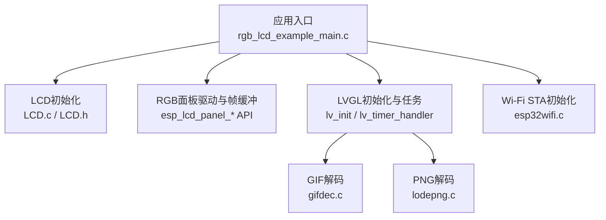
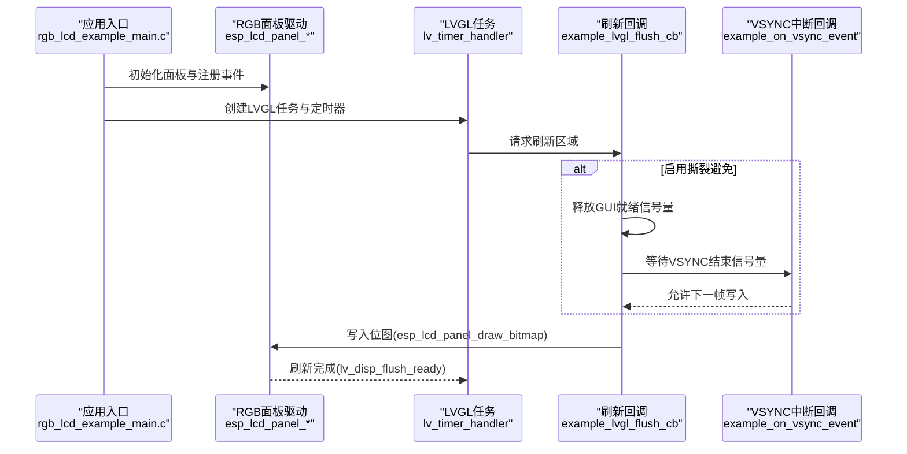
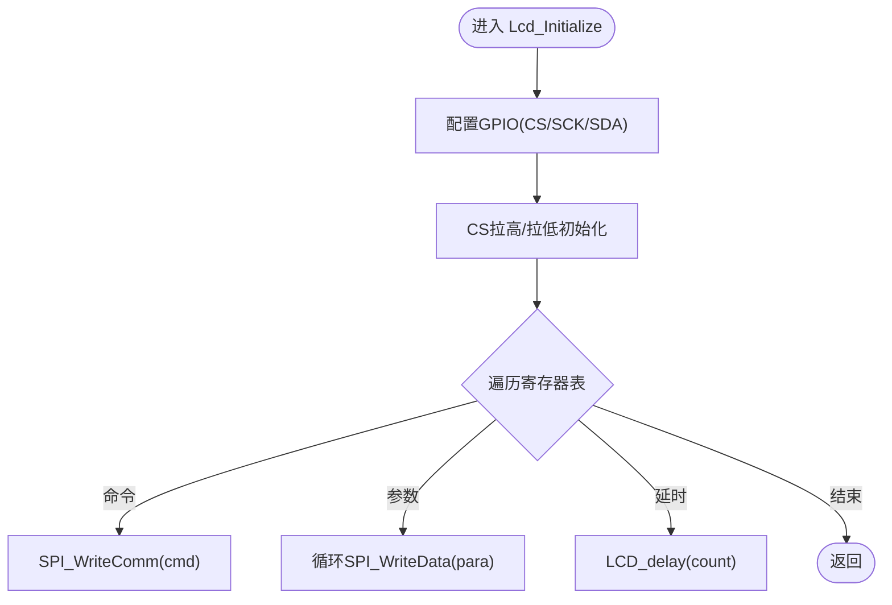
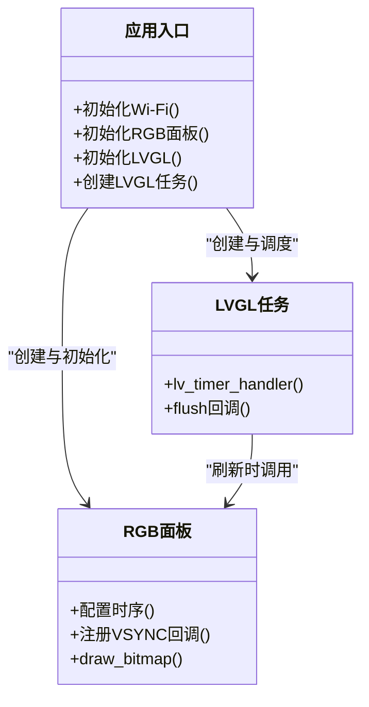
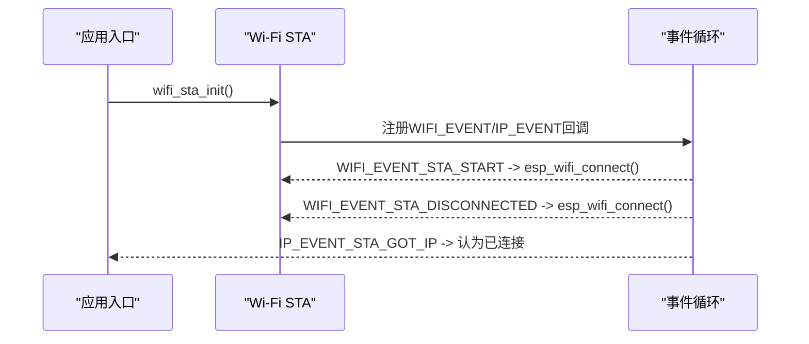
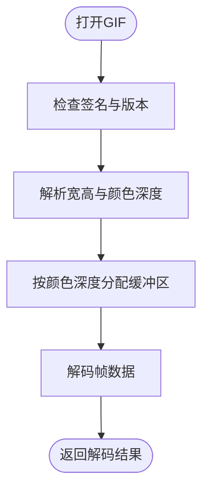
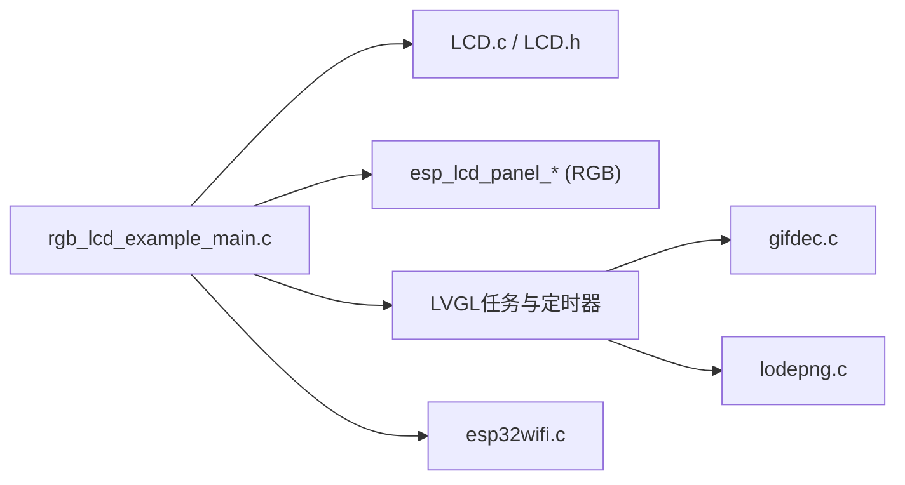

# 故障排除指南

<cite>
**本文引用的文件**   
- [rgb_lcd_example_main.c](file://ESP32开发板/TK021F2699_ESP32_LVGL_GIF_LED/TK021F2699_ESP32_LVGL_GIF_LED/main/rgb_lcd_example_main.c)
- [LCD.c](file://ESP32开发板/TK021F2699_ESP32_LVGL_GIF_LED/TK021F2699_ESP32_LVGL_GIF_LED/main/LCD.c)
- [LCD.h](file://ESP32开发板/TK021F2699_ESP32_LVGL_GIF_LED/TK021F2699_ESP32_LVGL_GIF_LED/main/LCD.h)
- [esp32wifi.c](file://ESP32开发板/TK021F2699_ESP32_LVGL_GIF_LED/TK021F2699_ESP32_LVGL_GIF_LED/main/wifi/esp32wifi.c)
- [esp32wifi.h](file://ESP32开发板/TK021F2699_ESP32_LVGL_GIF_LED/TK021F2699_ESP32_LVGL_GIF_LED/main/wifi/esp32wifi.h)
- [gifdec.c](file://ESP32开发板/TK021F2699_ESP32_LVGL_GIF_LED/TK021F2699_ESP32_LVGL_GIF_LED/managed_components/lvgl__lvgl/src/extra/libs/gif/gifdec.c)
- [lodepng.c](file://ESP32开发板/TK021F2699_ESP32_LVGL_GIF_LED/TK021F2699_ESP32_LVGL_GIF_LED/managed_components/lvgl__lvgl/src/extra/libs/png/lodepng.c)
</cite>

## 目录
1. [简介](#简介)
2. [项目结构](#项目结构)
3. [核心组件](#核心组件)
4. [架构总览](#架构总览)
5. [详细组件分析](#详细组件分析)
6. [依赖关系分析](#依赖关系分析)
7. [性能考虑](#性能考虑)
8. [故障排除指南](#故障排除指南)
9. [结论](#结论)
10. [附录](#附录)

## 简介
本指南面向PathFinder_LCD项目的开发与维护人员，聚焦于常见问题与系统化排查方法。内容覆盖：
- LCD不亮、屏幕漂移、撕裂效应等显示问题
- 内存不足（PSRAM分配失败、资源耗尽）
- 编译错误、链接问题与运行时异常
- 硬件连接检测与修复
- Wi-Fi连接诊断与恢复
- 性能瓶颈定位与优化建议

目标是提供一套可操作的自助排障工具箱与方法论，帮助快速定位并解决问题。

## 项目结构
本项目基于ESP-IDF与LVGL，主程序负责初始化Wi-Fi、RGB面板、LVGL任务与UI；LCD驱动通过GPIO模拟SPI对屏进行初始化配置；GIF/PNG解码由LVGL扩展库实现。

图表来源
- [rgb_lcd_example_main.c:150-303](file://ESP32开发板/TK021F2699_ESP32_LVGL_GIF_LED/TK021F2699_ESP32_LVGL_GIF_LED/main/rgb_lcd_example_main.c#L150-L303)
- [LCD.c:186-219](file://ESP32开发板/TK021F2699_ESP32_LVGL_GIF_LED/TK021F2699_ESP32_LVGL_GIF_LED/main/LCD.c#L186-L219)
- [LCD.h:12-26](file://ESP32开发板/TK021F2699_ESP32_LVGL_GIF_LED/TK021F2699_ESP32_LVGL_GIF_LED/main/LCD.h#L12-L26)
- [esp32wifi.c:46-95](file://ESP32开发板/TK021F2699_ESP32_LVGL_GIF_LED/TK021F2699_ESP32_LVGL_GIF_LED/main/wifi/esp32wifi.c#L46-L95)
- [gifdec.c:78-116](file://ESP32开发板/TK021F2699_ESP32_LVGL_GIF_LED/TK021F2699_ESP32_LVGL_GIF_LED/managed_components/lvgl__lvgl/src/extra/libs/gif/gifdec.c#L78-L116)
- [lodepng.c:64-97](file://ESP32开发板/TK021F2699_ESP32_LVGL_GIF_LED/TK021F2699_ESP32_LVGL_GIF_LED/managed_components/lvgl__lvgl/src/extra/libs/png/lodepng.c#L64-L97)

章节来源
- [rgb_lcd_example_main.c:150-303](file://ESP32开发板/TK021F2699_ESP32_LVGL_GIF_LED/TK021F2699_ESP32_LVGL_GIF_LED/main/rgb_lcd_example_main.c#L150-L303)
- [LCD.c:186-219](file://ESP32开发板/TK021F2699_ESP32_LVGL_GIF_LED/TK021F2699_ESP32_LVGL_GIF_LED/main/LCD.c#L186-L219)
- [LCD.h:12-26](file://ESP32开发板/TK021F2699_ESP32_LVGL_GIF_LED/TK021F2699_ESP32_LVGL_GIF_LED/main/LCD.h#L12-L26)
- [esp32wifi.c:46-95](file://ESP32开发板/TK021F2699_ESP32_LVGL_GIF_LED/TK021F2699_ESP32_LVGL_GIF_LED/main/wifi/esp32wifi.c#L46-L95)

## 核心组件
- 应用入口与系统初始化：创建Wi-Fi、RGB面板、LVGL任务、定时器与信号量同步。
- LCD初始化：通过GPIO模拟SPI写入寄存器表完成屏初始化。
- LVGL渲染与刷新：flush回调将绘制缓冲区数据写入RGB面板，支持可选的撕裂避免机制。
- Wi-Fi STA：事件驱动的连接与重连逻辑，获取IP后视为连接成功。
- GIF/PNG解码：使用LVGL扩展库，内部涉及动态内存分配与校验。

章节来源
- [rgb_lcd_example_main.c:150-303](file://ESP32开发板/TK021F2699_ESP32_LVGL_GIF_LED/TK021F2699_ESP32_LVGL_GIF_LED/main/rgb_lcd_example_main.c#L150-L303)
- [LCD.c:186-219](file://ESP32开发板/TK021F2699_ESP32_LVGL_GIF_LED/TK021F2699_ESP32_LVGL_GIF_LED/main/LCD.c#L186-L219)
- [esp32wifi.c:46-95](file://ESP32开发板/TK021F2699_ESP32_LVGL_GIF_LED/TK021F2699_ESP32_LVGL_GIF_LED/main/wifi/esp32wifi.c#L46-L95)
- [gifdec.c:78-116](file://ESP32开发板/TK021F2699_ESP32_LVGL_GIF_LED/TK021F2699_ESP32_LVGL_GIF_LED/managed_components/lvgl__lvgl/src/extra/libs/gif/gifdec.c#L78-L116)
- [lodepng.c:64-97](file://ESP32开发板/TK021F2699_ESP32_LVGL_GIF_LED/TK021F2699_ESP32_LVGL_GIF_LED/managed_components/lvgl__lvgl/src/extra/libs/png/lodepng.c#L64-L97)

## 架构总览
下图展示了从应用启动到显示输出的关键流程，包括撕裂避免的信号量同步路径。

图表来源
- [rgb_lcd_example_main.c:84-109](file://ESP32开发板/TK021F2699_ESP32_LVGL_GIF_LED/TK021F2699_ESP32_LVGL_GIF_LED/main/rgb_lcd_example_main.c#L84-L109)
- [rgb_lcd_example_main.c:130-148](file://ESP32开发板/TK021F2699_ESP32_LVGL_GIF_LED/TK021F2699_ESP32_LVGL_GIF_LED/main/rgb_lcd_example_main.c#L130-L148)
- [rgb_lcd_example_main.c:150-303](file://ESP32开发板/TK021F2699_ESP32_LVGL_GIF_LED/TK021F2699_ESP32_LVGL_GIF_LED/main/rgb_lcd_example_main.c#L150-L303)

## 详细组件分析

### LCD初始化与SPI时序
- GPIO配置与宏定义：CS/SCK/SDA引脚通过宏控制电平，用于模拟SPI通信。
- 初始化序列：通过寄存器表逐项写入命令与参数，包含延时标记与结束标记。
- 典型问题：
  - 引脚冲突或电平不正确导致无法识别命令
  - 时序过快导致屏无响应
  - 复位未执行或时序不当

图表来源
- [LCD.c:186-219](file://ESP32开发板/TK021F2699_ESP32_LVGL_GIF_LED/TK021F2699_ESP32_LVGL_GIF_LED/main/LCD.c#L186-L219)
- [LCD.h:12-26](file://ESP32开发板/TK021F2699_ESP32_LVGL_GIF_LED/TK021F2699_ESP32_LVGL_GIF_LED/main/LCD.h#L12-L26)

章节来源
- [LCD.c:186-219](file://ESP32开发板/TK021F2699_ESP32_LVGL_GIF_LED/TK021F2699_ESP32_LVGL_GIF_LED/main/LCD.c#L186-L219)
- [LCD.h:12-26](file://ESP32开发板/TK021F2699_ESP32_LVGL_GIF_LED/TK021F2699_ESP32_LVGL_GIF_LED/main/LCD.h#L12-L26)

### RGB面板与LVGL刷新
- 像素时钟与时序参数：pclk_hz、h/v_res、前后肩与脉宽需匹配屏规格。
- 帧缓冲位置：可选择在PSRAM或双缓冲模式，影响内存占用与撕裂表现。
- 撕裂避免：通过信号量在VSYNC边界同步刷新，减少撕裂。

图表来源
- [rgb_lcd_example_main.c:150-303](file://ESP32开发板/TK021F2699_ESP32_LVGL_GIF_LED/TK021F2699_ESP32_LVGL_GIF_LED/main/rgb_lcd_example_main.c#L150-L303)
- [rgb_lcd_example_main.c:84-109](file://ESP32开发板/TK021F2699_ESP32_LVGL_GIF_LED/TK021F2699_ESP32_LVGL_GIF_LED/main/rgb_lcd_example_main.c#L84-L109)

章节来源
- [rgb_lcd_example_main.c:150-303](file://ESP32开发板/TK021F2699_ESP32_LVGL_GIF_LED/TK021F2699_ESP32_LVGL_GIF_LED/main/rgb_lcd_example_main.c#L150-L303)
- [rgb_lcd_example_main.c:84-109](file://ESP32开发板/TK021F2699_ESP32_LVGL_GIF_LED/TK021F2699_ESP32_LVGL_GIF_LED/main/rgb_lcd_example_main.c#L84-L109)

### Wi-Fi STA连接流程
- 事件驱动：STA启动、连接成功、断开重连、获取IP。
- NVS初始化：处理NVS页损坏或版本不一致时的擦除与重建。
- 信号强度查询：失败时返回默认值并记录错误日志。

图表来源
- [esp32wifi.c:46-95](file://ESP32开发板/TK021F2699_ESP32_LVGL_GIF_LED/TK021F2699_ESP32_LVGL_GIF_LED/main/wifi/esp32wifi.c#L46-L95)
- [esp32wifi.c:14-43](file://ESP32开发板/TK021F2699_ESP32_LVGL_GIF_LED/TK021F2699_ESP32_LVGL_GIF_LED/main/wifi/esp32wifi.c#L14-L43)

章节来源
- [esp32wifi.c:46-95](file://ESP32开发板/TK021F2699_ESP32_LVGL_GIF_LED/TK021F2699_ESP32_LVGL_GIF_LED/main/wifi/esp32wifi.c#L46-L95)
- [esp32wifi.c:14-43](file://ESP32开发板/TK021F2699_ESP32_LVGL_GIF_LED/TK021F2699_ESP32_LVGL_GIF_LED/main/wifi/esp32wifi.c#L14-L43)

### GIF/PNG解码与内存分配
- GIF解码：读取签名与版本、解析宽高与颜色深度，按颜色深度分配不同大小的缓冲区。
- PNG解码：封装内存分配接口，统一走LVGL内存管理，便于平台适配与限制最大分配。

图表来源
- [gifdec.c:78-116](file://ESP32开发板/TK021F2699_ESP32_LVGL_GIF_LED/TK021F2699_ESP32_LVGL_GIF_LED/managed_components/lvgl__lvgl/src/extra/libs/gif/gifdec.c#L78-L116)
- [lodepng.c:64-97](file://ESP32开发板/TK021F2699_ESP32_LVGL_GIF_LED/TK021F2699_ESP32_LVGL_GIF_LED/managed_components/lvgl__lvgl/src/extra/libs/png/lodepng.c#L64-L97)

章节来源
- [gifdec.c:78-116](file://ESP32开发板/TK021F2699_ESP32_LVGL_GIF_LED/TK021F2699_ESP32_LVGL_GIF_LED/managed_components/lvgl__lvgl/src/extra/libs/gif/gifdec.c#L78-L116)
- [lodepng.c:64-97](file://ESP32开发板/TK021F2699_ESP32_LVGL_GIF_LED/TK021F2699_ESP32_LVGL_GIF_LED/managed_components/lvgl__lvgl/src/extra/libs/png/lodepng.c#L64-L97)

## 依赖关系分析
- 应用入口依赖LCD初始化、RGB面板驱动、LVGL与Wi-Fi模块。
- LCD初始化依赖GPIO宏与SPI时序函数。
- LVGL刷新回调依赖RGB面板API与可选的信号量同步。
- GIF/PNG解码依赖LVGL内存管理与扩展库。

图表来源
- [rgb_lcd_example_main.c:150-303](file://ESP32开发板/TK021F2699_ESP32_LVGL_GIF_LED/TK021F2699_ESP32_LVGL_GIF_LED/main/rgb_lcd_example_main.c#L150-L303)
- [LCD.c:186-219](file://ESP32开发板/TK021F2699_ESP32_LVGL_GIF_LED/TK021F2699_ESP32_LVGL_GIF_LED/main/LCD.c#L186-L219)
- [esp32wifi.c:46-95](file://ESP32开发板/TK021F2699_ESP32_LVGL_GIF_LED/TK021F2699_ESP32_LVGL_GIF_LED/main/wifi/esp32wifi.c#L46-L95)
- [gifdec.c:78-116](file://ESP32开发板/TK021F2699_ESP32_LVGL_GIF_LED/TK021F2699_ESP32_LVGL_GIF_LED/managed_components/lvgl__lvgl/src/extra/libs/gif/gifdec.c#L78-L116)
- [lodepng.c:64-97](file://ESP32开发板/TK021F2699_ESP32_LVGL_GIF_LED/TK021F2699_ESP32_LVGL_GIF_LED/managed_components/lvgl__lvgl/src/extra/libs/png/lodepng.c#L64-L97)

章节来源
- [rgb_lcd_example_main.c:150-303](file://ESP32开发板/TK021F2699_ESP32_LVGL_GIF_LED/TK021F2699_ESP32_LVGL_GIF_LED/main/rgb_lcd_example_main.c#L150-L303)
- [LCD.c:186-219](file://ESP32开发板/TK021F2699_ESP32_LVGL_GIF_LED/TK021F2699_ESP32_LVGL_GIF_LED/main/LCD.c#L186-L219)
- [esp32wifi.c:46-95](file://ESP32开发板/TK021F2699_ESP32_LVGL_GIF_LED/TK021F2699_ESP32_LVGL_GIF_LED/main/wifi/esp32wifi.c#L46-L95)
- [gifdec.c:78-116](file://ESP32开发板/TK021F2699_ESP32_LVGL_GIF_LED/TK021F2699_ESP32_LVGL_GIF_LED/managed_components/lvgl__lvgl/src/extra/libs/gif/gifdec.c#L78-L116)
- [lodepng.c:64-97](file://ESP32开发板/TK021F2699_ESP32_LVGL_GIF_LED/TK021F2699_ESP32_LVGL_GIF_LED/managed_components/lvgl__lvgl/src/extra/libs/png/lodepng.c#L64-L97)

## 性能考虑
- 帧缓冲策略：双缓冲可减少撕裂但增加内存占用；单缓冲+PSRAM可降低SRAM压力但可能引入延迟。
- 像素时钟与时序：过高pclk可能导致不稳定，过低则刷新率不足；前后肩与脉宽需严格匹配屏规格。
- LVGL任务周期：tick间隔与任务优先级影响动画流畅度与CPU占用。
- GIF/PNG解码：大尺寸图片会触发较大内存分配，注意PSRAM容量与碎片化。

[本节为通用指导，无需特定文件引用]

## 故障排除指南

### 一、LCD不亮
症状
- 上电后屏幕无显示或全黑。

排查步骤
- 检查GPIO映射是否正确：确认CS/SCK/SDA宏对应的引脚号与实际硬件一致。
- 验证初始化序列是否执行：查看日志中“Tiky configure LCD special GPIO”与后续SPI写入是否出现。
- 调整时序与延时：适当增大LCD延时，确保屏有足够时间响应命令。
- 复位逻辑：若硬件需要复位，确认复位引脚与延时是否符合屏手册要求。
- 背光控制：若背光引脚有效，确认背光开启电平与GPIO配置正确。

参考定位
- [LCD.h:12-26](file://ESP32开发板/TK021F2699_ESP32_LVGL_GIF_LED/TK021F2699_ESP32_LVGL_GIF_LED/main/LCD.h#L12-L26)
- [LCD.c:18-40](file://ESP32开发板/TK021F2699_ESP32_LVGL_GIF_LED/TK021F2699_ESP32_LVGL_GIF_LED/main/LCD.c#L18-L40)
- [LCD.c:186-219](file://ESP32开发板/TK021F2699_ESP32_LVGL_GIF_LED/TK021F2699_ESP32_LVGL_GIF_LED/main/LCD.c#L186-L219)
- [rgb_lcd_example_main.c:168-175](file://ESP32开发板/TK021F2699_ESP32_LVGL_GIF_LED/TK021F2699_ESP32_LVGL_GIF_LED/main/rgb_lcd_example_main.c#L168-L175)

章节来源
- [LCD.h:12-26](file://ESP32开发板/TK021F2699_ESP32_LVGL_GIF_LED/TK021F2699_ESP32_LVGL_GIF_LED/main/LCD.h#L12-L26)
- [LCD.c:18-40](file://ESP32开发板/TK021F2699_ESP32_LVGL_GIF_LED/TK021F2699_ESP32_LVGL_GIF_LED/main/LCD.c#L18-L40)
- [LCD.c:186-219](file://ESP32开发板/TK021F2699_ESP32_LVGL_GIF_LED/TK021F2699_ESP32_LVGL_GIF_LED/main/LCD.c#L186-L219)
- [rgb_lcd_example_main.c:168-175](file://ESP32开发板/TK021F2699_ESP32_LVGL_GIF_LED/TK021F2699_ESP32_LVGL_GIF_LED/main/rgb_lcd_example_main.c#L168-L175)

### 二、屏幕漂移或错位
症状
- 图像整体偏移、滚动或行列错位。

排查步骤
- 核对像素分辨率设置：确认水平/垂直分辨率与屏规格一致。
- 检查时序参数：hsync/vsync前后肩与脉宽需符合屏手册。
- 确认极性配置：如pclk_active_neg等极性标志是否与屏一致。
- 观察VSYNC同步：若启用撕裂避免，检查信号量同步是否生效。

参考定位
- [rgb_lcd_example_main.c:213-228](file://ESP32开发板/TK021F2699_ESP32_LVGL_GIF_LED/TK021F2699_ESP32_LVGL_GIF_LED/main/rgb_lcd_example_main.c#L213-L228)
- [rgb_lcd_example_main.c:56-64](file://ESP32开发板/TK021F2699_ESP32_LVGL_GIF_LED/TK021F2699_ESP32_LVGL_GIF_LED/main/rgb_lcd_example_main.c#L56-L64)
- [rgb_lcd_example_main.c:84-93](file://ESP32开发板/TK021F2699_ESP32_LVGL_GIF_LED/TK021F2699_ESP32_LVGL_GIF_LED/main/rgb_lcd_example_main.c#L84-L93)

章节来源
- [rgb_lcd_example_main.c:213-228](file://ESP32开发板/TK021F2699_ESP32_LVGL_GIF_LED/TK021F2699_ESP32_LVGL_GIF_LED/main/rgb_lcd_example_main.c#L213-L228)
- [rgb_lcd_example_main.c:56-64](file://ESP32开发板/TK021F2699_ESP32_LVGL_GIF_LED/TK021F2699_ESP32_LVGL_GIF_LED/main/rgb_lcd_example_main.c#L56-L64)
- [rgb_lcd_example_main.c:84-93](file://ESP32开发板/TK021F2699_ESP32_LVGL_GIF_LED/TK021F2699_ESP32_LVGL_GIF_LED/main/rgb_lcd_example_main.c#L84-L93)

### 三、撕裂效应
症状
- 画面更新时出现上下撕裂或局部错位。

排查步骤
- 启用撕裂避免：通过信号量在VSYNC边界同步刷新。
- 检查信号量创建与释放：确保GUI就绪与VSYNC结束信号量配对正确。
- 评估双缓冲模式：在内存允许情况下使用双缓冲以维持同步一致性。

参考定位
- [rgb_lcd_example_main.c:76-79](file://ESP32开发板/TK021F2699_ESP32_LVGL_GIF_LED/TK021F2699_ESP32_LVGL_GIF_LED/main/rgb_lcd_example_main.c#L76-L79)
- [rgb_lcd_example_main.c:84-93](file://ESP32开发板/TK021F2699_ESP32_LVGL_GIF_LED/TK021F2699_ESP32_LVGL_GIF_LED/main/rgb_lcd_example_main.c#L84-L93)
- [rgb_lcd_example_main.c:102-109](file://ESP32开发板/TK021F2699_ESP32_LVGL_GIF_LED/TK021F2699_ESP32_LVGL_GIF_LED/main/rgb_lcd_example_main.c#L102-L109)
- [rgb_lcd_example_main.c:270-273](file://ESP32开发板/TK021F2699_ESP32_LVGL_GIF_LED/TK021F2699_ESP32_LVGL_GIF_LED/main/rgb_lcd_example_main.c#L270-L273)

章节来源
- [rgb_lcd_example_main.c:76-79](file://ESP32开发板/TK021F2699_ESP32_LVGL_GIF_LED/TK021F2699_ESP32_LVGL_GIF_LED/main/rgb_lcd_example_main.c#L76-L79)
- [rgb_lcd_example_main.c:84-93](file://ESP32开发板/TK021F2699_ESP32_LVGL_GIF_LED/TK021F2699_ESP32_LVGL_GIF_LED/main/rgb_lcd_example_main.c#L84-L93)
- [rgb_lcd_example_main.c:102-109](file://ESP32开发板/TK021F2699_ESP32_LVGL_GIF_LED/TK021F2699_ESP32_LVGL_GIF_LED/main/rgb_lcd_example_main.c#L102-L109)
- [rgb_lcd_example_main.c:270-273](file://ESP32开发板/TK021F2699_ESP32_LVGL_GIF_LED/TK021F2699_ESP32_LVGL_GIF_LED/main/rgb_lcd_example_main.c#L270-L273)

### 四、内存不足（PSRAM分配失败）
症状
- 启动阶段或加载图片/GIF时崩溃或无显示。
- 日志中出现断言失败或分配返回空指针。

排查步骤
- 检查帧缓冲与LVGL绘制缓冲分配：确认大小与颜色深度计算正确。
- 评估PSRAM可用空间：降低分辨率或关闭双缓冲以减少占用。
- 监控GIF/PNG解码内存：大图解码前估算所需内存，必要时分块加载或压缩。
- 关注LVGL内存分配器：确保平台层分配器正常工作且无上限限制。

参考定位
- [rgb_lcd_example_main.c:247-261](file://ESP32开发板/TK021F2699_ESP32_LVGL_GIF_LED/TK021F2699_ESP32_LVGL_GIF_LED/main/rgb_lcd_example_main.c#L247-L261)
- [gifdec.c:110-116](file://ESP32开发板/TK021F2699_ESP32_LVGL_GIF_LED/TK021F2699_ESP32_LVGL_GIF_LED/managed_components/lvgl__lvgl/src/extra/libs/gif/gifdec.c#L110-L116)
- [lodepng.c:74-91](file://ESP32开发板/TK021F2699_ESP32_LVGL_GIF_LED/TK021F2699_ESP32_LVGL_GIF_LED/managed_components/lvgl__lvgl/src/extra/libs/png/lodepng.c#L74-L91)

章节来源
- [rgb_lcd_example_main.c:247-261](file://ESP32开发板/TK021F2699_ESP32_LVGL_GIF_LED/TK021F2699_ESP32_LVGL_GIF_LED/main/rgb_lcd_example_main.c#L247-L261)
- [gifdec.c:110-116](file://ESP32开发板/TK021F2699_ESP32_LVGL_GIF_LED/TK021F2699_ESP32_LVGL_GIF_LED/managed_components/lvgl__lvgl/src/extra/libs/gif/gifdec.c#L110-L116)
- [lodepng.c:74-91](file://ESP32开发板/TK021F2699_ESP32_LVGL_GIF_LED/TK021F2699_ESP32_LVGL_GIF_LED/managed_components/lvgl__lvgl/src/extra/libs/png/lodepng.c#L74-L91)

### 五、编译错误与链接问题
常见现象
- 找不到符号或重复定义。
- 头文件路径错误或宏未定义。
- ESP-IDF组件版本不兼容。

排查步骤
- 核对CMakeLists与Kconfig配置：确保LCD、LVGL、Wi-Fi组件被正确包含。
- 检查sdkconfig选项：如双缓冲、PSRAM、LVGL特性开关。
- 清理并重新构建：避免中间文件污染导致的链接错误。
- 升级工具链与ESP-IDF：保持与组件版本兼容。

[本节为通用指导，无需特定文件引用]

### 六、运行时异常与崩溃
常见现象
- 断言失败、看门狗复位、任务卡死。

排查步骤
- 启用详细日志：关注各模块初始化阶段的ESP_LOGI/E输出。
- 检查信号量与互斥锁：确保创建成功且配对使用，避免死锁。
- 监控任务栈与堆使用：降低任务栈大小或优化内存分配。
- 逐步缩小范围：禁用非必要功能（如GIF）定位问题源。

参考定位
- [rgb_lcd_example_main.c:130-148](file://ESP32开发板/TK021F2699_ESP32_LVGL_GIF_LED/TK021F2699_ESP32_LVGL_GIF_LED/main/rgb_lcd_example_main.c#L130-L148)
- [rgb_lcd_example_main.c:285-288](file://ESP32开发板/TK021F2699_ESP32_LVGL_GIF_LED/TK021F2699_ESP32_LVGL_GIF_LED/main/rgb_lcd_example_main.c#L285-L288)

章节来源
- [rgb_lcd_example_main.c:130-148](file://ESP32开发板/TK021F2699_ESP32_LVGL_GIF_LED/TK021F2699_ESP32_LVGL_GIF_LED/main/rgb_lcd_example_main.c#L130-L148)
- [rgb_lcd_example_main.c:285-288](file://ESP32开发板/TK021F2699_ESP32_LVGL_GIF_LED/TK021F2699_ESP32_LVGL_GIF_LED/main/rgb_lcd_example_main.c#L285-L288)

### 七、硬件连接检测与修复
检测方法
- 用示波器或逻辑分析仪测量SPI/CMD/DATA波形，确认时序与电平。
- 逐段测试：先仅点亮背光，再发送最小初始化序列，最后接入LVGL刷新。
- 替换线材与转接板：排除接触不良与线间干扰。

参考定位
- [LCD.h:12-26](file://ESP32开发板/TK021F2699_ESP32_LVGL_GIF_LED/TK021F2699_ESP32_LVGL_GIF_LED/main/LCD.h#L12-L26)
- [LCD.c:51-83](file://ESP32开发板/TK021F2699_ESP32_LVGL_GIF_LED/TK021F2699_ESP32_LVGL_GIF_LED/main/LCD.c#L51-L83)

章节来源
- [LCD.h:12-26](file://ESP32开发板/TK021F2699_ESP32_LVGL_GIF_LED/TK021F2699_ESP32_LVGL_GIF_LED/main/LCD.h#L12-L26)
- [LCD.c:51-83](file://ESP32开发板/TK021F2699_ESP32_LVGL_GIF_LED/TK021F2699_ESP32_LVGL_GIF_LED/main/LCD.c#L51-L83)

### 八、网络连接故障诊断与解决
症状
- 无法获取IP、频繁断线、RSSI过低。

排查步骤
- 检查NVS状态：若初始化失败，自动擦除并重试。
- 确认SSID与密码配置：确保常量定义与实际AP一致。
- 监听事件日志：关注连接、断开与IP获取事件。
- 信号强度评估：低于阈值时考虑更换路由器或改善天线环境。

参考定位
- [esp32wifi.c:46-95](file://ESP32开发板/TK021F2699_ESP32_LVGL_GIF_LED/TK021F2699_ESP32_LVGL_GIF_LED/main/wifi/esp32wifi.c#L46-L95)
- [esp32wifi.c:14-43](file://ESP32开发板/TK021F2699_ESP32_LVGL_GIF_LED/TK021F2699_ESP32_LVGL_GIF_LED/main/wifi/esp32wifi.c#L14-L43)
- [esp32wifi.c:97-108](file://ESP32开发板/TK021F2699_ESP32_LVGL_GIF_LED/TK021F2699_ESP32_LVGL_GIF_LED/main/wifi/esp32wifi.c#L97-L108)
- [esp32wifi.h:28-29](file://ESP32开发板/TK021F2699_ESP32_LVGL_GIF_LED/TK021F2699_ESP32_LVGL_GIF_LED/main/wifi/esp32wifi.h#L28-L29)

章节来源
- [esp32wifi.c:46-95](file://ESP32开发板/TK021F2699_ESP32_LVGL_GIF_LED/TK021F2699_ESP32_LVGL_GIF_LED/main/wifi/esp32wifi.c#L46-L95)
- [esp32wifi.c:14-43](file://ESP32开发板/TK021F2699_ESP32_LVGL_GIF_LED/TK021F2699_ESP32_LVGL_GIF_LED/main/wifi/esp32wifi.c#L14-L43)
- [esp32wifi.c:97-108](file://ESP32开发板/TK021F2699_ESP32_LVGL_GIF_LED/TK021F2699_ESP32_LVGL_GIF_LED/main/wifi/esp32wifi.c#L97-L108)
- [esp32wifi.h:28-29](file://ESP32开发板/TK021F2699_ESP32_LVGL_GIF_LED/TK021F2699_ESP32_LVGL_GIF_LED/main/wifi/esp32wifi.h#L28-L29)

### 九、性能问题定位与优化建议
定位方法
- 统计LVGL任务耗时与刷新频率：调整tick周期与任务优先级。
- 监控PSRAM分配与碎片：减少一次性大对象分配，采用缓存与复用。
- 简化UI复杂度：减少图层与动画数量，降低每帧绘制面积。

优化建议
- 合理选择帧缓冲策略：在撕裂容忍度与内存之间权衡。
- 预加载与懒加载：按需加载图片与字体，降低峰值内存。
- 优化时序与DMA：提高pclk与使用DMA传输以提升吞吐。

[本节为通用指导，无需特定文件引用]

## 结论
通过系统化地检查LCD初始化、RGB时序、LVGL刷新与内存分配，结合Wi-Fi事件日志与硬件测量手段，可以快速定位并解决PathFinder_LCD的常见问题。建议在开发初期建立完善的日志与监控机制，并在发布前进行压力测试与稳定性验证。

[本节为总结性内容，无需特定文件引用]

## 附录
- 常用调试技巧
  - 分段打印：在每个关键步骤添加ESP_LOGI/E输出，便于快速定位失败点。
  - 最小化复现：关闭非必需功能（如GIF），逐步恢复以隔离问题。
  - 硬件探针：使用逻辑分析仪抓取SPI/RGB波形，验证时序与极性。

[本节为通用指导，无需特定文件引用]