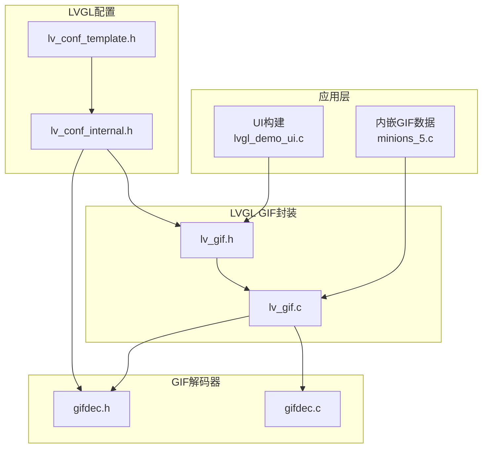
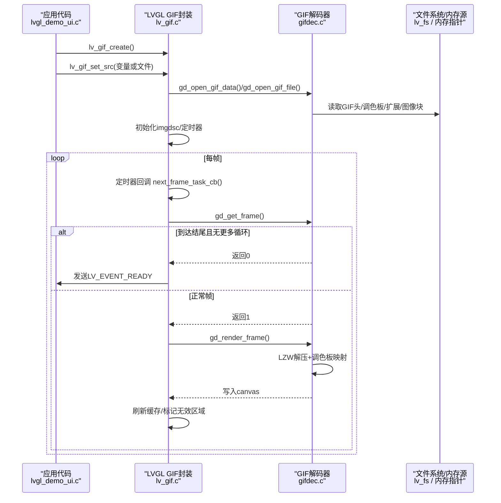
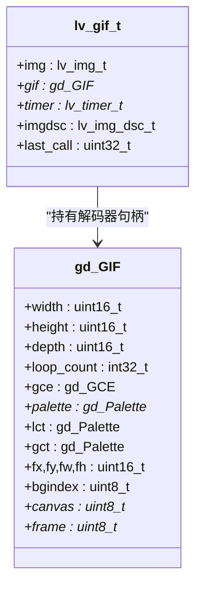
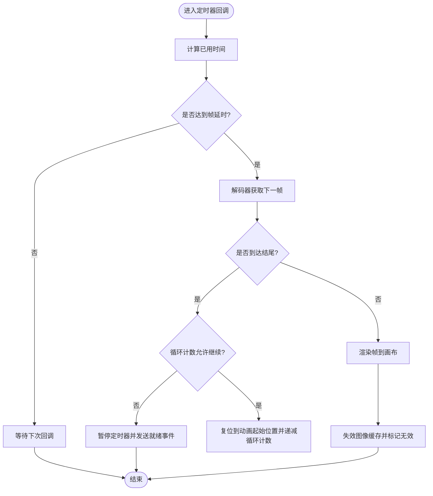
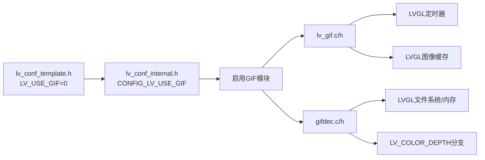

# GIF动画播放

<cite>
**本文引用的文件**   
- [lv_gif.h](file://managed_components/lvgl__lvgl/src/extra/libs/gif/lv_gif.h)
- [lv_gif.c](file://managed_components/lvgl__lvgl/src/extra/libs/gif/lv_gif.c)
- [gifdec.h](file://managed_components/lvgl__lvgl/src/extra/libs/gif/gifdec.h)
- [gifdec.c](file://managed_components/lvgl__lvgl/src/extra/libs/gif/gifdec.c)
- [lv_conf_template.h](file://managed_components/lvgl__lvgl/lv_conf_template.h)
- [lv_conf_internal.h](file://managed_components/lvgl__lvgl/src/lv_conf_internal.h)
- [lvgl_demo_ui.c](file://main/ui/lvgl_demo_ui.c)
- [minions_5.c](file://main/gif/minions_5.c)
</cite>

## 目录
1. [简介](#简介)
2. [项目结构](#项目结构)
3. [核心组件](#核心组件)
4. [架构总览](#架构总览)
5. [详细组件分析](#详细组件分析)
6. [依赖关系分析](#依赖关系分析)
7. [性能与内存优化](#性能与内存优化)
8. [GIF资源预处理与制作最佳实践](#gif资源预处理与制作最佳实践)
9. [常见问题排查指南](#常见问题排查指南)
10. [结论](#结论)

## 简介
本技术文档围绕ESP32平台上的LVGL GIF动画播放能力，系统阐述解码器集成方式、配置开关、内存布局与帧渲染流程，并给出资源预处理、尺寸与颜色深度选择、循环与时序控制等工程化建议。文档同时提供问题定位路径与优化策略，帮助在资源受限的嵌入式设备上实现稳定流畅的GIF播放体验。

## 项目结构
本项目将GIF功能作为LVGL扩展库集成，应用层通过创建GIF对象并设置源（变量或文件）驱动播放；底层由轻量级GIF解码器完成LZW解压、调色板处理、透明与处置策略、循环计数等。



图表来源
- [lvgl_demo_ui.c:490-492](file://main/ui/lvgl_demo_ui.c#L490-L492)
- [minions_5.c:24-26](file://main/gif/minions_5.c#L24-L26)
- [lv_gif.h:30-38](file://managed_components/lvgl__lvgl/src/extra/libs/gif/lv_gif.h#L30-L38)
- [lv_gif.c:49-96](file://managed_components/lvgl__lvgl/src/extra/libs/gif/lv_gif.c#L49-L96)
- [gifdec.h:24-46](file://managed_components/lvgl__lvgl/src/extra/libs/gif/gifdec.h#L24-L46)
- [gifdec.c:68-169](file://managed_components/lvgl__lvgl/src/extra/libs/gif/gifdec.c#L68-L169)
- [lv_conf_template.h:658-659](file://managed_components/lvgl__lvgl/lv_conf_template.h#L658-L659)
- [lv_conf_internal.h:2155-2159](file://managed_components/lvgl__lvgl/src/lv_conf_internal.h#L2155-L2159)

章节来源
- [lvgl_demo_ui.c:490-492](file://main/ui/lvgl_demo_ui.c#L490-L492)
- [minions_5.c:24-26](file://main/gif/minions_5.c#L24-L26)
- [lv_gif.h:30-38](file://managed_components/lvgl__lvgl/src/extra/libs/gif/lv_gif.h#L30-L38)
- [lv_gif.c:49-96](file://managed_components/lvgl__lvgl/src/extra/libs/gif/lv_gif.c#L49-L96)
- [gifdec.h:24-46](file://managed_components/lvgl__lvgl/src/extra/libs/gif/gifdec.h#L24-L46)
- [gifdec.c:68-169](file://managed_components/lvgl__lvgl/src/extra/libs/gif/gifdec.c#L68-L169)
- [lv_conf_template.h:658-659](file://managed_components/lvgl__lvgl/lv_conf_template.h#L658-L659)
- [lv_conf_internal.h:2155-2159](file://managed_components/lvgl__lvgl/src/lv_conf_internal.h#L2155-L2159)

## 核心组件
- LVGL GIF对象封装：提供创建、设置源、重启、定时器驱动下一帧等API，内部维护一个定时器用于按帧延时调度。
- GIF解码器：负责解析GIF头、全局/局部调色板、图形控制扩展（延时、透明、处置）、图像块（含LZW解压）、循环计数与回放结束事件。
- 配置开关：通过LV_USE_GIF启用/禁用GIF支持，默认模板中为关闭，需显式开启。

章节来源
- [lv_gif.h:30-38](file://managed_components/lvgl__lvgl/src/extra/libs/gif/lv_gif.h#L30-L38)
- [lv_gif.c:49-96](file://managed_components/lvgl__lvgl/src/extra/libs/gif/lv_gif.c#L49-L96)
- [gifdec.h:24-46](file://managed_components/lvgl__lvgl/src/extra/libs/gif/gifdec.h#L24-L46)
- [gifdec.c:68-169](file://managed_components/lvgl__lvgl/src/extra/libs/gif/gifdec.c#L68-L169)
- [lv_conf_template.h:658-659](file://managed_components/lvgl__lvgl/lv_conf_template.h#L658-L659)
- [lv_conf_internal.h:2155-2159](file://managed_components/lvgl__lvgl/src/lv_conf_internal.h#L2155-L2159)

## 架构总览
从应用到渲染的关键调用链如下：



图表来源
- [lvgl_demo_ui.c:490-492](file://main/ui/lvgl_demo_ui.c#L490-L492)
- [lv_gif.c:58-96](file://managed_components/lvgl__lvgl/src/extra/libs/gif/lv_gif.c#L58-L96)
- [lv_gif.c:131-152](file://managed_components/lvgl__lvgl/src/extra/libs/gif/lv_gif.c#L131-L152)
- [gifdec.c:572-598](file://managed_components/lvgl__lvgl/src/extra/libs/gif/gifdec.c#L572-L598)
- [gifdec.c:600-613](file://managed_components/lvgl__lvgl/src/extra/libs/gif/gifdec.c#L600-L613)

## 详细组件分析

### LVGL GIF对象与生命周期
- 对象类继承自图片对象，实例包含解码器句柄、定时器、图像描述符及上次调用时间戳。
- 构造时创建低优先级定时器（默认周期较短），初始处于暂停状态；析构时释放解码器与定时器，并失效图像缓存。
- 设置源时根据类型选择内存数据或文件路径打开解码器，填充图像描述符（宽度、高度、像素格式），启动并重置定时器，立即触发首帧。



图表来源
- [lv_gif.h:30-38](file://managed_components/lvgl__lvgl/src/extra/libs/gif/lv_gif.h#L30-L38)
- [gifdec.h:24-46](file://managed_components/lvgl__lvgl/src/extra/libs/gif/gifdec.h#L24-L46)

章节来源
- [lv_gif.c:110-129](file://managed_components/lvgl__lvgl/src/extra/libs/gif/lv_gif.c#L110-L129)
- [lv_gif.c:58-96](file://managed_components/lvgl__lvgl/src/extra/libs/gif/lv_gif.c#L58-L96)
- [lv_gif.h:30-38](file://managed_components/lvgl__lvgl/src/extra/libs/gif/lv_gif.h#L30-L38)
- [gifdec.h:24-46](file://managed_components/lvgl__lvgl/src/extra/libs/gif/gifdec.h#L24-L46)

### 帧调度与循环逻辑
- 定时器回调计算距上次调用的时间差，若小于当前帧延时则等待；否则推进到下一帧。
- 获取下一帧时，解码器先执行“处置”操作（恢复背景色或保留上一帧），再解析图像块。
- 当遇到GIF尾块时，依据循环计数决定继续回放或停止；停止时向对象发送“就绪”事件并暂停定时器。
- 渲染完成后使图像缓存失效并标记对象无效以触发重绘。



图表来源
- [lv_gif.c:131-152](file://managed_components/lvgl__lvgl/src/extra/libs/gif/lv_gif.c#L131-L152)
- [gifdec.c:572-598](file://managed_components/lvgl__lvgl/src/extra/libs/gif/gifdec.c#L572-L598)

章节来源
- [lv_gif.c:131-152](file://managed_components/lvgl__lvgl/src/extra/libs/gif/lv_gif.c#L131-L152)
- [gifdec.c:572-598](file://managed_components/lvgl__lvgl/src/extra/libs/gif/gifdec.c#L572-L598)

### 解码器关键流程
- 打开与初始化：校验签名与版本，解析宽高、全局调色板大小、背景索引，分配连续内存（包含画布与临时帧缓冲），按目标颜色深度预填背景。
- 扩展块处理：文本、注释、应用块（含NETSCAPE循环计数）、图形控制扩展（延时、透明索引、处置模式）。
- 图像块解析：读取图像描述符（偏移、尺寸、交错标志、局部调色板），LZW解压至帧缓冲，按处置策略合并到画布。
- 渲染输出：遍历帧矩形区域，按调色板映射为目标颜色深度格式，跳过透明索引。

```mermaid
flowchart TD
Open["打开GIF(文件/内存)"] --> Header["解析头部/全局调色板/背景索引"]
Header --> Alloc["分配画布与帧缓冲(按颜色深度)"]
Alloc --> ExtLoop{"读取扩展块"}
ExtLoop --> |图形控制| GCE["解析延时/透明/处置"]
ExtLoop --> |应用(NETSCAPE)| LOOP["解析循环计数"]
ExtLoop --> |其他| Discard["丢弃子块"]
GCE --> ImageBlock["读取图像块"]
LOOP --> ImageBlock
Discard --> ImageBlock
ImageBlock --> LZW["LZW解压到帧缓冲"]
LZW --> Dispose["按处置策略更新画布"]
Dispose --> Render["按调色板映射到目标格式"]
Render --> Next{"是否还有帧?"}
Next --> |是| ExtLoop
Next --> |否| Close["关闭并释放资源"]
```

图表来源
- [gifdec.c:68-169](file://managed_components/lvgl__lvgl/src/extra/libs/gif/gifdec.c#L68-L169)
- [gifdec.c:209-297](file://managed_components/lvgl__lvgl/src/extra/libs/gif/gifdec.c#L209-L297)
- [gifdec.c:464-488](file://managed_components/lvgl__lvgl/src/extra/libs/gif/gifdec.c#L464-L488)
- [gifdec.c:490-524](file://managed_components/lvgl__lvgl/src/extra/libs/gif/gifdec.c#L490-L524)
- [gifdec.c:526-570](file://managed_components/lvgl__lvgl/src/extra/libs/gif/gifdec.c#L526-L570)

章节来源
- [gifdec.c:68-169](file://managed_components/lvgl__lvgl/src/extra/libs/gif/gifdec.c#L68-L169)
- [gifdec.c:209-297](file://managed_components/lvgl__lvgl/src/extra/libs/gif/gifdec.c#L209-L297)
- [gifdec.c:464-488](file://managed_components/lvgl__lvgl/src/extra/libs/gif/gifdec.c#L464-L488)
- [gifdec.c:490-524](file://managed_components/lvgl__lvgl/src/extra/libs/gif/gifdec.c#L490-L524)
- [gifdec.c:526-570](file://managed_components/lvgl__lvgl/src/extra/libs/gif/gifdec.c#L526-L570)

### 应用层使用示例
- 在UI中创建GIF对象，设置源为内嵌变量（如minions_5），并对齐显示。
- 也可通过文件路径加载外部GIF，但需确保文件系统可用。

章节来源
- [lvgl_demo_ui.c:490-492](file://main/ui/lvgl_demo_ui.c#L490-L492)
- [minions_5.c:24-26](file://main/gif/minions_5.c#L24-L26)

## 依赖关系分析
- 编译期开关：LV_USE_GIF控制是否编译GIF相关代码。模板中默认关闭，需在配置中启用。
- 运行时依赖：LVGL文件系统接口（文件模式）或内存指针（变量模式）；LVGL定时器与图像缓存机制。
- 颜色深度适配：解码器根据LV_COLOR_DEPTH分支生成不同目标格式，影响内存布局与渲染路径。



图表来源
- [lv_conf_template.h:658-659](file://managed_components/lvgl__lvgl/lv_conf_template.h#L658-L659)
- [lv_conf_internal.h:2155-2159](file://managed_components/lvgl__lvgl/src/lv_conf_internal.h#L2155-L2159)
- [lv_gif.c:110-129](file://managed_components/lvgl__lvgl/src/extra/libs/gif/lv_gif.c#L110-L129)
- [gifdec.c:110-169](file://managed_components/lvgl__lvgl/src/extra/libs/gif/gifdec.c#L110-L169)

章节来源
- [lv_conf_template.h:658-659](file://managed_components/lvgl__lvgl/lv_conf_template.h#L658-L659)
- [lv_conf_internal.h:2155-2159](file://managed_components/lvgl__lvgl/src/lv_conf_internal.h#L2155-L2159)
- [lv_gif.c:110-129](file://managed_components/lvgl__lvgl/src/extra/libs/gif/lv_gif.c#L110-L129)
- [gifdec.c:110-169](file://managed_components/lvgl__lvgl/src/extra/libs/gif/gifdec.c#L110-L169)

## 性能与内存优化
- 内存布局
  - 解码器在打开时一次性分配“画布+帧缓冲”，大小随LV_COLOR_DEPTH变化：32位最深，16位次之，8/1位最省。
  - 建议在满足视觉需求的前提下选择较低颜色深度，以降低RAM占用与带宽压力。
- 帧渲染
  - 仅对帧矩形区域进行调色板映射与写入，避免全图拷贝；透明索引可跳过写入。
  - 渲染后使图像缓存失效并标记对象无效，减少不必要的重复绘制。
- 时序控制
  - 基于帧延时（毫秒×10）与系统滴答比较，避免频繁唤醒；合理设置GIF帧延时可减少CPU占用。
- 循环与事件
  - 循环结束后发送“就绪”事件，可在业务层做资源回收或切换场景，避免长时间占用解码器。

章节来源
- [gifdec.c:110-169](file://managed_components/lvgl__lvgl/src/extra/libs/gif/gifdec.c#L110-L169)
- [gifdec.c:490-524](file://managed_components/lvgl__lvgl/src/extra/libs/gif/gifdec.c#L490-L524)
- [lv_gif.c:131-152](file://managed_components/lvgl__lvgl/src/extra/libs/gif/lv_gif.c#L131-L152)

## GIF资源预处理与制作最佳实践
- 尺寸优化
  - 优先缩小分辨率，尤其是长边超过屏幕显示区域的GIF会显著增加解码与渲染开销。
- 颜色深度与调色板
  - 尽量限制颜色数量，减小全局/局部调色板规模；避免过多局部调色板切换。
- 帧延时与循环
  - 合理设置帧延时（通常≥50ms）以减少CPU占用；明确循环次数，避免无限循环导致资源长期占用。
- 透明与处置
  - 谨慎使用透明与复杂处置策略，确保相邻帧差异较小，有利于减少解码工作量。
- 存储形式
  - 小体积GIF可直接内嵌为C数组（变量源），避免文件系统IO；大体积GIF建议使用文件源并保证文件系统可靠。
- 文件大小控制
  - 使用工具压缩GIF（如减少颜色数、去除冗余帧、调整帧延时），在保证观感前提下尽量降低字节数。

[本节为通用指导，不直接分析具体文件]

## 常见问题排查指南
- 无法编译或运行GIF功能
  - 检查LV_USE_GIF是否启用；模板中默认关闭，需在配置中开启。
  - 确认lv_conf_internal.h正确将宏传递到模块。
- 资源加载失败
  - 变量源：确认LV_IMG_DECLARE声明与实际数组一致。
  - 文件源：确认路径存在、文件系统可用、权限正确。
- 内存不足或崩溃
  - 评估LV_COLOR_DEPTH与GIF分辨率导致的内存峰值；必要时降低颜色深度或分辨率。
  - 避免同时播放过多GIF对象，及时销毁不再使用的对象。
- 播放卡顿
  - 检查GIF帧延时是否过小；适当增大延时。
  - 减少同屏GIF数量或降低分辨率/颜色深度。
- 播放结束后行为异常
  - 监听LV_EVENT_READY事件，在回调中执行清理或跳转逻辑。

章节来源
- [lv_conf_template.h:658-659](file://managed_components/lvgl__lvgl/lv_conf_template.h#L658-L659)
- [lv_conf_internal.h:2155-2159](file://managed_components/lvgl__lvgl/src/lv_conf_internal.h#L2155-L2159)
- [lv_gif.c:58-96](file://managed_components/lvgl__lvgl/src/extra/libs/gif/lv_gif.c#L58-L96)
- [lv_gif.c:131-152](file://managed_components/lvgl__lvgl/src/extra/libs/gif/lv_gif.c#L131-L152)

## 结论
通过将LVGL GIF封装与轻量解码器结合，项目在ESP32平台上实现了可控的GIF播放能力。借助合理的配置开关、颜色深度选择、帧延时与循环控制，以及资源预处理与内存布局优化，可以在有限资源下获得稳定的动画效果。建议在工程中统一规范GIF资源制作流程，并在应用层完善事件处理与资源管理，以获得更佳的用户体验与系统稳定性。