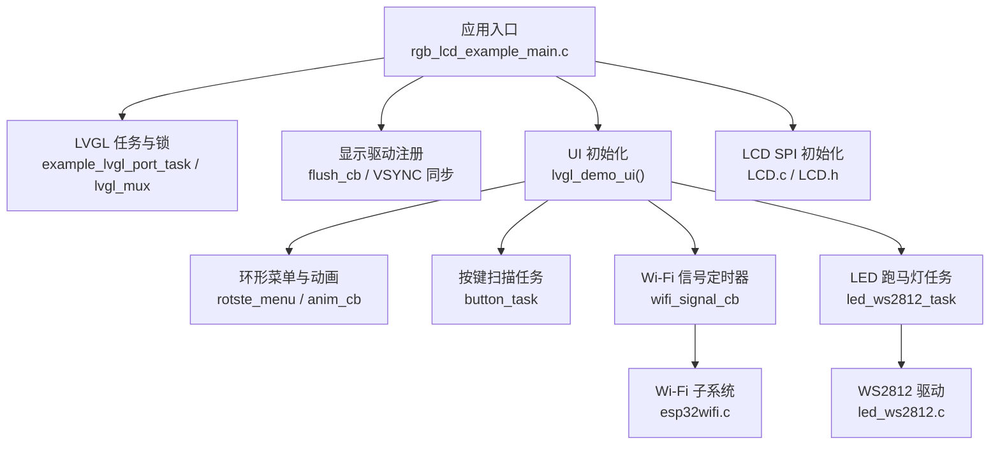
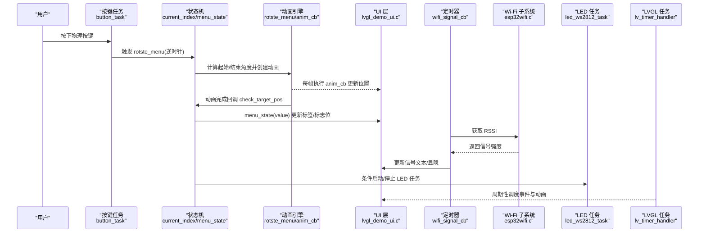
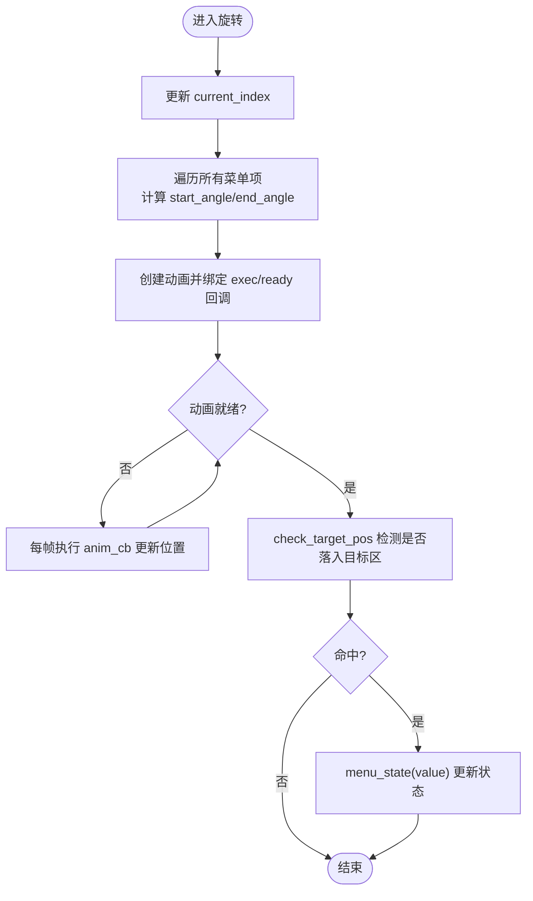
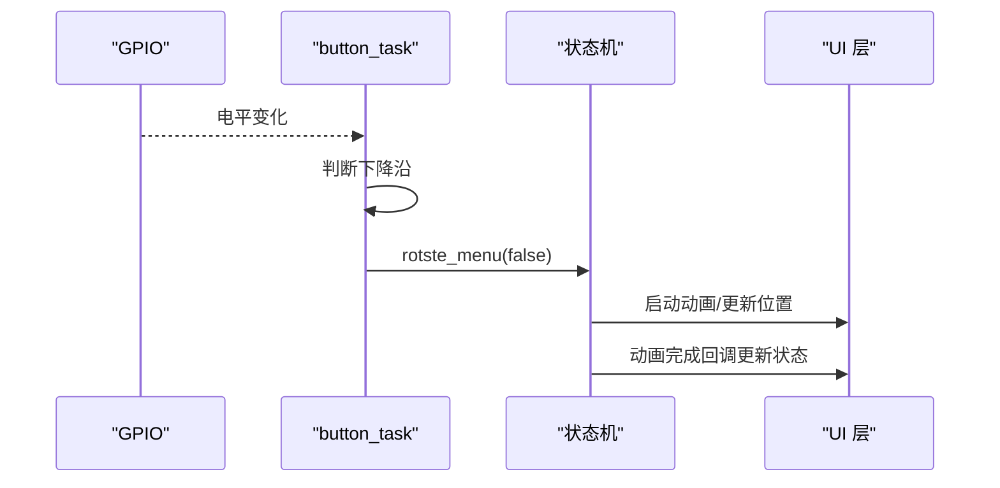
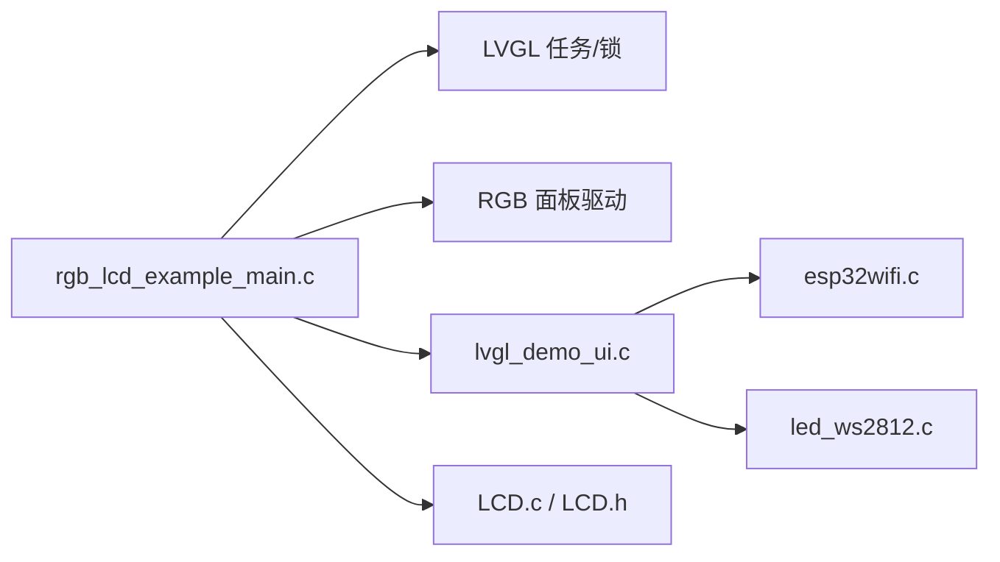

# UI状态管理

<cite>
**本文引用的文件**
- [rgb_lcd_example_main.c](file://ESP32开发板/TK021F2699_ESP32_LVGL_GIF_LED/TK021F2699_ESP32_LVGL_GIF_LED/main/rgb_lcd_example_main.c)
- [lvgl_demo_ui.c](file://ESP32开发板/TK021F2699_ESP32_LVGL_GIF_LED/TK021F2699_ESP32_LVGL_GIF_LED/main/ui/lvgl_demo_ui.c)
- [lvgl_gif_demo.c](file://ESP32开发板/TK021F2699_ESP32_LVGL_GIF_LED/TK021F2699_ESP32_LVGL_GIF_LED/main/ui/lvgl_gif_demo.c)
- [LCD.c](file://ESP32开发板/TK021F2699_ESP32_LVGL_GIF_LED/TK021F2699_ESP32_LVGL_GIF_LED/main/LCD.c)
- [LCD.h](file://ESP32开发板/TK021F2699_ESP32_LVGL_GIF_LED/TK021F2699_ESP32_LVGL_GIF_LED/main/LCD.h)
- [esp32wifi.c](file://ESP32开发板/TK021F2699_ESP32_LVGL_GIF_LED/TK021F2699_ESP32_LVGL_GIF_LED/main/wifi/esp32wifi.c)
- [led_ws2812.c](file://ESP32开发板/TK021F2699_ESP32_LVGL_GIF_LED/TK021F2699_ESP32_LVGL_GIF_LED/main/led_ws2812/led_ws2812.c)
</cite>

## 目录
1. [简介](#简介)
2. [项目结构](#项目结构)
3. [核心组件](#核心组件)
4. [架构总览](#架构总览)
5. [详细组件分析](#详细组件分析)
6. [依赖关系分析](#依赖关系分析)
7. [性能与实时性](#性能与实时性)
8. [故障排查指南](#故障排查指南)
9. [结论](#结论)
10. [附录](#附录)

## 简介
本设计文档围绕 ESP32 + LVGL 的环形菜单 UI 状态管理系统，系统化阐述界面状态机、页面跳转与数据传递、用户输入处理、状态同步机制以及最佳实践。系统基于 FreeRTOS 多任务模型，使用 LVGL 事件与定时器驱动 UI 更新，结合 Wi-Fi 信号轮询与 WS2812 LED 控制，形成“输入—状态机—渲染—外设”的闭环。

## 项目结构
- 应用入口与 LVGL 端口：负责初始化显示、LVGL 任务、刷新回调、Tick 定时器等
- UI 层：环形菜单布局、动画、按键扫描、状态标签、Wi-Fi 信号展示、GIF 装饰
- 硬件抽象：LCD SPI 初始化（用于面板配置）、RGB 面板驱动（由 ESP-IDF 提供）
- 子系统：Wi-Fi STA 连接与 RSSI 获取；WS2812 灯带 RMT 编码与写入

图表来源
- [rgb_lcd_example_main.c:150-303](file://ESP32开发板/TK021F2699_ESP32_LVGL_GIF_LED/TK021F2699_ESP32_LVGL_GIF_LED/main/rgb_lcd_example_main.c#L150-L303)
- [lvgl_demo_ui.c:297-496](file://ESP32开发板/TK021F2699_ESP32_LVGL_GIF_LED/TK021F2699_ESP32_LVGL_GIF_LED/main/ui/lvgl_demo_ui.c#L297-L496)
- [lcd.c:205-219](file://ESP32开发板/TK021F2699_ESP32_LVGL_GIF_LED/TK021F2699_ESP32_LVGL_GIF_LED/main/LCD.c#L205-L219)
- [esp32wifi.c:46-109](file://ESP32开发板/TK021F2699_ESP32_LVGL_GIF_LED/TK021F2699_ESP32_LVGL_GIF_LED/main/wifi/esp32wifi.c#L46-L109)
- [led_ws2812.c:179-252](file://ESP32开发板/TK021F2699_ESP32_LVGL_GIF_LED/TK021F2699_ESP32_LVGL_GIF_LED/main/led_ws2812/led_ws2812.c#L179-L252)

章节来源
- [rgb_lcd_example_main.c:150-303](file://ESP32开发板/TK021F2699_ESP32_LVGL_GIF_LED/TK021F2699_ESP32_LVGL_GIF_LED/main/rgb_lcd_example_main.c#L150-L303)
- [lvgl_demo_ui.c:297-496](file://ESP32开发板/TK021F2699_ESP32_LVGL_GIF_LED/TK021F2699_ESP32_LVGL_GIF_LED/main/ui/lvgl_demo_ui.c#L297-L496)
- [lcd.c:205-219](file://ESP32开发板/TK021F2699_ESP32_LVGL_GIF_LED/TK021F2699_ESP32_LVGL_GIF_LED/main/LCD.c#L205-L219)
- [esp32wifi.c:46-109](file://ESP32开发板/TK021F2699_ESP32_LVGL_GIF_LED/TK021F2699_ESP32_LVGL_GIF_LED/main/wifi/esp32wifi.c#L46-L109)
- [led_ws2812.c:179-252](file://ESP32开发板/TK021F2699_ESP32_LVGL_GIF_LED/TK021F2699_ESP32_LVGL_GIF_LED/main/led_ws2812/led_ws2812.c#L179-L252)

## 核心组件
- 应用入口与 LVGL 端口
  - 创建并运行 LVGL 任务，周期性调用 lv_timer_handler
  - 通过递归互斥量 lvgl_mux 保护 LVGL API 的线程安全访问
  - 注册 flush_cb 将绘制缓冲区拷贝到 RGB 面板，支持可选 VSYNC 同步避免撕裂
- UI 状态机与环形菜单
  - 维护当前选中索引 current_index，按顺时针/逆时针旋转菜单项角度
  - 动画完成后检测是否落入目标区域，触发 menu_state 切换功能状态
  - 根据状态更新顶部文本、隐藏/显示 Wi-Fi 信号、启动/停止 LED 任务
- 输入处理
  - 独立按键任务以固定周期轮询 GPIO，检测下降沿触发菜单旋转
- 外部子系统
  - Wi-Fi：STA 模式初始化、自动重连、RSSI 读取
  - WS2812：RMT 编码器生成时序，后台发送 GRB 数据

章节来源
- [rgb_lcd_example_main.c:117-148](file://ESP32开发板/TK021F2699_ESP32_LVGL_GIF_LED/TK021F2699_ESP32_LVGL_GIF_LED/main/rgb_lcd_example_main.c#L117-L148)
- [lvgl_demo_ui.c:77-246](file://ESP32开发板/TK021F2699_ESP32_LVGL_GIF_LED/TK021F2699_ESP32_LVGL_GIF_LED/main/ui/lvgl_demo_ui.c#L77-L246)
- [lvgl_demo_ui.c:262-295](file://ESP32开发板/TK021F2699_ESP32_LVGL_GIF_LED/TK021F2699_ESP32_LVGL_GIF_LED/main/ui/lvgl_demo_ui.c#L262-L295)
- [esp32wifi.c:46-109](file://ESP32开发板/TK021F2699_ESP32_LVGL_GIF_LED/TK021F2699_ESP32_LVGL_GIF_LED/main/wifi/esp32wifi.c#L46-L109)
- [led_ws2812.c:179-252](file://ESP32开发板/TK021F2699_ESP32_LVGL_GIF_LED/TK021F2699_ESP32_LVGL_GIF_LED/main/led_ws2812/led_ws2812.c#L179-L252)

## 架构总览
下图展示了从输入到状态变更再到渲染与外设控制的完整链路。

图表来源
- [lvgl_demo_ui.c:224-246](file://ESP32开发板/TK021F2699_ESP32_LVGL_GIF_LED/TK021F2699_ESP32_LVGL_GIF_LED/main/ui/lvgl_demo_ui.c#L224-L246)
- [lvgl_demo_ui.c:249-260](file://ESP32开发板/TK021F2699_ESP32_LVGL_GIF_LED/TK021F2699_ESP32_LVGL_GIF_LED/main/ui/lvgl_demo_ui.c#L249-L260)
- [esp32wifi.c:98-109](file://ESP32开发板/TK021F2699_ESP32_LVGL_GIF_LED/TK021F2699_ESP32_LVGL_GIF_LED/main/wifi/esp32wifi.c#L98-L109)
- [lvgl_demo_ui.c:84-124](file://ESP32开发板/TK021F2699_ESP32_LVGL_GIF_LED/TK021F2699_ESP32_LVGL_GIF_LED/main/ui/lvgl_demo_ui.c#L84-L124)
- [rgb_lcd_example_main.c:130-148](file://ESP32开发板/TK021F2699_ESP32_LVGL_GIF_LED/TK021F2699_ESP32_LVGL_GIF_LED/main/rgb_lcd_example_main.c#L130-L148)

## 详细组件分析

### 界面状态机设计与实现
- 状态定义
  - 当前选中索引 current_index：表示环形菜单中处于“目标位置”的菜单项
  - 功能标志位：如 wifi_flag、ws2812_flag，控制 UI 显隐与外设行为
  - 状态标签 ui_state_label：显示当前功能名称
- 转换条件与触发机制
  - 输入触发：按键任务检测到下降沿后调用 rotste_menu(false)
  - 动画判定：check_target_pos 在动画完成后检查各菜单项坐标是否落入目标区域，命中则调用 menu_state(i)
  - 状态动作：menu_state 根据 value 更新标签文本、设置标志位、必要时创建 LED 任务
- 复杂度与稳定性
  - 时间复杂度：每次旋转为 O(N)，N 为菜单项数量（本项目 N=10）
  - 空间复杂度：O(N) 存储菜单对象指针
  - 并发安全：状态变量为静态局部，仅在 LVGL 主线程或低优先级任务中读写，未加锁；建议后续引入互斥保护

图表来源
- [lvgl_demo_ui.c:224-246](file://ESP32开发板/TK021F2699_ESP32_LVGL_GIF_LED/TK021F2699_ESP32_LVGL_GIF_LED/main/ui/lvgl_demo_ui.c#L224-L246)
- [lvgl_demo_ui.c:189-209](file://ESP32开发板/TK021F2699_ESP32_LVGL_GIF_LED/TK021F2699_ESP32_LVGL_GIF_LED/main/ui/lvgl_demo_ui.c#L189-L209)
- [lvgl_demo_ui.c:152-186](file://ESP32开发板/TK021F2699_ESP32_LVGL_GIF_LED/TK021F2699_ESP32_LVGL_GIF_LED/main/ui/lvgl_demo_ui.c#L152-L186)

章节来源
- [lvgl_demo_ui.c:77-246](file://ESP32开发板/TK021F2699_ESP32_LVGL_GIF_LED/TK021F2699_ESP32_LVGL_GIF_LED/main/ui/lvgl_demo_ui.c#L77-L246)

### 页面跳转逻辑与数据传递
- 页面组织
  - 当前采用单屏环形菜单，无传统意义上的“页面栈”。若需多级导航，可参考 LVGL 官方菜单组件 lv_menu 的历史栈与深度管理
- 参数传递
  - 通过全局/静态变量传递状态（如 current_index、wifi_flag、ws2812_flag）
  - 如需跨模块传递结构化数据，建议使用消息队列或事件总线
- 持久化与回退
  - 当前未实现状态持久化；建议在 NVS 中保存 last_selected_index 与关键开关
  - 回退策略：可记录历史选择序列，支持“上一步”操作

章节来源
- [lvgl_demo_ui.c:77-246](file://ESP32开发板/TK021F2699_ESP32_LVGL_GIF_LED/TK021F2699_ESP32_LVGL_GIF_LED/main/ui/lvgl_demo_ui.c#L77-L246)
- [lvgl_gif_demo.c:12-47](file://ESP32开发板/TK021F2699_ESP32_LVGL_GIF_LED/TK021F2699_ESP32_LVGL_GIF_LED/main/ui/lvgl_gif_demo.c#L12-L47)

### 用户输入处理流程
- 按键捕获
  - button_task 以固定周期轮询 GPIO，检测下降沿触发菜单旋转
  - 防抖策略：通过固定周期采样与边沿检测实现简单去抖
- 多级菜单导航
  - 当前仅支持单层环形菜单；扩展时可引入 lv_menu 或自定义页栈
- 输入到状态的映射
  - 一次按键 → 一次旋转 → 动画完成 → 命中检测 → 状态切换

图表来源
- [lvgl_demo_ui.c:262-295](file://ESP32开发板/TK021F2699_ESP32_LVGL_GIF_LED/TK021F2699_ESP32_LVGL_GIF_LED/main/ui/lvgl_demo_ui.c#L262-L295)
- [lvgl_demo_ui.c:224-246](file://ESP32开发板/TK021F2699_ESP32_LVGL_GIF_LED/TK021F2699_ESP32_LVGL_GIF_LED/main/ui/lvgl_demo_ui.c#L224-L246)

章节来源
- [lvgl_demo_ui.c:262-295](file://ESP32开发板/TK021F2699_ESP32_LVGL_GIF_LED/TK021F2699_ESP32_LVGL_GIF_LED/main/ui/lvgl_demo_ui.c#L262-L295)

### 状态同步机制
- 跨任务通信
  - 当前通过全局变量共享状态（current_index、wifi_flag、ws2812_flag），存在潜在竞态风险
  - 建议方案：
    - 使用 FreeRTOS 队列/事件组在任务间传递状态变更
    - 对共享状态加递归互斥锁（复用 lvgl_mux）或专用自旋锁
- 实时更新
  - Wi-Fi 信号通过 lv_timer 每秒轮询，更新 UI 文本与显隐
  - LED 跑马灯通过独立任务循环写入，避免阻塞 UI
- 冲突解决策略
  - 统一状态源：所有状态变更集中在状态机函数内完成
  - 原子更新：对关键标志位进行临界区保护
  - 幂等设计：重复触发同一状态不产生副作用

章节来源
- [lvgl_demo_ui.c:249-260](file://ESP32开发板/TK021F2699_ESP32_LVGL_GIF_LED/TK021F2699_ESP32_LVGL_GIF_LED/main/ui/lvgl_demo_ui.c#L249-L260)
- [lvgl_demo_ui.c:84-124](file://ESP32开发板/TK021F2699_ESP32_LVGL_GIF_LED/TK021F2699_ESP32_LVGL_GIF_LED/main/ui/lvgl_demo_ui.c#L84-L124)
- [rgb_lcd_example_main.c:117-148](file://ESP32开发板/TK021F2699_ESP32_LVGL_GIF_LED/TK021F2699_ESP32_LVGL_GIF_LED/main/rgb_lcd_example_main.c#L117-L148)

### 最佳实践
- 状态验证
  - 边界检查：确保 current_index 始终在 [0, MENU_ITEM_COUNT) 范围内
  - 参数校验：menu_state 的 value 应做范围校验
- 错误处理
  - 资源分配失败：任务创建、内存分配失败时记录日志并降级
  - 外设异常：Wi-Fi 获取 RSSI 失败时返回默认值并提示
- 调试技巧
  - 增加状态日志：在状态切换点打印当前索引与标签
  - 可视化调试：临时显示坐标信息辅助定位命中逻辑
  - 断言与阈值：对动画结束回调中的坐标判定加入容差

章节来源
- [lvgl_demo_ui.c:152-186](file://ESP32开发板/TK021F2699_ESP32_LVGL_GIF_LED/TK021F2699_ESP32_LVGL_GIF_LED/main/ui/lvgl_demo_ui.c#L152-L186)
- [esp32wifi.c:98-109](file://ESP32开发板/TK021F2699_ESP32_LVGL_GIF_LED/TK021F2699_ESP32_LVGL_GIF_LED/main/wifi/esp32wifi.c#L98-L109)

## 依赖关系分析
- 模块耦合
  - UI 层依赖 LVGL 事件/动画/定时器；依赖 Wi-Fi 子系统获取 RSSI；依赖 LED 驱动控制外设
  - 应用入口负责 LVGL 生命周期与显示驱动注册
- 外部依赖
  - ESP-IDF 的 esp_lcd_rgb_panel、FreeRTOS 任务/信号量、esp_timer
  - LVGL 库及其额外组件（如 GIF 播放）

图表来源
- [rgb_lcd_example_main.c:150-303](file://ESP32开发板/TK021F2699_ESP32_LVGL_GIF_LED/TK021F2699_ESP32_LVGL_GIF_LED/main/rgb_lcd_example_main.c#L150-L303)
- [lvgl_demo_ui.c:297-496](file://ESP32开发板/TK021F2699_ESP32_LVGL_GIF_LED/TK021F2699_ESP32_LVGL_GIF_LED/main/ui/lvgl_demo_ui.c#L297-L496)
- [lcd.c:205-219](file://ESP32开发板/TK021F2699_ESP32_LVGL_GIF_LED/TK021F2699_ESP32_LVGL_GIF_LED/main/LCD.c#L205-L219)

章节来源
- [rgb_lcd_example_main.c:150-303](file://ESP32开发板/TK021F2699_ESP32_LVGL_GIF_LED/TK021F2699_ESP32_LVGL_GIF_LED/main/rgb_lcd_example_main.c#L150-L303)
- [lvgl_demo_ui.c:297-496](file://ESP32开发板/TK021F2699_ESP32_LVGL_GIF_LED/TK021F2699_ESP32_LVGL_GIF_LED/main/ui/lvgl_demo_ui.c#L297-L496)
- [lcd.c:205-219](file://ESP32开发板/TK021F2699_ESP32_LVGL_GIF_LED/TK021F2699_ESP32_LVGL_GIF_LED/main/LCD.c#L205-L219)

## 性能与实时性
- LVGL 任务延迟自适应：根据 lv_timer_handler 返回值动态调整延时，平衡 CPU 占用与响应速度
- 双缓冲与全屏刷新：当启用双缓冲时，full_refresh=true 有助于维持两帧缓冲同步
- VSYNC 同步：可选信号量同步避免撕裂，代价是等待 VSYNC 带来的抖动
- 动画与定时器：动画回调与 Wi-Fi 轮询定时器均应在 LVGL 主线程上下文中执行，避免直接操作非线程安全 API

章节来源
- [rgb_lcd_example_main.c:130-148](file://ESP32开发板/TK021F2699_ESP32_LVGL_GIF_LED/TK021F2699_ESP32_LVGL_GIF_LED/main/rgb_lcd_example_main.c#L130-L148)
- [rgb_lcd_example_main.c:95-109](file://ESP32开发板/TK021F2699_ESP32_LVGL_GIF_LED/TK021F2699_ESP32_LVGL_GIF_LED/main/rgb_lcd_example_main.c#L95-L109)

## 故障排查指南
- 屏幕撕裂
  - 现象：画面出现撕裂
  - 排查：确认是否启用 VSYNC 同步与双缓冲；检查 flush_cb 中信号量配对是否正确
- 按键无响应
  - 现象：旋转菜单无效
  - 排查：检查按键任务优先级与 GPIO 配置；确认下降沿检测逻辑与消抖周期
- Wi-Fi 信号不更新
  - 现象：信号文本不变化或一直隐藏
  - 排查：检查 wifi_flag 状态；确认 get_wifi_signal_strength 返回值；查看定时器是否创建成功
- LED 跑马灯异常
  - 现象：颜色不正确或不亮
  - 排查：检查 ws2812_write 的 GRB 顺序与索引范围；确认 RMT 通道与编码器初始化成功

章节来源
- [rgb_lcd_example_main.c:95-109](file://ESP32开发板/TK021F2699_ESP32_LVGL_GIF_LED/TK021F2699_ESP32_LVGL_GIF_LED/main/rgb_lcd_example_main.c#L95-L109)
- [lvgl_demo_ui.c:262-295](file://ESP32开发板/TK021F2699_ESP32_LVGL_GIF_LED/TK021F2699_ESP32_LVGL_GIF_LED/main/ui/lvgl_demo_ui.c#L262-L295)
- [lvgl_demo_ui.c:249-260](file://ESP32开发板/TK021F2699_ESP32_LVGL_GIF_LED/TK021F2699_ESP32_LVGL_GIF_LED/main/ui/lvgl_demo_ui.c#L249-L260)
- [led_ws2812.c:236-252](file://ESP32开发板/TK021F2699_ESP32_LVGL_GIF_LED/TK021F2699_ESP32_LVGL_GIF_LED/main/led_ws2812/led_ws2812.c#L236-L252)

## 结论
该 UI 状态管理系统以 LVGL 为核心，结合 FreeRTOS 多任务与外设驱动，实现了环形菜单的状态机式交互。通过动画与回调完成状态判定，配合 Wi-Fi 与 LED 子系统形成完整的“感知—决策—执行”闭环。后续可在状态一致性、持久化与多级导航方面进一步增强，以提升系统的健壮性与可扩展性。

## 附录
- 相关概念
  - 状态机：用有限状态描述系统行为，通过事件驱动状态迁移
  - 页面栈：用于多级导航的回退与前进
  - 事件总线：解耦模块间的消息传递
- 扩展建议
  - 引入 lv_menu 组件构建标准多级菜单
  - 使用 NVS 持久化 last_selected_index 与关键开关
  - 引入消息队列替代全局变量，提升并发安全性