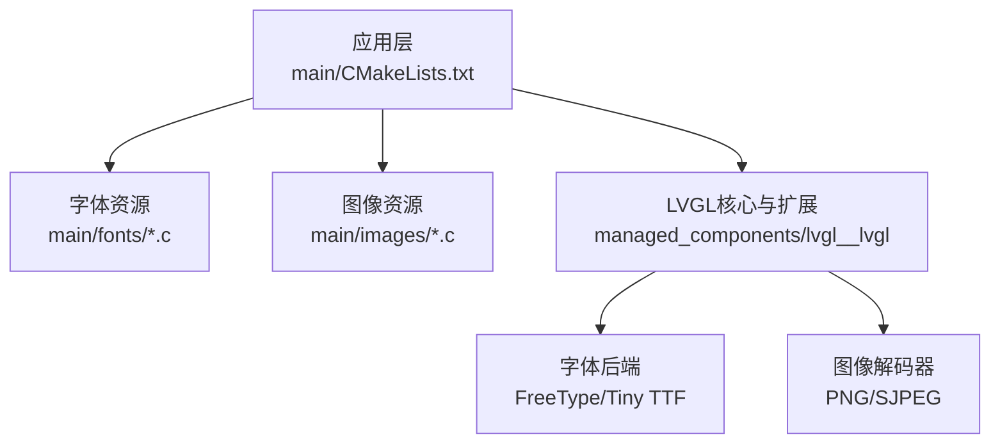
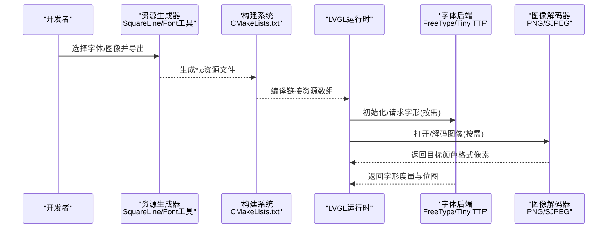
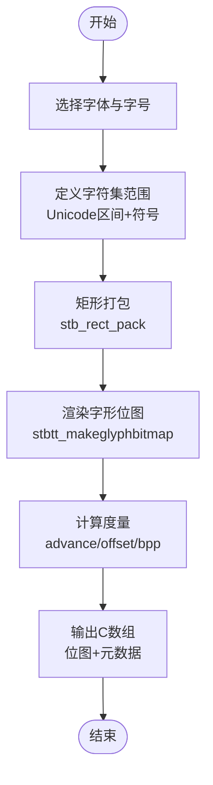
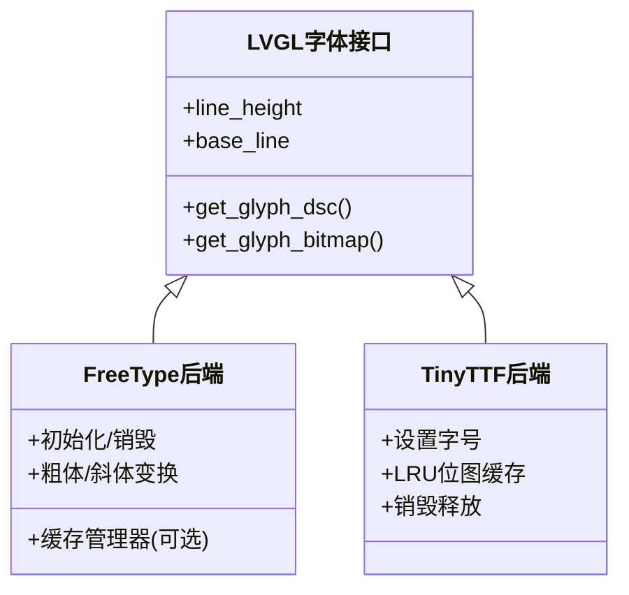
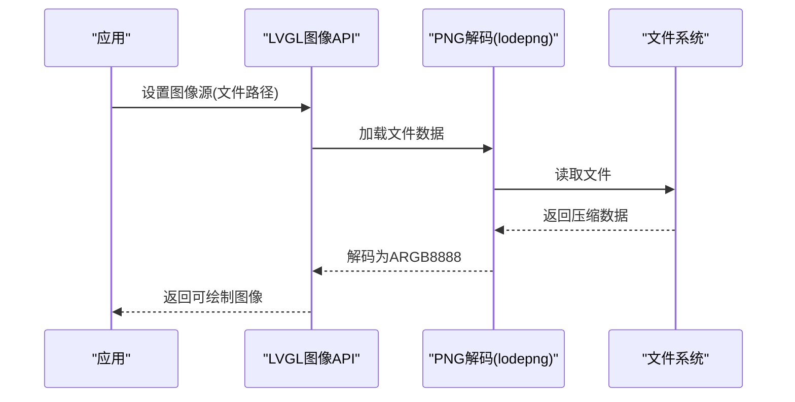
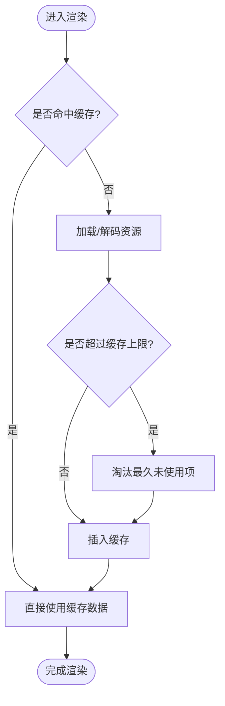
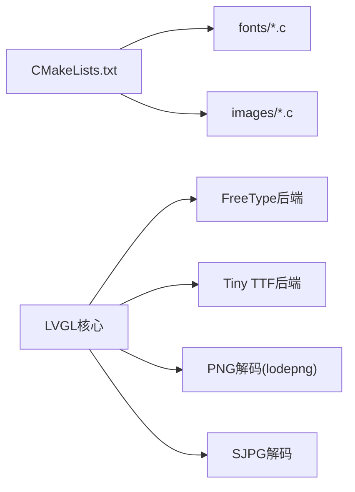

# UI资源优化

<cite>
**本文引用的文件**   
- [CMakeLists.txt](file://ESP32开发板/TK021F2699_ESP32_LVGL_GIF_LED/TK021F2699_ESP32_LVGL_GIF_LED/main/CMakeLists.txt)
- [ui_font_Alibaba_PuHuiTi_Font_14.c](file://ESP32开发板/TK021F2699_ESP32_LVGL_GIF_LED/TK021F2699_ESP32_LVGL_GIF_LED/main/fonts/ui_font_Alibaba_PuHuiTi_Font_14.c)
- [ui_img_1063244380.c](file://ESP32开发板/TK021F2699_ESP32_LVGL_GIF_LED/TK021F2699_ESP32_LVGL_GIF_LED/main/images/ui_img_1063244380.c)
- [lv_conf_template.h](file://ESP32开发板/TK021F2699_ESP32_LVGL_GIF_LED/TK021F2699_ESP32_LVGL_GIF_LED/managed_components/lvgl__lvgl/lv_conf_template.h)
- [lv_freetype.c](file://ESP32开发板/TK021F2699_ESP32_LVGL_GIF_LED/TK021F2699_ESP32_LVGL_GIF_LED/managed_components/lvgl__lvgl/src/extra/libs/freetype/lv_freetype.c)
- [lv_tiny_ttf.c](file://ESP32开发板/TK021F2699_ESP32_LVGL_GIF_LED/TK021F2699_ESP32_LVGL_GIF_LED/managed_components/lvgl__lvgl/src/extra/libs/tiny_ttf/lv_tiny_ttf.c)
- [stb_truetype_htcw.h](file://ESP32开发板/TK021F2699_ESP32_LVGL_GIF_LED/TK021F2699_ESP32_LVGL_GIF_LED/managed_components/lvgl__lvgl/src/extra/libs/tiny_ttf/stb_truetype_htcw.h)
- [lv_png.c](file://ESP32开发板/TK021F2699_ESP32_LVGL_GIF_LED/TK021F2699_ESP32_LVGL_GIF_LED/managed_components/lvgl__lvgl/src/extra/libs/png/lv_png.c)
- [lodepng.c](file://ESP32开发板/TK021F2699_ESP32_LVGL_GIF_LED/TK021F2699_ESP32_LVGL_GIF_LED/managed_components/lvgl__lvgl/src/extra/libs/png/lodepng.c)
- [lv_sjpg.c](file://ESP32开发板/TK021F2699_ESP32_LVGL_GIF_LED/TK021F2699_ESP32_LVGL_GIF_LED/managed_components/lvgl__lvgl/src/extra/libs/sjpg/lv_sjpg.c)
</cite>

## 目录
1. [简介](#简介)
2. [项目结构](#项目结构)
3. [核心组件](#核心组件)
4. [架构总览](#架构总览)
5. [详细组件分析](#详细组件分析)
6. [依赖关系分析](#依赖关系分析)
7. [性能考虑](#性能考虑)
8. [故障排查指南](#故障排查指南)
9. [结论](#结论)
10. [附录](#附录)

## 简介
本指南面向在嵌入式平台（ESP32 + LVGL）上构建UI的开发者，聚焦于字体与图像资源的生成、裁剪、压缩、内存布局与加载策略，结合仓库中的实际实现，提供可落地的优化方法与最佳实践。内容覆盖：
- 字体资源：自定义字体选择、字符集裁剪、位图打包与内存布局优化
- 图像资源：PNG/SJPEG解码路径、颜色深度适配、文件大小控制
- 加载策略：懒加载、缓存机制、内存池管理
- 组织规范：命名、版本化、依赖管理
- 性能监控与分析：定位瓶颈与调优建议

## 项目结构
本项目将UI资源以“预编译C数组”的形式集成到工程中，并通过构建系统统一注册。关键目录与职责：
- main/fonts：预生成的LVGL字体C源文件（按字号拆分）
- main/images：由设计工具导出的LVGL图像C源文件（含像素数据与描述符）
- managed_components/lvgl__lvgl：LVGL引擎及其扩展库（FreeType、Tiny TTF、PNG、SJPG等）
- CMakeLists.txt：集中声明需要编译的资源文件，确保链接入固件

图表来源
- [CMakeLists.txt:1-29](file://ESP32开发板/TK021F2699_ESP32_LVGL_GIF_LED/TK021F2699_ESP32_LVGL_GIF_LED/main/CMakeLists.txt#L1-L29)
- [lv_conf_template.h:142-148](file://ESP32开发板/TK021F2699_ESP32_LVGL_GIF_LED/TK021F2699_ESP32_LVGL_GIF_LED/managed_components/lvgl__lvgl/lv_conf_template.h#L142-L148)

章节来源
- [CMakeLists.txt:1-29](file://ESP32开发板/TK021F2699_ESP32_LVGL_GIF_LED/TK021F2699_ESP32_LVGL_GIF_LED/main/CMakeLists.txt#L1-L29)

## 核心组件
- 字体子系统
  - FreeType后端：支持运行时动态字形渲染、可选缓存、粗体/斜体变换
  - Tiny TTF后端：轻量级TTF解析与位图打包，内置LRU位图缓存
- 图像子系统
  - PNG解码：基于lodepng，支持从文件加载并解码为ARGB8888
  - SJPEG解码：流式分块解码，适配不同颜色深度
- 配置与内存
  - LVGL全局配置：颜色深度、内存池大小、图片缓存、图层缓冲等
  - 资源编译期嵌入：通过CMakeLists.txt显式注册，减少运行时I/O

章节来源
- [lv_freetype.c:161-177](file://ESP32开发板/TK021F2699_ESP32_LVGL_GIF_LED/TK021F2699_ESP32_LVGL_GIF_LED/managed_components/lvgl__lvgl/src/extra/libs/freetype/lv_freetype.c#L161-L177)
- [lv_tiny_ttf.c:254-284](file://ESP32开发板/TK021F2699_ESP32_LVGL_GIF_LED/TK021F2699_ESP32_LVGL_GIF_LED/managed_components/lvgl__lvgl/src/extra/libs/tiny_ttf/lv_tiny_ttf.c#L254-L284)
- [lv_png.c:159-182](file://ESP32开发板/TK021F2699_ESP32_LVGL_GIF_LED/TK021F2699_ESP32_LVGL_GIF_LED/managed_components/lvgl__lvgl/src/extra/libs/png/lv_png.c#L159-L182)
- [lv_sjpg.c:755-800](file://ESP32开发板/TK021F2699_ESP32_LVGL_GIF_LED/TK021F2699_ESP32_LVGL_GIF_LED/managed_components/lvgl__lvgl/src/extra/libs/sjpg/lv_sjpg.c#L755-L800)
- [lv_conf_template.h:26-27](file://ESP32开发板/TK021F2699_ESP32_LVGL_GIF_LED/TK021F2699_ESP32_LVGL_GIF_LED/managed_components/lvgl__lvgl/lv_conf_template.h#L26-L27)
- [lv_conf_template.h:48-67](file://ESP32开发板/TK021F2699_ESP32_LVGL_GIF_LED/TK021F2699_ESP32_LVGL_GIF_LED/managed_components/lvgl__lvgl/lv_conf_template.h#L48-L67)
- [lv_conf_template.h:142-148](file://ESP32开发板/TK021F2699_ESP32_LVGL_GIF_LED/TK021F2699_ESP32_LVGL_GIF_LED/managed_components/lvgl__lvgl/lv_conf_template.h#L142-L148)

## 架构总览
下图展示资源从“设计/生成”到“运行期使用”的关键路径，包括字体与图像的生成、编码、嵌入与解码流程。

图表来源
- [CMakeLists.txt:1-29](file://ESP32开发板/TK021F2699_ESP32_LVGL_GIF_LED/TK021F2699_ESP32_LVGL_GIF_LED/main/CMakeLists.txt#L1-L29)
- [lv_freetype.c:161-177](file://ESP32开发板/TK021F2699_ESP32_LVGL_GIF_LED/TK021F2699_ESP32_LVGL_GIF_LED/managed_components/lvgl__lvgl/src/extra/libs/freetype/lv_freetype.c#L161-L177)
- [lv_tiny_ttf.c:254-284](file://ESP32开发板/TK021F2699_ESP32_LVGL_GIF_LED/TK021F2699_ESP32_LVGL_GIF_LED/managed_components/lvgl__lvgl/src/extra/libs/tiny_ttf/lv_tiny_ttf.c#L254-L284)
- [lv_png.c:159-182](file://ESP32开发板/TK021F2699_ESP32_LVGL_GIF_LED/TK021F2699_ESP32_LVGL_GIF_LED/managed_components/lvgl__lvgl/src/extra/libs/png/lv_png.c#L159-L182)
- [lv_sjpg.c:755-800](file://ESP32开发板/TK021F2699_ESP32_LVGL_GIF_LED/TK021F2699_ESP32_LVGL_GIF_LED/managed_components/lvgl__lvgl/src/extra/libs/sjpg/lv_sjpg.c#L755-L800)

## 详细组件分析

### 字体资源：生成、裁剪与内存布局
- 生成方式
  - 预编译位图字体：通过工具将TTF转换为LVGL位图C数组，包含字形位图与度量信息，适合小范围字符集与固定字号
  - 运行时字体：FreeType或Tiny TTF在首次使用时按需生成字形位图，支持多字号与样式
- 字符集裁剪
  - 仅包含必要Unicode范围与符号，显著降低字模体积
  - 示例中可见命令行参数指定了字符范围与符号集合
- 内存布局优化
  - 位图打包：采用矩形打包算法将多个字形紧凑排布，减少纹理面积
  - 颜色深度：根据显示设备选择BPP（如4bpp），平衡质量与体积
  - 行高与基线：依据字体度量计算line_height与base_line，避免额外填充

图表来源
- [stb_truetype_htcw.h:4543-4685](file://ESP32开发板/TK021F2699_ESP32_LVGL_GIF_LED/TK021F2699_ESP32_LVGL_GIF_LED/managed_components/lvgl__lvgl/src/extra/libs/tiny_ttf/stb_truetype_htcw.h#L4543-L4685)
- [stb_truetype_htcw.h:4155-4183](file://ESP32开发板/TK021F2699_ESP32_LVGL_GIF_LED/TK021F2699_ESP32_LVGL_GIF_LED/managed_components/lvgl__lvgl/src/extra/libs/tiny_ttf/stb_truetype_htcw.h#L4155-L4183)
- [ui_font_Alibaba_PuHuiTi_Font_14.c:1-5](file://ESP32开发板/TK021F2699_ESP32_LVGL_GIF_LED/TK021F2699_ESP32_LVGL_GIF_LED/main/fonts/ui_font_Alibaba_PuHuiTi_Font_14.c#L1-L5)

章节来源
- [ui_font_Alibaba_PuHuiTi_Font_14.c:1-5](file://ESP32开发板/TK021F2699_ESP32_LVGL_GIF_LED/TK021F2699_ESP32_LVGL_GIF_LED/main/fonts/ui_font_Alibaba_PuHuiTi_Font_14.c#L1-L5)
- [stb_truetype_htcw.h:4543-4685](file://ESP32开发板/TK021F2699_ESP32_LVGL_GIF_LED/TK021F2699_ESP32_LVGL_GIF_LED/managed_components/lvgl__lvgl/src/extra/libs/tiny_ttf/stb_truetype_htcw.h#L4543-L4685)
- [stb_truetype_htcw.h:4155-4183](file://ESP32开发板/TK021F2699_ESP32_LVGL_GIF_LED/TK021F2699_ESP32_LVGL_GIF_LED/managed_components/lvgl__lvgl/src/extra/libs/tiny_ttf/stb_truetype_htcw.h#L4155-L4183)

### 字体后端：FreeType与Tiny TTF对比与选型
- FreeType后端
  - 支持运行时字形生成、粗体/斜体变换
  - 可选缓存管理器，限制Face/Size数量与字节数，避免内存膨胀
  - 无缓存模式：每次请求时加载字形，适合极低内存场景
- Tiny TTF后端
  - 轻量级，内置LRU位图缓存，便于控制常驻内存
  - 提供设置字号接口，自动更新行高与基线

图表来源
- [lv_freetype.c:161-177](file://ESP32开发板/TK021F2699_ESP32_LVGL_GIF_LED/TK021F2699_ESP32_LVGL_GIF_LED/managed_components/lvgl__lvgl/src/extra/libs/freetype/lv_freetype.c#L161-L177)
- [lv_freetype.c:460-524](file://ESP32开发板/TK021F2699_ESP32_LVGL_GIF_LED/TK021F2699_ESP32_LVGL_GIF_LED/managed_components/lvgl__lvgl/src/extra/libs/freetype/lv_freetype.c#L460-L524)
- [lv_tiny_ttf.c:254-284](file://ESP32开发板/TK021F2699_ESP32_LVGL_GIF_LED/TK021F2699_ESP32_LVGL_GIF_LED/managed_components/lvgl__lvgl/src/extra/libs/tiny_ttf/lv_tiny_ttf.c#L254-L284)

章节来源
- [lv_freetype.c:161-177](file://ESP32开发板/TK021F2699_ESP32_LVGL_GIF_LED/TK021F2699_ESP32_LVGL_GIF_LED/managed_components/lvgl__lvgl/src/extra/libs/freetype/lv_freetype.c#L161-L177)
- [lv_freetype.c:460-524](file://ESP32开发板/TK021F2699_ESP32_LVGL_GIF_LED/TK021F2699_ESP32_LVGL_GIF_LED/managed_components/lvgl__lvgl/src/extra/libs/freetype/lv_freetype.c#L460-L524)
- [lv_tiny_ttf.c:254-284](file://ESP32开发板/TK021F2699_ESP32_LVGL_GIF_LED/TK021F2699_ESP32_LVGL_GIF_LED/managed_components/lvgl__lvgl/src/extra/libs/tiny_ttf/lv_tiny_ttf.c#L254-L284)

### 图像资源：PNG与SJPG解码、颜色深度与体积控制
- PNG解码路径
  - 从文件加载压缩数据，解码为ARGB8888，再交由LVGL渲染
  - 可通过lodepng的颜色统计自动选择最小颜色模型（灰度/调色板/键色等）
- SJPEG流式解码
  - 按帧高度分块读取，逐块转换为目标颜色深度（32/16/8bit）
  - 适配大端/小端与RGB565交换
- 文件大小控制
  - 设计阶段进行有损压缩与尺寸裁剪
  - 运行时避免一次性加载超大图像，优先分块/懒加载

图表来源
- [lv_png.c:159-182](file://ESP32开发板/TK021F2699_ESP32_LVGL_GIF_LED/TK021F2699_ESP32_LVGL_GIF_LED/managed_components/lvgl__lvgl/src/extra/libs/png/lv_png.c#L159-L182)
- [lodepng.c:3898-3928](file://ESP32开发板/TK021F2699_ESP32_LVGL_GIF_LED/TK021F2699_ESP32_LVGL_GIF_LED/managed_components/lvgl__lvgl/src/extra/libs/png/lodepng.c#L3898-L3928)
- [lv_sjpg.c:755-800](file://ESP32开发板/TK021F2699_ESP32_LVGL_GIF_LED/TK021F2699_ESP32_LVGL_GIF_LED/managed_components/lvgl__lvgl/src/extra/libs/sjpg/lv_sjpg.c#L755-L800)

章节来源
- [lv_png.c:159-182](file://ESP32开发板/TK021F2699_ESP32_LVGL_GIF_LED/TK021F2699_ESP32_LVGL_GIF_LED/managed_components/lvgl__lvgl/src/extra/libs/png/lv_png.c#L159-L182)
- [lodepng.c:3898-3928](file://ESP32开发板/TK021F2699_ESP32_LVGL_GIF_LED/TK021F2699_ESP32_LVGL_GIF_LED/managed_components/lvgl__lvgl/src/extra/libs/png/lodepng.c#L3898-L3928)
- [lv_sjpg.c:755-800](file://ESP32开发板/TK021F2699_ESP32_LVGL_GIF_LED/TK021F2699_ESP32_LVGL_GIF_LED/managed_components/lvgl__lvgl/src/extra/libs/sjpg/lv_sjpg.c#L755-L800)

### 资源加载策略：懒加载、缓存与内存池
- 懒加载
  - 字体：按需生成字形位图；Tiny TTF使用LRU缓存限制常驻内存
  - 图像：PNG/SJPEG按需解码，避免全量驻留
- 缓存机制
  - LVGL图片缓存：可配置默认大小，开启后可减少重复解码开销
  - 字体缓存：FreeType可选FTC_Manager；Tiny TTF内置LRU
- 内存池管理
  - LVGL内存池：配置LV_MEM_SIZE与缓冲区数量，避免频繁分配
  - lodepng分配器：可桥接到LVGL内存分配函数，统一管理碎片

图表来源
- [lv_conf_template.h:142-148](file://ESP32开发板/TK021F2699_ESP32_LVGL_GIF_LED/TK021F2699_ESP32_LVGL_GIF_LED/managed_components/lvgl__lvgl/lv_conf_template.h#L142-L148)
- [lv_tiny_ttf.c:254-284](file://ESP32开发板/TK021F2699_ESP32_LVGL_GIF_LED/TK021F2699_ESP32_LVGL_GIF_LED/managed_components/lvgl__lvgl/src/extra/libs/tiny_ttf/lv_tiny_ttf.c#L254-L284)
- [lodepng.c:64-97](file://ESP32开发板/TK021F2699_ESP32_LVGL_GIF_LED/TK021F2699_ESP32_LVGL_GIF_LED/managed_components/lvgl__lvgl/src/extra/libs/png/lodepng.c#L64-L97)

章节来源
- [lv_conf_template.h:142-148](file://ESP32开发板/TK021F2699_ESP32_LVGL_GIF_LED/TK021F2699_ESP32_LVGL_GIF_LED/managed_components/lvgl__lvgl/lv_conf_template.h#L142-L148)
- [lv_tiny_ttf.c:254-284](file://ESP32开发板/TK021F2699_ESP32_LVGL_GIF_LED/TK021F2699_ESP32_LVGL_GIF_LED/managed_components/lvgl__lvgl/src/extra/libs/tiny_ttf/lv_tiny_ttf.c#L254-L284)
- [lodepng.c:64-97](file://ESP32开发板/TK021F2699_ESP32_LVGL_GIF_LED/TK021F2699_ESP32_LVGL_GIF_LED/managed_components/lvgl__lvgl/src/extra/libs/png/lodepng.c#L64-L97)

### 资源文件组织结构与最佳实践
- 命名规范
  - 字体：ui_font_<名称>_<字号>.c，按字号拆分，避免单文件过大
  - 图像：ui_img_<哈希>.c，哈希来源于文件名，便于去重与追踪
- 版本管理
  - 资源生成脚本与工具链版本记录在注释头中，便于回溯
- 依赖处理
  - 通过CMakeLists.txt集中声明资源文件，保证构建可复现
  - 将第三方库（PNG/SJPEG/字体后端）作为组件管理，避免冲突

章节来源
- [CMakeLists.txt:1-29](file://ESP32开发板/TK021F2699_ESP32_LVGL_GIF_LED/TK021F2699_ESP32_LVGL_GIF_LED/main/CMakeLists.txt#L1-L29)
- [ui_img_1063244380.c:1-6](file://ESP32开发板/TK021F2699_ESP32_LVGL_GIF_LED/TK021F2699_ESP32_LVGL_GIF_LED/main/images/ui_img_1063244380.c#L1-L6)
- [ui_font_Alibaba_PuHuiTi_Font_14.c:1-5](file://ESP32开发板/TK021F2699_ESP32_LVGL_GIF_LED/TK021F2699_ESP32_LVGL_GIF_LED/main/fonts/ui_font_Alibaba_PuHuiTi_Font_14.c#L1-L5)

## 依赖关系分析
- 构建期依赖
  - CMakeLists.txt依赖所有*.c资源文件，确保链接入固件
- 运行期依赖
  - LVGL核心依赖字体后端与图像解码器
  - 字体后端依赖FreeType或Tiny TTF
  - 图像解码器依赖lodepng与SJPEG库

图表来源
- [CMakeLists.txt:1-29](file://ESP32开发板/TK021F2699_ESP32_LVGL_GIF_LED/TK021F2699_ESP32_LVGL_GIF_LED/main/CMakeLists.txt#L1-L29)
- [lv_freetype.c:161-177](file://ESP32开发板/TK021F2699_ESP32_LVGL_GIF_LED/TK021F2699_ESP32_LVGL_GIF_LED/managed_components/lvgl__lvgl/src/extra/libs/freetype/lv_freetype.c#L161-L177)
- [lv_tiny_ttf.c:254-284](file://ESP32开发板/TK021F2699_ESP32_LVGL_GIF_LED/TK021F2699_ESP32_LVGL_GIF_LED/managed_components/lvgl__lvgl/src/extra/libs/tiny_ttf/lv_tiny_ttf.c#L254-L284)
- [lv_png.c:159-182](file://ESP32开发板/TK021F2699_ESP32_LVGL_GIF_LED/TK021F2699_ESP32_LVGL_GIF_LED/managed_components/lvgl__lvgl/src/extra/libs/png/lv_png.c#L159-L182)
- [lv_sjpg.c:755-800](file://ESP32开发板/TK021F2699_ESP32_LVGL_GIF_LED/TK021F2699_ESP32_LVGL_GIF_LED/managed_components/lvgl__lvgl/src/extra/libs/sjpg/lv_sjpg.c#L755-L800)

章节来源
- [CMakeLists.txt:1-29](file://ESP32开发板/TK021F2699_ESP32_LVGL_GIF_LED/TK021F2699_ESP32_LVGL_GIF_LED/main/CMakeLists.txt#L1-L29)

## 性能考虑
- 字体
  - 优先使用预编译位图字体以减少CPU占用；若需多字号/样式，启用FreeType缓存或Tiny TTF LRU
  - 严格裁剪字符集，避免冗余字形
- 图像
  - 合理选择颜色深度（16/32bit），在视觉质量与内存之间权衡
  - 对大图采用SJPG分块解码，避免峰值内存
  - 开启LVGL图片缓存以降低重复解码成本
- 内存
  - 调整LV_MEM_SIZE与LV_MEM_BUF_MAX_NUM，避免频繁分配
  - 将lodepng分配器桥接到LVGL内存池，统一碎片管理

[本节为通用指导，不直接分析具体文件]

## 故障排查指南
- 字体渲染异常
  - 检查字符集是否包含所需Unicode范围
  - 确认字体后端初始化成功，缓存容量足够
- 图像加载失败
  - 核对文件路径与权限
  - 查看lodepng错误码与日志
- 内存不足
  - 降低图像分辨率或颜色深度
  - 关闭不必要的缓存或减小缓存大小
  - 增大LV_MEM_SIZE或启用外部SRAM

章节来源
- [lv_png.c:159-182](file://ESP32开发板/TK021F2699_ESP32_LVGL_GIF_LED/TK021F2699_ESP32_LVGL_GIF_LED/managed_components/lvgl__lvgl/src/extra/libs/png/lv_png.c#L159-L182)
- [lv_conf_template.h:48-67](file://ESP32开发板/TK021F2699_ESP32_LVGL_GIF_LED/TK021F2699_ESP32_LVGL_GIF_LED/managed_components/lvgl__lvgl/lv_conf_template.h#L48-L67)
- [lv_conf_template.h:142-148](file://ESP32开发板/TK021F2699_ESP32_LVGL_GIF_LED/TK021F2699_ESP32_LVGL_GIF_LED/managed_components/lvgl__lvgl/lv_conf_template.h#L142-L148)

## 结论
通过对字体与图像资源的生成、裁剪、压缩、内存布局与加载策略的系统性优化，可在有限内存与算力下获得更流畅的UI体验。建议：
- 以“预编译位图字体 + 按需解码图像”为主路径
- 严格控制字符集与图像尺寸，配合合适的颜色深度
- 利用LVGL缓存与后端缓存，平衡CPU与内存
- 建立规范的资源组织与版本管理流程，提升可维护性

[本节为总结，不直接分析具体文件]

## 附录
- 常用配置项参考
  - 颜色深度：LV_COLOR_DEPTH
  - 内存池：LV_MEM_SIZE、LV_MEM_BUF_MAX_NUM
  - 图片缓存：LV_IMG_CACHE_DEF_SIZE
  - 图层缓冲：LV_LAYER_SIMPLE_BUF_SIZE、LV_LAYER_SIMPLE_FALLBACK_BUF_SIZE

章节来源
- [lv_conf_template.h:26-27](file://ESP32开发板/TK021F2699_ESP32_LVGL_GIF_LED/TK021F2699_ESP32_LVGL_GIF_LED/managed_components/lvgl__lvgl/lv_conf_template.h#L26-L27)
- [lv_conf_template.h:48-67](file://ESP32开发板/TK021F2699_ESP32_LVGL_GIF_LED/TK021F2699_ESP32_LVGL_GIF_LED/managed_components/lvgl__lvgl/lv_conf_template.h#L48-L67)
- [lv_conf_template.h:139-140](file://ESP32开发板/TK021F2699_ESP32_LVGL_GIF_LED/TK021F2699_ESP32_LVGL_GIF_LED/managed_components/lvgl__lvgl/lv_conf_template.h#L139-L140)
- [lv_conf_template.h:142-148](file://ESP32开发板/TK021F2699_ESP32_LVGL_GIF_LED/TK021F2699_ESP32_LVGL_GIF_LED/managed_components/lvgl__lvgl/lv_conf_template.h#L142-L148)