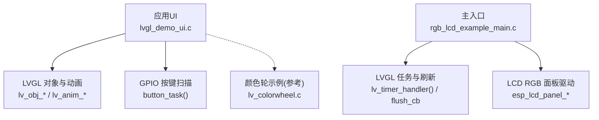
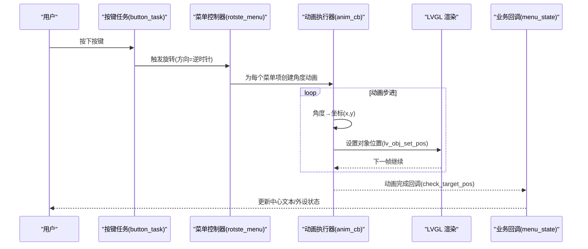
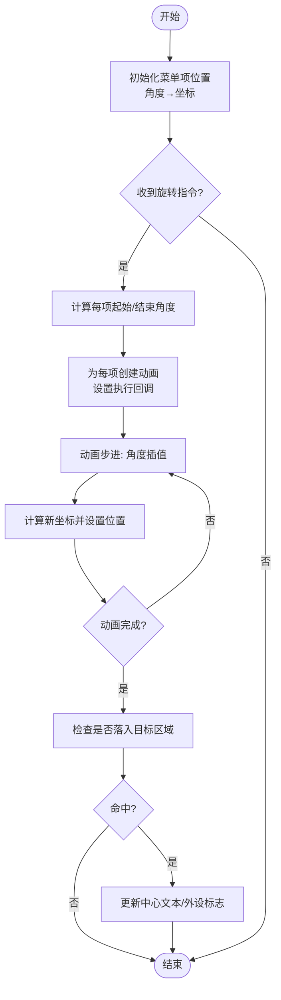
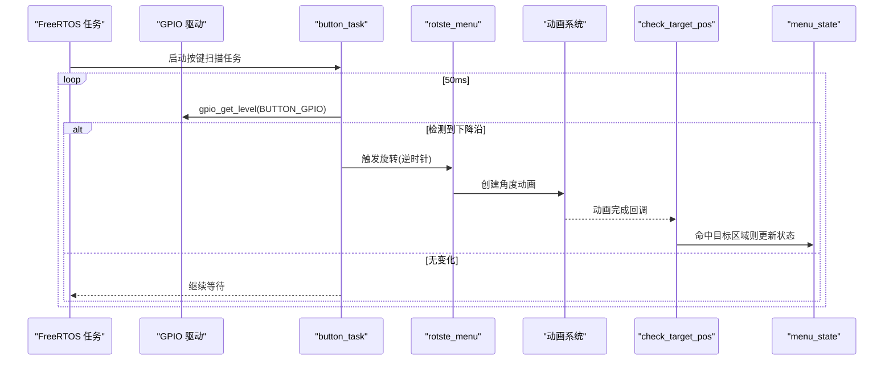
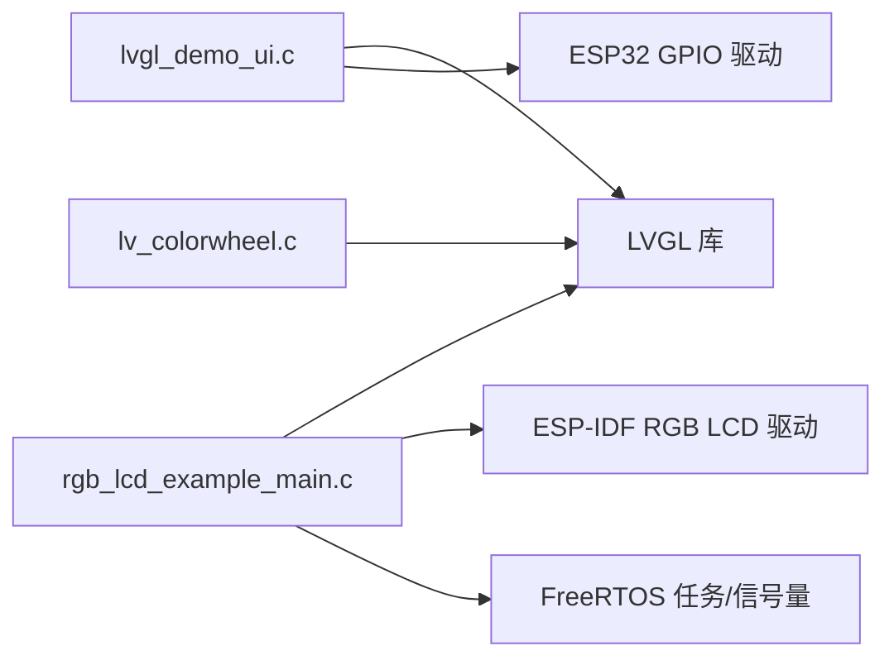

# 环形菜单系统

<cite>
**本文引用的文件**   
- [lvgl_demo_ui.c](file://ESP32开发板/TK021F2699_ESP32_LVGL_GIF_LED/TK021F2699_ESP32_LVGL_GIF_LED/main/ui/lvgl_demo_ui.c)
- [rgb_lcd_example_main.c](file://ESP32开发板/TK021F2699_ESP32_LVGL_GIF_LED/TK021F2699_ESP32_LVGL_GIF_LED/main/rgb_lcd_example_main.c)
- [lv_colorwheel.c](file://ESP32开发板/TK021F2699_ESP32_LVGL_GIF_LED/TK021F2699_ESP32_LVGL_GIF_LED/managed_components/lvgl__lvgl/src/extra/widgets/colorwheel/lv_colorwheel.c)
</cite>

## 目录
1. [简介](#简介)
2. [项目结构](#项目结构)
3. [核心组件](#核心组件)
4. [架构总览](#架构总览)
5. [详细组件分析](#详细组件分析)
6. [依赖关系分析](#依赖关系分析)
7. [性能考虑](#性能考虑)
8. [故障排查指南](#故障排查指南)
9. [结论](#结论)
10. [附录](#附录)

## 简介
本技术文档围绕“环形菜单系统”的实现与优化展开，聚焦以下目标：
- 数学原理与几何计算：角度到坐标的转换、圆周分布公式、旋转动画实现。
- 动态布局机制：初始位置计算、动画插值算法、边界检测逻辑。
- 用户交互处理流程：按键扫描、状态机管理、事件响应机制。
- 配置参数调优：半径、动画时间、菜单数量等对体验的影响。
- 性能优化建议：内存使用优化与渲染效率提升。

该系统基于 ESP32 + LVGL 平台，采用自定义环形菜单（非 LVGL 内置菜单控件），通过三角函数将角度映射为屏幕坐标，结合 LVGL 动画框架实现平滑旋转切换，并通过 GPIO 按键驱动选择逻辑。

## 项目结构
与环形菜单直接相关的代码位于应用 UI 层与主入口：
- 应用 UI 层：负责环形菜单的创建、布局、动画、交互与业务回调。
- 主入口：初始化 LCD、LVGL、任务调度与刷新管线。

图表来源
- [lvgl_demo_ui.c:297-496](file://ESP32开发板/TK021F2699_ESP32_LVGL_GIF_LED/TK021F2699_ESP32_LVGL_GIF_LED/main/ui/lvgl_demo_ui.c#L297-L496)
- [rgb_lcd_example_main.c:150-303](file://ESP32开发板/TK021F2699_ESP32_LVGL_GIF_LED/TK021F2699_ESP32_LVGL_GIF_LED/main/rgb_lcd_example_main.c#L150-L303)
- [lv_colorwheel.c:468-502](file://ESP32开发板/TK021F2699_ESP32_LVGL_GIF_LED/TK021F2699_ESP32_LVGL_GIF_LED/managed_components/lvgl__lvgl/src/extra/widgets/colorwheel/lv_colorwheel.c#L468-L502)

章节来源
- [lvgl_demo_ui.c:297-496](file://ESP32开发板/TK021F2699_ESP32_LVGL_GIF_LED/TK021F2699_ESP32_LVGL_GIF_LED/main/ui/lvgl_demo_ui.c#L297-L496)
- [rgb_lcd_example_main.c:150-303](file://ESP32开发板/TK021F2699_ESP32_LVGL_GIF_LED/TK021F2699_ESP32_LVGL_GIF_LED/main/rgb_lcd_example_main.c#L150-L303)

## 核心组件
- 环形菜单项集合：固定数量的按钮对象数组，按圆周均匀分布。
- 几何与动画引擎：角度到坐标转换、LVGL 动画插值执行器。
- 交互输入：GPIO 按键扫描任务，触发顺时针/逆时针旋转。
- 业务回调：选中项变化时更新中心文本与外设控制标志。

章节来源
- [lvgl_demo_ui.c:47-57](file://ESP32开发板/TK021F2699_ESP32_LVGL_GIF_LED/TK021F2699_ESP32_LVGL_GIF_LED/main/ui/lvgl_demo_ui.c#L47-L57)
- [lvgl_demo_ui.c:346-360](file://ESP32开发板/TK021F2699_ESP32_LVGL_GIF_LED/TK021F2699_ESP32_LVGL_GIF_LED/main/ui/lvgl_demo_ui.c#L346-L360)
- [lvgl_demo_ui.c:212-221](file://ESP32开发板/TK021F2699_ESP32_LVGL_GIF_LED/TK021F2699_ESP32_LVGL_GIF_LED/main/ui/lvgl_demo_ui.c#L212-L221)
- [lvgl_demo_ui.c:224-246](file://ESP32开发板/TK021F2699_ESP32_LVGL_GIF_LED/TK021F2699_ESP32_LVGL_GIF_LED/main/ui/lvgl_demo_ui.c#L224-L246)
- [lvgl_demo_ui.c:263-279](file://ESP32开发板/TK021F2699_ESP32_LVGL_GIF_LED/TK021F2699_ESP32_LVGL_GIF_LED/main/ui/lvgl_demo_ui.c#L263-L279)
- [lvgl_demo_ui.c:152-186](file://ESP32开发板/TK021F2699_ESP32_LVGL_GIF_LED/TK021F2699_ESP32_LVGL_GIF_LED/main/ui/lvgl_demo_ui.c#L152-L186)

## 架构总览
环形菜单的运行由“输入—布局—动画—渲染”闭环构成：
- 输入：按键任务周期性读取 GPIO，产生方向信号。
- 布局：根据当前索引与菜单数量计算每个项的目标角度序列。
- 动画：为每个菜单项创建角度动画，执行回调中计算并设置新坐标。
- 渲染：LVGL 在每帧刷新时绘制所有对象；可选双缓冲避免撕裂。

图表来源
- [lvgl_demo_ui.c:263-279](file://ESP32开发板/TK021F2699_ESP32_LVGL_GIF_LED/TK021F2699_ESP32_LVGL_GIF_LED/main/ui/lvgl_demo_ui.c#L263-L279)
- [lvgl_demo_ui.c:224-246](file://ESP32开发板/TK021F2699_ESP32_LVGL_GIF_LED/TK021F2699_ESP32_LVGL_GIF_LED/main/ui/lvgl_demo_ui.c#L224-L246)
- [lvgl_demo_ui.c:212-221](file://ESP32开发板/TK021F2699_ESP32_LVGL_GIF_LED/TK021F2699_ESP32_LVGL_GIF_LED/main/ui/lvgl_demo_ui.c#L212-L221)
- [lvgl_demo_ui.c:189-209](file://ESP32开发板/TK021F2699_ESP32_LVGL_GIF_LED/TK021F2699_ESP32_LVGL_GIF_LED/main/ui/lvgl_demo_ui.c#L189-L209)
- [lvgl_demo_ui.c:152-186](file://ESP32开发板/TK021F2699_ESP32_LVGL_GIF_LED/TK021F2699_ESP32_LVGL_GIF_LED/main/ui/lvgl_demo_ui.c#L152-L186)

## 详细组件分析

### 几何与数学模型
- 角度转弧度：提供宏用于度到弧度的换算。
- 圆周分布：以中心点 (CENTER_X, CENTER_Y) 和半径 RADIUS 为基础，第 i 个菜单项的角度为起始偏移加上等分步长。
- 坐标计算：x = CENTER_X + RADIUS * cos(θ)，y = CENTER_Y + RADIUS * sin(θ)。

要点
- 起始角度偏移决定第一个菜单项的方位。
- 等分步长为 360°/N，N 为菜单项数量。
- 动画过程中，每个项的角度随时间线性插值，从而形成整体旋转效果。

章节来源
- [lvgl_demo_ui.c:41-57](file://ESP32开发板/TK021F2699_ESP32_LVGL_GIF_LED/TK021F2699_ESP32_LVGL_GIF_LED/main/ui/lvgl_demo_ui.c#L41-L57)
- [lvgl_demo_ui.c:346-360](file://ESP32开发板/TK021F2699_ESP32_LVGL_GIF_LED/TK021F2699_ESP32_LVGL_GIF_LED/main/ui/lvgl_demo_ui.c#L346-L360)
- [lvgl_demo_ui.c:212-221](file://ESP32开发板/TK021F2699_ESP32_LVGL_GIF_LED/TK021F2699_ESP32_LVGL_GIF_LED/main/ui/lvgl_demo_ui.c#L212-L221)

### 动态布局与动画插值
- 初始布局：在创建阶段为每个菜单项计算初始角度并设置位置。
- 旋转动画：rotste_menu 根据当前索引与方向计算每个项的起始与结束角度，创建 lv_anim_t 动画，执行回调 anim_cb 中计算坐标并调用 lv_obj_set_pos。
- 动画完成检测：ready 回调 check_target_pos 遍历所有项，判断是否落入顶部目标区域，若命中则触发 menu_state 更新状态。

图表来源
- [lvgl_demo_ui.c:346-360](file://ESP32开发板/TK021F2699_ESP32_LVGL_GIF_LED/TK021F2699_ESP32_LVGL_GIF_LED/main/ui/lvgl_demo_ui.c#L346-L360)
- [lvgl_demo_ui.c:224-246](file://ESP32开发板/TK021F2699_ESP32_LVGL_GIF_LED/TK021F2699_ESP32_LVGL_GIF_LED/main/ui/lvgl_demo_ui.c#L224-L246)
- [lvgl_demo_ui.c:212-221](file://ESP32开发板/TK021F2699_ESP32_LVGL_GIF_LED/TK021F2699_ESP32_LVGL_GIF_LED/main/ui/lvgl_demo_ui.c#L212-L221)
- [lvgl_demo_ui.c:189-209](file://ESP32开发板/TK021F2699_ESP32_LVGL_GIF_LED/TK021F2699_ESP32_LVGL_GIF_LED/main/ui/lvgl_demo_ui.c#L189-L209)

章节来源
- [lvgl_demo_ui.c:224-246](file://ESP32开发板/TK021F2699_ESP32_LVGL_GIF_LED/TK021F2699_ESP32_LVGL_GIF_LED/main/ui/lvgl_demo_ui.c#L224-L246)
- [lvgl_demo_ui.c:212-221](file://ESP32开发板/TK021F2699_ESP32_LVGL_GIF_LED/TK021F2699_ESP32_LVGL_GIF_LED/main/ui/lvgl_demo_ui.c#L212-L221)
- [lvgl_demo_ui.c:189-209](file://ESP32开发板/TK021F2699_ESP32_LVGL_GIF_LED/TK021F2699_ESP32_LVGL_GIF_LED/main/ui/lvgl_demo_ui.c#L189-L209)

### 用户交互处理流程
- 按键初始化：配置 GPIO 为上拉输入，禁用中断，降低功耗。
- 按键任务：周期扫描 GPIO，检测下降沿（按下）事件，调用 rotste_menu(false) 触发逆时针旋转。
- 状态机：current_index 维护当前选中项索引，配合 MENU_ITEM_COUNT 进行模运算，保证循环切换。
- 事件响应：动画完成后检测目标区域，命中后更新中心标签与外设标志位。

图表来源
- [lvgl_demo_ui.c:282-295](file://ESP32开发板/TK021F2699_ESP32_LVGL_GIF_LED/TK021F2699_ESP32_LVGL_GIF_LED/main/ui/lvgl_demo_ui.c#L282-L295)
- [lvgl_demo_ui.c:263-279](file://ESP32开发板/TK021F2699_ESP32_LVGL_GIF_LED/TK021F2699_ESP32_LVGL_GIF_LED/main/ui/lvgl_demo_ui.c#L263-L279)
- [lvgl_demo_ui.c:224-246](file://ESP32开发板/TK021F2699_ESP32_LVGL_GIF_LED/TK021F2699_ESP32_LVGL_GIF_LED/main/ui/lvgl_demo_ui.c#L224-L246)
- [lvgl_demo_ui.c:189-209](file://ESP32开发板/TK021F2699_ESP32_LVGL_GIF_LED/TK021F2699_ESP32_LVGL_GIF_LED/main/ui/lvgl_demo_ui.c#L189-L209)
- [lvgl_demo_ui.c:152-186](file://ESP32开发板/TK021F2699_ESP32_LVGL_GIF_LED/TK021F2699_ESP32_LVGL_GIF_LED/main/ui/lvgl_demo_ui.c#L152-L186)

章节来源
- [lvgl_demo_ui.c:282-295](file://ESP32开发板/TK021F2699_ESP32_LVGL_GIF_LED/TK021F2699_ESP32_LVGL_GIF_LED/main/ui/lvgl_demo_ui.c#L282-L295)
- [lvgl_demo_ui.c:263-279](file://ESP32开发板/TK021F2699_ESP32_LVGL_GIF_LED/TK021F2699_ESP32_LVGL_GIF_LED/main/ui/lvgl_demo_ui.c#L263-L279)
- [lvgl_demo_ui.c:189-209](file://ESP32开发板/TK021F2699_ESP32_LVGL_GIF_LED/TK021F2699_ESP32_LVGL_GIF_LED/main/ui/lvgl_demo_ui.c#L189-L209)
- [lvgl_demo_ui.c:152-186](file://ESP32开发板/TK021F2699_ESP32_LVGL_GIF_LED/TK021F2699_ESP32_LVGL_GIF_LED/main/ui/lvgl_demo_ui.c#L152-L186)

### 边界检测与命中判定
- 目标区域：定义在屏幕上方中心附近的一个矩形范围。
- 检测时机：动画 ready 回调中遍历所有菜单项，获取其当前位置并与目标范围比较。
- 命中动作：更新中心文本与相关标志位，必要时触发外部任务或设备控制。

章节来源
- [lvgl_demo_ui.c:189-209](file://ESP32开发板/TK021F2699_ESP32_LVGL_GIF_LED/TK021F2699_ESP32_LVGL_GIF_LED/main/ui/lvgl_demo_ui.c#L189-L209)
- [lvgl_demo_ui.c:152-186](file://ESP32开发板/TK021F2699_ESP32_LVGL_GIF_LED/TK021F2699_ESP32_LVGL_GIF_LED/main/ui/lvgl_demo_ui.c#L152-L186)

### 角度与坐标转换算法细节
- 角度到弧度：使用宏将度数转换为弧度。
- 坐标映射：cos/sin 计算相对中心的偏移量，叠加中心坐标得到绝对位置。
- 动画插值：LVGL 内部对角度值进行线性插值，执行回调中逐帧更新位置。

参考对比（颜色轮中的角度计算）
- 颜色轮使用 atan2 从像素坐标反算角度，可作为角度计算的对照实现。

章节来源
- [lvgl_demo_ui.c:41-57](file://ESP32开发板/TK021F2699_ESP32_LVGL_GIF_LED/TK021F2699_ESP32_LVGL_GIF_LED/main/ui/lvgl_demo_ui.c#L41-L57)
- [lvgl_demo_ui.c:212-221](file://ESP32开发板/TK021F2699_ESP32_LVGL_GIF_LED/TK021F2699_ESP32_LVGL_GIF_LED/main/ui/lvgl_demo_ui.c#L212-L221)
- [lv_colorwheel.c:468-502](file://ESP32开发板/TK021F2699_ESP32_LVGL_GIF_LED/TK021F2699_ESP32_LVGL_GIF_LED/managed_components/lvgl__lvgl/src/extra/widgets/colorwheel/lv_colorwheel.c#L468-L502)

## 依赖关系分析
- 应用 UI 依赖 LVGL 的对象、动画与定时器 API。
- 主入口依赖 ESP-IDF 的 LCD 驱动与 FreeRTOS 任务/信号量。
- 颜色轮示例作为角度计算的参考实现，展示 atan2 的使用方式。

图表来源
- [lvgl_demo_ui.c:297-496](file://ESP32开发板/TK021F2699_ESP32_LVGL_GIF_LED/TK021F2699_ESP32_LVGL_GIF_LED/main/ui/lvgl_demo_ui.c#L297-L496)
- [rgb_lcd_example_main.c:150-303](file://ESP32开发板/TK021F2699_ESP32_LVGL_GIF_LED/TK021F2699_ESP32_LVGL_GIF_LED/main/rgb_lcd_example_main.c#L150-L303)
- [lv_colorwheel.c:468-502](file://ESP32开发板/TK021F2699_ESP32_LVGL_GIF_LED/TK021F2699_ESP32_LVGL_GIF_LED/managed_components/lvgl__lvgl/src/extra/widgets/colorwheel/lv_colorwheel.c#L468-L502)

章节来源
- [lvgl_demo_ui.c:297-496](file://ESP32开发板/TK021F2699_ESP32_LVGL_GIF_LED/TK021F2699_ESP32_LVGL_GIF_LED/main/ui/lvgl_demo_ui.c#L297-L496)
- [rgb_lcd_example_main.c:150-303](file://ESP32开发板/TK021F2699_ESP32_LVGL_GIF_LED/TK021F2699_ESP32_LVGL_GIF_LED/main/rgb_lcd_example_main.c#L150-L303)

## 性能考虑
- 动画频率与 CPU 负载
  - ANIM_TIME 越大，单帧角度增量越小，CPU 占用更低但动画更慢；过小会导致频繁重绘与高 CPU 占用。
  - 建议根据屏幕刷新率与 MCU 能力调整，使动画时长覆盖若干帧，避免每帧都触发大量三角函数计算。
- 三角函数开销
  - 每次动画步进都会调用 cos/sin，可考虑预计算角度表或使用定点近似以减少浮点运算。
- 内存与对象数量
  - 菜单项数量越多，动画对象与回调越多，内存与 CPU 压力越大。建议控制在合理范围（如 ≤12）。
- 渲染模式与撕裂
  - 主入口支持双缓冲与全屏刷新模式，可减少撕裂；但会占用更多显存。需权衡 PSRAM 容量与流畅度。
- 任务优先级与时钟
  - LVGL 任务与按键任务应合理分配优先级，确保动画与输入响应及时。LVGL tick 周期建议 2ms，兼顾精度与负载。

章节来源
- [lvgl_demo_ui.c:47-57](file://ESP32开发板/TK021F2699_ESP32_LVGL_GIF_LED/TK021F2699_ESP32_LVGL_GIF_LED/main/ui/lvgl_demo_ui.c#L47-L57)
- [rgb_lcd_example_main.c:66-71](file://ESP32开发板/TK021F2699_ESP32_LVGL_GIF_LED/TK021F2699_ESP32_LVGL_GIF_LED/main/rgb_lcd_example_main.c#L66-L71)
- [rgb_lcd_example_main.c:250-273](file://ESP32开发板/TK021F2699_ESP32_LVGL_GIF_LED/TK021F2699_ESP32_LVGL_GIF_LED/main/rgb_lcd_example_main.c#L250-L273)

## 故障排查指南
- 菜单不旋转或卡顿
  - 检查按键任务是否运行、GPIO 上拉配置是否正确、下降沿检测逻辑是否生效。
  - 确认 LVGL 任务正在运行且 lv_timer_handler 被周期性调用。
- 命中判定不准确
  - 检查目标区域阈值与菜单项尺寸是否匹配，确保动画结束时项的中心坐标落在预期范围内。
  - 注意动画完成回调的执行时机，避免在动画中途误判。
- 闪烁或撕裂
  - 启用双缓冲或全屏刷新模式，并确保 VSYNC 同步逻辑正确。
- 资源不足
  - 减少菜单项数量或图标尺寸，关闭不必要的特效（阴影、圆角等）。

章节来源
- [lvgl_demo_ui.c:282-295](file://ESP32开发板/TK021F2699_ESP32_LVGL_GIF_LED/TK021F2699_ESP32_LVGL_GIF_LED/main/ui/lvgl_demo_ui.c#L282-L295)
- [lvgl_demo_ui.c:189-209](file://ESP32开发板/TK021F2699_ESP32_LVGL_GIF_LED/TK021F2699_ESP32_LVGL_GIF_LED/main/ui/lvgl_demo_ui.c#L189-L209)
- [rgb_lcd_example_main.c:150-303](file://ESP32开发板/TK021F2699_ESP32_LVGL_GIF_LED/TK021F2699_ESP32_LVGL_GIF_LED/main/rgb_lcd_example_main.c#L150-L303)

## 结论
该环形菜单系统通过简洁的几何模型与 LVGL 动画框架实现了直观的圆周选择交互。其核心在于：
- 稳定的角度到坐标映射与等分圆周布局。
- 可靠的按键扫描与状态机管理。
- 合理的动画插值与命中判定。
在实际部署中，应根据硬件能力与用户体验需求调优半径、动画时间与菜单数量，并结合双缓冲与任务调度策略提升稳定性与流畅度。

## 附录

### 配置参数调优指南
- 半径 RADIUS
  - 增大半径可增加菜单项间距，便于触控与视觉识别，但可能超出屏幕边界。
  - 建议根据屏幕分辨率与菜单项尺寸计算最大可用半径。
- 动画时间 ANIM_TIME
  - 较短时间带来快速反馈，但可能显得生硬；较长时间更顺滑但延迟感增强。
  - 建议 500–1000ms 区间内测试，结合用户偏好与设备性能确定。
- 菜单数量 MENU_ITEM_COUNT
  - 数量过多导致角度步长变小，相邻项易混淆；过少则功能受限。
  - 建议 6–12 项，并根据图标大小与字体可读性评估。
- 起始角度偏移 START_ANGLE_OFFSET
  - 影响首个菜单项的方位，通常设为顶部（例如 270°）以便用户直观定位。
- 中心点 CENTER_X/CENTER_Y
  - 应与屏幕中心对齐，确保圆周布局对称美观。

章节来源
- [lvgl_demo_ui.c:47-57](file://ESP32开发板/TK021F2699_ESP32_LVGL_GIF_LED/TK021F2699_ESP32_LVGL_GIF_LED/main/ui/lvgl_demo_ui.c#L47-L57)