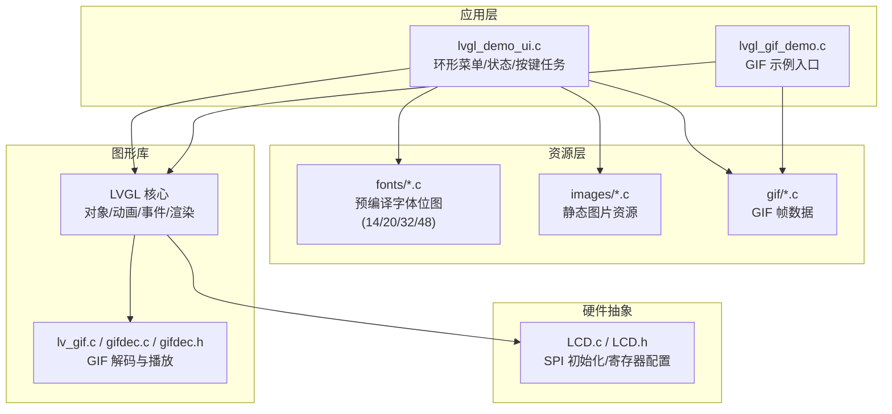
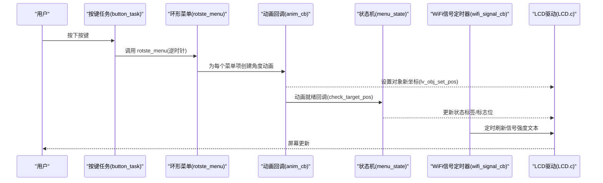
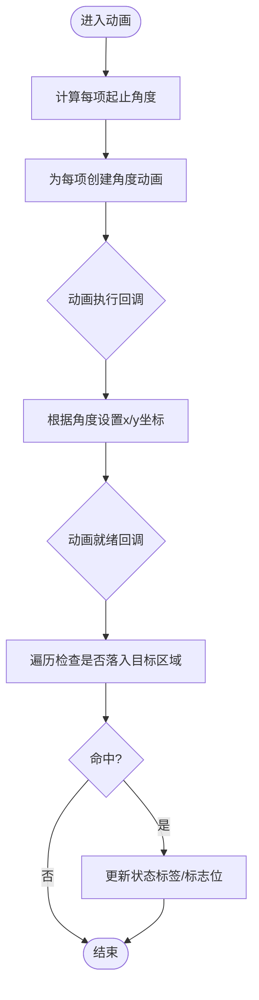
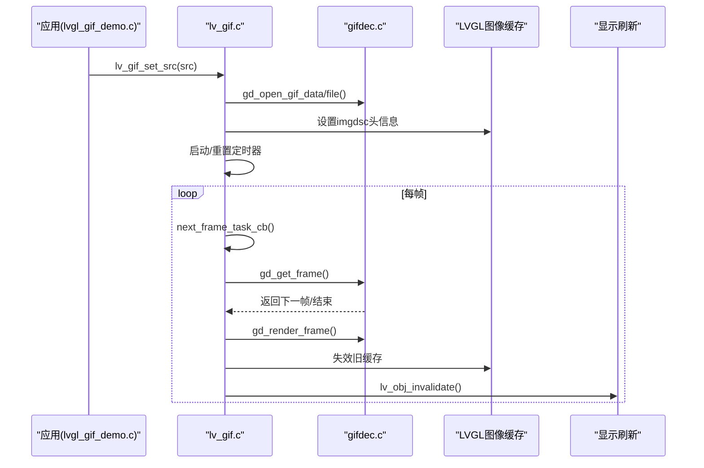
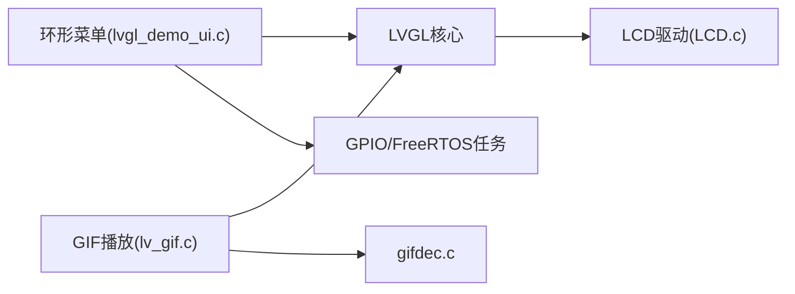

# 用户界面设计

<cite>
**本文引用的文件**
- [lvgl_demo_ui.c](file://ESP32开发板/TK021F2699_ESP32_LVGL_GIF_LED/TK021F2699_ESP32_LVGL_GIF_LED/main/ui/lvgl_demo_ui.c)
- [lvgl_gif_demo.c](file://ESP32开发板/TK021F2699_ESP32_LVGL_GIF_LED/TK021F2699_ESP32_LVGL_GIF_LED/main/ui/lvgl_gif_demo.c)
- [LCD.c](file://ESP32开发板/TK021F2699_ESP32_LVGL_GIF_LED/TK021F2699_ESP32_LVGL_GIF_LED/main/LCD.c)
- [LCD.h](file://ESP32开发板/TK021F2699_ESP32_LVGL_GIF_LED/TK021F2699_ESP32_LVGL_GIF_LED/main/LCD.h)
- [ui_font_Alibaba_PuHuiTi_Font_14.c](file://ESP32开发板/TK021F2699_ESP32_LVGL_GIF_LED/TK021F2699_ESP32_LVGL_GIF_LED/main/fonts/ui_font_Alibaba_PuHuiTi_Font_14.c)
- [ui_font_Alibaba_PuHuiTi_Font_20.c](file://ESP32开发板/TK021F2699_ESP32_LVGL_GIF_LED/TK021F2699_ESP32_LVGL_GIF_LED/main/fonts/ui_font_Alibaba_PuHuiTi_Font_20.c)
- [ui_font_Alibaba_PuHuiTi_Font_32.c](file://ESP32开发板/TK021F2699_ESP32_LVGL_GIF_LED/TK021F2699_ESP32_LVGL_GIF_LED/main/fonts/ui_font_Alibaba_PuHuiTi_Font_32.c)
- [ui_font_Alibaba_PuHuiTi_Font_48.c](file://ESP32开发板/TK021F2699_ESP32_LVGL_GIF_LED/TK021F2699_ESP32_LVGL_GIF_LED/main/fonts/ui_font_Alibaba_PuHuiTi_Font_48.c)
- [lv_gif.c](file://ESP32开发板/TK021F2699_ESP32_LVGL_GIF_LED/TK021F2699_ESP32_LVGL_GIF_LED/managed_components/lvgl__lvgl/src/extra/libs/gif/lv_gif.c)
- [gifdec.c](file://ESP32开发板/TK021F2699_ESP32_LVGL_GIF_LED/TK021F2699_ESP32_LVGL_GIF_LED/managed_components/lvgl__lvgl/src/extra/libs/gif/gifdec.c)
- [gifdec.h](file://ESP32开发板/TK021F2699_ESP32_LVGL_GIF_LED/TK021F2699_ESP32_LVGL_GIF_LED/managed_components/lvgl__lvgl/src/extra/libs/gif/gifdec.h)
</cite>

## 目录
1. [简介](#简介)
2. [项目结构](#项目结构)
3. [核心组件](#核心组件)
4. [架构总览](#架构总览)
5. [详细组件分析](#详细组件分析)
6. [依赖关系分析](#依赖关系分析)
7. [性能考虑](#性能考虑)
8. [故障排查指南](#故障排查指南)
9. [结论](#结论)
10. [附录](#附录)

## 简介
本设计文档面向嵌入式 LVGL 界面的设计与实现，重点覆盖以下方面：
- 环形菜单的实现原理与交互逻辑（旋转动画、位置检测、状态切换）
- GIF 动画播放的集成方法（多格式支持、内存优化、帧同步）
- UI 状态管理与页面跳转逻辑
- 字体与图像资源最佳实践（压缩格式选择、内存布局优化）
- 响应式设计与用户体验优化原则
- 界面性能瓶颈分析与解决方案（渲染优化、内存管理、动画流畅度提升）

## 项目结构
本项目基于 ESP32 + LVGL，UI 由主界面模块与 GIF 演示模块组成，底层包含 LCD 驱动初始化与多种字体资源。关键目录与职责如下：
- main/ui：LVGL 界面逻辑（环形菜单、GIF 展示）
- main/fonts：预编译字体位图（不同字号与 bpp）
- main/LCD.*：LCD 硬件初始化与 SPI 时序控制
- managed_components/lvgl__lvgl/src/extra/libs/gif：LVGL GIF 解码与播放框架

图表来源
- [lvgl_demo_ui.c:1-497](file://ESP32开发板/TK021F2699_ESP32_LVGL_GIF_LED/TK021F2699_ESP32_LVGL_GIF_LED/main/ui/lvgl_demo_ui.c#L1-L497)
- [lvgl_gif_demo.c:1-47](file://ESP32开发板/TK021F2699_ESP32_LVGL_GIF_LED/TK021F2699_ESP32_LVGL_GIF_LED/main/ui/lvgl_gif_demo.c#L1-L47)
- [LCD.c:1-219](file://ESP32开发板/TK021F2699_ESP32_LVGL_GIF_LED/TK021F2699_ESP32_LVGL_GIF_LED/main/LCD.c#L1-L219)
- [LCD.h:1-30](file://ESP32开发板/TK021F2699_ESP32_LVGL_GIF_LED/TK021F2699_ESP32_LVGL_GIF_LED/main/LCD.h#L1-L30)
- [lv_gif.c:1-154](file://ESP32开发板/TK021F2699_ESP32_LVGL_GIF_LED/TK021F2699_ESP32_LVGL_GIF_LED/managed_components/lvgl__lvgl/src/extra/libs/gif/lv_gif.c#L1-L154)
- [gifdec.c:572-677](file://ESP32开发板/TK021F2699_ESP32_LVGL_GIF_LED/TK021F2699_ESP32_LVGL_GIF_LED/managed_components/lvgl__lvgl/src/extra/libs/gif/gifdec.c#L572-L677)
- [gifdec.h:1-60](file://ESP32开发板/TK021F2699_ESP32_LVGL_GIF_LED/TK021F2699_ESP32_LVGL_GIF_LED/managed_components/lvgl__lvgl/src/extra/libs/gif/gifdec.h#L1-L60)

章节来源
- [lvgl_demo_ui.c:1-497](file://ESP32开发板/TK021F2699_ESP32_LVGL_GIF_LED/TK021F2699_ESP32_LVGL_GIF_LED/main/ui/lvgl_demo_ui.c#L1-L497)
- [lvgl_gif_demo.c:1-47](file://ESP32开发板/TK021F2699_ESP32_LVGL_GIF_LED/TK021F2699_ESP32_LVGL_GIF_LED/main/ui/lvgl_gif_demo.c#L1-L47)
- [LCD.c:1-219](file://ESP32开发板/TK021F2699_ESP32_LVGL_GIF_LED/TK021F2699_ESP32_LVGL_GIF_LED/main/LCD.c#L1-L219)
- [LCD.h:1-30](file://ESP32开发板/TK021F2699_ESP32_LVGL_GIF_LED/TK021F2699_ESP32_LVGL_GIF_LED/main/LCD.h#L1-L30)

## 核心组件
- 环形菜单与交互
  - 通过一组按钮对象围绕中心点按角度等分排列，使用 LVGL 动画在点击时整体旋转，使目标项移动到固定“选中区”
  - 动画完成后进行坐标判定，触发对应功能状态更新
- GIF 播放
  - 使用 lv_gif 控件加载内嵌或文件 GIF，内部定时器根据帧延迟推进下一帧，并刷新显示缓存
- 字体资源
  - 提供 14/20/32/48 号字体，BPP 分别为 4/4/8/8，以位图形式嵌入，避免运行时 TTF 解析开销
- LCD 驱动
  - 通过 SPI 对面板控制器进行初始化与寄存器配置，为 LVGL 提供显示后端

章节来源
- [lvgl_demo_ui.c:1-497](file://ESP32开发板/TK021F2699_ESP32_LVGL_GIF_LED/TK021F2699_ESP32_LVGL_GIF_LED/main/ui/lvgl_demo_ui.c#L1-L497)
- [lv_gif.c:1-154](file://ESP32开发板/TK021F2699_ESP32_LVGL_GIF_LED/TK021F2699_ESP32_LVGL_GIF_LED/managed_components/lvgl__lvgl/src/extra/libs/gif/lv_gif.c#L1-L154)
- [ui_font_Alibaba_PuHuiTi_Font_14.c:1-800](file://ESP32开发板/TK021F2699_ESP32_LVGL_GIF_LED/TK021F2699_ESP32_LVGL_GIF_LED/main/fonts/ui_font_Alibaba_PuHuiTi_Font_14.c#L1-L800)
- [ui_font_Alibaba_PuHuiTi_Font_20.c:1-800](file://ESP32开发板/TK021F2699_ESP32_LVGL_GIF_LED/TK021F2699_ESP32_LVGL_GIF_LED/main/fonts/ui_font_Alibaba_PuHuiTi_Font_20.c#L1-L800)
- [ui_font_Alibaba_PuHuiTi_Font_32.c:1-800](file://ESP32开发板/TK021F2699_ESP32_LVGL_GIF_LED/TK021F2699_ESP32_LVGL_GIF_LED/main/fonts/ui_font_Alibaba_PuHuiTi_Font_32.c#L1-L800)
- [ui_font_Alibaba_PuHuiTi_Font_48.c:1-800](file://ESP32开发板/TK021F2699_ESP32_LVGL_GIF_LED/TK021F2699_ESP32_LVGL_GIF_LED/main/fonts/ui_font_Alibaba_PuHuiTi_Font_48.c#L1-L800)
- [LCD.c:1-219](file://ESP32开发板/TK021F2699_ESP32_LVGL_GIF_LED/TK021F2699_ESP32_LVGL_GIF_LED/main/LCD.c#L1-L219)

## 架构总览
从系统视角看，UI 由 LVGL 对象树组织，环形菜单与 GIF 控件作为子对象；输入由 GPIO 按键任务驱动；GIF 播放由 LVGL 定时器调度；显示由 LCD 驱动完成。

图表来源
- [lvgl_demo_ui.c:263-295](file://ESP32开发板/TK021F2699_ESP32_LVGL_GIF_LED/TK021F2699_ESP32_LVGL_GIF_LED/main/ui/lvgl_demo_ui.c#L263-L295)
- [lvgl_demo_ui.c:224-246](file://ESP32开发板/TK021F2699_ESP32_LVGL_GIF_LED/TK021F2699_ESP32_LVGL_GIF_LED/main/ui/lvgl_demo_ui.c#L224-L246)
- [lvgl_demo_ui.c:212-221](file://ESP32开发板/TK021F2699_ESP32_LVGL_GIF_LED/TK021F2699_ESP32_LVGL_GIF_LED/main/ui/lvgl_demo_ui.c#L212-L221)
- [lvgl_demo_ui.c:152-186](file://ESP32开发板/TK021F2699_ESP32_LVGL_GIF_LED/TK021F2699_ESP32_LVGL_GIF_LED/main/ui/lvgl_demo_ui.c#L152-L186)
- [lvgl_demo_ui.c:249-260](file://ESP32开发板/TK021F2699_ESP32_LVGL_GIF_LED/TK021F2699_ESP32_LVGL_GIF_LED/main/ui/lvgl_demo_ui.c#L249-L260)
- [LCD.c:186-219](file://ESP32开发板/TK021F2699_ESP32_LVGL_GIF_LED/TK021F2699_ESP32_LVGL_GIF_LED/main/LCD.c#L186-L219)

## 详细组件分析

### 环形菜单组件分析
- 数据结构与布局
  - 菜单项数组保存按钮对象指针，半径与中心坐标定义圆周布局
  - 起始角度偏移用于对齐“选中区”
- 旋转动画
  - 每次按键将当前索引循环移动一位，计算每项的起止角度，创建角度到位置的动画回调
  - 动画执行器将角度转换为 x/y 坐标并设置对象位置
- 位置检测与状态切换
  - 动画就绪回调中遍历所有菜单项，判断是否落入目标区域（近似顶部中心），若命中则更新状态标签与全局标志位
- 交互流程
  - 独立 FreeRTOS 任务轮询 GPIO，下降沿触发旋转

图表来源
- [lvgl_demo_ui.c:224-246](file://ESP32开发板/TK021F2699_ESP32_LVGL_GIF_LED/TK021F2699_ESP32_LVGL_GIF_LED/main/ui/lvgl_demo_ui.c#L224-L246)
- [lvgl_demo_ui.c:212-221](file://ESP32开发板/TK021F2699_ESP32_LVGL_GIF_LED/TK021F2699_ESP32_LVGL_GIF_LED/main/ui/lvgl_demo_ui.c#L212-L221)
- [lvgl_demo_ui.c:189-209](file://ESP32开发板/TK021F2699_ESP32_LVGL_GIF_LED/TK021F2699_ESP32_LVGL_GIF_LED/main/ui/lvgl_demo_ui.c#L189-L209)
- [lvgl_demo_ui.c:152-186](file://ESP32开发板/TK021F2699_ESP32_LVGL_GIF_LED/TK021F2699_ESP32_LVGL_GIF_LED/main/ui/lvgl_demo_ui.c#L152-L186)

章节来源
- [lvgl_demo_ui.c:47-57](file://ESP32开发板/TK021F2699_ESP32_LVGL_GIF_LED/TK021F2699_ESP32_LVGL_GIF_LED/main/ui/lvgl_demo_ui.c#L47-L57)
- [lvgl_demo_ui.c:212-246](file://ESP32开发板/TK021F2699_ESP32_LVGL_GIF_LED/TK021F2699_ESP32_LVGL_GIF_LED/main/ui/lvgl_demo_ui.c#L212-L246)
- [lvgl_demo_ui.c:189-209](file://ESP32开发板/TK021F2699_ESP32_LVGL_GIF_LED/TK021F2699_ESP32_LVGL_GIF_LED/main/ui/lvgl_demo_ui.c#L189-L209)
- [lvgl_demo_ui.c:152-186](file://ESP32开发板/TK021F2699_ESP32_LVGL_GIF_LED/TK021F2699_ESP32_LVGL_GIF_LED/main/ui/lvgl_demo_ui.c#L152-L186)
- [lvgl_demo_ui.c:263-295](file://ESP32开发板/TK021F2699_ESP32_LVGL_GIF_LED/TK021F2699_ESP32_LVGL_GIF_LED/main/ui/lvgl_demo_ui.c#L263-L295)

### GIF 播放组件分析
- 集成方式
  - 通过 lv_gif_create 创建控件，lv_gif_set_src 设置 GIF 源（变量或文件）
  - 内部构造器创建定时器，暂停运行；设置源后恢复并立即推进一帧
- 帧同步与内存
  - 定时器回调依据 GIF 帧延迟决定是否推进下一帧
  - 解码后将帧写入 imgdsc.data 指向的缓冲区，并通过 lv_img_cache_invalidate_src 和 lv_obj_invalidate 触发重绘
- 多格式支持
  - 当前实现针对 GIF 格式；LVGL 还支持其他媒体库（如 FFmpeg、Rlottie），但本项目主要使用 GIF

图表来源
- [lv_gif.c:58-96](file://ESP32开发板/TK021F2699_ESP32_LVGL_GIF_LED/TK021F2699_ESP32_LVGL_GIF_LED/managed_components/lvgl__lvgl/src/extra/libs/gif/lv_gif.c#L58-L96)
- [lv_gif.c:131-152](file://ESP32开发板/TK021F2699_ESP32_LVGL_GIF_LED/TK021F2699_ESP32_LVGL_GIF_LED/managed_components/lvgl__lvgl/src/extra/libs/gif/lv_gif.c#L131-L152)
- [gifdec.c:572-677](file://ESP32开发板/TK021F2699_ESP32_LVGL_GIF_LED/TK021F2699_ESP32_LVGL_GIF_LED/managed_components/lvgl__lvgl/src/extra/libs/gif/gifdec.c#L572-L677)

章节来源
- [lvgl_gif_demo.c:12-47](file://ESP32开发板/TK021F2699_ESP32_LVGL_GIF_LED/TK021F2699_ESP32_LVGL_GIF_LED/main/ui/lvgl_gif_demo.c#L12-L47)
- [lv_gif.c:1-154](file://ESP32开发板/TK021F2699_ESP32_LVGL_GIF_LED/TK021F2699_ESP32_LVGL_GIF_LED/managed_components/lvgl__lvgl/src/extra/libs/gif/lv_gif.c#L1-L154)
- [gifdec.c:572-677](file://ESP32开发板/TK021F2699_ESP32_LVGL_GIF_LED/TK021F2699_ESP32_LVGL_GIF_LED/managed_components/lvgl__lvgl/src/extra/libs/gif/gifdec.c#L572-L677)
- [gifdec.h:1-60](file://ESP32开发板/TK021F2699_ESP32_LVGL_GIF_LED/TK021F2699_ESP32_LVGL_GIF_LED/managed_components/lvgl__lvgl/src/extra/libs/gif/gifdec.h#L1-L60)

### UI 状态管理与页面跳转逻辑
- 状态管理
  - 使用全局标志位控制 Wi-Fi 信号显示与 LED 跑马灯开关
  - 状态标签随菜单选择动态更新
- 页面跳转
  - 当前实现未引入多页切换机制，仅通过状态变更影响可见元素与外设行为
  - 如需扩展，可在 menu_state 中增加页面切换函数（例如 lv_scr_load）

章节来源
- [lvgl_demo_ui.c:152-186](file://ESP32开发板/TK021F2699_ESP32_LVGL_GIF_LED/TK021F2699_ESP32_LVGL_GIF_LED/main/ui/lvgl_demo_ui.c#L152-L186)
- [lvgl_demo_ui.c:249-260](file://ESP32开发板/TK021F2699_ESP32_LVGL_GIF_LED/TK021F2699_ESP32_LVGL_GIF_LED/main/ui/lvgl_demo_ui.c#L249-L260)

### 字体与图像资源最佳实践
- 字体选择与生成
  - 使用预编译位图字体，减少运行时解析成本；按需选择字号与 BPP（14/20 号采用 4bpp，32/48 号采用 8bpp）
  - 字符集范围限定（如 ASCII 与常用中文），避免冗余占用
- 内存布局优化
  - 将字体位图置于常量段，降低 RAM 占用
  - 合理控制最大字号与字符集，平衡清晰度与 Flash/RAM 消耗
- 图像资源
  - 静态图标使用 LV_IMG_DECLARE 声明，避免重复解码
  - GIF 帧数据集中存放，便于统一管理与复用

章节来源
- [ui_font_Alibaba_PuHuiTi_Font_14.c:1-800](file://ESP32开发板/TK021F2699_ESP32_LVGL_GIF_LED/TK021F2699_ESP32_LVGL_GIF_LED/main/fonts/ui_font_Alibaba_PuHuiTi_Font_14.c#L1-L800)
- [ui_font_Alibaba_PuHuiTi_Font_20.c:1-800](file://ESP32开发板/TK021F2699_ESP32_LVGL_GIF_LED/TK021F2699_ESP32_LVGL_GIF_LED/main/fonts/ui_font_Alibaba_PuHuiTi_Font_20.c#L1-L800)
- [ui_font_Alibaba_PuHuiTi_Font_32.c:1-800](file://ESP32开发板/TK021F2699_ESP32_LVGL_GIF_LED/TK021F2699_ESP32_LVGL_GIF_LED/main/fonts/ui_font_Alibaba_PuHuiTi_Font_32.c#L1-L800)
- [ui_font_Alibaba_PuHuiTi_Font_48.c:1-800](file://ESP32开发板/TK021F2699_ESP32_LVGL_GIF_LED/TK021F2699_ESP32_LVGL_GIF_LED/main/fonts/ui_font_Alibaba_PuHuiTi_Font_48.c#L1-L800)
- [lvgl_demo_ui.c:19-39](file://ESP32开发板/TK021F2699_ESP32_LVGL_GIF_LED/TK021F2699_ESP32_LVGL_GIF_LED/main/ui/lvgl_demo_ui.c#L19-L39)

### 响应式设计与用户体验优化
- 布局与对齐
  - 使用 LV_ALIGN_CENTER 与相对偏移保证在不同分辨率下的居中效果
- 反馈与可感知性
  - 状态标签即时更新，配合 WiFi 信号强度定时刷新，增强用户感知
- 动效节奏
  - 菜单旋转动画时间适中，避免过长导致操作迟滞

章节来源
- [lvgl_demo_ui.c:297-343](file://ESP32开发板/TK021F2699_ESP32_LVGL_GIF_LED/TK021F2699_ESP32_LVGL_GIF_LED/main/ui/lvgl_demo_ui.c#L297-L343)
- [lvgl_demo_ui.c:249-260](file://ESP32开发板/TK021F2699_ESP32_LVGL_GIF_LED/TK021F2699_ESP32_LVGL_GIF_LED/main/ui/lvgl_demo_ui.c#L249-L260)

## 依赖关系分析
- 组件耦合
  - 环形菜单与状态机强耦合于同一文件，便于维护但需注意职责边界
  - GIF 播放与 LVGL 定时器、图像缓存紧密协作
- 外部依赖
  - LVGL 核心（对象、动画、事件、渲染）
  - ESP32 GPIO 与 FreeRTOS 任务
  - LCD SPI 驱动

图表来源
- [lvgl_demo_ui.c:263-295](file://ESP32开发板/TK021F2699_ESP32_LVGL_GIF_LED/TK021F2699_ESP32_LVGL_GIF_LED/main/ui/lvgl_demo_ui.c#L263-L295)
- [lv_gif.c:1-154](file://ESP32开发板/TK021F2699_ESP32_LVGL_GIF_LED/TK021F2699_ESP32_LVGL_GIF_LED/managed_components/lvgl__lvgl/src/extra/libs/gif/lv_gif.c#L1-L154)
- [gifdec.c:572-677](file://ESP32开发板/TK021F2699_ESP32_LVGL_GIF_LED/TK021F2699_ESP32_LVGL_GIF_LED/managed_components/lvgl__lvgl/src/extra/libs/gif/gifdec.c#L572-L677)
- [LCD.c:186-219](file://ESP32开发板/TK021F2699_ESP32_LVGL_GIF_LED/TK021F2699_ESP32_LVGL_GIF_LED/main/LCD.c#L186-L219)

章节来源
- [lvgl_demo_ui.c:1-497](file://ESP32开发板/TK021F2699_ESP32_LVGL_GIF_LED/TK021F2699_ESP32_LVGL_GIF_LED/main/ui/lvgl_demo_ui.c#L1-L497)
- [lv_gif.c:1-154](file://ESP32开发板/TK021F2699_ESP32_LVGL_GIF_LED/TK021F2699_ESP32_LVGL_GIF_LED/managed_components/lvgl__lvgl/src/extra/libs/gif/lv_gif.c#L1-L154)
- [gifdec.c:572-677](file://ESP32开发板/TK021F2699_ESP32_LVGL_GIF_LED/TK021F2699_ESP32_LVGL_GIF_LED/managed_components/lvgl__lvgl/src/extra/libs/gif/gifdec.c#L572-L677)
- [LCD.c:1-219](file://ESP32开发板/TK021F2699_ESP32_LVGL_GIF_LED/TK021F2699_ESP32_LVGL_GIF_LED/main/LCD.c#L1-L219)

## 性能考虑
- 渲染优化
  - 减少不必要的 lv_obj_invalidate 调用，仅在必要时刷新
  - 合理使用 LV_OBJ_FLAG_HIDDEN 隐藏非活跃元素，降低绘制负担
- 内存管理
  - 预编译字体与静态图片常驻 Flash，避免频繁分配
  - GIF 帧缓冲复用，避免重复分配；及时关闭 GIF 实例释放资源
- 动画流畅度
  - 调整 ANIM_TIME 与定时器周期，确保帧率稳定
  - 避免在动画回调中进行耗时操作（如网络请求）

[本节为通用指导，不直接分析具体文件]

## 故障排查指南
- 环形菜单无响应
  - 检查按键任务优先级与 GPIO 配置是否正确
  - 确认动画回调与就绪回调是否被正确注册
- GIF 无法播放
  - 确认 GIF 源类型（变量/文件）与路径正确
  - 查看定时器是否启动，帧延迟是否过大导致卡顿
- 显示异常
  - 核对 LCD 初始化序列与时序宏定义
  - 检查 SPI 引脚映射与电平配置

章节来源
- [lvgl_demo_ui.c:282-295](file://ESP32开发板/TK021F2699_ESP32_LVGL_GIF_LED/TK021F2699_ESP32_LVGL_GIF_LED/main/ui/lvgl_demo_ui.c#L282-L295)
- [lv_gif.c:58-96](file://ESP32开发板/TK021F2699_ESP32_LVGL_GIF_LED/TK021F2699_ESP32_LVGL_GIF_LED/managed_components/lvgl__lvgl/src/extra/libs/gif/lv_gif.c#L58-L96)
- [LCD.c:17-40](file://ESP32开发板/TK021F2699_ESP32_LVGL_GIF_LED/TK021F2699_ESP32_LVGL_GIF_LED/main/LCD.c#L17-L40)

## 结论
本项目在 ESP32 平台上实现了基于 LVGL 的环形菜单与 GIF 播放功能。通过合理的动画与状态管理机制，提供了直观的用户交互体验。结合预编译字体与静态资源，系统在有限资源下保持了良好的性能表现。后续可扩展多页面导航与更多媒体格式支持，进一步优化用户体验与性能。

[本节为总结，不直接分析具体文件]

## 附录
- 术语说明
  - BPP：每像素位数，影响颜色深度与内存占用
  - 帧同步：依据 GIF 帧延迟精确推进下一帧，保持播放节奏
- 参考实现路径
  - 环形菜单与状态切换：[lvgl_demo_ui.c](file://ESP32开发板/TK021F2699_ESP32_LVGL_GIF_LED/TK021F2699_ESP32_LVGL_GIF_LED/main/ui/lvgl_demo_ui.c)
  - GIF 播放集成：[lv_gif.c](file://ESP32开发板/TK021F2699_ESP32_LVGL_GIF_LED/TK021F2699_ESP32_LVGL_GIF_LED/managed_components/lvgl__lvgl/src/extra/libs/gif/lv_gif.c)、[gifdec.c](file://ESP32开发板/TK021F2699_ESP32_LVGL_GIF_LED/TK021F2699_ESP32_LVGL_GIF_LED/managed_components/lvgl__lvgl/src/extra/libs/gif/gifdec.c)
  - 字体资源：[ui_font_Alibaba_PuHuiTi_Font_*.c](file://ESP32开发板/TK021F2699_ESP32_LVGL_GIF_LED/TK021F2699_ESP32_LVGL_GIF_LED/main/fonts/)
  - LCD 驱动：[LCD.c](file://ESP32开发板/TK021F2699_ESP32_LVGL_GIF_LED/TK021F2699_ESP32_LVGL_GIF_LED/main/LCD.c)