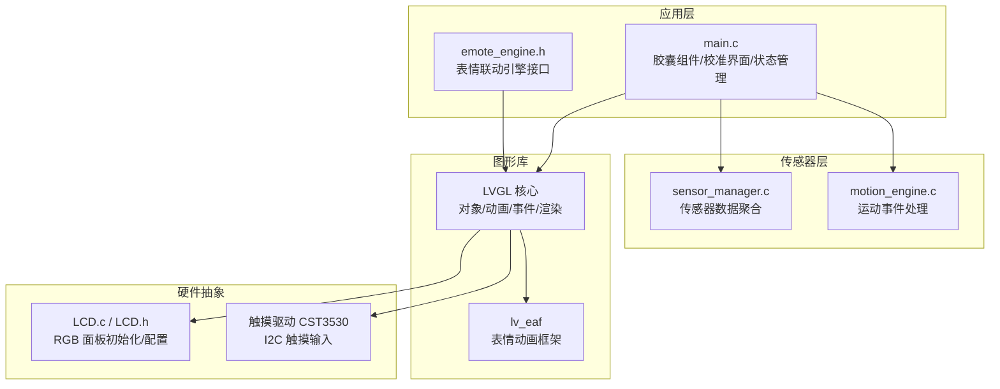
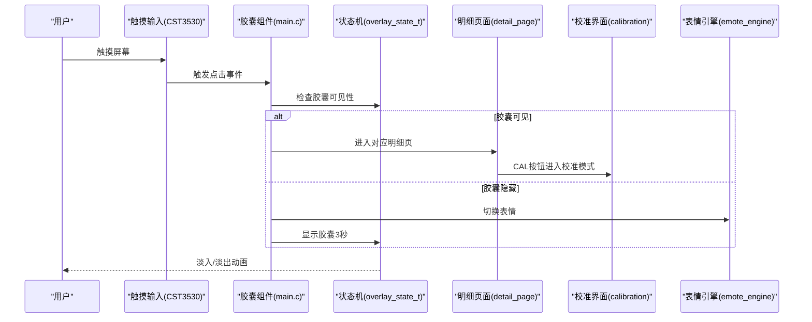
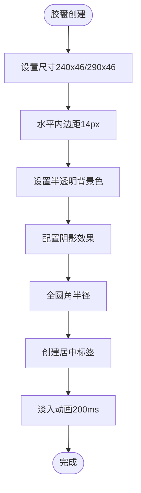
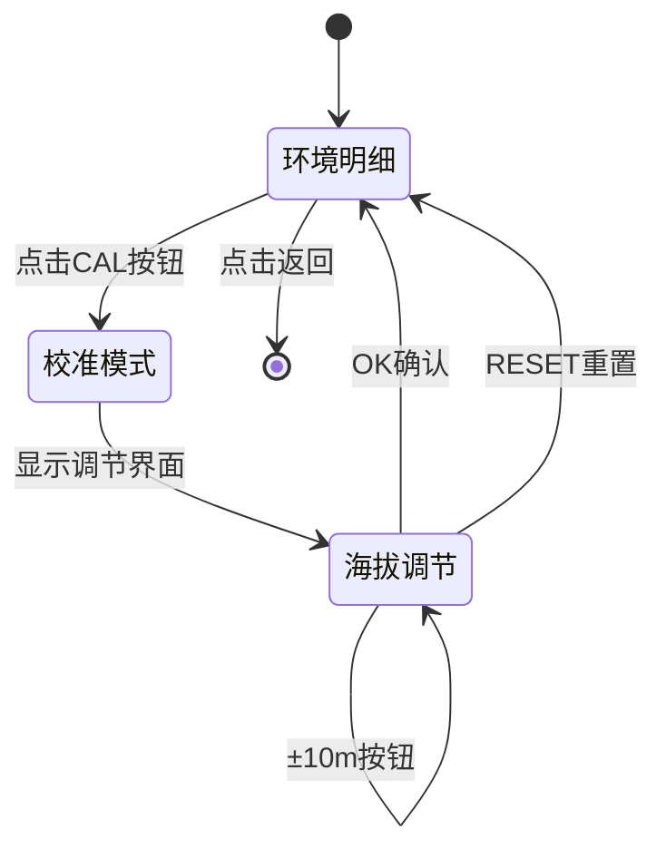
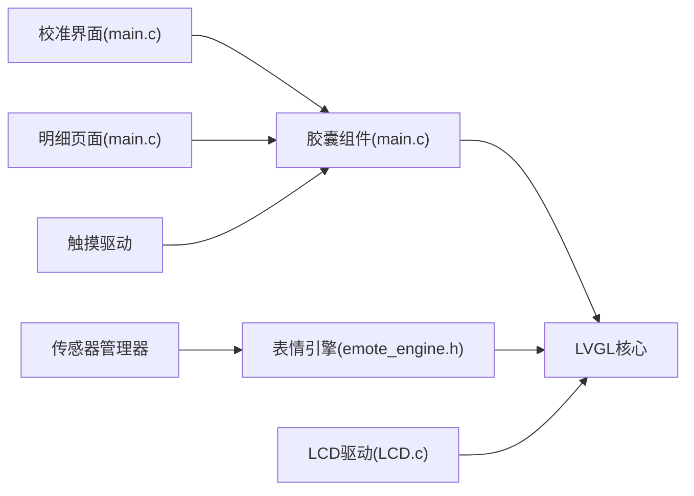

# 用户界面设计

<cite>
**本文引用的文件**
- [main.c](file://PathFinder_EMOTE/main/main.c)
- [emote_engine.h](file://PathFinder_EMOTE/main/emote_engine.h)
- [LCD.c](file://PathFinder_EMOTE/main/LCD.c)
- [LCD.h](file://PathFinder_EMOTE/main/LCD.h)
</cite>

## 更新摘要
**所做更改**
- 新增胶囊组件视觉增强章节，详细说明尺寸调整、样式重新设计和阴影效果优化
- 新增校准界面实现章节，介绍全新的海拔校准功能界面
- 更新圆形元素渲染优化内容，包括阴影效果和圆角处理
- 完善UI状态管理和交互逻辑说明

## 目录
1. [简介](#简介)
2. [项目结构](#项目结构)
3. [核心组件](#核心组件)
4. [架构总览](#架构总览)
5. [详细组件分析](#详细组件分析)
6. [依赖关系分析](#依赖关系分析)
7. [性能考虑](#性能考虑)
8. [故障排查指南](#故障排查指南)
9. [结论](#结论)
10. [附录](#附录)

## 简介
本设计文档面向 ESP32 EMOTE 应用的 LVGL 用户界面设计与实现，重点覆盖以下方面：
- 胶囊组件的视觉增强与交互逻辑（尺寸优化、样式重设计、阴影效果）
- 全新校准界面的实现原理和用户交互流程
- UI 状态管理与页面跳转逻辑
- 圆形元素的优化渲染技术
- 字体与图像资源最佳实践
- 响应式设计与用户体验优化原则
- 界面性能瓶颈分析与解决方案

## 项目结构
本项目基于 ESP32-S3 + LVGL，采用圆形屏（480×480）设计，UI 由主界面模块、表情引擎和传感器数据展示组成。关键目录与职责如下：
- main：LVGL 界面逻辑（胶囊组件、校准界面、表情显示）
- drivers：传感器驱动（温湿度、气压、姿态、UV）
- managed_components：LVGL 核心库和第三方组件

图表来源
- [main.c:1-200](file://PathFinder_EMOTE/main/main.c#L1-L200)
- [emote_engine.h:1-134](file://PathFinder_EMOTE/main/emote_engine.h#L1-L134)
- [LCD.c:1-219](file://PathFinder_EMOTE/main/LCD.c#L1-L219)
- [LCD.h:1-30](file://PathFinder_EMOTE/main/LCD.h#L1-L30)

章节来源
- [main.c:1-200](file://PathFinder_EMOTE/main/main.c#L1-L200)
- [emote_engine.h:1-134](file://PathFinder_EMOTE/main/emote_engine.h#L1-L134)
- [LCD.c:1-219](file://PathFinder_EMOTE/main/LCD.c#L1-L219)
- [LCD.h:1-30](file://PathFinder_EMOTE/main/LCD.h#L1-L30)

## 核心组件
- **胶囊组件系统**
  - 顶部环境胶囊（青色主题）和底部运动胶囊（绿色主题），支持淡入淡出动画
  - 异常高亮模式（红色紧急/黄色警告），带脉冲边框动画
  - 点击检测进入明细页面，3秒自动隐藏机制
- **校准界面**
  - 全屏覆盖式海拔校准界面，包含数值调节按钮和确认操作
  - 实时显示当前海拔值和反推海平面气压值
- **表情联动引擎**
  - 基于传感器数据综合评估的智能表情切换
  - 手动轮播和自动评估两种模式，避免频繁抖动
- **圆形屏适配**
  - 安全区域布局，确保所有元素在圆形可视范围内
  - 优化的阴影效果和圆角渲染

章节来源
- [main.c:294-350](file://PathFinder_EMOTE/main/main.c#L294-L350)
- [main.c:352-417](file://PathFinder_EMOTE/main/main.c#L352-L417)
- [main.c:570-669](file://PathFinder_EMOTE/main/main.c#L570-L669)
- [emote_engine.h:1-134](file://PathFinder_EMOTE/main/emote_engine.h#L1-L134)

## 架构总览
从系统视角看，UI 采用分层架构：LVGL 对象树组织界面元素，传感器数据通过管理器聚合，表情引擎根据数据评估切换动画，触摸输入驱动交互逻辑。

图表来源
- [main.c:1002-1030](file://PathFinder_EMOTE/main/main.c#L1002-L1030)
- [main.c:448-494](file://PathFinder_EMOTE/main/main.c#L448-L494)
- [main.c:671-706](file://PathFinder_EMOTE/main/main.c#L671-L706)
- [emote_engine.h:24-42](file://PathFinder_EMOTE/main/emote_engine.h#L24-L42)

## 详细组件分析

### 胶囊组件视觉增强
**更新** 胶囊组件经过重大视觉改进，包括尺寸优化、样式重设计和阴影效果增强

- **尺寸与布局优化**
  - 顶部胶囊：240×46像素，Y坐标58，适配montserrat_18字体
  - 底部胶囊：290×46像素，Y坐标376，显示更多运动数据
  - 水平内边距14像素，避免文字贴边裁切
- **样式重设计**
  - 无边框设计，仅靠背景色+阴影呈现胶囊形态
  - 半透明背景（环境20%，运动16%），提升层次感
  - 全圆角设计（LV_RADIUS_CIRCLE），符合现代UI趋势
- **阴影效果优化**
  - 阴影宽度12像素，垂直偏移2像素，透明度30%
  - 与环境黑底自然融合，消除生硬切割感
  - 异常模式下阴影增强至14像素，透明度提升至40%

图表来源
- [main.c:352-388](file://PathFinder_EMOTE/main/main.c#L352-L388)
- [main.c:294-321](file://PathFinder_EMOTE/main/main.c#L294-L321)
- [main.c:368-376](file://PathFinder_EMOTE/main/main.c#L368-L376)

章节来源
- [main.c:93-103](file://PathFinder_EMOTE/main/main.c#L93-L103)
- [main.c:294-350](file://PathFinder_EMOTE/main/main.c#L294-L350)
- [main.c:352-388](file://PathFinder_EMOTE/main/main.c#L352-L388)

### 全新校准界面实现
**新增** 完整的海拔校准功能界面，提供直观的用户交互体验

- **界面布局**
  - 全屏覆盖容器，标题居中显示（ENVIRONMENT/MOTION）
  - 数据行采用名称-数值双列布局，间距38像素
  - 返回提示位于底部，灰色小字引导
- **校准控件组**
  - CAL胶囊按钮：蓝色主题，90×34像素，底部居中
  - 数值调节按钮：±10m步进，深灰色背景，圆角8像素
  - 确认/重置按钮：70×36像素，分别使用品牌色和中性色
- **交互逻辑**
  - 点击CAL按钮进入校准模式，显示海拔调节界面
  - 实时显示当前海拔值和反推P0值
  - OK确认保存，RESET重置为默认值

图表来源
- [main.c:561-669](file://PathFinder_EMOTE/main/main.c#L561-L669)
- [main.c:671-706](file://PathFinder_EMOTE/main/main.c#L671-L706)

章节来源
- [main.c:561-669](file://PathFinder_EMOTE/main/main.c#L561-L669)
- [main.c:671-706](file://PathFinder_EMOTE/main/main.c#L671-L706)

### 圆形元素优化渲染
**更新** 针对圆形屏特性进行了专门的渲染优化

- **阴影渲染优化**
  - 使用LV_SHADOW_CACHE_SIZE缓存机制，减少重复计算
  - 阴影参数调优：width=12, ofs_y=2, spread=0, opacity=30%
  - 异常模式下动态调整阴影强度
- **圆角处理**
  - 统一使用LV_RADIUS_CIRCLE实现完美圆形
  - 避免圆角处的色彩断层问题
  - 配合内边距确保内容不被裁切
- **性能考虑**
  - 阴影渲染在LVGL内部优化，避免CPU过载
  - 合理使用对象标志位控制渲染范围

章节来源
- [main.c:315-321](file://PathFinder_EMOTE/main/main.c#L315-L321)
- [main.c:371-376](file://PathFinder_EMOTE/main/main.c#L371-L376)
- [main.c:580-586](file://PathFinder_EMOTE/main/main.c#L580-L586)

### UI 状态管理与页面跳转逻辑
- **叠加层状态机**
  - OVERLAY_HIDDEN：默认隐藏状态
  - OVERLAY_SHOWN：点击唤出，3秒后自动淡出
  - OVERLAY_ALERT：异常高亮，持续显示并启动脉冲动画
- **异常检测机制**
  - UV指数超过8.0触发黄色警告
  - 倾角超过20度触发黄色警告
  - 碰撞或急刹车触发红色紧急状态
- **页面跳转逻辑**
  - 胶囊点击进入对应明细页面
  - 明细页面支持返回操作
  - 校准模式作为子状态嵌入明细页面

章节来源
- [main.c:109-134](file://PathFinder_EMOTE/main/main.c#L109-L134)
- [main.c:448-494](file://PathFinder_EMOTE/main/main.c#L448-L494)
- [main.c:1002-1030](file://PathFinder_EMOTE/main/main.c#L1002-L1030)

### 字体与图像资源最佳实践
- **字体选择策略**
  - 使用Montserrat字体族，适配圆形屏PPI
  - 14号字体用于辅助信息，18号用于主要数据，20号用于重要数值
  - 白色文字搭配半透明背景，确保可读性
- **内存布局优化**
  - 预编译字体位图，避免运行时解析开销
  - 合理控制字符集范围，平衡清晰度与存储占用
- **图像资源管理**
  - EAF表情动画集中管理，按需加载
  - 静态图标使用LV_IMG_DECLARE声明，避免重复解码

章节来源
- [main.c:381-385](file://PathFinder_EMOTE/main/main.c#L381-L385)
- [main.c:590-593](file://PathFinder_EMOTE/main/main.c#L590-L593)
- [emote_engine.h:24-42](file://PathFinder_EMOTE/main/emote_engine.h#L24-L42)

### 响应式设计与用户体验优化
- **圆形屏适配**
  - 安全区域布局，确保所有元素在圆形可视范围内
  - 中心对齐策略，适应不同屏幕尺寸
- **反馈与可感知性**
  - 淡入淡出动画时长200ms，提供平滑过渡
  - 异常状态脉冲动画，1秒周期无限循环
  - 即时状态更新，增强用户感知
- **交互节奏**
  - 3秒自动隐藏机制，避免界面干扰
  - 点击检测精确到像素级，提升操作准确性

章节来源
- [main.c:94-95](file://PathFinder_EMOTE/main/main.c#L94-L95)
- [main.c:425-444](file://PathFinder_EMOTE/main/main.c#L425-L444)
- [main.c:979-986](file://PathFinder_EMOTE/main/main.c#L979-L986)

## 依赖关系分析
- **组件耦合**
  - 胶囊组件与状态机强耦合于同一文件，便于维护但需注意职责边界
  - 校准界面作为明细页面的子功能，共享UI容器和事件处理
  - 表情引擎独立运行，通过API与主界面交互
- **外部依赖**
  - LVGL核心（对象、动画、事件、渲染）
  - ESP32-S3 GPIO与FreeRTOS任务
  - RGB LCD面板驱动和触摸控制器
  - 传感器管理器提供数据源

图表来源
- [main.c:1002-1030](file://PathFinder_EMOTE/main/main.c#L1002-L1030)
- [main.c:561-669](file://PathFinder_EMOTE/main/main.c#L561-L669)
- [emote_engine.h:24-42](file://PathFinder_EMOTE/main/emote_engine.h#L24-L42)
- [LCD.c:186-219](file://PathFinder_EMOTE/main/LCD.c#L186-L219)

章节来源
- [main.c:1-200](file://PathFinder_EMOTE/main/main.c#L1-L200)
- [emote_engine.h:1-134](file://PathFinder_EMOTE/main/emote_engine.h#L1-L134)
- [LCD.c:1-219](file://PathFinder_EMOTE/main/LCD.c#L1-L219)

## 性能考虑
- **渲染优化**
  - 合理使用LV_OBJ_FLAG_HIDDEN隐藏非活跃元素，降低绘制负担
  - 阴影渲染利用LVGL内部缓存机制，避免重复计算
  - 动画回调中避免耗时操作，保持帧率稳定
- **内存管理**
  - 预编译字体与静态图片常驻Flash，避免频繁分配
  - 表情动画按需加载，及时释放不使用的资源
  - 传感器数据快照复用，减少内存分配次数
- **动画流畅度**
  - 调整动画时间参数，确保200ms淡入淡出流畅自然
  - 脉冲动画使用播放模式，避免重复创建动画实例
  - 定时器周期优化，环境数据1Hz，倾角5Hz，表情引擎5Hz

## 故障排查指南
- **胶囊组件无响应**
  - 检查触摸驱动CST3530的I2C配置是否正确
  - 确认点击坐标检测逻辑是否被正确执行
  - 验证对象标志位是否意外设置了不可点击状态
- **校准界面异常**
  - 检查CAL按钮的事件回调是否正确注册
  - 确认海拔调节逻辑的边界条件处理
  - 验证P0值反推算法的数据准确性
- **圆形屏显示问题**
  - 核对LCD初始化序列与时序宏定义
  - 检查RGB面板引脚映射与电平配置
  - 确认安全区域布局参数是否适配实际屏幕尺寸

章节来源
- [main.c:1002-1030](file://PathFinder_EMOTE/main/main.c#L1002-L1030)
- [main.c:570-669](file://PathFinder_EMOTE/main/main.c#L570-L669)
- [LCD.c:17-40](file://PathFinder_EMOTE/main/LCD.c#L17-L40)

## 结论
ESP32 EMOTE应用在圆形屏上实现了现代化的胶囊式UI设计，通过视觉增强、校准界面和渲染优化，提供了优秀的用户体验。胶囊组件的半透明设计、阴影效果和动画交互展现了专业的UI设计水准。校准界面的完整实现满足了设备精度要求。结合表情联动引擎和传感器数据，系统在有限资源下保持了良好的性能和响应性。

## 附录
- **术语说明**
  - PPI：每英寸像素密度，影响字体和图标清晰度
  - 半透明背景：使用LV_OPA_COVER的百分比值控制透明度
  - 脉冲动画：边框透明度往复变化的循环动画
- **参考实现路径**
  - 胶囊组件实现：[main.c](file://PathFinder_EMOTE/main/main.c)
  - 校准界面逻辑：[main.c](file://PathFinder_EMOTE/main/main.c)
  - 表情引擎接口：[emote_engine.h](file://PathFinder_EMOTE/main/emote_engine.h)
  - LCD驱动配置：[LCD.c](file://PathFinder_EMOTE/main/LCD.c)