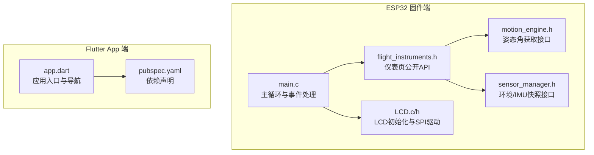
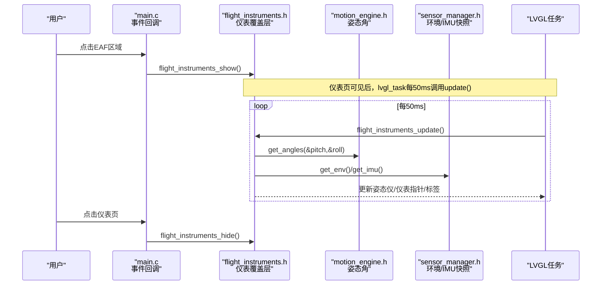
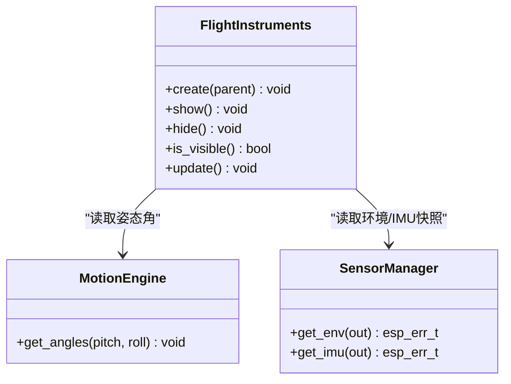
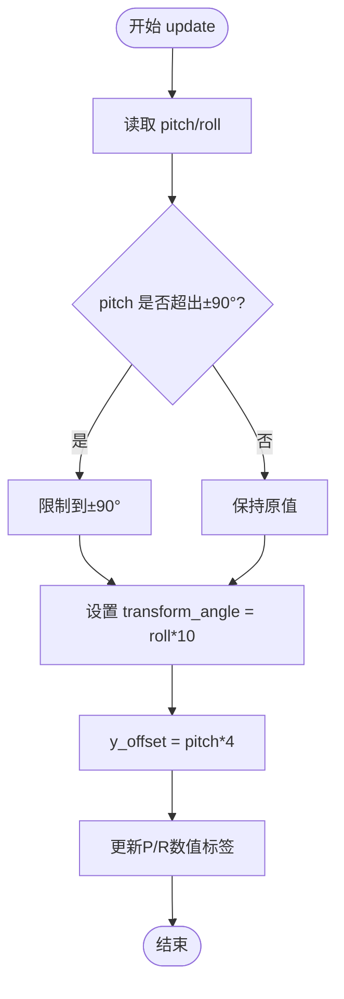
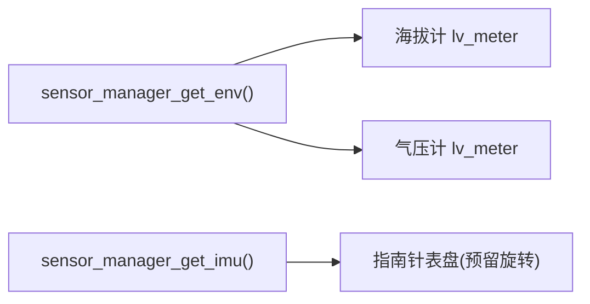
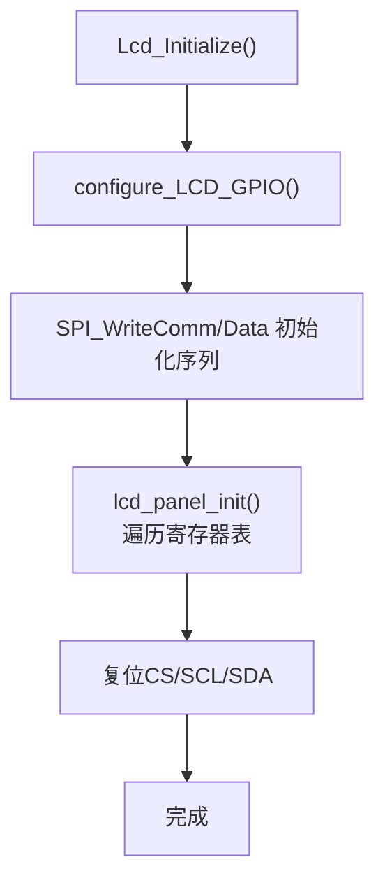
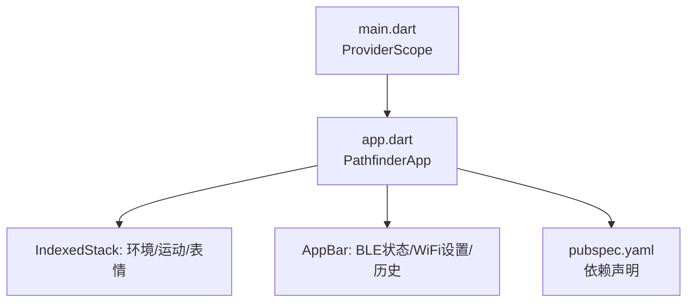
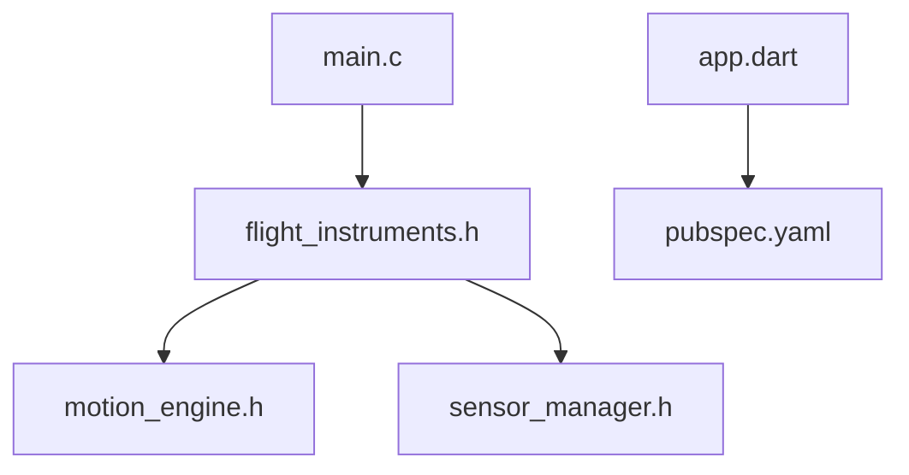

# 飞行仪表UI设计

<cite>
**本文引用的文件**   
- [README.md](file://README.md)
- [flight_instruments.h](file://PathFinder_EMOTE/main/flight_instruments.h)
- [2026-07-13-flight-instruments-design.md](file://docs/superpowers/specs/2026-07-13-flight-instruments-design.md)
- [main.c](file://PathFinder_EMOTE/main/main.c)
- [LCD.c](file://PathFinder_EMOTE/main/LCD.c)
- [LCD.h](file://PathFinder_EMOTE/main/LCD.h)
- [motion_engine.h](file://PathFinder_EMOTE/main/motion_engine.h)
- [sensor_manager.h](file://PathFinder_EMOTE/main/sensor_manager.h)
- [app.dart](file://PathFinder_Dashboard/lib/app/app.dart)
- [pubspec.yaml](file://PathFinder_Dashboard/pubspec.yaml)
</cite>

## 目录
1. [引言](#引言)
2. [项目结构](#项目结构)
3. [核心组件](#核心组件)
4. [架构总览](#架构总览)
5. [详细组件分析](#详细组件分析)
6. [依赖关系分析](#依赖关系分析)
7. [性能考量](#性能考量)
8. [故障排查指南](#故障排查指南)
9. [结论](#结论)
10. [附录](#附录)

## 引言
本文件聚焦于“飞行仪表UI设计”，围绕 ESP32-S3 端 LVGL 实现的仿飞行仪表盘页面，以及 Flutter 端仪表盘应用的对应可视化能力进行系统化说明。目标读者包括硬件工程师、嵌入式开发者与移动端开发者，旨在帮助快速理解并扩展该功能模块。

## 项目结构
本项目为双端系统：
- ESP32 固件端（PathFinder_EMOTE）：负责传感器采集、运动分析、表情联动、LVGL UI 渲染与 BLE 通信。
- Flutter App 端（PathFinder_Dashboard）：负责 BLE 数据接收、持久化存储与可视化展示。

图表来源
- [main.c:1-200](file://PathFinder_EMOTE/main/main.c#L1-L200)
- [flight_instruments.h:1-51](file://PathFinder_EMOTE/main/flight_instruments.h#L1-L51)
- [motion_engine.h:1-73](file://PathFinder_EMOTE/main/motion_engine.h#L1-L73)
- [sensor_manager.h:1-85](file://PathFinder_EMOTE/main/sensor_manager.h#L1-L85)
- [LCD.c:1-224](file://PathFinder_EMOTE/main/LCD.c#L1-L224)
- [LCD.h:1-30](file://PathFinder_EMOTE/main/LCD.h#L1-L30)
- [app.dart:1-81](file://PathFinder_Dashboard/lib/app/app.dart#L1-L81)
- [pubspec.yaml:1-37](file://PathFinder_Dashboard/pubspec.yaml#L1-L37)

章节来源
- [README.md:1-120](file://README.md#L1-L120)

## 核心组件
- 飞行仪表覆盖层（ESP32 端）
  - 提供创建、显示/隐藏、可见性检查与周期更新等 API，所有 LVGL 操作在 lvgl_lock 内执行，保证线程安全。
- 姿态指引仪（第1页）
  - 全屏圆形裁剪容器，天空/大地圆盘随 roll 旋转、按 pitch 平移；固定飞机符号与横滚刻度弧、俯仰刻度梯。
- 指南针+海拔计+气压计（第2页）
  - 指南针表盘当前无磁力计数据，航向显示 N/A；海拔计与气压计使用 lv_meter 指针仪表。
- 数据源
  - 姿态角来自 motion_engine_get_angles()；环境与 IMU 快照来自 sensor_manager_get_env()/get_imu()。
- LCD 初始化与 SPI 驱动
  - 完成 GPIO 配置、SPI 时序与面板寄存器初始化序列。

章节来源
- [flight_instruments.h:1-51](file://PathFinder_EMOTE/main/flight_instruments.h#L1-L51)
- [2026-07-13-flight-instruments-design.md:1-120](file://docs/superpowers/specs/2026-07-13-flight-instruments-design.md#L1-L120)
- [motion_engine.h:52-55](file://PathFinder_EMOTE/main/motion_engine.h#L52-L55)
- [sensor_manager.h:44-54](file://PathFinder_EMOTE/main/sensor_manager.h#L44-L54)
- [LCD.c:186-224](file://PathFinder_EMOTE/main/LCD.c#L186-L224)
- [LCD.h:12-30](file://PathFinder_EMOTE/main/LCD.h#L12-L30)

## 架构总览
飞行仪表 UI 作为覆盖层叠加在主表情页之上，通过点击进入、滑动切换页面，并在 lvgl_task 中周期性刷新。

图表来源
- [main.c:1-200](file://PathFinder_EMOTE/main/main.c#L1-L200)
- [flight_instruments.h:26-48](file://PathFinder_EMOTE/main/flight_instruments.h#L26-L48)
- [motion_engine.h:52-55](file://PathFinder_EMOTE/main/motion_engine.h#L52-L55)
- [sensor_manager.h:44-54](file://PathFinder_EMOTE/main/sensor_manager.h#L44-L54)

## 详细组件分析

### 飞行仪表覆盖层（ESP32 端）
- 职责边界
  - 仅管理仪表 UI 的创建、显示/隐藏与更新；不直接操作表情引擎。
  - 所有 LVGL 操作在 lvgl_lock 保护下执行，避免与表情动画线程竞争。
- 关键 API
  - 创建：flight_instruments_create(parent)
  - 显隐：flight_instruments_show()/hide()
  - 可见性：flight_instruments_is_visible()
  - 更新：flight_instruments_update()（内部限速 20Hz）
- 交互流程
  - 点击表情 → 进入仪表页；点击仪表页 → 返回表情页；左右滑动 → 切换第1/2页。

图表来源
- [flight_instruments.h:26-48](file://PathFinder_EMOTE/main/flight_instruments.h#L26-L48)
- [motion_engine.h:52-55](file://PathFinder_EMOTE/main/motion_engine.h#L52-L55)
- [sensor_manager.h:44-54](file://PathFinder_EMOTE/main/sensor_manager.h#L44-L54)

章节来源
- [flight_instruments.h:1-51](file://PathFinder_EMOTE/main/flight_instruments.h#L1-L51)
- [2026-07-13-flight-instruments-design.md:178-223](file://docs/superpowers/specs/2026-07-13-flight-instruments-design.md#L178-L223)

### 第1页：姿态指引仪（Artificial Horizon）
- 对象树要点
  - 圆形裁剪容器（半径约 200px），内含天空/大地圆盘（520×520）。
  - 圆盘通过 transform_angle 随 roll 旋转，y_offset 随 pitch 平移。
  - 固定飞机符号（黄色）、顶部横滚刻度弧与指针、俯仰刻度梯。
- 关键参数
  - 俯仰换算：4px/度；横滚单位：LVGL 0.1°；更新频率：20Hz；pitch 钳制 ±90°。
- 视觉与性能
  - 大对象旋转带来一定渲染压力，通过圆形裁剪与 20Hz 限速平衡流畅度与 CPU 开销。

图表来源
- [2026-07-13-flight-instruments-design.md:80-116](file://docs/superpowers/specs/2026-07-13-flight-instruments-design.md#L80-L116)

章节来源
- [2026-07-13-flight-instruments-design.md:54-116](file://docs/superpowers/specs/2026-07-13-flight-instruments-design.md#L54-L116)

### 第2页：指南针 + 海拔计 + 气压计
- 布局
  - 指南针表盘居中偏上，N/S/E/W 方位标注；当前无磁力计，航向显示 N/A。
  - 左下海拔计（0–5000m）、右下气压计（960–1060hPa），均为 lv_meter 指针仪表。
- 数据来源
  - 海拔/气压来自 sensor_manager_get_env()；指南针后续可接入 MPU9255 实现旋转。

图表来源
- [2026-07-13-flight-instruments-design.md:117-177](file://docs/superpowers/specs/2026-07-13-flight-instruments-design.md#L117-L177)
- [sensor_manager.h:44-54](file://PathFinder_EMOTE/main/sensor_manager.h#L44-L54)

章节来源
- [2026-07-13-flight-instruments-design.md:117-177](file://docs/superpowers/specs/2026-07-13-flight-instruments-design.md#L117-L177)

### LCD 初始化与 SPI 驱动（ESP32 端）
- 功能
  - 配置 LCD 相关 GPIO，执行 SPI 命令/数据写入，遍历寄存器表完成面板初始化。
- 关键点
  - CS/SCK/SDA 引脚宏定义与电平控制；初始化序列包含延时与多组寄存器配置。

图表来源
- [LCD.c:205-224](file://PathFinder_EMOTE/main/LCD.c#L205-L224)
- [LCD.c:186-204](file://PathFinder_EMOTE/main/LCD.c#L186-L204)
- [LCD.h:12-30](file://PathFinder_EMOTE/main/LCD.h#L12-L30)

章节来源
- [LCD.c:1-224](file://PathFinder_EMOTE/main/LCD.c#L1-L224)
- [LCD.h:1-30](file://PathFinder_EMOTE/main/LCD.h#L1-L30)

### Flutter 仪表盘应用（App 端）
- 应用入口与导航
  - 使用 IndexedStack 承载三个主要页面（环境、运动、表情），AppBar 右上角集成 BLE 状态徽章与 WiFi 设置入口。
- 依赖
  - Riverpod 状态管理、Reactive BLE、fl_chart 图表、Drift SQLite 数据库等。

图表来源
- [app.dart:1-81](file://PathFinder_Dashboard/lib/app/app.dart#L1-L81)
- [pubspec.yaml:1-37](file://PathFinder_Dashboard/pubspec.yaml#L1-L37)

章节来源
- [app.dart:1-81](file://PathFinder_Dashboard/lib/app/app.dart#L1-L81)
- [pubspec.yaml:1-37](file://PathFinder_Dashboard/pubspec.yaml#L1-L37)

## 依赖关系分析
- ESP32 端
  - 仪表覆盖层依赖 motion_engine（姿态角）与 sensor_manager（环境/IMU快照）。
  - main.c 负责事件分发与 lvgl_task 调度，将仪表更新纳入主循环。
- Flutter 端
  - app.dart 组织页面与导航，依赖 pubspec.yaml 中的第三方库。

图表来源
- [flight_instruments.h:1-51](file://PathFinder_EMOTE/main/flight_instruments.h#L1-L51)
- [motion_engine.h:1-73](file://PathFinder_EMOTE/main/motion_engine.h#L1-L73)
- [sensor_manager.h:1-85](file://PathFinder_EMOTE/main/sensor_manager.h#L1-L85)
- [main.c:1-200](file://PathFinder_EMOTE/main/main.c#L1-L200)
- [app.dart:1-81](file://PathFinder_Dashboard/lib/app/app.dart#L1-L81)
- [pubspec.yaml:1-37](file://PathFinder_Dashboard/pubspec.yaml#L1-L37)

章节来源
- [README.md:120-220](file://README.md#L120-L220)

## 性能考量
- 更新频率
  - 仪表更新限速 20Hz（50ms），在保证流畅度的同时降低 CPU 占用。
- 渲染优化
  - 圆形裁剪减少实际渲染像素；对大对象（520×520）旋转采用 transform_angle，配合 clip_corner 提升体验。
- 数据访问
  - 仅在仪表页可见时拉取环境/IMU快照，避免不必要的数据搬运。
- 内存与分区
  - 参考 README 统计，固件大小与分区占用需关注，确保新增 UI 不影响整体资源预算。

[本节为通用指导，无需具体文件引用]

## 故障排查指南
- 触摸/按键无响应或仪表无法进入
  - 确认 main.c 中点击回调已改为进入仪表页，长按回调用于手动切换表情。
  - 检查 lvgl_task 是否在可见时调用 flight_instruments_update()。
- 仪表显示异常（天地翻转/闪烁）
  - 检查 pitch 钳制逻辑（±90°）；确认 transform_angle 与 y_offset 计算正确。
- BLE 连接问题（Flutter 端）
  - 核对 Service/Characteristic UUID 格式与权限配置；确保 ReactiveBleService 正常工作。
- LCD 黑屏/花屏
  - 确认 GPIO 冲突修复与 SPI 初始化序列；必要时启用双帧缓冲以缓解高频采样导致的竞态。

章节来源
- [2026-07-13-flight-instruments-design.md:196-223](file://docs/superpowers/specs/2026-07-13-flight-instruments-design.md#L196-L223)
- [README.md:600-642](file://README.md#L600-L642)

## 结论
飞行仪表 UI 通过覆盖层方式无缝叠加在主表情页之上，利用姿态角与环境数据直观呈现车辆三维姿态与高度/气压信息。其模块化设计与严格的线程安全策略，使得在有限算力平台上仍能获得稳定流畅的视觉效果。后续可扩展磁力计、更多仪表页面与动画过渡以提升用户体验。

[本节为总结性内容，无需具体文件引用]

## 附录
- 术语
  - Artificial Horizon：姿态指引仪，显示横滚与俯仰。
  - lv_meter：LVGL 指针仪表控件。
  - transform_angle：LVGL 对象旋转变换。
- 参考路径
  - 仪表头文件：[flight_instruments.h](file://PathFinder_EMOTE/main/flight_instruments.h)
  - 设计文档：[2026-07-13-flight-instruments-design.md](file://docs/superpowers/specs/2026-07-13-flight-instruments-design.md)
  - 主程序入口：[main.c](file://PathFinder_EMOTE/main/main.c)
  - LCD 驱动：[LCD.c](file://PathFinder_EMOTE/main/LCD.c), [LCD.h](file://PathFinder_EMOTE/main/LCD.h)
  - 姿态接口：[motion_engine.h](file://PathFinder_EMOTE/main/motion_engine.h)
  - 传感器接口：[sensor_manager.h](file://PathFinder_EMOTE/main/sensor_manager.h)
  - Flutter 应用入口：[app.dart](file://PathFinder_Dashboard/lib/app/app.dart)
  - 依赖清单：[pubspec.yaml](file://PathFinder_Dashboard/pubspec.yaml)