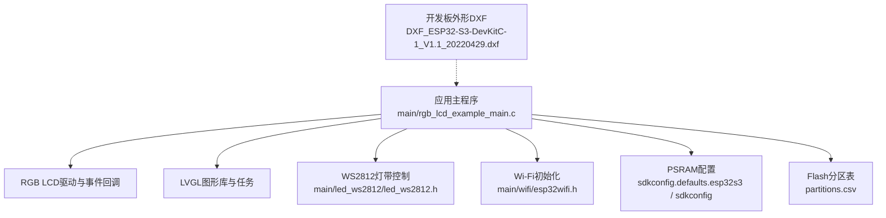
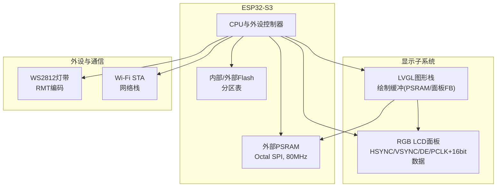
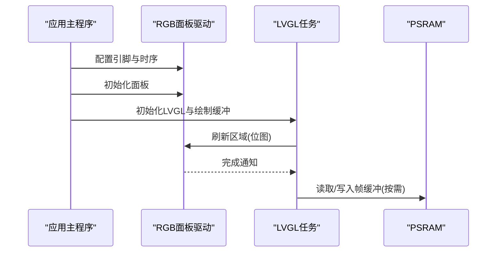
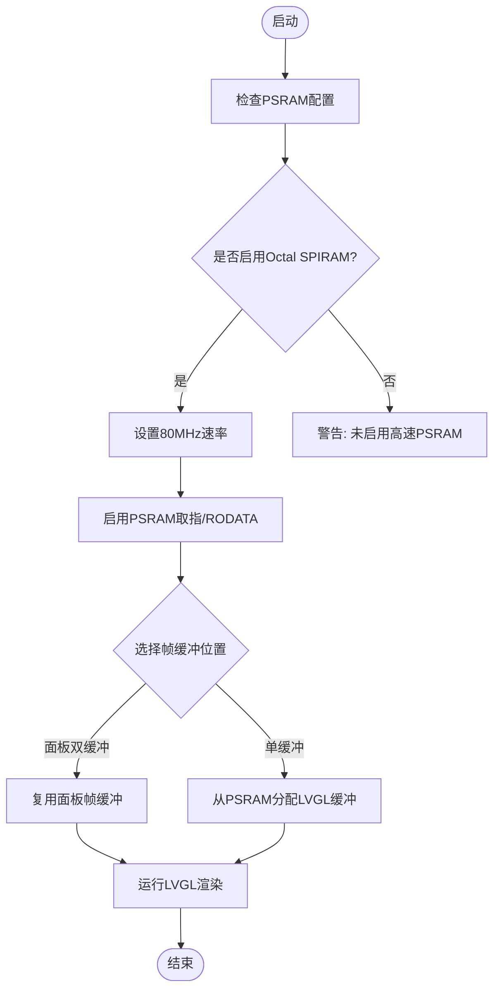
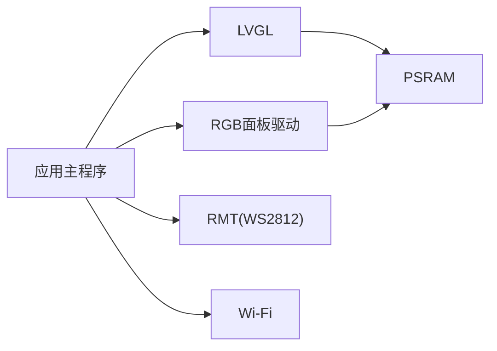

# ESP32-S3开发板

<cite>
**本文引用的文件**   
- [rgb_lcd_example_main.c](file://ESP32开发板/TK021F2699_ESP32_LVGL_GIF_LED/TK021F2699_ESP32_LVGL_GIF_LED/main/rgb_lcd_example_main.c)
- [LCD.h](file://ESP32开发板/TK021F2699_ESP32_LVGL_GIF_LED/TK021F2699_ESP32_LVGL_GIF_LED/main/LCD.h)
- [led_ws2812.h](file://ESP32开发板/TK021F2699_ESP32_LVGL_GIF_LED/TK021F2699_ESP32_LVGL_GIF_LED/main/led_ws2812/led_ws2812.h)
- [esp32wifi.h](file://ESP32开发板/TK021F2699_ESP32_LVGL_GIF_LED/TK021F2699_ESP32_LVGL_GIF_LED/main/wifi/esp32wifi.h)
- [sdkconfig.defaults.esp32s3](file://ESP32开发板/TK021F2699_ESP32_LVGL_GIF_LED/TK021F2699_ESP32_LVGL_GIF_LED/sdkconfig.defaults.esp32s3)
- [sdkconfig](file://ESP32开发板/TK021F2699_ESP32_LVGL_GIF_LED/TK021F2699_ESP32_LVGL_GIF_LED/sdkconfig)
- [partitions.csv](file://ESP32开发板/TK021F2699_ESP32_LVGL_GIF_LED/TK021F2699_ESP32_LVGL_GIF_LED/partitions.csv)
- [DXF_ESP32-S3-DevKitC-1_V1.1_20220429.dxf](file://ESP32开发板/DXF_ESP32-S3-DevKitC-1_V1.1_20220429.dxf)
</cite>

## 目录
1. [简介](#简介)
2. [项目结构](#项目结构)
3. [核心组件](#核心组件)
4. [架构总览](#架构总览)
5. [详细组件分析](#详细组件分析)
6. [依赖关系分析](#依赖关系分析)
7. [性能与功耗考量](#性能与功耗考量)
8. [故障排查指南](#故障排查指南)
9. [结论](#结论)
10. [附录](#附录)

## 简介
本文件面向使用ESP32-S3的开发板，提供硬件规格、引脚分配、内存架构（含PSRAM）、供电与功耗、散热设计以及扩展设计的参考。内容基于仓库中的示例工程与配置，聚焦于RGB LCD驱动、LVGL图形栈、WS2812灯带控制、Wi-Fi功能及PSRAM配置等关键路径，帮助开发者快速理解并开展硬件选型与二次开发。

## 项目结构
该示例工程围绕ESP32-S3的RGB面板显示与LVGL图形系统构建，包含以下与硬件相关的关键位置：
- 应用主入口与RGB面板初始化、LVGL集成位于 main/rgb_lcd_example_main.c
- 自定义SPI外设（如背光或辅助接口）的GPIO宏定义位于 main/LCD.h
- WS2812灯带控制接口位于 main/led_ws2812/led_ws2812.h
- Wi-Fi能力封装位于 main/wifi/esp32wifi.h
- PSRAM与SPI RAM模式、速度等系统配置位于 sdkconfig.defaults.esp32s3 与 sdkconfig
- Flash分区表位于 partitions.csv
- 开发板外形尺寸参考DXF文件 DXF_ESP32-S3-DevKitC-1_V1.1_20220429.dxf

图表来源
- [rgb_lcd_example_main.c:150-303](file://ESP32开发板/TK021F2699_ESP32_LVGL_GIF_LED/TK021F2699_ESP32_LVGL_GIF_LED/main/rgb_lcd_example_main.c#L150-L303)
- [sdkconfig.defaults.esp32s3:1-9](file://ESP32开发板/TK021F2699_ESP32_LVGL_GIF_LED/TK021F2699_ESP32_LVGL_GIF_LED/sdkconfig.defaults.esp32s3#L1-L9)
- [sdkconfig:946-971](file://ESP32开发板/TK021F2699_ESP32_LVGL_GIF_LED/TK021F2699_ESP32_LVGL_GIF_LED/sdkconfig#L946-L971)
- [partitions.csv:1-10](file://ESP32开发板/TK021F2699_ESP32_LVGL_GIF_LED/TK021F2699_ESP32_LVGL_GIF_LED/partitions.csv#L1-L10)
- [DXF_ESP32-S3-DevKitC-1_V1.1_20220429.dxf](file://ESP32开发板/DXF_ESP32-S3-DevKitC-1_V1.1_20220429.dxf)

章节来源
- [rgb_lcd_example_main.c:150-303](file://ESP32开发板/TK021F2699_ESP32_LVGL_GIF_LED/TK021F2699_ESP32_LVGL_GIF_LED/main/rgb_lcd_example_main.c#L150-L303)
- [sdkconfig.defaults.esp32s3:1-9](file://ESP32开发板/TK021F2699_ESP32_LVGL_GIF_LED/TK021F2699_ESP32_LVGL_GIF_LED/sdkconfig.defaults.esp32s3#L1-L9)
- [sdkconfig:946-971](file://ESP32开发板/TK021F2699_ESP32_LVGL_GIF_LED/TK021F2699_ESP32_LVGL_GIF_LED/sdkconfig#L946-L971)
- [partitions.csv:1-10](file://ESP32开发板/TK021F2699_ESP32_LVGL_GIF_LED/TK021F2699_ESP32_LVGL_GIF_LED/partitions.csv#L1-L10)
- [DXF_ESP32-S3-DevKitC-1_V1.1_20220429.dxf](file://ESP32开发板/DXF_ESP32-S3-DevKitC-1_V1.1_20220429.dxf)

## 核心组件
- RGB LCD面板与LVGL集成
  - 通过RGB并行接口连接LCD，像素时钟、HSYNC/VSYNC/DE与数据总线在应用中配置；帧缓冲可置于PSRAM以提升吞吐与容量。
  - LVGL绘制缓冲区可选择复用RGB面板帧缓冲或从PSRAM单独分配，支持双缓冲以降低撕裂。
- SPI外设（示例中用于辅助控制）
  - 通过GPIO直接操作实现简易SPI时序，适用于背光或简单外设控制。
- WS2812灯带控制
  - 使用RMT编码器驱动WS2812，提供初始化、写入与反初始化接口。
- Wi-Fi能力
  - 提供STA模式初始化与信号强度查询接口，便于联网场景下的状态反馈。
- PSRAM与内存管理
  - 启用Octal SPIRAM，支持80MHz运行；开启指令与只读数据从PSRAM取指以减轻SPI0带宽压力；帧缓冲可分配至PSRAM。

章节来源
- [rgb_lcd_example_main.c:182-229](file://ESP32开发板/TK021F2699_ESP32_LVGL_GIF_LED/TK021F2699_ESP32_LVGL_GIF_LED/main/rgb_lcd_example_main.c#L182-L229)
- [rgb_lcd_example_main.c:246-288](file://ESP32开发板/TK021F2699_ESP32_LVGL_GIF_LED/TK021F2699_ESP32_LVGL_GIF_LED/main/rgb_lcd_example_main.c#L246-L288)
- [LCD.h:12-26](file://ESP32开发板/TK021F2699_ESP32_LVGL_GIF_LED/TK021F2699_ESP32_LVGL_GIF_LED/main/LCD.h#L12-L26)
- [led_ws2812.h:15-40](file://ESP32开发板/TK021F2699_ESP32_LVGL_GIF_LED/TK021F2699_ESP32_LVGL_GIF_LED/main/led_ws2812/led_ws2812.h#L15-L40)
- [esp32wifi.h:28-35](file://ESP32开发板/TK021F2699_ESP32_LVGL_GIF_LED/TK021F2699_ESP32_LVGL_GIF_LED/main/wifi/esp32wifi.h#L28-L35)
- [sdkconfig.defaults.esp32s3:1-9](file://ESP32开发板/TK021F2699_ESP32_LVGL_GIF_LED/TK021F2699_ESP32_LVGL_GIF_LED/sdkconfig.defaults.esp32s3#L1-L9)
- [sdkconfig:946-971](file://ESP32开发板/TK021F2699_ESP32_LVGL_GIF_LED/TK021F2699_ESP32_LVGL_GIF_LED/sdkconfig#L946-L971)

## 架构总览
下图展示了ESP32-S3在本工程中作为主控，协调RGB面板、LVGL、PSRAM、WS2812与Wi-Fi的整体交互。

图表来源
- [rgb_lcd_example_main.c:182-229](file://ESP32开发板/TK021F2699_ESP32_LVGL_GIF_LED/TK021F2699_ESP32_LVGL_GIF_LED/main/rgb_lcd_example_main.c#L182-L229)
- [sdkconfig.defaults.esp32s3:1-9](file://ESP32开发板/TK021F2699_ESP32_LVGL_GIF_LED/TK021F2699_ESP32_LVGL_GIF_LED/sdkconfig.defaults.esp32s3#L1-L9)
- [partitions.csv:1-10](file://ESP32开发板/TK021F2699_ESP32_LVGL_GIF_LED/TK021F2699_ESP32_LVGL_GIF_LED/partitions.csv#L1-L10)

## 详细组件分析

### RGB LCD与LVGL集成
- 引脚与时序
  - HSYNC/VSYNC/DE/PCLK与16位数据总线在应用中配置，像素时钟与分辨率参数由宏定义给出。
  - 可选背光灯控制引脚，按极性输出电平。
- 帧缓冲策略
  - 支持将帧缓冲分配在PSRAM或通过RGB面板获取双缓冲；LVGL绘制缓冲可与面板帧缓冲复用，减少额外内存占用。
- 同步机制
  - 可通过VSYNC中断与互斥量/信号量避免画面撕裂。

图表来源
- [rgb_lcd_example_main.c:182-229](file://ESP32开发板/TK021F2699_ESP32_LVGL_GIF_LED/TK021F2699_ESP32_LVGL_GIF_LED/main/rgb_lcd_example_main.c#L182-L229)
- [rgb_lcd_example_main.c:246-288](file://ESP32开发板/TK021F2699_ESP32_LVGL_GIF_LED/TK021F2699_ESP32_LVGL_GIF_LED/main/rgb_lcd_example_main.c#L246-L288)

章节来源
- [rgb_lcd_example_main.c:182-229](file://ESP32开发板/TK021F2699_ESP32_LVGL_GIF_LED/TK021F2699_ESP32_LVGL_GIF_LED/main/rgb_lcd_example_main.c#L182-L229)
- [rgb_lcd_example_main.c:246-288](file://ESP32开发板/TK021F2699_ESP32_LVGL_GIF_LED/TK021F2699_ESP32_LVGL_GIF_LED/main/rgb_lcd_example_main.c#L246-L288)

### SPI辅助外设（示例）
- 通过GPIO直接拉高/拉低模拟SPI时序，适用于简单的CS、DCLK、SDA控制。
- 适合轻量级外设或调试用途，不建议在高吞吐场景替代专用SPI控制器。

章节来源
- [LCD.h:12-26](file://ESP32开发板/TK021F2699_ESP32_LVGL_GIF_LED/TK021F2699_ESP32_LVGL_GIF_LED/main/LCD.h#L12-L26)

### WS2812灯带控制
- 使用RMT编码器生成精确时序，提供初始化、写入与反初始化API。
- 默认GPIO与LED数量可在头文件中配置。

章节来源
- [led_ws2812.h:15-40](file://ESP32开发板/TK021F2699_ESP32_LVGL_GIF_LED/TK021F2699_ESP32_LVGL_GIF_LED/main/led_ws2812/led_ws2812.h#L15-L40)

### Wi-Fi能力
- 提供STA初始化与信号强度查询接口，便于联网与状态上报。
- 示例工程在主流程中调用初始化函数。

章节来源
- [esp32wifi.h:28-35](file://ESP32开发板/TK021F2699_ESP32_LVGL_GIF_LED/TK021F2699_ESP32_LVGL_GIF_LED/main/wifi/esp32wifi.h#L28-L35)
- [rgb_lcd_example_main.c:150-156](file://ESP32开发板/TK021F2699_ESP32_LVGL_GIF_LED/TK021F2699_ESP32_LVGL_GIF_LED/main/rgb_lcd_example_main.c#L150-L156)

### PSRAM与内存架构
- 启用Octal SPIRAM，运行频率80MHz，支持将帧缓冲与部分数据/代码驻留PSRAM。
- 开启“从PSRAM取指”和“RODATA在PSRAM”，有助于降低SPI0总线竞争，提升整体吞吐。
- 帧缓冲分配策略：
  - 使用RGB面板双缓冲时，可直接复用面板提供的帧缓冲。
  - 单缓冲模式下可从PSRAM分配LVGL绘制缓冲。

图表来源
- [sdkconfig.defaults.esp32s3:1-9](file://ESP32开发板/TK021F2699_ESP32_LVGL_GIF_LED/TK021F2699_ESP32_LVGL_GIF_LED/sdkconfig.defaults.esp32s3#L1-L9)
- [sdkconfig:946-971](file://ESP32开发板/TK021F2699_ESP32_LVGL_GIF_LED/TK021F2699_ESP32_LVGL_GIF_LED/sdkconfig#L946-L971)
- [rgb_lcd_example_main.c:246-288](file://ESP32开发板/TK021F2699_ESP32_LVGL_GIF_LED/TK021F2699_ESP32_LVGL_GIF_LED/main/rgb_lcd_example_main.c#L246-L288)

章节来源
- [sdkconfig.defaults.esp32s3:1-9](file://ESP32开发板/TK021F2699_ESP32_LVGL_GIF_LED/TK021F2699_ESP32_LVGL_GIF_LED/sdkconfig.defaults.esp32s3#L1-L9)
- [sdkconfig:946-971](file://ESP32开发板/TK021F2699_ESP32_LVGL_GIF_LED/TK021F2699_ESP32_LVGL_GIF_LED/sdkconfig#L946-L971)
- [rgb_lcd_example_main.c:246-288](file://ESP32开发板/TK021F2699_ESP32_LVGL_GIF_LED/TK021F2699_ESP32_LVGL_GIF_LED/main/rgb_lcd_example_main.c#L246-L288)

## 依赖关系分析
- 模块耦合
  - 应用主程序同时依赖RGB面板驱动、LVGL、PSRAM与外设（WS2812、Wi-Fi）。
  - LVGL与PSRAM存在强耦合（帧缓冲与缓存），与RGB面板通过刷新回调紧密协作。
- 外部依赖
  - FreeRTOS任务与定时器、ESP-IDF的LCD与GPIO驱动、RMT编码器、Wi-Fi与NVS等。

图表来源
- [rgb_lcd_example_main.c:150-303](file://ESP32开发板/TK021F2699_ESP32_LVGL_GIF_LED/TK021F2699_ESP32_LVGL_GIF_LED/main/rgb_lcd_example_main.c#L150-L303)
- [sdkconfig.defaults.esp32s3:1-9](file://ESP32开发板/TK021F2699_ESP32_LVGL_GIF_LED/TK021F2699_ESP32_LVGL_GIF_LED/sdkconfig.defaults.esp32s3#L1-L9)

章节来源
- [rgb_lcd_example_main.c:150-303](file://ESP32开发板/TK021F2699_ESP32_LVGL_GIF_LED/TK021F2699_ESP32_LVGL_GIF_LED/main/rgb_lcd_example_main.c#L150-L303)
- [sdkconfig.defaults.esp32s3:1-9](file://ESP32开发板/TK021F2699_ESP32_LVGL_GIF_LED/TK021F2699_ESP32_LVGL_GIF_LED/sdkconfig.defaults.esp32s3#L1-L9)

## 性能与功耗考量
- 显示性能
  - 使用Octal SPIRAM与80MHz速率，配合PSRAM取指/RODATA可降低SPI0带宽压力，有利于高分辨率与高刷新率场景。
  - 双缓冲可减少撕裂，但会增加内存占用；单缓冲需权衡内存与刷新质量。
- 功耗特性
  - Wi-Fi与RGB面板均为高功耗模块，建议根据产品需求动态开关背光与外设，合理调度任务。
  - 若需低功耗待机，应关闭不必要的外设与无线模块，并进入合适的休眠模式（需结合具体电源管理设计）。
- 散热设计
  - 持续高负载（Wi-Fi+RGB+PSRAM）下芯片温度上升明显，建议增加散热片或外壳通风设计，避免热节流影响性能。

[本节为通用指导，不直接分析具体文件]

## 故障排查指南
- 屏幕无显示或花屏
  - 检查RGB引脚与时序配置是否与面板一致，确认像素时钟与分辨率宏定义正确。
  - 若使用PSRAM帧缓冲，确认PSRAM已启用且分配成功。
- 画面撕裂
  - 启用VSYNC同步与信号量机制，确保LVGL刷新与面板扫描同步。
- Wi-Fi无法连接
  - 检查SSID/密码配置与天线布局，必要时调整发射功率与信道。
- WS2812异常
  - 确认GPIO编号与LED数量配置正确，供电充足且信号线长度适中。

章节来源
- [rgb_lcd_example_main.c:182-229](file://ESP32开发板/TK021F2699_ESP32_LVGL_GIF_LED/TK021F2699_ESP32_LVGL_GIF_LED/main/rgb_lcd_example_main.c#L182-L229)
- [rgb_lcd_example_main.c:246-288](file://ESP32开发板/TK021F2699_ESP32_LVGL_GIF_LED/TK021F2699_ESP32_LVGL_GIF_LED/main/rgb_lcd_example_main.c#L246-L288)
- [esp32wifi.h:28-35](file://ESP32开发板/TK021F2699_ESP32_LVGL_GIF_LED/TK021F2699_ESP32_LVGL_GIF_LED/main/wifi/esp32wifi.h#L28-L35)
- [led_ws2812.h:15-40](file://ESP32开发板/TK021F2699_ESP32_LVGL_GIF_LED/TK021F2699_ESP32_LVGL_GIF_LED/main/led_ws2812/led_ws2812.h#L15-L40)

## 结论
本工程展示了ESP32-S3在RGB面板与LVGL图形系统中的典型用法，并通过PSRAM优化显示性能。结合Wi-Fi与WS2812等外设，可满足丰富的交互与展示需求。建议在产品设计阶段明确显示分辨率、刷新率与内存预算，合理配置PSRAM与帧缓冲策略，并兼顾功耗与散热，以获得稳定可靠的体验。

[本节为总结性内容，不直接分析具体文件]

## 附录

### 引脚映射与电气特性说明
- RGB LCD引脚（来自应用配置）
  - HSYNC: GPIO41
  - VSYNC: GPIO46
  - DE: GPIO42
  - PCLK: GPIO2
  - 数据总线D0-D15: GPIO4/5/6/7/15/16/17/18/9/10/11/0/45/48/47/21
  - 背光灯控制: 可选（示例中未启用）
- SPI辅助外设（示例）
  - CS: GPIO1
  - SCLK: GPIO13
  - MOSI: GPIO20
- WS2812灯带
  - 数据: GPIO38
- Wi-Fi
  - 使用ESP32-S3内置Wi-Fi射频与天线（具体引脚由模组封装决定）

注意：以上引脚来源于示例工程配置，实际开发板可能因PCB走线与模组封装不同而有所差异，请以目标板原理图为准。

章节来源
- [rgb_lcd_example_main.c:33-54](file://ESP32开发板/TK021F2699_ESP32_LVGL_GIF_LED/TK021F2699_ESP32_LVGL_GIF_LED/main/rgb_lcd_example_main.c#L33-L54)
- [LCD.h:12-26](file://ESP32开发板/TK021F2699_ESP32_LVGL_GIF_LED/TK021F2699_ESP32_LVGL_GIF_LED/main/LCD.h#L12-L26)
- [led_ws2812.h:15-16](file://ESP32开发板/TK021F2699_ESP32_LVGL_GIF_LED/TK021F2699_ESP32_LVGL_GIF_LED/main/led_ws2812/led_ws2812.h#L15-L16)

### 供电要求与功耗特性
- 供电
  - 典型USB 5V输入经板载LDO/DC-DC转换为3.3V供ESP32-S3与外设使用。
  - 若外接大电流外设（如多颗WS2812或高亮背光），建议独立供电并共地。
- 功耗
  - Wi-Fi发射与RGB面板全速刷新为峰值功耗来源，建议动态调节亮度与刷新率。
  - 空闲时可关闭非必要外设与无线模块以降低功耗。

[本节为通用指导，不直接分析具体文件]

### 闪存分区与资源规划
- 分区表包含nvs、otadata、phy_init、factory、ota_0、ota_1与自定义data分区（例如字体资源）。
- 建议根据应用固件大小与资源需求调整分区偏移与大小，避免覆盖。

章节来源
- [partitions.csv:1-10](file://ESP32开发板/TK021F2699_ESP32_LVGL_GIF_LED/TK021F2699_ESP32_LVGL_GIF_LED/partitions.csv#L1-L10)

### 开发板外形与机械参考
- 提供ESP32-S3-DevKitC-1的DXF文件，可用于外壳设计与安装孔位规划。

章节来源
- [DXF_ESP32-S3-DevKitC-1_V1.1_20220429.dxf](file://ESP32开发板/DXF_ESP32-S3-DevKitC-1_V1.1_20220429.dxf)