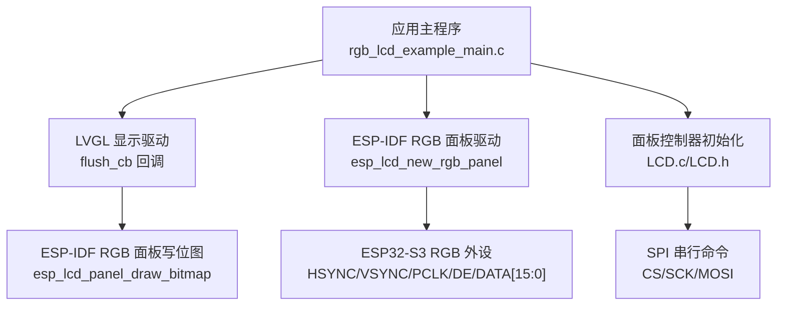
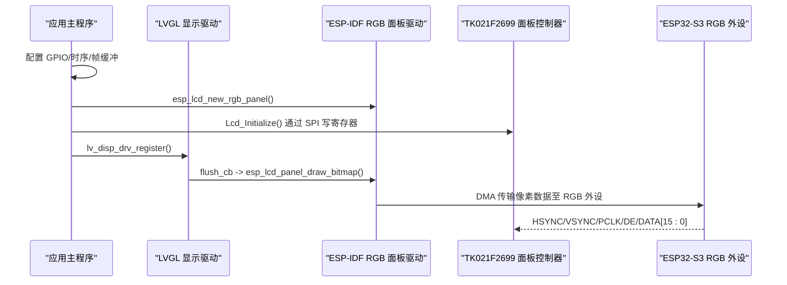
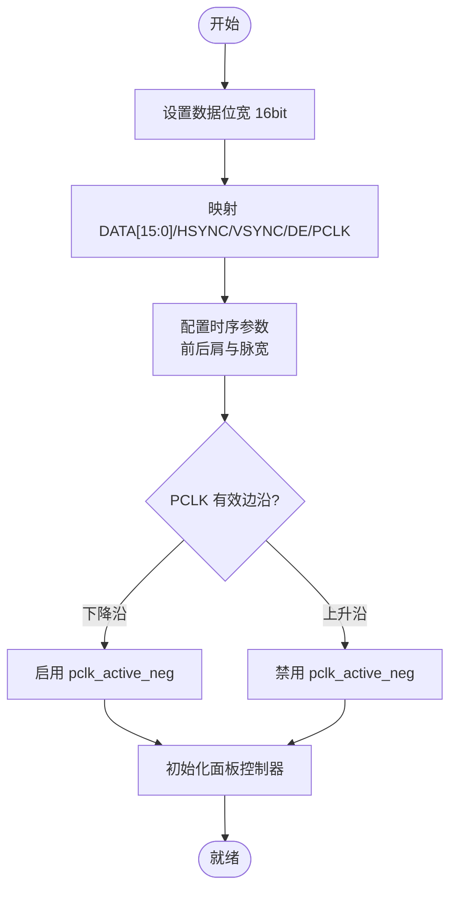
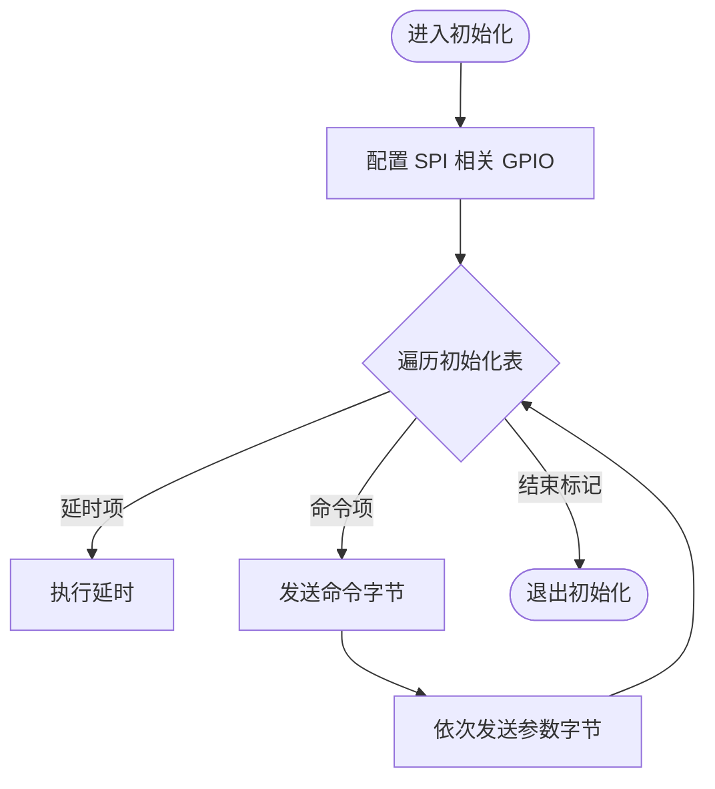
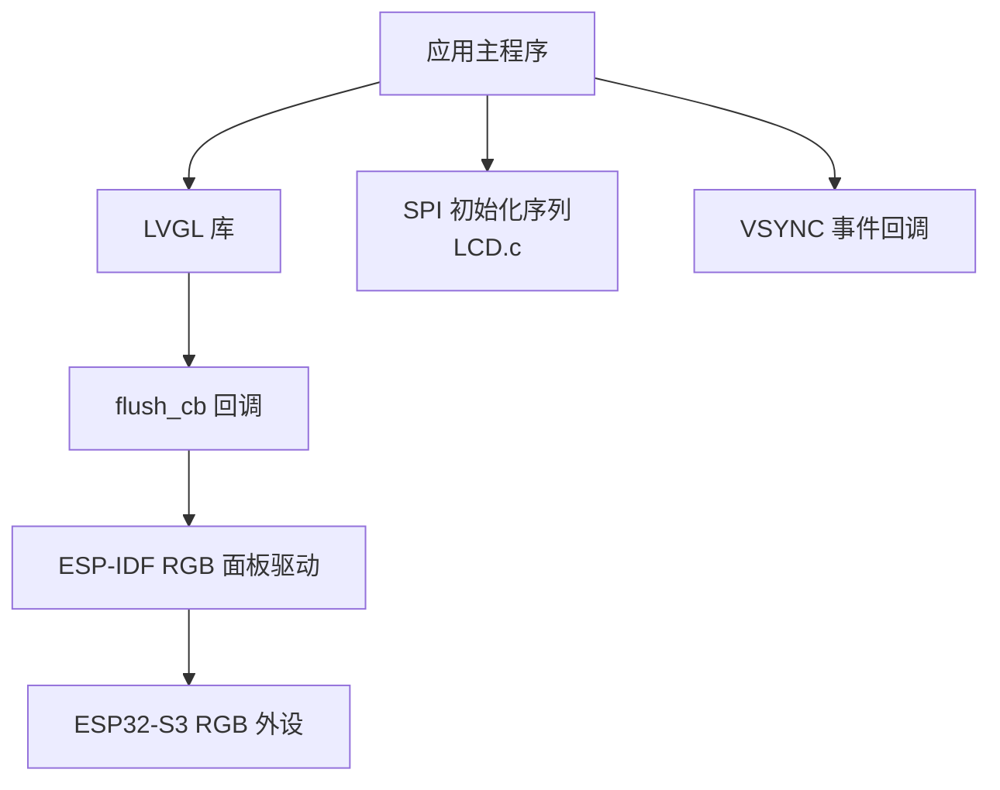

# TK021F2699 LCD面板

<cite>
**本文引用的文件**   
- [README.md](file://ESP32开发板/TK021F2699_ESP32_LVGL_GIF_LED/TK021F2699_ESP32_LVGL_GIF_LED/README.md)
- [rgb_lcd_example_main.c](file://ESP32开发板/TK021F2699_ESP32_LVGL_GIF_LED/TK021F2699_ESP32_LVGL_GIF_LED/main/rgb_lcd_example_main.c)
- [LCD.h](file://ESP32开发板/TK021F2699_ESP32_LVGL_GIF_LED/TK021F2699_ESP32_LVGL_GIF_LED/main/LCD.h)
- [LCD.c](file://ESP32开发板/TK021F2699_ESP32_LVGL_GIF_LED/TK021F2699_ESP32_LVGL_GIF_LED/main/LCD.c)
</cite>

## 目录
1. [简介](#简介)
2. [项目结构](#项目结构)
3. [核心组件](#核心组件)
4. [架构总览](#架构总览)
5. [详细组件分析](#详细组件分析)
6. [依赖关系分析](#依赖关系分析)
7. [性能与功耗考量](#性能与功耗考量)
8. [故障诊断指南](#故障诊断指南)
9. [结论](#结论)
10. [附录](#附录)

## 简介
本技术规格文档围绕 ESP32-S3 平台上的 TK021F2699 RGB LCD 面板，结合工程中的示例代码与配置，系统梳理以下关键内容：
- 显示规格：分辨率、像素格式（RGB565）、接口时序参数等
- 控制器初始化序列与寄存器配置方法（通过 SPI 命令写入）
- RGB 时序信号（HSYNC、VSYNC、PCLK、DE）的时序要求与配置要点
- 硬件连接与信号线定义
- 背光控制与扩展特性（如 WS2812 LED 控制）
- 驱动开发与调试建议

说明：
- 本项目为基于 ESP-IDF 的 RGB LCD 示例工程，使用 LVGL 进行 UI 渲染。
- 工程中未包含面板原始数据手册，因此涉及面板物理级指标（响应时间、亮度、对比度等）以“需参考面板规格书”的方式给出指引。

章节来源
- [README.md:1-122](file://ESP32开发板/TK021F2699_ESP32_LVGL_GIF_LED/TK021F2699_ESP32_LVGL_GIF_LED/README.md#L1-L122)

## 项目结构
该工程位于 ESP32 开发板目录下，核心与 TK021F2699 相关的源码集中在 main 目录中，包括：
- rgb_lcd_example_main.c：主程序入口，负责创建 RGB 面板驱动、注册 LVGL 显示驱动、设置时序与引脚映射、管理帧缓冲与任务调度
- LCD.h / LCD.c：提供针对该面板的 SPI 初始化序列与 GPIO 配置（用于面板控制器预置）
- README.md：示例使用说明、硬件连接示意、常见问题排查



图表来源
- [rgb_lcd_example_main.c:150-303](file://ESP32开发板/TK021F2699_ESP32_LVGL_GIF_LED/TK021F2699_ESP32_LVGL_GIF_LED/main/rgb_lcd_example_main.c#L150-L303)
- [LCD.c:186-219](file://ESP32开发板/TK021F2699_ESP32_LVGL_GIF_LED/TK021F2699_ESP32_LVGL_GIF_LED/main/LCD.c#L186-L219)
- [LCD.h:1-30](file://ESP32开发板/TK021F2699_ESP32_LVGL_GIF_LED/TK021F2699_ESP32_LVGL_GIF_LED/main/LCD.h#L1-L30)

章节来源
- [README.md:1-122](file://ESP32开发板/TK021F2699_ESP32_LVGL_GIF_LED/TK021F2699_ESP32_LVGL_GIF_LED/README.md#L1-L122)
- [rgb_lcd_example_main.c:150-303](file://ESP32开发板/TK021F2699_ESP32_LVGL_GIF_LED/TK021F2699_ESP32_LVGL_GIF_LED/main/rgb_lcd_example_main.c#L150-L303)
- [LCD.c:186-219](file://ESP32开发板/TK021F2699_ESP32_LVGL_GIF_LED/TK021F2699_ESP32_LVGL_GIF_LED/main/LCD.c#L186-L219)
- [LCD.h:1-30](file://ESP32开发板/TK021F2699_ESP32_LVGL_GIF_LED/TK021F2699_ESP32_LVGL_GIF_LED/main/LCD.h#L1-L30)

## 核心组件
- 应用主程序（rgb_lcd_example_main.c）
  - 配置并创建 RGB 面板驱动（数据宽度 16bit、时钟源、GPIO 映射、时序参数）
  - 注册 VSYNC 事件回调，可选地实现撕裂避免同步机制
  - 初始化 LVGL，分配绘制缓冲区（支持 PSRAM），注册 flush 回调
  - 启动 LVGL 定时器与任务
- 面板控制器初始化（LCD.c/LCD.h）
  - 通过 SPI 发送命令与参数，完成面板控制器（如 ST7701S）的初始化序列
  - 提供简单的 GPIO 配置与软件延时辅助函数
- 示例说明（README.md）
  - 硬件连接示意、背光亮灭电平说明、仅 DE 模式用法、常见故障排查

章节来源
- [rgb_lcd_example_main.c:150-303](file://ESP32开发板/TK021F2699_ESP32_LVGL_GIF_LED/TK021F2699_ESP32_LVGL_GIF_LED/main/rgb_lcd_example_main.c#L150-L303)
- [LCD.c:186-219](file://ESP32开发板/TK021F2699_ESP32_LVGL_GIF_LED/TK021F2699_ESP32_LVGL_GIF_LED/main/LCD.c#L186-L219)
- [LCD.h:1-30](file://ESP32开发板/TK021F2699_ESP32_LVGL_GIF_LED/TK021F2699_ESP32_LVGL_GIF_LED/main/LCD.h#L1-L30)
- [README.md:1-122](file://ESP32开发板/TK021F2699_ESP32_LVGL_GIF_LED/TK021F2699_ESP32_LVGL_GIF_LED/README.md#L1-L122)

## 架构总览
下图展示了从 LVGL 到 ESP32-S3 RGB 外设再到面板控制器的整体数据流与控制流。



图表来源
- [rgb_lcd_example_main.c:150-303](file://ESP32开发板/TK021F2699_ESP32_LVGL_GIF_LED/TK021F2699_ESP32_LVGL_GIF_LED/main/rgb_lcd_example_main.c#L150-L303)
- [LCD.c:186-219](file://ESP32开发板/TK021F2699_ESP32_LVGL_GIF_LED/TK021F2699_ESP32_LVGL_GIF_LED/main/LCD.c#L186-L219)

## 详细组件分析

### 显示规格与像素格式
- 分辨率：480x480（水平与垂直均为 480）
- 像素格式：RGB565（16bit 并行数据总线）
- 像素时钟：示例默认 16MHz（可通过宏调整）
- 帧缓冲：支持单缓冲或双缓冲；示例支持将帧缓冲置于 PSRAM

章节来源
- [rgb_lcd_example_main.c:29-58](file://ESP32开发板/TK021F2699_ESP32_LVGL_GIF_LED/TK021F2699_ESP32_LVGL_GIF_LED/main/rgb_lcd_example_main.c#L29-L58)
- [rgb_lcd_example_main.c:227-261](file://ESP32开发板/TK021F2699_ESP32_LVGL_GIF_LED/TK021F2699_ESP32_LVGL_GIF_LED/main/rgb_lcd_example_main.c#L227-L261)

### RGB 接口与时序配置
- 数据位宽：16bit（DATA[15:0]）
- 控制信号：HSYNC、VSYNC、DE、PCLK
- 时序参数（示例默认值）：
  - hsync_back_porch=9, hsync_front_porch=4, hsync_pulse_width=2
  - vsync_back_porch=9, vsync_front_porch=4, vsync_pulse_width=2
  - pclk_active_neg=true（下降沿采样）
- 时钟源：PLL240M（由驱动内部生成 PCLK）



图表来源
- [rgb_lcd_example_main.c:182-228](file://ESP32开发板/TK021F2699_ESP32_LVGL_GIF_LED/TK021F2699_ESP32_LVGL_GIF_LED/main/rgb_lcd_example_main.c#L182-L228)

章节来源
- [rgb_lcd_example_main.c:182-228](file://ESP32开发板/TK021F2699_ESP32_LVGL_GIF_LED/TK021F2699_ESP32_LVGL_GIF_LED/main/rgb_lcd_example_main.c#L182-L228)

### 面板控制器初始化序列与寄存器配置
- 初始化方式：通过 SPI 串行接口（CS/SCK/MOSI）向面板控制器发送命令与参数
- 初始化流程：
  - 配置相关 GPIO 为推挽输出
  - 按表顺序发送命令与参数，支持延时条目与结束标记
  - 最终开启显示（如 0x29）并进入正常显示模式
- 典型步骤（概念性描述）：
  - 选择/解锁寄存器页（部分控制器需要）
  - 设置像素格式（如 0x3A）
  - 配置电源与时序相关寄存器
  - 设置 Gamma 曲线与驱动能力
  - 设置窗口与扫描方向
  - 开启显示



图表来源
- [LCD.c:186-219](file://ESP32开发板/TK021F2699_ESP32_LVGL_GIF_LED/TK021F2699_ESP32_LVGL_GIF_LED/main/LCD.c#L186-L219)
- [LCD.c:86-160](file://ESP32开发板/TK021F2699_ESP32_LVGL_GIF_LED/TK021F2699_ESP32_LVGL_GIF_LED/main/LCD.c#L86-L160)

章节来源
- [LCD.c:86-160](file://ESP32开发板/TK021F2699_ESP32_LVGL_GIF_LED/TK021F2699_ESP32_LVGL_GIF_LED/main/LCD.c#L86-L160)
- [LCD.c:186-219](file://ESP32开发板/TK021F2699_ESP32_LVGL_GIF_LED/TK021F2699_ESP32_LVGL_GIF_LED/main/LCD.c#L186-L219)
- [LCD.h:1-30](file://ESP32开发板/TK021F2699_ESP32_LVGL_GIF_LED/TK021F2699_ESP32_LVGL_GIF_LED/main/LCD.h#L1-L30)

### 硬件连接与信号线定义
- 电源与地：VCC、GND
- 控制与时钟：HSYNC、VSYNC、DE、PCLK
- 数据总线：DATA[15:0]（RGB565）
- 背光：BK_LIGHT（注意高/低电平点亮逻辑）
- 显示使能：DISP_EN（可选）

```mermaid
graph LR
ESP["ESP32-S3"] --> |HSYNC| PNL["TK021F2699 面板"]
ESP --> |VSYNC| PNL
ESP --> |DE| PNL
ESP --> |PCLK| PNL
ESP --> |DATA[15:0]| PNL
ESP --> |BK_LIGHT| PNL
ESP --> |DISP_EN| PNL
```

图表来源
- [README.md:27-53](file://ESP32开发板/TK021F2699_ESP32_LVGL_GIF_LED/TK021F2699_ESP32_LVGL_GIF_LED/README.md#L27-L53)

章节来源
- [README.md:27-53](file://ESP32开发板/TK021F2699_ESP32_LVGL_GIF_LED/TK021F2699_ESP32_LVGL_GIF_LED/README.md#L27-L53)
- [rgb_lcd_example_main.c:32-54](file://ESP32开发板/TK021F2699_ESP32_LVGL_GIF_LED/TK021F2699_ESP32_LVGL_GIF_LED/main/rgb_lcd_example_main.c#L32-L54)

### 背光控制与扩展特性
- 背光控制：
  - 通过 GPIO 输出控制 BK_LIGHT 电平
  - 示例提供宏定义背光亮/灭电平，可按模块实际逻辑修改
- 扩展特性（WS2812 LED）：
  - 工程包含 WS2812 控制模块，可用于装饰灯带或状态指示
  - 在 app_main 中初始化并持有句柄，便于后续调用

章节来源
- [rgb_lcd_example_main.c:29-31](file://ESP32开发板/TK021F2699_ESP32_LVGL_GIF_LED/TK021F2699_ESP32_LVGL_GIF_LED/main/rgb_lcd_example_main.c#L29-L31)
- [rgb_lcd_example_main.c:152-155](file://ESP32开发板/TK021F2699_ESP32_LVGL_GIF_LED/TK021F2699_ESP32_LVGL_GIF_LED/main/rgb_lcd_example_main.c#L152-L155)

### 触摸功能（若支持）
- 当前工程未集成触摸控制器驱动与输入设备适配
- 如需添加触摸，建议在现有框架基础上增加触摸驱动与 LVGL 输入设备端口，并在主循环中轮询或中断上报坐标

章节来源
- [rgb_lcd_example_main.c:150-303](file://ESP32开发板/TK021F2699_ESP32_LVGL_GIF_LED/TK021F2699_ESP32_LVGL_GIF_LED/main/rgb_lcd_example_main.c#L150-L303)

## 依赖关系分析
- 应用层依赖 LVGL 库进行 UI 渲染与刷新
- LVGL 通过自定义 flush 回调调用 ESP-IDF RGB 面板驱动进行 DMA 传输
- 面板控制器初始化通过 SPI 串行接口完成，独立于 RGB 数据通路
- 可选的撕裂避免机制通过 VSYNC 事件与信号量实现



图表来源
- [rgb_lcd_example_main.c:84-109](file://ESP32开发板/TK021F2699_ESP32_LVGL_GIF_LED/TK021F2699_ESP32_LVGL_GIF_LED/main/rgb_lcd_example_main.c#L84-L109)
- [rgb_lcd_example_main.c:150-303](file://ESP32开发板/TK021F2699_ESP32_LVGL_GIF_LED/TK021F2699_ESP32_LVGL_GIF_LED/main/rgb_lcd_example_main.c#L150-L303)
- [LCD.c:186-219](file://ESP32开发板/TK021F2699_ESP32_LVGL_GIF_LED/TK021F2699_ESP32_LVGL_GIF_LED/main/LCD.c#L186-L219)

章节来源
- [rgb_lcd_example_main.c:84-109](file://ESP32开发板/TK021F2699_ESP32_LVGL_GIF_LED/TK021F2699_ESP32_LVGL_GIF_LED/main/rgb_lcd_example_main.c#L84-L109)
- [rgb_lcd_example_main.c:150-303](file://ESP32开发板/TK021F2699_ESP32_LVGL_GIF_LED/TK021F2699_ESP32_LVGL_GIF_LED/main/rgb_lcd_example_main.c#L150-L303)
- [LCD.c:186-219](file://ESP32开发板/TK021F2699_ESP32_LVGL_GIF_LED/TK021F2699_ESP32_LVGL_GIF_LED/main/LCD.c#L186-L219)

## 性能与功耗考量
- 帧缓冲位置：
  - 示例默认将帧缓冲放在 PSRAM，以降低 SRAM 占用，但受限于 SPI0 带宽，可能限制最大 PCLK
- 撕裂避免：
  - 可使用双缓冲或额外同步机制（信号量）减少撕裂
- 回冲缓冲（Bounce Buffer）：
  - 启用后可让 RGB 控制器从内部 SRAM 取数，提高 PCLK 上限，但会增加 CPU 占用
- ICache 优化：
  - 启用相关配置可减少 SPI0 带宽被 ICache 占用，有助于提升稳定性

章节来源
- [README.md:102-122](file://ESP32开发板/TK021F2699_ESP32_LVGL_GIF_LED/TK021F2699_ESP32_LVGL_GIF_LED/README.md#L102-L122)
- [rgb_lcd_example_main.c:227-272](file://ESP32开发板/TK021F2699_ESP32_LVGL_GIF_LED/TK021F2699_ESP32_LVGL_GIF_LED/main/rgb_lcd_example_main.c#L227-L272)

## 故障诊断指南
- 屏幕不亮：
  - 检查背光亮灭电平配置是否正确
- 无帧缓冲内存：
  - 将帧缓冲放置到 PSRAM，并注意 SPI0 带宽限制
- 画面漂移或不稳定：
  - 降低 PCLK 频率
  - 调整时序参数（如 PCLK 有效边沿、VBP 等）
  - 启用 ICache 相关优化配置
- 撕裂现象：
  - 使用双缓冲或增加同步机制
- 时序正确但无显示：
  - 确认是否需要额外的面板控制器初始化序列（通过 SPI 命令）

章节来源
- [README.md:102-122](file://ESP32开发板/TK021F2699_ESP32_LVGL_GIF_LED/TK021F2699_ESP32_LVGL_GIF_LED/README.md#L102-L122)

## 结论
本仓库提供了在 ESP32-S3 上驱动 TK021F2699 RGB LCD 的完整示例路径：通过 ESP-IDF RGB 面板驱动与 LVGL 组合，实现了 480x480、RGB565 的显示输出，并给出了时序配置、GPIO 映射、帧缓冲策略与撕裂避免方案。面板控制器初始化通过 SPI 串行命令完成，具备较好的可移植性与扩展性。对于面板的物理级性能指标，建议参考面板规格书并结合实测验证。

## 附录
- 引脚映射（示例默认）：
  - HSYNC: 41
  - VSYNC: 46
  - DE: 42
  - PCLK: 2
  - DATA[15:0]: 4/5/6/7/15/16/17/18/9/10/11/0/45/48/47/21
  - 背光：根据宏定义配置
- 时序参数（示例默认）：
  - hsync_back_porch=9, hsync_front_porch=4, hsync_pulse_width=2
  - vsync_back_porch=9, vsync_front_porch=4, vsync_pulse_width=2
  - pclk_active_neg=true

章节来源
- [rgb_lcd_example_main.c:32-54](file://ESP32开发板/TK021F2699_ESP32_LVGL_GIF_LED/TK021F2699_ESP32_LVGL_GIF_LED/main/rgb_lcd_example_main.c#L32-L54)
- [rgb_lcd_example_main.c:213-226](file://ESP32开发板/TK021F2699_ESP32_LVGL_GIF_LED/TK021F2699_ESP32_LVGL_GIF_LED/main/rgb_lcd_example_main.c#L213-L226)