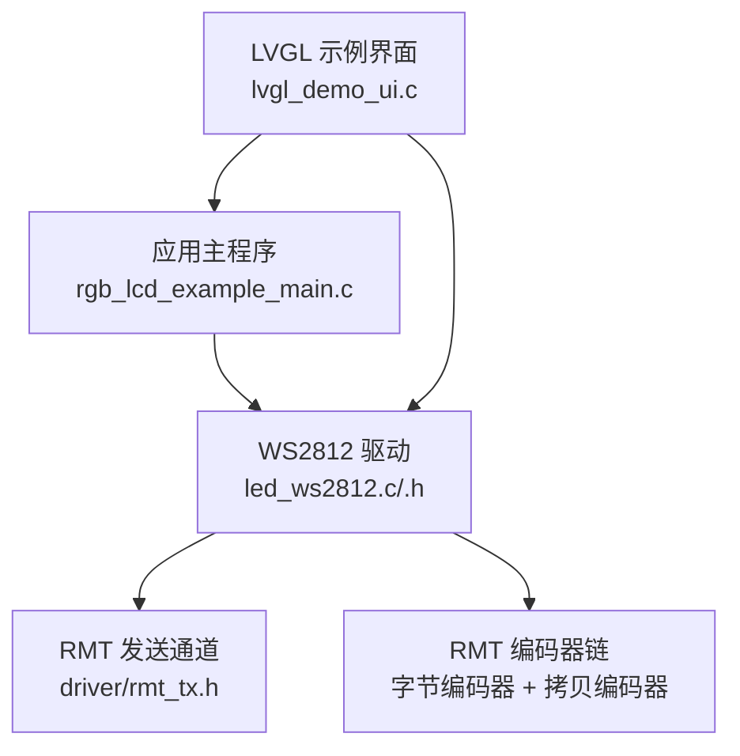
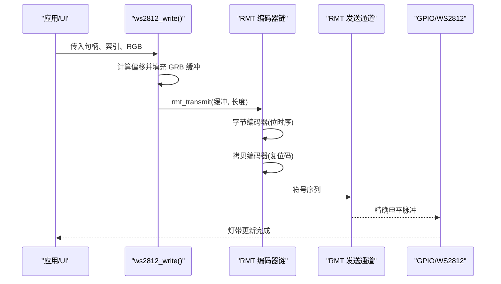
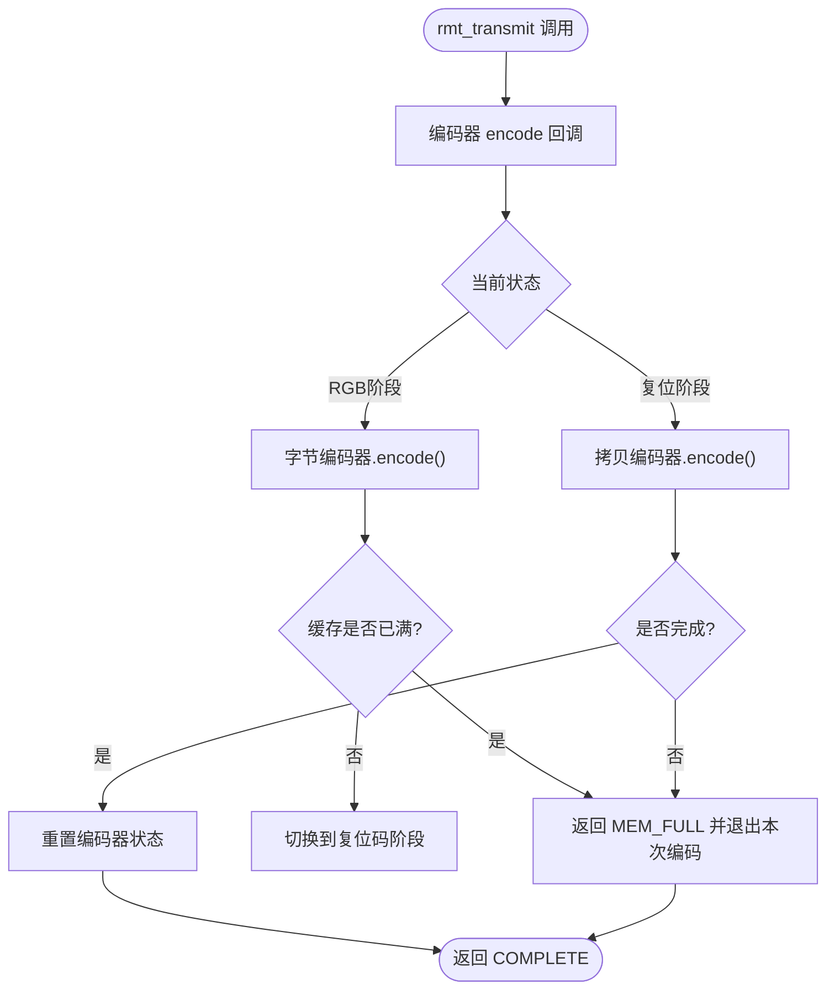
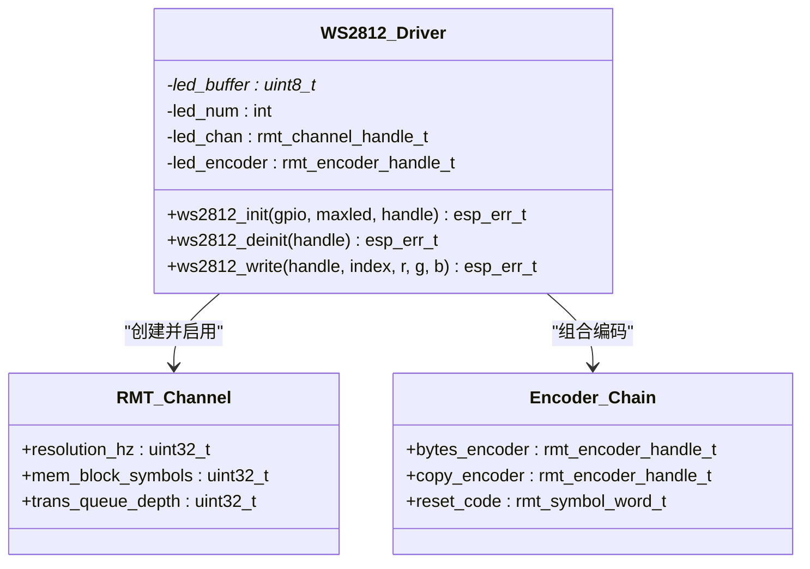
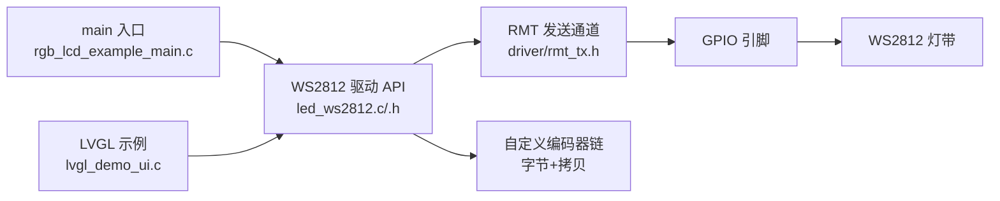

# WS2812 LED灯带控制

<cite>
**本文引用的文件**   
- [led_ws2812.h](file://ESP32开发板/TK021F2699_ESP32_LVGL_GIF_LED/TK021F2699_ESP32_LVGL_GIF_LED/main/led_ws2812/led_ws2812.h)
- [led_ws2812.c](file://ESP32开发板/TK021F2699_ESP32_LVGL_GIF_LED/TK021F2699_ESP32_LVGL_GIF_LED/main/led_ws2812/led_ws2812.c)
- [rgb_lcd_example_main.c](file://ESP32开发板/TK021F2699_ESP32_LVGL_GIF_LED/TK021F2699_ESP32_LVGL_GIF_LED/main/rgb_lcd_example_main.c)
- [lvgl_demo_ui.c](file://ESP32开发板/TK021F2699_ESP32_LVGL_GIF_LED/TK021F2699_ESP32_LVGL_GIF_LED/main/ui/lvgl_demo_ui.c)
</cite>

## 目录
1. [简介](#简介)
2. [项目结构](#项目结构)
3. [核心组件](#核心组件)
4. [架构总览](#架构总览)
5. [详细组件分析](#详细组件分析)
6. [依赖关系分析](#依赖关系分析)
7. [性能与内存优化](#性能与内存优化)
8. [故障排查指南](#故障排查指南)
9. [结论](#结论)
10. [附录：接口与配置速查](#附录接口与配置速查)

## 简介
本文件面向硬件工程师与嵌入式开发者，系统化梳理基于 ESP32 的 WS2812 LED 灯带控制方案。文档覆盖以下要点：
- WS2812 芯片工作原理与单总线时序（GRB、MSB 优先、复位码）
- RMT（远程调制解调器）硬件模块的配置与使用方式
- LED 灯带的物理连接与电气特性建议
- GPIO 引脚配置与数据传输函数接口说明
- 常见动态效果实现思路（跑马灯、颜色渐变、呼吸灯等）
- 大量 LED 控制时的内存与性能优化策略
- 开发与调试实用指导

## 项目结构
本项目在应用层通过 LVGL UI 触发 LED 效果，底层通过自定义 RMT 编码器驱动 WS2812 灯带。关键文件职责如下：
- led_ws2812.h / led_ws2812.c：封装 WS2812 初始化、反初始化、写入接口；实现基于 RMT 的自定义编码器，生成符合 WS2812 时序的波形
- rgb_lcd_example_main.c：系统入口，初始化 WS2812 并启动 LVGL 显示任务
- lvgl_demo_ui.c：UI 示例中演示了“跑马灯”效果的调用方式

图表来源
- [rgb_lcd_example_main.c:150-153](file://ESP32开发板/TK021F2699_ESP32_LVGL_GIF_LED/TK021F2699_ESP32_LVGL_GIF_LED/main/rgb_lcd_example_main.c#L150-L153)
- [led_ws2812.c:179-213](file://ESP32开发板/TK021F2699_ESP32_LVGL_GIF_LED/TK021F2699_ESP32_LVGL_GIF_LED/main/led_ws2812/led_ws2812.c#L179-L213)
- [lvgl_demo_ui.c:84-149](file://ESP32开发板/TK021F2699_ESP32_LVGL_GIF_LED/TK021F2699_ESP32_LVGL_GIF_LED/main/ui/lvgl_demo_ui.c#L84-L149)

章节来源
- [rgb_lcd_example_main.c:150-153](file://ESP32开发板/TK021F2699_ESP32_LVGL_GIF_LED/TK021F2699_ESP32_LVGL_GIF_LED/main/rgb_lcd_example_main.c#L150-L153)
- [led_ws2812.h:15-40](file://ESP32开发板/TK021F2699_ESP32_LVGL_GIF_LED/TK021F2699_ESP32_LVGL_GIF_LED/main/led_ws2812/led_ws2812.h#L15-L40)
- [led_ws2812.c:179-213](file://ESP32开发板/TK021F2699_ESP32_LVGL_GIF_LED/TK021F2699_ESP32_LVGL_GIF_LED/main/led_ws2812/led_ws2812.c#L179-L213)
- [lvgl_demo_ui.c:84-149](file://ESP32开发板/TK021F2699_ESP32_LVGL_GIF_LED/TK021F2699_ESP32_LVGL_GIF_LED/main/ui/lvgl_demo_ui.c#L84-L149)

## 核心组件
- WS2812 驱动抽象
  - 初始化/反初始化：创建 RMT 通道、分配 RGB 缓冲、使能通道
  - 写入接口：按索引更新 GRB 数据，并通过 RMT 发送整条灯带帧
- RMT 自定义编码器
  - 组合“字节编码器”和“拷贝编码器”，实现 WS2812 的位时序与结束复位码
  - 状态机控制：先编码 RGB 数据，再追加复位码，最后回到初始状态
- 应用集成
  - 主程序初始化 WS2812
  - UI 示例中循环调用写入接口实现跑马灯

章节来源
- [led_ws2812.h:15-40](file://ESP32开发板/TK021F2699_ESP32_LVGL_GIF_LED/TK021F2699_ESP32_LVGL_GIF_LED/main/led_ws2812/led_ws2812.h#L15-L40)
- [led_ws2812.c:179-213](file://ESP32开发板/TK021F2699_ESP32_LVGL_GIF_LED/TK021F2699_ESP32_LVGL_GIF_LED/main/led_ws2812/led_ws2812.c#L179-L213)
- [led_ws2812.c:236-250](file://ESP32开发板/TK021F2699_ESP32_LVGL_GIF_LED/TK021F2699_ESP32_LVGL_GIF_LED/main/led_ws2812/led_ws2812.c#L236-L250)
- [lvgl_demo_ui.c:84-149](file://ESP32开发板/TK021F2699_ESP32_LVGL_GIF_LED/TK021F2699_ESP32_LVGL_GIF_LED/main/ui/lvgl_demo_ui.c#L84-L149)

## 架构总览
下图展示了从应用到硬件的完整链路：应用层调用 WS2812 写入接口，内部将 GRB 数据写入缓冲区，随后通过 RMT 通道以精确时序输出至 GPIO，最终驱动 WS2812 灯带。

图表来源
- [led_ws2812.c:236-250](file://ESP32开发板/TK021F2699_ESP32_LVGL_GIF_LED/TK021F2699_ESP32_LVGL_GIF_LED/main/led_ws2812/led_ws2812.c#L236-L250)
- [led_ws2812.c:49-89](file://ESP32开发板/TK021F2699_ESP32_LVGL_GIF_LED/TK021F2699_ESP32_LVGL_GIF_LED/main/led_ws2812/led_ws2812.c#L49-L89)
- [led_ws2812.c:113-171](file://ESP32开发板/TK021F2699_ESP32_LVGL_GIF_LED/TK021F2699_ESP32_LVGL_GIF_LED/main/led_ws2812/led_ws2812.c#L113-L171)

## 详细组件分析

### WS2812 通信协议与时序
- 数据格式
  - 每颗 LED 占用 24bit，顺序为 G-R-B（注意不是常见的 R-G-B）
  - 高位优先（MSB first），即每个字节的最高位先传输
- 位时序（近似值，具体以芯片手册为准）
  - “0”位：高电平约 0.3us，低电平约 0.9us
  - “1”位：高电平约 0.9us，低电平约 0.3us
  - 位周期约 1.25us，对应约 800kbps 速率
- 复位码
  - 所有 LED 接收完一帧后，需要至少 50us 的低电平作为复位间隔，确保下一帧正确锁存

章节来源
- [led_ws2812.c:126-140](file://ESP32开发板/TK021F2699_ESP32_LVGL_GIF_LED/TK021F2699_ESP32_LVGL_GIF_LED/main/led_ws2812/led_ws2812.c#L126-L140)
- [led_ws2812.c:148-155](file://ESP32开发板/TK021F2699_ESP32_LVGL_GIF_LED/TK021F2699_ESP32_LVGL_GIF_LED/main/led_ws2812/led_ws2812.c#L148-L155)
- [led_ws2812.c:244-246](file://ESP32开发板/TK021F2699_ESP32_LVGL_GIF_LED/TK021F2699_ESP32_LVGL_GIF_LED/main/led_ws2812/led_ws2812.c#L244-L246)

### RMT 硬件模块配置与使用
- 分辨率与时基
  - 设置 RMT 分辨率为 10MHz，即 1 tick = 0.1us，满足 WS2812 最小时间单元要求
- 通道配置
  - 指定 GPIO、时钟源、内存块大小、队列深度等
- 编码器链
  - 字节编码器：根据 bit0/bit1 的高/低电平持续时间生成符号
  - 拷贝编码器：用于追加固定时长的复位码
- 发送流程
  - rmt_transmit 触发编码器 encode 回调，依次执行字节编码与拷贝编码，最终由 RMT 硬件产生精确波形

图表来源
- [led_ws2812.c:49-89](file://ESP32开发板/TK021F2699_ESP32_LVGL_GIF_LED/TK021F2699_ESP32_LVGL_GIF_LED/main/led_ws2812/led_ws2812.c#L49-L89)
- [led_ws2812.c:113-171](file://ESP32开发板/TK021F2699_ESP32_LVGL_GIF_LED/TK021F2699_ESP32_LVGL_GIF_LED/main/led_ws2812/led_ws2812.c#L113-L171)
- [led_ws2812.c:192-207](file://ESP32开发板/TK021F2699_ESP32_LVGL_GIF_LED/TK021F2699_ESP32_LVGL_GIF_LED/main/led_ws2812/led_ws2812.c#L192-L207)

章节来源
- [led_ws2812.c:192-207](file://ESP32开发板/TK021F2699_ESP32_LVGL_GIF_LED/TK021F2699_ESP32_LVGL_GIF_LED/main/led_ws2812/led_ws2812.c#L192-L207)
- [led_ws2812.c:113-171](file://ESP32开发板/TK021F2699_ESP32_LVGL_GIF_LED/TK021F2699_ESP32_LVGL_GIF_LED/main/led_ws2812/led_ws2812.c#L113-L171)

### 物理连接与电气特性
- 信号线
  - 使用单个 GPIO 作为数据输出（示例中定义为某 GPIO 编号）
- 电源与地
  - 灯带需独立供电，确保电流容量足够；GND 与 MCU 共地
- 信号完整性
  - 建议在 MCU 输出端串联一个限流电阻（常见 220Ω~470Ω）
  - 长距离或高密度灯带建议在数据输入端并联去耦电容（如 100nF）
- 复位码
  - 每次发送完一帧后，必须保证至少 50us 的低电平间隔，代码中已通过拷贝编码器追加复位码

章节来源
- [led_ws2812.h:15-16](file://ESP32开发板/TK021F2699_ESP32_LVGL_GIF_LED/TK021F2699_ESP32_LVGL_GIF_LED/main/led_ws2812/led_ws2812.h#L15-L16)
- [led_ws2812.c:148-155](file://ESP32开发板/TK021F2699_ESP32_LVGL_GIF_LED/TK021F2699_ESP32_LVGL_GIF_LED/main/led_ws2812/led_ws2812.c#L148-L155)

### GPIO 引脚配置与数据传输接口
- 引脚定义
  - 数据输出引脚宏定义位于头文件中
- 初始化接口
  - ws2812_init(gpio, maxled, &handle)：创建 RMT 通道、分配缓冲、使能通道
- 写入接口
  - ws2812_write(handle, index, r, g, b)：将目标 LED 的 GRB 写入缓冲，并触发一次全串发送
- 反初始化接口
  - ws2812_deinit(handle)：释放资源

图表来源
- [led_ws2812.h:20-40](file://ESP32开发板/TK021F2699_ESP32_LVGL_GIF_LED/TK021F2699_ESP32_LVGL_GIF_LED/main/led_ws2812/led_ws2812.h#L20-L40)
- [led_ws2812.c:179-213](file://ESP32开发板/TK021F2699_ESP32_LVGL_GIF_LED/TK021F2699_ESP32_LVGL_GIF_LED/main/led_ws2812/led_ws2812.c#L179-L213)
- [led_ws2812.c:113-171](file://ESP32开发板/TK021F2699_ESP32_LVGL_GIF_LED/TK021F2699_ESP32_LVGL_GIF_LED/main/led_ws2812/led_ws2812.c#L113-L171)

章节来源
- [led_ws2812.h:15-40](file://ESP32开发板/TK021F2699_ESP32_LVGL_GIF_LED/TK021F2699_ESP32_LVGL_GIF_LED/main/led_ws2812/led_ws2812.h#L15-L40)
- [led_ws2812.c:179-213](file://ESP32开发板/TK021F2699_ESP32_LVGL_GIF_LED/TK021F2699_ESP32_LVGL_GIF_LED/main/led_ws2812/led_ws2812.c#L179-L213)
- [led_ws2812.c:236-250](file://ESP32开发板/TK021F2699_ESP32_LVGL_GIF_LED/TK021F2699_ESP32_LVGL_GIF_LED/main/led_ws2812/led_ws2812.c#L236-L250)

### 动态效果算法实现
- 跑马灯
  - 在 UI 示例中以循环遍历 LED 索引，逐个写入不同颜色，配合延时形成流动效果
- 颜色渐变
  - 可基于 HSV 空间插值，逐步改变 H/S/V 值，逐帧更新缓冲并发送
- 呼吸灯
  - 对亮度分量进行正弦或线性缓动，周期性增大减小，达到柔和明暗变化

章节来源
- [lvgl_demo_ui.c:84-149](file://ESP32开发板/TK021F2699_ESP32_LVGL_GIF_LED/TK021F2699_ESP32_LVGL_GIF_LED/main/ui/lvgl_demo_ui.c#L84-L149)

## 依赖关系分析
- 上层应用
  - 主程序在启动时初始化 WS2812
  - UI 示例通过定时器或任务循环调用写入接口
- 驱动层
  - 依赖 ESP-IDF 的 RMT 发送通道与编码器 API
  - 自定义编码器组合字节编码器与拷贝编码器，严格遵循 WS2812 时序
- 硬件层
  - GPIO 输出经 RMT 硬件精确控制，直接驱动 WS2812 数据输入端

图表来源
- [rgb_lcd_example_main.c:150-153](file://ESP32开发板/TK021F2699_ESP32_LVGL_GIF_LED/TK021F2699_ESP32_LVGL_GIF_LED/main/rgb_lcd_example_main.c#L150-L153)
- [led_ws2812.c:179-213](file://ESP32开发板/TK021F2699_ESP32_LVGL_GIF_LED/TK021F2699_ESP32_LVGL_GIF_LED/main/led_ws2812/led_ws2812.c#L179-L213)
- [lvgl_demo_ui.c:84-149](file://ESP32开发板/TK021F2699_ESP32_LVGL_GIF_LED/TK021F2699_ESP32_LVGL_GIF_LED/main/ui/lvgl_demo_ui.c#L84-L149)

章节来源
- [rgb_lcd_example_main.c:150-153](file://ESP32开发板/TK021F2699_ESP32_LVGL_GIF_LED/TK021F2699_ESP32_LVGL_GIF_LED/main/rgb_lcd_example_main.c#L150-L153)
- [led_ws2812.c:179-213](file://ESP32开发板/TK021F2699_ESP32_LVGL_GIF_LED/TK021F2699_ESP32_LVGL_GIF_LED/main/led_ws2812/led_ws2812.c#L179-L213)
- [lvgl_demo_ui.c:84-149](file://ESP32开发板/TK021F2699_ESP32_LVGL_GIF_LED/TK021F2699_ESP32_LVGL_GIF_LED/main/ui/lvgl_demo_ui.c#L84-L149)

## 性能与内存优化
- 内存占用
  - 驱动为每条 LED 分配 3 字节缓冲（GRB），总大小为 N×3 字节
  - 若 LED 数量较大，建议将缓冲置于 PSRAM 以降低 SRAM 压力
- 传输效率
  - 单次 rmt_transmit 会发送整个缓冲，避免频繁小帧发送带来的开销
  - 合理设置 RMT 内存块大小与队列深度，平衡吞吐与延迟
- 时序精度
  - RMT 分辨率设为 10MHz，确保 0.1us 级时序精度，满足 WS2812 要求
- 并发与实时性
  - 可在独立任务中运行 LED 动画，避免阻塞 UI 线程
  - 使用 FreeRTOS 延时与定时器协调刷新频率，降低 CPU 占用

章节来源
- [led_ws2812.c:186-187](file://ESP32开发板/TK021F2699_ESP32_LVGL_GIF_LED/TK021F2699_ESP32_LVGL_GIF_LED/main/led_ws2812/led_ws2812.c#L186-L187)
- [led_ws2812.c:192-198](file://ESP32开发板/TK021F2699_ESP32_LVGL_GIF_LED/TK021F2699_ESP32_LVGL_GIF_LED/main/led_ws2812/led_ws2812.c#L192-L198)
- [led_ws2812.c:236-250](file://ESP32开发板/TK021F2699_ESP32_LVGL_GIF_LED/TK021F2699_ESP32_LVGL_GIF_LED/main/led_ws2812/led_ws2812.c#L236-L250)

## 故障排查指南
- 现象：灯带不亮或颜色错乱
  - 检查 GPIO 是否正确配置且未被其他外设占用
  - 确认数据顺序是否为 GRB，而非 RGB
  - 验证复位码时长是否满足 ≥50us
- 现象：闪烁或丢帧
  - 检查电源是否充足，是否存在电压跌落
  - 增加数据端串联电阻与输入端去耦电容
  - 调整 RMT 队列深度与内存块大小，提升稳定性
- 现象：时序不稳定
  - 确认 RMT 分辨率设置为 10MHz
  - 避免在主循环中进行耗时操作，尽量使用任务/定时器调度

章节来源
- [led_ws2812.c:126-140](file://ESP32开发板/TK021F2699_ESP32_LVGL_GIF_LED/TK021F2699_ESP32_LVGL_GIF_LED/main/led_ws2812/led_ws2812.c#L126-L140)
- [led_ws2812.c:148-155](file://ESP32开发板/TK021F2699_ESP32_LVGL_GIF_LED/TK021F2699_ESP32_LVGL_GIF_LED/main/led_ws2812/led_ws2812.c#L148-L155)
- [led_ws2812.c:192-198](file://ESP32开发板/TK021F2699_ESP32_LVGL_GIF_LED/TK021F2699_ESP32_LVGL_GIF_LED/main/led_ws2812/led_ws2812.c#L192-L198)

## 结论
该方案利用 ESP32 的 RMT 外设与自定义编码器，实现了高精度、低 CPU 占用的 WS2812 灯带控制。通过合理的内存布局、时序配置与任务调度，可在多 LED 场景下获得稳定流畅的动态效果。结合 UI 示例中的跑马灯实践，开发者可快速扩展更多复杂特效。

## 附录：接口与配置速查
- 初始化
  - ws2812_init(gpio, maxled, &handle)
- 写入
  - ws2812_write(handle, index, r, g, b)
- 反初始化
  - ws2812_deinit(handle)
- 关键配置
  - RMT 分辨率：10MHz（0.1us 步进）
  - 数据顺序：GRB，MSB 优先
  - 复位码：≥50us 低电平

章节来源
- [led_ws2812.h:20-40](file://ESP32开发板/TK021F2699_ESP32_LVGL_GIF_LED/TK021F2699_ESP32_LVGL_GIF_LED/main/led_ws2812/led_ws2812.h#L20-L40)
- [led_ws2812.c:126-140](file://ESP32开发板/TK021F2699_ESP32_LVGL_GIF_LED/TK021F2699_ESP32_LVGL_GIF_LED/main/led_ws2812/led_ws2812.c#L126-L140)
- [led_ws2812.c:148-155](file://ESP32开发板/TK021F2699_ESP32_LVGL_GIF_LED/TK021F2699_ESP32_LVGL_GIF_LED/main/led_ws2812/led_ws2812.c#L148-L155)
- [led_ws2812.c:192-198](file://ESP32开发板/TK021F2699_ESP32_LVGL_GIF_LED/TK021F2699_ESP32_LVGL_GIF_LED/main/led_ws2812/led_ws2812.c#L192-L198)