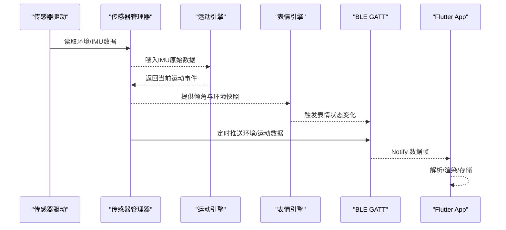
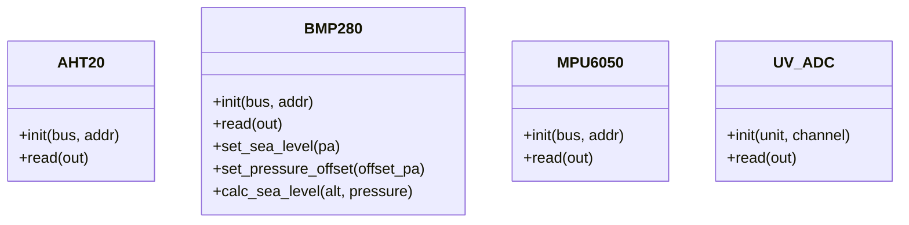
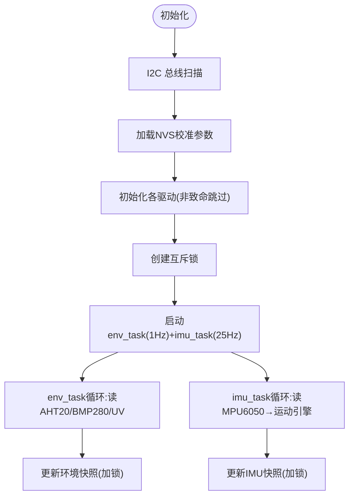
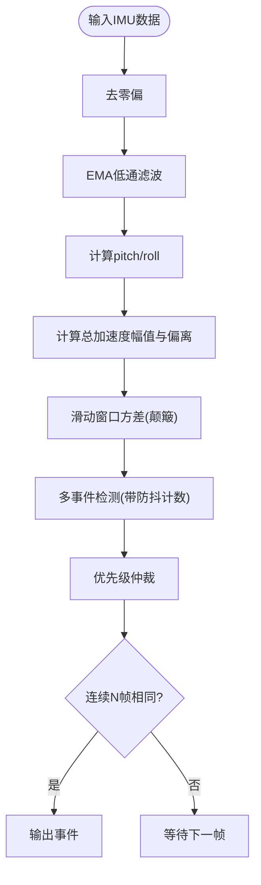
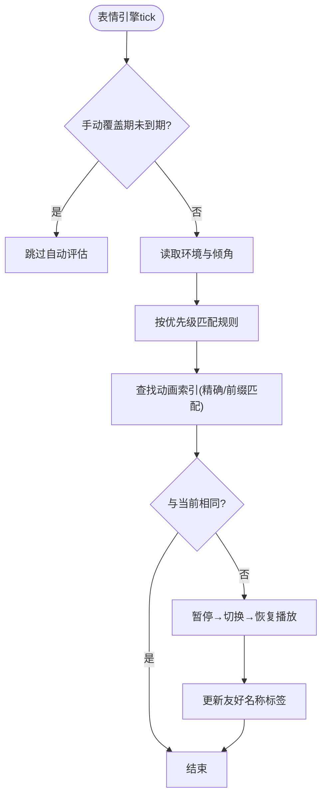
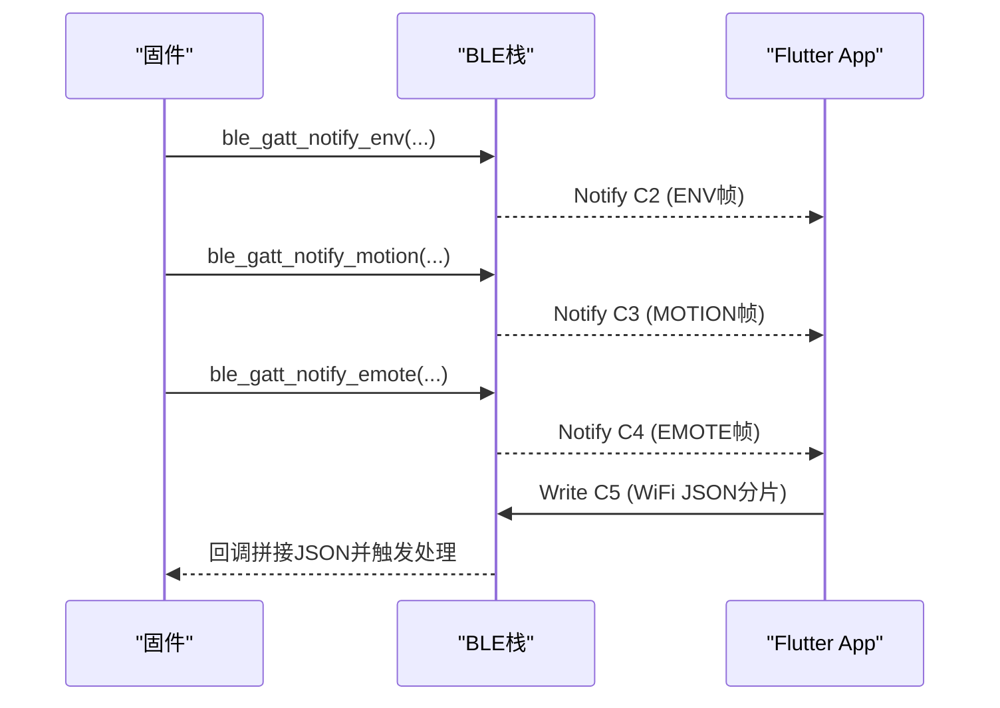
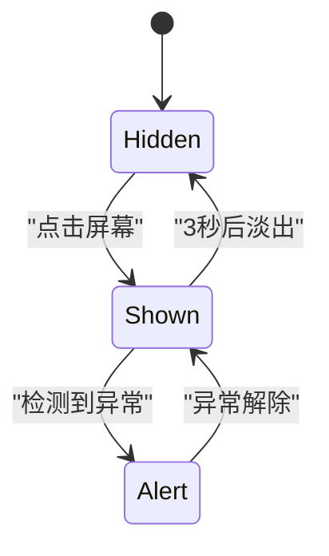
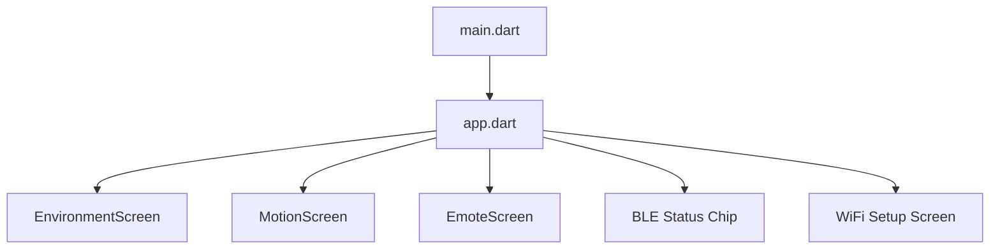

# 传感器管理系统

<cite>
**本文引用的文件**   
- [README.md](file://README.md)
- [main.c](file://PathFinder_EMOTE/main/main.c)
- [sensor_manager.c](file://PathFinder_EMOTE/main/sensor_manager.c)
- [sensor_manager.h](file://PathFinder_EMOTE/main/sensor_manager.h)
- [motion_engine.c](file://PathFinder_EMOTE/main/motion_engine.c)
- [emote_engine.c](file://PathFinder_EMOTE/main/emote_engine.c)
- [ble_gatt_server.c](file://PathFinder_EMOTE/main/ble_gatt_server.c)
- [drv_aht20.c](file://PathFinder_EMOTE/main/drivers/drv_aht20.c)
- [drv_bmp280.c](file://PathFinder_EMOTE/main/drivers/drv_bmp280.c)
- [drv_mpu6050.c](file://PathFinder_EMOTE/main/drivers/drv_mpu6050.c)
- [drv_uv_adc.c](file://PathFinder_EMOTE/main/drivers/drv_uv_adc.c)
- [main.dart](file://PathFinder_Dashboard/lib/main.dart)
- [app.dart](file://PathFinder_Dashboard/lib/app/app.dart)
</cite>

## 目录
1. [简介](#简介)
2. [项目结构](#项目结构)
3. [核心组件](#核心组件)
4. [架构总览](#架构总览)
5. [详细组件分析](#详细组件分析)
6. [依赖关系分析](#依赖关系分析)
7. [性能与资源特性](#性能与资源特性)
8. [故障排查指南](#故障排查指南)
9. [结论](#结论)
10. [附录：BLE 协议与数据帧](#附录ble-协议与数据帧)

## 简介
本项目为“车载智能表情终端系统”，由双端组成：
- ESP32-S3 固件端（PathFinder_EMOTE）：采集温湿度、气压海拔、UV 紫外线与 IMU 姿态，进行运动事件分析与表情联动，通过 BLE GATT 推送数据至手机端。
- Flutter 仪表盘应用（PathFinder_Dashboard）：连接设备，实时可视化环境/运动/表情数据，并提供历史数据查看与导出。

系统采用分层设计：驱动层 → 传感器管理 → 运动分析 → 表情联动 → BLE 通信 → UI 展示。

## 项目结构
- 固件端按模块划分：传感器驱动、传感器管理器、运动引擎、表情引擎、BLE GATT Server、LVGL UI 集成等。
- App 端采用分层架构：BLE 通信层、数据持久层、UI 可视化层、状态管理层与共享组件。

```mermaid
graph TB
subgraph "ESP32 固件"
A["传感器驱动<br/>AHT20/BMP280/MPU6050/UV ADC"]
B["传感器管理器<br/>env_task(1Hz)+imu_task(25Hz)"]
C["运动分析引擎<br/>事件检测+滤波+迟滞"]
D["表情联动引擎<br/>规则评估→动画切换"]
E["BLE GATT Server<br/>C2/C3/C4 通知"]
F["LVGL UI + 触摸"]
end
subgraph "Flutter 仪表盘"
G["BLE 服务与编解码"]
H["数据库与导出"]
I["环境/运动/表情页面"]
end
A --> B --> C --> D --> E
B --> F
E < --> G
G --> H
G --> I
```

图表来源
- [main.c:1-120](file://PathFinder_EMOTE/main/main.c#L1-L120)
- [sensor_manager.c:1-120](file://PathFinder_EMOTE/main/sensor_manager.c#L1-L120)
- [motion_engine.c:1-120](file://PathFinder_EMOTE/main/motion_engine.c#L1-L120)
- [emote_engine.c:1-120](file://PathFinder_EMOTE/main/emote_engine.c#L1-L120)
- [ble_gatt_server.c:1-120](file://PathFinder_EMOTE/main/ble_gatt_server.c#L1-L120)
- [app.dart:1-81](file://PathFinder_Dashboard/lib/app/app.dart#L1-L81)

章节来源
- [README.md:1-120](file://README.md#L1-L120)

## 核心组件
- 传感器驱动层：实现 AHT20、BMP280、MPU6050、UV ADC 的初始化与读取，包含校准与容错处理。
- 传感器管理器：创建 I2C-1 总线，启动 env_task（1Hz）与 imu_task（25Hz），线程安全地维护最新快照，提供 NVS 校准接口。
- 运动分析引擎：对 IMU 数据进行去零偏、EMA 低通滤波、角度计算、滑动窗口方差、多事件检测与优先级仲裁，输出稳定事件。
- 表情联动引擎：基于环境与姿态综合评估，按优先级选择表情并切换播放，支持手动轮播与自动评估间隔控制。
- BLE GATT Server：定义 Service 与特征值，处理订阅与连接事件，定时推送环境/运动/表情数据帧。
- LVGL UI：圆形屏显示，胶囊式数据条、异常高亮与脉冲动画、明细页与校准交互。
- Flutter 仪表盘：BLE 连接、数据解析、SQLite 存储、折线/波形图与表情展示。

章节来源
- [sensor_manager.c:176-236](file://PathFinder_EMOTE/main/sensor_manager.c#L176-L236)
- [motion_engine.c:134-142](file://PathFinder_EMOTE/main/motion_engine.c#L134-L142)
- [emote_engine.c:232-263](file://PathFinder_EMOTE/main/emote_engine.c#L232-L263)
- [ble_gatt_server.c:314-356](file://PathFinder_EMOTE/main/ble_gatt_server.c#L314-L356)
- [main.c:269-289](file://PathFinder_EMOTE/main/main.c#L269-L289)
- [app.dart:11-81](file://PathFinder_Dashboard/lib/app/app.dart#L11-L81)

## 架构总览
系统以 FreeRTOS 任务为核心调度单元，传感器采样与数据处理并行执行，BLE 通知在连接状态下按需推送，UI 在 LVGL 主线程中更新。



图表来源
- [sensor_manager.c:83-151](file://PathFinder_EMOTE/main/sensor_manager.c#L83-L151)
- [motion_engine.c:183-371](file://PathFinder_EMOTE/main/motion_engine.c#L183-L371)
- [emote_engine.c:265-295](file://PathFinder_EMOTE/main/emote_engine.c#L265-L295)
- [ble_gatt_server.c:376-456](file://PathFinder_EMOTE/main/ble_gatt_server.c#L376-L456)

## 详细组件分析

### 传感器驱动层
- AHT20：I2C 初始化、触发测量、读取温湿度，含忙位检查与错误日志。
- BMP280：读取校准系数、配置寄存器、温度/气压补偿、海拔换算，支持海平面气压与偏移补偿。
- MPU6050：WHO_AM_I 校验、唤醒与 PLL 配置、DLPF 带宽设置、量程配置、连续读取加速度/陀螺仪/温度。
- UV ADC：ADC 单元与通道配置、曲线拟合校准、1024 次过采样平均、查表法映射 UV Index。



图表来源
- [drv_aht20.c:24-84](file://PathFinder_EMOTE/main/drivers/drv_aht20.c#L24-L84)
- [drv_bmp280.c:161-238](file://PathFinder_EMOTE/main/drivers/drv_bmp280.c#L161-L238)
- [drv_mpu6050.c:54-135](file://PathFinder_EMOTE/main/drivers/drv_mpu6050.c#L54-L135)
- [drv_uv_adc.c:56-146](file://PathFinder_EMOTE/main/drivers/drv_uv_adc.c#L56-L146)

章节来源
- [drv_aht20.c:24-84](file://PathFinder_EMOTE/main/drivers/drv_aht20.c#L24-L84)
- [drv_bmp280.c:161-238](file://PathFinder_EMOTE/main/drivers/drv_bmp280.c#L161-L238)
- [drv_mpu6050.c:54-135](file://PathFinder_EMOTE/main/drivers/drv_mpu6050.c#L54-L135)
- [drv_uv_adc.c:56-146](file://PathFinder_EMOTE/main/drivers/drv_uv_adc.c#L56-L146)

### 传感器管理器
- 双任务架构：env_task 每 1s 读取 AHT20/BMP280/UV；imu_task 每 40ms 读取 MPU6050 并送入运动引擎。
- 线程安全：使用互斥锁保护环境/IMU 快照读写。
- NVS 校准：保存/加载海平面气压与压力偏移，支持重置与查询。
- I2C 扫描：启动时打印总线设备地址，便于硬件诊断。



图表来源
- [sensor_manager.c:176-236](file://PathFinder_EMOTE/main/sensor_manager.c#L176-L236)
- [sensor_manager.c:83-151](file://PathFinder_EMOTE/main/sensor_manager.c#L83-L151)
- [sensor_manager.c:47-78](file://PathFinder_EMOTE/main/sensor_manager.c#L47-L78)

章节来源
- [sensor_manager.c:176-236](file://PathFinder_EMOTE/main/sensor_manager.c#L176-L236)
- [sensor_manager.c:83-151](file://PathFinder_EMOTE/main/sensor_manager.c#L83-L151)
- [sensor_manager.c:47-78](file://PathFinder_EMOTE/main/sensor_manager.c#L47-L78)

### 运动分析引擎
- 算法流程：去零偏 → EMA 低通滤波 → 计算 pitch/roll → 滑动窗口方差（颠簸）→ 候选事件检测（急加速/刹车/转弯/颠簸/坡度/倾斜/高速/静止）→ 优先级仲裁 → 稳定输出（连续 N 帧确认）。
- 防抖与迟滞：进入/退出阈值不同，避免边界抖动；碰撞事件直通无延迟。
- 输出：当前运动事件与倾角缓存供上层使用。



图表来源
- [motion_engine.c:183-371](file://PathFinder_EMOTE/main/motion_engine.c#L183-L371)

章节来源
- [motion_engine.c:134-142](file://PathFinder_EMOTE/main/motion_engine.c#L134-L142)
- [motion_engine.c:183-371](file://PathFinder_EMOTE/main/motion_engine.c#L183-L371)

### 表情联动引擎
- 设计理念：不再频繁切换运动事件导致抖动，改为基于环境与姿态的综合评估，按优先级选择最合适的表情。
- 评估规则：UV极端→恐慌；UV高→嘲讽；高温→叹气；低温→悲伤；高湿→哭；大倾角→疑惑；中等倾角→探究；低气压→思考；正常→休闲微笑。
- 切换策略：相同表情不重载；手动切换后 10s 内不自动评估；帧延迟与循环播放优化带宽峰值。



图表来源
- [emote_engine.c:265-295](file://PathFinder_EMOTE/main/emote_engine.c#L265-L295)
- [emote_engine.c:173-226](file://PathFinder_EMOTE/main/emote_engine.c#L173-L226)
- [emote_engine.c:139-166](file://PathFinder_EMOTE/main/emote_engine.c#L139-L166)

章节来源
- [emote_engine.c:232-263](file://PathFinder_EMOTE/main/emote_engine.c#L232-L263)
- [emote_engine.c:265-295](file://PathFinder_EMOTE/main/emote_engine.c#L265-L295)
- [emote_engine.c:173-226](file://PathFinder_EMOTE/main/emote_engine.c#L173-L226)

### BLE GATT Server
- 服务与特征：Service UUID 0xFE00；C2 环境、C3 运动、C4 表情、C5 WiFi（写+通知）。
- 连接与订阅：GAP 事件回调处理连接/断开/订阅状态；仅在客户端订阅时发送通知。
- 数据帧：小端二进制格式，严格对齐 Flutter 解码器；C2 20B、C3 8B、C4 15B。
- WiFi 配网：C5 Write 接收 JSON（首字节分包标记），完整后回调上层处理。



图表来源
- [ble_gatt_server.c:376-456](file://PathFinder_EMOTE/main/ble_gatt_server.c#L376-L456)
- [ble_gatt_server.c:67-119](file://PathFinder_EMOTE/main/ble_gatt_server.c#L67-L119)

章节来源
- [ble_gatt_server.c:314-356](file://PathFinder_EMOTE/main/ble_gatt_server.c#L314-L356)
- [ble_gatt_server.c:376-456](file://PathFinder_EMOTE/main/ble_gatt_server.c#L376-L456)
- [ble_gatt_server.c:67-119](file://PathFinder_EMOTE/main/ble_gatt_server.c#L67-L119)

### LVGL UI 与交互
- 布局：EAF 表情居中最大化，顶部/底部胶囊数据条默认隐藏，点击唤出 3 秒淡出。
- 异常高亮：碰撞/急刹车红色脉冲，高 UV/大倾角黄色警告。
- 明细页：环境/运动数据行列表，支持长按或点击进入，返回后恢复胶囊计时。
- 校准 UI：海拔调节按钮、P0 反推显示、OK/RESET 操作，结果写入 NVS。



图表来源
- [main.c:422-470](file://PathFinder_EMOTE/main/main.c#L422-L470)
- [main.c:630-754](file://PathFinder_EMOTE/main/main.c#L630-L754)
- [main.c:756-800](file://PathFinder_EMOTE/main/main.c#L756-L800)

章节来源
- [main.c:269-289](file://PathFinder_EMOTE/main/main.c#L269-L289)
- [main.c:422-470](file://PathFinder_EMOTE/main/main.c#L422-L470)
- [main.c:630-754](file://PathFinder_EMOTE/main/main.c#L630-L754)
- [main.c:756-800](file://PathFinder_EMOTE/main/main.c#L756-L800)

### Flutter 仪表盘
- 入口与主题：ProviderScope 包裹应用，Material Design 3 Racing Dark 主题。
- 导航与页面：底部 Tab 切换环境/运动/表情页面，AppBar 右上角 BLE 状态徽章与 WiFi 设置入口。
- BLE 与数据：Reactive BLE 服务、编解码严格对齐 C 结构体，Drift SQLite 存储，CSV 导出。



图表来源
- [main.dart:1-8](file://PathFinder_Dashboard/lib/main.dart#L1-L8)
- [app.dart:11-81](file://PathFinder_Dashboard/lib/app/app.dart#L11-L81)

章节来源
- [main.dart:1-8](file://PathFinder_Dashboard/lib/main.dart#L1-L8)
- [app.dart:11-81](file://PathFinder_Dashboard/lib/app/app.dart#L11-L81)

## 依赖关系分析
- 模块耦合：传感器管理器依赖驱动层与运动引擎；表情引擎依赖传感器管理器与运动引擎；BLE 服务独立于业务逻辑，仅消费快照与事件。
- 外部依赖：ESP-IDF（FreeRTOS、NimBLE、LVGL、ADC/I2C 驱动）、Flutter 生态（Riverpod、Reactive BLE、Drift、fl_chart）。
- 潜在环依赖：无直接循环引用，模块间通过函数接口解耦。


图表来源
- [sensor_manager.c:176-236](file://PathFinder_EMOTE/main/sensor_manager.c#L176-L236)
- [motion_engine.c:183-371](file://PathFinder_EMOTE/main/motion_engine.c#L183-L371)
- [emote_engine.c:265-295](file://PathFinder_EMOTE/main/emote_engine.c#L265-L295)
- [ble_gatt_server.c:376-456](file://PathFinder_EMOTE/main/ble_gatt_server.c#L376-L456)

章节来源
- [README.md:277-303](file://README.md#L277-L303)

## 性能与资源特性
- 采样频率：环境 1Hz，IMU 25Hz，降低 I2C 总线与 PSRAM 带宽压力。
- 滤波与防抖：EMA 低通滤波与滑动窗口方差，减少噪声与误触发。
- 表情切换：帧延迟与循环播放，避免带宽峰值；相同表情不重载。
- 内存与分区：固件大小约 581KB，占用 86% 分区；资源分区 emote-assets.bin 单独烧录。
- 显示优化：双帧缓冲解决 MPU6050 接入后的花屏问题。

章节来源
- [README.md:472-479](file://README.md#L472-L479)
- [README.md:637-641](file://README.md#L637-L641)

## 故障排查指南
- LCD 黑屏与串口无日志：USB-CDC 占用 GPIO20 与 LCD SPI 冲突，需禁用 USB-CDC 并使用 UART 控制台。
- BLE 无法扫描：ESP32 使用 128-bit UUID，Flutter 扫描 16-bit UUID，需统一为 16-bit。
- Broadcast Stream 初始值丢失：使用 async* getter 缓存初始状态，避免 UI 卡 loading。
- MPU6050 花屏：启用双帧缓冲配置，避免高频采样与单帧缓冲竞态。
- UV ADC 不稳定：启用 ADC 校准与过采样平均，丢弃前几次空读。

章节来源
- [README.md:603-641](file://README.md#L603-L641)
- [drv_uv_adc.c:80-106](file://PathFinder_EMOTE/main/drivers/drv_uv_adc.c#L80-L106)

## 结论
本系统实现了从传感器采集到表情联动的完整闭环，具备稳定的 BLE 通信与直观的可视化界面。通过合理的采样频率、滤波与防抖策略，系统在资源受限的嵌入式平台上实现了良好的实时性与鲁棒性。后续可继续扩展 Wi-Fi 配网、音视频与 AI 语音助手等功能。

## 附录：BLE 协议与数据帧
- Service UUID：0xFE00
- C2 环境数据帧（20B）：魔数头 + 温度×100 + 湿度×100 + 气压(Pa) + 海拔×10 + UV×100 + 填充
- C3 运动数据帧（8B）：pitch×100 + roll×100 + 加速度×1000 + 事件ID + 置信度
- C4 表情数据帧（15B）：表情ID + 名称长度 + 名称(≤12) + 触发类型
- C5 WiFi 配网：Write 接收 JSON（首字节分包标记），完整后回调上层处理

章节来源
- [ble_gatt_server.c:376-456](file://PathFinder_EMOTE/main/ble_gatt_server.c#L376-L456)
- [README.md:305-394](file://README.md#L305-L394)