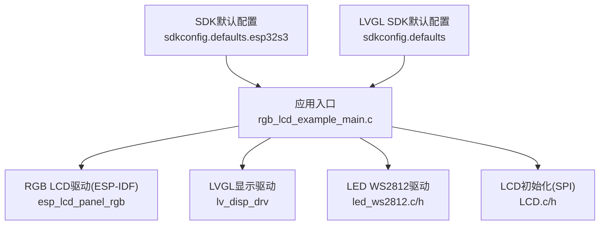
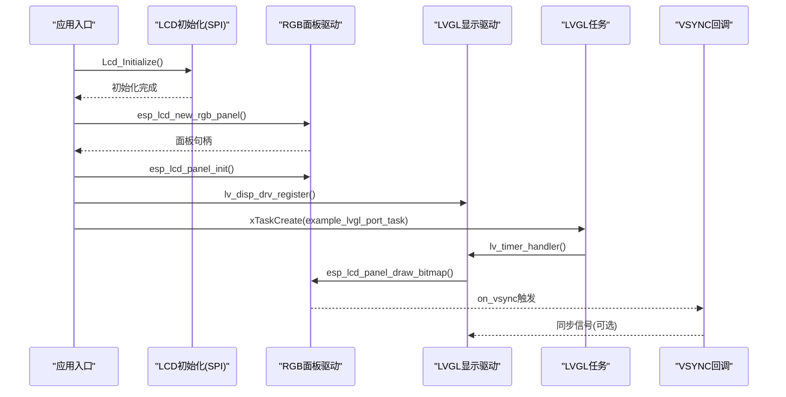
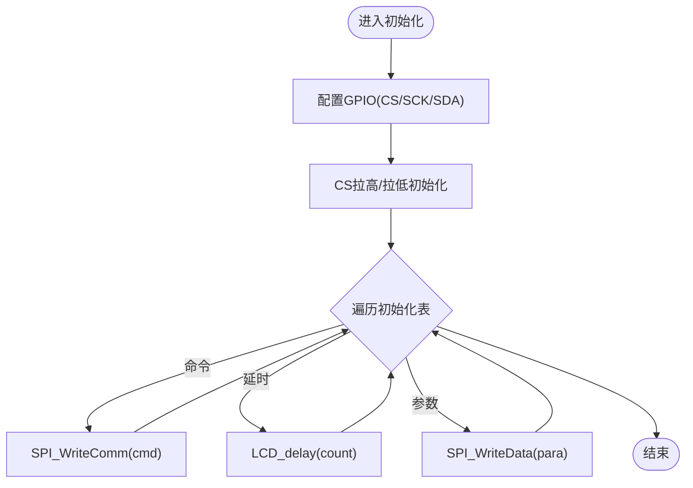
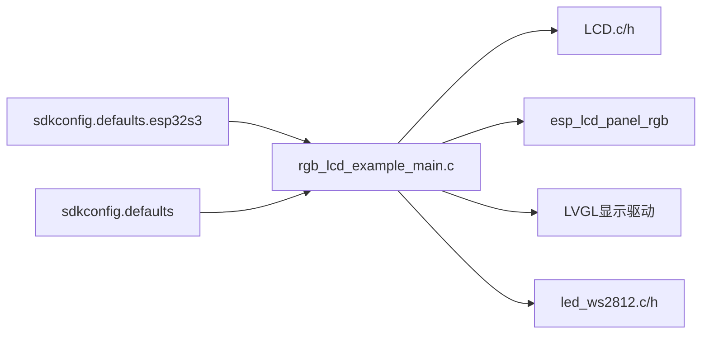
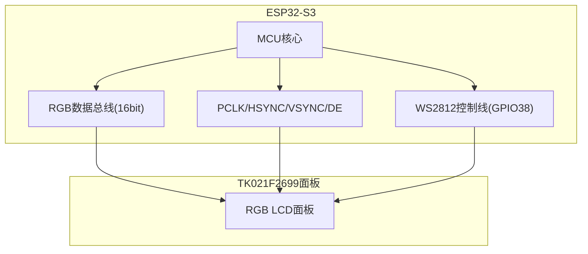

# 硬件平台

<cite>
**本文引用的文件列表**
- [rgb_lcd_example_main.c](file://ESP32开发板/TK021F2699_ESP32_LVGL_GIF_LED/TK021F2699_ESP32_LVGL_GIF_LED/main/rgb_lcd_example_main.c)
- [LCD.h](file://ESP32开发板/TK021F2699_ESP32_LVGL_GIF_LED/TK021F2699_ESP32_LVGL_GIF_LED/main/LCD.h)
- [LCD.c](file://ESP32开发板/TK021F2699_ESP32_LVGL_GIF_LED/TK021F2699_ESP32_LVGL_GIF_LED/main/LCD.c)
- [led_ws2812.h](file://ESP32开发板/TK021F2699_ESP32_LVGL_GIF_LED/TK021F2699_ESP32_LVGL_GIF_LED/main/led_ws2812/led_ws2812.h)
- [led_ws2812.c](file://ESP32开发板/TK021F2699_ESP32_LVGL_GIF_LED/TK021F2699_ESP32_LVGL_GIF_LED/main/led_ws2812/led_ws2812.c)
- [sdkconfig.defaults.esp32s3](file://ESP32开发板/TK021F2699_ESP32_LVGL_GIF_LED/TK021F2699_ESP32_LVGL_GIF_LED/sdkconfig.defaults.esp32s3)
- [sdkconfig.defaults](file://ESP32开发板/TK021F2699_ESP32_LVGL_GIF_LED/TK021F2699_ESP32_LVGL_GIF_LED/sdkconfig.defaults)
</cite>

## 目录
1. [简介](#简介)
2. [项目结构](#项目结构)
3. [核心组件](#核心组件)
4. [架构总览](#架构总览)
5. [详细组件分析](#详细组件分析)
6. [依赖关系分析](#依赖关系分析)
7. [性能与内存特性](#性能与内存特性)
8. [故障排查指南](#故障排查指南)
9. [结论](#结论)
10. [附录：GPIO映射与时序参数](#附录gpio映射与时序参数)

## 简介
本文件面向PathFinder_LCD项目的硬件平台说明，聚焦于ESP32-S3开发板的硬件特性、引脚分配与内存架构；详解TK021F2699 RGB LCD面板的时序要求与初始化序列；阐述PSRAM在帧缓冲管理中的作用与性能影响；提供完整的硬件连接图与GPIO映射表；并给出LED灯带控制、按键输入等外围设备的接口说明与优化策略（如PCLK频率调整、内存带宽管理等），为硬件适配与扩展开发提供技术指导。

## 项目结构
本项目基于ESP-IDF工程组织，主程序位于main目录，包含RGB LCD驱动入口、LVGL集成、WS2812 LED驱动以及LCD初始化配置等关键模块。SDK默认配置位于sdkconfig.defaults与sdkconfig.defaults.esp32s3中，用于启用SPIRAM、设置时钟源与内存访问优化选项。

图表来源
- [rgb_lcd_example_main.c:150-303](file://ESP32开发板/TK021F2699_ESP32_LVGL_GIF_LED/TK021F2699_ESP32_LVGL_GIF_LED/main/rgb_lcd_example_main.c#L150-L303)
- [LCD.c:186-219](file://ESP32开发板/TK021F2699_ESP32_LVGL_GIF_LED/TK021F2699_ESP32_LVGL_GIF_LED/main/LCD.c#L186-L219)
- [led_ws2812.c:179-252](file://ESP32开发板/TK021F2699_ESP32_LVGL_GIF_LED/TK021F2699_ESP32_LVGL_GIF_LED/main/led_ws2812/led_ws2812.c#L179-L252)
- [sdkconfig.defaults.esp32s3:1-9](file://ESP32开发板/TK021F2699_ESP32_LVGL_GIF_LED/TK021F2699_ESP32_LVGL_GIF_LED/sdkconfig.defaults.esp32s3#L1-L9)
- [sdkconfig.defaults:1-6](file://ESP32开发板/TK021F2699_ESP32_LVGL_GIF_LED/TK021F2699_ESP32_LVGL_GIF_LED/sdkconfig.defaults#L1-L6)

章节来源
- [rgb_lcd_example_main.c:150-303](file://ESP32开发板/TK021F2699_ESP32_LVGL_GIF_LED/TK021F2699_ESP32_LVGL_GIF_LED/main/rgb_lcd_example_main.c#L150-L303)
- [LCD.c:186-219](file://ESP32开发板/TK021F2699_ESP32_LVGL_GIF_LED/TK021F2699_ESP32_LVGL_GIF_LED/main/LCD.c#L186-L219)
- [led_ws2812.c:179-252](file://ESP32开发板/TK021F2699_ESP32_LVGL_GIF_LED/TK021F2699_ESP32_LVGL_GIF_LED/main/led_ws2812/led_ws2812.c#L179-L252)
- [sdkconfig.defaults.esp32s3:1-9](file://ESP32开发板/TK021F2699_ESP32_LVGL_GIF_LED/TK021F2699_ESP32_LVGL_GIF_LED/sdkconfig.defaults.esp32s3#L1-L9)
- [sdkconfig.defaults:1-6](file://ESP32开发板/TK021F2699_ESP32_LVGL_GIF_LED/TK021F2699_ESP32_LVGL_GIF_LED/sdkconfig.defaults#L1-L6)

## 核心组件
- ESP32-S3 MCU与外设：通过ESP-IDF的RGB LCD驱动与LVGL集成，使用并行RGB接口输出图像数据，支持PSRAM作为帧缓冲。
- TK021F2699 RGB LCD面板：采用16位并行RGB时序，分辨率480x480，PCLK频率可配置，示例中设置为16MHz。
- PSRAM：启用Octal模式与80MHz速度，帧缓冲分配在PSRAM中，提高可用内存容量与带宽。
- WS2812 LED灯带：通过RMT通道与自定义编码器实现精确时序控制，GPIO38输出，最多支持12颗LED。
- LVGL UI框架：创建任务处理UI刷新，支持双缓冲或单缓冲绘制缓冲区，可选撕裂避免机制。

章节来源
- [rgb_lcd_example_main.c:29-58](file://ESP32开发板/TK021F2699_ESP32_LVGL_GIF_LED/TK021F2699_ESP32_LVGL_GIF_LED/main/rgb_lcd_example_main.c#L29-L58)
- [rgb_lcd_example_main.c:182-229](file://ESP32开发板/TK021F2699_ESP32_LVGL_GIF_LED/TK021F2699_ESP32_LVGL_GIF_LED/main/rgb_lcd_example_main.c#L182-L229)
- [sdkconfig.defaults.esp32s3:1-9](file://ESP32开发板/TK021F2699_ESP32_LVGL_GIF_LED/TK021F2699_ESP32_LVGL_GIF_LED/sdkconfig.defaults.esp32s3#L1-L9)
- [led_ws2812.h:15-16](file://ESP32开发板/TK021F2699_ESP32_LVGL_GIF_LED/TK021F2699_ESP32_LVGL_GIF_LED/main/led_ws2812/led_ws2812.h#L15-L16)
- [led_ws2812.c:179-252](file://ESP32开发板/TK021F2699_ESP32_LVGL_GIF_LED/TK021F2699_ESP32_LVGL_GIF_LED/main/led_ws2812/led_ws2812.c#L179-L252)

## 架构总览
系统启动后，应用初始化LED与Wi-Fi，随后完成LCD初始化与RGB面板驱动安装，注册LVGL显示驱动与定时器，创建LVGL任务进行UI渲染。帧缓冲可选择由ESP-IDF RGB面板驱动分配（双缓冲）或在PSRAM中单独分配（单缓冲）。VSYNC事件可用于同步GUI刷新以避免撕裂。

图表来源
- [rgb_lcd_example_main.c:150-303](file://ESP32开发板/TK021F2699_ESP32_LVGL_GIF_LED/TK021F2699_ESP32_LVGL_GIF_LED/main/rgb_lcd_example_main.c#L150-L303)
- [LCD.c:205-219](file://ESP32开发板/TK021F2699_ESP32_LVGL_GIF_LED/TK021F2699_ESP32_LVGL_GIF_LED/main/LCD.c#L205-L219)

## 详细组件分析

### ESP32-S3硬件特性与内存架构
- 时钟源：RGB面板使用PLL240M作为时钟源，提升PCLK可达性。
- 帧缓冲：支持将帧缓冲分配在PSRAM中，减少内部SRAM占用，提高大分辨率屏幕的可用性。
- SPIRAM配置：启用SPIRAM Octal模式与80MHz速度，同时开启指令与只读数据从SPIRAM取指以提升整体性能。

章节来源
- [rgb_lcd_example_main.c:182-229](file://ESP32开发板/TK021F2699_ESP32_LVGL_GIF_LED/TK021F2699_ESP32_LVGL_GIF_LED/main/rgb_lcd_example_main.c#L182-L229)
- [sdkconfig.defaults.esp32s3:1-9](file://ESP32开发板/TK021F2699_ESP32_LVGL_GIF_LED/TK021F2699_ESP32_LVGL_GIF_LED/sdkconfig.defaults.esp32s3#L1-L9)

### TK021F2699 RGB LCD面板规格与时序
- 分辨率：480x480像素。
- 数据宽度：16位并行RGB（RGB565）。
- PCLK频率：示例配置为16MHz。
- 时序参数：水平与垂直的前肩、后肩与脉冲宽度已在配置中定义，且PCLK极性为负有效。
- 初始化序列：通过SPI串行接口发送命令与参数，包含多个寄存器配置段，最终执行“开显示”等标准流程。

图表来源
- [LCD.c:17-40](file://ESP32开发板/TK021F2699_ESP32_LVGL_GIF_LED/TK021F2699_ESP32_LVGL_GIF_LED/main/LCD.c#L17-L40)
- [LCD.c:51-83](file://ESP32开发板/TK021F2699_ESP32_LVGL_GIF_LED/TK021F2699_ESP32_LVGL_GIF_LED/main/LCD.c#L51-L83)
- [LCD.c:95-160](file://ESP32开发板/TK021F2699_ESP32_LVGL_GIF_LED/TK021F2699_ESP32_LVGL_GIF_LED/main/LCD.c#L95-L160)
- [LCD.c:186-219](file://ESP32开发板/TK021F2699_ESP32_LVGL_GIF_LED/TK021F2699_ESP32_LVGL_GIF_LED/main/LCD.c#L186-L219)

章节来源
- [rgb_lcd_example_main.c:29-58](file://ESP32开发板/TK021F2699_ESP32_LVGL_GIF_LED/TK021F2699_ESP32_LVGL_GIF_LED/main/rgb_lcd_example_main.c#L29-L58)
- [rgb_lcd_example_main.c:213-227](file://ESP32开发板/TK021F2699_ESP32_LVGL_GIF_LED/TK021F2699_ESP32_LVGL_GIF_LED/main/rgb_lcd_example_main.c#L213-L227)
- [LCD.c:95-160](file://ESP32开发板/TK021F2699_ESP32_LVGL_GIF_LED/TK021F2699_ESP32_LVGL_GIF_LED/main/LCD.c#L95-L160)

### PSRAM在帧缓冲管理中的作用与性能影响
- 帧缓冲位置：可通过配置选择将帧缓冲分配在PSRAM中，从而释放内部SRAM空间，适合高分辨率与复杂UI场景。
- 双缓冲与单缓冲：双缓冲模式下，ESP-IDF RGB面板驱动可提供两个帧缓冲，LVGL使用full_refresh模式保持同步；单缓冲模式下，可在PSRAM中单独分配绘制缓冲区。
- 内存带宽：启用SPIRAM取指与只读数据可减少CPU等待时间，提高整体吞吐能力。

章节来源
- [rgb_lcd_example_main.c:246-273](file://ESP32开发板/TK021F2699_ESP32_LVGL_GIF_LED/TK021F2699_ESP32_LVGL_GIF_LED/main/rgb_lcd_example_main.c#L246-L273)
- [sdkconfig.defaults.esp32s3:1-9](file://ESP32开发板/TK021F2699_ESP32_LVGL_GIF_LED/TK021F2699_ESP32_LVGL_GIF_LED/sdkconfig.defaults.esp32s3#L1-L9)

### LED灯带控制（WS2812）
- 控制引脚：GPIO38。
- 驱动方式：使用ESP-IDF RMT通道与自定义编码器，按WS2812时序生成GRB数据流，支持最多12颗LED。
- 分辨率与时序：RMT分辨率为10MHz（0.1us步进），满足WS2812的T0H/T1H/T0L/T1L时序要求。

章节来源
- [led_ws2812.h:15-16](file://ESP32开发板/TK021F2699_ESP32_LVGL_GIF_LED/TK021F2699_ESP32_LVGL_GIF_LED/main/led_ws2812/led_ws2812.h#L15-L16)
- [led_ws2812.c:179-252](file://ESP32开发板/TK021F2699_ESP32_LVGL_GIF_LED/TK021F2699_ESP32_LVGL_GIF_LED/main/led_ws2812/led_ws2812.c#L179-L252)

### 按键输入与外围设备接口
- 当前工程中未直接实现按键输入驱动。如需扩展，可使用ESP-IDF GPIO中断或ADC读取外部按键状态，并在LVGL输入设备层注册相应的事件回调。
- 建议复用现有GPIO资源，避免与RGB数据总线冲突。

[本节为概念性指导，不直接分析具体代码文件]

## 依赖关系分析
- 应用入口依赖LCD初始化模块、RGB面板驱动、LVGL显示驱动与LED驱动。
- SDK配置决定SPIRAM与LVGL功能开关，直接影响内存布局与性能。

图表来源
- [rgb_lcd_example_main.c:150-303](file://ESP32开发板/TK021F2699_ESP32_LVGL_GIF_LED/TK021F2699_ESP32_LVGL_GIF_LED/main/rgb_lcd_example_main.c#L150-L303)
- [LCD.c:186-219](file://ESP32开发板/TK021F2699_ESP32_LVGL_GIF_LED/TK021F2699_ESP32_LVGL_GIF_LED/main/LCD.c#L186-L219)
- [led_ws2812.c:179-252](file://ESP32开发板/TK021F2699_ESP32_LVGL_GIF_LED/TK021F2699_ESP32_LVGL_GIF_LED/main/led_ws2812/led_ws2812.c#L179-L252)
- [sdkconfig.defaults.esp32s3:1-9](file://ESP32开发板/TK021F2699_ESP32_LVGL_GIF_LED/TK021F2699_ESP32_LVGL_GIF_LED/sdkconfig.defaults.esp32s3#L1-L9)
- [sdkconfig.defaults:1-6](file://ESP32开发板/TK021F2699_ESP32_LVGL_GIF_LED/TK021F2699_ESP32_LVGL_GIF_LED/sdkconfig.defaults#L1-L6)

章节来源
- [rgb_lcd_example_main.c:150-303](file://ESP32开发板/TK021F2699_ESP32_LVGL_GIF_LED/TK021F2699_ESP32_LVGL_GIF_LED/main/rgb_lcd_example_main.c#L150-L303)
- [LCD.c:186-219](file://ESP32开发板/TK021F2699_ESP32_LVGL_GIF_LED/TK021F2699_ESP32_LVGL_GIF_LED/main/LCD.c#L186-L219)
- [led_ws2812.c:179-252](file://ESP32开发板/TK021F2699_ESP32_LVGL_GIF_LED/TK021F2699_ESP32_LVGL_GIF_LED/main/led_ws2812/led_ws2812.c#L179-L252)
- [sdkconfig.defaults.esp32s3:1-9](file://ESP32开发板/TK021F2699_ESP32_LVGL_GIF_LED/TK021F2699_ESP32_LVGL_GIF_LED/sdkconfig.defaults.esp32s3#L1-L9)
- [sdkconfig.defaults:1-6](file://ESP32开发板/TK021F2699_ESP32_LVGL_GIF_LED/TK021F2699_ESP32_LVGL_GIF_LED/sdkconfig.defaults#L1-L6)

## 性能与内存特性
- PCLK频率调整：示例中设置为16MHz，可根据面板规格与布线质量适当提升，但需确保时序稳定与信号完整性。
- 帧缓冲策略：优先使用双缓冲（full_refresh）以降低撕裂风险；若内存紧张，可采用单缓冲+PSRAM方案。
- 内存带宽管理：启用SPIRAM取指与只读数据可减少CPU等待，提高整体吞吐；必要时降低LVGL刷新周期或减少动画复杂度。
- 撕裂避免：通过VSYNC事件与信号量同步，可在GUI准备完成后才允许面板刷新，避免画面撕裂。

章节来源
- [rgb_lcd_example_main.c:29-58](file://ESP32开发板/TK021F2699_ESP32_LVGL_GIF_LED/TK021F2699_ESP32_LVGL_GIF_LED/main/rgb_lcd_example_main.c#L29-L58)
- [rgb_lcd_example_main.c:246-273](file://ESP32开发板/TK021F2699_ESP32_LVGL_GIF_LED/TK021F2699_ESP32_LVGL_GIF_LED/main/rgb_lcd_example_main.c#L246-L273)
- [sdkconfig.defaults.esp32s3:1-9](file://ESP32开发板/TK021F2699_ESP32_LVGL_GIF_LED/TK021F2699_ESP32_LVGL_GIF_LED/sdkconfig.defaults.esp32s3#L1-L9)

## 故障排查指南
- 无显示或花屏：检查RGB数据线与PCLK/HSYNC/VSYNC/DE连线是否正确；确认PCLK极性与时序参数是否符合面板规格。
- 初始化失败：确认SPI初始化顺序与CS电平；核对初始化表中命令与参数是否与面板手册一致。
- 闪烁或撕裂：启用VSYNC同步与信号量机制；检查LVGL任务优先级与刷新周期。
- LED异常：确认GPIO38未被其他外设占用；检查RMT分辨率与编码时序是否匹配WS2812规范。

章节来源
- [rgb_lcd_example_main.c:213-227](file://ESP32开发板/TK021F2699_ESP32_LVGL_GIF_LED/TK021F2699_ESP32_LVGL_GIF_LED/main/rgb_lcd_example_main.c#L213-L227)
- [LCD.c:186-219](file://ESP32开发板/TK021F2699_ESP32_LVGL_GIF_LED/TK021F2699_ESP32_LVGL_GIF_LED/main/LCD.c#L186-L219)
- [led_ws2812.c:179-252](file://ESP32开发板/TK021F2699_ESP32_LVGL_GIF_LED/TK021F2699_ESP32_LVGL_GIF_LED/main/led_ws2812/led_ws2812.c#L179-L252)

## 结论
本项目以ESP32-S3为核心，结合ESP-IDF的RGB LCD驱动与LVGL框架，实现了480x480 RGB面板的稳定显示与UI交互。通过合理配置PCLK与时序、利用PSRAM进行帧缓冲管理，并结合VSYNC同步机制，可有效提升显示质量与系统性能。WS2812 LED驱动提供了丰富的外观反馈能力。后续扩展可在此基础上增加按键输入、传感器采集与更多UI功能。

[本节为总结性内容，不直接分析具体代码文件]

## 附录：GPIO映射与时序参数

### 硬件连接图（概念示意）

[此图为概念示意，不直接映射到具体源码文件]

### GPIO映射表
- 背光控制：未使用（引脚编号为-1）
- HSYNC：GPIO41
- VSYNC：GPIO46
- DE：GPIO42
- PCLK：GPIO2
- 数据总线（B0-B4, G0-G5, R0-R4）：
  - B0: GPIO4
  - B1: GPIO5
  - B2: GPIO6
  - B3: GPIO7
  - B4: GPIO15
  - G0: GPIO16
  - G1: GPIO17
  - G2: GPIO18
  - G3: GPIO9
  - G4: GPIO10
  - G5: GPIO11
  - R0: GPIO0
  - R1: GPIO45
  - R2: GPIO48
  - R3: GPIO47
  - R4: GPIO21
- WS2812 LED控制：GPIO38
- LCD初始化SPI（CS/SCK/SDA）：
  - CS: GPIO1
  - SCK: GPIO13
  - SDA: GPIO20

章节来源
- [rgb_lcd_example_main.c:29-58](file://ESP32开发板/TK021F2699_ESP32_LVGL_GIF_LED/TK021F2699_ESP32_LVGL_GIF_LED/main/rgb_lcd_example_main.c#L29-L58)
- [lcd.h:12-26](file://ESP32开发板/TK021F2699_ESP32_LVGL_GIF_LED/TK021F2699_ESP32_LVGL_GIF_LED/main/LCD.h#L12-L26)
- [led_ws2812.h:15-16](file://ESP32开发板/TK021F2699_ESP32_LVGL_GIF_LED/TK021F2699_ESP32_LVGL_GIF_LED/main/led_ws2812/led_ws2812.h#L15-L16)

### 时序参数（来自配置）
- PCLK频率：16MHz
- 分辨率：480x480
- 水平前肩：4
- 水平后肩：9
- 水平脉冲宽度：2
- 垂直前肩：4
- 垂直后肩：9
- 垂直脉冲宽度：2
- PCLK极性：负有效

章节来源
- [rgb_lcd_example_main.c:213-227](file://ESP32开发板/TK021F2699_ESP32_LVGL_GIF_LED/TK021F2699_ESP32_LVGL_GIF_LED/main/rgb_lcd_example_main.c#L213-L227)