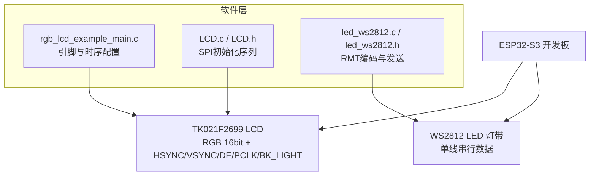
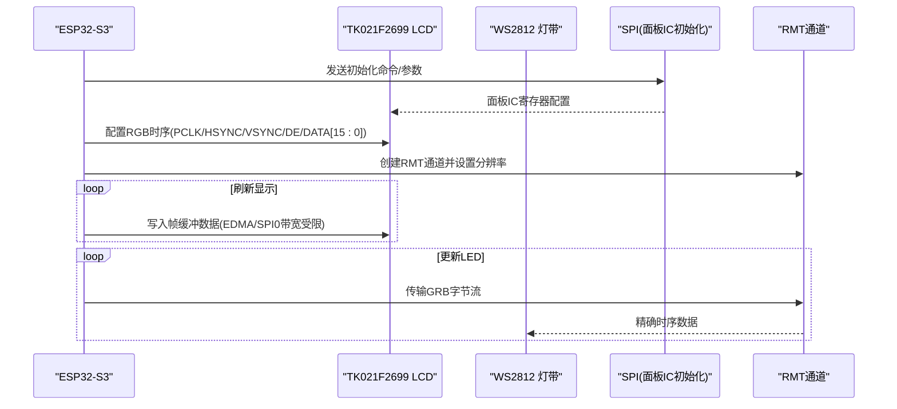
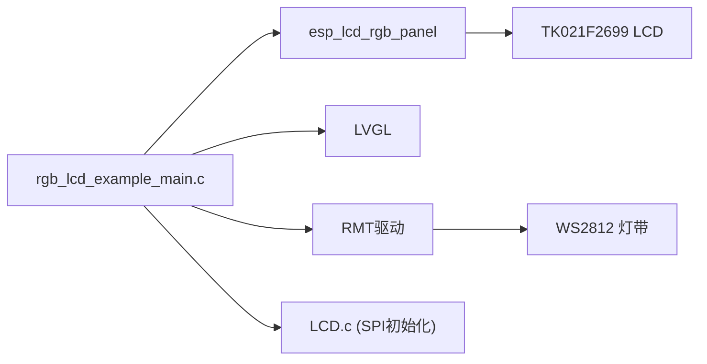
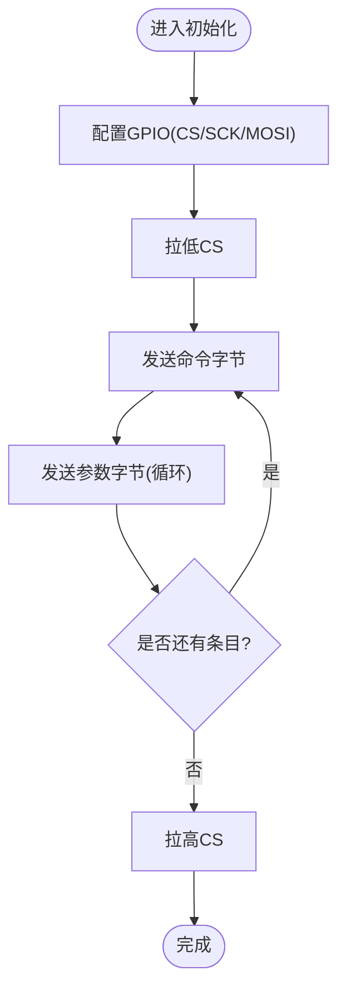

# 硬件连接与布线

<cite>
**本文引用的文件**   
- [README.md](file://ESP32开发板/TK021F2699_ESP32_LVGL_GIF_LED/TK021F2699_ESP32_LVGL_GIF_LED/README.md)
- [rgb_lcd_example_main.c](file://ESP32开发板/TK021F2699_ESP32_LVGL_GIF_LED/TK021F2699_ESP32_LVGL_GIF_LED/main/rgb_lcd_example_main.c)
- [LCD.h](file://ESP32开发板/TK021F2699_ESP32_LVGL_GIF_LED/TK021F2699_ESP32_LVGL_GIF_LED/main/LCD.h)
- [LCD.c](file://ESP32开发板/TK021F2699_ESP32_LVGL_GIF_LED/TK021F2699_ESP32_LVGL_GIF_LED/main/LCD.c)
- [led_ws2812.h](file://ESP32开发板/TK021F2699_ESP32_LVGL_GIF_LED/TK021F2699_ESP32_LVGL_GIF_LED/main/led_ws2812/led_ws2812.h)
- [led_ws2812.c](file://ESP32开发板/TK021F2699_ESP32_LVGL_GIF_LED/TK021F2699_ESP32_LVGL_GIF_LED/main/led_ws2812/led_ws2812.c)
</cite>

## 目录
1. [简介](#简介)
2. [项目结构](#项目结构)
3. [核心组件](#核心组件)
4. [架构总览](#架构总览)
5. [详细组件分析](#详细组件分析)
6. [依赖关系分析](#依赖关系分析)
7. [性能与信号完整性考虑](#性能与信号完整性考虑)
8. [故障诊断指南](#故障诊断指南)
9. [结论](#结论)
10. [附录](#附录)

## 简介
本指南面向PathFinder_LCD项目的硬件原型制作与批量生产，聚焦于ESP32-S3开发板、TK021F2699 LCD面板（RGB接口）以及WS2812 LED灯带之间的硬件连接与PCB布线。文档基于工程源码中的引脚定义、初始化流程与时序配置，给出完整的GPIO分配、信号线定义、高速信号布线要求、电源完整性建议，并提供常见问题排查方法与优化建议。

## 项目结构
本项目包含以下与硬件相关的关键源文件：
- RGB LCD示例主程序与引脚配置
- TK021F2699屏的SPI初始化驱动（用于面板IC初始化）
- WS2812 LED驱动（RMT编码器实现）
- 官方示例说明（含硬件连接图与注意事项）

图表来源
- [rgb_lcd_example_main.c:29-54](file://ESP32开发板/TK021F2699_ESP32_LVGL_GIF_LED/TK021F2699_ESP32_LVGL_GIF_LED/main/rgb_lcd_example_main.c#L29-L54)
- [LCD.c:186-204](file://ESP32开发板/TK021F2699_ESP32_LVGL_GIF_LED/TK021F2699_ESP32_LVGL_GIF_LED/main/LCD.c#L186-L204)
- [led_ws2812.c:179-213](file://ESP32开发板/TK021F2699_ESP32_LVGL_GIF_LED/TK021F2699_ESP32_LVGL_GIF_LED/main/led_ws2812/led_ws2812.c#L179-L213)

章节来源
- [README.md:27-57](file://ESP32开发板/TK021F2699_ESP32_LVGL_GIF_LED/TK021F2699_ESP32_LVGL_GIF_LED/README.md#L27-L57)
- [rgb_lcd_example_main.c:29-54](file://ESP32开发板/TK021F2699_ESP32_LVGL_GIF_LED/TK021F2699_ESP32_LVGL_GIF_LED/main/rgb_lcd_example_main.c#L29-L54)

## 核心组件
- ESP32-S3 RGB LCD控制器：提供16位并行RGB数据总线、PCLK、HSYNC、VSYNC、DE等时序信号，支持帧缓冲在PSRAM或内部SRAM。
- TK021F2699 LCD面板：16位RGB接口，需要H/V同步与像素时钟；部分模块需通过SPI进行面板IC初始化。
- WS2812 LED灯带：单线串行协议，使用RMT精确时序生成GRB数据帧。

章节来源
- [README.md:21-26](file://ESP32开发板/TK021F2699_ESP32_LVGL_GIF_LED/TK021F2699_ESP32_LVGL_GIF_LED/README.md#L21-L26)
- [rgb_lcd_example_main.c:182-228](file://ESP32开发板/TK021F2699_ESP32_LVGL_GIF_LED/TK021F2699_ESP32_LVGL_GIF_LED/main/rgb_lcd_example_main.c#L182-L228)
- [led_ws2812.c:125-159](file://ESP32开发板/TK021F2699_ESP32_LVGL_GIF_LED/TK021F2699_ESP32_LVGL_GIF_LED/main/led_ws2812/led_ws2812.c#L125-L159)

## 架构总览
系统由主控ESP32-S3同时驱动RGB LCD与WS2812 LED。LCD采用RGB并行接口，LED采用RMT驱动的串行时序。

图表来源
- [rgb_lcd_example_main.c:182-228](file://ESP32开发板/TK021F2699_ESP32_LVGL_GIF_LED/TK021F2699_ESP32_LVGL_GIF_LED/main/rgb_lcd_example_main.c#L182-L228)
- [LCD.c:186-204](file://ESP32开发板/TK021F2699_ESP32_LVGL_GIF_LED/TK021F2699_ESP32_LVGL_GIF_LED/main/LCD.c#L186-L204)
- [led_ws2812.c:179-213](file://ESP32开发板/TK021F2699_ESP32_LVGL_GIF_LED/TK021F2699_ESP32_LVGL_GIF_LED/main/led_ws2812/led_ws2812.c#L179-L213)

## 详细组件分析

### GPIO引脚分配与信号线定义
- RGB LCD关键信号
  - PCLK：像素时钟
  - DATA[15:0]：16位RGB数据总线（RGB565）
  - HSYNC、VSYNC、DE：行/场同步与数据有效
  - BK_LIGHT：背光控制（高/低电平取决于模块）
  - DISP_EN：可选使能控制
- WS2812 LED
  - 单线数据：GPIO_38（默认），支持多颗级联

具体引脚映射（来自示例配置）：
- PCLK：GPIO_2
- HSYNC：GPIO_41
- VSYNC：GPIO_46
- DE：GPIO_42
- DATA0~DATA15：GPIO_4,5,6,7,15,16,17,18,9,10,11,0,45,48,47,21
- BK_LIGHT：未启用（-1）
- DISP_EN：未启用（-1）
- WS2812_DATA：GPIO_38

章节来源
- [rgb_lcd_example_main.c:29-54](file://ESP32开发板/TK021F2699_ESP32_LVGL_GIF_LED/TK021F2699_ESP32_LVGL_GIF_LED/main/rgb_lcd_example_main.c#L29-L54)
- [led_ws2812.h:15-16](file://ESP32开发板/TK021F2699_ESP32_LVGL_GIF_LED/TK021F2699_ESP32_LVGL_GIF_LED/main/led_ws2812/led_ws2812.h#L15-L16)

### 硬件连接图（ESP32-S3 ↔ TK021F2699）
根据示例说明，ESP32与RGB面板的典型连接如下：
- GND ↔ GND
- 3V3 ↔ VCC
- PCLK ↔ PCLK
- DATA[15:0] ↔ DATA[15:0]
- HSYNC ↔ HSYNC
- VSYNC ↔ VSYNC
- DE ↔ DE
- BK_LIGHT ↔ BLK（注意极性）
- DISP_EN ↔ 3V3（若需要常开）

章节来源
- [README.md:27-57](file://ESP32开发板/TK021F2699_ESP32_LVGL_GIF_LED/TK021F2699_ESP32_LVGL_GIF_LED/README.md#L27-L57)

### TK021F2699面板初始化（SPI）
- 通过GPIO_1(CS)、GPIO_13(SCK)、GPIO_20(MOSI)以3线SPI方式对面板IC进行初始化。
- 初始化序列包含多个寄存器配置与延时，最终开启显示。

章节来源
- [LCD.h:12-26](file://ESP32开发板/TK021F2699_ESP32_LVGL_GIF_LED/TK021F2699_ESP32_LVGL_GIF_LED/main/LCD.h#L12-L26)
- [LCD.c:186-204](file://ESP32开发板/TK021F2699_ESP32_LVGL_GIF_LED/TK021F2699_ESP32_LVGL_GIF_LED/main/LCD.c#L186-L204)

### WS2812 LED驱动（RMT）
- 使用RMT通道输出精确时序，分辨率10MHz（0.1us步进）。
- 自定义编码器将用户GRB数据编码为RMT符号，并在每帧末尾插入复位码（≥50us低电平）。
- 默认GPIO_38，支持最多12颗LED（可调整）。

章节来源
- [led_ws2812.c:125-159](file://ESP32开发板/TK021F2699_ESP32_LVGL_GIF_LED/TK021F2699_ESP32_LVGL_GIF_LED/main/led_ws2812/led_ws2812.c#L125-L159)
- [led_ws2812.c:179-213](file://ESP32开发板/TK021F2699_ESP32_LVGL_GIF_LED/TK021F2699_ESP32_LVGL_GIF_LED/main/led_ws2812/led_ws2812.c#L179-L213)
- [led_ws2812.h:15-16](file://ESP32开发板/TK021F2699_ESP32_LVGL_GIF_LED/TK021F2699_ESP32_LVGL_GIF_LED/main/led_ws2812/led_ws2812.h#L15-L16)

### 时序与帧缓冲策略
- 像素时钟：示例配置为16MHz，可根据屏幕规格调整。
- 帧缓冲：可选择双缓冲（全屏刷新）或在PSRAM中分配LVGL绘制缓冲；当使用PSRAM时受限于SPI0带宽，可能限制最大PCLK。
- 防撕裂：可通过双缓冲或额外同步机制（如信号量）避免撕裂。

章节来源
- [rgb_lcd_example_main.c:29-30](file://ESP32开发板/TK021F2699_ESP32_LVGL_GIF_LED/TK021F2699_ESP32_LVGL_GIF_LED/main/rgb_lcd_example_main.c#L29-L30)
- [rgb_lcd_example_main.c:227-228](file://ESP32开发板/TK021F2699_ESP32_LVGL_GIF_LED/TK021F2699_ESP32_LVGL_GIF_LED/main/rgb_lcd_example_main.c#L227-L228)
- [README.md:102-117](file://ESP32开发板/TK021F2699_ESP32_LVGL_GIF_LED/TK021F2699_ESP32_LVGL_GIF_LED/README.md#L102-L117)

## 依赖关系分析
- 应用主程序依赖：
  - esp_lcd_rgb_panel驱动（RGB面板）
  - LVGL库（UI渲染）
  - RMT驱动（WS2812时序）
  - 自定义LCD初始化（SPI）
- 外部依赖：
  - PSRAM（大容量帧缓冲）
  - 外部LCD模块（TK021F2699）
  - WS2812 LED灯带

图表来源
- [rgb_lcd_example_main.c:182-228](file://ESP32开发板/TK021F2699_ESP32_LVGL_GIF_LED/TK021F2699_ESP32_LVGL_GIF_LED/main/rgb_lcd_example_main.c#L182-L228)
- [LCD.c:186-204](file://ESP32开发板/TK021F2699_ESP32_LVGL_GIF_LED/TK021F2699_ESP32_LVGL_GIF_LED/main/LCD.c#L186-L204)
- [led_ws2812.c:179-213](file://ESP32开发板/TK021F2699_ESP32_LVGL_GIF_LED/TK021F2699_ESP32_LVGL_GIF_LED/main/led_ws2812/led_ws2812.c#L179-L213)

## 性能与信号完整性考虑
- 像素时钟与带宽
  - 当帧缓冲位于PSRAM时，受SPI0带宽限制，建议降低PCLK或启用回冲缓冲（bounce buffer）以提升稳定性。
  - 启用“从SPIRAM取指令/只读数据”可减少ICache占用，释放SPI0带宽。
- 抗撕裂
  - 优先使用双缓冲模式；若仅单缓冲，需在写缓冲（CPU/Cache）与读缓冲（EDMA）之间增加同步机制。
- 电源完整性
  - 为LCD与LED分别提供稳定的3.3V供电，靠近负载放置去耦电容（例如0.1μF+1μF组合），减小瞬态压降。
  - 背光电流较大时，确保电源走线宽度足够，必要时单独供电或通过MOSFET开关控制。
- 信号完整性与阻抗匹配
  - RGB数据总线（16条）应等长布设，尽量短且平行走线，减少长度差异引起的相位误差。
  - PCLK为高频时钟，建议参考阻抗设计（典型50Ω单端或差分等效），避免过孔与拐角过多，必要时使用圆弧走线。
  - 数据线与控制线（HSYNC/VSYNC/DE）尽量与地平面相邻，保持完整回流路径。
- 布局建议
  - ESP32-S3到LCD连接器距离尽可能短，避免跨分割区域。
  - WS2812数据信号线尽量短，远离大电流走线与噪声源；可在近端串联小电阻（约22–47Ω）抑制反射。
- 批量生产考量
  - 使用测试点覆盖关键信号（PCLK、DATA[15:0]、HSYNC/VSYNC/DE、WS2812_DATA）。
  - 对RGB总线做阻抗控制与等长约束，保证一致性。
  - 提供背光亮灭测试点与LED状态指示，便于产线快速验证。

章节来源
- [README.md:102-117](file://ESP32开发板/TK021F2699_ESP32_LVGL_GIF_LED/TK021F2699_ESP32_LVGL_GIF_LED/README.md#L102-L117)
- [rgb_lcd_example_main.c:227-228](file://ESP32开发板/TK021F2699_ESP32_LVGL_GIF_LED/TK021F2699_ESP32_LVGL_GIF_LED/main/rgb_lcd_example_main.c#L227-L228)

## 故障诊断指南
- LCD不亮
  - 检查背光极性配置（高/低电平），在示例中通过宏调整。
- 无帧缓冲内存
  - 将帧缓冲置于PSRAM；注意SPI0带宽限制可能导致PCLK上限下降。
- 屏幕漂移或不稳定
  - 降低PCLK频率；调整时序参数（如pclk_active_neg、vsync_back_porch等）；启用“从SPIRAM取指令/只读数据”。
- 屏幕撕裂
  - 使用双缓冲；或增加写/读同步机制。
- PCLK频率偏低
  - 启用回冲缓冲（bounce buffer）以提高稳定性；或启用“从SPIRAM取指令/只读数据”释放SPI0带宽。
- RGB时序正确但无显示
  - 确认面板IC是否需要特殊初始化序列（本示例已包含SPI初始化流程）。

章节来源
- [README.md:102-120](file://ESP32开发板/TK021F2699_ESP32_LVGL_GIF_LED/TK021F2699_ESP32_LVGL_GIF_LED/README.md#L102-L120)
- [rgb_lcd_example_main.c:167-175](file://ESP32开发板/TK021F2699_ESP32_LVGL_GIF_LED/TK021F2699_ESP32_LVGL_GIF_LED/main/rgb_lcd_example_main.c#L167-L175)
- [LCD.c:186-204](file://ESP32开发板/TK021F2699_ESP32_LVGL_GIF_LED/TK021F2699_ESP32_LVGL_GIF_LED/main/LCD.c#L186-L204)

## 结论
通过对源码的分析，PathFinder_LCD项目在ESP32-S3上实现了RGB LCD与WS2812 LED的协同工作。为确保稳定运行与良好显示效果，需重点关注：
- 正确的GPIO分配与时序配置
- 合理的帧缓冲策略与带宽管理
- 严格的PCB布线规范（等长、阻抗控制、电源完整性）
- 完善的调试与产测方案

## 附录

### 完整GPIO与信号清单
- RGB LCD
  - PCLK：GPIO_2
  - HSYNC：GPIO_41
  - VSYNC：GPIO_46
  - DE：GPIO_42
  - DATA0~DATA15：GPIO_4,5,6,7,15,16,17,18,9,10,11,0,45,48,47,21
  - BK_LIGHT：未启用（-1）
  - DISP_EN：未启用（-1）
- WS2812 LED
  - DATA：GPIO_38（默认）

章节来源
- [rgb_lcd_example_main.c:29-54](file://ESP32开发板/TK021F2699_ESP32_LVGL_GIF_LED/TK021F2699_ESP32_LVGL_GIF_LED/main/rgb_lcd_example_main.c#L29-L54)
- [led_ws2812.h:15-16](file://ESP32开发板/TK021F2699_ESP32_LVGL_GIF_LED/TK021F2699_ESP32_LVGL_GIF_LED/main/led_ws2812/led_ws2812.h#L15-L16)

### 关键流程图（LCD初始化）

图表来源
- [LCD.c:186-204](file://ESP32开发板/TK021F2699_ESP32_LVGL_GIF_LED/TK021F2699_ESP32_LVGL_GIF_LED/main/LCD.c#L186-L204)