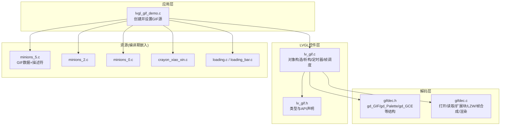
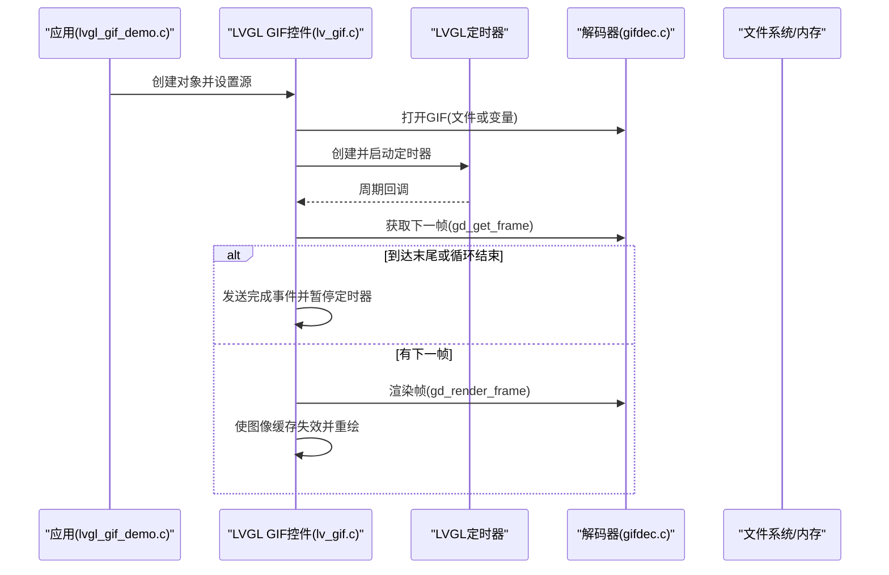
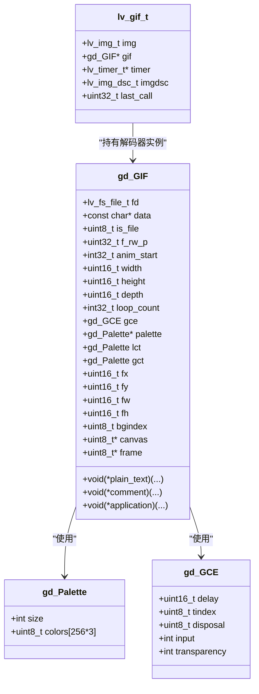
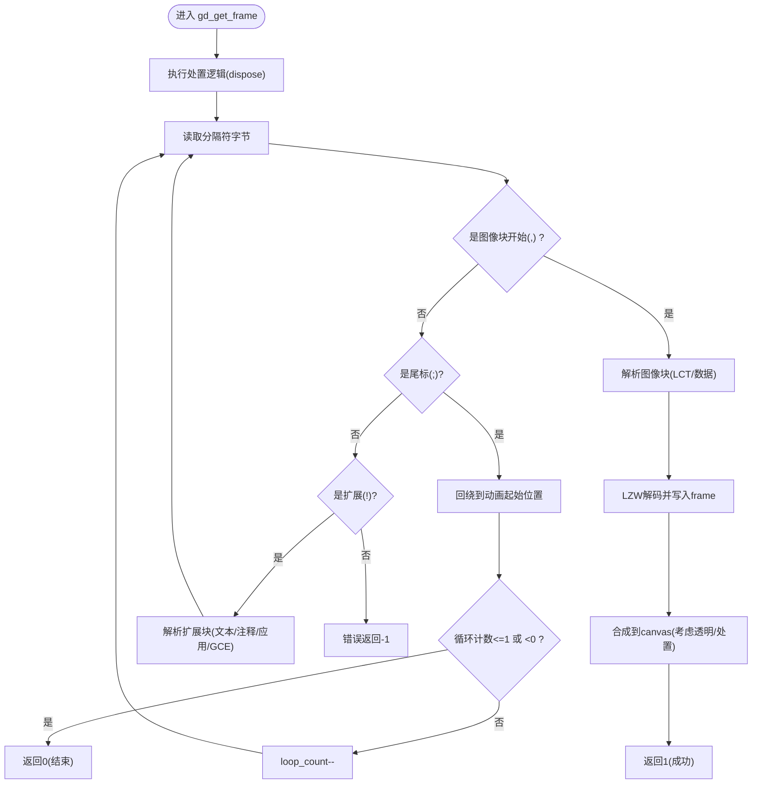
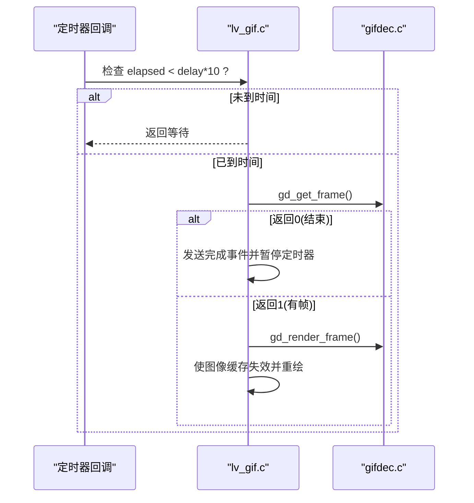
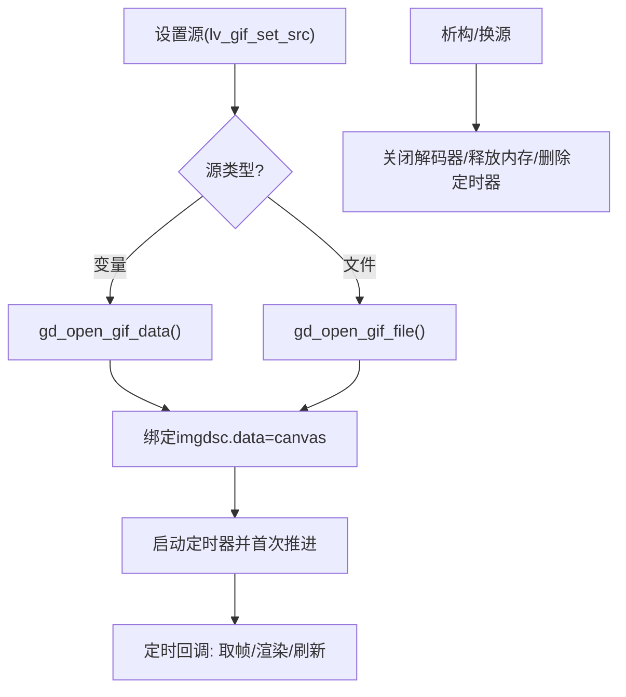
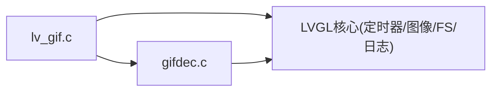

# GIF动画资源管理

<cite>
**本文引用的文件**
- [gifdec.h](file://ESP32开发板/TK021F2699_ESP32_LVGL_GIF_LED/TK021F2699_ESP32_LVGL_GIF_LED/managed_components/lvgl__lvgl/src/extra/libs/gif/gifdec.h)
- [gifdec.c](file://ESP32开发板/TK021F2699_ESP32_LVGL_GIF_LED/TK021F2699_ESP32_LVGL_GIF_LED/managed_components/lvgl__lvgl/src/extra/libs/gif/gifdec.c)
- [lv_gif.h](file://ESP32开发板/TK021F2699_ESP32_LVGL_GIF_LED/TK021F2699_ESP32_LVGL_GIF_LED/managed_components/lvgl__lvgl/src/extra/libs/gif/lv_gif.h)
- [lv_gif.c](file://ESP32开发板/TK021F2699_ESP32_LVGL_GIF_LED/TK021F2699_ESP32_LVGL_GIF_LED/managed_components/lvgl__lvgl/src/extra/libs/gif/lv_gif.c)
- [minions_5.c](file://ESP32开发板/TK021F2699_ESP32_LVGL_GIF_LED/TK021F2699_ESP32_LVGL_GIF_LED/main/gif/minions_5.c)
- [minions_2.c](file://ESP32开发板/TK021F2699_ESP32_LVGL_GIF_LED/TK021F2699_ESP32_LVGL_GIF_LED/main/gif/minions_2.c)
- [minions_0.c](file://ESP32开发板/TK021F2699_ESP32_LVGL_GIF_LED/TK021F2699_ESP32_LVGL_GIF_LED/main/gif/minions_0.c)
- [crayon_xiao_xin.c](file://ESP32开发板/TK021F2699_ESP32_LVGL_GIF_LED/TK021F2699_ESP32_LVGL_GIF_LED/main/gif/crayon_xiao_xin.c)
- [loading.c](file://ESP32开发板/TK021F2699_ESP32_LVGL_GIF_LED/TK021F2699_ESP32_LVGL_GIF_LED/main/gif/loading.c)
- [loading_bar.c](file://ESP32开发板/TK021F2699_ESP32_LVGL_GIF_LED/TK021F2699_ESP32_LVGL_GIF_LED/main/gif/loading_bar.c)
- [lvgl_gif_demo.c](file://ESP32开发板/TK021F2699_ESP32_LVGL_GIF_LED/TK021F2699_ESP32_LVGL_GIF_LED/main/ui/lvgl_gif_demo.c)
</cite>

## 目录
1. [简介](#简介)
2. [项目结构](#项目结构)
3. [核心组件](#核心组件)
4. [架构总览](#架构总览)
5. [详细组件分析](#详细组件分析)
6. [依赖关系分析](#依赖关系分析)
7. [性能与内存优化](#性能与内存优化)
8. [故障排查指南](#故障排查指南)
9. [结论](#结论)
10. [附录](#附录)

## 简介
本文件面向在嵌入式平台（ESP32 + LVGL）上集成与使用GIF动画资源的工程，系统性说明：
- GIF帧提取与分解流程、多帧数据结构与存储格式
- 播放控制机制：帧率调节、循环播放、暂停/重启
- 内存占用模型与优化策略：帧缓存、内存分配与释放
- 制作与优化工具链建议：帧数限制、颜色表优化、文件大小控制
- 资源加载流程与异步处理机制
- 性能监控与调试方法
- 不同硬件平台的适配方案
- 资源生命周期管理与内存释放策略

## 项目结构
本项目将GIF解码与LVGL控件解耦为两层：
- 底层解码层：gifdec.c/gifdec.h，负责解析GIF二进制流、LZW解压、帧合成与渲染
- 上层控件层：lv_gif.c/lv_gif.h，提供LVGL的动画图像控件，封装定时器驱动帧切换与缓存失效
- 应用示例：main/gif/*.c 中存放编译期嵌入的GIF数据（以C数组形式），main/ui/lvgl_gif_demo.c 演示创建与设置源

图表来源
- [lv_gif.c:1-154](file://ESP32开发板/TK021F2699_ESP32_LVGL_GIF_LED/TK021F2699_ESP32_LVGL_GIF_LED/managed_components/lvgl__lvgl/src/extra/libs/gif/lv_gif.c#L1-L154)
- [lv_gif.h:1-59](file://ESP32开发板/TK021F2699_ESP32_LVGL_GIF_LED/TK021F2699_ESP32_LVGL_GIF_LED/managed_components/lvgl__lvgl/src/extra/libs/gif/lv_gif.h#L1-L59)
- [gifdec.c:1-678](file://ESP32开发板/TK021F2699_ESP32_LVGL_GIF_LED/TK021F2699_ESP32_LVGL_GIF_LED/managed_components/lvgl__lvgl/src/extra/libs/gif/gifdec.c#L1-L678)
- [gifdec.h:1-61](file://ESP32开发板/TK021F2699_ESP32_LVGL_GIF_LED/TK021F2699_ESP32_LVGL_GIF_LED/managed_components/lvgl__lvgl/src/extra/libs/gif/gifdec.h#L1-L61)
- [minions_5.c:1-800](file://ESP32开发板/TK021F2699_ESP32_LVGL_GIF_LED/TK021F2699_ESP32_LVGL_GIF_LED/main/gif/minions_5.c#L1-L800)
- [minions_2.c:1-4865](file://ESP32开发板/TK021F2699_ESP32_LVGL_GIF_LED/TK021F2699_ESP32_LVGL_GIF_LED/main/gif/minions_2.c#L1-L4865)
- [minions_0.c:1-2807](file://ESP32开发板/TK021F2699_ESP32_LVGL_GIF_LED/TK021F2699_ESP32_LVGL_GIF_LED/main/gif/minions_0.c#L1-L2807)
- [crayon_xiao_xin.c:1-200](file://ESP32开发板/TK021F2699_ESP32_LVGL_GIF_LED/TK021F2699_ESP32_LVGL_GIF_LED/main/gif/crayon_xiao_xin.c#L1-L200)
- [loading.c:1-200](file://ESP32开发板/TK021F2699_ESP32_LVGL_GIF_LED/TK021F2699_ESP32_LVGL_GIF_LED/main/gif/loading.c#L1-L200)
- [loading_bar.c:1-200](file://ESP32开发板/TK021F2699_ESP32_LVGL_GIF_LED/TK021F2699_ESP32_LVGL_GIF_LED/main/gif/loading_bar.c#L1-L200)
- [lvgl_gif_demo.c:1-47](file://ESP32开发板/TK021F2699_ESP32_LVGL_GIF_LED/TK021F2699_ESP32_LVGL_GIF_LED/main/ui/lvgl_gif_demo.c#L1-L47)

章节来源
- [lvgl_gif_demo.c:1-47](file://ESP32开发板/TK021F2699_ESP32_LVGL_GIF_LED/TK021F2699_ESP32_LVGL_GIF_LED/main/ui/lvgl_gif_demo.c#L1-L47)

## 核心组件
- 解码器接口与数据结构
  - gd_GIF：包含文件/内存两种数据源指针、尺寸、深度、循环计数、图形控制扩展（延迟、透明索引、处置方式）、全局/局部调色板、画布与帧缓冲指针等
  - gd_Palette：最大256色调色板
  - gd_GCE：图形控制扩展字段（延迟毫秒/10、透明索引、处置模式、是否输入、是否透明）
- LVGL GIF控件
  - lv_gif_t：继承自图片对象，持有解码器句柄、定时器、图像描述符、上次调用时间戳
  - API：创建、设置源、重启；内部通过定时器回调推进帧
- 资源载体
  - main/gif/*.c：将GIF二进制数据编译进固件，并提供lv_img_dsc_t描述符供控件使用

章节来源
- [gifdec.h:9-46](file://ESP32开发板/TK021F2699_ESP32_LVGL_GIF_LED/TK021F2699_ESP32_LVGL_GIF_LED/managed_components/lvgl__lvgl/src/extra/libs/gif/gifdec.h#L9-L46)
- [lv_gif.h:30-46](file://ESP32开发板/TK021F2699_ESP32_LVGL_GIF_LED/TK021F2699_ESP32_LVGL_GIF_LED/managed_components/lvgl__lvgl/src/extra/libs/gif/lv_gif.h#L30-L46)
- [minions_5.c:2887-2894](file://ESP32开发板/TK021F2699_ESP32_LVGL_GIF_LED/TK021F2699_ESP32_LVGL_GIF_LED/main/gif/minions_5.c#L2887-L2894)

## 架构总览
整体采用“控件驱动 + 解码器实现”的分层架构。控件侧基于LVGL定时器按帧延迟推进，解码器侧负责逐帧解析与合成，最终输出到LVGL图像缓存。

图表来源
- [lv_gif.c:58-154](file://ESP32开发板/TK021F2699_ESP32_LVGL_GIF_LED/TK021F2699_ESP32_LVGL_GIF_LED/managed_components/lvgl__lvgl/src/extra/libs/gif/lv_gif.c#L58-L154)
- [gifdec.c:572-627](file://ESP32开发板/TK021F2699_ESP32_LVGL_GIF_LED/TK021F2699_ESP32_LVGL_GIF_LED/managed_components/lvgl__lvgl/src/extra/libs/gif/gifdec.c#L572-L627)

## 详细组件分析

### 数据结构与类图

图表来源
- [gifdec.h:9-46](file://ESP32开发板/TK021F2699_ESP32_LVGL_GIF_LED/TK021F2699_ESP32_LVGL_GIF_LED/managed_components/lvgl__lvgl/src/extra/libs/gif/gifdec.h#L9-L46)
- [lv_gif.h:30-36](file://ESP32开发板/TK021F2699_ESP32_LVGL_GIF_LED/TK021F2699_ESP32_LVGL_GIF_LED/managed_components/lvgl__lvgl/src/extra/libs/gif/lv_gif.h#L30-L36)

章节来源
- [gifdec.h:9-46](file://ESP32开发板/TK021F2699_ESP32_LVGL_GIF_LED/TK021F2699_ESP32_LVGL_GIF_LED/managed_components/lvgl__lvgl/src/extra/libs/gif/gifdec.h#L9-L46)
- [lv_gif.h:30-36](file://ESP32开发板/TK021F2699_ESP32_LVGL_GIF_LED/TK021F2699_ESP32_LVGL_GIF_LED/managed_components/lvgl__lvgl/src/extra/libs/gif/lv_gif.h#L30-L36)

### GIF帧提取与分解流程
- 打开与初始化
  - 支持从文件路径或内存变量打开；解析头部、版本、屏幕宽高、全局调色板、背景索引等
  - 根据目标颜色深度分配画布与帧缓冲区，并用背景色填充画布
- 扩展块解析
  - 文本扩展、注释扩展、应用扩展（含NETSCAPE循环计数）、图形控制扩展（延迟、透明索引、处置模式）
- 图像块解析
  - 解析图像描述符（位置、尺寸、交错标志、局部调色板）
  - LZW解码：动态码表构建、Clear/Stop码处理、交错行映射
- 帧合成与处置
  - 依据处置模式：恢复背景、保留上一帧、叠加非透明像素
  - 将当前帧写入画布对应区域，考虑透明度
- 帧推进与循环
  - 遇到分隔符时判断是否为尾标；若未达循环次数则回绕至动画起始位置继续

图表来源
- [gifdec.c:572-627](file://ESP32开发板/TK021F2699_ESP32_LVGL_GIF_LED/TK021F2699_ESP32_LVGL_GIF_LED/managed_components/lvgl__lvgl/src/extra/libs/gif/gifdec.c#L572-L627)
- [gifdec.c:209-297](file://ESP32开发板/TK021F2699_ESP32_LVGL_GIF_LED/TK021F2699_ESP32_LVGL_GIF_LED/managed_components/lvgl__lvgl/src/extra/libs/gif/gifdec.c#L209-L297)
- [gifdec.c:464-488](file://ESP32开发板/TK021F2699_ESP32_LVGL_GIF_LED/TK021F2699_ESP32_LVGL_GIF_LED/managed_components/lvgl__lvgl/src/extra/libs/gif/gifdec.c#L464-L488)
- [gifdec.c:388-460](file://ESP32开发板/TK021F2699_ESP32_LVGL_GIF_LED/TK021F2699_ESP32_LVGL_GIF_LED/managed_components/lvgl__lvgl/src/extra/libs/gif/gifdec.c#L388-L460)
- [gifdec.c:526-570](file://ESP32开发板/TK021F2699_ESP32_LVGL_GIF_LED/TK021F2699_ESP32_LVGL_GIF_LED/managed_components/lvgl__lvgl/src/extra/libs/gif/gifdec.c#L526-L570)

章节来源
- [gifdec.c:68-169](file://ESP32开发板/TK021F2699_ESP32_LVGL_GIF_LED/TK021F2699_ESP32_LVGL_GIF_LED/managed_components/lvgl__lvgl/src/extra/libs/gif/gifdec.c#L68-L169)
- [gifdec.c:275-297](file://ESP32开发板/TK021F2699_ESP32_LVGL_GIF_LED/TK021F2699_ESP32_LVGL_GIF_LED/managed_components/lvgl__lvgl/src/extra/libs/gif/gifdec.c#L275-L297)
- [gifdec.c:464-488](file://ESP32开发板/TK021F2699_ESP32_LVGL_GIF_LED/TK021F2699_ESP32_LVGL_GIF_LED/managed_components/lvgl__lvgl/src/extra/libs/gif/gifdec.c#L464-L488)
- [gifdec.c:388-460](file://ESP32开发板/TK021F2699_ESP32_LVGL_GIF_LED/TK021F2699_ESP32_LVGL_GIF_LED/managed_components/lvgl__lvgl/src/extra/libs/gif/gifdec.c#L388-L460)
- [gifdec.c:526-570](file://ESP32开发板/TK021F2699_ESP32_LVGL_GIF_LED/TK021F2699_ESP32_LVGL_GIF_LED/managed_components/lvgl__lvgl/src/extra/libs/gif/gifdec.c#L526-L570)
- [gifdec.c:572-627](file://ESP32开发板/TK021F2699_ESP32_LVGL_GIF_LED/TK021F2699_ESP32_LVGL_GIF_LED/managed_components/lvgl__lvgl/src/extra/libs/gif/gifdec.c#L572-L627)

### 播放控制机制
- 帧率调节
  - 由图形控制扩展中的delay字段决定每帧停留时间（单位毫秒/10），控件侧定时器比较累计时间与delay阈值后推进下一帧
- 循环播放
  - 应用扩展中的NETSCAPE块可指定循环次数；当达到循环上限或无限循环时，控件在结束时发送完成事件并暂停定时器
- 暂停/重启
  - 控件侧可通过停止/恢复定时器实现暂停；restart接口会重置循环计数并回到动画起始位置

图表来源
- [lv_gif.c:131-154](file://ESP32开发板/TK021F2699_ESP32_LVGL_GIF_LED/TK021F2699_ESP32_LVGL_GIF_LED/managed_components/lvgl__lvgl/src/extra/libs/gif/lv_gif.c#L131-L154)
- [gifdec.c:572-627](file://ESP32开发板/TK021F2699_ESP32_LVGL_GIF_LED/TK021F2699_ESP32_LVGL_GIF_LED/managed_components/lvgl__lvgl/src/extra/libs/gif/gifdec.c#L572-L627)

章节来源
- [lv_gif.c:98-104](file://ESP32开发板/TK021F2699_ESP32_LVGL_GIF_LED/TK021F2699_ESP32_LVGL_GIF_LED/managed_components/lvgl__lvgl/src/extra/libs/gif/lv_gif.c#L98-L104)
- [lv_gif.c:131-154](file://ESP32开发板/TK021F2699_ESP32_LVGL_GIF_LED/TK021F2699_ESP32_LVGL_GIF_LED/managed_components/lvgl__lvgl/src/extra/libs/gif/lv_gif.c#L131-L154)

### 内存占用与优化策略
- 内存布局
  - 解码器在打开时一次性分配：gd_GIF结构体 + 画布(canvas) + 帧缓冲(frame)，大小随目标颜色深度变化
  - 画布用于累积显示结果，frame用于临时写入当前帧像素索引
- 关键优化点
  - 仅对当前帧矩形区域进行合成，避免全图拷贝
  - 支持局部调色板(LCT)复用，减少重复解析开销
  - 文件/内存双通道I/O抽象，便于在不同平台上选择最优数据源
- 潜在风险与建议
  - 大分辨率或多帧GIF会显著增加画布内存占用，建议在资源侧控制尺寸与帧数
  - 频繁malloc/realloc可能引发碎片，可在应用层做对象池或预分配（需修改解码器）

章节来源
- [gifdec.c:109-169](file://ESP32开发板/TK021F2699_ESP32_LVGL_GIF_LED/TK021F2699_ESP32_LVGL_GIF_LED/managed_components/lvgl__lvgl/src/extra/libs/gif/gifdec.c#L109-L169)
- [gifdec.c:490-524](file://ESP32开发板/TK021F2699_ESP32_LVGL_GIF_LED/TK021F2699_ESP32_LVGL_GIF_LED/managed_components/lvgl__lvgl/src/extra/libs/gif/gifdec.c#L490-L524)
- [gifdec.c:629-675](file://ESP32开发板/TK021F2699_ESP32_LVGL_GIF_LED/TK021F2699_ESP32_LVGL_GIF_LED/managed_components/lvgl__lvgl/src/extra/libs/gif/gifdec.c#L629-L675)

### 资源加载流程与异步处理
- 加载入口
  - 控件设置源时，根据源类型选择从内存变量或文件路径打开GIF
  - 成功后绑定图像描述符到画布指针，配置宽高与颜色格式，并启动定时器
- 异步推进
  - 定时器回调按帧延迟推进，完成后触发重绘与缓存失效
- 资源清理
  - 析构或更换源时关闭解码器、释放内存、删除定时器

图表来源
- [lv_gif.c:58-96](file://ESP32开发板/TK021F2699_ESP32_LVGL_GIF_LED/TK021F2699_ESP32_LVGL_GIF_LED/managed_components/lvgl__lvgl/src/extra/libs/gif/lv_gif.c#L58-L96)
- [lv_gif.c:121-129](file://ESP32开发板/TK021F2699_ESP32_LVGL_GIF_LED/TK021F2699_ESP32_LVGL_GIF_LED/managed_components/lvgl__lvgl/src/extra/libs/gif/lv_gif.c#L121-L129)
- [gifdec.c:43-66](file://ESP32开发板/TK021F2699_ESP32_LVGL_GIF_LED/TK021F2699_ESP32_LVGL_GIF_LED/managed_components/lvgl__lvgl/src/extra/libs/gif/gifdec.c#L43-L66)
- [gifdec.c:629-675](file://ESP32开发板/TK021F2699_ESP32_LVGL_GIF_LED/TK021F2699_ESP32_LVGL_GIF_LED/managed_components/lvgl__lvgl/src/extra/libs/gif/gifdec.c#L629-L675)

章节来源
- [lv_gif.c:58-96](file://ESP32开发板/TK021F2699_ESP32_LVGL_GIF_LED/TK021F2699_ESP32_LVGL_GIF_LED/managed_components/lvgl__lvgl/src/extra/libs/gif/lv_gif.c#L58-L96)
- [lv_gif.c:121-129](file://ESP32开发板/TK021F2699_ESP32_LVGL_GIF_LED/TK021F2699_ESP32_LVGL_GIF_LED/managed_components/lvgl__lvgl/src/extra/libs/gif/lv_gif.c#L121-L129)

### 制作与优化工具链建议
- 帧数限制
  - 建议控制在合理范围（如≤30帧），以降低解码CPU与内存压力
- 颜色表优化
  - 优先使用全局调色板，必要时再使用局部调色板；尽量限制颜色数量（≤128色）
- 尺寸与压缩
  - 降低分辨率与帧间隔；启用LZW压缩；去除不必要的扩展块
- 文件大小控制
  - 使用离线工具进行二次压缩与裁剪；在嵌入式端以C数组形式静态链接，避免运行时IO抖动

[本节为通用实践建议，不直接分析具体代码文件]

### 性能监控与调试方法
- 日志
  - 解码器在签名/版本校验失败时会输出警告信息，可用于快速定位损坏或不兼容的GIF
- 计时
  - 控件侧记录last_call与elapsed，结合delay可评估实际帧率是否符合预期
- 事件
  - 动画完成时发送完成事件，可在UI层统计播放时长与次数

章节来源
- [gifdec.c:78-89](file://ESP32开发板/TK021F2699_ESP32_LVGL_GIF_LED/TK021F2699_ESP32_LVGL_GIF_LED/managed_components/lvgl__lvgl/src/extra/libs/gif/gifdec.c#L78-L89)
- [lv_gif.c:131-154](file://ESP32开发板/TK021F2699_ESP32_LVGL_GIF_LED/TK021F2699_ESP32_LVGL_GIF_LED/managed_components/lvgl__lvgl/src/extra/libs/gif/lv_gif.c#L131-L154)

### 不同硬件平台适配方案
- 颜色深度
  - 解码器针对32/16/8/1位颜色深度分别计算画布与帧缓冲大小，并在合成时按目标格式写入
- 文件系统
  - 通过LVGL文件系统接口读写，适配SPIFFS/FATFS等后端
- 内存分配
  - 使用LVGL内存接口，便于与平台堆管理器对接

章节来源
- [gifdec.c:109-169](file://ESP32开发板/TK021F2699_ESP32_LVGL_GIF_LED/TK021F2699_ESP32_LVGL_GIF_LED/managed_components/lvgl__lvgl/src/extra/libs/gif/gifdec.c#L109-L169)
- [gifdec.c:629-675](file://ESP32开发板/TK021F2699_ESP32_LVGL_GIF_LED/TK021F2699_ESP32_LVGL_GIF_LED/managed_components/lvgl__lvgl/src/extra/libs/gif/gifdec.c#L629-L675)

### 资源生命周期管理与内存释放策略
- 创建
  - 控件构造时创建定时器并默认暂停
- 设置源
  - 若已有旧实例，先使图像缓存失效、关闭解码器、清空指针后再打开新源
- 销毁
  - 析构时使缓存失效、关闭解码器、删除定时器，确保无悬挂引用

章节来源
- [lv_gif.c:110-129](file://ESP32开发板/TK021F2699_ESP32_LVGL_GIF_LED/TK021F2699_ESP32_LVGL_GIF_LED/managed_components/lvgl__lvgl/src/extra/libs/gif/lv_gif.c#L110-L129)
- [lv_gif.c:58-96](file://ESP32开发板/TK021F2699_ESP32_LVGL_GIF_LED/TK021F2699_ESP32_LVGL_GIF_LED/managed_components/lvgl__lvgl/src/extra/libs/gif/lv_gif.c#L58-L96)
- [gifdec.c:622-627](file://ESP32开发板/TK021F2699_ESP32_LVGL_GIF_LED/TK021F2699_ESP32_LVGL_GIF_LED/managed_components/lvgl__lvgl/src/extra/libs/gif/gifdec.c#L622-L627)

## 依赖关系分析
- 模块耦合
  - lv_gif.c 依赖 gifdec.h 提供的结构与API，并通过LVGL定时器与图像缓存机制协作
  - gifdec.c 依赖LVGL的文件系统与内存接口
- 外部依赖
  - LVGL核心：定时器、图像对象、文件系统、日志、颜色转换
- 潜在环路
  - 当前分层清晰，未见循环依赖

图表来源
- [lv_gif.c:1-154](file://ESP32开发板/TK021F2699_ESP32_LVGL_GIF_LED/TK021F2699_ESP32_LVGL_GIF_LED/managed_components/lvgl__lvgl/src/extra/libs/gif/lv_gif.c#L1-L154)
- [gifdec.c:1-678](file://ESP32开发板/TK021F2699_ESP32_LVGL_GIF_LED/TK021F2699_ESP32_LVGL_GIF_LED/managed_components/lvgl__lvgl/src/extra/libs/gif/gifdec.c#L1-L678)

章节来源
- [lv_gif.c:1-154](file://ESP32开发板/TK021F2699_ESP32_LVGL_GIF_LED/TK021F2699_ESP32_LVGL_GIF_LED/managed_components/lvgl__lvgl/src/extra/libs/gif/lv_gif.c#L1-L154)
- [gifdec.c:1-678](file://ESP32开发板/TK021F2699_ESP32_LVGL_GIF_LED/TK021F2699_ESP32_LVGL_GIF_LED/managed_components/lvgl__lvgl/src/extra/libs/gif/gifdec.c#L1-L678)

## 性能与内存优化
- 控制帧率
  - 调整GIF内延时或使用更高分辨率/更少帧来降低CPU负载
- 减少画布更新
  - 利用局部更新与透明像素，避免整屏重绘
- 资源侧优化
  - 限制颜色数与帧数，使用全局调色板，减小尺寸
- 运行期策略
  - 在低电量或高负载场景下暂停定时器，空闲时恢复

[本节为通用指导，不直接分析具体代码文件]

## 故障排查指南
- 无法打开GIF
  - 检查签名与版本是否正确；确认文件路径或内存数据有效
- 播放卡顿
  - 检查delay值是否过小导致定时器频繁触发；评估CPU与内存余量
- 画面异常
  - 检查处置模式与透明索引设置；确认颜色深度匹配
- 内存不足
  - 降低分辨率或帧数；避免同时播放过多GIF

章节来源
- [gifdec.c:78-89](file://ESP32开发板/TK021F2699_ESP32_LVGL_GIF_LED/TK021F2699_ESP32_LVGL_GIF_LED/managed_components/lvgl__lvgl/src/extra/libs/gif/gifdec.c#L78-L89)
- [lv_gif.c:131-154](file://ESP32开发板/TK021F2699_ESP32_LVGL_GIF_LED/TK021F2699_ESP32_LVGL_GIF_LED/managed_components/lvgl__lvgl/src/extra/libs/gif/lv_gif.c#L131-L154)

## 结论
该GIF动画资源管理系统在LVGL之上提供了清晰的控件化接口与轻量级解码实现。通过定时器驱动的帧推进、完善的扩展块解析与灵活的I/O抽象，能够在资源受限的嵌入式平台上稳定播放GIF。配合资源侧的尺寸与颜色优化，以及合理的生命周期管理，可获得良好的性能与体验。

## 附录
- 示例资源
  - 已编译入固件的GIF资源位于 main/gif 目录下，包括 minions_*、crayon_xiao_xin、loading、loading_bar 等
- 使用示例
  - 在 lvgl_gif_demo.c 中展示了创建GIF控件并设置源的基本用法

章节来源
- [lvgl_gif_demo.c:31-47](file://ESP32开发板/TK021F2699_ESP32_LVGL_GIF_LED/TK021F2699_ESP32_LVGL_GIF_LED/main/ui/lvgl_gif_demo.c#L31-L47)
- [minions_5.c:2887-2894](file://ESP32开发板/TK021F2699_ESP32_LVGL_GIF_LED/TK021F2699_ESP32_LVGL_GIF_LED/main/gif/minions_5.c#L2887-L2894)
- [minions_2.c:4858-4865](file://ESP32开发板/TK021F2699_ESP32_LVGL_GIF_LED/TK021F2699_ESP32_LVGL_GIF_LED/main/gif/minions_2.c#L4858-L4865)
- [minions_0.c:2800-2807](file://ESP32开发板/TK021F2699_ESP32_LVGL_GIF_LED/TK021F2699_ESP32_LVGL_GIF_LED/main/gif/minions_0.c#L2800-L2807)
- [crayon_xiao_xin.c:1-200](file://ESP32开发板/TK021F2699_ESP32_LVGL_GIF_LED/TK021F2699_ESP32_LVGL_GIF_LED/main/gif/crayon_xiao_xin.c#L1-L200)
- [loading.c:1-200](file://ESP32开发板/TK021F2699_ESP32_LVGL_GIF_LED/TK021F2699_ESP32_LVGL_GIF_LED/main/gif/loading.c#L1-L200)
- [loading_bar.c:1-200](file://ESP32开发板/TK021F2699_ESP32_LVGL_GIF_LED/TK021F2699_ESP32_LVGL_GIF_LED/main/gif/loading_bar.c#L1-L200)