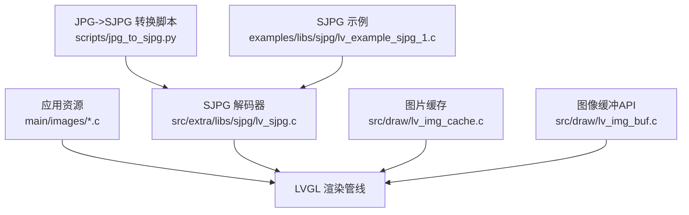
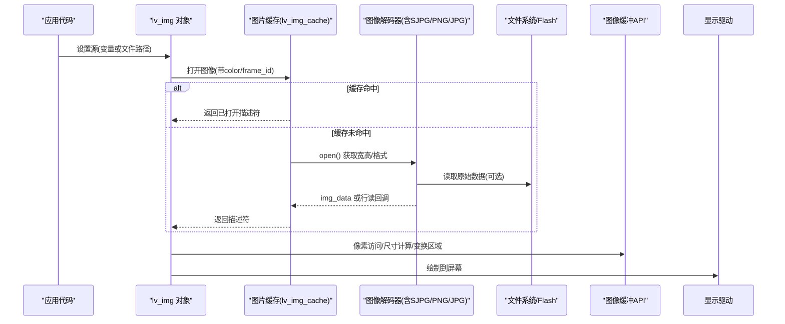
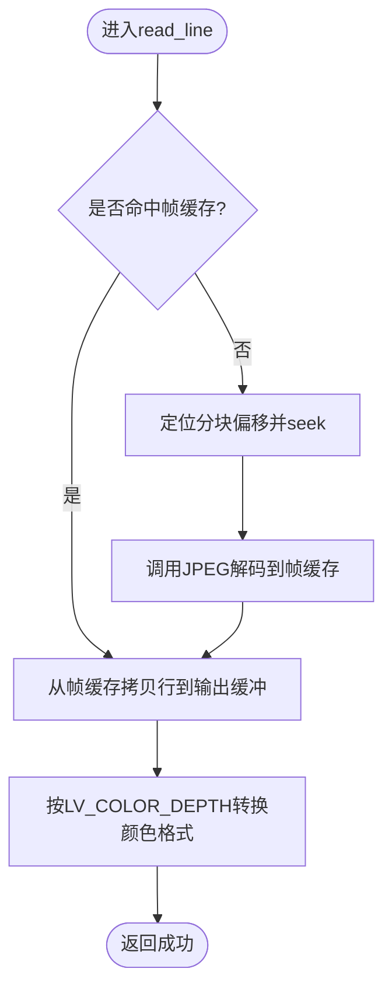
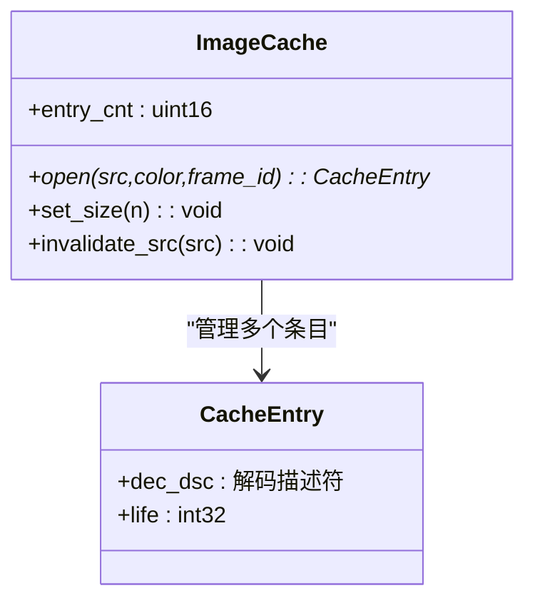
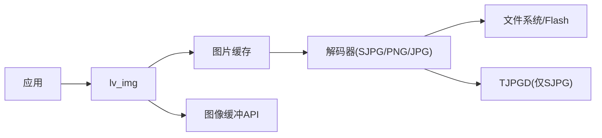

# 图像资源管理

<cite>
**本文引用的文件**   
- [image.md](file://ESP32开发板/TK021F2699_ESP32_LVGL_GIF_LED/TK021F2699_ESP32_LVGL_GIF_LED/managed_components/lvgl__lvgl/docs/overview/image.md)
- [jpg_to_sjpg.py](file://ESP32开发板/TK021F2699_ESP32_LVGL_GIF_LED/TK021F2699_ESP32_LVGL_GIF_LED/managed_components/lvgl__lvgl/scripts/jpg_to_sjpg.py)
- [lv_img_cache.c](file://ESP32开发板/TK021F2699_ESP32_LVGL_GIF_LED/TK021F2699_ESP32_LVGL_GIF_LED/managed_components/lvgl__lvgl/src/draw/lv_img_cache.c)
- [lv_img_buf.c](file://ESP32开发板/TK021F2699_ESP32_LVGL_GIF_LED/TK021F2699_ESP32_LVGL_GIF_LED/managed_components/lvgl__lvgl/src/draw/lv_img_buf.c)
- [ui_img_1063244380.c](file://ESP32开发板/TK021F2699_ESP32_LVGL_GIF_LED/TK021F2699_ESP32_LVGL_GIF_LED/main/images/ui_img_1063244380.c)
- [lv_example_sjpg_1.c](file://ESP32开发板/TK021F2699_ESP32_LVGL_GIF_LED/TK021F2699_ESP32_LVGL_GIF_LED/managed_components/lvgl__lvgl/examples/libs/sjpg/lv_example_sjpg_1.c)
- [lv_sjpg.c](file://ESP32开发板/TK021F2699_ESP32_LVGL_GIF_LED/TK021F2699_ESP32_LVGL_GIF_LED/managed_components/lvgl__lvgl/src/extra/libs/sjpg/lv_sjpg.c)
</cite>

## 目录
1. [简介](#简介)
2. [项目结构](#项目结构)
3. [核心组件](#核心组件)
4. [架构总览](#架构总览)
5. [详细组件分析](#详细组件分析)
6. [依赖关系分析](#依赖关系分析)
7. [性能与内存优化](#性能与内存优化)
8. [故障排查指南](#故障排查指南)
9. [结论](#结论)
10. [附录：工具链与命名规范](#附录工具链与命名规范)

## 简介
本文件面向在 ESP32 + LVGL 平台上进行图像资源管理的工程师，系统阐述从 PNG/JPG 到 LVGL 兼容格式的转换流程、压缩与颜色深度策略、内存布局与 PSRAM 使用建议、批量处理与自动化脚本、分辨率适配与缩放算法、缓存机制与预加载策略，以及资源命名与目录组织规范。文档同时结合仓库中的实际实现（SJPG 解码器、图片缓存、缓冲区操作、在线/离线转换脚本等）给出可落地的最佳实践。

## 项目结构
本项目采用“应用层资源 + LVGL 库”的层次化组织方式：
- 应用侧资源
  - main/images：由设计工具生成的 C 数组格式位图（如 ui_img_xxx.c），直接链接进固件，适合小图标与静态 UI 元素。
  - main/gif：GIF 帧数据（C 数组），用于动画展示。
- LVGL 库
  - docs/overview/image.md：官方图像概念、颜色格式、解码器接口与缓存说明。
  - scripts/jpg_to_sjpg.py：将 JPG 切块并打包为 SJPG，并生成 C 数组或二进制文件。
  - src/extra/libs/sjpg/*：SJPG 解码器实现（行级解码、颜色深度转换、缓存）。
  - src/draw/lv_img_cache.c：LVGL 内置图片缓存（按打开耗时加权的生命值淘汰策略）。
  - src/draw/lv_img_buf.c：图像缓冲区 API（像素读写、调色板、尺寸计算、变换区域）。
  - examples/libs/sjpg/*：SJPG 使用示例（文件系统路径加载）。

图表来源
- [image.md:1-331](file://ESP32开发板/TK021F2699_ESP32_LVGL_GIF_LED/TK021F2699_ESP32_LVGL_GIF_LED/managed_components/lvgl__lvgl/docs/overview/image.md#L1-L331)
- [jpg_to_sjpg.py:1-139](file://ESP32开发板/TK021F2699_ESP32_LVGL_GIF_LED/TK021F2699_ESP32_LVGL_GIF_LED/managed_components/lvgl__lvgl/scripts/jpg_to_sjpg.py#L1-L139)
- [lv_sjpg.c:1-828](file://ESP32开发板/TK021F2699_ESP32_LVGL_GIF_LED/TK021F2699_ESP32_LVGL_GIF_LED/managed_components/lvgl__lvgl/src/extra/libs/sjpg/lv_sjpg.c#L1-L828)
- [lv_img_cache.c:1-216](file://ESP32开发板/TK021F2699_ESP32_LVGL_GIF_LED/TK021F2699_ESP32_LVGL_GIF_LED/managed_components/lvgl__lvgl/src/draw/lv_img_cache.c#L1-L216)
- [lv_img_buf.c:1-393](file://ESP32开发板/TK021F2699_ESP32_LVGL_GIF_LED/TK021F2699_ESP32_LVGL_GIF_LED/managed_components/lvgl__lvgl/src/draw/lv_img_buf.c#L1-L393)
- [lv_example_sjpg_1.c:1-18](file://ESP32开发板/TK021F2699_ESP32_LVGL_GIF_LED/TK021F2699_ESP32_LVGL_GIF_LED/managed_components/lvgl__lvgl/examples/libs/sjpg/lv_example_sjpg_1.c#L1-L18)

章节来源
- [image.md:1-331](file://ESP32开发板/TK021F2699_ESP32_LVGL_GIF_LED/TK021F2699_ESP32_LVGL_GIF_LED/managed_components/lvgl__lvgl/docs/overview/image.md#L1-L331)

## 核心组件
- 图像描述符 lv_img_dsc_t
  - 包含宽高、颜色格式、数据指针与大小；支持变量（C 数组）与文件两种来源。
- 颜色格式
  - 真彩（含透明）、索引色、Alpha 通道、RAW 系列（交由外部解码器解析）。
- 图像解码器接口
  - info/open/read/close 四回调；支持 PNG/JPG/SJPG 等扩展格式。
- 图片缓存
  - 基于“打开耗时”加权的 LRU 式缓存，避免重复解码开销。
- 图像缓冲 API
  - 提供像素读写、调色板设置、尺寸计算、变换区域计算等。
- SJPG 解码器
  - 自定义 JPEG 分块容器，行级解码，自动转换为 LV_COLOR_DEPTH 目标格式。

章节来源
- [image.md:11-61](file://ESP32开发板/TK021F2699_ESP32_LVGL_GIF_LED/TK021F2699_ESP32_LVGL_GIF_LED/managed_components/lvgl__lvgl/docs/overview/image.md#L11-L61)
- [image.md:126-260](file://ESP32开发板/TK021F2699_ESP32_LVGL_GIF_LED/TK021F2699_ESP32_LVGL_GIF_LED/managed_components/lvgl__lvgl/docs/overview/image.md#L126-L260)
- [image.md:284-318](file://ESP32开发板/TK021F2699_ESP32_LVGL_GIF_LED/TK021F2699_ESP32_LVGL_GIF_LED/managed_components/lvgl__lvgl/docs/overview/image.md#L284-L318)
- [lv_img_buf.c:279-350](file://ESP32开发板/TK021F2699_ESP32_LVGL_GIF_LED/TK021F2699_ESP32_LVGL_GIF_LED/managed_components/lvgl__lvgl/src/draw/lv_img_buf.c#L279-L350)
- [lv_sjpg.c:283-328](file://ESP32开发板/TK021F2699_ESP32_LVGL_GIF_LED/TK021F2699_ESP32_LVGL_GIF_LED/managed_components/lvgl__lvgl/src/extra/libs/sjpg/lv_sjpg.c#L283-L328)

## 架构总览
下图展示了从原始图像到屏幕渲染的关键路径：转换脚本生成 SJPG/C 数组 → LVGL 通过解码器接口按需解码 → 缓存命中加速 → 最终写入显存。

图表来源
- [lv_img_cache.c:63-141](file://ESP32开发板/TK021F2699_ESP32_LVGL_GIF_LED/TK021F2699_ESP32_LVGL_GIF_LED/managed_components/lvgl__lvgl/src/draw/lv_img_cache.c#L63-L141)
- [image.md:126-260](file://ESP32开发板/TK021F2699_ESP32_LVGL_GIF_LED/TK021F2699_ESP32_LVGL_GIF_LED/managed_components/lvgl__lvgl/docs/overview/image.md#L126-L260)
- [lv_img_buf.c:352-388](file://ESP32开发板/TK021F2699_ESP32_LVGL_GIF_LED/TK021F2699_ESP32_LVGL_GIF_LED/managed_components/lvgl__lvgl/src/draw/lv_img_buf.c#L352-L388)

## 详细组件分析

### 组件A：SJPG 解码器（行级解码与颜色转换）
- 功能要点
  - 自定义头部标识与版本，宽度/高度/分块数量/每块高度。
  - 支持 C 数组与磁盘文件两种输入源。
  - 行级解码：仅解码当前可见行，降低峰值内存占用。
  - 输出格式：根据 LV_COLOR_DEPTH 自动转为 32/16/8 位目标格式。
- 关键流程
  - open：解析 SJPG 头，准备 TJPGD 工作区与 IO 源。
  - read_line：若请求行不在缓存帧，则定位对应分块偏移，调用底层 JPEG 解码至帧缓存，再拷贝到输出缓冲。
  - close：释放解码器与工作区。
- 复杂度与性能
  - 时间：O(行宽×目标像素大小)，空间：单帧缓存+工作区。
  - 优势：避免整图解码，显著降低 RAM 峰值。

图表来源
- [lv_sjpg.c:794-828](file://ESP32开发板/TK021F2699_ESP32_LVGL_GIF_LED/TK021F2699_ESP32_LVGL_GIF_LED/managed_components/lvgl__lvgl/src/extra/libs/sjpg/lv_sjpg.c#L794-L828)
- [lv_sjpg.c:283-328](file://ESP32开发板/TK021F2699_ESP32_LVGL_GIF_LED/TK021F2699_ESP32_LVGL_GIF_LED/managed_components/lvgl__lvgl/src/extra/libs/sjpg/lv_sjpg.c#L283-L328)

章节来源
- [lv_sjpg.c:1-828](file://ESP32开发板/TK021F2699_ESP32_LVGL_GIF_LED/TK021F2699_ESP32_LVGL_GIF_LED/managed_components/lvgl__lvgl/src/extra/libs/sjpg/lv_sjpg.c#L1-L828)

### 组件B：图片缓存（按打开耗时加权的生命值淘汰）
- 功能要点
  - 维护固定数量的缓存项，每项记录解码描述符与“生命值”。
  - 每次打开时对所有条目生命递减；命中后按 time_to_open 增加生命。
  - 淘汰策略：选择生命周期最小的条目关闭并重用。
- 配置与运行时调整
  - LV_IMG_CACHE_DEF_SIZE 控制是否启用及默认大小。
  - lv_img_cache_set_size(new_entry_cnt) 动态调整。
  - lv_img_cache_invalidate_src(src) 失效指定或全部缓存。

图表来源
- [lv_img_cache.c:63-141](file://ESP32开发板/TK021F2699_ESP32_LVGL_GIF_LED/TK021F2699_ESP32_LVGL_GIF_LED/managed_components/lvgl__lvgl/src/draw/lv_img_cache.c#L63-L141)
- [lv_img_cache.c:149-197](file://ESP32开发板/TK021F2699_ESP32_LVGL_GIF_LED/TK021F2699_ESP32_LVGL_GIF_LED/managed_components/lvgl__lvgl/src/draw/lv_img_cache.c#L149-L197)

章节来源
- [lv_img_cache.c:1-216](file://ESP32开发板/TK021F2699_ESP32_LVGL_GIF_LED/TK021F2699_ESP32_LVGL_GIF_LED/managed_components/lvgl__lvgl/src/draw/lv_img_cache.c#L1-L216)
- [image.md:284-318](file://ESP32开发板/TK021F2699_ESP32_LVGL_GIF_LED/TK021F2699_ESP32_LVGL_GIF_LED/managed_components/lvgl__lvgl/docs/overview/image.md#L284-L318)

### 组件C：图像缓冲 API（像素读写与尺寸计算）
- 能力
  - 获取/设置像素颜色与透明度，支持多种颜色格式与索引表。
  - 分配/释放 lv_img_dsc_t 及其数据缓冲。
  - 计算不同颜色格式下的图像字节数。
  - 计算旋转/缩放后的包围盒区域。
- 适用场景
  - 运行时生成位图、修改图标状态、动态调色板更新。

章节来源
- [lv_img_buf.c:41-153](file://ESP32开发板/TK021F2699_ESP32_LVGL_GIF_LED/TK021F2699_ESP32_LVGL_GIF_LED/managed_components/lvgl__lvgl/src/draw/lv_img_buf.c#L41-L153)
- [lv_img_buf.c:279-350](file://ESP32开发板/TK021F2699_ESP32_LVGL_GIF_LED/TK021F2699_ESP32_LVGL_GIF_LED/managed_components/lvgl__lvgl/src/draw/lv_img_buf.c#L279-L350)
- [lv_img_buf.c:352-388](file://ESP32开发板/TK021F2699_ESP32_LVGL_GIF_LED/TK021F2699_ESP32_LVGL_GIF_LED/managed_components/lvgl__lvgl/src/draw/lv_img_buf.c#L352-L388)

### 组件D：C 数组位图（编译期链接）
- 特点
  - 由设计工具生成，包含像素数据与 lv_img_dsc_t 描述符。
  - 典型颜色格式：TRUE_COLOR_ALPHA（含透明）。
  - 优点：无需运行时解码，启动即显示；缺点：占用 Flash/RAM。
- 参考实现
  - main/images/ui_img_xxx.c 中定义像素数组与描述符。

章节来源
- [ui_img_1063244380.c:1-61](file://ESP32开发板/TK021F2699_ESP32_LVGL_GIF_LED/TK021F2699_ESP32_LVGL_GIF_LED/main/images/ui_img_1063244380.c#L1-L61)

### 组件E：SJPG 使用示例（文件系统加载）
- 用法
  - 通过 lv_img_set_src 指定字母盘符路径，例如 "A:..."。
  - 需要预先注册文件系统驱动（如 SD 卡 FAT）。
- 参考实现
  - examples/libs/sjpg/lv_example_sjpg_1.c

章节来源
- [lv_example_sjpg_1.c:1-18](file://ESP32开发板/TK021F2699_ESP32_LVGL_GIF_LED/TK021F2699_ESP32_LVGL_GIF_LED/managed_components/lvgl__lvgl/examples/libs/sjpg/lv_example_sjpg_1.c#L1-L18)

## 依赖关系分析
- 模块耦合
  - 应用层通过 lv_img 对象与缓存交互；缓存依赖解码器；解码器依赖文件系统或 C 数组。
  - 图像缓冲 API 被渲染管线与解码器共同使用。
- 外部依赖
  - SJPG 解码依赖 TJPGD（行级解码与缩放）。
  - PNG/JPG 解码依赖 lodepng 等第三方库（在 LVGL 额外库中集成）。
- 潜在循环
  - 无直接循环依赖；缓存与解码器通过标准接口解耦。

图表来源
- [lv_img_cache.c:63-141](file://ESP32开发板/TK021F2699_ESP32_LVGL_GIF_LED/TK021F2699_ESP32_LVGL_GIF_LED/managed_components/lvgl__lvgl/src/draw/lv_img_cache.c#L63-L141)
- [lv_sjpg.c:283-328](file://ESP32开发板/TK021F2699_ESP32_LVGL_GIF_LED/TK021F2699_ESP32_LVGL_GIF_LED/managed_components/lvgl__lvgl/src/extra/libs/sjpg/lv_sjpg.c#L283-L328)

## 性能与内存优化
- 颜色深度与文件大小
  - 优先使用 16 位 RGB565 或 8 位索引/Alpha 格式以平衡画质与体积。
  - 对大面积纯色背景使用 Alpha 通道或索引色，减少数据量。
- 分块与行级解码
  - 使用 SJPG 分块（默认每块高度 16 行）配合行级解码，显著降低峰值内存。
- 缓存命中率
  - 合理设置 LV_IMG_CACHE_DEF_SIZE 与 lv_img_cache_set_size，提高热点图像命中率。
  - 对于大图像或慢速存储，适当增大缓存可减少重复解码。
- 预加载策略
  - 在页面切换前，提前触发 lv_img_decoder_open 并保留在缓存中。
  - 对首屏关键图标使用 C 数组直连，零解码延迟。
- PSRAM 使用建议
  - 将大图像数据（尤其是 SJPG 原始数据）放置于 PSRAM，解码缓存尽量留在内部 SRAM。
  - 注意 DMA/总线带宽限制，避免频繁跨域拷贝。
- 缩放与重采样
  - 尽量在预处理阶段生成多分辨率资源，运行时避免复杂缩放。
  - 若必须缩放，优先使用接近整数倍缩放，减少插值开销。

[本节为通用指导，不直接分析具体文件]

## 故障排查指南
- 无法打开图像
  - 检查解码器是否注册且支持该格式；确认文件路径或变量指针有效。
  - 查看日志警告（解码失败通常有明确错误码）。
- 缓存未生效
  - 确认 LV_IMG_CACHE_DEF_SIZE > 0；必要时调用 lv_img_cache_set_size 调整。
  - 若底层文件更新，需调用 lv_img_cache_invalidate_src 使旧缓存失效。
- 颜色异常
  - 核对颜色格式与 LV_COLOR_DEPTH 匹配；SJPG 会自动转换但需确保目标深度正确。
- 内存不足
  - 减小缓存大小或改用行级解码；将大资源移至 PSRAM。
  - 避免同时缓存过多大图。

章节来源
- [image.md:284-318](file://ESP32开发板/TK021F2699_ESP32_LVGL_GIF_LED/TK021F2699_ESP32_LVGL_GIF_LED/managed_components/lvgl__lvgl/docs/overview/image.md#L284-L318)
- [lv_img_cache.c:149-197](file://ESP32开发板/TK021F2699_ESP32_LVGL_GIF_LED/TK021F2699_ESP32_LVGL_GIF_LED/managed_components/lvgl__lvgl/src/draw/lv_img_cache.c#L149-L197)

## 结论
通过将图像资源以 SJPG 分块形式存储并结合行级解码，配合 LVGL 的图片缓存与缓冲 API，可在 ESP32 等资源受限平台上实现高质量、低内存占用的图像显示。针对静态小图标，优先使用 C 数组直连；对于大图与相册类内容，推荐 SJPG + 文件系统 + 缓存的组合方案。通过合理的颜色深度、分块高度与缓存策略，可在画质与性能之间取得良好平衡。

[本节为总结性内容，不直接分析具体文件]

## 附录：工具链与命名规范

### 工具链与批量处理
- 在线转换器
  - 支持 BMP/PNG/JPG 转 LVGL 变量或二进制，自动生成 C 数组或 .bin。
- 离线脚本（JPG→SJPG）
  - 脚本将 JPG 按固定高度切块，拼接为 SJPG 容器，并可选择生成 C 数组。
  - 参数：输入 JPG 路径；输出同名 .sjpg 与 .c。
  - 质量：默认 JPEG 质量 90，分块高度 16 行。
- 批量处理建议
  - 编写 Shell/Python 脚本遍历资源目录，统一调用 jpg_to_sjpg.py。
  - 对大图与背景图优先使用 SJPG；小图标使用在线转换器生成 C 数组。
  - 构建系统集成：在 CMake/Makefile 中添加 prebuild 步骤，自动执行转换。

章节来源
- [image.md:69-87](file://ESP32开发板/TK021F2699_ESP32_LVGL_GIF_LED/TK021F2699_ESP32_LVGL_GIF_LED/managed_components/lvgl__lvgl/docs/overview/image.md#L69-L87)
- [jpg_to_sjpg.py:1-139](file://ESP32开发板/TK021F2699_ESP32_LVGL_GIF_LED/TK021F2699_ESP32_LVGL_GIF_LED/managed_components/lvgl__lvgl/scripts/jpg_to_sjpg.py#L1-L139)

### 命名规范与目录组织
- 命名
  - C 数组位图：ui_img_<唯一ID>.c（ID 可由设计工具生成，保证全局唯一）。
  - SJPG 资源：<主题>_<用途>_<分辨率>.sjpg（如 bg_home_480x272.sjpg）。
- 目录
  - main/images：静态图标与 UI 元素（C 数组）。
  - assets/sjpg：SJPG 资源（运行时从文件系统加载）。
  - assets/png：PNG 源素材（供转换脚本使用）。
  - docs/resources：资源清单与元数据（分辨率、颜色深度、用途说明）。

[本节为规范性建议，不直接分析具体文件]