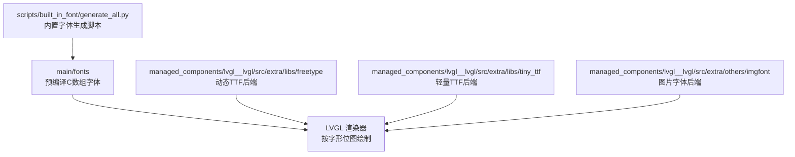
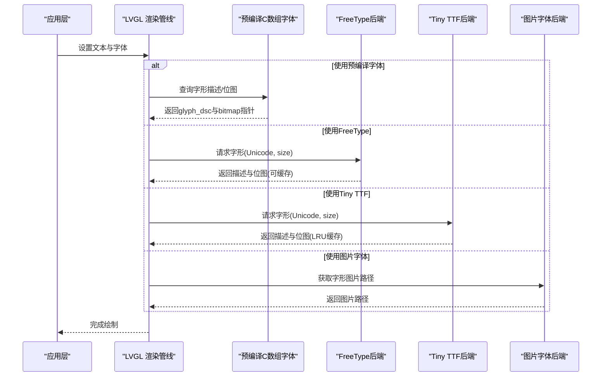
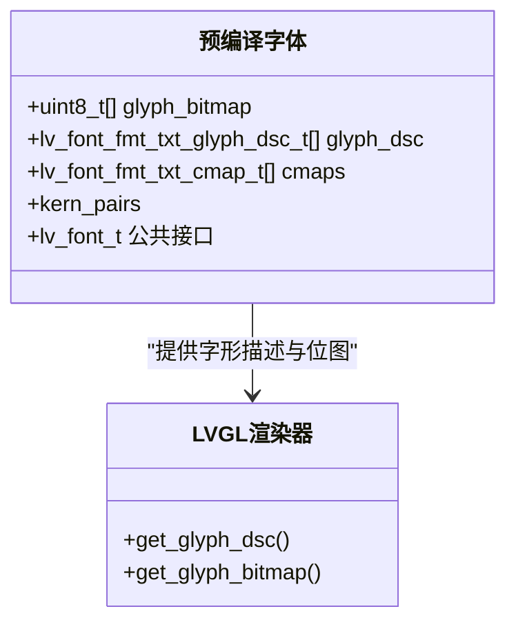
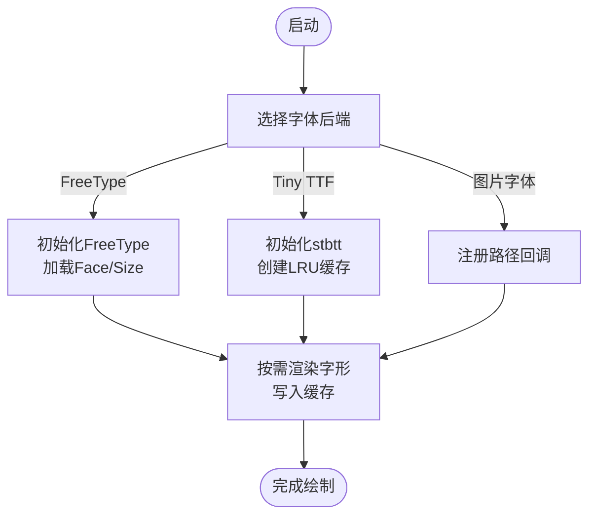
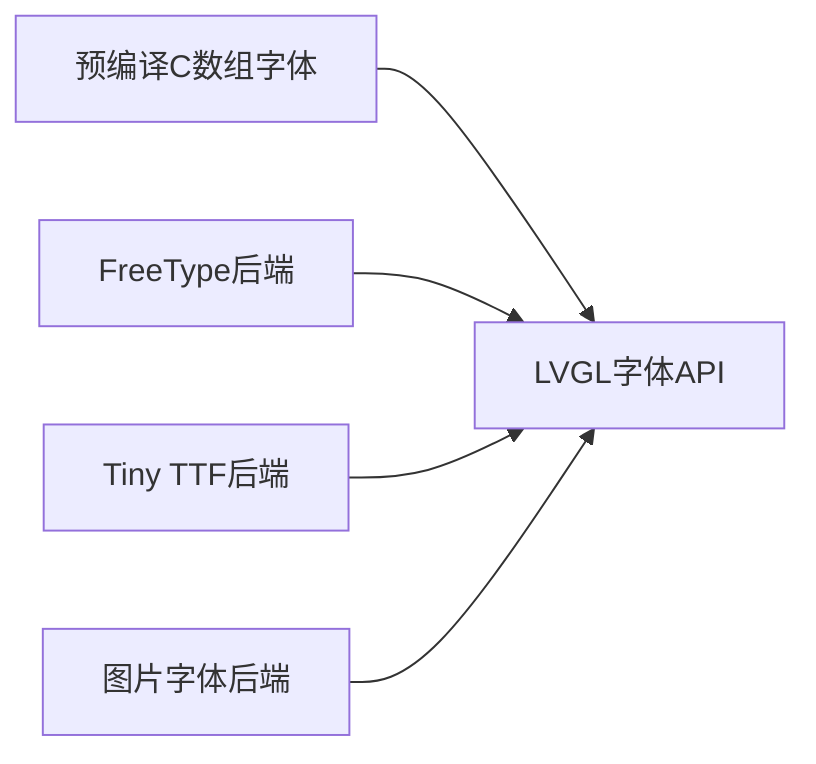

# 字体资源管理

<cite>
**本文引用的文件**   
- [ui_font_Alibaba_PuHuiTi_Font_14.c](file://ESP32开发板/TK021F2699_ESP32_LVGL_GIF_LED/TK021F2699_ESP32_LVGL_GIF_LED/main/fonts/ui_font_Alibaba_PuHuiTi_Font_14.c)
- [ui_font_Alibaba_PuHuiTi_Font_20.c](file://ESP32开发板/TK021F2699_ESP32_LVGL_GIF_LED/TK021F2699_ESP32_LVGL_GIF_LED/main/fonts/ui_font_Alibaba_PuHuiTi_Font_20.c)
- [ui_font_Alibaba_PuHuiTi_Font_32.c](file://ESP32开发板/TK021F2699_ESP32_LVGL_GIF_LED/TK021F2699_ESP32_LVGL_GIF_LED/main/fonts/ui_font_Alibaba_PuHuiTi_Font_32.c)
- [ui_font_Alibaba_PuHuiTi_Font_48.c](file://ESP32开发板/TK021F2699_ESP32_LVGL_GIF_LED/TK021F2699_ESP32_LVGL_GIF_LED/main/fonts/ui_font_Alibaba_PuHuiTi_Font_48.c)
- [lv_freetype.c](file://ESP32开发板/TK021F2699_ESP32_LVGL_GIF_LED/TK021F2699_ESP32_LVGL_GIF_LED/managed_components/lvgl__lvgl/src/extra/libs/freetype/lv_freetype.c)
- [lv_tiny_ttf.c](file://ESP32开发板/TK021F2699_ESP32_LVGL_GIF_LED/TK021F2699_ESP32_LVGL_GIF_LED/managed_components/lvgl__lvgl/src/extra/libs/tiny_ttf/lv_tiny_ttf.c)
- [lv_imgfont.c](file://ESP32开发板/TK021F2699_ESP32_LVGL_GIF_LED/TK021F2699_ESP32_LVGL_GIF_LED/managed_components/lvgl__lvgl/src/extra/others/imgfont/lv_imgfont.c)
- [generate_all.py](file://ESP32开发板/TK021F2699_ESP32_LVGL_GIF_LED/TK021F2699_ESP32_LVGL_GIF_LED/managed_components/lvgl__lvgl/scripts/built_in_font/generate_all.py)
</cite>

## 目录
1. [简介](#简介)
2. [项目结构](#项目结构)
3. [核心组件](#核心组件)
4. [架构总览](#架构总览)
5. [详细组件分析](#详细组件分析)
6. [依赖关系分析](#依赖关系分析)
7. [性能考虑](#性能考虑)
8. [故障排查指南](#故障排查指南)
9. [结论](#结论)
10. [附录](#附录)

## 简介
本文件面向嵌入式 LVGL 项目的字体资源管理，聚焦以下目标：
- 解释从原始字体（TTF）到嵌入式 C 数组的生成流程与关键参数。
- 说明项目中 14、20、32、48 字号字体的选择策略与内存占用特征。
- 介绍阿里巴巴普惠体嵌入方法与配置选项。
- 提供自定义字体制作工具链（格式转换、字符集选择、压缩优化）。
- 给出渲染性能优化技巧与内存管理策略。
- 建立字体资源的版本管理与更新机制。
- 总结加载最佳实践与常见问题解决方案。

## 项目结构
本项目将预编译的字体以 C 数组形式内嵌于 main/fonts 目录，供 LVGL 直接引用；同时包含 LVGL 提供的多种字体后端实现（FreeType、Tiny TTF、图片字体等），以及内置字体生成脚本。

图表来源
- [ui_font_Alibaba_PuHuiTi_Font_14.c:1-20](file://ESP32开发板/TK021F2699_ESP32_LVGL_GIF_LED/TK021F2699_ESP32_LVGL_GIF_LED/main/fonts/ui_font_Alibaba_PuHuiTi_Font_14.c#L1-L20)
- [ui_font_Alibaba_PuHuiTi_Font_20.c:1-20](file://ESP32开发板/TK021F2699_ESP32_LVGL_GIF_LED/TK021F2699_ESP32_LVGL_GIF_LED/main/fonts/ui_font_Alibaba_PuHuiTi_Font_20.c#L1-L20)
- [ui_font_Alibaba_PuHuiTi_Font_32.c:1-20](file://ESP32开发板/TK021F2699_ESP32_LVGL_GIF_LED/TK021F2699_ESP32_LVGL_GIF_LED/main/fonts/ui_font_Alibaba_PuHuiTi_Font_32.c#L1-L20)
- [ui_font_Alibaba_PuHuiTi_Font_48.c:1-20](file://ESP32开发板/TK021F2699_ESP32_LVGL_GIF_LED/TK021F2699_ESP32_LVGL_GIF_LED/main/fonts/ui_font_Alibaba_PuHuiTi_Font_48.c#L1-L20)
- [lv_freetype.c:190-233](file://ESP32开发板/TK021F2699_ESP32_LVGL_GIF_LED/TK021F2699_ESP32_LVGL_GIF_LED/managed_components/lvgl__lvgl/src/extra/libs/freetype/lv_freetype.c#L190-L233)
- [lv_tiny_ttf.c:174-236](file://ESP32开发板/TK021F2699_ESP32_LVGL_GIF_LED/TK021F2699_ESP32_LVGL_GIF_LED/managed_components/lvgl__lvgl/src/extra/libs/tiny_ttf/lv_tiny_ttf.c#L174-L236)
- [lv_imgfont.c:59-108](file://ESP32开发板/TK021F2699_ESP32_LVGL_GIF_LED/TK021F2699_ESP32_LVGL_GIF_LED/managed_components/lvgl__lvgl/src/extra/others/imgfont/lv_imgfont.c#L59-L108)
- [generate_all.py:80-83](file://ESP32开发板/TK021F2699_ESP32_LVGL_GIF_LED/TK021F2699_ESP32_LVGL_GIF_LED/managed_components/lvgl__lvgl/scripts/built_in_font/generate_all.py#L80-L83)

章节来源
- [ui_font_Alibaba_PuHuiTi_Font_14.c:1-20](file://ESP32开发板/TK021F2699_ESP32_LVGL_GIF_LED/TK021F2699_ESP32_LVGL_GIF_LED/main/fonts/ui_font_Alibaba_PuHuiTi_Font_14.c#L1-L20)
- [ui_font_Alibaba_PuHuiTi_Font_20.c:1-20](file://ESP32开发板/TK021F2699_ESP32_LVGL_GIF_LED/TK021F2699_ESP32_LVGL_GIF_LED/main/fonts/ui_font_Alibaba_PuHuiTi_Font_20.c#L1-L20)
- [ui_font_Alibaba_PuHuiTi_Font_32.c:1-20](file://ESP32开发板/TK021F2699_ESP32_LVGL_GIF_LED/TK021F2699_ESP32_LVGL_GIF_LED/main/fonts/ui_font_Alibaba_PuHuiTi_Font_32.c#L1-L20)
- [ui_font_Alibaba_PuHuiTi_Font_48.c:1-20](file://ESP32开发板/TK021F2699_ESP32_LVGL_GIF_LED/TK021F2699_ESP32_LVGL_GIF_LED/main/fonts/ui_font_Alibaba_PuHuiTi_Font_48.c#L1-L20)
- [generate_all.py:80-83](file://ESP32开发板/TK021F2699_ESP32_LVGL_GIF_LED/TK021F2699_ESP32_LVGL_GIF_LED/managed_components/lvgl__lvgl/scripts/built_in_font/generate_all.py#L80-L83)

## 核心组件
- 预编译字体数组（main/fonts）
  - 每个字号一个 C 文件，包含字形位图、描述表、字符映射、字距信息以及 LVGL 字体对象初始化。
  - 通过 lv_font_get_glyph_dsc_fmt_txt / lv_font_get_bitmap_fmt_txt 访问字形数据。
- 动态字体后端（managed_components/lvgl__lvgl/src/extra）
  - FreeType：支持运行时加载 TTF，可缓存字形，适合多语言/大字符集场景。
  - Tiny TTF：轻量级 TTF 解析与位图缓存，适合资源受限设备。
  - 图片字体：将字形作为图片路径返回，适用于图标或特殊字形。
- 内置字体生成脚本（scripts/built_in_font）
  - 使用 lv_font_conv 将 TTF 转换为 LVGL 兼容的 C 数组，支持范围、符号、压缩等选项。

章节来源
- [ui_font_Alibaba_PuHuiTi_Font_14.c:1365-1411](file://ESP32开发板/TK021F2699_ESP32_LVGL_GIF_LED/TK021F2699_ESP32_LVGL_GIF_LED/main/fonts/ui_font_Alibaba_PuHuiTi_Font_14.c#L1365-L1411)
- [lv_freetype.c:190-233](file://ESP32开发板/TK021F2699_ESP32_LVGL_GIF_LED/TK021F2699_ESP32_LVGL_GIF_LED/managed_components/lvgl__lvgl/src/extra/libs/freetype/lv_freetype.c#L190-L233)
- [lv_tiny_ttf.c:174-236](file://ESP32开发板/TK021F2699_ESP32_LVGL_GIF_LED/TK021F2699_ESP32_LVGL_GIF_LED/managed_components/lvgl__lvgl/src/extra/libs/tiny_ttf/lv_tiny_ttf.c#L174-L236)
- [lv_imgfont.c:59-108](file://ESP32开发板/TK021F2699_ESP32_LVGL_GIF_LED/TK021F2699_ESP32_LVGL_GIF_LED/managed_components/lvgl__lvgl/src/extra/others/imgfont/lv_imgfont.c#L59-L108)
- [generate_all.py:80-83](file://ESP32开发板/TK021F2699_ESP32_LVGL_GIF_LED/TK021F2699_ESP32_LVGL_GIF_LED/managed_components/lvgl__lvgl/scripts/built_in_font/generate_all.py#L80-L83)

## 架构总览
下图展示三种主要字体路径：预编译 C 数组、FreeType 动态加载、Tiny TTF 动态加载，以及图片字体方案。

图表来源
- [ui_font_Alibaba_PuHuiTi_Font_14.c:1390-1411](file://ESP32开发板/TK021F2699_ESP32_LVGL_GIF_LED/TK021F2699_ESP32_LVGL_GIF_LED/main/fonts/ui_font_Alibaba_PuHuiTi_Font_14.c#L1390-L1411)
- [lv_freetype.c:460-524](file://ESP32开发板/TK021F2699_ESP32_LVGL_GIF_LED/TK021F2699_ESP32_LVGL_GIF_LED/managed_components/lvgl__lvgl/src/extra/libs/freetype/lv_freetype.c#L460-L524)
- [lv_tiny_ttf.c:130-172](file://ESP32开发板/TK021F2699_ESP32_LVGL_GIF_LED/TK021F2699_ESP32_LVGL_GIF_LED/managed_components/lvgl__lvgl/src/extra/libs/tiny_ttf/lv_tiny_ttf.c#L130-L172)
- [lv_imgfont.c:89-108](file://ESP32开发板/TK021F2699_ESP32_LVGL_GIF_LED/TK021F2699_ESP32_LVGL_GIF_LED/managed_components/lvgl__lvgl/src/extra/others/imgfont/lv_imgfont.c#L89-L108)

## 详细组件分析

### 预编译字体数组（阿里巴巴普惠体）
- 文件组织
  - 每个字号对应一个 C 文件，包含：
    - 字形位图数组 glyph_bitmap[]
    - 字形描述表 glyph_dsc[]（adv_w、box_w、box_h、ofs_x、ofs_y、bitmap_index）
    - 字符映射 cmaps[]（Unicode 范围到 glyph_id 的映射）
    - 字距 kerning 数据（可选）
    - LVGL 字体对象初始化（line_height、base_line、dsc 指针等）
- 生成命令与参数
  - 各文件头部注释记录了生成命令，典型参数包括：
    - --bpp：每像素位数（14/20 为 4，32/48 为 8）
    - --size：字号
    - --font：源 TTF 路径
    - -r：Unicode 范围（如 0x20-0x7f）
    - --symbols：额外符号（如数字、中文功能词）
    - --no-compress --no-prefilter：关闭压缩与预过滤
- 内存占用与质量权衡
  - bpp=4：体积较小，灰度等级适中，适合小字号与资源受限场景。
  - bpp=8：体积显著增大，但边缘更平滑，适合大字号与高对比显示。
  - 字符集越大、字号越高，内存占用呈非线性增长。
- 使用方式
  - 在 UI 中直接引用生成的 lv_font_t 变量（如 ui_font_Alibaba_PuHuiTi_Font_14）。
  - 通过 LVGL API 设置 label/desc 的 font 属性即可渲染。

图表来源
- [ui_font_Alibaba_PuHuiTi_Font_14.c:1365-1411](file://ESP32开发板/TK021F2699_ESP32_LVGL_GIF_LED/TK021F2699_ESP32_LVGL_GIF_LED/main/fonts/ui_font_Alibaba_PuHuiTi_Font_14.c#L1365-L1411)
- [ui_font_Alibaba_PuHuiTi_Font_20.c:1-20](file://ESP32开发板/TK021F2699_ESP32_LVGL_GIF_LED/TK021F2699_ESP32_LVGL_GIF_LED/main/fonts/ui_font_Alibaba_PuHuiTi_Font_20.c#L1-L20)
- [ui_font_Alibaba_PuHuiTi_Font_32.c:1-20](file://ESP32开发板/TK021F2699_ESP32_LVGL_GIF_LED/TK021F2699_ESP32_LVGL_GIF_LED/main/fonts/ui_font_Alibaba_PuHuiTi_Font_32.c#L1-L20)
- [ui_font_Alibaba_PuHuiTi_Font_48.c:1-20](file://ESP32开发板/TK021F2699_ESP32_LVGL_GIF_LED/TK021F2699_ESP32_LVGL_GIF_LED/main/fonts/ui_font_Alibaba_PuHuiTi_Font_48.c#L1-L20)

章节来源
- [ui_font_Alibaba_PuHuiTi_Font_14.c:1-20](file://ESP32开发板/TK021F2699_ESP32_LVGL_GIF_LED/TK021F2699_ESP32_LVGL_GIF_LED/main/fonts/ui_font_Alibaba_PuHuiTi_Font_14.c#L1-L20)
- [ui_font_Alibaba_PuHuiTi_Font_20.c:1-20](file://ESP32开发板/TK021F2699_ESP32_LVGL_GIF_LED/TK021F2699_ESP32_LVGL_GIF_LED/main/fonts/ui_font_Alibaba_PuHuiTi_Font_20.c#L1-L20)
- [ui_font_Alibaba_PuHuiTi_Font_32.c:1-20](file://ESP32开发板/TK021F2699_ESP32_LVGL_GIF_LED/TK021F2699_ESP32_LVGL_GIF_LED/main/fonts/ui_font_Alibaba_PuHuiTi_Font_32.c#L1-L20)
- [ui_font_Alibaba_PuHuiTi_Font_48.c:1-20](file://ESP32开发板/TK021F2699_ESP32_LVGL_GIF_LED/TK021F2699_ESP32_LVGL_GIF_LED/main/fonts/ui_font_Alibaba_PuHuiTi_Font_48.c#L1-L20)
- [ui_font_Alibaba_PuHuiTi_Font_14.c:1365-1411](file://ESP32开发板/TK021F2699_ESP32_LVGL_GIF_LED/TK021F2699_ESP32_LVGL_GIF_LED/main/fonts/ui_font_Alibaba_PuHuiTi_Font_14.c#L1365-L1411)

### 动态字体后端（FreeType 与 Tiny TTF）
- FreeType 后端
  - 支持运行时加载 TTF，提供字形描述与位图，内部可使用缓存减少重复计算。
  - 支持粗体、斜体等样式处理。
- Tiny TTF 后端
  - 基于 stb_truetype，提供 LRU 位图缓存，适合内存受限环境。
  - 支持从文件或内存数据创建字体，并可动态调整字号。
- 图片字体后端
  - 将字形映射为图片路径，由回调函数返回，适合图标或特殊字形。

图表来源
- [lv_freetype.c:190-233](file://ESP32开发板/TK021F2699_ESP32_LVGL_GIF_LED/TK021F2699_ESP32_LVGL_GIF_LED/managed_components/lvgl__lvgl/src/extra/libs/freetype/lv_freetype.c#L190-L233)
- [lv_tiny_ttf.c:174-236](file://ESP32开发板/TK021F2699_ESP32_LVGL_GIF_LED/TK021F2699_ESP32_LVGL_GIF_LED/managed_components/lvgl__lvgl/src/extra/libs/tiny_ttf/lv_tiny_ttf.c#L174-L236)
- [lv_imgfont.c:59-108](file://ESP32开发板/TK021F2699_ESP32_LVGL_GIF_LED/TK021F2699_ESP32_LVGL_GIF_LED/managed_components/lvgl__lvgl/src/extra/others/imgfont/lv_imgfont.c#L59-L108)

章节来源
- [lv_freetype.c:460-524](file://ESP32开发板/TK021F2699_ESP32_LVGL_GIF_LED/TK021F2699_ESP32_LVGL_GIF_LED/managed_components/lvgl__lvgl/src/extra/libs/freetype/lv_freetype.c#L460-L524)
- [lv_tiny_ttf.c:130-172](file://ESP32开发板/TK021F2699_ESP32_LVGL_GIF_LED/TK021F2699_ESP32_LVGL_GIF_LED/managed_components/lvgl__lvgl/src/extra/libs/tiny_ttf/lv_tiny_ttf.c#L130-L172)
- [lv_imgfont.c:89-108](file://ESP32开发板/TK021F2699_ESP32_LVGL_GIF_LED/TK021F2699_ESP32_LVGL_GIF_LED/managed_components/lvgl__lvgl/src/extra/others/imgfont/lv_imgfont.c#L89-L108)

### 字号选择策略与内存占用分析（14、20、32、48）
- 选择策略
  - 14px：用于正文、列表项等小尺寸文本，建议 bpp=4，字符集仅包含 ASCII 与必要符号。
  - 20px：用于标题、提示文本，建议 bpp=4，可扩展少量常用符号。
  - 32px：用于大标题或强调文本，建议 bpp=8，加入必要中文词汇（如“功能”）。
  - 48px：用于主标题或状态栏大字，建议 bpp=8，扩展更多中文词汇（如“功能设置音乐灯光摄像头天气闹钟地图通知电池亮度手电筒”）。
- 内存占用趋势
  - 随字号与 bpp 增加，位图数据线性增长；字符集扩大导致字形数量增加，进一步放大占用。
  - 32/48 采用 bpp=8，视觉质量更高，但体积显著大于 14/20 的 bpp=4。
- 建议
  - 优先使用预编译字体控制体积；仅在需要大量 Unicode 时启用动态后端。
  - 对高频字符单独生成独立字体文件，避免一次性加载全部字符集。

章节来源
- [ui_font_Alibaba_PuHuiTi_Font_14.c:1-20](file://ESP32开发板/TK021F2699_ESP32_LVGL_GIF_LED/TK021F2699_ESP32_LVGL_GIF_LED/main/fonts/ui_font_Alibaba_PuHuiTi_Font_14.c#L1-L20)
- [ui_font_Alibaba_PuHuiTi_Font_20.c:1-20](file://ESP32开发板/TK021F2699_ESP32_LVGL_GIF_LED/TK021F2699_ESP32_LVGL_GIF_LED/main/fonts/ui_font_Alibaba_PuHuiTi_Font_20.c#L1-L20)
- [ui_font_Alibaba_PuHuiTi_Font_32.c:1-20](file://ESP32开发板/TK021F2699_ESP32_LVGL_GIF_LED/TK021F2699_ESP32_LVGL_GIF_LED/main/fonts/ui_font_Alibaba_PuHuiTi_Font_32.c#L1-L20)
- [ui_font_Alibaba_PuHuiTi_Font_48.c:1-20](file://ESP32开发板/TK021F2699_ESP32_LVGL_GIF_LED/TK021F2699_ESP32_LVGL_GIF_LED/main/fonts/ui_font_Alibaba_PuHuiTi_Font_48.c#L1-L20)

### 阿里巴巴普惠体嵌入方法与配置选项
- 嵌入方法
  - 使用 lv_font_conv 将 TTF 转为 LVGL 兼容的 C 数组，放入 main/fonts。
  - 在 UI 代码中直接引用生成的 lv_font_t 变量。
- 关键配置选项
  - --bpp：根据显示需求选择 4 或 8。
  - --size：目标字号。
  - -r：Unicode 范围（例如 0x20-0x7f）。
  - --symbols：追加特定符号或中文词汇。
  - --no-compress --no-prefilter：关闭压缩与预过滤，便于调试与一致性。
- 示例参考
  - 14/20 使用 ASCII 范围与数字符号。
  - 32/48 扩展中文词汇以满足界面文案需求。

章节来源
- [ui_font_Alibaba_PuHuiTi_Font_14.c:1-20](file://ESP32开发板/TK021F2699_ESP32_LVGL_GIF_LED/TK021F2699_ESP32_LVGL_GIF_LED/main/fonts/ui_font_Alibaba_PuHuiTi_Font_14.c#L1-L20)
- [ui_font_Alibaba_PuHuiTi_Font_20.c:1-20](file://ESP32开发板/TK021F2699_ESP32_LVGL_GIF_LED/TK021F2699_ESP32_LVGL_GIF_LED/main/fonts/ui_font_Alibaba_PuHuiTi_Font_20.c#L1-L20)
- [ui_font_Alibaba_PuHuiTi_Font_32.c:1-20](file://ESP32开发板/TK021F2699_ESP32_LVGL_GIF_LED/TK021F2699_ESP32_LVGL_GIF_LED/main/fonts/ui_font_Alibaba_PuHuiTi_Font_32.c#L1-L20)
- [ui_font_Alibaba_PuHuiTi_Font_48.c:1-20](file://ESP32开发板/TK021F2699_ESP32_LVGL_GIF_LED/TK021F2699_ESP32_LVGL_GIF_LED/main/fonts/ui_font_Alibaba_PuHuiTi_Font_48.c#L1-L20)

### 自定义字体制作工具链
- 工具链步骤
  - 准备 TTF 源文件（如阿里巴巴普惠体）。
  - 使用 lv_font_conv 指定 --bpp、--size、-r、--symbols、--format lvgl、-o 输出文件。
  - 将生成的 C 文件纳入工程并引用。
- 字符集选择
  - 最小化原则：仅包含必要字符与符号，降低体积。
  - 分文件策略：按场景拆分（ASCII、数字、中文词汇），按需加载。
- 压缩优化
  - 若需压缩，去掉 --no-compress，启用压缩以减少体积，但可能影响渲染速度。
  - 对于大图形字体（32/48），谨慎评估压缩带来的 CPU 开销。

章节来源
- [generate_all.py:80-83](file://ESP32开发板/TK021F2699_ESP32_LVGL_GIF_LED/TK021F2699_ESP32_LVGL_GIF_LED/managed_components/lvgl__lvgl/scripts/built_in_font/generate_all.py#L80-L83)

### 字体渲染性能优化技巧与内存管理策略
- 预编译 vs 动态
  - 预编译字体无运行时解析开销，适合固定字符集与稳定 UI。
  - 动态后端适合多语言与大字符集，但需权衡 CPU 与内存。
- 缓存策略
  - FreeType 与 Tiny TTF 均提供缓存机制，合理设置缓存大小可减少重复渲染。
- 位图格式
  - bpp=4 体积更小，适合小字号；bpp=8 质量更高，适合大字号。
- 字距与对齐
  - 启用 kerning 提升可读性，但会增加查找开销；必要时可关闭。
- 内存管理
  - 动态后端释放不再使用的 Face/Size 与缓存条目，避免泄漏。
  - 图片字体注意路径回调的资源生命周期。

章节来源
- [lv_freetype.c:460-524](file://ESP32开发板/TK021F2699_ESP32_LVGL_GIF_LED/TK021F2699_ESP32_LVGL_GIF_LED/managed_components/lvgl__lvgl/src/extra/libs/freetype/lv_freetype.c#L460-L524)
- [lv_tiny_ttf.c:130-172](file://ESP32开发板/TK021F2699_ESP32_LVGL_GIF_LED/TK021F2699_ESP32_LVGL_GIF_LED/managed_components/lvgl__lvgl/src/extra/libs/tiny_ttf/lv_tiny_ttf.c#L130-L172)
- [lv_imgfont.c:89-108](file://ESP32开发板/TK021F2699_ESP32_LVGL_GIF_LED/TK021F2699_ESP32_LVGL_GIF_LED/managed_components/lvgl__lvgl/src/extra/others/imgfont/lv_imgfont.c#L89-L108)

### 字体资源的版本管理与更新机制
- 版本标识
  - 在每个字体 C 文件头部记录生成命令与源 TTF 路径，便于追溯。
- 变更流程
  - 修改 TTF 或字符集后，重新运行 lv_font_conv 生成新 C 文件。
  - 提交前进行构建与 UI 验证，确保渲染一致性与内存占用可控。
- 回滚策略
  - 保留历史版本 C 文件，必要时快速回滚。

章节来源
- [ui_font_Alibaba_PuHuiTi_Font_14.c:1-20](file://ESP32开发板/TK021F2699_ESP32_LVGL_GIF_LED/TK021F2699_ESP32_LVGL_GIF_LED/main/fonts/ui_font_Alibaba_PuHuiTi_Font_14.c#L1-L20)
- [ui_font_Alibaba_PuHuiTi_Font_20.c:1-20](file://ESP32开发板/TK021F2699_ESP32_LVGL_GIF_LED/TK021F2699_ESP32_LVGL_GIF_LED/main/fonts/ui_font_Alibaba_PuHuiTi_Font_20.c#L1-L20)
- [ui_font_Alibaba_PuHuiTi_Font_32.c:1-20](file://ESP32开发板/TK021F2699_ESP32_LVGL_GIF_LED/TK021F2699_ESP32_LVGL_GIF_LED/main/fonts/ui_font_Alibaba_PuHuiTi_Font_32.c#L1-L20)
- [ui_font_Alibaba_PuHuiTi_Font_48.c:1-20](file://ESP32开发板/TK021F2699_ESP32_LVGL_GIF_LED/TK021F2699_ESP32_LVGL_GIF_LED/main/fonts/ui_font_Alibaba_PuHuiTi_Font_48.c#L1-L20)

### 字体加载最佳实践与常见问题解决方案
- 最佳实践
  - 固定 UI 使用预编译字体；多语言/大字符集使用动态后端。
  - 按场景拆分字体文件，避免一次性加载过多字符。
  - 合理设置缓存大小，平衡内存与性能。
- 常见问题
  - 乱码或缺字：检查字符集范围与 symbols 是否覆盖所需字符。
  - 渲染模糊：确认 bpp 与字号匹配，必要时提高 bpp。
  - 内存不足：减少字符集或改用动态后端按需加载。
  - 性能抖动：启用缓存或减少频繁切换字号。

章节来源
- [ui_font_Alibaba_PuHuiTi_Font_14.c:1365-1411](file://ESP32开发板/TK021F2699_ESP32_LVGL_GIF_LED/TK021F2699_ESP32_LVGL_GIF_LED/main/fonts/ui_font_Alibaba_PuHuiTi_Font_14.c#L1365-L1411)
- [lv_freetype.c:190-233](file://ESP32开发板/TK021F2699_ESP32_LVGL_GIF_LED/TK021F2699_ESP32_LVGL_GIF_LED/managed_components/lvgl__lvgl/src/extra/libs/freetype/lv_freetype.c#L190-L233)
- [lv_tiny_ttf.c:174-236](file://ESP32开发板/TK021F2699_ESP32_LVGL_GIF_LED/TK021F2699_ESP32_LVGL_GIF_LED/managed_components/lvgl__lvgl/src/extra/libs/tiny_ttf/lv_tiny_ttf.c#L174-L236)

## 依赖关系分析
- 预编译字体依赖 LVGL 的字体读取函数（lv_font_get_glyph_dsc_fmt_txt、lv_font_get_bitmap_fmt_txt）。
- 动态后端依赖 FreeType 或 stb_truetype 库，并通过 LVGL 的字体回调接口集成。
- 图片字体依赖路径回调，由应用层提供具体图片资源。

图表来源
- [ui_font_Alibaba_PuHuiTi_Font_14.c:1390-1411](file://ESP32开发板/TK021F2699_ESP32_LVGL_GIF_LED/TK021F2699_ESP32_LVGL_GIF_LED/main/fonts/ui_font_Alibaba_PuHuiTi_Font_14.c#L1390-L1411)
- [lv_freetype.c:190-233](file://ESP32开发板/TK021F2699_ESP32_LVGL_GIF_LED/TK021F2699_ESP32_LVGL_GIF_LED/managed_components/lvgl__lvgl/src/extra/libs/freetype/lv_freetype.c#L190-L233)
- [lv_tiny_ttf.c:174-236](file://ESP32开发板/TK021F2699_ESP32_LVGL_GIF_LED/TK021F2699_ESP32_LVGL_GIF_LED/managed_components/lvgl__lvgl/src/extra/libs/tiny_ttf/lv_tiny_ttf.c#L174-L236)
- [lv_imgfont.c:59-108](file://ESP32开发板/TK021F2699_ESP32_LVGL_GIF_LED/TK021F2699_ESP32_LVGL_GIF_LED/managed_components/lvgl__lvgl/src/extra/others/imgfont/lv_imgfont.c#L59-L108)

## 性能考虑
- 预编译字体：零运行时解析，渲染速度快，适合固定 UI。
- 动态后端：灵活但存在解析与缓存开销，需合理配置缓存大小。
- 位图格式：bpp=4 体积更小，bpp=8 质量更高；根据屏幕分辨率与观看距离选择。
- 字距与对齐：开启 kerning 提升可读性，但会引入查找成本。
- 内存管理：及时释放不用的 Face/Size 与缓存条目，避免内存泄漏。

## 故障排查指南
- 症状：部分字符缺失
  - 排查：检查 -r 与 --symbols 是否覆盖所需字符。
- 症状：文字模糊
  - 排查：确认 bpp 与字号匹配，必要时提高 bpp。
- 症状：内存不足
  - 排查：减少字符集或改用动态后端按需加载。
- 症状：渲染卡顿
  - 排查：启用缓存或减少频繁切换字号。

章节来源
- [ui_font_Alibaba_PuHuiTi_Font_14.c:1-20](file://ESP32开发板/TK021F2699_ESP32_LVGL_GIF_LED/TK021F2699_ESP32_LVGL_GIF_LED/main/fonts/ui_font_Alibaba_PuHuiTi_Font_14.c#L1-L20)
- [lv_freetype.c:460-524](file://ESP32开发板/TK021F2699_ESP32_LVGL_GIF_LED/TK021F2699_ESP32_LVGL_GIF_LED/managed_components/lvgl__lvgl/src/extra/libs/freetype/lv_freetype.c#L460-L524)
- [lv_tiny_ttf.c:130-172](file://ESP32开发板/TK021F2699_ESP32_LVGL_GIF_LED/TK021F2699_ESP32_LVGL_GIF_LED/managed_components/lvgl__lvgl/src/extra/libs/tiny_ttf/lv_tiny_ttf.c#L130-L172)

## 结论
- 预编译字体适合固定 UI 与资源受限场景，动态后端适合多语言与大字符集。
- 合理选择 bpp 与字符集，结合缓存策略，可在质量与性能之间取得平衡。
- 建立完善的版本管理与更新流程，确保字体资源的一致性与可追溯性。

## 附录
- 生成命令参考
  - 14/20：ASCII 范围与数字符号，bpp=4。
  - 32/48：扩展中文词汇，bpp=8。
- 工具链入口
  - scripts/built_in_font/generate_all.py 提供批量生成示例。

章节来源
- [generate_all.py:80-83](file://ESP32开发板/TK021F2699_ESP32_LVGL_GIF_LED/TK021F2699_ESP32_LVGL_GIF_LED/managed_components/lvgl__lvgl/scripts/built_in_font/generate_all.py#L80-L83)