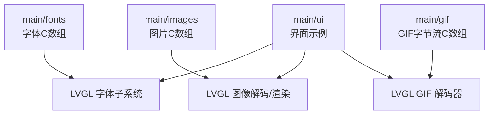
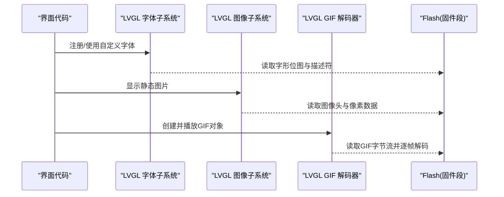
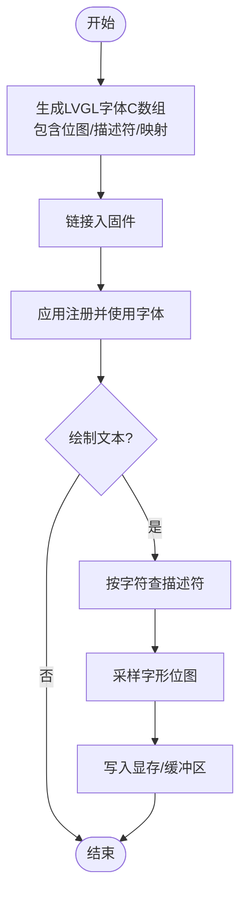
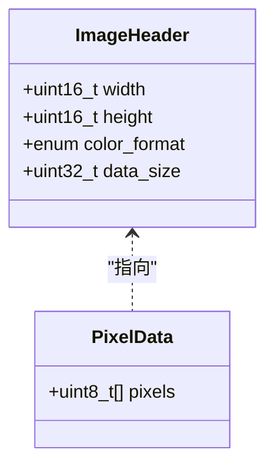
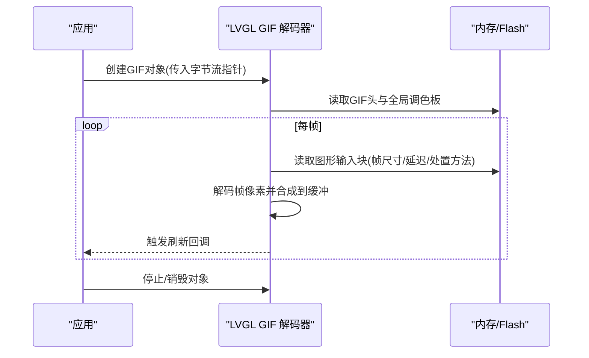
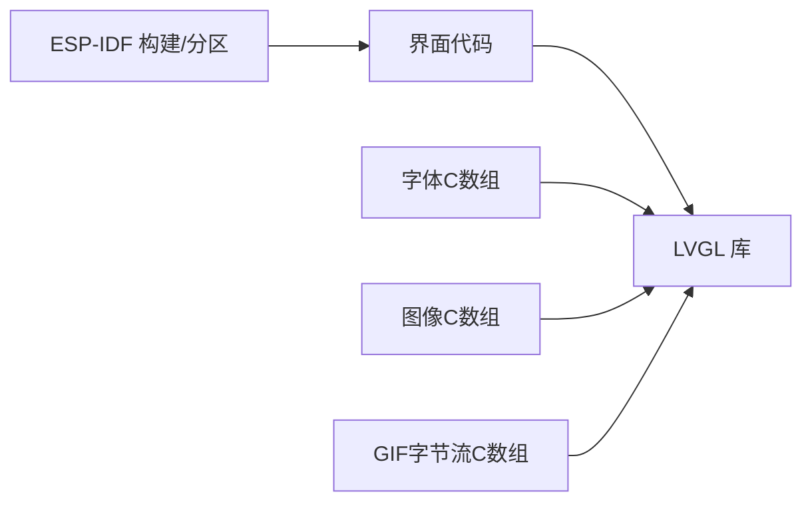

# 资源管理

<cite>
**本文引用的文件**   
- [ui_font_Alibaba_PuHuiTi_Font_14.c](file://ESP32开发板/TK021F2699_ESP32_LVGL_GIF_LED/TK021F2699_ESP32_LVGL_GIF_LED/main/fonts/ui_font_Alibaba_PuHuiTi_Font_14.c)
- [ui_img_1063244380.c](file://ESP32开发板/TK021F2699_ESP32_LVGL_GIF_LED/TK021F2699_ESP32_LVGL_GIF_LED/main/images/ui_img_1063244380.c)
- [crayon_xiao_xin.c](file://ESP32开发板/TK021F2699_ESP32_LVGL_GIF_LED/TK021F2699_ESP32_LVGL_GIF_LED/main/gif/crayon_xiao_xin.c)
- [lvgl_gif_demo.c](file://ESP32开发板/TK021F2699_ESP32_LVGL_GIF_LED/TK021F2699_ESP32_LVGL_GIF_LED/main/ui/lvgl_gif_demo.c)
- [idf_component.yml](file://ESP32开发板/TK021F2699_ESP32_LVGL_GIF_LED/TK021F2699_ESP32_LVGL_GIF_LED/main/idf_component.yml)
- [CMakeLists.txt](file://ESP32开发板/TK021F2699_ESP32_LVGL_GIF_LED/TK021F2699_ESP32_LVGL_GIF_LED/CMakeLists.txt)
- [partitions.csv](file://ESP32开发板/TK021F2699_ESP32_LVGL_GIF_LED/TK021F2699_ESP32_LVGL_GIF_LED/partitions.csv)
</cite>

## 目录
1. [简介](#简介)
2. [项目结构](#项目结构)
3. [核心组件](#核心组件)
4. [架构总览](#架构总览)
5. [详细组件分析](#详细组件分析)
6. [依赖分析](#依赖分析)
7. [性能考虑](#性能考虑)
8. [故障排查指南](#故障排查指南)
9. [结论](#结论)
10. [附录](#附录)

## 简介
本文件面向资源管理系统，聚焦于字体、图像与GIF动画三类资源的生成、压缩、加载与运行时管理机制。文档基于仓库中实际生成的资源文件与LVGL集成方式，给出从工具链到部署的完整流程说明，并提供命名规范、组织策略、缓存与版本管理建议，以及Flash空间利用与访问优化要点。

## 项目结构
本项目将资源按类型分目录存放：
- fonts：由工具生成的LVGL字体C数组（位图+描述表）
- images：由UI工具生成的静态图片C数组（含头信息与像素数据）
- gif：由工具导出的GIF字节流C数组（可直接被LVGL GIF解码器使用）
- ui：示例界面代码，演示如何引用上述资源

图表来源
- [ui_font_Alibaba_PuHuiTi_Font_14.c:1-800](file://ESP32开发板/TK021F2699_ESP32_LVGL_GIF_LED/TK021F2699_ESP32_LVGL_GIF_LED/main/fonts/ui_font_Alibaba_PuHuiTi_Font_14.c#L1-L800)
- [ui_img_1063244380.c:1-61](file://ESP32开发板/TK021F2699_ESP32_LVGL_GIF_LED/TK021F2699_ESP32_LVGL_GIF_LED/main/images/ui_img_1063244380.c#L1-L61)
- [crayon_xiao_xin.c:1-800](file://ESP32开发板/TK021F2699_ESP32_LVGL_GIF_LED/TK021F2699_ESP32_LVGL_GIF_LED/main/gif/crayon_xiao_xin.c#L1-L800)
- [lvgl_gif_demo.c](file://ESP32开发板/TK021F2699_ESP32_LVGL_GIF_LED/TK021F2699_ESP32_LVGL_GIF_LED/main/ui/lvgl_gif_demo.c)

章节来源
- [CMakeLists.txt](file://ESP32开发板/TK021F2699_ESP32_LVGL_GIF_LED/TK021F2699_ESP32_LVGL_GIF_LED/CMakeLists.txt)
- [idf_component.yml](file://ESP32开发板/TK021F2699_ESP32_LVGL_GIF_LED/TK021F2699_ESP32_LVGL_GIF_LED/main/idf_component.yml)

## 核心组件
- 字体资源：以C数组形式内嵌，包含字形位图、描述符与字符映射表，供LVGL直接渲染。
- 图像资源：以C数组形式内嵌，包含图像头信息（宽、高、颜色格式等）与像素数据。
- GIF动画资源：以C数组形式内嵌原始GIF字节流，交由LVGL GIF解码器在运行时解析帧并播放。

章节来源
- [ui_font_Alibaba_PuHuiTi_Font_14.c:1-800](file://ESP32开发板/TK021F2699_ESP32_LVGL_GIF_LED/TK021F2699_ESP32_LVGL_GIF_LED/main/fonts/ui_font_Alibaba_PuHuiTi_Font_14.c#L1-L800)
- [ui_img_1063244380.c:1-61](file://ESP32开发板/TK021F2699_ESP32_LVGL_GIF_LED/TK021F2699_ESP32_LVGL_GIF_LED/main/images/ui_img_1063244380.c#L1-L61)
- [crayon_xiao_xin.c:1-800](file://ESP32开发板/TK021F2699_ESP32_LVGL_GIF_LED/TK021F2699_ESP32_LVGL_GIF_LED/main/gif/crayon_xiao_xin.c#L1-L800)

## 架构总览
资源在编译期由外部工具生成C数组，链接进固件；运行期由LVGL子系统按需读取与解码。

图表来源
- [ui_font_Alibaba_PuHuiTi_Font_14.c:1-800](file://ESP32开发板/TK021F2699_ESP32_LVGL_GIF_LED/TK021F2699_ESP32_LVGL_GIF_LED/main/fonts/ui_font_Alibaba_PuHuiTi_Font_14.c#L1-L800)
- [ui_img_1063244380.c:1-61](file://ESP32开发板/TK021F2699_ESP32_LVGL_GIF_LED/TK021F2699_ESP32_LVGL_GIF_LED/main/images/ui_img_1063244380.c#L1-L61)
- [crayon_xiao_xin.c:1-800](file://ESP32开发板/TK021F2699_ESP32_LVGL_GIF_LED/TK021F2699_ESP32_LVGL_GIF_LED/main/gif/crayon_xiao_xin.c#L1-L800)
- [lvgl_gif_demo.c](file://ESP32开发板/TK021F2699_ESP32_LVGL_GIF_LED/TK021F2699_ESP32_LVGL_GIF_LED/main/ui/lvgl_gif_demo.c)

## 详细组件分析

### 字体资源：生成、嵌入与加载
- 生成方式：通过命令行工具将TTF转换为LVGL字体C数组，输出包含字形位图、描述符与字符映射表。
- 内存布局：字形位图集中存放，描述符数组记录每个字形的宽高、偏移与位图索引；字符映射表提供Unicode到字形ID的映射。
- 加载机制：应用侧注册字体后，LVGL在绘制时根据字符查找描述符并采样位图。

图表来源
- [ui_font_Alibaba_PuHuiTi_Font_14.c:1-800](file://ESP32开发板/TK021F2699_ESP32_LVGL_GIF_LED/TK021F2699_ESP32_LVGL_GIF_LED/main/fonts/ui_font_Alibaba_PuHuiTi_Font_14.c#L1-L800)

章节来源
- [ui_font_Alibaba_PuHuiTi_Font_14.c:1-800](file://ESP32开发板/TK021F2699_ESP32_LVGL_GIF_LED/TK021F2699_ESP32_LVGL_GIF_LED/main/fonts/ui_font_Alibaba_PuHuiTi_Font_14.c#L1-L800)

### 图像资源：格式转换、压缩与内存布局
- 生成方式：由UI工具导出为C数组，包含图像头（宽、高、颜色格式）与像素数据。
- 颜色格式：示例文件采用真彩色带Alpha通道格式，便于透明叠加。
- 内存布局：头部元数据与像素数据分离声明，像素数据通常按行主序连续存放。

图表来源
- [ui_img_1063244380.c:1-61](file://ESP32开发板/TK021F2699_ESP32_LVGL_GIF_LED/TK021F2699_ESP32_LVGL_GIF_LED/main/images/ui_img_1063244380.c#L1-L61)

章节来源
- [ui_img_1063244380.c:1-61](file://ESP32开发板/TK021F2699_ESP32_LVGL_GIF_LED/TK021F2699_ESP32_LVGL_GIF_LED/main/images/ui_img_1063244380.c#L1-L61)

### GIF动画资源：处理流程、帧提取与播放控制
- 生成方式：将GIF原文件转为C数组，保留完整GIF字节流。
- 解码流程：LVGL GIF解码器读取全局调色板、逻辑屏幕描述符与各图形输入块，逐帧解析并合成显示。
- 播放控制：通过LVGL动画对象接口设置循环、延时与回调，实现自动或受控播放。

图表来源
- [crayon_xiao_xin.c:1-800](file://ESP32开发板/TK021F2699_ESP32_LVGL_GIF_LED/TK021F2699_ESP32_LVGL_GIF_LED/main/gif/crayon_xiao_xin.c#L1-L800)
- [lvgl_gif_demo.c](file://ESP32开发板/TK021F2699_ESP32_LVGL_GIF_LED/TK021F2699_ESP32_LVGL_GIF_LED/main/ui/lvgl_gif_demo.c)

章节来源
- [crayon_xiao_xin.c:1-800](file://ESP32开发板/TK021F2699_ESP32_LVGL_GIF_LED/TK021F2699_ESP32_LVGL_GIF_LED/main/gif/crayon_xiao_xin.c#L1-L800)
- [lvgl_gif_demo.c](file://ESP32开发板/TK021F2699_ESP32_LVGL_GIF_LED/TK021F2699_ESP32_LVGL_GIF_LED/main/ui/lvgl_gif_demo.c)

### 资源打包与部署工具链配置
- 组件依赖：通过ESP-IDF组件清单引入LVGL库，确保解码与渲染能力可用。
- 构建系统：顶层CMakeLists用于工程级配置，子模块CMakeLists负责源文件与资源收集。
- 分区表：partitions.csv定义固件与数据分区，影响资源段在Flash中的布局与访问路径。

章节来源
- [idf_component.yml](file://ESP32开发板/TK021F2699_ESP32_LVGL_GIF_LED/TK021F2699_ESP32_LVGL_GIF_LED/main/idf_component.yml)
- [CMakeLists.txt](file://ESP32开发板/TK021F2699_ESP32_LVGL_GIF_LED/TK021F2699_ESP32_LVGL_GIF_LED/CMakeLists.txt)
- [partitions.csv](file://ESP32开发板/TK021F2699_ESP32_LVGL_GIF_LED/TK021F2699_ESP32_LVGL_GIF_LED/partitions.csv)

## 依赖分析
- 组件耦合：界面代码依赖LVGL提供的字体、图像与GIF能力；资源文件仅作为只读数据被链接。
- 外部依赖：LVGL库提供解码与渲染API；ESP-IDF提供构建与分区管理。
- 潜在风险：资源体积过大导致Flash不足；未对齐的数据可能引发访问效率问题。

图表来源
- [idf_component.yml](file://ESP32开发板/TK021F2699_ESP32_LVGL_GIF_LED/TK021F2699_ESP32_LVGL_GIF_LED/main/idf_component.yml)
- [CMakeLists.txt](file://ESP32开发板/TK021F2699_ESP32_LVGL_GIF_LED/TK021F2699_ESP32_LVGL_GIF_LED/CMakeLists.txt)

章节来源
- [idf_component.yml](file://ESP32开发板/TK021F2699_ESP32_LVGL_GIF_LED/TK021F2699_ESP32_LVGL_GIF_LED/main/idf_component.yml)
- [CMakeLists.txt](file://ESP32开发板/TK021F2699_ESP32_LVGL_GIF_LED/TK021F2699_ESP32_LVGL_GIF_LED/CMakeLists.txt)

## 性能考虑
- 字体优化
  - 按需生成：仅包含必要字符集与字号，减少位图体积。
  - 紧凑存储：选择合适BPP与是否启用压缩，权衡RAM与Flash占用。
- 图像优化
  - 颜色格式：优先使用目标平台高效的格式（如RGB565），必要时再使用带Alpha的真彩。
  - 尺寸裁剪：避免超出显示区域的大图，降低带宽与内存压力。
- GIF优化
  - 帧率与分辨率：降低帧数与尺寸可显著减少解码与内存开销。
  - 调色板复用：尽量共用全局调色板，减少重复数据。
- 缓存策略
  - 图像缓存：开启LVGL图像缓存以减少重复解码与拷贝。
  - 字体缓存：对常用字形进行缓存，提高文本渲染速度。
- 内存布局
  - 对齐与常量区：将只读资源置于常量段，提升访问效率与安全性。
  - 堆栈与帧缓冲：预留足够帧缓冲，避免动态分配抖动。

[本节为通用指导，不直接分析具体文件]

## 故障排查指南
- 字体缺失或乱码
  - 检查字符映射范围是否覆盖所需字符集。
  - 确认已正确注册字体且未被覆盖。
- 图像显示异常
  - 核对颜色格式与实际像素数据一致。
  - 检查宽高与步长是否匹配。
- GIF无法播放或卡顿
  - 确认GIF字节流完整且未截断。
  - 调整帧延迟与分辨率，观察CPU与内存占用变化。
- Flash空间不足
  - 评估各资源大小，精简不必要的资源。
  - 检查分区表是否合理划分数据区。

章节来源
- [ui_font_Alibaba_PuHuiTi_Font_14.c:1-800](file://ESP32开发板/TK021F2699_ESP32_LVGL_GIF_LED/TK021F2699_ESP32_LVGL_GIF_LED/main/fonts/ui_font_Alibaba_PuHuiTi_Font_14.c#L1-L800)
- [ui_img_1063244380.c:1-61](file://ESP32开发板/TK021F2699_ESP32_LVGL_GIF_LED/TK021F2699_ESP32_LVGL_GIF_LED/main/images/ui_img_1063244380.c#L1-L61)
- [crayon_xiao_xin.c:1-800](file://ESP32开发板/TK021F2699_ESP32_LVGL_GIF_LED/TK021F2699_ESP32_LVGL_GIF_LED/main/gif/crayon_xiao_xin.c#L1-L800)
- [partitions.csv](file://ESP32开发板/TK021F2699_ESP32_LVGL_GIF_LED/TK021F2699_ESP32_LVGL_GIF_LED/partitions.csv)

## 结论
通过将字体、图像与GIF资源以C数组形式内嵌，并结合LVGL的解码与渲染能力，可在嵌入式平台上高效展示丰富的UI内容。遵循合理的生成与组织规范、实施必要的压缩与缓存策略，并在构建与分区层面做好规划，可在保证体验的同时有效控制资源体积与运行时开销。

[本节为总结性内容，不直接分析具体文件]

## 附录

### 资源组织与命名规范
- 目录组织
  - fonts：按字号与字体家族命名，如“ui_font_<字体名>_<字号>.c”。
  - images：以唯一标识或语义化名称命名，如“ui_img_<主题>_<序号>.c”。
  - gif：以业务含义命名，如“gif_<场景>.c”。
- 命名一致性
  - 文件名与变量名保持一致，便于在界面代码中引用。
  - 资源头注释保留来源与生成参数，便于追溯。

[本节为通用指导，不直接分析具体文件]

### 版本管理与更新机制
- 版本标记
  - 在资源文件头注释中包含版本号与生成时间戳。
  - 在构建产物中注入资源哈希，便于校验完整性。
- 增量更新
  - 将大资源放入独立数据分区，支持OTA替换。
  - 使用最小变更原则，避免频繁全量升级。
- 回滚策略
  - 保留上一版本资源快照，失败时快速回滚。

[本节为通用指导，不直接分析具体文件]

### Flash空间利用与访问优化
- 布局建议
  - 将只读资源置于常量段，减少RAM占用。
  - 对齐边界，避免跨页访问带来的额外开销。
- 访问优化
  - 批量读取与预取，减少随机访问。
  - 使用DMA或硬件加速（若平台支持）搬运像素数据。

[本节为通用指导，不直接分析具体文件]