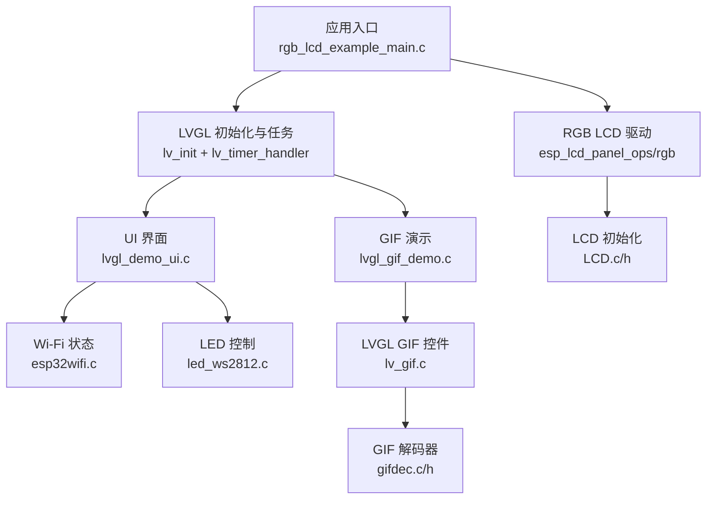
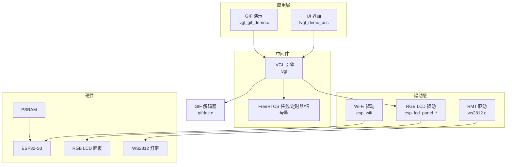
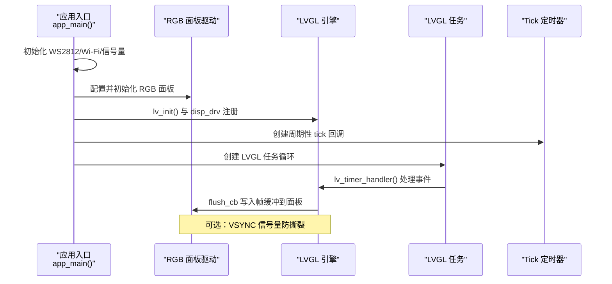
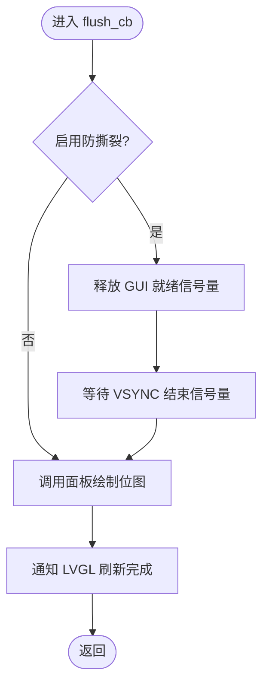
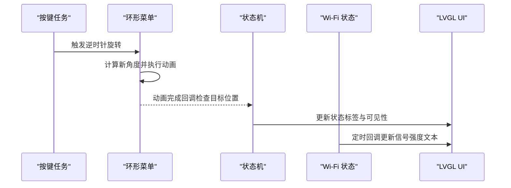
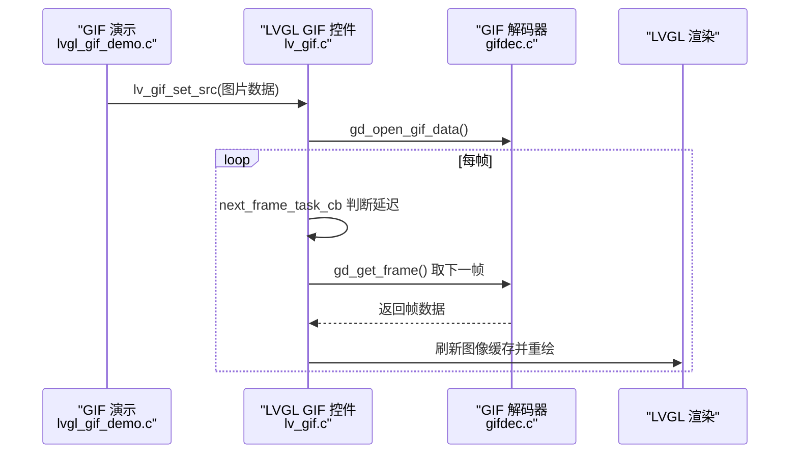
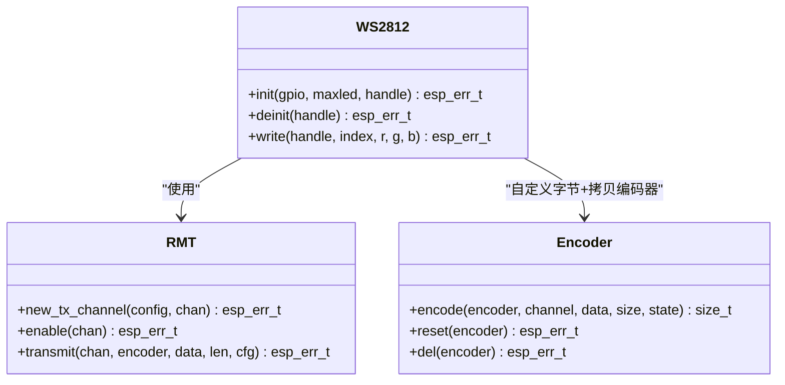
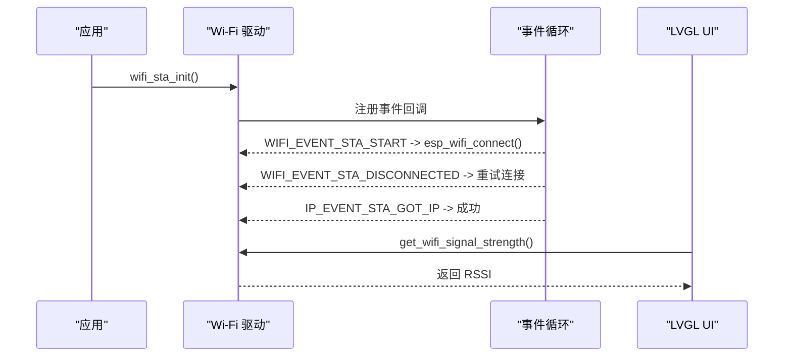
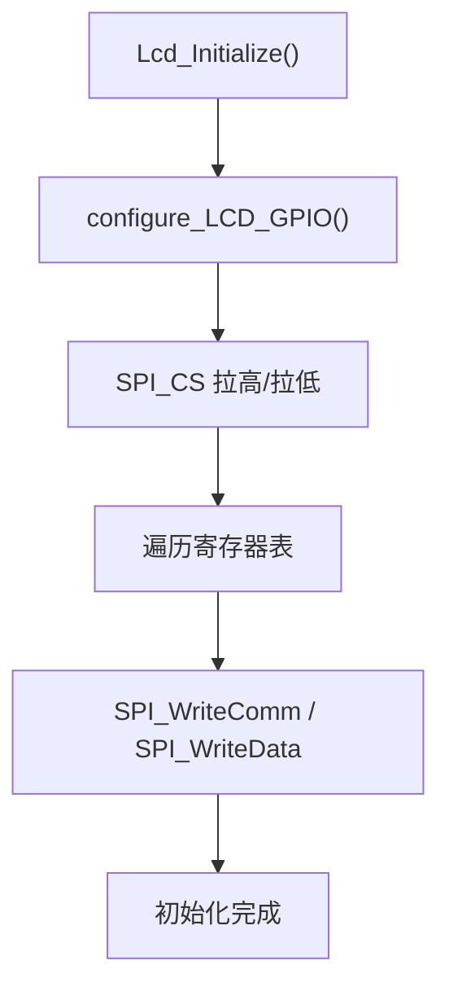
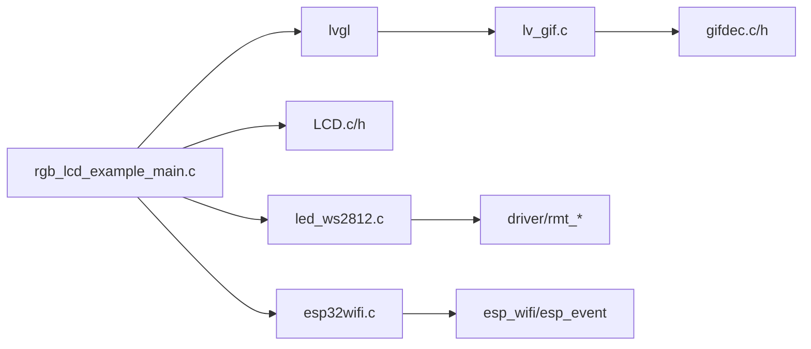

# 项目概述

<cite>
**本文引用的文件**   
- [README.md](file://README.md)
- [CMakeLists.txt](file://ESP32开发板/TK021F2699_ESP32_LVGL_GIF_LED/TK021F2699_ESP32_LVGL_GIF_LED/CMakeLists.txt)
- [idf_component.yml](file://ESP32开发板/TK021F2699_ESP32_LVGL_GIF_LED/TK021F2699_ESP32_LVGL_GIF_LED/main/idf_component.yml)
- [sdkconfig.defaults.esp32s3](file://ESP32开发板/TK021F2699_ESP32_LVGL_GIF_LED/TK021F2699_ESP32_LVGL_GIF_LED/sdkconfig.defaults.esp32s3)
- [rgb_lcd_example_main.c](file://ESP32开发板/TK021F2699_ESP32_LVGL_GIF_LED/TK021F2699_ESP32_LVGL_GIF_LED/main/rgb_lcd_example_main.c)
- [LCD.h](file://ESP32开发板/TK021F2699_ESP32_LVGL_GIF_LED/TK021F2699_ESP32_LVGL_GIF_LED/main/LCD.h)
- [LCD.c](file://ESP32开发板/TK021F2699_ESP32_LVGL_GIF_LED/TK021F2699_ESP32_LVGL_GIF_LED/main/LCD.c)
- [lvgl_demo_ui.c](file://ESP32开发板/TK021F2699_ESP32_LVGL_GIF_LED/TK021F2699_ESP32_LVGL_GIF_LED/main/ui/lvgl_demo_ui.c)
- [lvgl_gif_demo.c](file://ESP32开发板/TK021F2699_ESP32_LVGL_GIF_LED/TK021F2699_ESP32_LVGL_GIF_LED/main/ui/lvgl_gif_demo.c)
- [led_ws2812.h](file://ESP32开发板/TK021F2699_ESP32_LVGL_GIF_LED/TK021F2699_ESP32_LVGL_GIF_LED/main/led_ws2812/led_ws2812.h)
- [led_ws2812.c](file://ESP32开发板/TK021F2699_ESP32_LVGL_GIF_LED/TK021F2699_ESP32_LVGL_GIF_LED/main/led_ws2812/led_ws2812.c)
- [esp32wifi.h](file://ESP32开发板/TK021F2699_ESP32_LVGL_GIF_LED/TK021F2699_ESP32_LVGL_GIF_LED/main/wifi/esp32wifi.h)
- [esp32wifi.c](file://ESP32开发板/TK021F2699_ESP32_LVGL_GIF_LED/TK021F2699_ESP32_LVGL_GIF_LED/main/wifi/esp32wifi.c)
- [gifdec.h](file://ESP32开发板/TK021F2699_ESP32_LVGL_GIF_LED/TK021F2699_ESP32_LVGL_GIF_LED/managed_components/lvgl__lvgl/src/extra/libs/gif/gifdec.h)
- [gifdec.c](file://ESP32开发板/TK021F2699_ESP32_LVGL_GIF_LED/TK021F2699_ESP32_LVGL_GIF_LED/managed_components/lvgl__lvgl/src/extra/libs/gif/gifdec.c)
- [lv_gif.c](file://ESP32开发板/TK021F2699_ESP32_LVGL_GIF_LED/TK021F2699_ESP32_LVGL_GIF_LED/managed_components/lvgl__lvgl/src/extra/libs/gif/lv_gif.c)
</cite>

## 目录
1. [简介](#简介)
2. [项目结构](#项目结构)
3. [核心组件](#核心组件)
4. [架构总览](#架构总览)
5. [详细组件分析](#详细组件分析)
6. [依赖关系分析](#依赖关系分析)
7. [性能与资源考量](#性能与资源考量)
8. [故障排查指南](#故障排查指南)
9. [结论](#结论)
10. [附录：硬件要求与配置要点](#附录硬件要求与配置要点)

## 简介
本项目是一个基于 ESP32-S3 的嵌入式图形界面应用，面向 RGB LCD 显示、LVGL 图形库集成、GIF 动画播放以及 WS2812 LED 控制等核心功能。系统以 ESP-IDF 为开发框架，FreeRTOS 提供任务调度，LVGL 负责 UI 渲染与交互，结合 ESP32 的 RGB 面板驱动与 PSRAM 帧缓冲，实现流畅的 480x480 彩色界面；同时通过 RMT 外设精确时序驱动 WS2812 灯带，配合 Wi-Fi 模块展示信号强度等信息，形成一套完整的“屏+动效+灯光+联网”演示平台。

## 项目结构
项目采用分层组织方式：
- 应用入口与系统初始化：main/rgb_lcd_example_main.c
- 显示驱动与 LCD 初始化：main/LCD.c / main/LCD.h
- LVGL 界面与交互：main/ui/lvgl_demo_ui.c、main/ui/lvgl_gif_demo.c
- 外设驱动（WS2812）：main/led_ws2812/led_ws2812.c / led_ws2812.h
- Wi-Fi 网络栈封装：main/wifi/esp32wifi.c / esp32wifi.h
- 构建与依赖：CMakeLists.txt、main/idf_component.yml、sdkconfig.defaults.esp32s3
- LVGL GIF 解码与控件：managed_components/lvgl__lvgl/src/extra/libs/gif/*

图表来源
- [rgb_lcd_example_main.c:150-303](file://ESP32开发板/TK021F2699_ESP32_LVGL_GIF_LED/TK021F2699_ESP32_LVGL_GIF_LED/main/rgb_lcd_example_main.c#L150-L303)
- [lcd.c:205-219](file://ESP32开发板/TK021F2699_ESP32_LVGL_GIF_LED/TK021F2699_ESP32_LVGL_GIF_LED/main/LCD.c#L205-L219)
- [lvgl_demo_ui.c:297-497](file://ESP32开发板/TK021F2699_ESP32_LVGL_GIF_LED/TK021F2699_ESP32_LVGL_GIF_LED/main/ui/lvgl_demo_ui.c#L297-L497)
- [lvgl_gif_demo.c:12-47](file://ESP32开发板/TK021F2699_ESP32_LVGL_GIF_LED/TK021F2699_ESP32_LVGL_GIF_LED/main/ui/lvgl_gif_demo.c#L12-L47)
- [led_ws2812.c:179-252](file://ESP32开发板/TK021F2699_ESP32_LVGL_GIF_LED/TK021F2699_ESP32_LVGL_GIF_LED/main/led_ws2812/led_ws2812.c#L179-L252)
- [esp32wifi.c:46-109](file://ESP32开发板/TK021F2699_ESP32_LVGL_GIF_LED/TK021F2699_ESP32_LVGL_GIF_LED/main/wifi/esp32wifi.c#L46-L109)
- [lv_gif.c:49-154](file://ESP32开发板/TK021F2699_ESP32_LVGL_GIF_LED/TK021F2699_ESP32_LVGL_GIF_LED/managed_components/lvgl__lvgl/src/extra/libs/gif/lv_gif.c#L49-L154)
- [gifdec.c:78-169](file://ESP32开发板/TK021F2699_ESP32_LVGL_GIF_LED/TK021F2699_ESP32_LVGL_GIF_LED/managed_components/lvgl__lvgl/src/extra/libs/gif/gifdec.c#L78-L169)

章节来源
- [CMakeLists.txt:1-5](file://ESP32开发板/TK021F2699_ESP32_LVGL_GIF_LED/TK021F2699_ESP32_LVGL_GIF_LED/CMakeLists.txt#L1-L5)
- [idf_component.yml:1-4](file://ESP32开发板/TK021F2699_ESP32_LVGL_GIF_LED/TK021F2699_ESP32_LVGL_GIF_LED/main/idf_component.yml#L1-L4)
- [sdkconfig.defaults.esp32s3:1-9](file://ESP32开发板/TK021F2699_ESP32_LVGL_GIF_LED/TK021F2699_ESP32_LVGL_GIF_LED/sdkconfig.defaults.esp32s3#L1-L9)

## 核心组件
- 应用主流程与系统初始化
  - 初始化 WS2812、Wi-Fi、创建互斥量与信号量、配置 RGB LCD 面板、注册 LVGL 刷新回调、启动 LVGL 任务与定时器、加载 UI/GIF 演示。
- RGB LCD 与 LVGL 集成
  - 使用 ESP-IDF 的 RGB 面板驱动，分配帧缓冲（支持双缓冲或 PSRAM），注册 flush 回调将 LVGL 绘制缓冲区写入面板，利用 VSYNC 事件避免撕裂。
- LVGL 界面与动画
  - 环形菜单、图标按钮、状态标签、Wi-Fi 信号强度轮询更新、GIF 控件播放。
- WS2812 LED 控制
  - 基于 RMT 自定义编码器，按 WS2812 时序发送 GRB 数据，支持跑马灯效果与开关控制。
- Wi-Fi 网络
  - STA 模式连接、事件回调处理、获取 RSSI 信号强度。
- GIF 解码与播放
  - LVGL GIF 控件调用 gifdec 解码器，逐帧渲染并刷新图像缓存。

章节来源
- [rgb_lcd_example_main.c:150-303](file://ESP32开发板/TK021F2699_ESP32_LVGL_GIF_LED/TK021F2699_ESP32_LVGL_GIF_LED/main/rgb_lcd_example_main.c#L150-L303)
- [lvgl_demo_ui.c:297-497](file://ESP32开发板/TK021F2699_ESP32_LVGL_GIF_LED/TK021F2699_ESP32_LVGL_GIF_LED/main/ui/lvgl_demo_ui.c#L297-L497)
- [led_ws2812.c:179-252](file://ESP32开发板/TK021F2699_ESP32_LVGL_GIF_LED/TK021F2699_ESP32_LVGL_GIF_LED/main/led_ws2812/led_ws2812.c#L179-L252)
- [esp32wifi.c:46-109](file://ESP32开发板/TK021F2699_ESP32_LVGL_GIF_LED/TK021F2699_ESP32_LVGL_GIF_LED/main/wifi/esp32wifi.c#L46-L109)
- [lv_gif.c:49-154](file://ESP32开发板/TK021F2699_ESP32_LVGL_GIF_LED/TK021F2699_ESP32_LVGL_GIF_LED/managed_components/lvgl__lvgl/src/extra/libs/gif/lv_gif.c#L49-L154)

## 架构总览
系统由“应用层（UI/业务）—中间件（LVGL/FreeRTOS）—驱动层（RGB LCD/RMT/Wi-Fi）—硬件（ESP32-S3/PSRAM/RGB 屏/WS2812）”构成。LVGL 作为 UI 引擎，通过 flush 回调将绘制结果推送到 RGB 面板；GIF 控件在 LVGL 定时器中驱动 gifdec 解码器逐帧渲染；WS2812 通过 RMT 精确时序输出；Wi-Fi 事件回调更新 UI 状态。

图表来源
- [rgb_lcd_example_main.c:150-303](file://ESP32开发板/TK021F2699_ESP32_LVGL_GIF_LED/TK021F2699_ESP32_LVGL_GIF_LED/main/rgb_lcd_example_main.c#L150-L303)
- [lvgl_demo_ui.c:297-497](file://ESP32开发板/TK021F2699_ESP32_LVGL_GIF_LED/TK021F2699_ESP32_LVGL_GIF_LED/main/ui/lvgl_demo_ui.c#L297-L497)
- [led_ws2812.c:179-252](file://ESP32开发板/TK021F2699_ESP32_LVGL_GIF_LED/TK021F2699_ESP32_LVGL_GIF_LED/main/led_ws2812/led_ws2812.c#L179-L252)
- [esp32wifi.c:46-109](file://ESP32开发板/TK021F2699_ESP32_LVGL_GIF_LED/TK021F2699_ESP32_LVGL_GIF_LED/main/wifi/esp32wifi.c#L46-L109)
- [gifdec.c:78-169](file://ESP32开发板/TK021F2699_ESP32_LVGL_GIF_LED/TK021F2699_ESP32_LVGL_GIF_LED/managed_components/lvgl__lvgl/src/extra/libs/gif/gifdec.c#L78-L169)

## 详细组件分析

### 应用入口与系统初始化（rgb_lcd_example_main.c）
- 初始化 WS2812、Wi-Fi、创建互斥量/信号量用于 LVGL 线程安全与 VSYNC 同步。
- 配置 RGB 面板参数（像素时钟、分辨率、时序、帧缓冲位置）。
- 注册 VSYNC 回调与 LVGL flush 回调，完成从 LVGL 到面板的数据搬运。
- 初始化 LVGL、分配绘制缓冲、注册显示驱动、创建 LVGL 任务与 tick 定时器。
- 加载 UI 或 GIF 演示。

图表来源
- [rgb_lcd_example_main.c:150-303](file://ESP32开发板/TK021F2699_ESP32_LVGL_GIF_LED/TK021F2699_ESP32_LVGL_GIF_LED/main/rgb_lcd_example_main.c#L150-L303)

章节来源
- [rgb_lcd_example_main.c:150-303](file://ESP32开发板/TK021F2699_ESP32_LVGL_GIF_LED/TK021F2699_ESP32_LVGL_GIF_LED/main/rgb_lcd_example_main.c#L150-L303)

### RGB LCD 与 LVGL 集成
- 使用 esp_lcd_new_rgb_panel 创建面板句柄，配置数据宽度、时序、帧缓冲策略（双缓冲或 PSRAM）。
- 注册 on_vsync 回调，配合信号量实现无撕裂刷新。
- LVGL flush_cb 中调用 esp_lcd_panel_draw_bitmap 将绘制区域复制到面板。

图表来源
- [rgb_lcd_example_main.c:95-109](file://ESP32开发板/TK021F2699_ESP32_LVGL_GIF_LED/TK021F2699_ESP32_LVGL_GIF_LED/main/rgb_lcd_example_main.c#L95-L109)
- [rgb_lcd_example_main.c:84-93](file://ESP32开发板/TK021F2699_ESP32_LVGL_GIF_LED/TK021F2699_ESP32_LVGL_GIF_LED/main/rgb_lcd_example_main.c#L84-L93)

章节来源
- [rgb_lcd_example_main.c:177-244](file://ESP32开发板/TK021F2699_ESP32_LVGL_GIF_LED/TK021F2699_ESP32_LVGL_GIF_LED/main/rgb_lcd_example_main.c#L177-L244)

### LVGL 界面与交互（lvgl_demo_ui.c）
- 构建环形菜单项与图标按钮，设置初始角度与坐标。
- 按键任务检测下降沿触发旋转动画，动画完成后检测目标位置并切换状态。
- 定时回调读取 Wi-Fi 信号强度并更新 UI 文本。
- 创建 GIF 控件并居中显示。

图表来源
- [lvgl_demo_ui.c:263-279](file://ESP32开发板/TK021F2699_ESP32_LVGL_GIF_LED/TK021F2699_ESP32_LVGL_GIF_LED/main/ui/lvgl_demo_ui.c#L263-L279)
- [lvgl_demo_ui.c:248-260](file://ESP32开发板/TK021F2699_ESP32_LVGL_GIF_LED/TK021F2699_ESP32_LVGL_GIF_LED/main/ui/lvgl_demo_ui.c#L248-L260)
- [lvgl_demo_ui.c:297-497](file://ESP32开发板/TK021F2699_ESP32_LVGL_GIF_LED/TK021F2699_ESP32_LVGL_GIF_LED/main/ui/lvgl_demo_ui.c#L297-L497)

章节来源
- [lvgl_demo_ui.c:297-497](file://ESP32开发板/TK021F2699_ESP32_LVGL_GIF_LED/TK021F2699_ESP32_LVGL_GIF_LED/main/ui/lvgl_demo_ui.c#L297-L497)

### GIF 动画播放（lvgl_gif_demo.c + lv_gif.c + gifdec.c）
- 应用层创建 lv_gif 对象并设置源（变量或文件）。
- LVGL GIF 控件内部维护定时器，根据帧延迟推进下一帧。
- gifdec 解析 GIF 头、全局调色板、图像块，渲染帧到画布，控件刷新图像缓存并重绘。

图表来源
- [lvgl_gif_demo.c:12-47](file://ESP32开发板/TK021F2699_ESP32_LVGL_GIF_LED/TK021F2699_ESP32_LVGL_GIF_LED/main/ui/lvgl_gif_demo.c#L12-L47)
- [lv_gif.c:49-154](file://ESP32开发板/TK021F2699_ESP32_LVGL_GIF_LED/TK021F2699_ESP32_LVGL_GIF_LED/managed_components/lvgl__lvgl/src/extra/libs/gif/lv_gif.c#L49-L154)
- [gifdec.c:78-169](file://ESP32开发板/TK021F2699_ESP32_LVGL_GIF_LED/TK021F2699_ESP32_LVGL_GIF_LED/managed_components/lvgl__lvgl/src/extra/libs/gif/gifdec.c#L78-L169)

章节来源
- [lv_gif.c:49-154](file://ESP32开发板/TK021F2699_ESP32_LVGL_GIF_LED/TK021F2699_ESP32_LVGL_GIF_LED/managed_components/lvgl__lvgl/src/extra/libs/gif/lv_gif.c#L49-L154)
- [gifdec.c:78-169](file://ESP32开发板/TK021F2699_ESP32_LVGL_GIF_LED/TK021F2699_ESP32_LVGL_GIF_LED/managed_components/lvgl__lvgl/src/extra/libs/gif/gifdec.c#L78-L169)

### WS2812 LED 控制（led_ws2812.c）
- 使用 RMT TX 通道与自定义编码器，按 WS2812 时序（T0H/T1H/T0L/T1L）编码 GRB 数据。
- 初始化时分配 RGB 缓冲、创建编码器、使能通道；写入时填充缓冲并通过 rmt_transmit 发送。
- UI 中可触发跑马灯任务或关闭所有 LED。

图表来源
- [led_ws2812.c:179-252](file://ESP32开发板/TK021F2699_ESP32_LVGL_GIF_LED/TK021F2699_ESP32_LVGL_GIF_LED/main/led_ws2812/led_ws2812.c#L179-L252)
- [led_ws2812.h:15-46](file://ESP32开发板/TK021F2699_ESP32_LVGL_GIF_LED/TK021F2699_ESP32_LVGL_GIF_LED/main/led_ws2812/led_ws2812.h#L15-L46)

章节来源
- [led_ws2812.c:179-252](file://ESP32开发板/TK021F2699_ESP32_LVGL_GIF_LED/TK021F2699_ESP32_LVGL_GIF_LED/main/led_ws2812/led_ws2812.c#L179-L252)

### Wi-Fi 网络（esp32wifi.c）
- 初始化 NVS、netif、事件循环，创建默认 STA 接口。
- 注册 WIFI_EVENT 与 IP_EVENT 回调，自动重连与日志记录。
- 提供 get_wifi_signal_strength 获取当前 AP 的 RSSI。

图表来源
- [esp32wifi.c:46-109](file://ESP32开发板/TK021F2699_ESP32_LVGL_GIF_LED/TK021F2699_ESP32_LVGL_GIF_LED/main/wifi/esp32wifi.c#L46-L109)

章节来源
- [esp32wifi.c:46-109](file://ESP32开发板/TK021F2699_ESP32_LVGL_GIF_LED/TK021F2699_ESP32_LVGL_GIF_LED/main/wifi/esp32wifi.c#L46-L109)

### LCD 初始化（LCD.c / LCD.h）
- 配置 SPI 相关 GPIO（CS/SCK/SDA），提供写命令/数据函数。
- 通过寄存器表初始化 LCD 控制器（包括延时与序列）。
- 对外暴露 Lcd_Initialize 供主流程调用。

图表来源
- [LCD.c:205-219](file://ESP32开发板/TK021F2699_ESP32_LVGL_GIF_LED/TK021F2699_ESP32_LVGL_GIF_LED/main/LCD.c#L205-L219)
- [LCD.c:186-204](file://ESP32开发板/TK021F2699_ESP32_LVGL_GIF_LED/TK021F2699_ESP32_LVGL_GIF_LED/main/LCD.c#L186-L204)

章节来源
- [LCD.c:205-219](file://ESP32开发板/TK021F2699_ESP32_LVGL_GIF_LED/TK021F2699_ESP32_LVGL_GIF_LED/main/LCD.c#L205-L219)

## 依赖关系分析
- 构建系统与依赖
  - 顶层 CMakeLists 引入 ESP-IDF 工程模板，定义项目名称。
  - idf_component.yml 声明依赖 ESP-IDF 版本与 LVGL 组件。
  - sdkconfig.defaults.esp32s3 开启 PSRAM 及优化选项以提升 PCLK 与指令/只读数据访问性能。
- 组件耦合
  - 应用入口依赖 LCD 初始化、LVGL、WS2812、Wi-Fi。
  - LVGL 依赖 GIF 控件与解码器。
  - WS2812 依赖 RMT 驱动与自定义编码器。
  - Wi-Fi 依赖 ESP-IDF 网络栈与事件机制。

图表来源
- [idf_component.yml:1-4](file://ESP32开发板/TK021F2699_ESP32_LVGL_GIF_LED/TK021F2699_ESP32_LVGL_GIF_LED/main/idf_component.yml#L1-L4)
- [sdkconfig.defaults.esp32s3:1-9](file://ESP32开发板/TK021F2699_ESP32_LVGL_GIF_LED/TK021F2699_ESP32_LVGL_GIF_LED/sdkconfig.defaults.esp32s3#L1-L9)
- [CMakeLists.txt:1-5](file://ESP32开发板/TK021F2699_ESP32_LVGL_GIF_LED/TK021F2699_ESP32_LVGL_GIF_LED/CMakeLists.txt#L1-L5)

章节来源
- [idf_component.yml:1-4](file://ESP32开发板/TK021F2699_ESP32_LVGL_GIF_LED/TK021F2699_ESP32_LVGL_GIF_LED/main/idf_component.yml#L1-L4)
- [sdkconfig.defaults.esp32s3:1-9](file://ESP32开发板/TK021F2699_ESP32_LVGL_GIF_LED/TK021F2699_ESP32_LVGL_GIF_LED/sdkconfig.defaults.esp32s3#L1-L9)

## 性能与资源考量
- 帧缓冲与内存
  - 支持双缓冲或 PSRAM 分配，减少 CPU 占用并提升吞吐；PSRAM 配置开启指令与只读数据预取有助于提高 PCLK 频率下的稳定性。
- 刷新与撕裂防护
  - 通过 VSYNC 事件与信号量协调 LVGL 刷新，避免画面撕裂。
- 动画与解码开销
  - GIF 解码与逐帧渲染对 CPU 有一定压力，建议控制 GIF 尺寸与帧率，必要时降低刷新频率或减少同时运行的动画数量。
- LED 控制
  - RMT 硬件时序保证 WS2812 波形精度，但频繁传输会占用总线，应合理设计任务周期与批量更新策略。

[本节为通用指导，不直接分析具体文件]

## 故障排查指南
- 屏幕无显示或花屏
  - 检查 RGB 面板引脚与时序配置是否正确，确认帧缓冲是否成功分配（PSRAM/双缓冲）。
  - 验证 LVGL flush 回调是否被调用，esp_lcd_panel_draw_bitmap 返回值。
- 画面撕裂
  - 启用 VSYNC 信号量同步，确保 GUI 就绪与 VSYNC 结束配对正确。
- GIF 无法播放或卡顿
  - 确认 GIF 数据源类型（变量/文件）与路径正确；检查 gifdec 打开与帧获取是否成功；适当降低帧率或分辨率。
- WS2812 颜色异常或不亮
  - 检查 GPIO 编号与电源供电；确认 GRB 顺序与亮度值范围；避免高频连续写入导致总线拥塞。
- Wi-Fi 无法连接或信号强度读取失败
  - 检查 SSID/密码配置与路由器兼容性；查看事件回调日志；确认 esp_wifi_sta_get_ap_info 返回值。

章节来源
- [rgb_lcd_example_main.c:150-303](file://ESP32开发板/TK021F2699_ESP32_LVGL_GIF_LED/TK021F2699_ESP32_LVGL_GIF_LED/main/rgb_lcd_example_main.c#L150-L303)
- [lv_gif.c:49-154](file://ESP32开发板/TK021F2699_ESP32_LVGL_GIF_LED/TK021F2699_ESP32_LVGL_GIF_LED/managed_components/lvgl__lvgl/src/extra/libs/gif/lv_gif.c#L49-L154)
- [led_ws2812.c:179-252](file://ESP32开发板/TK021F2699_ESP32_LVGL_GIF_LED/TK021F2699_ESP32_LVGL_GIF_LED/main/led_ws2812/led_ws2812.c#L179-L252)
- [esp32wifi.c:46-109](file://ESP32开发板/TK021F2699_ESP32_LVGL_GIF_LED/TK021F2699_ESP32_LVGL_GIF_LED/main/wifi/esp32wifi.c#L46-L109)

## 结论
本项目以 ESP32-S3 为核心，整合了 RGB LCD、LVGL、GIF 解码与 WS2812 控制，展示了嵌入式设备在图形界面与多媒体方面的能力。通过合理的内存管理、VSYNC 同步与 RMT 时序控制，系统在有限资源下实现了流畅的 UI 与动画效果。Wi-Fi 集成进一步增强了交互性与信息展示能力，适合用于智能终端原型、教育演示与快速验证场景。

[本节为总结性内容，不直接分析具体文件]

## 附录：硬件要求与配置要点
- 硬件要求
  - ESP32-S3 开发板（支持 PSRAM）
  - RGB LCD 面板（480x480，RGB565 并行接口）
  - WS2812 灯带（GPIO 控制）
  - 外部 Wi-Fi 天线（内置）
- 关键配置
  - PSRAM 启用与速度配置（octal mode、80MHz）
  - LVGL 组件版本与 ESP-IDF 最低版本约束
  - RGB 面板时序参数（像素时钟、前后肩、脉宽）
  - 帧缓冲策略（双缓冲 vs PSRAM）

章节来源
- [sdkconfig.defaults.esp32s3:1-9](file://ESP32开发板/TK021F2699_ESP32_LVGL_GIF_LED/TK021F2699_ESP32_LVGL_GIF_LED/sdkconfig.defaults.esp32s3#L1-L9)
- [idf_component.yml:1-4](file://ESP32开发板/TK021F2699_ESP32_LVGL_GIF_LED/TK021F2699_ESP32_LVGL_GIF_LED/main/idf_component.yml#L1-L4)
- [rgb_lcd_example_main.c:28-71](file://ESP32开发板/TK021F2699_ESP32_LVGL_GIF_LED/TK021F2699_ESP32_LVGL_GIF_LED/main/rgb_lcd_example_main.c#L28-L71)