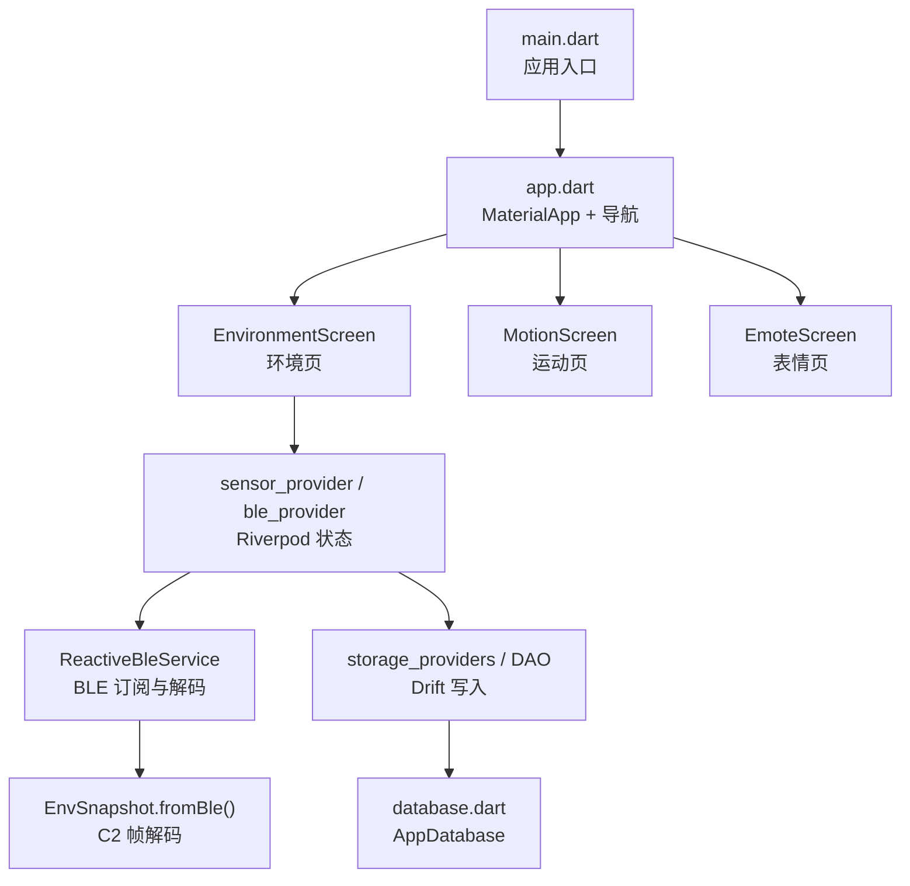
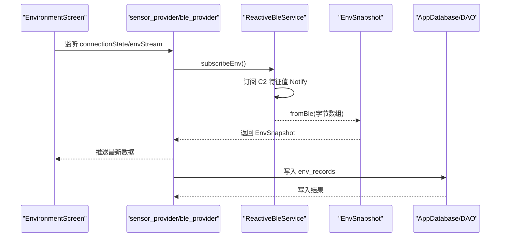
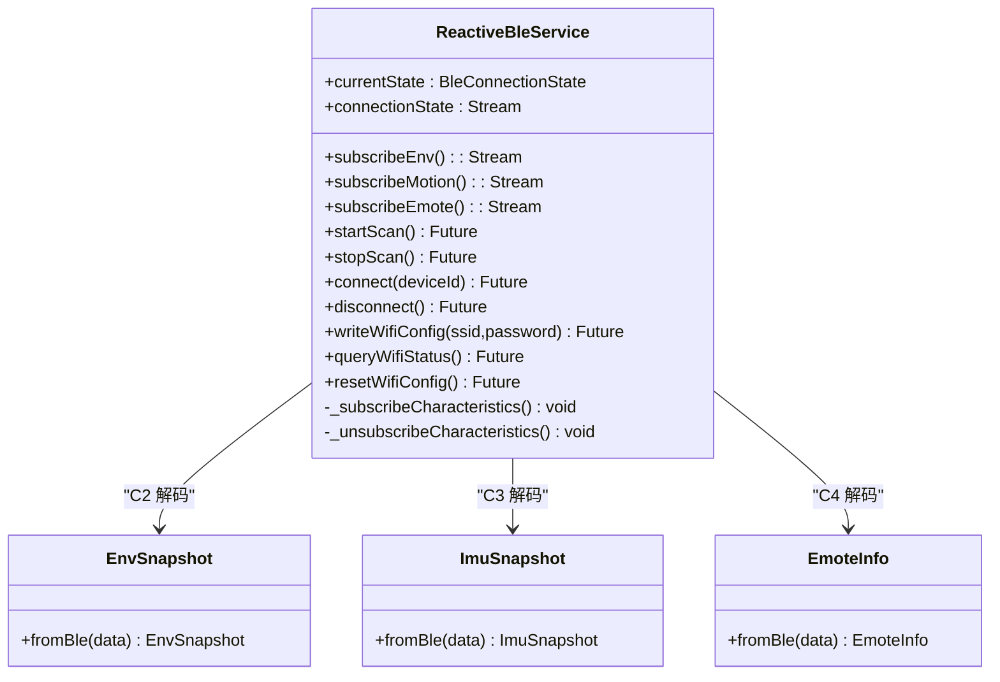
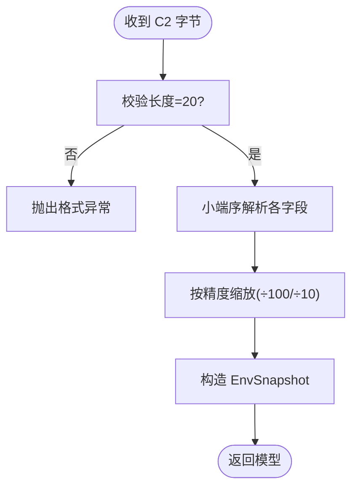
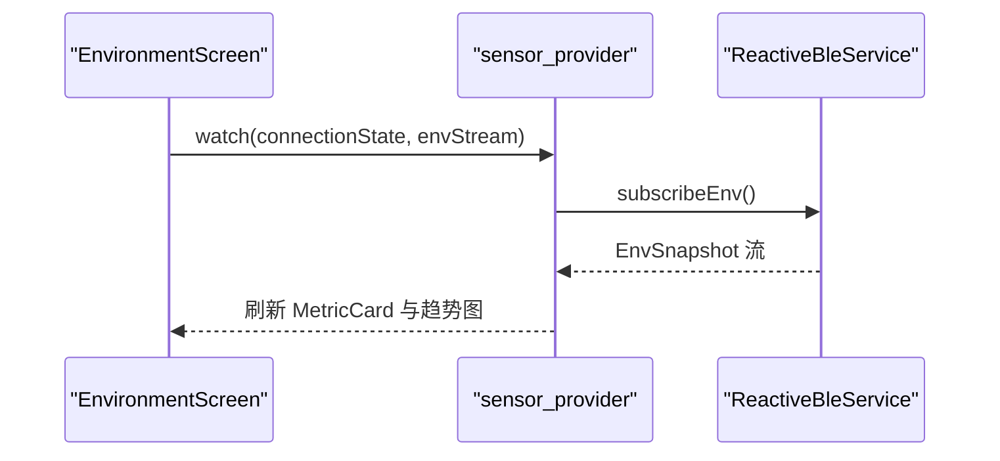
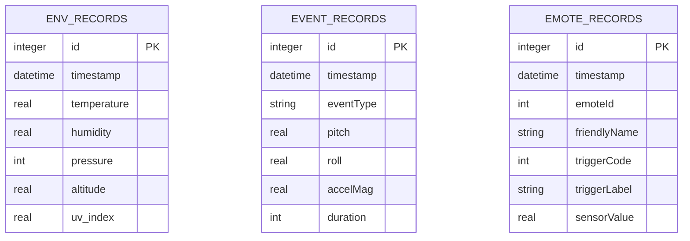
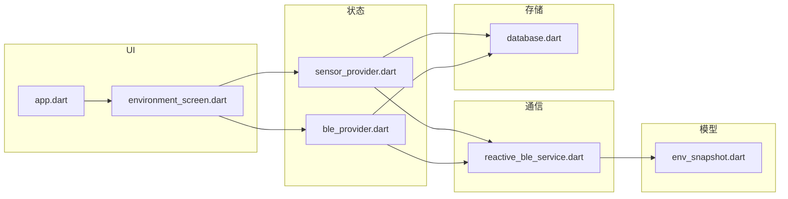

# Flutter仪表板应用

<cite>
**本文引用的文件**   
- [README.md](file://README.md)
- [pubspec.yaml](file://PathFinder_Dashboard/pubspec.yaml)
- [main.dart](file://PathFinder_Dashboard/lib/main.dart)
- [app.dart](file://PathFinder_Dashboard/lib/app/app.dart)
- [reactive_ble_service.dart](file://PathFinder_Dashboard/lib/core/ble/reactive_ble_service.dart)
- [env_snapshot.dart](file://PathFinder_Dashboard/lib/shared/models/env_snapshot.dart)
- [environment_screen.dart](file://PathFinder_Dashboard/lib/features/environment/environment_screen.dart)
- [database.dart](file://PathFinder_Dashboard/lib/core/storage/database.dart)
- [2026-07-12-pathfinder-dashboard-flutter-design.md](file://docs/superpowers/specs/2026-07-12-pathfinder-dashboard-flutter-design.md)
</cite>

## 目录
1. [简介](#简介)
2. [项目结构](#项目结构)
3. [核心组件](#核心组件)
4. [架构总览](#架构总览)
5. [详细组件分析](#详细组件分析)
6. [依赖关系分析](#依赖关系分析)
7. [性能考量](#性能考量)
8. [故障排查指南](#故障排查指南)
9. [结论](#结论)
10. [附录](#附录)

## 简介
本项目为 PathFinder_LCD 的 Flutter 端仪表盘应用（PathFinder_Dashboard），用于通过 BLE 连接 ESP32-S3 车载表情终端，实时采集并可视化环境传感器数据、IMU 运动数据与表情状态，并提供本地历史存储与导出能力。应用采用分层架构（app/core/features/shared），使用 Riverpod 进行状态管理，Drift SQLite 作为持久化层，flutter_reactive_ble 实现 BLE 通信，fl_chart 负责图表渲染。

## 项目结构
- 入口与根应用：main.dart 启动 ProviderScope 并运行 PathfinderApp；app.dart 定义底部导航与页面容器。
- 核心能力：core/ble 提供 BLE 服务接口与真实实现；core/storage 提供 Drift 数据库与 DAO。
- 功能模块：features/ 包含环境、运动、表情、历史等页面。
- 共享层：shared/models 定义数据模型；shared/providers 暴露流式状态；shared/widgets 提供通用 UI 组件。
- 资源与配置：assets/emotes 存放表情动画；pubspec.yaml 声明依赖与资源。

图示来源
- [main.dart:1-8](file://PathFinder_Dashboard/lib/main.dart#L1-L8)
- [app.dart:1-81](file://PathFinder_Dashboard/lib/app/app.dart#L1-L81)
- [environment_screen.dart:1-202](file://PathFinder_Dashboard/lib/features/environment/environment_screen.dart#L1-L202)
- [reactive_ble_service.dart:1-272](file://PathFinder_Dashboard/lib/core/ble/reactive_ble_service.dart#L1-L272)
- [env_snapshot.dart:1-54](file://PathFinder_Dashboard/lib/shared/models/env_snapshot.dart#L1-L54)
- [database.dart:1-31](file://PathFinder_Dashboard/lib/core/storage/database.dart#L1-L31)

章节来源
- [pubspec.yaml:1-37](file://PathFinder_Dashboard/pubspec.yaml#L1-L37)
- [main.dart:1-8](file://PathFinder_Dashboard/lib/main.dart#L1-L8)
- [app.dart:1-81](file://PathFinder_Dashboard/lib/app/app.dart#L1-L81)

## 核心组件
- BLE 通信层
  - ReactiveBleService：封装扫描、连接、断开、特征值订阅与 Wi-Fi 配网写入；将原始字节流解码为领域模型并通过 Stream 广播。
  - BleServiceInterface：抽象 BLE 能力，便于 Mock 替换。
- 数据模型
  - EnvSnapshot：从 BLE C2 帧解析温度、湿度、气压、海拔、UV 指数；提供 mock 工厂方法。
  - ImuSnapshot、EmoteInfo：对应 C3/C4 帧的结构体映射与解析。
- 状态管理
  - sensor_provider / ble_provider：基于 Riverpod 暴露 connectionState、envStream、imuStream、emoteStream 等，供 UI 消费。
- 数据持久层
  - AppDatabase：Drift ORM 初始化、WAL 模式、表结构由 tables.dart 定义，DAO 在 dao_env.dart、dao_event.dart、dao_emote.dart。
- UI 展示
  - EnvironmentScreen：展示当前环境与趋势图；根据阈值动态配色。
  - MotionScreen、EmoteScreen、HistoryScreen：分别展示 IMU 波形、表情映射与历史统计。

章节来源
- [reactive_ble_service.dart:1-272](file://PathFinder_Dashboard/lib/core/ble/reactive_ble_service.dart#L1-L272)
- [env_snapshot.dart:1-54](file://PathFinder_Dashboard/lib/shared/models/env_snapshot.dart#L1-L54)
- [environment_screen.dart:1-202](file://PathFinder_Dashboard/lib/features/environment/environment_screen.dart#L1-L202)
- [database.dart:1-31](file://PathFinder_Dashboard/lib/core/storage/database.dart#L1-L31)

## 架构总览
应用遵循“UI → Providers → Service → Storage”的分层路径，BLE 数据经 Service 解码后进入 Provider，再分发至 UI 与存储。

图示来源
- [environment_screen.dart:1-202](file://PathFinder_Dashboard/lib/features/environment/environment_screen.dart#L1-L202)
- [reactive_ble_service.dart:1-272](file://PathFinder_Dashboard/lib/core/ble/reactive_ble_service.dart#L1-L272)
- [env_snapshot.dart:1-54](file://PathFinder_Dashboard/lib/shared/models/env_snapshot.dart#L1-L54)
- [database.dart:1-31](file://PathFinder_Dashboard/lib/core/storage/database.dart#L1-L31)

## 详细组件分析

### BLE 通信层（ReactiveBleService）
- 职责
  - 设备扫描与发现列表广播
  - 连接生命周期管理与状态广播
  - 订阅 C2/C3/C4 特征值，按帧格式解码为领域模型
  - 提供 Wi-Fi 配网写入与查询接口
- 关键流程
  - startScan：低延迟扫描，去重添加设备，5 秒自动停止
  - connect：建立连接后订阅特征值；断开时取消订阅
  - _subscribeCharacteristics：对每个特征值监听，调用对应模型的 fromBle 解码并推送到各自 StreamController
  - writeWifiConfig/queryWifiStatus/resetWifiConfig：通过 BleWifiWriter 完成 C5 写操作
- 错误处理
  - 扫描/连接异常更新失败状态
  - 订阅 onError 忽略单条错误，保证整体稳定性

图示来源
- [reactive_ble_service.dart:1-272](file://PathFinder_Dashboard/lib/core/ble/reactive_ble_service.dart#L1-L272)
- [env_snapshot.dart:1-54](file://PathFinder_Dashboard/lib/shared/models/env_snapshot.dart#L1-L54)

章节来源
- [reactive_ble_service.dart:1-272](file://PathFinder_Dashboard/lib/core/ble/reactive_ble_service.dart#L1-L272)

### 数据模型（EnvSnapshot）
- 字段与单位
  - 温度（°C）、湿度（%）、气压（Pa）、海拔（m）、UV 指数
- 编解码
  - fromBle：校验长度 20 字节，按小端序解析定点数（×100/×10）
  - mock：开发期生成模拟数据
- 复杂度
  - 解析时间 O(1)，空间 O(1)

图示来源
- [env_snapshot.dart:1-54](file://PathFinder_Dashboard/lib/shared/models/env_snapshot.dart#L1-L54)

章节来源
- [env_snapshot.dart:1-54](file://PathFinder_Dashboard/lib/shared/models/env_snapshot.dart#L1-L54)

### 环境数据页面（EnvironmentScreen）
- 功能
  - 显示温度、湿度、气压、海拔、UV 五个指标卡片
  - 最近 60 秒趋势折线图
  - 未连接时显示占位提示
- 交互与状态
  - 通过 Riverpod 监听 connectionState 与 envStream
  - 根据阈值动态改变卡片背景色（如 UV≥8 红色警告）

图示来源
- [environment_screen.dart:1-202](file://PathFinder_Dashboard/lib/features/environment/environment_screen.dart#L1-L202)
- [reactive_ble_service.dart:1-272](file://PathFinder_Dashboard/lib/core/ble/reactive_ble_service.dart#L1-L272)

章节来源
- [environment_screen.dart:1-202](file://PathFinder_Dashboard/lib/features/environment/environment_screen.dart#L1-L202)

### 数据存储（Drift）
- 数据库初始化
  - AppDatabase 指定 schemaVersion=1，开启 WAL 提升并发写入性能
  - 懒加载 NativeDatabase，后台创建连接
- 表结构
  - env_records、event_records、emote_records（具体字段见 tables.dart）
- 容量与策略
  - 仅入库聚合后的环境/事件/表情记录；原始 IMU 高频数据不入库，仅内存缓冲

图示来源
- [database.dart:1-31](file://PathFinder_Dashboard/lib/core/storage/database.dart#L1-L31)

章节来源
- [database.dart:1-31](file://PathFinder_Dashboard/lib/core/storage/database.dart#L1-L31)

## 依赖关系分析
- 外部库
  - flutter_riverpod：状态管理与流式数据
  - flutter_reactive_ble：BLE 通信
  - fl_chart：图表绘制
  - drift + sqlite3_flutter_libs：类型安全 SQL ORM
  - go_router：路由（若启用）
  - permission_handler：运行时权限
  - share_plus：CSV 分享导出
- 内部耦合
  - app.dart 组合 features 页面与全局状态
  - environment_screen 依赖 providers 与 widgets
  - reactive_ble_service 依赖 models 与 uuids 常量
  - storage 层被 providers 调用以持久化数据

图示来源
- [app.dart:1-81](file://PathFinder_Dashboard/lib/app/app.dart#L1-L81)
- [environment_screen.dart:1-202](file://PathFinder_Dashboard/lib/features/environment/environment_screen.dart#L1-L202)
- [reactive_ble_service.dart:1-272](file://PathFinder_Dashboard/lib/core/ble/reactive_ble_service.dart#L1-L272)
- [env_snapshot.dart:1-54](file://PathFinder_Dashboard/lib/shared/models/env_snapshot.dart#L1-L54)
- [database.dart:1-31](file://PathFinder_Dashboard/lib/core/storage/database.dart#L1-L31)

章节来源
- [pubspec.yaml:1-37](file://PathFinder_Dashboard/pubspec.yaml#L1-L37)

## 性能考量
- BLE 高频数据
  - 环境数据 1Hz、运动状态 25Hz、表情 on-change；仅必要数据入库，原始 IMU 走内存 RingBuffer
- 图表渲染
  - 滑动窗口限制点数（如 60 点/10 秒），避免频繁重建
- 数据库
  - 开启 WAL 模式减少锁竞争；批量写入或节流写入降低 IO 压力
- 状态管理
  - 使用 broadcast stream 缓存初始值，避免 UI 卡 loading

[本节为通用指导，无需源码引用]

## 故障排查指南
- 蓝牙未开启/权限不足
  - 现象：无法扫描到设备
  - 处理：引导用户开启蓝牙与授权位置信息
- 连接失败/频繁断开
  - 现象：连接状态变为 failed/disconnected
  - 处理：检查 RSSI、信号强度；必要时重试与退避重连
- 数据解析异常
  - 现象：fromBle 抛格式异常
  - 处理：核对帧长度与字节序；确认固件协议版本一致
- 图表无数据/卡顿
  - 现象：loading 或空白
  - 处理：检查 provider 是否收到数据；确认 Stream 初始值已发出；优化窗口大小与重绘范围

章节来源
- [reactive_ble_service.dart:1-272](file://PathFinder_Dashboard/lib/core/ble/reactive_ble_service.dart#L1-L272)
- [env_snapshot.dart:1-54](file://PathFinder_Dashboard/lib/shared/models/env_snapshot.dart#L1-L54)

## 结论
PathFinder Dashboard 以清晰的层次结构与稳定的 BLE 通信链路，实现了环境、运动与表情数据的实时可视化与本地回溯。通过 Riverpod 与 Drift 的组合，既保证了 UI 响应性，又提供了可靠的数据持久化。后续可在多 Tab 扩展、更多图表维度与云端同步方面持续演进。

[本节为总结，无需源码引用]

## 附录
- 设计文档参考
  - 需求决策、技术栈、数据流、UI 规范、测试策略与里程碑详见设计文档。

章节来源
- [2026-07-12-pathfinder-dashboard-flutter-design.md:1-447](file://docs/superpowers/specs/2026-07-12-pathfinder-dashboard-flutter-design.md#L1-L447)
- [README.md:1-675](file://README.md#L1-L675)